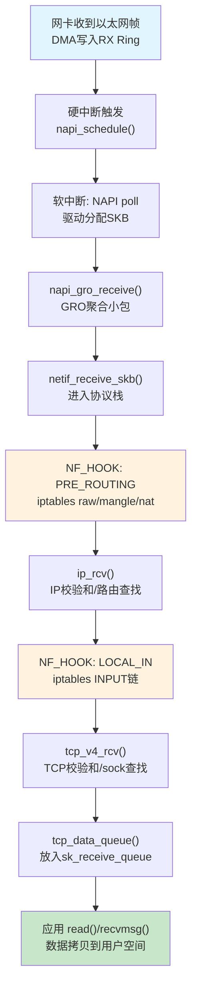
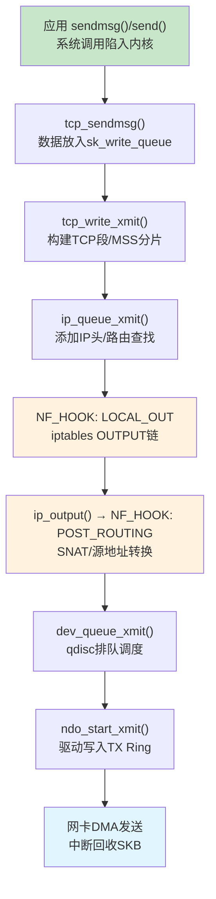

# 14.1.4 网络栈分层处理路径

> 所属章节：第14章 网络子系统 > 14.1 网络子系统架构
>
> 难度：[I][M] | 预计阅读时间：25分钟

## <span class="blue"> 本节导读

上一节我们搞懂了套接字层怎么打通内核与应用，但一个网络包究竟怎样走完"从网卡到应用"的收包之路，又怎样走完"从应用到网卡"的发包之旅？很多嵌入式工程师遇到网络丢包、延迟、不通的问题时，就是因为对这条完整路径不熟悉，排查时像无头苍蝇。<br>
本节带你走完收发包两条完整路径，看清每一层的关键函数和NF_HOOK钩子点的位置。学完后，你将拥有一张"内核网络地图"，遇到问题知道在哪一层下断点、抓关键信息。

## <span class="blue"> 收包路径：从网卡到应用 [I]

当以太网线上的电信号抵达网卡，数据就开始了一段漫长的"上行"之旅。我们先看全景，再逐个拆解。

```
┌────────────── 收包路径（RX Path）──────────────┐
│                                                │
│  网卡硬件 ──→ 驱动层 ──→ 内核网络栈 ──→ 应用层   │
│                                                │
│  eth0收包    napi_schedule   netif_receive_skb   │
│     │            │                  │           │
│     ▼            ▼                  ▼           │
│  DMA→内存    GRO聚合             协议分发        │
│              ip_rcv()             tcp_v4_rcv()   │
│              tcp_data_queue()      sock_recvmsg() │
└────────────────────────────────────────────────┘
```

### 完整收包流程

**第1步：网卡收到包，触发中断**<br>
网卡芯片收到以太网帧，通过DMA把数据写入预先分配好的环形缓冲区（RX Ring）。然后触发硬中断通知CPU。

**第2步：驱动分配SKB，拷贝数据**<br>
网卡驱动（比如`igb`、`e1000`、`mlx4_en`）的中断处理函数被调用。在NAPI模式下，驱动调用`napi_schedule()`把NAPI结构体加入poll列表，触发软中断。驱动的`poll`函数被调用后，分配`struct sk_buff`，把DMA缓冲区里的数据拷贝到SKB中。

> 💡 **提示**：现代驱动大量采用NAPI（New API）机制——收到包后不每个包都中断，而是先关闭中断，轮询一批包后再打开中断。这显著降低了高吞吐场景下的中断风暴。

**第3步：`napi_gro_receive()` → GRO聚合**<br>
驱动把SKB交给`napi_gro_receive()`。GRO（Generic Receive Offload）会检查是否可以把小包合并成大包，减少上层协议栈处理开销。GRO是软件实现的接收端卸载。

**第4步：`netif_receive_skb()` → 进入协议栈**<br>
经过GRO后，SKB进入`netif_receive_skb()`，这是数据正式离开驱动层、进入内核网络协议栈的分界点。到这里，SKB要开始"爬楼梯"了——从二层往上传。

> ⚠️ **陷阱**：`napi_gro_receive()`和`netif_receive_skb()`很容易被搞混。关键区别在于：前者走GRO聚合路径，后者不走GRO！如果你在内核代码里看到驱动直接调用`netif_receive_skb()`，那说明这个驱动跳过了GRO，小包不会被聚合。排查性能问题时，先确认驱动有没有走GRO。

**第5步：`NF_HOOK(NF_INET_PRE_ROUTING)` → Netfilter处理**<br>
进入三层之前，网络包先经过Netfilter的`PRE_ROUTING`钩子。iptables的raw表、mangle表、nat表在这里有机会处理包。这是防火墙规则第一次拦截收包的地方。

**第6步：`ip_rcv()` → IP层处理**<br>
`ip_rcv()`做IP层的标准检查：IP头校验和验证、包长度检查、选项处理。然后通过`ip_rcv_finish()`进入路由子系统，决定这个包是本地投递还是转发。

**第7步：`NF_HOOK(NF_INET_LOCAL_IN)` → 第二次Netfilter**<br>
如果路由判断是发给本机的包，走`LOCAL_IN`钩子。iptables的filter表（`INPUT`链）在这里生效——你常见的`iptables -A INPUT`规则就是拦截这个地方。

**第8步：`tcp_v4_rcv()` → TCP层处理**<br>
IP层把包交给TCP层。`tcp_v4_rcv()`做TCP校验和验证，然后根据四元组（源IP、目的IP、源端口、目的端口）查找对应的`struct sock`。找到后做序列号检查、ACK处理、窗口管理、状态机更新。

**第9步：`tcp_data_queue()` → 放入socket接收队列**<br>
校验通过的TCP数据段被放入socket的接收队列（`sk_receive_queue`）。如果应用层正在`read()`阻塞等待，这时候会被唤醒。

**第10步：应用`read()` → 从socket读取数据**<br>
应用层调用`read()`/`recv()`/`recvmsg()`，经过系统调用进入`sock_recvmsg()`，从`sk_receive_queue`取出数据，拷贝到用户空间缓冲区。

### 收包路径Mermaid图



## <span class="blue"> 发包路径：从应用到网卡 [I]

发包是收包的"镜像"，方向反过来，但每层的职责一一对应。应用层说"我要发数据"，数据就开始"下行"之旅。

```
┌────────────── 发包路径（TX Path）──────────────┐
│                                                │
│  应用层 ──→ 内核网络栈 ──→ 驱动层 ──→ 网卡硬件   │
│                                                │
│  sendmsg()   tcp_sendmsg()    dev_queue_xmit    │
│     │            │                  │           │
│     ▼            ▼                  ▼           │
│  用户数据    tcp_write_xmit()   ndo_start_xmit  │
│              ip_queue_xmit()    写入TX Ring      │
│              qdisc排队                         │
└────────────────────────────────────────────────┘
```

### 完整发包流程

**第1步：`sendmsg()` → 系统调用**<br>
应用层调用`send()`/`sendto()`/`sendmsg()`，陷入内核，进入`sock_sendmsg()`，最终调用对应协议的发送函数。

**第2步：`tcp_sendmsg()` → 放入发送队列**<br>
TCP协议的`tcp_sendmsg()`把用户数据拷贝到内核空间，放入socket的发送队列（`sk_write_queue`）。注意这时候数据还在socket层，还没有被封装成TCP段。

**第3步：`tcp_write_xmit()` → 构建TCP段**<br>
TCP根据MSS（最大段大小）、拥塞窗口、接收方窗口，把发送队列里的数据切分成合适的TCP段。每个段加上TCP头（源端口、目的端口、序列号、ACK号、标志位等），计算TCP校验和。

**第4步：`ip_queue_xmit()` → IP层封装**<br>
TCP段交给IP层。`ip_queue_xmit()`添加IP头（版本、头长度、TOS、总长度、TTL、协议号、源IP、目的IP），计算IP校验和，然后做路由查找确定出接口。

**第5步：`NF_HOOK(NF_INET_LOCAL_OUT)` → Netfilter处理**<br>
发包路径上的第一个Netfilter钩子。iptables的`OUTPUT`链和`mangle`表在这里生效。如果防火墙规则DROP了这个包，它就走不到网卡了。

**第6步：`NF_HOOK(NF_INET_POST_ROUTING)` → 出网前最后一次过滤**<br>
路由之后、`dev_queue_xmit()`之前，包经过`POST_ROUTING`钩子。iptables的`POSTROUTING`链、SNAT源地址转换在这里发生。

**第7步：`dev_queue_xmit()` → 进入qdisc队列**<br>
包进入设备层，先经过qdisc（队列规则）排队。默认的pfifo_fast队列在这里做简单的FIFO调度。如果配置了tc流量控制（比如HTB、CAKE），这里就是限速和整形生效的地方。

**第8步：驱动`ndo_start_xmit()` → 发送**<br>
qdisc从队列取出包，调用网卡驱动的`ndo_start_xmit()`。驱动把SKB数据写入TX Ring（DMA映射的环形缓冲区），然后通知网卡芯片发送。网卡发完后产生中断，驱动在中断里回收SKB。

### 发包路径Mermaid图



## <span class="blue"> 收发包路径中NF_HOOK的插入点 [M]

Netfilter的五个钩子点就像高速公路上的五个收费站，收包和发包路径经过不同的站。理解每个钩子的位置，是写iptables规则、开发内核模块的必备知识。

### NF_HOOK插入点总表

| 钩子点 | 路径中的位置 | 所在函数 | 典型用途 |
|--------|-------------|---------|---------|
| `NF_INET_PRE_ROUTING` | 收包：进入协议栈后、IP层处理前 | `netif_receive_skb` → `ip_rcv()` 之间 | raw表（连接跟踪前）、mangle表、DNAT目的地址转换 |
| `NF_INET_LOCAL_IN` | 收包：IP层处理后、传给本机传输层前 | `ip_local_deliver()` → `tcp_v4_rcv()` 之间 | filter表的INPUT链、本机接收过滤 |
| `NF_INET_FORWARD` | 转发包：IP层处理后、转发到出接口前 | `ip_forward()` 中 | filter表的FORWARD链、转发过滤 |
| `NF_INET_LOCAL_OUT` | 发包：本机传输层后、IP层封装前 | `ip_queue_xmit()` → `ip_output()` 之间 | filter表的OUTPUT链、本机发出过滤 |
| `NF_INET_POST_ROUTING` | 发包/转发：IP层处理完、出网卡前 | `ip_finish_output()` → `dev_queue_xmit()` 之间 | mangle表、nat表的SNAT、源地址转换 |

注意：收包路径只经过`PRE_ROUTING`和`LOCAL_IN`，发包路径经过`LOCAL_OUT`和`POST_ROUTING`，转发包经过`PRE_ROUTING` → `FORWARD` → `POST_ROUTING`。

```
         收包方向                                    发包方向
    ═══════════════════                       ═══════════════════
    
    ┌─────────────────┐                     ┌─────────────────┐
    │  PRE_ROUTING    │ ←── netif_receive   │   LOCAL_OUT     │
    │  (DNAT/raw)     │     _skb()之后       │  (OUTPUT链)     │
    └────────┬────────┘                     └────────┬────────┘
             │                                        │
    ┌────────▼────────┐                     ┌────────▼────────┐
    │    ip_rcv()     │                     │ ip_queue_xmit() │
    │  IP层处理/路由   │                     │   IP层封装       │
    └────────┬────────┘                     └────────┬────────┘
             │                                        │
    ┌────────▼────────┐                     ┌────────▼────────┐
    │   LOCAL_IN      │                     │ POST_ROUTING    │
    │  (INPUT链)      │                     │   (SNAT)        │
    └────────┬────────┘                     └────────┬────────┘
             │                                        │
    ┌────────▼────────┐                     ┌────────▼────────┐
    │  tcp_v4_rcv()   │                     │ dev_queue_xmit()│
    └─────────────────┘                     └─────────────────┘
```

### 收包路径中的代码调用链

```c
// 收包路径关键函数调用链（简化版）

// 1. 驱动层：NAPI poll 函数
static int igb_poll(struct napi_struct *napi, int budget)
{
    // ... 从RX Ring读取描述符
    napi_gro_receive(napi, skb);  // 走GRO聚合路径
    // ...
}

// 2. GRO → 协议栈入口
int napi_gro_receive(struct napi_struct *napi, struct sk_buff *skb)
{
    // GRO尝试合并小包
    gro_result_t ret = napi_skb_finish(dev_gro_receive(napi, skb), skb);
    // 最终调用 netif_receive_skb_internal(skb)
}

// 3. 进入协议栈分发
int netif_receive_skb(struct sk_buff *skb)
{
    // RPS：多核包分发（若启用）
    // 然后调用 __netif_receive_skb(skb)
    return __netif_receive_skb(skb);
}

// 4. 二层到三层的桥接 → 经过 PRE_ROUTING 钩子
static int __netif_receive_skb_core(struct sk_buff *skb, bool pfmemalloc)
{
    // ... 处理vlan、桥接等 ...
    // 调用 type_handler(skb) — 对于IP包，handler是 ip_rcv()
    ret = pt_prev->func(skb, skb->dev, pt_prev, orig_dev);
}

// 5. IP层入口 — 经过 PRE_ROUTING 钩子
int ip_rcv(struct sk_buff *skb, struct net_device *dev,
           struct packet_type *pt, struct net_device *orig_dev)
{
    // IP头合法性检查
    return NF_HOOK(NFPROTO_IPV4, NF_INET_PRE_ROUTING,
                   net, sk, skb, dev, NULL, ip_rcv_finish);
}

// 6. IP层本地投递 — 经过 LOCAL_IN 钩子
int ip_local_deliver(struct sk_buff *skb)
{
    // 分片重组（如果需要）
    return NF_HOOK(NFPROTO_IPV4, NF_INET_LOCAL_IN,
                   net, skb->sk, skb, skb->dev, NULL,
                   ip_local_deliver_finish);
}

// 7. TCP层入口
int tcp_v4_rcv(struct sk_buff *skb)
{
    // TCP校验和验证
    // 根据四元组查找 sock
    sk = __inet_lookup_skb(&tcp_hashinfo, skb, th->source, th->dest);
    // 状态机处理、序列号检查
    ret = tcp_v4_do_rcv(sk, skb);
}

// 8. 放入接收队列
int tcp_rcv_established(struct sock *sk, struct sk_buff *skb,
                        const struct tcphdr *th, unsigned int len)
{
    // 直接放入sk_receive_queue 或 prequeue
    eaten = tcp_queue_rcv(sk, skb, ...);
    // 唤醒等待的进程
    sk->sk_data_ready(sk);
}
```

## <span class="blue"> 每层关键函数和职责汇总 [I]

| 层级 | 关键函数 | 职责 | 输入 | 输出 |
|------|---------|------|------|------|
| **驱动层（RX）** | `napi_gro_receive()` | DMA数据拷贝到SKB、GRO聚合 | 网卡DMA缓冲区 | SKB（聚合后） |
| **驱动层（TX）** | `ndo_start_xmit()` | 将SKB写入TX Ring、触发网卡发送 | SKB（完整帧） | DMA发送请求 |
| **协议栈入口** | `netif_receive_skb()` | 二层到三层的分发点 | 二层SKB | 按协议分发到IP/ARP等 |
| **IP层（RX）** | `ip_rcv()` | IP头校验、路由查找 | IP数据报 | 本地投递或转发 |
| **IP层（TX）** | `ip_queue_xmit()` | 添加IP头、路由选择、TTL处理 | TCP段 | IP数据报 |
| **TCP层（RX）** | `tcp_v4_rcv()` | 校验和、sock查找、seq检查 | IP载荷 | 放入接收队列 |
| **TCP层（TX）** | `tcp_write_xmit()` | MSS分片、构建TCP头、计算校验和 | socket发送队列数据 | TCP段 |
| **Socket层** | `tcp_sendmsg()` | 用户数据拷贝到内核、放入发送队列 | 用户缓冲区 | sk_write_queue |
| **Socket层** | `sock_recvmsg()` | 从接收队列取数据、拷贝到用户空间 | sk_receive_queue | 用户缓冲区 |
| **Netfilter** | `NF_HOOK()` | 钩子回调执行、iptables规则匹配 | SKB | 放行/修改/DROP |
| **Qdisc** | `dev_queue_xmit()` | 包排队、流量调度、限速 | 待发SKB | 按顺序出队到驱动 |

> 💡 **提示**：理解完整路径是排查网络问题的基石。遇到丢包时，先确定是在哪一层丢的：用`ethtool -S eth0`看驱动层统计，用`iptables -L -v -n`看Netfilter层，用`netstat -s`看协议栈层，用`tcpdump`看链路层。

### 一个直观的类比

想象快递包裹从发货地到收货地的过程：

- **发包路径** = 你寄快递：写好内容（应用层）→ 装信封写收发地址（TCP层加端口）→ 贴快递单写省市（IP层加IP地址）→ 交到快递站排队（qdisc）→ 装车发走（驱动→网卡）
- **收包路径** = 你收快递：货车卸货（网卡→驱动）→ 分拣站扫码（GRO/`netif_receive_skb`）→ 安检检查（Netfilter/`ip_rcv`）→ 按门牌号送货（TCP层按端口找socket）→ 你签收打开（应用`read`）

> ⚠️ **陷阱**：很多工程师排查问题时只盯着应用层，却忘了数据可能在驱动层就被丢弃了。比如RX Ring太小导致驱动丢包，或者qdisc队列溢出导致发包被丢弃。 always 从底层往上层排查，先确认网卡统计，再逐层往上。

## <span class="blue"> 本节总结

| 要点 | 内容 |
|------|------|
| 收包路径 | 网卡→中断→NAPI poll→`napi_gro_receive`→`netif_receive_skb`→`NF_INET_PRE_ROUTING`→`ip_rcv`→`NF_INET_LOCAL_IN`→`tcp_v4_rcv`→`tcp_data_queue`→应用`read()` |
| 发包路径 | 应用`sendmsg()`→`tcp_sendmsg`→`tcp_write_xmit`→`ip_queue_xmit`→`NF_INET_LOCAL_OUT`→`NF_INET_POST_ROUTING`→`dev_queue_xmit`→`ndo_start_xmit`→网卡 |
| NF_HOOK五个点 | `PRE_ROUTING`、`LOCAL_IN`、`FORWARD`、`LOCAL_OUT`、`POST_ROUTING`，收包走前两个，发包走后两个，转发走第1-3-5 |
| GRO关键点 | 收包路径上`napi_gro_receive`走GRO聚合，`netif_receive_skb`不走GRO |
| 排查思路 | 网络问题排查应从底层（驱动统计）往上层（应用层）逐层确认 |
| 代码追踪 | 用`ftrace -l 'ip_rcv\|tcp_v4_rcv\|netif_receive_skb'`可实时追踪收包函数调用 |

## <span class="blue"> 下一步

**14.2.1 Netfilter的五个钩子点** — 我们已经知道NF_HOOK在网络路径中的位置，下一节将深入Netfilter框架本身：五个钩子的完整定义、iptable的表-链-规则结构、以及如何编写自己的Netfilter内核模块来过滤和修改数据包。

## <span class="blue"> 配套资源

- 源码阅读：`linux/net/core/dev.c`（`netif_receive_skb`、`dev_queue_xmit`）、`linux/net/ipv4/ip_input.c`（`ip_rcv`）、`linux/net/ipv4/tcp_ipv4.c`（`tcp_v4_rcv`）
- 文档：`Documentation/networking/datapath.rst`（内核数据路径文档）
- 调试命令：`cat /proc/net/snmp`（IP/TCP层统计）、`ethtool -S eth0`（驱动层统计）、`iptables -L -v -n`（Netfilter规则命中统计）
