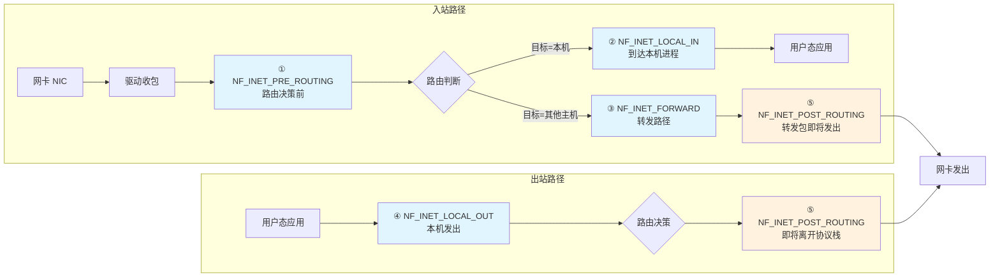

# 14.2.1 Netfilter的五个钩子点

> 所属章节：第14章 网络子系统 > 14.2 Netfilter框架
>
> 难度：[I][M] | 预计阅读时间：25分钟

## <span class="blue"> 本节导读

本节带你深入Netfilter框架的心脏——五个钩子点。如果说Linux网络协议栈是一条高速公路，那这五个钩子点就是沿途的五个检查站，数据包每经过一个都要接受"安检"。<br>
学完后，你将精准画出收发包路径上的钩子位置，理解每个钩子能做什么、不能做什么，明白iptables四个表与钩子的映射关系，并为后续学习conntrack和nftables打下坚实基础。

---

## <span class="blue"> 知识点219：五个钩子点的位置与工作机制 [I]

Netfilter是Linux内核中一个极为精巧的设计。它在网络协议栈的关键位置预埋了五个"钩子"（hook），让内核模块和用户的防火墙规则能够在数据包流转的特定时刻介入处理。这五个钩子点定义在内核头文件 `<linux/netfilter.h>` 中：

```c
/* include/linux/netfilter.h */
enum nf_inet_hooks {
    NF_INET_PRE_ROUTING,    /* 0 - 刚进入协议栈，路由前 */
    NF_INET_LOCAL_IN,       /* 1 - 目标为本机 */
    NF_INET_FORWARD,        /* 2 - 需要转发 */
    NF_INET_LOCAL_OUT,      /* 3 - 本机发出 */
    NF_INET_POST_ROUTING,   /* 4 - 即将离开协议栈 */
    NF_INET_NUMHOOKS,       /* 5 - 钩子总数 */
};
```

每个钩子点对应一个数字编号（0~4），这个编号在后续注册钩子函数时会用到。

### 收发包路径中的精确位置

下图展示了五个钩子点在数据包收发路径中的精确位置：



让我逐个拆解这五个钩子点的职责：

**① NF_INET_PRE_ROUTING** — 数据包刚从网卡进来，协议栈完成基本的校验（比如IP头校验和、包长度检查），但**还没有做路由决策**。这是你能拦截入站包的第一个机会。在这里，源地址NAT（SNAT）通常发生，因为路由前修改地址会影响后续的路由决策。conntrack（连接追踪）也在这里初始化。

**② NF_INET_LOCAL_IN** — 路由决策已做完，确定这个包是给本机的。此时数据包已经知道要送到哪个本地socket。这是过滤到达本机服务的最佳位置，比如你想拦截对SSH端口的访问，就在这里做。

**③ NF_INET_FORWARD** — 路由决策确定这个包需要转发到另一台主机。只有开启了IP转发功能（`net.ipv4.ip_forward=1`）的包才会走到这里。这是路由器/防火墙过滤转发流量的核心钩子。

**④ NF_INET_LOCAL_OUT** — 本机进程发出的数据包，在路由决策之前。注意与PRE_ROUTING的区别：PRE_ROUTING处理"从外面进来的"，LOCAL_OUT处理"从本机发出的"。

**⑤ NF_INET_POST_ROUTING** — 所有即将离开协议栈的包（无论是本机发出的还是转发的），都要经过这里。目标地址NAT（DNAT）和SNAT的最后阶段在这里完成，因为此时路由已经确定，最后修改地址后就可以直接发出。

> ⚠️ **陷阱**：`DROP` 在 `PRE_ROUTING` 阶段生效后，数据包就**不会**到达 `LOCAL_IN`。这意味着如果你在 `PRE_ROUTING` 丢弃了某个包，它既不会被本机接收，也不会被转发。规则放置的位置决定了作用的时机和范围，放错位置可能导致"明明规则写了放行，但包还是被丢"的困惑。

### NF_HOOK宏的调用机制

数据包在协议栈流转时，通过 `NF_HOOK` 宏触发钩子检查。这个宏本质上是一个条件调用：如果该钩子点有注册的回调函数，就依次执行；如果没有，直接放行。

```c
/* NF_HOOK 宏的简化逻辑 */
static inline int NF_HOOK(uint8_t pf, unsigned int hook,
                          struct net *net, struct sock *sk,
                          struct sk_buff *skb,
                          struct net_device *in,
                          struct net_device *out,
                          int (*okfn)(struct net *, struct sock *, 
                                      struct sk_buff *))
{
    int ret = nf_hook(pf, hook, net, sk, skb, in, out, okfn);
    if (ret == 1)  /* NF_ACCEPT */
        return okfn(net, sk, skb);  /* 继续协议栈处理 */
    return ret;
}
```

在IPv4协议栈中，钩子调用散布在关键位置。比如 `ip_rcv()` 函数的开头：

```c
/* net/ipv4/ip_input.c - ip_rcv() */
int ip_rcv(struct sk_buff *skb, struct net_device *dev, 
           struct packet_type *pt, struct net_device *orig_dev)
{
    /* ... 基本校验 ... */
    
    /* 进入PRE_ROUTING钩子点 */
    return NF_HOOK(NFPROTO_IPV4, NF_INET_PRE_ROUTING,
                   net, NULL, skb, dev, NULL,
                   ip_rcv_finish);
}
```

如果 `PRE_ROUTING` 的所有钩子都返回 `ACCEPT`，`ip_rcv_finish()` 就会被调用，继续路由决策。

### nf_hook_ops注册与处理

想在内核模块中使用钩子，你需要填充一个 `nf_hook_ops` 结构体并注册：

```c
#include <linux/netfilter.h>
#include <linux/netfilter_ipv4.h>

static unsigned int my_hook_func(void *priv,
                                  struct sk_buff *skb,
                                  const struct nf_hook_state *state)
{
    /* 在这里检查 skb，决定包的命运 */
    printk(KERN_INFO "Packet hit my hook!\n");
    return NF_ACCEPT;  /* 放行 */
}

static struct nf_hook_ops my_ops = {
    .hook     = my_hook_func,           /* 回调函数 */
    .pf       = NFPROTO_IPV4,           /* IPv4协议族 */
    .hooknum  = NF_INET_PRE_ROUTING,    /* 钩子点编号 */
    .priority = NF_IP_PRI_FIRST,        /* 优先级，越小越早执行 */
    .priv     = NULL,
};

static int __init my_init(void)
{
    return nf_register_net_hook(&init_net, &my_ops);
}

static void __exit my_exit(void)
{
    nf_unregister_net_hook(&init_net, &my_ops);
}
```

`priority` 字段决定了多个模块在同一个钩子点的执行顺序。数值越小优先级越高，越早被调用。

### 五个返回值详解

钩子回调函数的返回值决定了数据包的"命运"：

| 返回值 | 宏名 | 含义 | 后续处理 |
|:---|:---|:---|:---|
| 0 | `NF_DROP` | 丢弃数据包 | 释放skb，停止处理 |
| 1 | `NF_ACCEPT` | 放行，继续协议栈 | 调用 `okfn` 继续下一步 |
| 2 | `NF_STOLEN` | 数据包被"偷走" | 协议栈不再处理，由模块接管 |
| 3 | `NF_QUEUE` | 入队到用户空间 | 通过nfnetlink_queue送到用户态裁决 |
| 4 | `NF_REPEAT` | 重新处理 | 再次遍历当前钩子点的所有规则 |

`NF_STOLEN` 是一个有趣的值——当你返回它时，相当于告诉协议栈"这个包我接手了，你别管了"。常用于需要完全接管数据包处理的场景，比如某些 tunnel 实现。<br>
`NF_QUEUE` 是实现用户态防火墙的关键：内核把包挂到一个队列，用户态程序取出做决策（放行/丢弃），再把裁决结果传回内核。<br>
`NF_REPEAT` 使用较少，通常用于需要重新匹配规则链的场景。

**五个钩子点一览**：

| 钩子点名称 | 在路径中的位置 | 典型用途 | 返回值影响 |
|:---|:---|:---|:---|
| `NF_INET_PRE_ROUTING` | 入站，校验后、路由前 | DNAT、conntrack初始化、早期过滤 | DROP则包不进本机也不转发 |
| `NF_INET_LOCAL_IN` | 入站，路由后确认到本机 | 过滤到本机的服务（SSH/HTTP等） | DROP则本机应用收不到包 |
| `NF_INET_FORWARD` | 路由后确认需转发 | 转发防火墙规则、转发过滤 | DROP则包不被转发 |
| `NF_INET_LOCAL_OUT` | 出站，本机发出、路由前 | 过滤本机发出的流量 | DROP则本机应用发不出 |
| `NF_INET_POST_ROUTING` | 所有出站（本机+转发） | SNAT、Masquerade、最后修改 | DROP则包不离开本机 |

---

## <span class="blue"> 知识点220：iptables的四个表与Netfilter钩子的映射 [I]

iptables不是直接在Netfilter钩子上操作的——它引入了"表"（table）的概念来组织规则。每个表对应一类功能，在特定的钩子点挂接。

### 四个表的功能与钩子映射

| 表名 | 挂接的钩子点 | 优先级 | 功能 | 典型规则 |
|:---|:---|:---|:---|:---|
| `raw` | PRE_ROUTING、LOCAL_OUT | -300（高） | 连接追踪豁免、最早处理 | `iptables -t raw -A PREROUTING -j NOTRACK` |
| `mangle` | 全部5个钩子 | -150 | 修改包头（TTL/TOS/MARK等） | `iptables -t mangle -A PREROUTING -j TTL --ttl-set 64` |
| `nat` | PRE_ROUTING、LOCAL_IN、LOCAL_OUT、POST_ROUTING | -100（DNAT）/ +100（SNAT） | 地址/端口转换 | `iptables -t nat -A POSTROUTING -j MASQUERADE` |
| `filter` | LOCAL_IN、FORWARD、LOCAL_OUT | 0 | 包过滤（默认表） | `iptables -A INPUT -p tcp --dport 22 -j ACCEPT` |
| `security` | LOCAL_IN、FORWARD、LOCAL_OUT | +50（低） | SELinux安全标记 | 通常由SELinux自动管理 |

内核头文件 `linux/netfilter_ipv4.h` 中定义了精确的数字优先级：

```c
/* include/linux/netfilter_ipv4.h */
enum nf_ip_hook_priorities {
    NF_IP_PRI_FIRST              = INT_MIN,
    NF_IP_PRI_RAW_BEFORE_DEFRAG  = -450,
    NF_IP_PRI_CONNTRACK_DEFRAG   = -400,
    NF_IP_PRI_RAW                = -300,
    NF_IP_PRI_SELINUX_FIRST      = -225,
    NF_IP_PRI_CONNTRACK          = -200,
    NF_IP_PRI_MANGLE             = -150,
    NF_IP_PRI_NAT_DST            = -100,   /* DNAT */
    NF_IP_PRI_FILTER             = 0,       /* filter表 */
    NF_IP_PRI_SECURITY           = 50,
    NF_IP_PRI_NAT_SRC            = 100,     /* SNAT */
    NF_IP_PRI_CONNTRACK_HELPER   = 300,
    NF_IP_PRI_CONNTRACK_CONFIRM  = INT_MAX,
    NF_IP_PRI_LAST               = INT_MAX,
};
```

执行顺序遵循**优先级数值越小越早执行**的原则。一个入站包在 `PRE_ROUTING` 钩子点的处理顺序是：

```
raw(PREROUTING) → conntrack初始化 → mangle(PREROUTING) 
    → nat(PREROUTING,DNAT) → 路由决策
```

### conntrack在钩子中的执行

连接追踪（conntrack）不是一个独立的表，而是内嵌在钩子执行流程中的关键组件：

- **PRE_ROUTING** 钩子：conntrack在 `-400` 优先级执行分片重组（defrag），在 `-200` 优先级执行实际的连接追踪查找/创建
- **LOCAL_OUT** 钩子：同样做conntrack处理，确保本机发出的连接也被追踪

这意味着即使你不使用任何iptables规则，conntrack也可能在后台默默工作。想确认它是否启用？查看：

```bash
# 查看conntrack当前追踪的连接数
cat /proc/sys/net/netfilter/nf_conntrack_count
cat /proc/sys/net/netfilter/nf_conntrack_max
```

### iptables vs nftables

| 对比项 | iptables | nftables |
|:---|:---|:---|
| **用户接口** | 命令行工具 `iptables` | 命令行工具 `nft` |
| **规则格式** | 每规则独立，线性遍历 | 集合（set/map）支持，查找更快 |
| **性能** | O(n) 规则匹配 | O(log n) 或 O(1)，支持批量更新 |
| **内核实现** | 每个表独立内核模块，代码重复 | 统一虚拟机，更简洁 |
| **原子性** | 逐条规则添加，非原子 | 整表原子替换 |
| **IPv4/IPv6** | 分别用iptables/ip6tables | 统一处理inet族 |
| **推荐使用** | 旧系统兼容 | **新系统首选（2014+）** |

> 💡 **提示**：nftables从Linux 3.13（2014年）引入，已被广泛认为是iptables的继任者。如果你在2024年搭建新系统，**直接使用nftables** 而不是iptables。Debian 10+、Ubuntu 20.04+、RHEL 8+ 都已默认支持nftables。nftables后端更简洁，规则更新支持原子操作，还能原生支持集合（set）和映射（map），写规则时省掉大量重复。

iptables到nftables的迁移其实没那么痛苦。核心概念——表、链、规则——nftables都有，只是语法更统一。比如这条iptables规则：

```bash
iptables -t filter -A INPUT -p tcp --dport 22 -j ACCEPT
```

对应的nft规则：

```bash
nft add rule ip filter input tcp dport 22 accept
```

> ⚠️ **陷阱**：在nf_tables内核模块中，五个Netfilter钩子点的概念**完全保留**。nftables并没有替代Netfilter框架本身，它只是替代了iptables这个用户态工具+内核规则引擎。底层的钩子机制、返回值语义、优先级体系，nftables都是沿用的。

---

## <span class="blue"> 本节总结

| 要点 | 内容 |
|:---|:---|
| **五个钩子点** | PRE_ROUTING（入站/路由前）、LOCAL_IN（到本机）、FORWARD（转发）、LOCAL_OUT（本机发出）、POST_ROUTING（即将离开） |
| **钩子返回值** | ACCEPT（放行）、DROP（丢弃）、QUEUE（用户态裁决）、STOLEN（内核模块接管）、REPEAT（重新匹配） |
| **钩子注册** | 通过 `nf_hook_ops` + `nf_register_net_hook()` 注册，优先级决定同钩子的执行顺序 |
| **iptables四表** | raw（-300）→ mangle（-150）→ nat（DNAT -100 / SNAT +100）→ filter（0）→ security（+50） |
| **conntrack位置** | PRE_ROUTING和LOCAL_OUT钩子点内嵌执行，优先级-400（defrag）和-200（追踪） |
| **nftables趋势** | 2014年后新系统的首选，统一IPv4/IPv6，O(log n)匹配，原子规则更新 |

---

## <span class="blue"> 下一步

掌握了Netfilter的钩子点和iptables表结构后，14.2.2将深入讲解 **conntrack连接追踪**——它是NAT、状态防火墙（stateful firewall）的基石。理解conntrack如何维护连接状态表、如何与Netfilter钩子协作，是你读懂现代Linux防火墙工作原理的关键一步。

---

## <span class="blue"> 配套资源

- **内核源码**：`include/linux/netfilter.h`、`include/linux/netfilter_ipv4.h`、`net/netfilter/` 目录
- **文档**：`Documentation/networking/nf_conntrack-sysctl.rst`
- **命令速查**：`nft list ruleset` 查看当前nft规则、`conntrack -L` 查看连接追踪表、`iptables -t raw -L -v -n` 查看raw表规则
- **RFC参考**：RFC 6147（NAT）、RFC 3022（Traditional NAT）
