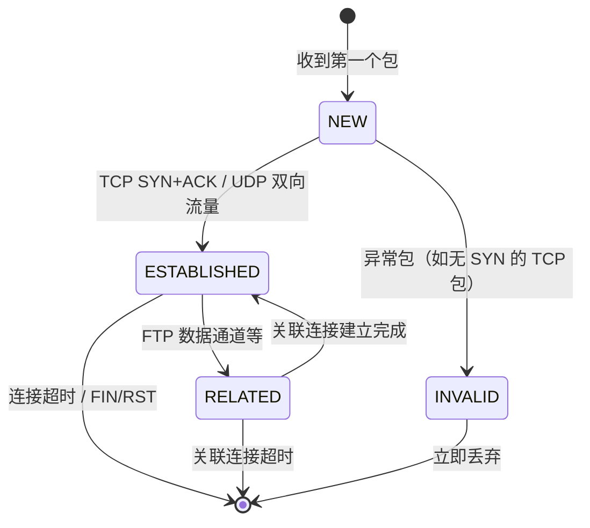

# 14.2.2 conntrack连接追踪

> 所属章节：第14章 网络子系统 > 14.2 Netfilter框架深入
>
> 难度：[I][M] | 预计阅读时间：15分钟

## <span class="blue"> 本节导读

Netfilter 框架最厉害的地方，不只是那五个钩子点，而是它懂得"记住"每一个网络连接的状态。这种能力叫做 connection tracking（连接追踪，简称 conntrack）。<br>
有了 conntrack，内核才能区分"这是一个全新连接的第一个包"还是"某个已有连接的回复包"。状态感知的防火墙规则、NAT 地址转换，全都建立在它之上。<br>
学完后，你将理解 conntrack 的四态状态机、内核如何维护连接表、以及高并发场景下调优的关键参数。

---

## <span class="blue"> conntrack 机制与状态机 [I]

当你在 iptables 里写一条 `-m state --state ESTABLISHED -j ACCEPT` 时，内核是怎么知道这个包属于已建立的连接呢？答案是 **conntrack**。

conntrack 的核心函数 `nf_conntrack_in()` 挂接在两个关键钩子点上：

| 钩子点 | 作用 |
|--------|------|
| `NF_INET_PRE_ROUTING` | 对进入本机的每个包做追踪，无论目标是本机还是转发 |
| `NF_INET_LOCAL_OUT` | 对本机发出的每个包做追踪 |

当一个包经过这两个钩子时，`nf_conntrack_in()` 会提取它的 **五元组**（源 IP、目的 IP、源端口、目的端口、协议号），在连接表中查找。找不到就新建一个条目，找到了就更新状态。

```c
// 简化的 conntrack 处理流程
unsigned int nf_conntrack_in(struct sk_buff *skb,
                              const struct nf_hook_state *state)
{
    // 1. 提取五元组，生成查找 key
    // 2. 在 nf_conntrack_hash 中查找已有条目
    // 3. 若未找到：分配新 conntrack 条目，状态设为 NEW
    // 4. 若找到：根据包方向更新状态机
    //    - SYN+ACK → ESTABLISHED
    //    - RST/FIN → 进入销毁流程
}
```

每个连接条目内部维护一个状态机。下面是最核心的四态转换：



### 四态速查表

| 状态 | 含义 | 触发条件 | 典型用途 |
|------|------|----------|----------|
| **NEW** | 新连接 | 第一个包（TCP SYN / 首个 UDP 包 / ICMP echo） | 控制入站连接的建立 |
| **ESTABLISHED** | 已建立 | 双向通信已确认（TCP SYN+ACK、UDP 看到回复） | 放行已建立连接的后续包 |
| **RELATED** | 关联连接 | 与现有连接相关的新连接（如 FTP 数据通道、ICMP error） | 让 FTP、SIP 等多通道协议正常工作 |
| **INVALID** | 无效/异常 | 无法识别、校验失败、状态不匹配 | 安全防御，通常直接 DROP |

ESTABLISHED 是日常规则里最常用的状态。iptables 中经典的"放行已建立连接"规则，靠的就是它：

```bash
# 放行所有已建立和相关连接，这是防火墙规则的第一行黄金法则
iptables -A INPUT -m state --state ESTABLISHED,RELATED -j ACCEPT
```

> 💡 **提示**：实时查看当前系统的连接表，直接读 `/proc/net/nf_conntrack`。每一行是一个被追踪的连接，包含五元组和当前状态。调试连接问题时，这个文件是你的好帮手：
> ```bash
> cat /proc/net/nf_conntrack | head -20
> ```

---

## <span class="blue"> 连接表结构与调优 [M]

所有 conntrack 条目都存在内核的哈希表 `nf_conntrack_hash` 中。这张表的大小和性能，直接影响高并发网络场景的稳定性。

### 关键参数一览

| 参数名 | 默认值 | 建议值（高并发） | 作用 | 设置路径 |
|--------|--------|-----------------|------|----------|
| `nf_conntrack_max` | 65536 | 1000000+ | 最大连接条目数 | `/proc/sys/net/netfilter/` |
| `nf_conntrack_buckets` | 65536 | 262144+ | 哈希桶数量，影响查找速度 | 同路径 |
| `nf_conntrack_tcp_timeout_established` | 5天 | 600（秒） | ESTABLISHED 状态超时时间 | 同路径 |
| `nf_conntrack_udp_timeout` | 30秒 | 根据场景调整 | UDP 连接无回复时的超时 | 同路径 |
| `nf_conntrack_udp_timeout_stream` | 120秒 | 根据场景调整 | 双向 UDP 流的超时 | 同路径 |

```bash
# 查看当前 conntrack 条目使用量和上限
cat /proc/sys/net/netfilter/nf_conntrack_count   # 当前数量
cat /proc/sys/net/netfilter/nf_conntrack_max     # 上限

# 高并发场景调优示例（写入 /etc/sysctl.conf 持久化）
sysctl -w net.netfilter.nf_conntrack_max=1048576
sysctl -w net.netfilter.nf_conntrack_buckets=262144
sysctl -w net.netfilter.nf_conntrack_tcp_timeout_established=600
```

> ⚠️ **陷阱**：`nf_conntrack_max` 的默认值只有 **65536**。在网关、负载均衡器、Docker 宿主机等高并发转发场景中，连接数很容易触顶。一旦打满，新连接会被 **直接 DROP**，而日志里你可能只看到零星的丢包，却定位不到原因。 symptoms 表现为偶发连接超时、部分用户无法访问，非常隐蔽。

### NAT 为什么依赖 conntrack

SNAT 和 DNAT 都依赖连接表做反向转换。举个例子：

```
内网主机 192.168.1.10:12345 → SNAT → 公网 1.2.3.4:50001 → 访问外网
```

当回复包回来时，内核需要知道 "1.2.3.4:50001" 应该转回 "192.168.1.10:12345"。这个映射关系就保存在 conntrack 条目中。如果 conntrack 表满了、或者条目提前过期，回复包找不到映射，NAT 就失效了。

```
外网回复包 → DNAT(反向) → 192.168.1.10:12345
              ↑
         依赖 conntrack 条目中的反向映射
```

这也是为什么 NAT 网关必须格外关注 `nf_conntrack_max` 和超时参数。调大 max 不够，还要配合缩短 established timeout，让不活跃的连接尽快释放。

---

## <span class="blue"> 本节总结

| 要点 | 内容 |
|------|------|
| 入口函数 | `nf_conntrack_in()` 挂在 `PRE_ROUTING` 和 `LOCAL_OUT` |
| 核心结构 | `nf_conntrack_hash` 哈希表，五元组做 key |
| 四态模型 | NEW → ESTABLISHED / RELATED / INVALID |
| 容量限制 | `nf_conntrack_max` 默认 65536，高并发必调 |
| 调优方向 | 加大 max + buckets，缩短 timeout，平衡内存与性能 |
| NAT 依赖 | SNAT/DNAT 的反向转换完全依赖 conntrack 条目 |

---

## <span class="blue"> 下一步

**14.2.3 Netfilter的性能影响与优化** — 深入分析 conntrack 和 iptables 规则链对网络延迟和吞吐量的影响，学习如何在嵌入式设备上做性能优化和规则精简。

---

## <span class="blue"> 配套资源

- 查看连接表：`cat /proc/net/nf_conntrack`
- 查看计数与上限：`cat /proc/sys/net/netfilter/nf_conntrack_{count,max}`
- 内核文档：`Documentation/networking/nf_conntrack-sysctl.rst`
- 调优参数路径：`/proc/sys/net/netfilter/`
