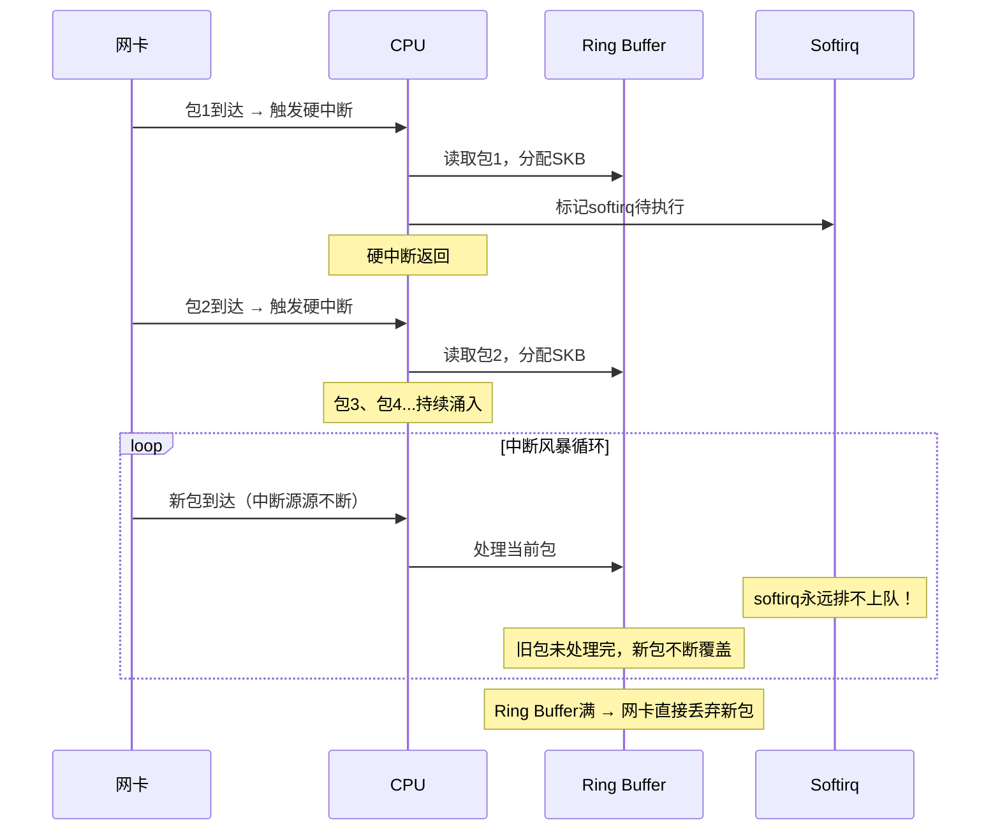

# 14.3.1 传统中断收包的问题

> 所属章节：第14章 网络子系统 > 14.3 NAPI与高性能收包
>
> 难度：[I] | 预计阅读时间：10分钟

## <span class="blue"> 本节导读

本节带你走进Linux内核处理网络包最原始的"中断驱动"模式，看看它在高负载下为什么会演变成一场CPU的"噩梦"。<br>
你将理解**中断风暴**的成因与量化分析方法，学会识别`ring buffer`满导致的隐形丢包，并为下节学习NAPI的混合模式打下基础。

---

## <span class="blue"> 传统中断收包与中断风暴 [I]

### 传统中断收包的完整流程

在早期的Linux内核中，网卡每收到一个数据包，都会走一条"重量级"的处理路径：

```
网卡收到包 → 触发硬件中断 → CPU跳转到中断handler
    → 分配SKB（skb_alloc） → 拷贝数据到SKB
    → 提交给协议栈（netif_rx） → 执行软中断处理
    → 协议栈逐层解析 → 送达用户态
```

**每个包都对应一次完整的中断上下文切换。**<br>
这意味着CPU每次都要：保存现场 → 执行handler → 恢复现场。频繁的模式切换本身就是一笔不小的开销。

### 量化分析：带宽增长带来的中断压力

让我们算一笔账。以太网帧最小64字节，加上前导码和帧间距，线路上每个包大约占**84字节**的带宽。据此可以估算不同带宽下的包转发速率（pps, packets per second）：

| 带宽 | 理论PPS | 每秒中断数（传统模式） | CPU Cycles需求（~1000 cycles/包） | 是否可持续（3GHz CPU） |
|:---:|:---:|:---:|:---:|:---:|
| 1 Gbps | ~1.48 Mpps | ~148万 | ~1.48B | ✅ 占用~49% |
| 10 Gbps | ~14.8 Mpps | ~1480万 | ~14.8B | ❌ 占用~493% |
| 100 Gbps | ~148 Mpps | ~1.48亿 | ~148B | ❌ 占用~4933% |

看到了吗？在10Gbps下，光是处理中断就需要近**5个3GHz CPU核心**全力运转。而实际情况更糟——1000 cycles只是理想估算，真实场景中SKB分配、内存拷贝、cache miss等因素会让单包处理成本飙升到**3000~5000 cycles**。

> 💡 **提示**：想验证你的系统是否遭遇中断风暴？`watch -n1 'cat /proc/interrupts'` 是个好工具。如果某个网卡对应的中断号在短时间内计数激增，且CPU大量时间消耗在`si`（softirq）或`hi`（hardirq）上，你就中招了。

### 中断风暴：恶性循环的时序

高负载下，中断处理本身会制造更多的延迟，而这些延迟又会加剧问题——形成一个经典的恶性循环：



看懂了吗？CPU被硬中断钉死在**中断上下文**，根本没有机会回到进程上下文去执行softirq。协议栈的后续处理（IP层、TCP层）全靠softirq驱动，softirq饿死意味着——**包进了ring buffer却走不完协议栈**。

### Softirq饥饿与隐形丢包

这是最阴险的地方。当ring buffer满了之后，网卡会直接丢弃新到达的包。这些丢包**不会**让CPU使用率报表——因为丢弃发生在网卡硬件层面，CPU根本没机会见到这些包。

> ⚠️ **陷阱**：通过`top`看到CPU只有50%，但网络性能奇差无比？别被误导了！ring buffer满导致的丢包**不会**推高CPU占用。你要看的是`ifconfig`或`ethtool -S eth0`里的`rx_missed_errors`、`rx_overruns`计数，以及`/proc/net/snmp`里的`RcvbufErrors`。

```bash
# 查看网卡级别的丢包统计
$ ethtool -S eth0 | grep -E "missed|error|drop"
     rx_missed_errors: 15234    # ← ring buffer满导致的丢包！
     rx_errors: 0
     rx_dropped: 0
```

这个`rx_missed_errors`计数增长，配合不太高的CPU占用，就是传统中断模式瓶颈的铁证。

### 传统模式的根本矛盾

传统中断驱动模式的核心矛盾可以总结为一句话：**"通知机制"与"处理效率"之间的错配**。中断是面向"偶尔有事件需要处理"设计的，但现代网络是**持续的高吞吐流**。用"单包单中断"的方式处理流水线级别的数据量，本质上是用错误的抽象解决错误规模的问题。

---

## <span class="blue"> 本节总结

| 核心要点 | 关键结论 |
|:---|:---|
| 传统收包流程 | 每包触发一次硬中断，完整上下文切换开销 |
| 10Gbps PPS | ~14.8 Mpps，远超单核CPU处理能力 |
| 中断风暴成因 | 硬中断频率过高 → softirq无法执行 → 协议栈处理停滞 |
| 隐形丢包特征 | Ring buffer满导致网卡丢包，`rx_missed_errors`增长，CPU未必满载 |
| 诊断方法 | `/proc/interrupts`看中断激增 + `ethtool -S`看missed_errors |
| 根本问题 | 中断是事件驱动模型，不匹配高吞吐流的持续处理需求 |

---

## <span class="blue"> 下一步

**14.3.2 NAPI的混合模式机制** —— 内核如何解决这个困境？答案是一套"**先中断通知，后轮询收割**"的混合策略：用一次中断唤醒轮询器，然后在轮询模式下批量处理多个包。这正是我们下节要深入剖析的NAPI（New API）核心机制。

---

## <span class="blue"> 配套资源

- 实验：用`iperf3`打满1Gbps/10Gbps链路，同时观察`/proc/interrupts`和`ethtool -S`的变化
- 内核文档：`Documentation/networking/napi.rst`
- 工具链：`ethtool`、`/proc/interrupts`、`mpstat`（观察`%irq`和`%soft`列）
