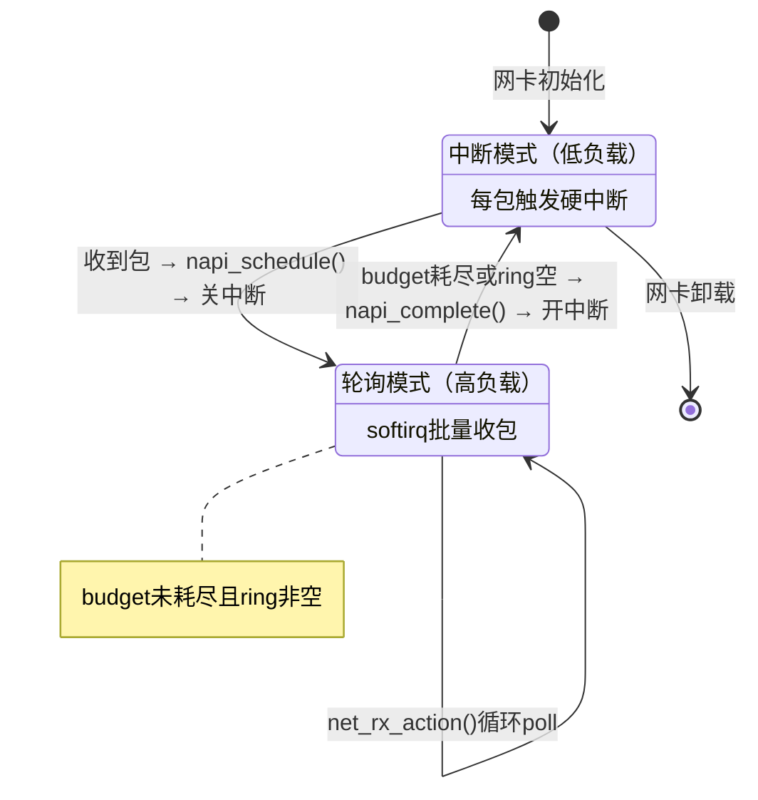
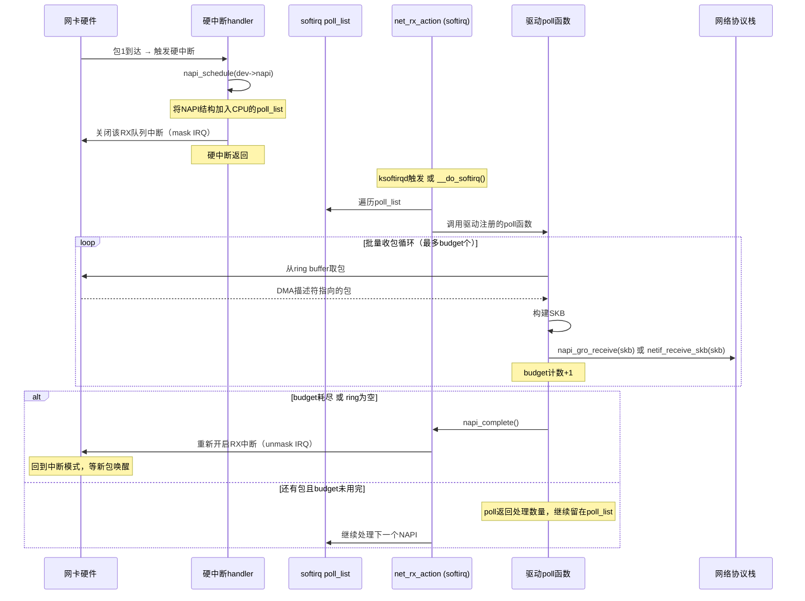

# 14.3.2 NAPI的混合模式机制

> 所属章节：第14章 网络子系统 > 14.3 NAPI与高性能收包
>
> 难度：[E][M] | 预计阅读时间：18分钟

## <span class="blue"> 本节导读

上节我们看到，传统"每包一中断"的模式在高负载下会演变成中断风暴，把CPU钉死在中断上下文。本节带你深入Linux内核的**NAPI（New API）**机制——一种"中断+轮询"的混合收包策略，它是现代Linux网络驱动的标配方案。<br>
学完后，你将理解NAPI的完整状态转换流程，掌握budget配额控制与GRO大包合并的工作原理，并学会评估NAPI驱动中的关键调参方向。

---

## <span class="blue"> NAPI的混合收包机制 [E][M]

### 从"全中断"到"混合模式"的设计思路

NAPI的核心洞察非常朴素：**低负载时中断更高效（没有包的时候CPU不该空转），高负载时轮询更高效（批量处理摊平上下文切换开销）**。与其二选一，不如让驱动在两种模式之间自动切换。

这就是NAPI的"混合模式"本质——**用一次中断唤醒，用轮询收割，用配额控制退出时机**。

### NAPI状态转换：中断模式与轮询模式



看懂这张图了吗？NAPI驱动只有两个状态。关键在转换条件：**从轮询切回中断的唯一条件是"poll干完活"**——要么把budget额度花光，要么ring buffer被清空。只要ring里还有包且预算没用完，就继续轮询。

### NAPI完整收包流程：六步走



来，我们一步步拆解这个流程。

**Step 1：网卡收到第一个包，触发硬中断。** 这和传统模式一样，是个"叫醒服务"。

**Step 2：中断handler里调用`napi_schedule()`。** 这个函数把驱动的NAPI结构体挂到当前CPU的`poll_list`链表上，然后触发NET_RX_SOFTIRQ软中断。注意——**此时硬中断还没关**。

**Step 3：关闭该队列的硬中断。** 多数驱动在这里写寄存器mask掉RX中断。这一步至关重要：从此刻起，不管网卡收到多少新包，都不再触发硬中断。CPU不会被反复"打扰"。

**Step 4：softirq上下文执行`net_rx_action()`。** 内核的软中断机制会遍历`poll_list`，逐个调用驱动注册的poll函数。

**Step 5：poll函数批量收包。** 驱动从ring buffer里取包，构建SKB，提交给协议栈。每处理一个包，budget计数减一。这个过程一直循环，直到达到两个退出条件之一。

**Step 6：`napi_complete()`重新开中断。** 当budget耗尽（收够了配额）或ring为空（没包可收了），驱动调用`napi_complete()`把自己从`poll_list`移除，并重新开启RX中断。如果ring为空，系统回到低功耗的"中断等待"状态；如果budget耗尽但ring还有包，说明负载很高，下一个到达的包会再次触发中断、再次进入轮询——**高负载下系统本质上维持在轮询模式**。

> 💡 **提示**：NAPI是Linux网络收包的默认机制——从内核2.6时代延续至今，几乎所有现代网卡驱动都使用NAPI。你用的`e1000e`、`igb`、`ixgbe`、`mlx4_en`、`virtio-net`……全部是NAPI驱动。理解NAPI就是理解Linux收包的"主流范式"。

### NAPI驱动代码骨架

下面是一个简化但完整的NAPI驱动示例，展示了关键API的用法：

```c
/* ===== 1. 定义NAPI结构体 ===== */
struct my_priv {
    struct napi_struct napi;    /* NAPI核心结构体 */
    struct net_device *netdev;
    /* ... 其他私有数据 ... */
};

/* ===== 2. 驱动的poll函数 ===== */
static int my_poll(struct napi_struct *napi, int budget)
{
    struct my_priv *priv = container_of(napi, struct my_priv, napi);
    int rx_count = 0;

    /* 批量从ring buffer收包，最多收budget个 */
    while (rx_count < budget) {
        struct sk_buff *skb = my_rx_one_packet(priv);
        if (!skb)
            break;              /* ring为空，没包可收了 */

        napi_gro_receive(napi, skb);  /* 走GRO路径提交协议栈 */
        rx_count++;
    }

    /* 退出条件判断 */
    if (rx_count < budget) {
        /* ring为空 → 收完了，可以切回中断模式 */
        napi_complete(napi);
        my_enable_rx_irq(priv); /* 重新开启RX中断 */
    }
    /* 如果rx_count == budget，不调用napi_complete()
     * 自己留在poll_list里，net_rx_action()会再次调用poll
     */

    return rx_count;
}

/* ===== 3. 网卡初始化时注册NAPI ===== */
static int my_netdev_init(struct net_device *netdev)
{
    struct my_priv *priv = netdev_priv(netdev);

    /* 参数：napi结构体、poll函数、weight(即budget配额)、设备 */
    netif_napi_add(netdev, &priv->napi, my_poll, 64);
    /* ... */
    return 0;
}

/* ===== 4. 硬中断handler ===== */
static irqreturn_t my_irq_handler(int irq, void *data)
{
    struct my_priv *priv = data;

    /* 确认中断来源... */

    if (rx_has_packets(priv)) {
        my_disable_rx_irq(priv);    /* 关RX中断 */
        napi_schedule(&priv->napi); /* 触发NAPI轮询 */
    }

    return IRQ_HANDLED;
}
```

四段代码对应四个关键阶段：**注册**（`netif_napi_add`）、**唤醒**（`napi_schedule`）、**轮询**（`poll`函数）、**完成**（`napi_complete`）。驱动开发者只需要实现poll函数和IRQ handler，NAPI框架会负责调度。

### 中断模式 vs NAPI模式：全面对比

| 对比维度 | 传统中断模式 | NAPI混合模式 |
|:---:|:---|:---|
| **触发机制** | 每包触发一次硬中断 | 首包中断唤醒，后续轮询批量处理 |
| **上下文** | 硬中断上下文处理每包 | 硬中断只做唤醒，softirq批量收包 |
| **延迟表现** | 低负载延迟极低 | 低负载延迟相近；高负载延迟更稳定 |
| **吞吐上限** | 受限于中断频率，单核~1-2 Mpps | 批量处理摊平开销，单核可达~10+ Mpps |
| **CPU占用** | 高负载时100%耗在上下文切换 | 更多cycle用于实际收包，效率更高 |
| **中断频率** | 与PPS成正比（10Gbps下千万级/秒） | 中断频率大幅降低（仅用于唤醒） |
| **适用场景** | 低带宽、低延迟要求的嵌入式场景 | 通用场景，尤其高吞吐服务器 |
| **内核支持** | 早期内核（2.4之前） | 2.6+默认机制 |

### NAPI关键参数与调参

| 参数 | 默认值 | 作用 | 调优方向 |
|:---:|:---:|:---|:---|
| **`budget`** | 64 | 单次`net_rx_action()`轮询最多处理的包数 | 高吞吐场景适度增大（如256/512），但需权衡延迟 |
| **`weight`** (per NAPI) | 64 | 单个NAPI结构一次poll的配额 | 通常与budget一致；多队列网卡每个队列独立计算 |
| **`gro_max_size`** | 64KB (65536) | GRO合并后单个大包的最大长度 | 除非有jumbo frame需求，一般不动 |
| **`gro_flush_timeout`** | 1ms | GRO聚合等待超时，超时强制flush | 延迟敏感场景可减小，吞吐敏感场景可增大 |
| **`netdev_budget`** | 300 | 全局budget上限，所有NAPI共享 | 多队列高负载系统可增大 |
| **`netdev_budget_usecs`** | 8000 (8ms) | 单次`net_rx_action()`最大执行时间 | 防止softirq霸占CPU过久 |

这些参数在哪里？`budget`和`weight`是驱动注册和运行时控制的核心；`netdev_budget`和`netdev_budget_usecs`是sysctl可调项：

```bash
# 查看/调整全局budget
$ sysctl net.core.netdev_budget
net.core.netdev_budget = 300

$ sysctl net.core.netdev_budget_usecs
net.core.netdev_budget_usecs = 8000

# 临时调大（高吞吐场景测试）
$ sysctl -w net.core.netdev_budget=600
$ sysctl -w net.core.netdev_budget_usecs=16000
```

> ⚠️ **陷阱**：`budget`设得太大（比如2048或更高）→ 单次`net_rx_action()`轮询霸占CPU时间过长 → 同一CPU上的其他softirq（如NET_TX_SOFTIRQ、BLOCK_SOFTIRQ）和进程被延迟。 Symptoms：`ping`延迟抖动大、TCP重传增多、`ksoftirqd`某颗CPU使用率100%而其他CPU_idle。记住：**budget是"每次最多收多少"，不是"越多越好"**。

---

## <span class="blue"> GRO：NAPI轮询中的大包合并 [E]

### 为什么需要GRO

NAPI解决了"收包效率"问题，但还有一个问题没解决：协议栈遍历开销。

想象一个视频流场景，发送方把数据切成了**1500字节的小包**（以太网MTU限制）。这些包属于同一个TCP流、同一个四元组。如果每个小包都独立走一遍IP层→TCP层→socket队列的完整协议栈路径，那就意味着：

- 每个小包都要查路由表
- 每个小包都要做TCP校验和验证
- 每个小包都要单独拷贝到用户态

这很浪费。GRO（Generic Receive Offload）的思路是：**在NAPI轮询阶段，把属于同一个流的小包先合并成一个"超级大包"，再提交给协议栈。** 协议栈只遍历一次，处理一个大包的成本远低于处理几十个小包。

### GRO工作流程

```
小包1 (1500B, stream A) ──┐
小包2 (1500B, stream A) ──┼→ napi_gro_receive() → [GRO哈希表匹配] → 合并为超级大包
小包3 (1500B, stream A) ──┘                              ↓
小包4 (1500B, stream B) ─────→ [不同流，不匹配] ─────────┘
                                                    合并到64KB上限或flush超时
                                                          ↓
                                                   netif_receive_skb()
                                                          ↓
                                                    协议栈只处理一次
```

`napi_gro_receive()`是GRO的入口函数。它在NAPI的poll函数中被调用，替代了原来的`netif_receive_skb()`。

### GRO核心机制

GRO内部维护一个**按流哈希的表**。收到包时：

1. 计算包的流标识（五元组哈希：源IP、目的IP、源端口、目的端口、协议）
2. 在GRO表中查找匹配的聚合队列
3. 如果找到且未超大小上限，将包附加到该队列
4. 如果没找到或已满，创建新的聚合条目
5. 当聚合包达到`gro_max_size`（默认64KB）或flush超时，**flush**到协议栈

```c
/* GRO在驱动poll函数中的典型用法 */
static int my_poll(struct napi_struct *napi, int budget)
{
    /* ... 收包循环 ... */
    while (rx_count < budget) {
        skb = my_rx_one_packet(priv);
        if (!skb)
            break;

        /* 走GRO路径：可能合并，也可能直接提交 */
        napi_gro_receive(napi, skb);  /* ← 替代 netif_receive_skb(skb) */
        rx_count++;
    }
    /* ... */
}
```

### GRO的收益与限制

GRO带来的收益在"小包高吞吐"场景非常显著：

| 场景 | 无GRO | 有GRO | 提升 |
|:---:|:---:|:---:|:---:|
| 1500B小包视频流 | 协议栈遍历N次 | 协议栈遍历1次（每64KB） | 延迟↓ 吞吐↑ |
| 大包为主（>MTU） | 几乎无合并机会 | 可能有反效果 | 收益有限 |
| 需要精确时间戳 | 合并后丢失包级时间戳 | 信息丢失 | 不适用 |

> 💡 **提示**：GRO默认开启，且与硬件TSO/LRO配合工作。但如果你在做网络测量、抓包分析，或者依赖逐包的精确时间戳，可能需要用`ethtool -K eth0 gro off`临时关闭GRO观察原始包行为。

---

## <span class="blue"> 本节总结

| 核心要点 | 关键结论 |
|:---|:---|
| NAPI设计哲学 | "中断唤醒 + 轮询收割"的混合模式，兼顾低负载延迟与高负载吞吐 |
| 状态转换 | 中断模式 ↔ 轮询模式，转换由`napi_schedule()`和`napi_complete()`驱动 |
| 六步流程 | 收包→中断→schedule→关中断→softirq轮询→complete→开中断 |
| budget控制 | 默认64，限制单次poll包数，防止softirq霸占CPU |
| 高负载行为 | budget耗尽前持续轮询，系统本质处于轮询模式 |
| 低负载行为 | ring空后`napi_complete()`开中断，回到中断等待状态 |
| GRO作用 | `napi_gro_receive()`合并同流小包，减少协议栈遍历次数 |
| GRO上限 | `gro_max_size`默认64KB，超时flush机制保证延迟可控 |
| 调参方向 | `netdev_budget`、`netdev_budget_usecs`按需调整，切忌盲目增大 |
| 陷阱 | budget过大→CPU被ksoftirqd钉死→其他任务延迟抖动 |

---

## <span class="blue"> 下一步

**14.3.3 socket缓冲区与网络调参** —— NAPI和GRO让我们高效地把包送入协议栈，但协议栈之后呢？SKB在socket缓冲区里如何排队？`tcp_rmem`、`netdev_max_backlog`这些参数如何影响实际吞吐？下节我们将深入socket层缓冲区管理和网络核心调参的实战技巧。

---

## <span class="blue"> 配套资源

- 内核文档：`Documentation/networking/napi.rst`
- 代码路径：`net/core/dev.c`（`net_rx_action()`实现）、`include/linux/netdevice.h`（NAPI结构体定义）
- 调参接口：`/proc/sys/net/core/netdev_budget`、`/proc/sys/net/core/netdev_budget_usecs`
- 诊断工具：`ethtool -k eth0`（查看GRO/NAPI状态）、`mpstat -P ALL 1`（观察softirq分布）、`bpftool`（跟踪NAPI调度事件）
- 实验：用`iperf3 -u -b 0`打流，配合`sysctl`调整budget观察`ksoftirqd` CPU占比与吞吐变化
