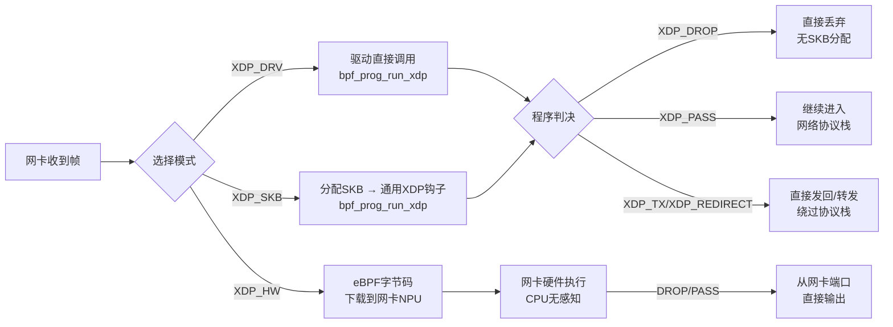

# 14.4.1 XDP概述与三种模式

> 所属章节：第14章 网络子系统 > 14.4 eBPF/XDP实战
>
> 难度：[E] Expert / [M] Master | 预计阅读时间：15分钟

## <span class="blue"> 本节导读

你已经学过了eBPF的基础，现在让我们把目光投向**最快的**包处理路径——XDP。XDP允许你在网络数据包进入内核协议栈之前就在驱动层拦截和处理它，这意味着什么？意味着你可以在CPU指令级别响应网络流量。<br>

本节带你理解XDP在Linux网络架构中的独特定位，深入对比三种运行模式（DRV/SKB/HW）的利弊，并学会如何检查网卡支持和加载XDP程序。<br>

学完后，你将能根据实际硬件环境选择最优的XDP模式，避开"虚拟机陷阱"，并亲手完成第一个XDP程序加载。

## <span class="blue"> XDP的定位：在数据包命中最前端 [E]

要理解XDP的价值，先想象一下数据包进入Linux系统的旅程。正常情况下，一个数据包要经过这样的路径：

**网卡DMA → 驱动NAPI轮询 → 分配SKB → 进入网络栈 → 协议处理 → socket层**

每一步都有开销：内存分配、中断处理、协议解析……<br>

XDP（eXpress Data Path）做的事情简单粗暴——它在**驱动层收到数据包的最早时刻**就执行你的eBPF程序，此时连SKB（socket buffer）都还没创建。你的程序可以直接决定这个包的"命运"：丢弃、转发、修改，或者放行让它继续走正常网络栈。

```
┌─────────────────────────────────────────────────────────────────┐
│                    正常网络栈 vs XDP处理路径                        │
├─────────────────────────────────────────────────────────────────┤
│                                                                 │
│  传统路径：   网卡 → 驱动 → 分配SKB → 网络栈 → 协议层 → 应用     │
│                   ↑                                             │
│  XDP路径：   网卡 → 驱动 → [XDP eBPF程序] → (PASS才进栈)        │
│                              ↑                                  │
│                         最早处理点                                │
│                                                                 │
│  关键区别：XDP阶段还没有SKB！只有原始的DMA buffer（xdp_buff）      │
│                                                                 │
└─────────────────────────────────────────────────────────────────┘
```

为什么这很重要？因为SKB的分配和初始化本身就是一笔不小的开销。在高吞吐场景下（比如DDoS清洗、负载均衡），你根本不需要关心TCP/UDP的具体内容——你只想快速地做一个决定："这个包该不该活着"。XDP就是为这种场景而生的。

> 💡 **提示**：XDP处理的上下文叫`xdp_buff`，它比`sk_buff`轻量得多，只包含帧数据和一些基本的元信息。当你需要**重定向**或**传递**包时，XDP会根据动作按需创建SKB。

## <span class="blue"> 三种运行模式：DRV、SKB、HW [M]

XDP的灵活性体现在它支持三种运行模式。选择哪种模式，取决于你的网卡能力和性能诉求。这是做XDP开发必须做的第一个决策。

### XDP_DRV（驱动原生模式）

这是最理想的模式。网卡驱动本身集成了XDP支持，收到数据包后直接在软中断上下文中调用`bpf_prog_run_xdp()`执行你的eBPF程序。整个过程**不分配SKB**，没有额外的内存拷贝，延迟最低。

要支持XDP_DRV，网卡驱动必须实现`ndo_bpf`回调。目前主流的驱动如`ixgbe`、`i40e`、`mlx5e`、`bnxt_en`等都支持。

### XDP_SKB（通用SKB模式）

这是一个"fallback"机制。如果你的网卡驱动不支持原生XDP，内核会退回到SKB路径——先按正常流程分配SKB，然后在通用XDP钩子点执行eBPF程序。所有网卡都支持这种模式，但性能大打折扣，因为SKB已经分配好了。

> ⚠️ **陷阱**：**虚拟机环境通常只支持XDP_SKB模式**。因为虚拟网卡驱动（如virtio-net）往往没有实现原生XDP钩子，你的XDP程序虽然能跑，但性能比物理机上的XDP_DRV差5到10倍。如果你在VM里做XDP压测，结果会很让人沮丧——这不是XDP的问题，是虚拟化的限制。

### XDP_HW（硬件卸载模式）

这是最快的模式——你的eBPF程序被直接**烧录到网卡硬件**（SmartNIC）中执行。数据包在网卡内部就被处理，连主机的CPU都还没看到数据。目前只有高端SmartNIC（如NVIDIA/Mellanox BlueField、Intel IPU、Netronome Agilio）支持。

> 💡 **提示**：XDP_DRV的性能通常比XDP_SKB高**5-10倍**。如果硬件条件允许，务必优先尝试DRV模式。如果你在服务器上运行`ip link set xdp`时没加`drv`参数却自动成功了，记得检查实际挂载的是哪种模式。

### 三种模式对比

| 模式 | 性能 | 兼容性 | 所需支持 | 适用场景 | 加载方式 |
|------|------|--------|----------|----------|----------|
| **XDP_DRV** | 极高（~10Mpps/核） | 需驱动支持 | 驱动实现`ndo_bpf`回调 | 物理机高吞吐包处理 | `ip link set dev eth0 xdp obj prog.o` |
| **XDP_SKB** | 低（~1-2Mpps/核） | 所有网卡通用 | 内核XDP通用层 | 开发测试、虚拟机环境 | 自动fallback，或显式指定`xdpgeneric` |
| **XDP_HW** | 最高（网卡线速） | 极少网卡支持 | SmartNIC硬件支持 | 卸载DDoS防护、流分类 | `ip link set dev eth0 xdpoffload obj prog.o` |

### 数据路径对比



从图中可以看出，三种模式的最大差异在于**eBPF程序执行的时机和位置**。XDP_DRV和XDP_SKB在软件层执行，但DRV避开了SKB分配；XDP_HW则完全绕过了主机CPU。

### 检查网卡支持与加载程序

在动手之前，先确认你的网卡到底支持什么模式。下面的脚本组合了检查和加载两个步骤：

```bash
#!/bin/bash
# === 检查网卡XDP支持能力 ===
IFACE="eth0"

# 1. 查看驱动是否支持XDP_DRV
# 如果驱动支持，ethtool会显示xdp相关的特性
ethtool -i $IFACE | grep driver

# 2. 查看当前XDP挂载状态
ip link show dev $IFACE
# 输出示例：
# 2: eth0: <BROADCAST,MULTICAST,UP> mtu 1500 xdp/id:123 ...
# 其中 xdp/id:123 表示XDP_DRV模式
# xdp/id:123 后面带 [drv] 或 [generic] 标记

# 3. 查看内核日志确认实际挂载模式
dmesg | grep -i xdp | tail -5

# === 加载XDP程序（三种方式） ===

# 方式A：优先尝试DRV模式（推荐）
ip link set dev $IFACE xdp obj prog.o sec xdp_prog
# 如果驱动不支持，这条命令会失败

# 方式B：显式指定generic模式（兼容性fallback）
ip link set dev $IFACE xdpgeneric obj prog.o sec xdp_prog

# 方式C：显式指定HW offload模式（需要SmartNIC）
ip link set dev $IFACE xdpoffload obj prog.o sec xdp_prog

# === 卸载XDP程序 ===
ip link set dev $IFACE xdp off
```

上面代码中，`ip link set xdp`命令会自动尝试DRV模式；如果驱动不支持，命令会报错。这就是你要主动选择模式的原因——别指望自动fallback，失败了你得知道。

> ⚠️ **陷阱**：`ip link set`加载XDP程序时，如果省略`sec`参数，默认使用ELF段名`xdp`。但不少BPF编译器默认把程序放在`xdp_prog`段里，省略`sec`会导致"找不到程序"的错误。养成显式指定段名的习惯。

### 模式选择的决策流程

面对一个新环境，该选哪种模式？按这个优先级来：

```
┌─────────────────────────────────────────────────────────┐
│                    XDP模式选择决策                        │
├─────────────────────────────────────────────────────────┤
│                                                         │
│  1. 检查网卡是否是SmartNIC（BlueField/Agilio/IPU）       │
│     ├─ 是 → 尝试 XDP_HW（xdpoffload）                   │
│     └─ 否 → 继续                                        │
│                                                         │
│  2. 检查驱动是否支持XDP原生（ethtool / dmesg）           │
│     ├─ 是 → 使用 XDP_DRV（默认加载方式）                 │
│     └─ 否 → 继续                                        │
│                                                         │
│  3. 最终 fallback → XDP_SKB（xdpgeneric）               │
│     （性能差，但一定能跑）                                │
│                                                         │
│  注意：虚拟机通常直接跳到第3步！                          │
│                                                         │
└─────────────────────────────────────────────────────────┘
```

### XDP与网络栈的关系

一个常见的误解是"XDP替换了网络栈"。并不是。XDP只是在网络栈**前面加了一道关卡**。你的eBPF程序返回`XDP_PASS`时，数据包才会进入正常的网络协议栈处理流程；返回其他动作（`XDP_DROP`、`XDP_TX`、`XDP_REDIRECT`、`XDP_ABORTED`）则根本不会走到协议栈。

这意味着XDP和网络栈是**互补关系**，不是替代关系。你可以让大部分包在XDP层被快速处理，只把需要深度协议解析的包`PASS`进内核栈。这个设计非常巧妙。

## <span class="blue"> 本节总结

| 要点 | 内容 |
|------|------|
| **XDP定位** | 驱动层最早包处理点，SKB分配之前执行eBPF程序 |
| **XDP_DRV** | 驱动原生支持，无SKB分配，性能最高（~10Mpps/核），需驱动支持 `ndo_bpf` |
| **XDP_SKB** | 通用SKB路径，所有网卡兼容，性能最低（~1-2Mpps/核），适合开发和虚拟机 |
| **XDP_HW** | 硬件SmartNIC执行，CPU零参与，需专用网卡（BlueField等） |
| **模式选择优先级** | 优先DRV → 其次SKB（fallback）→ 有SmartNIC时尝试HW |
| **关键认知** | XDP是网络栈的前置关卡，只有`XDP_PASS`才进入正常协议栈 |

## <span class="blue"> 下一步

掌握了XDP的三种运行模式后，下一节 `14.4.2 XDP的四种动作` 将深入讲解eBPF程序返回的四个动作码——`XDP_DROP`、`XDP_PASS`、`XDP_TX`、`XDP_REDIRECT`——以及它们各自的使用场景和内核实现细节。你会学会如何根据业务逻辑选择正确的动作，以及`XDP_REDIRECT`如何驱动高速包转发。

## <span class="blue"> 配套资源

- **内核源码**：`net/core/dev.c` → `netif_receive_generic_xdp()`（XDP_SKB路径）、`ndo_bpf`驱动回调
- **官方文档**：内核文档 `Documentation/networking/xdp.rst`
- **推荐工具**：`xdp-tools` 项目（libxdp + 示例程序），GitHub: `xdp-project/xdp-tools`
- **参考论文**：《The eXpress Data Path: Fast Programmable Packet Processing in the Operating System Kernel》（ToMM 2018）
