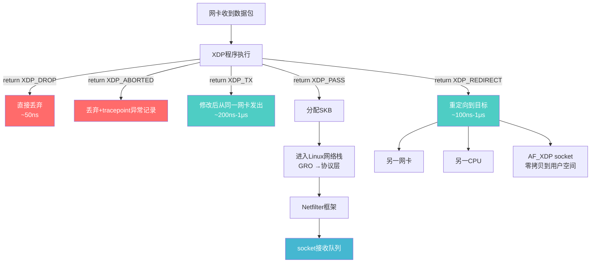
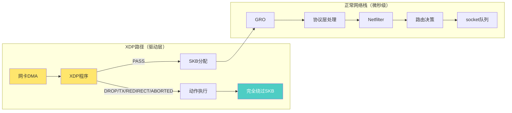

# 14.4.2 XDP的四种动作

> 所属章节：第14章 网络子系统 > 14.4 XDP与高性能包处理
>
> 难度：[E][M] | 预计阅读时间：15分钟

## <span class="blue"> 本节导读

上一节你写了一个最简单的XDP程序，见识了eBPF在驱动层拦截数据包的能力。但那个`XDP_PASS`只是冰山一角——XDP真正的威力在于它能对数据包做出**五种不同的处置决定**。

本节带你深入理解XDP的四种核心动作（加一种错误状态），以及它们与Linux网络栈的精确关系。<br>
学完后，你将清楚知道：什么场景该用`XDP_DROP`直接丢包，什么时候该用`XDP_TX`做负载均衡，`XDP_REDIRECT`又如何将数据包"瞬移"到另一个CPU或用户空间。最关键的是，你会明白为什么XDP能绕过SKB分配达到纳秒级延迟。

---

## <span class="blue"> 知识点228：XDP的四种核心动作与XDP_ABORTED [E][M]

XDP程序执行完毕后，必须返回一个`enum xdp_action`值，告诉内核"对这个包怎么处理"。这就像交通指挥员的手势——每种动作代表一条完全不同的"车道"。

```c
/* include/uapi/linux/bpf.h */
enum xdp_action {
    XDP_ABORTED = 0,   /* 程序出错，丢弃并记录 */
    XDP_DROP    = 1,   /* 静默丢弃 */
    XDP_PASS    = 2,   /* 进入正常网络栈 */
    XDP_TX      = 3,   /* 从同一网卡发出去 */
    XDP_REDIRECT= 4,   /* 重定向到另一接口/CPU/socket */
};
```

这五个值的返回值决定了数据包的命运。下面逐个拆解。

### XDP_DROP：最快的丢包方式

`XDP_DROP`是XDP最知名的动作——直接丢弃数据包，**不做任何SKB分配**，**不进任何网络栈**。

延迟是多少？约**50-100纳秒**。对比一下：iptables在Netfilter层面丢包需要~5-10微秒（含SKB分配和规则遍历），差了整整**100倍**。

```c
/* XDP_DROP示例：丢弃所有TCP端口80的包（模拟DDoS过滤） */
SEC("xdp")
int ddos_filter(struct xdp_md *ctx)
{
    void *data_end = (void *)(long)ctx->data_end;
    void *data     = (void *)(long)ctx->data;
    struct ethhdr *eth = data;

    /* 边界检查——eBPF验证器强制要求 */
    if ((void *)(eth + 1) > data_end)
        return XDP_DROP;   /* 畸形包，直接丢 */

    if (eth->h_proto != __constant_htons(ETH_P_IP))
        return XDP_PASS;   /* 非IP包，放行 */

    struct iphdr *ip = (void *)(eth + 1);
    if ((void *)(ip + 1) > data_end)
        return XDP_DROP;

    if (ip->protocol != IPPROTO_TCP)
        return XDP_PASS;

    struct tcphdr *tcp = (void *)ip + (ip->ihl * 4);
    if ((void *)(tcp + 1) > data_end)
        return XDP_DROP;

    /* 目标端口80？丢弃——可能是攻击流量 */
    if (tcp->dest == __constant_htons(80))
        return XDP_DROP;   /* ~50ns丢包，不分配SKB */

    return XDP_PASS;
}
```

> 💡 **提示**：DDoS防护用`XDP_DROP`——50ns丢包比iptables快1000倍。Cloudflare的全球DDoS缓解系统就是基于XDP，单核可处理数百万pps（packets per second）的恶意流量。

### XDP_PASS：进入正常网络栈

`XDP_PASS`是最保守的选择——"我不处理这个包，交给正常的网络栈"。此时内核会：

1. 分配`sk_buff`结构体
2. 将数据包从DMA缓冲区复制/引用到SKB
3. 进入正常的网络栈流程（GRO →协议层 →Netfilter →socket）

这个路径的延迟会跳到**微秒级**（10-50μs），因为你付了SKB分配的"门票钱"。但它的兼容性最好——上层的一切功能（Netfilter、路由、conntrack、socket）都能正常工作。

### XDP_TX：从哪来，回哪去（但内容已改）

`XDP_TX`告诉驱动："这个包不用上送了，直接从**同一个网卡**发出去"。

典型场景是**负载均衡器**：你收到一个客户端请求，修改目的MAC地址（或IP），然后原路发回交换机，让它转发给后端服务器。

```c
/* XDP_TX示例：MAC层负载均衡——修改目的MAC后转发 */
#define BACKEND_MAC {0x00, 0x11, 0x22, 0x33, 0x44, 0x55}

SEC("xdp")
int l4_lb(struct xdp_md *ctx)
{
    void *data_end = (void *)(long)ctx->data_end;
    void *data     = (void *)(long)ctx->data;
    struct ethhdr *eth = data;

    if ((void *)(eth + 1) > data_end)
        return XDP_DROP;

    /* 只处理IPv4 TCP包 */
    if (eth->h_proto != __constant_htons(ETH_P_IP))
        return XDP_PASS;

    /* 修改目的MAC为后端服务器 */
    unsigned char dst_mac[] = BACKEND_MAC;
    __builtin_memcpy(eth->h_dest, dst_mac, ETH_ALEN);

    /* 可选：修改源MAC为当前网卡MAC */
    /* __builtin_memcpy(eth->h_source, iface_mac, ETH_ALEN); */

    return XDP_TX;   /* 从同一网卡发出，不走网络栈 */
}
```

关键点：`XDP_TX`发生在驱动层，**不分配SKB**，延迟通常在几百纳秒到1微秒之间。Facebook的Katran L4负载均衡器就是用这个机制，单台服务器可达千万级pps。

### XDP_REDIRECT："瞬移"到别处

`XDP_REDIRECT`是XDP的"终极形态"——将数据包重定向到三个可能的目的地：

| 重定向目标 | API | 典型场景 |
|-----------|-----|---------|
| 另一个网络接口 | `bpf_redirect(ifindex, flags)` | 网桥/路由器绕过内核网络栈 |
| 另一个CPU | `bpf_redirect_map(&cpu_map, cpu, 0)` | 多核RSS负载均衡 |
| AF_XDP socket | `bpf_redirect_map(&xsks_map, idx, 0)` | 用户空间DPDK式零拷贝接收 |

重定向到**AF_XDP socket**是最激动人心的路径——数据包直接从驱动层DMA缓冲区"映射"到用户空间，**零拷贝**，延迟可达**亚微秒级**。这是绕过整个内核网络栈的最快方式。

### XDP_ABORTED：程序有bug的信号

`XDP_ABORTED`不是正常动作——它是内核的"安全气囊"。当你的XDP程序出现未处理的异常（比如空指针解引用、除零、越界访问被验证器漏检），内核会自动返回`XDP_ABORTED`，并记录一个**tracepoint事件**。

> ⚠️ **陷阱**：`XDP_ABORTED`意味着程序有bug——检查tracepoint事件！在生产环境中看到`XDP_ABORTED`要立即排查。用`perf record -e xdp:xdp_exception`捕获这些事件，它们会告诉你哪个程序、哪个接口触发了异常。

```bash
# 监控XDP异常事件
sudo perf record -e xdp:xdp_exception -a
sudo perf script
# 输出示例：
# xdp_exception: prog_id=42 action=ABORTED ifindex=eth0
```

---

### 四种动作对比表

| 动作 | 延迟 | SKB分配 | 代码示例 | 典型场景 |
|------|------|---------|---------|---------|
| `XDP_DROP` | ~50-100ns | ❌ 无 | `return XDP_DROP;` | DDoS防护、ACL黑名单、速率限制超限丢包 |
| `XDP_PASS` | ~10-50μs | ✅ 有 | `return XDP_PASS;` | 正常业务流量、需Netfilter/conntrack的包 |
| `XDP_TX` | ~200ns-1μs | ❌ 无 | `return XDP_TX;` | L4负载均衡、透明代理、 hairpin转发 |
| `XDP_REDIRECT` | ~100ns-1μs | ❌ 无 | `bpf_redirect_map(...)` | AF_XDP零拷贝、多核分流、高速转发 |
| `XDP_ABORTED` | ~50-100ns | ❌ 无 | 无（内核自动） | 程序bug时的安全回退 |

---

### 四种动作数据流图



---

## <span class="blue"> 知识点229：XDP与网络栈的关系——为什么XDP这么快 [E]

理解了五种动作后，我们来看看一个根本问题：**XDP为什么比正常网络栈快这么多？**

答案藏在一个数据结构里——**`sk_buff`**。

### SKB：Linux网络的"万精油"结构

`sk_buff`（简称SKB）是Linux网络栈的核心数据结构，承载了从驱动到socket的全部元数据：协议头指针、路由信息、Netfilter标记、conntrack状态、VLAN标签、checksum状态……一个SKB结构体本身就有**200+字节**。

正常路径下，每个数据包都要：
1. **分配**一个SKB（kmem_cache_alloc，可能触发 slab 分配）
2. **初始化**所有字段
3. 在网络栈各层之间**传递**
4. 最终**释放**

这个开销在10Gbps+的网络中变得不可忽略。

### XDP的"绕过哲学"

XDP的核心设计哲学是：**如果不需要网络栈的功能，就不付SKB的"门票钱"**。



看这张图，`XDP_DROP`、`XDP_TX`、`XDP_REDIRECT`、`XDP_ABORTED`四条路径都在SKB分配之前"拐了出去"。只有`XDP_PASS`会进入正常的网络栈流程。

### XDP的位置：网络栈的"最前线"

```
用户空间    [应用程序]
              ↑↓ 系统调用
内核空间    [socket层]
              ↑↓
            [TCP/UDP层]
              ↑↓
            [IP层]
              ↑↓
            [Netfilter钩子]
              ↑↓
            [网络层核心]
              ↑↓
            [GRO/RPS]
              ↑↓
    ┌───────────────────────┐
    │  ← XDP在这里！（驱动层） │  ← 最早的数据包处理点
    │  XDP_DROP / XDP_TX     │     绕过SKB = 高性能关键
    │  XDP_REDIRECT / XDP_PASS│
    └───────────────────────┘
              ↑↓ DMA
硬件        [网卡NIC]
```

XDP位于驱动层，`napi_poll`读取RX ring之后、任何SKB分配之前。这是软件能触及数据包的**最早位置**。所有需要Netfilter、conntrack、socket语义的操作必须走`XDP_PASS`路径；而纯粹的包过滤、转发、负载均衡则可以用XDP的旁路动作，享受数量级的性能提升。

### 一个关键结论

| 返回值 | 是否进入网络栈 | 是否分配SKB | 延迟量级 |
|--------|--------------|------------|---------|
| `XDP_DROP` | ❌ | ❌ | ~50-100ns |
| `XDP_TX` | ❌ | ❌ | ~200ns-1μs |
| `XDP_REDIRECT` | ❌ | ❌ | ~100ns-1μs |
| `XDP_ABORTED` | ❌ | ❌ | ~50-100ns |
| `XDP_PASS` | ✅ | ✅ | ~10-50μs |

这就是为什么XDP被描述为"一个分岔路口"：左边是绕过网络栈的高速通道（DROP/TX/REDIRECT），右边是功能完备但较慢的标准网络栈（PASS）。

> 💡 **提示**：设计XDP程序时，问自己："这个功能真的需要SKB和网络栈吗？"如果答案是否定的，果断用旁路动作——你会收获10-100倍的延迟提升。

---

## <span class="blue"> 本节总结

| 项目 | 内容 |
|------|------|
| **核心概念** | XDP五种返回值：`XDP_DROP`、`XDP_PASS`、`XDP_TX`、`XDP_REDIRECT`、`XDP_ABORTED` |
| **性能关键** | `XDP_DROP`/`XDP_TX`/`XDP_REDIRECT`在SKB分配前"拐走"数据包，绕过整个网络栈 |
| **延迟对比** | 旁路动作50-1000ns vs `XDP_PASS`的10-50μs，差距10-1000倍 |
| **关键场景** | DDoS过滤(DROP)、L4负载均衡(TX)、AF_XDP零拷贝(REDIRECT) |
| **调试要点** | `XDP_ABORTED` = 程序有bug，立即用`perf trace xdp_exception`排查 |
| **设计原则** | 不需要Netfilter/socket语义时，永远优先选择旁路动作 |

---

## <span class="blue"> 下一步

理解了XDP的动作机制后，下一节`14.4.3 eBPF验证器与BPF maps`将揭开两个关键谜题：

1. **eBPF验证器**如何确保你的XDP程序不会陷入死循环、不会越界访问内存——以及那些让你抓狂的"R0 invalid mem access"错误是什么意思
2. **BPF maps**如何让XDP程序与用户空间共享数据——实现动态配置、统计计数、连接状态表

这是从"玩具程序"走向"生产级XDP系统"的必经之路。

---

## <span class="blue"> 配套资源

- **内核源码**：`include/uapi/linux/bpf.h` — `enum xdp_action`定义
- **tracepoint**：`/sys/kernel/debug/tracing/events/xdp/xdp_exception/` — XDP异常事件
- **工具**：`perf record -e xdp:xdp_exception` 监控ABORTED事件
- **参考实现**：Cloudflare `xdpcap`、Facebook `Katran`、Cilium eBPF数据路径
- **RFC**：XDP框架设计文档 — kernel Documentation `networking/xdp.rst`
