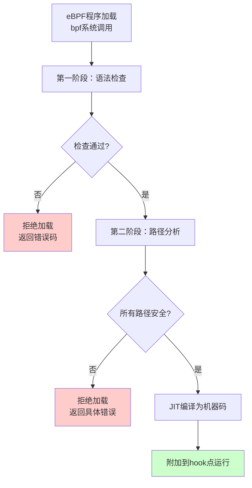

# 14.4.3 eBPF验证器与BPF Maps

> 所属章节：第14章 网络子系统 > 14.4 eBPF与网络可编程
>
> 难度：[E][M] | 预计阅读时间：15分钟

## <span class="blue"> 本节导读

你已经知道eBPF程序在内核中运行，但有没有想过——**谁来保证这段代码不会搞崩你的内核？** 答案就是eBPF验证器（Verifier）。它是eBPF安全模型的核心防线，也是你写eBPF代码时最常"打交道"的角色。<br>
本节带你深入理解验证器的工作机制和安全规则，以及BPF maps这个内核与用户空间之间的"数据桥梁"。<br>
学完后，你将能读懂验证器报错信息、正确声明和使用BPF maps，并掌握调试eBPF加载失败的实用技巧。

---

## <span class="blue"> eBPF验证器：内核的守门人 [E]

eBPF验证器本质上是一个**静态分析引擎**，它在程序加载到内核之前，逐条指令地"审查"你的代码。只有通过全部检查，程序才能获得运行许可证。

### 验证器的核心工作流程

验证器的工作分为两个阶段：



**第一阶段**做基础检查：指令格式是否合法、是否有未定义的跳转目标、是否违反指令数限制（默认最大100万条指令）。<br>
**第二阶段**是核心——对程序的**所有可能执行路径**进行符号执行，追踪每个寄存器的类型和取值范围，确保不存在任何不安全的内存访问。

### 五大安全规则

| 编号 | 规则 | 说明 | 违反后果 |
|:---:|:---|:---|:---|
| 1 | **内存访问必须有边界检查** | 所有指针解引用前，必须证明访问范围在合法内存内 | `invalid memory access` |
| 2 | **循环必须能证明有界** | 验证器会展开循环或证明迭代次数有上限 | `back-edge from insn X to Y` |
| 3 | **不允许递归调用** | eBPF程序不能调用自身，也不能形成循环调用链 | `back-edge detected` |
| 4 | **指令数限制** | 默认最多100万条指令（验证展开后） | `BPF program is too large` |
| 5 | **禁止任意内核地址访问** | 只能通过helper函数（如`bpf_probe_read`）安全访问 | `R0 invalid mem access` |

验证器的分析非常保守——**只要它无法证明安全，就会拒绝**。这意味着即使你的代码实际上没问题，但如果验证器无法推导出边界条件，依然会被打回。

> ⚠️ **陷阱**：XDP程序被verifier拒绝是最常见的加载失败原因。新手常犯的错误是：直接从数据包指针读取数据时忘记做长度检查。记住——**任何`data`指针的解引用前，都必须确认`data + offset < data_end`**。

### 验证器常见拒绝原因速查表

| 错误信息 | 根因 | 修复方法 |
|:---|:---|:---|
| `invalid memory access` | 缺少边界检查，指针访问超出合法范围 | 在解引用前添加`if (ptr + off > end) return X;` |
| `back-edge from insn X to Y` | 存在无法证明有界的循环或跳转 | 使用`#pragma unroll`展开循环，或确保循环上限可推导 |
| `BPF program is too large` | 验证展开后指令数超过1M限制 | 简化逻辑、减少循环展开次数、拆分多个程序 |
| `math between pkt pointer and register with unbounded min value` | 包指针与未验证范围的寄存器做算术运算 | 先对寄存器做范围检查，再参与指针运算 |
| `R0 invalid mem access 'inv'` | 使用了未初始化的寄存器 | 确保所有寄存器在使用前被正确赋值 |
| `cannot write into packet` | 尝试修改只读的数据包区域 | XDP只读模式下只能读不能写，确认程序类型权限 |

> 💡 **提示**：遇到验证器报错时，加上`-d`参数加载可以输出详细的验证日志：`bpftool prog load xdp.o /sys/fs/bpf/xdp -d`。日志会逐条显示验证器对每个寄存器的推导过程，虽然信息量大，但定位问题非常精准。

---

## <span class="blue"> BPF Maps：内核与用户空间的数据桥梁 [M]

BPF map是eBPF中**唯一**的内核与用户空间共享数据的机制。它是一个通用的键值对存储，你可以把它理解为内核里的一个"哈希表"或"数组"，内核eBPF程序和用户空间程序都能读写。

### Map类型全景

| 类型 | 键/值结构 | 特点 | 适用场景 |
|:---|:---|:---|:---|
| `BPF_MAP_TYPE_ARRAY` | 索引/任意 | 固定大小，O(1)访问，不能删除 | 计数器、配置参数 |
| `BPF_MAP_TYPE_HASH` | 任意/任意 | 动态扩容，哈希存储 | 连接跟踪、会话表 |
| `BPF_MAP_TYPE_PERCPU_ARRAY` | 索引/任意 | 每个CPU独立副本，无竞争 | 高频计数器（无锁） |
| `BPF_MAP_TYPE_LRU_HASH` | 任意/任意 | 自动淘汰最少使用的条目 | 缓存、有限大小的连接表 |
| `BPF_MAP_TYPE_SOCKMAP` | 索引/socket | 存储socket引用，可用于转发 | 套接字重定向、负载均衡 |
| `BPF_MAP_TYPE_PROG_ARRAY` | 索引/程序fd | 存储eBPF程序引用，支持尾调用 | 程序模块化、协议分派 |
| `BPF_MAP_TYPE_DEVMAP` | 索引/ifindex | 存储网络设备映射 | XDP批量转发到指定网卡 |

> 💡 **提示**：`PERCPU`系列的map每个CPU有独立副本，读写不需要加锁，性能极高。但要注意——**读取时需要把各个CPU的值累加**才能得到全局总量。

### Map的声明与访问

在内核eBPF程序（C语言）中声明和使用map：

```c
// 声明一个HASH类型的map：跟踪每个IP的数据包计数
struct {
    __uint(type, BPF_MAP_TYPE_HASH);           // 类型：哈希表
    __uint(max_entries, 1024);                 // 最多1024个条目
    __type(key, __u32);                        // key：IPv4地址
    __type(value, __u64);                      // value：计数器
} ip_packet_cnt SEC(".maps");

// XDP程序中读写map
SEC("xdp")
int xdp_count_packets(struct xdp_md *ctx)
{
    __u32 src_ip = ...;   // 从数据包解析出的源IP
    __u64 *cnt;

    // 查找已有计数器
    cnt = bpf_map_lookup_elem(&ip_packet_cnt, &src_ip);
    if (cnt) {
        // IP已存在，计数+1
        __sync_fetch_and_add(cnt, 1);          // 原子加1
    } else {
        // 新IP，初始化为1
        __u64 init_val = 1;
        bpf_map_update_elem(&ip_packet_cnt, &src_ip, &init_val, BPF_ANY);
    }

    return XDP_PASS;
}
```

用户空间程序通过`bpf()`系统调用访问同一个map：

```c
#include <bpf/libbpf.h>

int main()
{
    struct bpf_object *obj;
    struct bpf_map *map;
    int map_fd;
    __u32 key, next_key;
    __u64 value;

    // 加载eBPF程序
    obj = bpf_object__open_file("xdp_prog.o", NULL);
    bpf_object__load(obj);

    // 获取map的文件描述符
    map = bpf_object__find_map_by_name(obj, "ip_packet_cnt");
    map_fd = bpf_map__fd(map);

    // 遍历所有条目
    key = 0;
    while (bpf_map_get_next_key(map_fd, &key, &next_key) == 0) {
        key = next_key;
        bpf_map_lookup_elem(map_fd, &key, &value);
        printf("IP: %08x, Count: %llu\n", key, value);
    }

    bpf_object__close(obj);
    return 0;
}
```

用户空间和内核访问的是**同一个map实例**——内核eBPF程序在数据包到达时实时更新计数，用户空间程序可以定期读取统计信息。

### Map操作API速查

| 操作 | 内核Helper函数 | 用户空间API | 说明 |
|:---|:---|:---|:---|
| 查找 | `bpf_map_lookup_elem(&map, &key)` | `bpf_map_lookup_elem(fd, &key, &val)` | key不存在时返回NULL/失败 |
| 更新 | `bpf_map_update_elem(&map, &key, &val, flags)` | `bpf_map_update_elem(fd, &key, &val, flags)` | flags可用`BPF_ANY`/`BPF_NOEXIST`/`BPF_EXIST` |
| 删除 | `bpf_map_delete_elem(&map, &key)` | `bpf_map_delete_elem(fd, &key)` | ARRAY类型不支持删除 |

> 💡 **提示**：用bpftrace快速验证eBPF逻辑，再写C代码。bpftrace的语法非常简洁，比如`bpftrace -e 'kprobe:do_nanosleep { @[comm] = count(); }'`只需一行就能做调度延迟分析。逻辑验证正确后，再用libbpf写正式的C程序。

---

## <span class="blue"> 本节总结

| 要点 | 核心内容 |
|:---|:---|
| 验证器本质 | 静态分析引擎，逐指令审查所有执行路径 |
| 五大规则 | 内存有边界、循环有上界、禁止递归、指令数限制、禁止任意内核访问 |
| BPF Map作用 | 内核与用户空间共享数据的唯一键值对存储 |
| 常见map类型 | ARRAY、HASH、PERCPU_ARRAY、LRU_HASH、SOCKMAP等 |
| 调试技巧 | `bpftool -d`查看验证日志，bpftrace快速验证逻辑 |
| 典型陷阱 | XDP程序最常见的失败原因是数据包指针缺少`data_end`边界检查 |

---

## <span class="blue"> 下一步

14.4.4 eBPF开发工具链 —— 我们将介绍libbpf、bpftool、bpftrace三大工具的实战用法，以及从开发到部署的完整工作流。

## <span class="blue"> 配套资源

- **内核文档**：`Documentation/bpf/verifier.rst`
- **man手册**：`bpf-helpers(7)` — 完整的helper函数参考
- **bpftool指南**：`bpftool prog load --help` 和 `bpftool map --help`
- **在线资源**：[Cilium eBPF文档](https://docs.cilium.io/en/stable/bpf/)（2024年初最新版）
