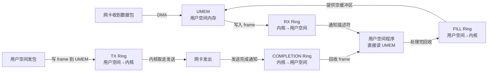

# 14.4.5 AF_XDP 零拷贝路径

| 属性 | 说明 |
|------|------|
| 难度 | [E] 硬核 / [M] 中阶 |
| 预估阅读+吸收时间 | 30~40 分钟 |
| 前置依赖 | 14.4.1~14.4.4（XDP 基础、BPF_MAP_TYPE_XSKMAP、XDP_REDIRECT） |

## 本节导读

前面几节你把 XDP 的各种动作和 map 类型都学了一遍。但你可能会想：XDP 再快，也是在**内核**里处理包，如果我的应用程序跑在**用户空间**，数据岂不是还得走一圈 socket 系统调用、内存拷贝的老路？好消息是——Linux 4.18 引入了一个叫 **AF_XDP** 的地址族，它让 XDP 程序可以直接把包"甩"进用户空间的 socket，**全程零拷贝**。这一节你就来搞懂 AF_XDP 的架构、UMEM 内存模型、四个 ring buffer 的协作机制，以及它和 DPDK 的恩怨情仇。读完之后你会明白：为什么 AF_XDP 被称为"内核里的 DPDK"。

---

## <span class="blue">知识点 259：AF_XDP —— 从网卡到用户空间的零拷贝高速公路</span>

### AF_XDP socket 是什么

**AF_XDP** 是 Linux 内核 4.18（2018 年）引入的一种新 socket 地址族，全称 "Address Family XDP"。它本质上是一个**用户空间 socket**，但它不走传统的内核网络栈——而是和 XDP 程序直接配合，实现包的零拷贝接收和发送。

工作流程是这样的：

1. 你的用户空间程序创建一个 AF_XDP socket（也叫 **XSK**，XDP Socket）。
2. 你在 XDP 程序里用 `XDP_REDIRECT` 动作，配合 `BPF_MAP_TYPE_XSKMAP`，把匹配到的包重定向到这个 XSK。
3. 包**直接**进入用户空间预注册的内存区域（UMEM），不需要经过 sk_buff 分配、协议栈处理、socket buffer 拷贝等传统路径。
4. 用户空间程序从 ring buffer 里读取包的描述符，直接访问 UMEM 中的数据。

传统 raw socket 还要走 `网卡 → 驱动 → 软中断 → 协议栈 → socket → 用户空间`，每一步都有开销。AF_XDP 的路线是 `网卡 → 驱动 → XDP → UMEM → 用户空间`，**完全绕过内核网络栈**，速度比 raw socket 快一个数量级。

### UMEM：零拷贝的秘密武器

AF_XDP 能实现零拷贝，核心在于 **UMEM（User-space Memory Region）**。这是用户空间提前分配的一大块内存池，里面划分成固定大小的 frame（通常是 2KB 或 4KB）。

注册 UMEM 的过程：

```c
// 用户空间分配内存池
void *umem_mem = mmap(NULL, umem_size, PROT_READ|PROT_WRITE,
                      MAP_PRIVATE|MAP_ANONYMOUS, -1, 0);

// 通过 setsockopt 注册到内核
struct xdp_umem_reg mr = {
    .addr = (uint64_t)umem_mem,
    .len  = umem_size,
    .chunk_size = FRAME_SIZE,   // 如 2048
    .headroom   = 0,
};
setsockopt(xsk_fd, SOL_XDP, XDP_UMEM_REG, &mr, sizeof(mr));
```

注册之后，网卡驱动通过 DMA 直接把收到的数据包写入这块用户空间内存。用户空间程序看到的不是"拷贝过来的数据"，而是"驱动直接写到我家门口的原始数据"。这就是**真正的零拷贝**——没有 `memcpy`，没有页映射切换，DMA 写到哪里，用户空间就读哪里。

### 四个 Ring 队列：协同工作的齿轮

AF_XDP 用**四个 ring buffer** 来协调内核和用户空间之间的数据流动。这四个 ring 全放在共享内存中，两边都是无锁访问。

| 队列名 | 方向 | 用途 | 生产者 | 消费者 |
|--------|------|------|--------|--------|
| **RX Ring** | 内核 → 用户空间 | 通知用户空间"有包到了，描述符在 UMEM 的哪个 frame 里" | 网卡驱动（收到包后） | 用户空间程序（poll/read） |
| **TX Ring** | 用户空间 → 内核 | 用户空间要发包时，把帧描述符放到这里 | 用户空间程序 | 网卡驱动（发送包） |
| **FILL Ring** | 用户空间 → 内核 | 用户空间把空的 UMEM frame"还给"内核，让内核可以继续往里面收包 | 用户空间程序 | 网卡驱动（需要接收缓冲区时） |
| **COMPLETION Ring** | 内核 → 用户空间 | 通知用户空间"你之前提交的 TX 包已经发完了，这个 frame 可以回收复用了" | 网卡驱动（发送完成后） | 用户空间程序（回收 frame） |

工作流程闭环：

1. 启动时，用户空间把一堆空 frame 的地址写到 **FILL Ring** 里，告诉内核"这些地方你可以随便写"。
2. 网卡收到包，DMA 写入 UMEM 的某个 frame，然后在 **RX Ring** 里放一个描述符，告诉用户空间"包在 X 号 frame"。
3. 用户空间读到 RX Ring 里的描述符，直接访问对应 frame 的数据。处理完后，把这个 frame 的地址重新放回 FILL Ring，循环利用。
4. 发送时，用户空间把要发的数据写到某个 frame，把描述符放到 **TX Ring**。内核取走发送。
5. 发完后，内核把 frame 地址放到 **COMPLETION Ring**，用户空间回收再用。

### 代码框架：创建一个 AF_XDP socket 收包

```c
#include <linux/if_xdp.h>
#include <sys/socket.h>
#include <unistd.h>

#define FRAME_SIZE      2048
#define NUM_FRAMES      4096
#define RX_RING_SIZE    512
#define FILL_RING_SIZE  512

int create_xsk(int ifindex, int queue_id)
{
    int xsk_fd = socket(AF_XDP, SOCK_RAW, 0);

    // 1. 注册 UMEM
    size_t umem_size = NUM_FRAMES * FRAME_SIZE;
    void *umem = aligned_alloc(getpagesize(), umem_size);
    struct xdp_umem_reg mr = {
        .addr = (uint64_t)umem,
        .len  = umem_size,
        .chunk_size = FRAME_SIZE,
    };
    setsockopt(xsk_fd, SOL_XDP, XDP_UMEM_REG, &mr, sizeof(mr));

    // 2. 设置 RX / FILL ring 大小
    struct xdp_ring_size rs = {
        .rx_size = RX_RING_SIZE,
        .tx_size = 0,              // 只收不发
        .fill_size = FILL_RING_SIZE,
        .comp_size = 0,
    };
    setsockopt(xsk_fd, SOL_XDP, XDP_RX_RING,  &rs.rx_size,  sizeof(int));
    setsockopt(xsk_fd, SOL_XDP, XDP_FILL_RING,&rs.fill_size,sizeof(int));

    // 3. mmap 四个 ring（用户空间直接访问）
    struct xdp_mmap_offsets off;
    socklen_t optlen = sizeof(off);
    getsockopt(xsk_fd, SOL_XDP, XDP_MMAP_OFFSETS, &off, &optlen);

    void *rx_ring = mmap(NULL, off.rx.desc +
                         RX_RING_SIZE * sizeof(struct xdp_desc),
                         PROT_READ|PROT_WRITE, MAP_SHARED, xsk_fd,
                         XDP_PGOFF_RX_RING);
    void *fill_ring = mmap(NULL, off.fr.desc +
                           FILL_RING_SIZE * sizeof(uint64_t),
                           PROT_READ|PROT_WRITE, MAP_SHARED, xsk_fd,
                           XDP_PGOFF_FILL_RING);

    // 4. 绑定到网卡的指定队列
    struct sockaddr_xdp sxdp = {
        .sxdp_family   = AF_XDP,
        .sxdp_ifindex  = ifindex,
        .sxdp_queue_id = queue_id,
        .sxdp_flags    = 0,
    };
    bind(xsk_fd, (struct sockaddr *)&sxdp, sizeof(sxdp));

    // 5. 预填充 FILL ring（把空缓冲区交给内核）
    for (int i = 0; i < FILL_RING_SIZE; i++) {
        // 把 frame 地址写入 fill_ring
        // 具体写入位置依赖生产者/消费者指针
    }

    return xsk_fd;
}
```

### 数据流全景图



### 性能：接近 DPDK，但活在"体制内"

AF_XDP 的收发包性能可以达到**线速（line rate）**，和 DPDK 在同一数量级。但它的关键优势在于**不需要旁路内核**——它和内核网络栈是"和平共处"的关系。

| 维度 | AF_XDP | DPDK | 传统 socket |
|------|--------|------|-------------|
| **零拷贝** | 是（DMA 直接写 UMEM） | 是（DPDK 自带内存管理） | 否（多次拷贝） |
| **内核集成** | 是（和内核网络栈共存） | 否（旁路内核，独占网卡） | 是（走完整内核协议栈） |
| **网卡要求** | 需要驱动支持 XDP_REDIRECT | 需要 DPDK PMD 驱动 | 任意网卡 |
| **内存要求** | 普通内存即可 | 需要 hugepage + 大页内存 | 普通内存 |
| **配置复杂度** | 中（需 XDP 程序 + XSK） | 高（需 DPDK 环境初始化） | 低（标准 socket API） |
| **吞吐** | 接近线速 | 线速 | 受协议栈限制 |
| **延迟** | 极低（μs 级） | 极低（μs 级） | 较高（ms 级） |
| **适用场景** | 需要内核协作的高性能应用 | 纯用户空间数据面 | 通用网络应用 |

### 适用场景

- **高频交易（HFT）**：需要 μs 级延迟的市场数据接收。
- **网络监控/抓包**：tcpdump 的升级版，比如 `xdpcap` 工具。
- **负载均衡**：四层负载均衡器直接基于 XDP 做流量分发。
- **DDoS 防护**：在包进入协议栈之前就丢弃攻击流量，同时把正常流量零拷贝送给用户空间分析。

### ⚠️ 陷阱：不是所有网卡驱动都支持

AF_XDP 需要网卡驱动实现 `XDP_REDIRECT` 到 XSK 的支持。虽然主流驱动（ixgbe、i40e、mlx5、bnxt、ice 等）都已经支持，但一些老旧或小众的驱动可能还不行。使用前务必检查：

```bash
# 查看当前驱动是否支持 XDP
ethtool -i eth0 | grep driver
# 然后去内核源码或文档确认该驱动的 XDP 支持矩阵
```

另外，AF_XDP 绑定到网卡的**特定队列**（queue_id），你需要确保网卡的多队列 RSS 把目标流量引导到绑定队列，否则 XSK 收不到包。

### 💡 提示：AF_XDP 是 DPDK 的"内核友好版"

如果你纠结于"选 DPDK 还是 AF_XDP"，记住这个原则：

- 如果你需要**完全旁路内核**、独占网卡、跑纯用户空间数据面 → DPDK。
- 如果你需要**和内核网络栈共存**（比如同一网卡既跑普通 TCP 又跑高性能收包）、不想折腾 hugepage、希望用标准 Linux 工具管理 → **AF_XDP**。

AF_XDP 本质上就是 DPDK 理念的"内核内实现"——它给了你一个不需要旁路内核的 DPDK。

### 本节总结

| 要点 | 内容 |
|------|------|
| 核心机制 | XDP 程序通过 `XDP_REDIRECT` + `XSKMAP` 将包送入 AF_XDP socket |
| 零拷贝关键 | UMEM（用户空间内存）+ DMA 直接写入 |
| 四 Ring 协作 | RX（收包通知）、TX（发包提交）、FILL（空缓冲区供给）、COMPLETION（发送完成回收） |
| 性能水平 | 接近 DPDK 线速，μs 级延迟 |
| 核心优势 | 无需旁路内核，与内核网络栈共存 |
| 主要限制 | 需网卡驱动支持 XDP_REDIRECT |
| 典型场景 | 高频交易、网络监控、负载均衡、DDoS 防护 |

---

### 下一步预告

> **14.5.1 GRO 与 GSO 机制**——你已经学会了如何把单个包以零拷贝方式送进用户空间。但真实世界里，大包（尤其是 TSO/GRO 相关）的处理路径更复杂。下一节就来揭开 GRO（Generic Receive Offload）和 GSO（Generic Segmentation Offload）的神秘面纱，看看内核是怎么"批量处理"包的。
