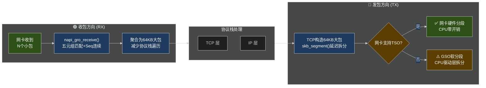

# 14.5.1 GRO与GSO机制

> 所属章节：第14章 网络子系统 > 14.5 网络卸载机制
>
> 难度：[E] Expert → [M] Master | 预计阅读时间：15分钟

## <span class="blue"> 本节导读

想象你在一条高速公路上运货。传统做法是每辆小车单独过收费站、单独领卡、单独缴费——几百辆小车排队排到怀疑人生。GRO/GSO/TSO就是聪明的高速公路系统：**收包时**把同一目的地的小货车拼成一趟大卡车（GRO），**发包时**把大卡车留到收费站前最后一刻才拆成小货车（GSO），而TSO更是直接让收费站自动帮你拆分，司机连车都不用下。

本节带你理解 Linux 网络栈中最强大的三大性能优化利器。学完后，你将掌握 GRO 的聚合原理、GSO 的延迟分段机制、TSO 的硬件卸载方式，并能在 10Gbps+ 环境中正确启用和调试它们。<br>
内容适用于 Linux 4.x ~ 6.x 内核。

---

## <span class="blue"> GRO：收包方向的"拼车"艺术 [E]

### GRO 是什么

GRO（Generic Receive Offload，通用接收卸载）是 NAPI 轮询机制中的核心优化。它的思路很朴素：当网卡收到大量属于**同一流**的小包时，为什么不把它们拼成一个"超级大包"再往上送？这样协议栈只需遍历一次，而不是几十次。

### 核心流程

在 NAPI 的 `poll()` 循环中，`napi_gro_receive()` 扮演着"拼车调度员"的角色：

1. **识别同流**：检查五元组（源IP、目的IP、源端口、目的端口、协议），确认这些包属于同一个 TCP/UDP 流
2. **检查连续性**：序列号必须连续，不能有缺口
3. **聚合条件**：总大小不超过 `gro_max_size`（默认 64KB）
4. **合成大包**：把多个小 skb 合并成一个大的 skb，然后一次性提交给上层

### GRO 的边界条件

不是随便什么包都能拼。GRO 要求满足以下条件：

| 条件 | 说明 |
|------|------|
| 同一五元组 | 源/目的 IP + 源/目的端口 + L4 协议必须完全一致 |
| 连续序列号 | TCP Seq 号连续递增，不能有乱序 |
| 大小不超限 | 聚合后总长度 ≤ `gro_max_size`（默认 65536 字节） |
| 时间窗口内 | 必须在同一 NAPI poll 周期内到达 |
| 标志位合法 | 不能有 FIN/RST/URG 等特殊标志干扰 |

> 🔴 **危险**：GRO 聚合的包穿过 **Netfilter** 时，`conntrack` 看到的是"假包"——它的包大小和实际物理包完全不同。如果你在 iptables 里做了基于包大小的过滤规则（比如 `-m length`），结果会出人意料。记住：**GRO 发生在 conntrack 之后**的内核流程里，但某些 hook 点仍然可能踩坑。

### 启用 GRO

```bash
# 查看当前状态
ethtool -k eth0 | grep gro
# 典型输出：
# generic-receive-offload: on

# 启用 GRO
ethtool -K eth0 gro on

# 调整最大聚合大小（sysctl 方式，单位字节）
sysctl -w net.core.gro_max_size=65536
```

---

## <span class="blue"> GSO：发包方向的"最后一刻拆分" [E]

### GSO 的核心思想

GSO（Generic Segmentation Offload，通用分段卸载）是 GRO 的镜像操作，但发生在**发包方向**。

传统 TCP 发送流程是：TCP 层把数据切成 MSS 大小 → IP 层加头 → 驱动发送。每段都要走一遍完整的协议栈，效率低下。

GSO 说：别急，让大段在协议栈里多待一会儿。TCP 层直接构造一个 64KB 的"超级 skb"，一路往下传到网卡驱动，在**尽可能晚的时机**才调用 `skb_segment()` 拆成 MTU 大小的小包。

### 延迟拆分的好处

| 阶段 | 传统方式 | GSO 方式 |
|------|----------|----------|
| TCP 层 | 切 MSS，每段独立处理 | 构造 64KB 大包，处理一次 |
| IP 层 | 每小段独立路由、加头 | 大包只路由一次 |
| 驱动层 | 逐段入队 | 最后才拆分，批量入队 |
| 协议栈遍历 | N 次 | 1 次 + 最后的硬件拆分 |

`skb_segment()` 的拆分点通常在 dev_queue_xmit() 之后、网卡驱动 ring buffer 之前。对于支持 TSO 的网卡，拆分甚至交给硬件，CPU 完全不参与。

### 启用 GSO

```bash
# 查看当前状态
ethtool -k eth0 | grep gso
# 典型输出：
# generic-segmentation-offload: on

# 启用 GSO
ethtool -K eth0 gso on
```

---

## <span class="blue"> TSO：让网卡替你干活的"终极形态" [M]

### 从 GSO 到 TSO

TSO（TCP Segmentation Offload，TCP 分段卸载）是 GSO 的硬件加速版。GSO 是靠 CPU 在驱动层拆分大包，而 TSO 直接让**网卡硬件**完成 TCP 分段。

这意味着：CPU 提交一个 64KB 的大包给网卡，网卡自己按照 MSS 拆成多个小帧发送。CPU 只做一次协议栈遍历 + 一次 DMA 提交，后面的事情网卡承包了。

### TSO 的优势与限制

| 特性 | TSO | GSO（软拆分） |
|------|-----|---------------|
| 拆分执行者 | 网卡硬件 | CPU（驱动层） |
| CPU 开销 | 接近零 | 低（但非零） |
| 性能天花板 | 最高 | 高 |
| 网卡要求 | 必须支持 | 所有网卡 |
| 配置方式 | `ethtool -K eth0 tso on` | 自动启用（GSO 开启时） |

### 启用 TSO

```bash
# 查看 TSO 状态
ethtool -k eth0 | grep -E "tcp-segmentation|tso"
# tcp-segmentation-offload: on
#     tx-checksum-ip-generic: on
#     tx-scatter-gather: on

# 启用 TSO
ethtool -K eth0 tso on

# ⚠️ 某些驱动需要先确保 tx-checksum 和 scatter-gather 已开启
ethtool -K eth0 tx on sg on tso on
```

### 检查三者状态的完整脚本

```bash
#!/bin/bash
# check_offloads.sh - 检查 GRO/GSO/TSO 状态
IFACE=${1:-eth0}

echo "=== $IFACE 卸载特性状态 ==="
ethtool -k $IFACE | grep -E \
  "generic-receive-offload|generic-segmentation-offload|tcp-segmentation-offload|tx-checksum|scatter-gather"

echo ""
echo "=== GRO 最大聚合大小 ==="
sysctl net.core.gro_max_size 2>/dev/null || echo "sysctl 不可用"

echo ""
echo "=== 驱动级 TSO 统计 ==="
ethtool -S $IFACE 2>/dev/null | grep -i -E "tso|gso|gro" || echo "驱动不支持统计"
```

---

## <span class="blue"> 三者协作：一张图看懂全链路 [M]



**图的含义**：收包时，网卡的小包经过 GRO 聚合成大包进入协议栈；处理完后，发包时 TCP 层构造大包一路下传，最终在 TSO 判断节点分叉——网卡支持则硬件分段，不支持则 GSO 软件分段。

> 💡 **提示**：在 10Gbps+ 网络环境中，**GRO + GSO + TSO 是必开项**。实测表明，关闭这三项后 10Gbps 网卡的吞吐量可能掉到 2~3Gbps，CPU 占用率飙升到 80% 以上。打开后吞吐量接近线速，CPU 占用率降至 10% 以下。这不是"可选项"，而是"入场券"。

---

## <span class="blue"> LRO 已废弃：为什么别用 [E]

在 GRO 出现之前，LRO（Large Receive Offload）是老式的收包聚合方案。但它有个致命缺陷：**LRO 在驱动层就把包合了，破坏了协议栈的透明性**，导致 Netfilter、流量控制、包计数器全部失真。

GRO 的设计原则是"尽可能晚地聚合"——在 NAPI poll 中聚合，但仍保留足够的元信息供上层使用。LRO 已被主流内核彻底废弃，如果你在旧系统上看到 `lro` 选项，请切换到 GRO。

| 特性 | LRO（已废弃） | GRO（推荐） |
|------|--------------|-------------|
| 聚合位置 | 网卡驱动层 | NAPI poll 层 |
| 协议栈透明性 | 差，破坏计数 | 好，保留元信息 |
| 与 Netfilter 兼容 | 差 | 可接受（仍有 conntrack 陷阱） |
| 内核支持 | 已移除 | 活跃维护 |

---

## <span class="blue"> ethtool 卸载参数速查表 [E]

| 参数 | 启用 | 禁用 | 说明 | 所需支持 |
|------|------|------|------|----------|
| `gro` | `ethtool -K eth0 gro on` | `gro off` | 收包方向聚合小包为大包 | 驱动支持 |
| `gso` | `ethtool -K eth0 gso on` | `gso off` | 发包方向延迟分段 | 驱动支持 |
| `tso` | `ethtool -K eth0 tso on` | `tso off` | 硬件 TCP 分段卸载 | 网卡硬件 + 驱动 |
| `lro` | ~~`lro on`~~ **废弃** | `lro off` | 旧式大接收卸载，已弃用 | — |
| `tx` | `ethtool -K eth0 tx on` | `tx off` | TX 校验和卸载（TSO 前置依赖） | 驱动支持 |
| `sg` | `ethtool -K eth0 sg on` | `sg off` | Scatter-Gather DMA（TSO 前置依赖） | 驱动支持 |

> ⚠️ **陷阱**：启用 TSO 时，如果 `tx-checksum` 或 `scatter-gather` 未开启，`ethtool` 可能静默失败或报错 `Cannot change tcp-segmentation-offload`。先检查依赖项，按 `tx → sg → tso` 的顺序逐一启用。

---

## <span class="blue"> GRO vs GSO vs TSO 全景对比 [M]

| 维度 | GRO | GSO | TSO |
|------|-----|-----|-----|
| **方向** | RX（收包） | TX（发包） | TX（发包） |
| **所在层** | NAPI poll → 网络层 | TCP → 驱动层 | 网卡硬件 |
| **核心函数** | `napi_gro_receive()` | `skb_segment()` | 硬件自动分段 |
| **做什么** | 多个小包 → 一个大包 | 一个大包 → 多个小包 | 一个大包 → 硬件拆分多帧 |
| **性能收益** | 减少收包协议栈遍历 | 减少发包协议栈遍历 | CPU 零开销，收益最大 |
| **启用命令** | `ethtool -K eth0 gro on` | `ethtool -K eth0 gso on` | `ethtool -K eth0 tso on` |
| **网卡要求** | 软件实现，通用 | 软件实现，通用 | **需要硬件支持** |
| **前置依赖** | NAPI 启用 | GSO 依赖 TSO fallback | `tx` + `sg` 必须先开 |

---

## <span class="blue"> 本节总结

| 要点 | 关键信息 |
|------|----------|
| GRO 核心 | 收包时聚合同流小包为大包，`napi_gro_receive()` 主导，默认最大 64KB |
| GRO 陷阱 | 聚合包穿过 Netfilter 时 conntrack 看到"假包"，包大小与实际物理包不符 |
| GSO 核心 | 发包时延迟拆分，`skb_segment()` 在驱动层才把大包切成 MTU 大小 |
| TSO 核心 | 网卡硬件直接执行 TCP 分段，CPU 零开销，性能最优 |
| 三者协作 | RX: GRO 聚合 → 协议栈处理 → TX: GSO/TSO 分段 → 网卡发出 |
| 性能底线 | 10Gbps+ 网络必须启用 GRO+GSO+TSO，否则吞吐量暴跌 |
| LRO 状态 | 已废弃，改用 GRO |
| 启用顺序 | TSO 依赖 tx-checksum 和 scatter-gather，按 tx → sg → tso 顺序启用 |

---

## <span class="blue"> 下一步

14.5.2 将深入探讨网络卸载机制的**陷阱与调试**：当 TSO 导致抓包工具（tcpdump）看到的包大小和实际线路上的包不一致时如何排查？如何确认网卡真的在做硬件分段？以及 `ethtool -K` 失败的根因分析。这些调试技巧是生产环境排查网络性能问题的必备武器。

---

## <span class="blue"> 配套资源

- **文档**：《Linux Kernel Networking》第 7 章 — Offload Mechanisms
- **内核源码**：`net/core/dev.c` — `napi_gro_receive()`、`dev_hard_start_xmit()`、`skb_segment()`
- **工具**：`ethtool -k <iface>` 查看卸载状态，`ethtool -S <iface>` 查看驱动统计
- **命令备忘**：`ethtool -K eth0 gro on gso on tso on` — 一键开启三件套
- **sysctl**：`net.core.gro_max_size` — 调整 GRO 聚合上限
