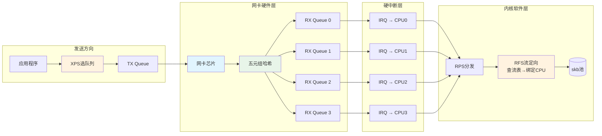

# 14.6.1 RSS/RPS/RFS/XPS 多队列接收机制

> 所属章节：第14章 网络子系统 > 14.6 网络性能优化
>
> 难度：[E] Expert / [M] Master | 预计阅读时间：20分钟

## <span class="blue"> 本节导读

想象一下：你的嵌入式设备有8核CPU，但网卡所有中断都砸在CPU0上，其他7个核心闲着喝茶——这不是笑话，这是生产环境的真实写照。<br>
<br>
本节带你深入Linux内核的**四大多队列机制**：RSS（硬件分发）、RPS（软件分发）、RFS（流定向）、XPS（发送优化）。从网卡硬件哈希到CPU亲和性绑定，从原理到sysfs实战配置，让你彻底搞懂如何把网络负载均匀分配到所有CPU核心。<br>
<br>
学完后，你将能根据网卡能力选择最优的多队列策略，显著提升高并发网络场景下的吞吐量和延迟表现。

---

## <span class="blue"> 四种机制全景对比 [E]

Linux内核提供了四层递进的多队列优化手段，覆盖从硬件到软件、从收包到发包的全链路。下表一次看清它们的区别：

| 缩写 | 全称 | 硬件/软件 | 方向 | sysfs配置路径（以eth0为例） | 核心目的 |
|------|------|-----------|------|----------------------------|----------|
| **RSS** | Receive Side Scaling | 硬件 | 接收 | `ethtool -l eth0`（查看） | 网卡硬件将包分发到多个RX队列 |
| **RPS** | Receive Packet Steering | 软件 | 接收 | `/sys/class/net/eth0/queues/rx-*/rps_cpus` | 单队列网卡时，软件层将包分发到多个CPU |
| **RFS** | Receive Flow Steering | 软件 | 接收 | `/sys/class/net/eth0/queues/rx-*/rps_flow_cnt` | 同一流的包始终由处理该流的CPU处理 |
| **XPS** | Transmit Packet Steering | 软件 | 发送 | `/sys/class/net/eth0/queues/tx-*/xps_cpus` | 发送时选择最优CPU进行软中断处理 |

四者的关系可以概括为一条**递进链**：

- **RSS**是第一道防线——如果网卡支持，优先用它做硬件级分流
- **RPS**是补充——网卡太老不支持RSS？内核帮你做软件分发
- **RFS**是优化——在RPS基础上保证"同一流的包跟同一CPU走"，提高cache命中率
- **XPS**是收尾——收包优化完了，发包方向也要做对称优化

> 💡 **提示**：RFS提高cache命中率——对延迟敏感的应用（如高频交易、实时音视频）非常有用，因为它确保同一TCP流的skb和相关socket结构体始终在同一块CPU缓存里。

---

## <span class="blue"> RSS：硬件多队列分发 [E]

RSS（Receive Side Scaling）是最高效的多队列方案，因为它把分流的活直接交给网卡硬件。

### 工作原理

网卡收到报文后，根据**五元组哈希**（源IP、目的IP、源端口、目的端口、协议）计算出一个哈希值，然后根据哈希值将报文分发到不同的RX队列。每个RX队列对应一个独立的硬件中断，通过中断亲和性（irq affinity）可以绑定到不同的CPU核心。

```
    报文流入
       │
       ▼
  ┌─────────┐
  │  网卡芯片  │  ← 五元组哈希计算
  └────┬────┘
       │
   ┌───┼───┬───┐
   ▼   ▼   ▼   ▼
  RX0 RX1 RX2 RX3   ← 多个硬件队列
   │   │   │   │
   ▼   ▼   ▼   ▼
  CPU0 CPU1 CPU2 CPU3  ← 中断亲和性绑定
```

### 检查网卡RSS支持

```bash
# 查看网卡支持的队列数
$ ethtool -l eth0
Channel parameters for eth0:
Pre-set maximums:
RX:        8          ← 最大RX队列数
TX:        8
Other:     0
Combined:  16
Current hardware settings:
RX:        4          ← 当前启用的RX队列数
TX:        4
Other:     0
Combined:  0

# 查看网卡是否支持RSS哈希
$ ethtool -k eth0 | grep receive-hashing
receive-hashing: on
```

不是所有网卡都支持RSS。嵌入式设备上常见的百兆或低端千兆网卡可能只有**单队列**。这时候就要请出RPS了。

---

## <span class="blue"> RPS：软件多队列分发 [E]

RPS（Receive Packet Steering）是内核纯软件实现的多队列分发机制。它的核心思想很简单：**网卡只出一个队列的中断，但中断处理完后，内核用软件把skb分发到多个CPU上去做协议栈处理**。

### 配置RPS

```bash
# 查看当前网卡的RX队列
$ ls /sys/class/net/eth0/queues/
rx-0  tx-0

# 配置RPS：将rx-0的包分发到CPU0~CPU3处理
# 位掩码 0xf = 0000 1111b，表示CPU0~3
$ echo f | sudo tee /sys/class/net/eth0/queues/rx-0/rps_cpus
f

# 验证
$ cat /sys/class/net/eth0/queues/rx-0/rps_cpus
0000000f
```

位掩码的含义：每个bit对应一个CPU，从右往左依次是CPU0、CPU1、CPU2……比如有8个CPU时，如果你想让CPU1和CPU3处理，掩码就是 `0x0a`（二进制 `0000 1010`）。

> ⚠️ **陷阱**：RPS把所有队列的中断集中在CPU0——需要配合irq affinity分散中断！RPS只负责在**软中断阶段**做分发，网卡硬中断本身还是砸在绑定的那个CPU上。如果硬中断全部集中在CPU0，CPU0就会先处理硬中断再做软中断分发，负载依然会倾斜。正确做法是用 `smp_affinity` 把网卡硬中断分散到不同CPU。

---

## <span class="blue"> RFS：接收流定向 [M]

RFS（Receive Flow Steering）在RPS的基础上更进一步：它不仅把包分发到多个CPU，还保证**同一网络流的报文始终由处理该流的CPU处理**。

### 为什么RFS很重要？

考虑这个场景：CPU1上运行的应用程序通过socket读取数据。如果没有RFS，RPS可能把同一个TCP流的奇数包分给CPU1、偶数包分给CPU2——CPU2上的包最终还是要搬到CPU1的缓存里才能被应用读取，cache命中率暴跌。

RFS的做法是：内核维护一个**流表（flow table）**，记录每个流最后被哪个CPU处理，后续同一流的报文就跟随到那个CPU。

### 配置RFS

```bash
# 启用RFS：设置每个RX队列的流表大小
# 推荐值：最大并发连接数 / RX队列数
$ echo 32768 | sudo tee /sys/class/net/eth0/queues/rx-0/rps_flow_cnt
32768

# 同时需要设置全局RFS表大小
$ echo 32768 | sudo tee /proc/sys/net/core/rps_sock_flow_entries
32768

# 验证RFS命中情况（通过softnet统计）
$ cat /proc/net/softnet_stat
```

---

## <span class="blue"> XPS：发送方向多队列优化 [E]

前面三个都是收包方向的优化。发包方向呢？这就是XPS（Transmit Packet Steering）的工作。

XPS的思想是：当应用程序在某个CPU上调用 `send()` 发包时，内核尽量选择已经在该CPU上处理TX软中断的队列来发送，减少CPU之间的cache迁移和锁竞争。

### 配置XPS

```bash
# 查看TX队列
$ ls /sys/class/net/eth0/queues/tx-*
tx-0  tx-1  tx-2  tx-3

# 将tx-0绑定到CPU0
$ echo 1 | sudo tee /sys/class/net/eth0/queues/tx-0/xps_cpus
1

# 将tx-1绑定到CPU1
$ echo 2 | sudo tee /sys/class/net/eth0/queues/tx-1/xps_cpus
2

# 将tx-2绑定到CPU2
$ echo 4 | sudo tee /sys/class/net/eth0/queues/tx-2/xps_cpus
4

# 将tx-3绑定到CPU3
$ echo 8 | sudo tee /sys/class/net/eth0/queues/tx-3/xps_cpus
8
```

---

## <span class="blue"> 完整配置示例 [M]

下面给一个**四核嵌入式设备**上的完整配置脚本，假设网卡有4个RX队列和4个TX队列：

```bash
#!/bin/bash
# ========================================
# 多队列优化完整配置脚本（4核设备）
# 适用于支持RSS的网卡，RPS/RFS作为补充
# ========================================

IFACE="eth0"
NUM_CPUS=4

# 1. 硬中断亲和性：将4个RX队列的硬中断分别绑定到CPU0~3
#    这一步是关键，让RSS硬件分发的队列各自独立处理
for i in $(seq 0 3); do
    irq_num=$(grep "${IFACE}-rx-${i}" /proc/interrupts | awk -F: '{print $1}' | tr -d ' ')
    if [ -n "$irq_num" ]; then
        mask=$((1 << i))
        mask_hex=$(printf "%x" $mask)
        echo "Binding IRQ $irq_num (rx-$i) to CPU$i (mask=0x$mask_hex)"
        echo $mask_hex > /proc/irq/$irq_num/smp_affinity
    fi
done

# 2. RPS：每个RX队列的包可以分发到所有CPU
#    在RSS已分流的基础上，RPS提供额外的灵活性
for rxq in /sys/class/net/$IFACE/queues/rx-*; do
    echo f > "$rxq/rps_cpus"      # CPU0~3全部参与
    echo 8192 > "$rxq/rps_flow_cnt"  # 每个队列8192条流表项
done

# 3. RFS全局流表
sysctl -w net.core.rps_sock_flow_entries=32768

# 4. XPS：每个TX队列绑定到一个CPU
idx=0
for txq in /sys/class/net/$IFACE/queues/tx-*; do
    mask=$((1 << idx))
    mask_hex=$(printf "%x" $mask)
    echo $mask_hex > "$txq/xps_cpus"
    idx=$(((idx + 1) % NUM_CPUS))
done

echo "多队列优化配置完成！"
echo ""
echo "验证命令："
echo "  watch -n1 'cat /proc/interrupts | grep $IFACE'"
echo "  cat /proc/net/softnet_stat"
```

---

## <span class="blue"> 多队列数据流全景图



这张图清晰地展示了数据的完整路径：**硬件层（RSS哈希分流）→ 硬中断层（irq亲和性绑定）→ 软件层（RPS补充分发 + RFS流定向保证cache命中）→ 发送方向（XPS优化选队列）**。

---

## <span class="blue"> 多队列配置命令速查

| 目的 | 命令 | 验证方法 |
|------|------|----------|
| 查看网卡队列数 | `ethtool -l eth0` | 看RX/TX/Combined数值 |
| 查看RSS哈希是否开启 | `ethtool -k eth0 \| grep hashing` | 显示 `receive-hashing: on` |
| 查看当前irq亲和性 | `cat /proc/irq/<irq>/smp_affinity` | 对比CPU位掩码 |
| 设置irq亲和性 | `echo <mask> > /proc/irq/<irq>/smp_affinity` | `watch 'cat /proc/interrupts \| grep eth0'` |
| 配置RPS CPU掩码 | `echo <mask> > /sys/.../queues/rx-0/rps_cpus` | `cat /sys/.../rps_cpus` |
| 配置RFS流表大小 | `echo N > /sys/.../queues/rx-0/rps_flow_cnt` | 观察softnet_stat |
| 配置XPS CPU掩码 | `echo <mask> > /sys/.../queues/tx-0/xps_cpus` | `cat /sys/.../xps_cpus` |
| 查看RFS全局流表 | `sysctl net.core.rps_sock_flow_entries` | 确认非零值 |
| 实时监控中断分布 | `watch -n1 'cat /proc/interrupts \| grep eth0'` | 各队列中断数应均衡 |
| 查看软中断统计 | `cat /proc/net/softnet_stat` | 第3列是RFS命中数 |

---

## <span class="blue"> 本节总结

| 机制 | 核心能力 | 何时启用 | 关键配置 |
|------|----------|----------|----------|
| **RSS** | 硬件五元组哈希分流到多队列 | 网卡支持时优先使用 | `ethtool -L eth0 combined N` |
| **RPS** | 软件层将skb分发到多CPU | 网卡不支持RSS，或队列数少于CPU数 | `rps_cpus` 位掩码 |
| **RFS** | 同一流始终跟同一CPU走 | 延迟敏感场景，配合RPS使用 | `rps_flow_cnt` + `rps_sock_flow_entries` |
| **XPS** | 发包方向选最优CPU队列 | TX队列数大于1时启用 | `xps_cpus` 位掩码 |

**配置策略建议**：

- **高端网卡（RSS支持）**：RSS做硬件分流 → 配好irq亲和性 → RFS提升cache命中率 → XPS优化发送
- **低端网卡（无RSS）**：irq亲和性分散硬中断 → RPS做软件分发 → RFS保证流一致性 → XPS优化发送
- **嵌入式场景注意**：小核心数设备上（如双核），RPS掩码不要设置成全部CPU，留一个核心给业务进程

---

## <span class="blue"> 下一步

掌握了多队列的四种机制后，接下来你需要知道**如何把网卡中断精准地绑定到指定CPU**。14.6.2将深入讲解irq affinity的底层原理、`smp_affinity`文件的位掩码计算、`irqbalance`守护进程的工作方式，以及如何编写脚本实现中断的动态均衡——这对于将本节的多队列理论转化为实际性能提升至关重要。

---

## <span class="blue"> 配套资源

- **内核文档**：`Documentation/networking/scaling.txt`（内核源码树中关于多队列最权威的文档）
- **工具**：`ethtool`（网卡队列配置）、`irqbalance`/`irqbalance-ui`（中断均衡守护进程）、`mpstat -I CPU`（按CPU统计中断）
- **延伸阅读**：Intel白皮书《Intel Ethernet Flow Director and Receive Side Scaling》
- **调试技巧**：`grep eth0 /proc/interrupts` 观察中断分布是否均衡；`perf top` 查看 `net_rx_action` 在各CPU上的消耗
