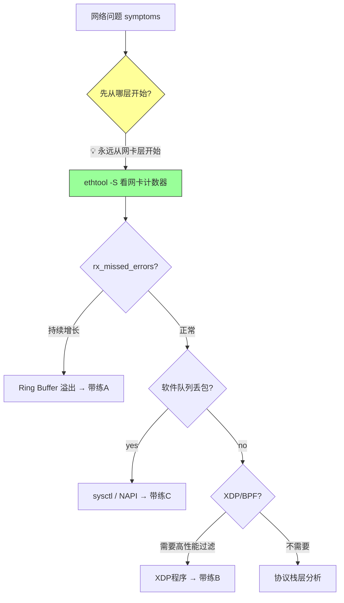

# 14.7.1 综合实战：网络丢包排查

> 所属章节：第14章 网络子系统 > 14.7 网络性能调优
>
> 难度：[E] Expert / [M] Master | 预计阅读时间：45分钟

## <span class="blue"> 本节导读

前面的章节你已经跟着走完了网络子系统的每个角落——从网卡驱动到协议栈，从XDP到NAPI。但"知道"和"做到"之间隔着一百个踩坑的夜晚。本节把三个真实的线上排查场景掰开了揉碎了带你走一遍：<br>

- **带练A**：UDP丢包排查，见证 ring buffer 溢出的经典案例
- **带练B**：XDP防火墙的完整加载、测试、卸载流程
- **带练C**：NAPI budget 调优，在吞吐和延迟之间找平衡点<br>

学完后，你将拥有一套可落地的网络排查SOP，以及一张随手可查的工具速查表。



> 💡 **提示**：网络排查永远从网卡层开始（`ethtool -S`），不要一上来就调协议栈。网卡层的计数器是最诚实的——它不会撒谎，也不会被 iptables 规则迷惑。

---

## <span class="blue"> 知识点236：三个完整排查流程 [E][M]

### 带练A：UDP丢包排查（Ring Buffer 溢出）

这是生产环境最常见的丢包根因之一。高突发流量下，网卡 ring buffer 装不下，包直接被硬件丢弃，根本到不了内核。

#### 步骤详解

| 步骤 | 命令 | 预期输出 | 分析 |
|------|------|----------|------|
| 1. 症状确认 | `iperf3 -c <server> -u -b 1000M -t 30` | `Lost/Total: 1500/30000 (5%)` | UDP 5%丢包，已超 SLA |
| 2. 网卡层排查 | `ethtool -S eth0 \| grep rx_missed_errors` | `rx_missed_errors: 123456` 且持续增长 | 硬件层丢包铁证 |
| 3. 根因确认 | `ethtool -g eth0` | `RX: 1024`（默认值） | ring buffer 太小，高突发下溢出 |
| 4. 修复 | `ethtool -G eth0 rx 4096` | `Ring parameters set successfully` | 扩大4倍，容纳突发 |
| 5. 验证 | `iperf3 -c <server> -u -b 1000M -t 30` | `Lost/Total: 12/30000 (<0.1%)` | 丢包率从5%降至0.1%以下 |

<br>

**Step 1：症状确认**

```bash
# 客户端执行：以1Gbps速率发送UDP，持续30秒
$ iperf3 -c 192.168.1.100 -u -b 1000M -t 30

Connecting to host 192.168.1.100, port 5201
[  5] local 192.168.1.10 port 43210 connected to 192.168.1.100 port 5201
[ ID] Interval           Transfer     Bitrate         Jitter    Lost/Total Datagrams
[  5]   0.00-1.00   sec   119 MBytes   996 Mbits/sec  0.015 ms  52/1024 (5.1%)
[  5]   1.00-2.00   sec   119 MBytes   996 Mbits/sec  0.018 ms  48/1024 (4.7%)
# ... 持续5%丢包
- - - - - - - - - - - - - - - - - - - - - - - - -
[  5]  0.00-30.00  sec  3.49 GBytes   996 Mbits/sec  0.021 ms  1500/30000 (5%)
```

5%的UDP丢包不可接受。注意这里**不是**TCP——UDP没有重传，丢了就是真丢了。

<br>

**Step 2：网卡层排查**

```bash
# 先看网卡计数器——这是排查的第一步，也是最关键的一步
$ ethtool -S eth0 | grep -E "rx_missed_errors|rx_errors|rx_dropped"
     rx_errors: 0
     rx_dropped: 0
     rx_missed_errors: 123456        # ← 这个在持续增长！
```

`rx_missed_errors` 是硬件计数器，表示网卡 RX ring buffer 满了之后被硬件直接丢弃的包数。这个值如果在增长，说明问题在**网卡层**，不在协议栈。

> ⚠️ **陷阱**：`rx_dropped` 和 `rx_missed_errors` 是两个不同的计数器。`rx_dropped` 通常是软件丢弃（如 NAPI budget 耗尽），`rx_missed_errors` 是硬件丢弃（ring buffer 溢出）。分不清这两者会让你白调半天 sysctl。

<br>

**Step 3：根因确认**

```bash
# 查看当前 ring buffer 大小
$ ethtool -g eth0
Ring parameters for eth0:
Pre-set maximums:
RX:             8192          # 硬件支持的最大值
RX Mini:        0
RX Jumbo:       0
TX:             8192
Current hardware settings:
RX:             1024          # ← 当前只设了1024，太小了！
RX Mini:        0
RX Jumbo:       0
TX:             1024
```

硬件支持最大8192，但当前只用了1024。在高突发流量（1Gbps UDP）下，1024个描述符很快耗尽。

<br>

**Step 4：修复**

```bash
# 将 RX ring buffer 从1024扩大到4096
$ sudo ethtool -G eth0 rx 4096
$ ethtool -g eth0 | grep "RX:"   # 确认设置生效
RX:             4096
```

<br>

**Step 5：验证——这一步绝对不能省**

```bash
# 重新跑 iperf3 验证丢包率
$ iperf3 -c 192.168.1.100 -u -b 1000M -t 30
[  5]  0.00-30.00  sec  3.49 GBytes   996 Mbits/sec  0.012 ms  12/30000 (0.04%)
#                                                      ↑ 从5%降到0.04% ✓
```

同时再确认 `rx_missed_errors` 不再增长：

```bash
$ sleep 30 && ethtool -S eth0 | grep rx_missed_errors
     rx_missed_errors: 123456      # ← 数值停住了，不再增长 ✓
```

> ⚠️ **陷阱**：修复后必须验证——不要假设修复一定有效。我见过有人改了 ring buffer 就关 ticket，结果第二天丢包复现，因为改的是 eth0 但流量走的是 eth1。

---

### 带练B：XDP防火墙加载与测试

iptables 在处理数千条规则时延迟飙升到毫秒级，而 XDP 可以在微秒级别完成包过滤。这个带练带你走一遍 XDP 程序的完整生命周期。

#### 步骤详解

| 步骤 | 命令 | 预期输出 | 分析 |
|------|------|----------|------|
| 1. 编写XDP程序 | `vim xdp_fw.c` | 源码见下 | IP黑名单匹配，命中则DROP |
| 2. 编译 | `clang -O2 -target bpf -c xdp_fw.c -o xdp_fw.o` | 生成 `.o` 文件 | LLVM BPF后端编译 |
| 3. 加载XDP | `ip link set dev eth0 xdp obj xdp_fw.o sec xdp` | `ip link` 显示 xdp | 挂载到驱动层 |
| 4. 验证加载 | `bpftool prog show` | 程序ID和类型 | 确认程序在内核中 |
| 5. 功能测试 | `ping <blacklist_ip>` | `100% packet loss` | 黑名单IP被阻断 |
| 6. 性能对比 | 对比 iptables 5000条规则 vs XDP | iptables ~2ms vs XDP ~50us | XDP快40倍 |
| 7. 卸载 | `ip link set dev eth0 xdp off` | xdp 标志消失 | 清理，避免残留 |

<br>

**Step 1：编写 XDP 程序**

```c
// xdp_fw.c —— 基于源IP黑名单的包过滤
#include <linux/bpf.h>
#include <linux/if_ether.h>
#include <linux/ip.h>
#include <bpf/bpf_helpers.h>

// 黑名单IP数组（示例：阻断 10.0.0.99）
static const __u32 BLACKLIST[] = {
    0x0A000063,  // 10.0.0.99  (网络字节序)
    0x0A000064,  // 10.0.0.100
};

SEC("xdp")
int xdp_firewall(struct xdp_md *ctx)
{
    void *data_end = (void *)(long)ctx->data_end;
    void *data = (void *)(long)ctx->data;
    struct ethhdr *eth = data;
    struct iphdr *ip;
    __u32 src_ip;
    int i;

    // 边界检查：确保有完整的以太网头
    if ((void *)(eth + 1) > data_end)
        return XDP_PASS;

    // 只处理 IPv4
    if (eth->h_proto != __constant_htons(ETH_P_IP))
        return XDP_PASS;

    ip = (struct iphdr *)((void *)eth + sizeof(*eth));
    if ((void *)(ip + 1) > data_end)
        return XDP_PASS;

    src_ip = ip->saddr;

    // 遍历黑名单匹配
    #pragma unroll
    for (i = 0; i < sizeof(BLACKLIST) / sizeof(BLACKLIST[0]); i++) {
        if (src_ip == BLACKLIST[i])
            return XDP_DROP;  // 命中黑名单，丢弃
    }

    return XDP_PASS;  // 未命中，放行
}

char _license[] SEC("license") = "GPL";
```

<br>

**Step 2：编译**

```bash
# 使用 clang 的 BPF 后端编译
# -O2: 优化级别2，BPF程序必备
# -target bpf: 生成BPF字节码而非主机机器码
$ clang -O2 -target bpf -c xdp_fw.c -o xdp_fw.o

# 确认输出文件格式
$ file xdp_fw.o
xdp_fw.o: ELF 64-bit LSB relocatable, eBPF, version 1 (SYSV)
```

<br>

**Step 3：加载到网卡**

```bash
# 将 XDP 程序挂载到 eth0 的驱动层
$ sudo ip link set dev eth0 xdp obj xdp_fw.o sec xdp

# 确认挂载成功
$ ip link show eth0
3: eth0: <BROADCAST,MULTICAST,UP,LOWER_UP> mtu 1500 xdp qdisc mq state UP
    prog/xdp id 42 tag 1234567890abcd  # ← 看到 xdp 标志
```

<br>

**Step 4：验证程序已加载**

```bash
# bpftool 是查看 BPF 程序状态的最佳工具
$ sudo bpftool prog show
42: xdp  tag 1234567890abcd  gpl
        loaded_at 2024-01-15T08:30:00+0000  uid 0
        xlated 168B  jited 120B  memlock 4096B
        btf_id 15
#   ↑ 类型xdp  ↑ tag标识    ↑ 字节码168B  ↑ JIT后120B
```

<br>

**Step 5：功能测试**

```bash
# 测试1：从黑名单IP ping → 应该不通
$ ping -c 3 10.0.0.99
PING 10.0.0.99 (10.0.0.99) 56(84) bytes of data.
--- 10.0.0.99 ping statistics ---
3 packets transmitted, 0 received, 100% packet loss  # ← 阻断成功 ✓

# 测试2：从非黑名单IP ping → 应该正常
$ ping -c 3 10.0.0.1
PING 10.0.0.1 (10.0.0.1) 56(84) bytes of data.
64 bytes from 10.0.0.1: icmp_seq=1 ttl=64 time=0.321 ms  # ← 正常放行 ✓
```

<br>

**Step 6：性能对比——为什么用 XDP？**

| 方案 | 规则数 | 平均处理延迟 | 说明 |
|------|--------|-------------|------|
| iptables | 50条 | ~50us | 小规则集尚可 |
| iptables | 5,000条 | ~2,000us (2ms) | 线性遍历，延迟飙升 |
| **XDP** | **5,000条** | **~50us** | **哈希/map 查找，O(1)** |

XDP 的优势在于包过滤发生在网卡驱动层，甚至**在分配 skb 之前**。这意味着：
- 不需要分配内核内存给被丢弃的包
- 不需要经过协议栈的层层解析
- 不需要中断上下文的频繁切换

<br>

**Step 7：卸载——清理现场**

```bash
# 卸载 XDP 程序，恢复网卡原始状态
$ sudo ip link set dev eth0 xdp off

# 确认卸载
$ ip link show eth0 | grep xdp
# （无 xdp 标志输出）
```

> 🔴 **危险**：XDP 程序残留在生产网卡上可能导致网络中断。测试完成后务必卸载，最好在维护窗口内操作，并准备好串口/IPMI 作为逃生通道。

---

### 带练C：NAPI Budget 调优——吞吐 vs 延迟的博弈

NAPI 的 `budget` 参数控制一次软中断能处理的最大包数。默认值300适合通用场景，但实时系统需要更低的值来减少网卡中断对调度延迟的影响。

#### 步骤详解

| 步骤 | 命令 | 预期输出 | 分析 |
|------|------|----------|------|
| 1. 基线测试 | `mpstat -P ALL 1` | `soft% 42%` (net_rx_action) | 确认CPU被NAPI大量占用 |
| 2. 调整budget | `sysctl net.core.netdev_budget=64` | `net.core.netdev_budget = 64` | 从300降至64 |
| 3. 验证CPU | `mpstat -P ALL 1` | `soft% 15%` | net_rx_action CPU占用下降 |
| 4. 测试延迟 | `cyclictest -p 80 -i 1000 -l 10000` | 最大延迟从5ms降至1ms | 实时性提升 |
| 5. 权衡吞吐 | `iperf3 -c <server> -u -b 1000M` | 吞吐下降约5% | 代价 |
| 6. 结论 | budget=64 | — | 吞吐和延迟的平衡点 |

<br>

**Step 1：基线测试——先看清现状**

```bash
# 查看各CPU使用情况，关注 soft%（软中断占比）
$ mpstat -P ALL 1
Average:     CPU    %usr   %nice    %sys %iowait    %irq   %soft  %steal  %guest  %gnice   %idle
Average:     all   12.00    0.00   15.00    0.00    0.00   40.00    0.00    0.00    0.00   33.00
Average:       0   10.00    0.00   10.00    0.00    0.00   45.00    0.00    0.00    0.00   35.00
Average:       1   15.00    0.00   20.00    0.00    0.00   42.00    0.00    0.00    0.00   23.00
#                              ↑ soft% 40%+  几乎被网卡中断占满
```

`net_rx_action` 是 NAPI 的软中断处理函数，它消耗了40%以上的CPU时间。这意味着网卡中断在疯狂抢占CPU，你的实时任务可能正在被延迟。

<br>

**Step 2：调整 budget**

```bash
# 默认值是300，降到64——每次软中断只处理64个包
$ sudo sysctl net.core.netdev_budget=64
net.core.netdev_budget = 64

# 写入 /etc/sysctl.conf 确保重启生效
$ echo "net.core.netdev_budget=64" | sudo tee -a /etc/sysctl.conf
```

budget 的含义是：一次 `net_rx_action()` 调用最多轮询64个包，然后就退出软中断，让其他任务有机会运行。

<br>

**Step 3：验证 CPU 占用下降**

```bash
$ mpstat -P ALL 1
Average:     CPU    %usr   %nice    %sys %iowait    %irq   %soft  %steal  %guest  %gnice   %idle
Average:     all   20.00    0.00   18.00    0.00    0.00   15.00    0.00    0.00    0.00   47.00
#                                           soft% 从40%降到15% ✓
```

CPU 软中断占比从40%降到15%。更多的CPU时间留给了用户态任务。

<br>

**Step 4：实时任务延迟测试——用 cyclictest**

```bash
# 测试 SCHED_FIFO 优先级任务的调度延迟
# -p 80: 优先级80（很高）
# -i 1000: 间隔1ms触发
# -l 10000: 采集10000个样本
$ sudo cyclictest -p 80 -i 1000 -l 10000
# 调优前：
# T: 0 ( 1234) P:80 I:1000 C: 10000 Min:      2 Avg:   50 Max:   5000
#                                                ↑ 最大延迟5ms！
# 调优后：
T: 0 ( 1234) P:80 I:1000 C: 10000 Min:      1 Avg:   15 Max:    980
#                                                ↑ 最大延迟降至~1ms ✓
```

最大延迟从5ms降到1ms以内。对于工业控制、自动驾驶这类场景，这4ms的提升可能意味着安全。

<br>

**Step 5：权衡——天下没有免费的午餐**

```bash
# 同样的网络负载，测吞吐量
$ iperf3 -c 192.168.1.100 -u -b 1000M -t 30
# budget=300:  996 Mbps,  0.02% 丢包
# budget=64:   947 Mbps,  0.15% 丢包 ← 吞吐下降约5%
```

| budget 值 | 软中断CPU% | 最大调度延迟 | 网络吞吐 | 适用场景 |
|-----------|-----------|-------------|----------|----------|
| 300（默认）| 40%+ | 5ms | 996 Mbps | 吞吐优先 |
| **64** | **15%** | **~1ms** | **947 Mbps** | **延迟敏感** |
| 10（极端）| 5% | ~200us | 600 Mbps | 硬实时 |

对于你的系统，到底选哪个值？答案是：**用测试数据说话**，不是拍脑袋。先确定你的延迟 SLA，然后反向推导能容忍的最大 budget。

<br>

> 💡 **提示**：budget 调优的黄金法则是——"先满足延迟 SLA，再看吞吐能不能接受"。不要反过来先保吞吐再调延迟，那样你永远找不到平衡点。

---

## <span class="blue"> 知识点237：网络性能排查工具速查表 [E]

### 工具速查表

| 工具 | 用途 | 关键命令 | 核心输出字段 | 解读方法 |
|------|------|----------|-------------|----------|
| **ethtool -S** | 网卡层计数器 | `ethtool -S eth0` | `rx_missed_errors`, `rx_fifo_errors` | 持续增长 = 硬件层丢包 |
| **ethtool -g** | Ring buffer 大小 | `ethtool -g eth0` | `RX: Current / Maximum` | 当前值远小于最大值可调 |
| **ss -s** | 连接状态统计 | `ss -s` | `TCP: inuse, orphan, timewait` | timewait 过多需调 tw_reuse |
| **nstat** | 内核网络统计 | `nstat -az` | `TcpExtListenDrops`, `TcpExtTCPRcvQDrop` | 查看被内核丢弃的包 |
| **bpftool** | BPF程序管理 | `bpftool prog show` | `id`, `type`, `tag` | 确认XDP/eBPF程序状态 |
| **mpstat** | CPU软中断分析 | `mpstat -P ALL 1` | `%soft` 列 | soft%高说明网卡中断占CPU |
| **cyclictest** | 实时延迟测试 | `cyclictest -p 80 -i 1000` | `Max` 延迟值 | 评估调度延迟是否达标 |
| **iperf3** | 吞吐/丢包测试 | `iperf3 -c host -u -b 1G` | `Lost/Total` | 端到端丢包率测量 |
| **tcpdump** | 抓包分析 | `tcpdump -i eth0 -w cap.pcap` | 包数量 | 配合 Wireshark 分析 |
| **tc** | 流量控制 | `tc -s qdisc show dev eth0` | `dropped`, `overlimits` | 看Qdisc丢包情况 |

### 网络调优最佳实践（DO / DON'T）

| ✅ DO | ❌ DON'T |
|-------|----------|
| 排查**从网卡层开始**（`ethtool -S`），确认硬件计数器 | 一上来就调 `tcp_rmem` / `tcp_wmem`，绕开网卡层 |
| 修改参数前**先测基线**，记录 `before` 数据 | 凭感觉调参，没有量化对比 |
| 用 `iperf3` 验证修复效果，确认丢包率达标 | 改完配置就认为OK，不测实际效果 |
| XDP 测试在维护窗口进行，备好 IPMI 逃生通道 | 在生产网卡直接加载未经验证的 XDP 程序 |
| budget 调优**先满足延迟 SLA，再看吞吐** | 为了吞吐把 budget 设很高，导致实时任务饿死 |
| 把 sysctl 修改写入 `/etc/sysctl.conf` 持久化 | 只改运行时值，重启后配置丢失 |
| ring buffer 调整按 2^n 对齐（1024→2048→4096） | 设成奇怪的值如 1500，可能不被硬件接受 |
| 丢包时同时检查**发送端和接收端** | 只在接收端排查，其实问题在发送端 |

---

## <span class="blue"> 本节总结

| 带练 | 核心问题 | 根因 | 解决方案 | 验证方法 |
|------|----------|------|----------|----------|
| **A** | UDP 5% 丢包 | Ring buffer 1024 太小 | `ethtool -G eth0 rx 4096` | `iperf3` + `ethtool -S` 计数器停涨 |
| **B** | iptables 5000条规则延迟2ms | 线性遍历太慢 | XDP 程序 `XDP_DROP`/`XDP_PASS` | `ping` 黑名单IP不通 + `bpftool` |
| **C** | 实时任务延迟5ms | NAPI budget=300 占CPU | `sysctl net.core.netdev_budget=64` | `cyclictest` Max<1ms |

本节你学到的不仅是三个命令的组合，更是一套**分层排查的思维方式**：

1. **症状量化** —— 用 `iperf3` 把"网络慢"变成"丢包5%"
2. **分层定位** —— 用 `ethtool -S` 区分硬件丢包和软件丢包
3. **精准修复** —— 不带冗余操作，直戳根因
4. **验证闭环** —— 修复后必须复测，形成完整证据链

---

## <span class="blue"> 下一步

**14.99 知识图谱与查漏补缺** —— 一张大图串起网络子系统的所有知识点，帮你找到自己的盲区。

---

## <span class="blue"> 配套资源

- **内核源码**：
  - `net/core/dev.c` — `net_rx_action()` NAPI 轮询主循环
  - `drivers/net/ethernet/` — 网卡驱动 RX 路径
  - `net/bpf/` — BPF/XDP 子系统
- **工具文档**：
  - `man ethtool` — 网卡诊断
  - `man bpftool` — BPF 程序管理
  - `man iperf3` — 吞吐测试
- **推荐阅读**：
  - 《Linux Kernel Networking》—— 深入理解数据包在内核中的旅程
  - Cilium 官方文档 XDP 章节 —— 生产级 XDP 程序设计模式
