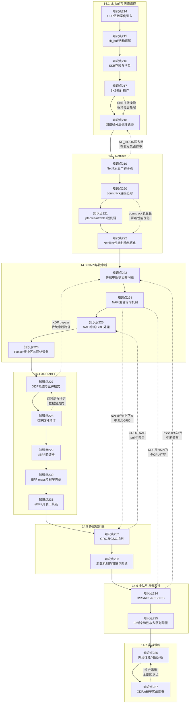

# 14.99 知识图谱与查漏补缺

> 所属章节：第14章 网络子系统 > 14.99 知识图谱
>
> 难度：[I] Intermediate | 预计阅读时间：25分钟

## 本节导读

学完第14章的全部内容，你的脑海里可能已经装满了SKB指针、Netfilter钩子、NAPI轮询、XDP动作、eBPF验证器……但这些知识点不是孤岛，它们在网络栈里紧密协作，形成了一条从网卡到应用的高速公路。 
本节用一张全景关联图帮你把所有知识点串起来，再配一份速查表和10道自测题，让你快速检验自己的掌握程度。如果你在某些题上卡住了，速查表会告诉你该回哪一节补课。 
学完后，你将拥有一个完整的网络子系统知识框架，能融会贯通地分析实际网络性能问题。

---

## 知识点关联全景图 [I]

下面的mermaid图展示了第14章全部24个知识点之间的依赖和关联关系。实线箭头表示**学习顺序依赖**（建议按此顺序阅读），虚线箭头表示**跨节知识关联**（理解时需要联动思考）。

> 💡 **提示**：这张图不仅是学习路线图，更是排查复杂网络问题的思维导图。遇到性能问题时，从右往左回溯——先看多队列配置（234-235），再看卸载机制（232-233），然后检查NAPI预算（224）和SKB分配（215），逐层定位。

---

## 24个知识点速查表 [I]

| 编号 | 所属节 | 知识点 | 一句话总结 |
|:---:|:---:|---|---|
| 214 | 14.1.1 | UDP丢包案例引入 | CPU不高却丢包时，按驱动层→协议栈层→Socket层→应用层四级排查 |
| 215 | 14.1.2 | sk_buff结构详解 | SKB由`sk_buff`结构体+线性数据区+分片页组成，是网络包在内核中的"集装箱" |
| 216 | 14.1.3 | SKB克隆与拷贝 | `skb_clone`共享数据区（只读场景），`psk_copy`深拷贝（需修改时），选错会触发BUG_ON |
| 217 | 14.1.4 | SKB指针操作 | `data`/`tail`标记有效载荷，`head`/`end`标记缓冲区边界，指针越界是内核panic的常见诱因 |
| 218 | 14.1.4 | 网络栈分层处理路径 | 收包走`napi_poll→netif_receive_skb→协议层→socket`，发包走`sendmsg→协议层→dev_queue_xmit→驱动` |
| 219 | 14.2.1 | Netfilter五个钩子点 | NF_INET_PRE_ROUTING/LOCAL_IN/FORWARD/LOCAL_OUT/POST_ROUTING，钩子在分层路径的特定位置插入 |
| 220 | 14.2.2 | conntrack连接追踪 | 维护一个哈希表记录五元组连接状态，表满后新连接被丢弃，是高并发场景的头号瓶颈 |
| 221 | 14.2.2 | iptables/nftables规则链 | 规则按链顺序匹配，越早匹配效率越高；iptables正被nftables取代，后者支持原子更新和集合操作 |
| 222 | 14.2.3 | Netfilter性能影响与优化 | 每个钩子都有CPU开销，精简规则链、关闭不必要的conntrack模块、使用nftables集合可显著降低延迟 |
| 223 | 14.3.1 | 传统中断收包的问题 | 纯中断驱动下每包一中断，CPU在硬中断和进程上下文间频繁切换，导致高速率下CPU飙升 |
| 224 | 14.3.2 | NAPI混合轮询机制 | 收到第一个包触发硬中断，驱动关中断并切换到轮询模式，`poll`函数批量处理直到预算耗尽或 ring buffer 空 |
| 225 | 14.3.2 | NAPI中的GRO处理 | GRO在NAPI `poll`循环中对相似小包做头部合并，减少协议栈处理次数，提升小包吞吐3-10倍 |
| 226 | 14.3.3 | Socket缓冲区与网络调参 | `net.core.rmem_max/wmem_max`和`tcp_rmem/tcp_wmem`控制缓冲区大小，配合`busy_poll`可降低延迟 |
| 227 | 14.4.1 | XDP概述与三种模式 | XDP在网卡驱动最早期处理包，有generic（兼容）、native（高性能）、offloaded（硬件）三种模式 |
| 228 | 14.4.2 | XDP四种动作 | ABORTED/DROP/PASS/TX分别对应丢弃报错、静默丢弃、送入正常协议栈、从同一接口转发 |
| 229 | 14.4.3 | eBPF验证器 | 内核静态分析eBPF字节码，禁止循环、空指针解引用和未初始化变量使用，确保程序不会崩溃内核 |
| 230 | 14.4.3 | BPF maps与程序类型 | BPF maps是内核中的KV存储，用于程序间通信和数据持久化；不同程序类型（XDP/TC/socket）挂载点不同 |
| 231 | 14.4.4 | eBPF开发工具链 | `libbpf`加载程序，`bpftool`查看map和程序，`perf`追踪BPF事件，BCC提供高级Python/C脚本框架 |
| 232 | 14.5.1 | GRO与GSO机制 | GRO收包时合并同类小包，GSO发包时将大包预分段，两者配合减少协议栈遍历次数 |
| 233 | 14.5.2 | 卸载机制的陷阱与调试 | GRO可能隐藏问题包，GSO与TSO交互复杂；`ethtool -K`开关卸载特性，抓包时注意分片与合并的差异 |
| 234 | 14.6.1 | RSS/RPS/RFS/XPS | RSS硬件多队列分发，RPS软件模拟多队列，RFS跟踪socket定向，XPS限制TX到特定CPU |
| 235 | 14.6.2 | 中断亲和性与多队列配置 | `smp_affinity`绑定中断到CPU，`ethtool -L`配置队列数，`irqbalance`自动或手动平衡 |
| 236 | 14.7.1 | 网络性能问题分析 | 综合运用ethtool、ss、nstat、perf、ftrace等工具，按"驱动→协议栈→Socket→应用"四层模型排查 |
| 237 | 14.7.2 | XDP/eBPF实战部署 | 先native模式验证功能，再offload到智能网卡；注意eBPF程序大小限制和老内核兼容性问题 |

> 💡 **提示**：建议把这张表打印出来贴在显示器旁。遇到网络问题时，先扫一遍237个知识点的总结，快速定位可能相关的领域，再回头细读对应小节。

---

## 自测题 [I]

### 选择题（每题5分，共25分）

**1. 关于sk_buff的克隆与拷贝，以下哪种说法是正确的？**

A. `skb_clone` 会深拷贝数据区，适合需要修改payload的场景  
B. `pskb_copy` 共享数据区，只拷贝`sk_buff`结构体本身  
C. `skb_clone` 适合只读场景（如桥接转发），`pskb_copy` 适合需要修改数据的场景  
D. 两者没有区别，可以互换使用

**2. Netfilter的五个钩子点中，`NF_INET_LOCAL_IN` 钩子位于哪个处理阶段？**

A. 路由判定之前，刚进入网络层  
B. 路由判定之后，发往本机的包进入传输层之前  
C. 转发路径上，在第二个路由查找之前  
D. 包离开本机之前，最后一个处理点

**3. NAPI机制的核心优势是什么？**

A. 完全取消中断，用纯轮询收包，降低CPU占用  
B. 混合模式：第一个包用中断唤醒，后续切换到轮询批量处理  
C. 把收包处理移到用户态，避免内核上下文切换  
D. 在网卡硬件内部直接处理所有网络包

**4. XDP程序返回 `XDP_TX` 动作时，数据包的行为是？**

A. 被丢弃，不产生任何日志  
B. 进入正常Linux网络协议栈处理  
C. 从接收的同一网络接口直接发送出去  
D. 被重定向到另一个CPU处理

**5. 在eBPF程序中，以下哪种操作会被验证器拒绝？**

A. 读取BPF map中的数据  
B. 访问`ctx`中已确认的字段偏移  
C. 包含无法证明有界的`for`循环  
D. 调用`bpf_trace_printk`辅助函数

---

### 简答题（每题15分，共75分）

**6. 描述NAPI `poll` 函数的工作流程，并说明`budget`参数的作用。为什么budget设置过大或过小都不好？**

**7. 你在千兆网卡上发现软中断（`si`）占用单个CPU 90%以上，其他CPU几乎空闲。列出三种可能的优化手段，并说明每种手段适用的场景。**

**8. 对比GRO和GSO：它们分别在收包还是发包路径上工作？各自解决了什么问题？为什么两者通常需要配合使用？**

**9. 解释RSS和RPS的区别：一个是硬件机制，一个是软件机制。在什么情况下RPS比RSS更有用（或必须）？**

**10. 你想用XDP实现一个L4负载均衡器，将入站TCP连接按源IP哈希分发到后端服务器。描述从XDP程序返回动作选择到BPF map使用的完整设计思路。**

---

## 参考答案与解析 [I]

### 选择题答案

| 题号 | 答案 | 解析 |
|:---:|:---:|---|
| 1 | **C** | `skb_clone`只拷贝`sk_buff`结构体和共享数据区引用计数，数据区本身共享，适合只读转发；`pskb_copy`做深拷贝，可安全修改payload。A和B刚好说反了。 |
| 2 | **B** | `LOCAL_IN`在路由判定为"本机包"之后、进入传输层之前。A描述的是`PRE_ROUTING`，C是`FORWARD`，D是`POST_ROUTING`。 |
| 3 | **B** | NAPI是混合模式：第一个包触发硬中断，驱动关闭中断进入`poll`轮询，批量处理直到budget耗尽或ring空。A错在"完全取消"，C描述的是DPDK，D描述的是智能网卡offload。 |
| 4 | **C** | `XDP_TX`从同一接口发送，常用于负载均衡器的快速转发。`XDP_DROP`丢弃，`XDP_PASS`入协议栈，`XDP_REDIRECT`重定向到另一个接口/CPU/map。 |
| 5 | **C** | eBPF验证器拒绝无法证明有界的循环，因为内核必须确保程序在有限步骤内终止。A、B、D都是eBPF程序中合法的操作。 |

### 简答题答案

**第6题解答：**

NAPI `poll`函数的工作流程如下：
1. 网卡收到第一个包，触发硬中断
2. 硬中断处理函数调用`napi_schedule`，将NAPI结构加入当前CPU的`poll_list`
3. 软中断（`NET_RX_SOFTIRQ`）上下文执行`net_rx_action`
4. `net_rx_action`循环调用各驱动的`poll`函数，直到`budget`耗尽或所有NAPI都处理完毕
5. `poll`函数从ring buffer取包，经GRO聚合后送上协议栈
6. ring空后，驱动重新开启中断，回到中断驱动模式

`budget`参数控制单次`poll`调用最多处理多少个包。设置过大会导致单个CPU长时间占用软中断，其他CPU和任务饥饿；设置过小则频繁进出轮询模式，中断切换开销增大。内核默认budget通常是300，可根据网卡速率和CPU核心数通过`/proc/sys/net/core/netdev_budget`调整。

**第7题解答：**

三种优化手段：
1. **启用RPS（Receive Packet Steering）**：将软中断分发到其他CPU。适用场景：网卡不支持硬件多队列（RSS）或队列数少于CPU核数，是最通用的软件方案。
2. **开启硬件RSS**：如果网卡支持多队列，用`ethtool -L`增加队列数，让硬件把包哈希到多个队列，每个队列绑定不同CPU。适用场景：高端网卡，追求极致性能。
3. **启用XDP做早期DROP**：在XDP层过滤掉不需要进入协议栈的包（如DDoS攻击流量），减少后续处理量。适用场景：存在大量无效流量，需要DDoS防护或ACL快速过滤。

**第8题解答：**

| 特性 | GRO | GSO |
|:---:|:---:|:---:|
| 路径 | 收包（RX） | 发包（TX） |
| 解决的问题 | 小包洪水导致协议栈频繁处理 | 大包需要多次分段，协议栈遍历开销大 |
| 工作方式 | 合并多个相同流的小包为一个超级包 | 预先把大包分好段，只遍历一次协议栈 |

两者配合的原因：GSO生成的大包经网卡TSO硬件分段后发到对端，对端GRO把收到的小包重新聚合，两端都减少了协议栈处理次数，形成完整的收发优化闭环。

**第9题解答：**

- **RSS（Receive Side Scaling）**：网卡硬件功能，用哈希算法把入站包分发到多个RX队列，每个队列绑定不同CPU。需要网卡硬件支持。
- **RPS（Receive Packet Steering）**：纯软件实现，在单队列网卡上用哈希决定哪个CPU处理软中断，模拟RSS的效果。

RPS比RSS更有用（或必须）的场景：
1. 低端网卡或嵌入式设备不支持硬件RSS
2. 需要更灵活的哈希策略（如RFS跟踪socket归属）
3. 虚拟化环境中，vNIC可能没有足够的硬件队列
4. 需要与XDP程序配合做更细粒度的CPU调度

**第10题解答：**

设计思路如下：
1. **XDP程序挂载**：使用`XDP-native`模式挂载到入口网卡，确保最低延迟
2. **返回动作选择**：对入站TCP SYN包，计算源IP哈希，查后端表，找到目标后端后返回`XDP_TX`（同一口出去）或`XDP_REDIRECT`（从另一个接口转发到后端）
3. **BPF map设计**：
   - 用`BPF_MAP_TYPE_HASH`存储"源IP→后端IP"的映射缓存
   - 用`BPF_MAP_TYPE_ARRAY`存储后端服务器列表和权重
   - 用`BPF_MAP_TYPE_PERCPU_ARRAY`存储每个CPU的包统计
4. **连接追踪辅助**：conntrack已经在内核维护，XDP层可以跳过，依赖后端返回流量走正常协议栈的conntrack
5. **健康检查**：另一个eBPF程序类型（如`BPF_PROG_TYPE_SCHED_CLS`）或用户态程序定期更新后端健康状态到BPF map

---

## 与前后章关联 [I]

| 方向 | 章节 | 关联说明 |
|:---:|:---:|---|
| ← 前导 | 第9章 内存管理 | SKB的分配使用`kmalloc`/`kmem_cache`（`kmalloc-512`等slab），理解slab分配器有助于分析SKB分配失败和高负载下的内存碎片问题 |
| ← 前导 | 第10章 中断与并发 | 网络收包由硬件中断触发，NAPI在`softirq`上下文中执行；理解中断顶半部/底半部分离是掌握NAPI机制的前提 |
| ← 前导 | 第13章 并发与同步 | 网络栈是多CPU并发最热的代码路径，`per-CPU`变量、RCU、自旋锁在网络子系统中大量使用，理解并发模型对调优多队列至关重要 |
| → 后续 | 第15章 电源管理 | 网络设备的Runtime PM需要在有流量时保持唤醒，理解网络收包路径才能正确设置设备唤醒策略，避免"有包来但网卡睡了"的问题 |

> 💡 **提示**：如果你在阅读第14章时发现SKB分配、中断处理或多CPU并发相关的概念理解困难，强烈建议先回读第9、10、13章的相关内容。网络子系统是这些基础机制的"集大成者"。

---

## 本节总结

| 维度 | 内容 |
|---|---|
| 知识点数量 | 24个（知识点214-237），覆盖7个二级标题 |
| 核心主线 | 数据包从网卡到应用的全路径：驱动收包→NAPI轮询→SKB管理→Netfilter过滤→协议栈处理→Socket缓冲→用户态读取 |
| 性能优化主线 | 中断优化（NAPI）→ 早期处理（XDP）→ 批量聚合（GRO/GSO）→ 多队列扩展（RSS/RPS）→ 硬件卸载（TSO/智能网卡） |
| 自测题 | 10道题，选择题覆盖核心概念辨析，简答题覆盖机制原理和实战设计 |

你走到这一步，已经完整走过了Linux网络子系统的核心技术栈。从SKB这个"集装箱"，到Netfilter这个"安检站"，到NAPI这个"高速收费站"，再到XDP这个"ETC不停车通道"——你对网络包在内核中的旅程已经有了全景式的理解。

---

## 下一步

恭喜！第14章的学习已经圆满完成。建议你接下来：
1. 根据自测题得分，针对薄弱知识点回读对应小节
2. 在自己的嵌入式设备上尝试动手实践：调整RPS/RSS配置、写一个简单的XDP DROP程序、观察NAPI budget变化对性能的影响
3. 带着第14章的知识储备，继续阅读第15章——理解网络设备的电源管理策略

---

## 配套资源

| 资源 | 说明 |
|---|---|
| 本章24个知识点速查表（上方表格） | 可打印或截图保存，日常排查速查 |
| 自测题（10道） | 建议闭卷测试，80分以上为合格 |
| Linux内核源码 | `include/linux/skbuff.h`、`net/core/dev.c`、`net/netfilter/` |
| 在线工具 | `https://ebpf.io/` — eBPF生态资源和文档 |
