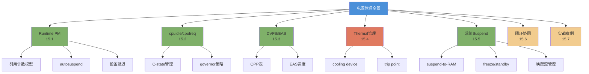

# 15.1.1 从待机耗电案例引入

> 所属章节：第15章 电源管理 > 15.1 Runtime PM
>
> 难度：[I] Intermediate | 预计阅读时间：12分钟

##  本节导读

你刚刚把产品从桌上拿起来，发现只过了一晚，电量从80%掉到了10%。你检查了`cpufreq`的governor，确认已经设成`ondemand`——按理说CPU应该在空闲时降频啊？怎么还是这么耗电？本节从一个真实的穿戴设备待机耗电案例出发，带你拆解电源管理的排查思路，看清Linux电源管理的全景地图。读完你会明白：**电源管理从来不是"打开一个开关"就能解决的事情**。

---

##  知识点238：待机耗电的排查思维框架 [I]

### 一个让人崩溃的早晨

你负责的智能手表项目进入量产前测试。产品经理发来一条消息："昨晚充满电放包里，今早只剩15%了。"

你第一反应是去查CPU频率。`cat /sys/devices/system/cpu/cpu0/cpufreq/scaling_governor`——输出`ondemand`，没问题。再一看`scaling_cur_freq`，发现空闲时确实降到了最低频。那你可能困惑了：CPU都idle了，电去哪了？

答案是：**CPU只是耗电来源之一，而且往往不是最大的那个。**

在嵌入式设备上，真正吞噬电量的往往是那些"看起来没在工作"的外设。WiFi芯片即使不传输数据，也可能维持在几百毫瓦；加速度传感器如果以100Hz持续采样，又是一个几十毫瓦的窟窿；AMOLED屏幕显示一个纯黑画面，背光也许关了，但驱动电路仍在消耗电流。更不用说那些没有正确进入suspend的GPIO、始终上电的音频Codec、还有漏电流过大的PMU LDO。

所以排查功耗问题的第一步，是建立一个系统性的思维框架。

### 四层排查模型

面对待机耗电，我建议你从四个层面逐层排查：

**第一层：CPU本身**。CPU真的idle了吗？`top`看到的idle百分比是90%，但这只是统计意义上的idle——可能CPU每1ms被某个定时器中断唤醒一次，从 deepest C-state 退出来，功耗暴增。`cpuidle`的C-state（C0→C1→C2→C7等）决定了CPU在idle时能省多少电，`cpufreq`的governor决定了运行时的频率策略。这两者是CPU层面省电的基础，但前提是真的有机会idle。

**第二层：设备层面**。每个外设驱动是否实现了`runtime_suspend`和`runtime_resume`？WiFi芯片在不传输时能否进入深度睡眠？加速度计能否从连续采样切换到motion-triggered唤醒模式？这就是`Runtime PM`（Runtime Power Management）要解决的问题——**让设备在不被使用时自动休眠，在使用时自动唤醒**，完全透明于用户空间。

**第三层：系统层面**。当整个系统长时间不被使用时，是否应该进入`suspend-to-RAM`（S3/STR）？谁来做唤醒源（wake-up source）？rtc定时器、GPIO按键、触摸屏中断——这些都需要在suspend前正确配置。Runtime PM处理的是"运行时的细粒度节电"，而系统suspend处理的是"整机的粗粒度节电"，二者互补。

**第四层：温度层面**。你可能没意识到，`thermal`子系统在芯片温度过高时会强制降频——但降频本身不一定省电，因为任务执行时间变长，整体能耗可能反而增加。更进一步，如果散热设计不合理，设备可能长期处于一个既不高效也不省电的温度区间。

### 可能耗电来源速查表

| 耗电来源 | 排查工具/方法 | 典型值（穿戴设备） | 优化方向 |
|---------|-------------|-----------------|---------|
| CPU动态功耗 | `cpufreq` + `cpuidle`统计 | 50~300mW | 更深的C-state、更低的idle频率 |
| CPU静态功耗（漏电流） | 芯片datasheet | 10~50mW | 低功耗工艺版本、降低电压 |
| WiFi/BT芯片 | `iw dev power_save` / `hciconfig` | 100~500mW（active）| 深度睡眠模式、提升信标间隔 |
| 传感器（加速度/陀螺仪） | 传感器驱动的功耗寄存器 | 10~100mW | 降采样率、FIFO批处理、motion唤醒 |
| 显示屏/背光 | 亮度设置 + 驱动功耗寄存器 | 50~300mW | 自适应亮度、earlysuspend |
| GPIO漏电流 | 万用表 / `debugfs/gpio` | 1~10mW/每pin | 配置为input pull-down、关闭LDO供电 |
| DDR自刷新 | `pm_ops` suspend统计 | 30~100mW | 降低刷新率、部分阵列自刷新 |
| PMU/LDO效率 | 效率曲线 / 实测 | 损耗5%~20% | 选用高效DCDC、关断未用LDO通道 |

> 💡 **提示**：先用`powertop`（或Android的`dumpsys batterystats`）找到耗电分布，再针对性优化。不要盲目调CPU governor——十有八九不是CPU的锅。

> ⚠️ **陷阱**：很多人优化了CPU cpufreq后发现功耗纹丝不动，于是怀疑人生。实际上屏幕、WiFi、LED这些外设才是耗电大户。建议先关外设做对照实验：把WiFi模块供电断开、屏幕背光关闭、所有传感器卸载驱动，测一个baseline功耗，再逐个加回来，找到真正的 culprit。

---

##  本章路线图

第15章的全部内容可以用一张全景图概括：

### 各节之间的关系

Runtime PM和cpuidle/cpufreq解决的是**运行时的动态节电**：前者让"不用"的设备睡觉，后者让"空闲"的CPU睡觉。DVFS/EAS在运行时进一步优化性能与功耗的 trade-off。Thermal是一个容易被忽视的反方向力——它在温度高时被动降频，可能打乱前面所有优化。系统suspend则处理整机长时间idle的场景。最终15.6节把它们串成一个**闭环**：什么时候该用Runtime PM、什么时候该进suspend、Thermal如何与DVFS协同——这是真正做出优秀电源管理产品的关键。

---

##  本节总结

| 要点 | 内容 |
|------|------|
| 核心认知 | 电源管理不是"一个开关"，是多子系统的协同工程 |
| 排查四层模型 | CPU（cpuidle/cpufreq）→ 设备（Runtime PM）→ 系统（suspend）→ 温度（thermal） |
| 关键工具 | `powertop`、`cpufreq` sysfs、`iw` / `hciconfig`、sensor寄存器、debugfs |
| 常见误区 | 只看CPU governor，忽略外设功耗；不做baseline对照实验 |
| 本章路线 | 15.1 Runtime PM → 15.2 cpuidle/cpufreq → 15.3 DVFS/EAS → 15.4 Thermal → 15.5 Suspend → 15.6 闭环 → 15.7 实战 |

---

##  下一步

接下来我们要深入第一个也是最常用的节电子系统——**Runtime PM**。15.1.2将讲解Runtime PM的引用计数模型：内核如何通过`pm_runtime_get()`和`pm_runtime_put()`追踪设备的使用状态，实现"无人使用时自动休眠、有人使用时自动唤醒"的透明化电源管理。

---

##  配套资源

- **工具**：`powertop` — Linux功耗分析利器，`apt install powertop`即可使用
- **文档**：Kernel文档 `Documentation/power/runtime_pm.rst`
- **实验建议**：找一块ARM开发板，断开所有外设测baseline功耗，逐个模块上电对比
