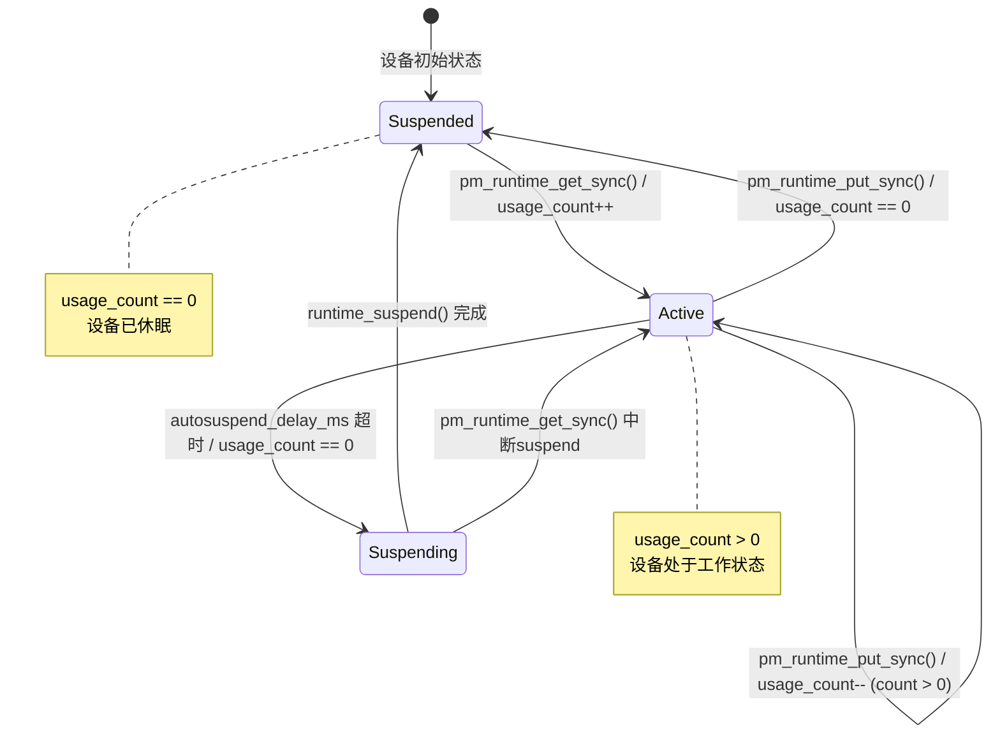
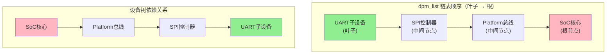

# 15.1.2 Runtime PM的引用计数模型

> 所属章节：第15章 电源管理 > 15.1 系统级电源管理
>
> 难度：[I] Intermediate | 预计阅读时间：20分钟

## <span class="blue"> 本节导读

上一篇我们了解了Runtime PM的基本思想和核心数据结构。本节深入其**引用计数模型**——这是整个Runtime PM机制运转的"发动机"。你將学会 `pm_runtime_get/put` 系列API的用法、autosuspend延迟机制，以及如何在自己的驱动中注册Runtime回调。读完本节，你应该能够独立在驱动中实现完整的Runtime PM支持。

---

## <span class="blue"> 知识点239：pm_runtime_get/put 与引用计数 [I][M]

Runtime PM 的核心设计出奇地简单：每个设备维护一个**引用计数器（usage_count）**，驱动在需要使用设备时"获取"引用，用完时"释放"引用。当计数降到零，设备就可以休眠了。

### 引用计数模型状态机



### 核心API一览

| 函数 | 功能 | 同步/异步 | 引用计数变化 | 调用时机 |
|------|------|-----------|-------------|----------|
| `pm_runtime_get_sync()` | 同步获取设备 | SYNC | `usage_count++` | 需要确保设备就绪时使用 |
| `pm_runtime_get()` | 异步获取设备 | ASYNC | `usage_count++` | 不阻塞当前上下文，稍后异步唤醒 |
| `pm_runtime_get_noresume()` | 仅增加计数 | 无I/O | `usage_count++` | 设备已确认active，避免重复唤醒开销 |
| `pm_runtime_put_sync()` | 同步释放设备 | SYNC | `usage_count--` | 完成操作，若计数为0则同步suspend |
| `pm_runtime_put()` | 异步释放设备 | ASYNC | `usage_count--` | 不阻塞，稍后异步处理suspend |
| `pm_runtime_put_noidle()` | 仅减少计数 | 无I/O | `usage_count--` | 不想触发suspend时使用 |
| `pm_runtime_idle()` | 请求空闲处理 | ASYNC | 不变 | 提示子系统设备可能可以idle |

### get_sync() 的完整流程

当你调用 `pm_runtime_get_sync(dev)` 时，内核会做以下事情：

1. 检查 `power.disable_depth` —— 如果 Runtime PM 被禁用，直接返回
2. 递增 `power.usage_count`
3. 如果设备当前处于 `suspended` 状态，调用注册的 `runtime_resume()` 回调唤醒设备
4. 等待唤醒完成（因为是 SYNC 接口）
5. 将 `runtime_status` 更新为 `active`

返回值很有讲究：0 表示成功，负值表示出错（比如 resume 回调失败了）。**一定要检查返回值**，别假设设备一定被成功唤醒。

### put_sync() 的完整流程

`pm_runtime_put_sync(dev)` 则是相反的操作：

1. 递减 `power.usage_count`
2. 如果 `usage_count > 0`，直接返回
3. 如果 `usage_count == 0`，调用 `runtime_suspend()` 回调让设备休眠
4. 将 `runtime_status` 更新为 `suspended`

注意这里的同步语义：调用者会一直等到 `runtime_suspend()` 执行完毕才返回。如果你的 suspend 回调里有耗时操作（比如等待硬件ack），这里就会阻塞。

### noresume 和 noidle 的妙用

这两个变体是性能优化的好帮手：

- **`pm_runtime_get_noresume()`**：你只是"以防万一"地增加计数，但确信设备已经在 active 状态。这样内核会跳过状态检查和 resume 调用，只是一条原子递增操作。

- **`pm_runtime_put_noidle()`**：你需要减少计数，但当前时机不适合触发 suspend（比如你在中断上下文，或者接下来马上又要用设备）。计数减了，但不会走 suspend 流程。

```c
/* 典型场景：已确认设备active时快速获取引用 */
if (pm_runtime_active(dev))
    pm_runtime_get_noresume(dev);  /* 快速路径，无I/O */
else
    pm_runtime_get_sync(dev);       /* 慢速路径，需要唤醒 */

/* 使用设备 ... */

pm_runtime_put_sync(dev);  /* 配对释放 */
```

### autosuspend 延迟机制

实际工程中有个头疼的问题：设备刚 put 不久，马上又 get。如果每次 put 都立即 suspend，紧接着的 get 又要 resume，反复进出反而更耗电。

内核的解决方案是 **autosuspend**：允许配置一个延迟时间，put 之后不会立即 suspend，而是等一段"安静期"。

```c
/* 设置自动休眠延迟为 100 毫秒 */
pm_runtime_set_autosuspend_delay(dev, 100);

/* 启用自动休眠功能 */
pm_runtime_use_autosuspend(dev);
```

延迟期间如果又有新的 `get`，计时器会被重置，设备保持 active。只有当计时器到期且 `usage_count == 0` 时，才会真正调用 `runtime_suspend()`。

> ⚠️ **陷阱**：错误路径上调用 `get` 但没调用 `put` → 引用计数永不为 0 → 设备永不 suspend。这是最常见的 Runtime PM bug。常见场景包括：
> - `goto error` 跳转时遗漏 `put`
> - 提前 `return` 时忘记释放引用
> - 中断处理中 `get` 了但下半部没 `put`
>
> 建议：使用 `goto` 统一出口，或者在每个错误分支显式写 `put`。

> 💡 **提示**：`pm_runtime_get_sync()` 返回后，设备**可能**已经是 active 状态，但也可能在执行中。如果你需要确保硬件寄存器可以访问，最好检查返回值。`pm_runtime_put_sync()` 返回时，设备**可能**已经是 suspended 状态，如果 suspend 回调里有异步操作（比如DMA传输完成后才关闭时钟），要注意竞态。

---

## <span class="blue"> 知识点240：dev_pm_ops 注册与 runtime_status 查看 [I]

光有 API 不够，你还得告诉内核：**我的设备怎么 suspend？怎么 resume？** 这就是 `dev_pm_ops` 的作用。

### 注册 Runtime PM 回调

```c
#include <linux/pm_runtime.h>

/* dev_pm_ops 结构体定义 */
static const struct dev_pm_ops my_driver_pm_ops = {
    .runtime_suspend = my_runtime_suspend,
    .runtime_resume  = my_runtime_resume,
    .runtime_idle    = my_runtime_idle,  /* 可选 */
};

/* 挂接到 driver 结构体 */
static struct platform_driver my_driver = {
    .probe  = my_probe,
    .remove = my_remove,
    .driver = {
        .name = "my-device",
        .pm   = &my_driver_pm_ops,  /* 在这里挂接 */
    },
};
```

三个回调各有分工：

| 回调函数 | 触发条件 | 典型操作 | 返回值 |
|----------|----------|----------|--------|
| `runtime_suspend()` | `usage_count == 0` 且 autosuspend 延迟到期 | 关闭时钟、切断电源、保存寄存器状态 | 0 成功，负值错误 |
| `runtime_resume()` | `pm_runtime_get*()` 且设备在 suspended 状态 | 恢复电源、开启时钟、恢复寄存器状态 | 0 成功，负值错误 |
| `runtime_idle()` | `pm_runtime_idle()` 被调用，或 put 后可选触发 | 额外省电操作（如降低时钟频率） | 通常返回 0 或 -EBUSY |

### 在 probe 中启用 Runtime PM

```c
static int my_probe(struct platform_device *pdev)
{
    struct device *dev = &pdev->dev;
    int ret;

    /* ... 初始化硬件 ... */

    /* 启用 Runtime PM，自动处理 cleanup */
    ret = devm_pm_runtime_enable(dev);
    if (ret)
        return ret;

    /* 设置自动休眠延迟 200ms */
    pm_runtime_set_autosuspend_delay(dev, 200);
    pm_runtime_use_autosuspend(dev);

    /* 初始状态设为 suspended（设备还没被使用） */
    pm_runtime_set_suspended(dev);

    return 0;
}
```

`devm_pm_runtime_enable()` 是首选方式——它会自动在设备卸载时调用 `pm_runtime_disable()` 做清理，避免遗漏。

如果你想手动控制（不推荐，除非有特殊理由）：

```c
pm_runtime_enable(dev);   /* 启用 */
/* ... 驱动生命周期 ... */
pm_runtime_disable(dev);  /* 禁用，注意必须在 remove 中调用 */
```

> 💡 **提示**：优先使用 `devm_pm_runtime_enable()`。它基于 devm（Device Resource Management）机制，自动绑定设备生命周期，remove 时自动清理，省去一大堆错误处理代码。

### 查看 runtime_status

调试 Runtime PM 时，你可以通过 sysfs 查看设备状态：

```bash
# 查看设备的 Runtime PM 状态
cat /sys/devices/platform/my-device/power/runtime_status
# 输出可能是：active / suspended / unsupported / error / unknown

# 查看当前引用计数
cat /sys/devices/platform/my-device/power/runtime_usage
# 输出：0, 1, 2, ...

# 查看是否启用了 autosuspend
cat /sys/devices/platform/my-device/power/autosuspend_delay_ms
# 输出：-1（禁用）或 100（100毫秒）

# 查看 Runtime PM 是否启用
cat /sys/devices/platform/my-device/power/control
# 输出：auto（Runtime PM 控制）或 on（强制开启）
```

### runtime_status 状态说明

| 状态 | 含义 | 转换条件 |
|------|------|----------|
| `active` | 设备处于工作状态 | `runtime_resume()` 成功完成后 |
| `suspended` | 设备已休眠 | `runtime_suspend()` 成功完成后 |
| `suspending` | 正在尝试休眠（中间态） | `runtime_suspend()` 被调用但尚未完成 |
| `resuming` | 正在尝试唤醒（中间态） | `runtime_resume()` 被调用但尚未完成 |
| `unknown` | 状态未知（初始或出错后） | 设备未注册 Runtime PM 或发生内部错误 |

```c
/* 代码中查看当前状态 */
enum rpm_status status = dev->power.runtime_status;

switch (status) {
case RPM_ACTIVE:
    pr_info("Device is active\n");
    break;
case RPM_SUSPENDED:
    pr_info("Device is suspended\n");
    break;
case RPM_SUSPENDING:
    pr_info("Device is suspending...\n");
    break;
/* ... */
}
```

### 完整驱动示例

下面是一个整合了 get/put 配对和 dev_pm_ops 注册的完整示例：

```c
static int my_runtime_suspend(struct device *dev)
{
    struct my_priv *priv = dev_get_drvdata(dev);

    /* 关闭硬件时钟 */
    clk_disable_unprepare(priv->clk);
    /* 关闭 regulator */
    regulator_disable(priv->reg);

    return 0;
}

static int my_runtime_resume(struct device *dev)
{
    struct my_priv *priv = dev_get_drvdata(dev);
    int ret;

    /* 恢复 regulator */
    ret = regulator_enable(priv->reg);
    if (ret)
        return ret;

    /* 恢复时钟 */
    ret = clk_prepare_enable(priv->clk);
    if (ret)
        regulator_disable(priv->reg);

    return ret;
}

static const struct dev_pm_ops my_pm_ops = {
    .runtime_suspend = my_runtime_suspend,
    .runtime_resume  = my_runtime_resume,
};

/* ===== 用户接口函数 ===== */
static ssize_t my_read(struct file *filp, char __user *buf,
                       size_t count, loff_t *off)
{
    struct my_priv *priv = filp->private_data;
    struct device *dev = priv->dev;
    int ret;

    /* [1] 获取设备，确保活跃 */
    ret = pm_runtime_get_sync(dev);
    if (ret < 0) {
        pm_runtime_put_noidle(dev);  /* 补偿内部计数 */
        return ret;
    }

    /* [2] 执行硬件操作 */
    ret = do_hardware_read(priv, buf, count);

    /* [3] 释放设备 —— 即使 [2] 出错也要执行 */
    pm_runtime_put_sync(dev);

    return ret;
}

static ssize_t my_write(struct file *filp, const char __user *buf,
                        size_t count, loff_t *off)
{
    struct my_priv *priv = filp->private_data;
    struct device *dev = priv->dev;
    int ret;

    ret = pm_runtime_get_sync(dev);
    if (ret < 0) {
        pm_runtime_put_noidle(dev);
        return ret;
    }

    ret = do_hardware_write(priv, buf, count);

    pm_runtime_mark_last_busy(dev);  /* 更新最后活跃时间，延后autosuspend */
    pm_runtime_put_autosuspend(dev); /* 使用autosuspend版本 */

    return ret;
}
```

注意 `my_write()` 中使用了两个小技巧：

1. **`pm_runtime_mark_last_busy()`**：告诉内核"我刚用完设备，推迟 autosuspend 计时"。这对于写操作很有用——写完可能马上又要读。
2. **`pm_runtime_put_autosuspend()`**：走 autosuspend 流程，而不是立即 suspend。

> 🔴 **危险**：`pm_runtime_get_sync()` 失败后，内部计数可能已经增加。如果不调用 `pm_runtime_put_noidle()` 补偿，会导致计数泄漏。**永远记得**：`get` 失败时也要做 `put_noidle` 补偿。

---

## <span class="blue"> 知识点263：suspend/resume设备顺序（dpm_list）[I]

Runtime PM 只管理单个设备的唤醒与休眠，但系统级 suspend（如挂起到内存）涉及成百上千个设备的协同操作。**谁应该先休眠？谁应该后醒来？** 如果顺序错了，子设备还在访问已经关闭的父资源，系统就会挂死。内核通过 **dpm_list**（Device Power Management List）来解决这个问题。

### dpm_list：按依赖关系排序的设备链表

dpm_list 是内核维护的一条全局链表，所有参与电源管理的设备都会注册到其中。关键之处在于：**链表中的设备按设备树的父子关系排序**。内核在设备注册时根据其在设备树中的位置，将它插入到合适的位置，确保父子依赖关系在链表中正确反映。



上图中，设备树里 SoC 是 UART 的"曾祖父"。dpm_list 的链表顺序恰好反过来——从叶子到根。这保证了 suspend 时从最底层的设备开始处理。

### suspend 顺序：叶子 → 根

| 方向 | 顺序 | 原因 | 类比 |
|------|------|------|------|
| suspend | 先子设备 → 后父设备 | 子设备 suspend 时可能还需访问父设备的资源（clock、regulator、总线），父设备必须先提供这些资源 | 先关闭应用程序 → 再关闭操作系统 → 最后关电源 |
| resume | 先父设备 → 后子设备 | 子设备 resume 时需要父设备已经准备好时钟、电源、总线等基础资源 | 先开电源 → 再启动操作系统 → 最后打开应用程序 |

suspend 时从 dpm_list 的**头部**开始遍历（叶子优先），resume 时从 dpm_list 的**尾部**开始遍历（根优先）。内核在 `drivers/base/power/main.c` 中的 `dpm_suspend()` 和 `dpm_resume()` 函数里实现了这一逻辑。

### dev_pm_ops 中的完整回调链

系统级 suspend/resume 不是简单的两个回调，而是一个**分阶段的回调链**。不同阶段的回调在不同上下文中执行，处理不同层级的资源。

| 回调 | 方向 | 调用时机 | 用途 |
|------|------|----------|------|
| `prepare()` | suspend | 关闭设备 I/O 之前 | 阻止新请求提交，等待进行中的请求完成 |
| `suspend()` | suspend | 设备停止运行后 | 保存设备状态，关闭非必要资源 |
| `suspend_late()` | suspend | 大部分设备已 suspend 后 | 处理跨设备依赖的最后阶段清理 |
| `suspend_noirq()` | suspend | 中断已关闭后 | 操作需要关中断才能安全访问的硬件 |
| `resume_noirq()` | resume | 中断尚未开启前 | 恢复关中断期间才能安全操作的硬件 |
| `resume_early()` | resume | 中断恢复后，大部分设备 resume 前 | 恢复基础资源，供后续设备使用 |
| `resume()` | resume | 正常 resume 阶段 | 恢复设备状态，重新启用 I/O |
| `complete()` | resume | 所有设备 resume 后 | 通知设备恢复完成，可接收新请求 |

注意Runtime PM 的 `runtime_suspend()` / `runtime_resume()` 只对应系统级 suspend 链中的一部分场景。当系统真正进入全局 suspend 时，完整的八阶段回调链会依次执行。

### power-domains 与 suspend 顺序

Generic Power Domain（genpd）在 dpm_list 中**作为一个虚拟设备**参与排序。它的处理规则是：

- **domain 内所有设备先 suspend** → **domain 本身再 suspend**
- **domain 本身先 resume** → **domain 内设备再 resume**

这意味着 genpd 的 suspend 回调在 domain 内所有真实设备的 `suspend()` 都完成后才执行，通常在这里执行真正切断电源域的操作。resume 时则相反，genpd 先恢复电源域供电，domain 内的设备才能正常 resume。

> ⚠️ **陷阱**：probe 中忘记调用 `pm_runtime_enable()`（或 `devm_pm_runtime_enable()`）→ 设备不会被加入 dpm_list → 系统级 suspend/resume 时内核完全"看不到"这个设备 → 电源管理失效。常见表现是：suspend 时设备没保存状态，resume 后设备工作异常。更隐蔽的是，如果该设备在 suspend 时没被关闭，它可能继续产生中断或 DMA，导致系统不稳定。**务必在 probe 中启用 Runtime PM**。

> 💡 **提示**：调试 suspend/resume 顺序时，可以通过 `dmesg | grep -i dpm` 查看内核打印的设备处理顺序。输出中设备按 suspend 的实际调用顺序列出，如果出现"parent device already suspended but child still accessing"之类的错误，说明 dpm_list 中的依赖关系可能有问题——检查设备树中是否正确描述了父子关系。

---

## <span class="blue"> 本节总结

| 概念 | 要点 | 记忆口诀 |
|------|------|----------|
| 引用计数 | `usage_count` 为0时设备可suspend，大于0时必须active | "计数为零，设备就停" |
| `get_sync()` | 同步获取，必要时唤醒设备，返回后设备可用 | "get用设备，先确保醒来" |
| `put_sync()` | 同步释放，计数为0时suspend | "put放设备，没人用就睡" |
| `get_noresume()` | 只增计数，不做I/O，设备已active时优化 | "已醒就别再叫" |
| `put_noidle()` | 只减计数，不触发suspend | "数数要减，但别急着睡" |
| autosuspend | put后延迟suspend，避免频繁唤醒-休眠 | "等一等，也许马上又要用" |
| `devm_pm_runtime_enable()` | probe中启用，自动清理 | "devm省心，自动打理" |
| `runtime_status` | active/suspended/suspending/resuming/unknown | "五态分明，调试有凭" |

---

## <span class="blue"> 下一步

下一篇 **15.1.3 genpd与power_domain** 将介绍 Generic Power Domain（genpd）框架——它把设备按电源域分组管理，实现跨设备的协同电源控制。当你有多个设备共享同一个电源轨时，genpd 能帮你解决"谁先关、谁后关"的依赖问题。

---

## <span class="blue"> 配套资源

- Linux内核源码：`drivers/base/power/runtime.c` —— Runtime PM 核心实现
- 文档：`Documentation/power/runtime_pm.rst` —— 官方 Runtime PM 指南
- 参考头文件：`include/linux/pm_runtime.h` —— 所有 API 声明
