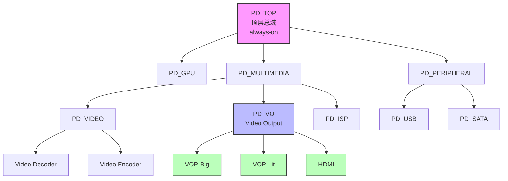

# 15.1.3 genpd 与 Power Domain

> 所属章节：第15章 电源管理 > 15.1 设备电源管理框架
>
> 难度：[E] Expert | 预计阅读时间：15分钟

## <span class="blue"> 本节导读

前面的章节我们讨论了单个设备的 suspend/resume。但在现代 SoC 中，数以百计的设备并不是各自独立供电的——它们被划分到不同的 **Power Domain** 中，一个 domain 内的所有设备共享同一组电源轨。Linux 内核中的 **genpd**（Generic Power Domain）框架，就是为了统一管理这种"域级别"的电源开关而设计的。

本节将深入 genpd 的核心机制：它是如何描述 SoC 的 power domain 划分、如何通过设备树建立层级关系、以及如何在运行时自动聚合 domain 内所有设备的电源需求，做到"该关的时候一起关，该开的时候及时开"。

<br>

## <span class="blue"> 知识点 241：genpd 框架与 Power Domain 层级管理 [E]

### genpd 的设计思想

想象你家的电源配电箱。总闸下面有多个分闸：厨房一路、卧室一路、客厅一路。当你出远门时，不需要拔掉每个电器的插头，只需要拉下对应的分闸，整个房间的电源就被切断了。genpd 做的就是同样的事情——只不过它管理的是 SoC 内部的"电力分区"。

genpd 框架的核心设计：

- **分区供电**：将 SoC 划分为多个独立的 power domain，每个 domain 可以独立上电/断电
- **设备聚合**：domain 内的所有设备共享同一组电源，genpd 自动追踪它们的 collective（集体）状态
- **层级嵌套**：支持 parent-child 结构，子 domain 的供电依赖于父 domain
- **透明管理**：设备驱动通常不需要感知自己属于哪个 domain，一切由 genpd 自动处理

这个设计带来的好处是巨大的。没有 genpd 时，系统休眠需要逐个关闭数百个设备；有了 genpd，只要一个 domain 内的所有设备都 idle，genpd 就可以一次性切断整个 domain 的电源。

<br>

### 关键概念一览

genpd 涉及的概念较多，我们先通过一个表格理清它们之间的关系：

| 概念 | 含义 | 设备树对应 | 内核代码路径 |
|------|------|-----------|-------------|
| **Power Domain** | SoC 上的一个独立供电区域，可独立开关 | `power-controller` 节点 | `drivers/base/power/domain.c` |
| **Domain 提供者** | 控制 power domain 硬件的驱动 | 实现 `struct generic_pm_domain` | `drivers/soc/xxx/pm-domains.c` |
| **Domain 消费者** | 属于某个 domain 的普通设备 | 设备节点的 `power-domains` 属性 | 设备驱动自动绑定 |
| **Subdomain** | 嵌套的子 domain，依赖父 domain | `power-domain` 节点嵌套 | `pm_genpd_add_subdomain()` |
| **State** | Domain 当前状态（on/off/active） | 无 | `/sys/kernel/debug/pm_genpd/` |
| **Performance State** | Domain 性能状态（如电压/频率等级） | `power-domain` 的 `#power-domain-cells` | `dev_pm_genpd_set_performance_state()` |

<br>

### 设备树中的 Power Domain 配置

Power domain 的层级关系完全在设备树中描述。一个典型的配置包含两部分：**domain 定义** 和 **设备引用**。

先来看 domain 定义——由 SoC 厂商在 dtsi 文件中提供：

```dts
// arch/arm64/boot/dts/rockchip/rk3399.dtsi

/* 定义一个 power controller 节点 */
pmu: power-management@ff310000 {
    compatible = "rockchip,rk3399-pmu", "syscon";
    ...

    /* Power Domain 控制器 */
    power: power-controller {
        compatible = "rockchip,rk3399-power";
        #power-domain-cells = <1>;          /* 引用时需要1个cell */
        #address-cells = <1>;
        #size-cells = <0>;

        /* PD_VO (Video Output domain) */
        power-domain@RK3399_PD_VO {
            reg = <RK3399_PD_VO>;
            clocks = <&cru DCLK_VOP0>, <&cru DCLK_VOP1>;
            pmu_qos = <&qos_vop>;
            #power-domain-cells = <0>;      /* 叶子domain，无子cell */
        };

        /* PD_VIO (Video IO domain) - 包含子domain */
        power-domain@RK3399_PD_VIO {
            reg = <RK3399_PD_VIO>;
            #power-domain-cells = <0>;

            /* PD_VO 是 PD_VIO 的子domain */
            power-domain@RK3399_PD_VO {
                reg = <RK3399_PD_VO>;
            };
        };
    };
};
```

然后是设备节点引用自己所属的 power domain：

```dts
/* VOP (Video Output Processor) 设备 */
vop: vop@ff930000 {
    compatible = "rockchip,rk3399-vop-big";
    reg = <0x0 0xff930000 0x0 0x2fc>;
    interrupts = <GIC_SPI 118 IRQ_TYPE_LEVEL_HIGH>;
    clocks = <&cru DCLK_VOP0>, <&cru HCLK_VOP0>, <&cru ACLK_VOP0>;
    clock-names = "dclk_vop0", "hclk_vop0", "aclk_vop0";
    
    /* 关键：声明该设备属于 PD_VO power domain */
    power-domains = <&power RK3399_PD_VO>;
    
    /* iommus 也需要关联到同一个 domain */
    iommus = <&vopb_mmu>;
    status = "disabled";
};
```

这里的 `power-domains = <&power RK3399_PD_VO>` 是关键——它告诉内核："这个 VOP 设备 resides（驻留）在 PD_VO power domain 中，它的电源生命周期由 genpd 统一管理。"

> ⚠️ **陷阱**：如果设备的 `power-domains` 属性指向了错误的 domain，或者 cell 编号写错，设备在 suspend/resume 时会出现莫名其妙的挂起或复位失败。常见症状是：系统休眠时设备无法正常断电，或者唤醒时设备寄存器读写出错。排查方法是检查 `dmesg` 中 genpd 相关的注册日志，确认每个设备绑定的 domain 是否正确。

<br>

### genpd 的层级结构与工作原理

现代 SoC 的 power domain 往往呈树状层级结构。以一个简化版的结构为例：



**核心规则**——genpd 的自动管理遵循两条铁律：

1. **断电条件**：domain 内 **所有** 设备都进入了 suspend / runtime-suspend 状态 → genpd 自动关闭该 domain
2. **上电条件**：domain 内 **任一** 设备需要 active / resume → genpd 自动开启该 domain（以及所有祖先 domain）

层级结构的供电依赖：

- 子 domain 的供电依赖于父 domain。如果父 domain 被关闭，所有子 domain 必然断电
- genpd 在关闭父 domain 前，会先递归关闭所有子 domain
- 在开启子 domain 时，会先确保所有祖先 domain 都已上电

这种自动聚合意味着：驱动开发者通常 **不需要** 在自己的 suspend/resume 函数中手动操作 power domain。只要正常调用 `pm_runtime_put()` 和 `pm_runtime_get_sync()`，genpd 会自动"算总账"。

<br>

### 在运行时查看 Power Domain 状态

调试电源管理问题时，了解当前各个 power domain 的状态至关重要。genpd 提供了 debugfs 接口：

> 💡 **提示**：挂载 debugfs 后，通过 `/sys/kernel/debug/pm_genpd/pm_genpd_summary` 可以一目了然地查看所有 power domain 的当前状态、引用计数、以及下属设备列表。

```bash
# 查看 power domain 总体摘要
cat /sys/kernel/debug/pm_genpd/pm_genpd_summary
```

一个典型的输出如下：

```
domain                          status          slaves          count   unknown
PD_TOP                          on                              0       0
    PD_MULTIMEDIA               on              1               0       0
        PD_VIDEO                off             2               0       0
        PD_VO                   on              3               2       0
    PD_GPU                      off             0               0       0
    PD_PERIPHERAL               on              2               0       0
        PD_USB                  on              1               1       0
```

各列含义：

| 列名 | 含义 |
|------|------|
| `domain` | domain 名称，缩进表示层级关系 |
| `status` | 当前状态：`on` / `off` / `active` |
| `slaves` | 子 domain 数量 |
| `count` | active 引用计数——多少个设备要求该 domain 上电 |
| `unknown` | 状态未知的设备数量 |

你也可以查看更详细的信息：

```bash
# 查看某个具体 domain 的详细信息
ls /sys/kernel/debug/pm_genpd/          # 列出所有 domain 目录
cat /sys/kernel/debug/pm_genpd/PD_VO/status    # 查看 PD_VO 状态
cat /sys/kernel/debug/pm_genpd/PD_VO/devices   # 查看 PD_VO 下的所有设备
```

<br>

### genpd 的内部数据结构与关键流程

在代码层面，每个 power domain 由 `struct generic_pm_domain` 表示：

```c
// include/linux/pm_domain.h
struct generic_pm_domain {
    struct device dev;              /* 内嵌 device 结构体 */
    const char *name;               /* domain 名称 */
    struct list_head gpd_list;      /* 全局 domain 链表 */
    struct list_head master_links;  /* 父 domain 链接 */
    struct list_head slave_links;   /* 子 domain 链接 */
    struct list_head dev_list;      /* 属于该 domain 的设备列表 */

    unsigned int device_count;      /* 设备总数 */
    unsigned int suspended_count;   /* 已 suspend 的设备数 */
    unsigned int prepared_count;    /* 已 prepared 的设备数 */
    
    bool status;                    /* true=on, false=off */
    bool sd_count;                  /* subdomain 引用计数 */
    
    /* 由平台驱动提供的回调 */
    int (*power_off)(struct generic_pm_domain *domain);
    int (*power_on)(struct generic_pm_domain *domain);
    ...
};
```

genpd 的核心逻辑在 `drivers/base/power/domain.c` 中。当设备调用 `pm_runtime_suspend()` 时，genpd 会执行类似这样的判断：

```
dev_pm_genpd_suspend(device)
  -> genpd_lock(domain)
  -> device->suspended = true
  -> domain->suspended_count++
  -> if (domain->suspended_count == domain->device_count)
       -> 所有设备都已 suspend，可以关闭 domain
       -> genpd_poweroff(domain)  // 调用平台 power_off 回调
  -> genpd_unlock(domain)
```

而当任一设备 resume 时：

```
dev_pm_genpd_resume(device)
  -> genpd_lock(domain)
  -> if (domain->status == off)
       -> 需要先上电
       -> genpd_poweron(domain)    // 递归上电所有祖先
  -> device->suspended = false
  -> domain->suspended_count--
  -> genpd_unlock(domain)
```

> 🔴 **危险**：`power_on` 和 `power_off` 回调由平台驱动（如 `rockchip-pm-domain.c`）实现，这些函数直接操作 SoC 的 PMU（Power Management Unit）寄存器。如果 platform 驱动中的时序或依赖关系有误（比如关闭 domain 前没有先关断时钟），可能导致系统硬锁死。因此，在 bring-up 新 SoC 的电源管理时，务必使用 JTAG 或串口保持可调试状态。

<br>

## <span class="blue"> 本节总结

| 主题 | 要点 |
|------|------|
| genpd 是什么 | Linux 内核的通用 power domain 管理框架，自动聚合 domain 内设备的电源状态 |
| 为什么需要 | SoC 设备按 domain 分区供电，手动管理容易出错；genpd 实现"自动关、按需开" |
| 设备树配置 | `power-controller` 定义 domain，`power-domains = <&ctrl index>` 绑定设备 |
| 层级结构 | 支持父子嵌套，子 domain 依赖父 domain 供电；genpd 自动处理递归开关 |
| 开关规则 | 所有设备 suspend → 可关 domain；任一设备 resume → 必开 domain（含祖先） |
| 调试接口 | `/sys/kernel/debug/pm_genpd/pm_genpd_summary` 查看全局状态 |
| 代码入口 | `drivers/base/power/domain.c` 为核心，`drivers/soc/xxx/pm-domains.c` 为平台实现 |

<br>

## <span class="blue"> 下一步

前面三节（15.1.1~15.1.3）我们围绕**设备电源管理**展开了讨论：从单个设备的 suspend/resume，到 runtime PM 的动态启停，再到 genpd 的域级聚合。这三层机制（device → runtime → domain）构成了 Linux 设备侧电源管理的完整金字塔。

接下来我们将进入**处理器电源管理**的世界——15.2.1 将介绍 `cpuidle` 框架与 C-state。如果说 genpd 管理的是"哪些硬件模块可以断电"，那么 cpuidle 管理的则是"CPU 在不执行任务时，可以进入多深的睡眠状态"。

<br>

## <span class="blue"> 配套资源

- **内核文档**：`Documentation/devicetree/bindings/power/power-domain.yaml`
- **核心源码**：`drivers/base/power/domain.c`
- **平台实现参考**：
  - `drivers/soc/rockchip/pm_domains.c` — Rockchip SoC 的 genpd 实现
  - `drivers/soc/amlogic/meson-ee-pwrc.c` — Amlogic SoC 的 genpd 实现
  - `drivers/soc/ti/prm.c` — TI OMAP/AM 系列的 power domain 实现
- **推荐阅读**：Documentation/power/runtime_pm.rst 中关于 power domain 的章节
