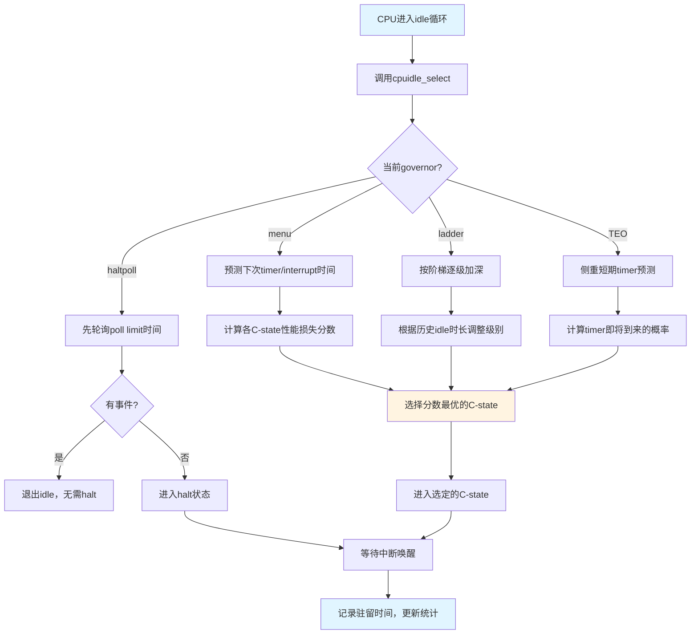

# 15.2.1 cpuidle与C-state

> 所属章节：第15章 电源管理 > 15.2 CPU电源管理
>
> 难度：[E][M] | 预计阅读时间：15分钟

## <span class="blue"> 本节导读

上一节我们了解了电源管理的全局框架，现在把目光聚焦到CPU自身的空闲电源管理上。cpuidle子系统负责在CPU无事可做时，把它推进一个合适的"睡眠状态"——也就是C-state。选得太浅，省电不够；选得太深，万一有急事要处理，醒来耗时太长又耽误事。这里面的门道，就是本节要聊的核心。

我们会先理清C-state的各个等级及其关键参数（exit_latency和target_residency），然后深入理解menu governor等四种调度策略的差异和适用场景。最后教你用cpupower工具查看实际C-state驻留统计，验证你的idle策略是否真的在有效工作。

---

## <span class="blue"> C-state等级与关键参数 [E][M]

### C-state是什么

当CPU执行完当前任务、idle循环发现没有可运行的进程时，内核的cpuidle子系统就有机会让CPU"睡一会儿"。这里的"睡"有不同的深度——从浅浅的打个盹到深度休眠，统称为C-state（CPU Idle State）。

- **C0**：CPU正常运行，执行指令。这不是idle状态，而是唯一的"清醒"状态。
- **C1**：停止时钟（Halt），CPU核心不再执行指令，但寄存器和缓存状态保持完整。唤醒极快，约1微秒，但省电效果有限。
- **C2/C3**：深度睡眠状态。CPU会进一步关闭时钟域，部分缓存可能被刷新或掉电。唤醒需要几十微秒，但功耗显著降低。
- **C6/C7**：最深度的C-state。CPU核心几乎完全断电，寄存器和缓存内容被保存到专用的 retention SRAM 中。唤醒可能需要上百微秒，但省电效果最显著。

C-state的数字越大，睡得越深。但这里面的核心矛盾是：**越深越省电，但醒来越慢。**

### 两个关键参数

每个C-state都有两个必须理解的参数，它们决定了governor（后面会讲）如何选择合适的C-state。

**exit_latency**——退出延迟。指CPU从该C-state唤醒到真正执行第一条指令的时间。这个数字直接告诉你：如果选了这个C-state，等有急事来的时候，CPU要"愣神"多久才能开始干活。实时性敏感的场景必须盯紧这个值。

**target_residency**——目标驻留时间。这是一个决策阈值。它的含义是：CPU必须在这个C-state中停留**超过**这个时长，省电收益才能覆盖进出该状态的损耗（功耗开销+时间开销）。如果预测CPU只能idle 10us，而C3的target_residency是50us，那选C3就是亏本的——进去再出来，净损耗反而比待着不动更大。

来看一张总结表，感受一下实际数字的量级：

| C-state | exit_latency | target_residency | 典型功耗 | 适用场景 |
|---------|-------------|------------------|----------|----------|
| C0 | 0 | 0 | TDP全功耗 | 正常运行 |
| C1 | ~1 us | ~2-4 us | 约80-90% TDP | 频繁唤醒、极短空闲 |
| C2 | ~10-30 us | ~20-100 us | 约60-80% TDP | 一般服务器/桌面空闲 |
| C3 | ~50-100 us | ~100-500 us | 约30-50% TDP | 较长空闲周期 |
| C6 | ~100-300 us | ~300-1000 us | 约10-20% TDP | 深度空闲、省电优先 |
| C7 | ~200-500 us | ~500-2000 us | 约5-10% TDP | 超低功耗、非实时场景 |

> ⚠️ **陷阱**：深度C-state的唤醒延迟可能严重影响实时任务。如果你的嵌入式系统有硬实时要求（比如us级响应的电机控制），让CPU进入C3以下的深度状态就是埋雷。务必测量你硬件上每个C-state的实际exit_latency，并结合任务的最坏情况响应时间来设置`idle_states.disabled`或选择保守的governor。

---

## <span class="blue"> cpuidle Governor：谁来决定睡多深 [E][M]

cpuidle的核心问题是：idle循环来了，选哪个C-state？Linux提供了多种governor来做这个决策。理解它们的差异，是调优CPU idle的关键。

cpuidle_select()是 governor 决策的入口，它的核心逻辑可以简化理解如下：

```c
// 内核代码路径：drivers/cpuidle/cpuidle.c
// cpuidle_select() —— 为当前CPU选择最佳C-state

int cpuidle_select(struct cpuidle_driver *drv, struct cpuidle_device *dev,
                   bool *stop_tick)
{
    // 1. 获取下一次定时器事件的预计时间（ns）
    //    这是预测idle时长的关键输入
    s64 next_timer = tick_nohz_get_sleep_length();

    // 2. 如果注册了governor，调用governor的select回调
    if (dev->governor) {
        return dev->governor->select(drv, dev, stop_tick);
    }

    // 3. 默认fallback：从最深的C-state往回找
    //    找到第一个target_residency < 预测idle时长的状态
    for (i = drv->state_count - 1; i > 0; i--) {
        if (drv->states[i].target_residency <= predicted_idle)
            return i;  // 返回选中的C-state索引
    }
    return 0;  // fallback 到 C1（最浅的idle）
}
```

### 四种Governor对比

| Governor | 核心策略 | 适用场景 | 推荐系统 |
|----------|---------|----------|----------|
| menu | 预测下次事件时间（timer/interrupt），基于exit_latency和target_residency计算"性能损失分数"，选最优C-state | 通用场景，预测准确率较高 | 桌面、服务器、多数嵌入式系统 |
| ladder | 阶梯式策略：idle时间累积逐级加深，每次进入更浅一级，长时间idle才逐步进入更深状态 | 状态切换开销大的老旧CPU | 老旧硬件（ARMv7及更早） |
| TEO | 事件定向最优（Timer Events Oriented）。专门优化定时器密集场景，侧重短期预测，减少因timer即将到来的不必要的深度idle | 定时器密集型工作负载 | 定时器频繁的系统、网络设备 |
| haltpoll | 轮询式halt：先轮询一段时间（poll limit），确认无事可做再进入halt。避免频繁进出halt的开销 | 虚拟化场景（减少VM-Exit）、极低延迟需求 | KVM guest、DPDK类应用 |

tick_nohz_get_sleep_length() 是 menu 和 TEO governor 做决策的核心输入——它返回距离下一次timer事件还剩多少纳秒。基于这个"还能睡多久"的预测，governor 会权衡每个C-state的exit_latency和target_residency，计算出一个综合分数，最终选出最合适的C-state。

### Governor决策流程



> 💡 **提示**：menu governor自Linux 3.x以来一直是默认选择，在大多数场景下表现良好。如果你的系统有特殊的工作负载模式（比如定时器极度密集），可以尝试切换到TEO governor并对比功耗和延迟：`cpupower idle-set -g teo`。

---

## <span class="blue"> 查看C-state统计：cpupower工具 [I]

理论讲得再多，不如看看你的CPU实际在哪些C-state里待了多久。`cpupower`工具（来自linux-tools包）是观察C-state行为的利器。

### 查看系统支持的C-state信息

```bash
# 查看所有CPU支持的C-state及其参数
$ cpupower idle-info

CPUidle driver: acpi_idle
CPUidle governor: menu

analyzing CPU 0:

  Number of idle states: 4
  Available idle states: POLL C1 C1E C6
  ...
  C1:
    Flags/Description: ACPI FFH MWAIT 0x00
    Latency: 1
    Reservation: 1
    Usage: 1523421
    Duration: 1234567890
  C1E:
    Latency: 2
    Reservation: 2
    Usage: 890123
    Duration: 9876543210
  C6:
    Latency: 133   # exit_latency = 133微秒
    Reservation: 400  # target_residency = 400微秒
    Usage: 234567
    Duration: 56789012345
```

各字段含义：
- **Latency**：exit_latency，从该状态唤醒需要的微秒数
- **Reservation**：target_residency，建议的最少驻留时间
- **Usage**：进入该C-state的次数
- **Duration**：在该C-state中累计停留的时长（微秒）

### 查看C-state驻留统计

```bash
# 监控各CPU的C-state驻留情况
$ cpupower monitor -m Idle_Stats

    | Idle_Stats
 CPU | POLL | C1   | C1E  | C6
   0 |  0.00|  5.23| 12.45| 82.32
   1 |  0.00|  8.15| 15.67| 76.18
   2 |  0.00|  4.88| 10.23| 84.89
   3 |  0.00|  9.42| 18.56| 72.02
```

最后一列百分比最高的那个C-state，就是这颗CPU的主要"睡眠深度"。如果你期望系统深度idle省电，但C6列始终为0，说明你的负载太零碎、或者target_residency设置不合理、或者governor预测不准。

> 💡 **提示**：用`cpupower idle-info`看C-state驻留时间，结合Usage和Duration两列，可以判断idle是否有效。如果某个深层C-state的Usage很高但Duration很短（平均驻留远低于target_residency），说明governor误判频繁，在亏本进出——考虑切到更保守的governor或禁用该C-state。

另一个实用命令是查看`/sys/devices/system/cpu/cpu*/cpuidle/state*/`下的sysfs节点，可以获得与cpupower一致的信息：

```bash
# 查看CPU0的C3状态参数
$ cat /sys/devices/system/cpu/cpu0/cpuidle/state3/name
C6
$ cat /sys/devices/system/cpu/cpu0/cpuidle/state3/latency
133
$ cat /sys/devices/system/cpu/cpu0/cpuidle/state3/residency
400
$ cat /sys/devices/system/cpu/cpu0/cpuidle/state3/usage
234567
$ cat /sys/devices/system/cpu/cpu0/cpuidle/state3/time
56789012345
```

---

## <span class="blue"> 本节总结

| 项目 | 要点 |
|------|------|
| C-state本质 | CPU空闲时进入不同深度的睡眠状态，数字越大睡得越深 |
| exit_latency | 从该状态唤醒到执行第一条指令的时间，实时场景必须关注 |
| target_residency | 最小经济驻留时间，低于此值的idle选择该状态是"亏本"的 |
| menu governor | 默认策略，预测下次事件时间做最优选择，通用场景首选 |
| ladder governor | 阶梯式逐级加深，适合老旧CPU |
| TEO governor | 优化定时器密集场景，侧重短期预测 |
| haltpoll governor | 先轮询再halt，适合虚拟化和极低延迟场景 |
| 关键工具 | `cpupower idle-info`查看参数，`cpupower monitor`查看驻留统计 |
| 实时注意 | 深度C-state的exit_latency可能突破实时任务的deadline |

---

## <span class="blue"> 下一步

掌握了CPU空闲时的C-state管理，下一节我们把视角转向CPU**运行时**的电源管理——`cpufreq`与`P-state`。如果说C-state解决的是"没事做时怎么省电"，那P-state解决的就是"有事做时怎么聪明地调节频率和电压"。两者配合，才能构成完整的CPU电源管理策略。

→ **15.2.2 cpufreq与P-state**

---

## <span class="blue"> 配套资源

- Linux内核文档：`Documentation/admin-guide/pm/cpuidle.rst`
- Governor源码：`drivers/cpuidle/governors/`
- `cpupower`工具：`linux-tools`包，源码在`tools/power/cpupower/`
- Intel SDM Volume 3 Chapter 14：C-state和P-state的硬件规格说明
