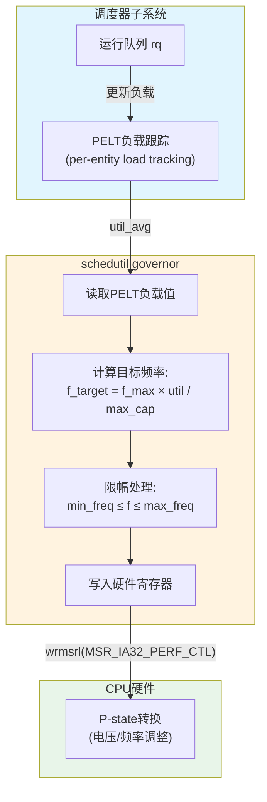

# 15.2.2 cpufreq与P-state

> 所属章节：第15章 电源管理 > 15.2 CPU电源管理
>
> 难度：[E] Expert / [M] Master | 预计阅读时间：25分钟

## <span class="blue"> 本节导读

上一篇我们了解了CPUIdle如何让处理器在空闲时"打盹"。但问题是——**CPU忙碌的时候，能不能也省电？** 毕竟，你的嵌入式设备不可能总在空闲，它可能跑着人脸识别算法、解码视频流、或者处理传感器数据。如果这时候频率拉满，功耗可能轻松飙到十几瓦，一小块电池撑不了多久。

这一节，我们来聊**DVFS（动态电压频率调节）**，这是Linux内核中最古老、最核心的省电技术。我们会从功耗公式出发，搞清楚为什么"降频就能省电"这件事比直觉更划算；然后深入对比所有cpufreq governor，找到当代内核的推荐答案；最后，带上你的终端，学会查看和操控CPU频率的每一步。

读完这一节，你将理解为什么`schedutil`是当代内核的宠儿，以及什么时候应该果断禁用它。

---

## <span class="blue"> 知识点244：DVFS原理与cpufreq Governor [E][M]

### 功耗公式：为什么降频比线性更省钱

DVFS的核心思想很简单：**CPU跑得慢，就不需要那么多电。** 但这背后有个漂亮的物理公式：

$$P = C \times V^2 \times f$$

其中 $P$ 是动态功耗，$C$ 是等效电容（与芯片制程和电路结构相关），$V$ 是供电电压，$f$ 是时钟频率。

注意那个**平方项**——电压是平方关系。这意味着哪怕只降一点点电压，功耗都能显著下降。而频率和电压并非独立：芯片要在更低频率下稳定工作，电压也可以跟着降。于是降频带来的收益是**超线性的**——频率降25%，电压大约降15%，功耗可能直降40%。

来看一个具体的计算示例：

| 频率 (GHz) | 电压 (V) | 相对功耗 (归一化) | 降频收益 |
|:---:|:---:|:---:|:---|
| 2.0 | 1.20 | 100% | 基准 |
| 1.8 | 1.12 | 75.6% | 节省 ~24% |
| 1.5 | 1.02 | 54.4% | 节省 ~46% |
| 1.2 | 0.92 | 35.5% | 节省 ~65% |
| 0.8 | 0.80 | 17.8% | 节省 ~82% |

> 💡 **提示**：上表的电压值基于典型28nm工艺的近似V-f曲线。不同制程节点的电压-频率关系不同，但平方定律的趋势是一致的。你可以通过 `lscpu | grep "MHz"` 和 `/sys/devices/system/cpu/cpu0/cpufreq/scaling_available_frequencies` 查看自己平台的实际档位。

这个超线性特性是DVFS如此迷人的根本原因。它不是"多少活给多少饭"的线性思维，而是"稍微慢点，电费腰斩"的指数级回报。

### cpufreq Governor：谁来决定CPU跑多快？

Linux内核把频率决策权交给了一堆**governor**（管理者）。每个governor代表一种不同的调度哲学。下面这张表格一次性说清所有主流governor：

| Governor | 策略描述 | 性能 | 功耗 | 响应性 | 适用场景 | 内核推荐 |
|:---|:---|:---:|:---:|:---:|:---|:---:|
| **performance** | 始终锁定最高频率 | ★★★ | ★ | 即时 | 性能基准测试、实时任务 | — |
| **powersave** | 始终锁定最低频率 | ★ | ★★★ | 慢 | 极致省电、后台守护进程 | — |
| **ondemand** | CPU负载高时升频，低时降频 | ★★☆ | ★★☆ | 中等 | 传统桌面/服务器（已过时） | 否 |
| **conservative** | ondemand的保守版，渐进升降频 | ★★ | ★★★ | 慢 | 较旧，很少使用 | 否 |
| **userspace** | 完全由用户空间程序控制频率 | 自定义 | 自定义 | 取决于程序 | 自定义策略、学术研究 | — |
| **schedutil** | 直接从调度器获取PELT负载信息 | ★★☆ | ★★★ | 快 | **通用场景，当代首选** | **是** |

> ⚠️ **陷阱**：很多Linux发行版（尤其是服务器版）默认把governor设成`performance`。在数据中心里，这意味着成百上千台机器全年无休地跑在最高频率，电费账单可能比你想象的**高30%~50%**。登录你的服务器，立刻检查：`cat /sys/devices/system/cpu/cpu0/cpufreq/scaling_governor`。如果是`performance`而你不需要极致性能，切到`schedutil`可能每年省下不少钱。

> 💡 **提示**：`schedutil`是当前Linux内核（5.x及以后）推荐的通用governor。它由内核调度器直接驱动，响应速度比`ondemand`快得多，而且在低负载时 aggressively 降频，高负载时迅速升频。

### schedutil：从调度器"借眼"的聪明Governor

schedutil的革命性在于——**它不再自己猜CPU有多忙，而是直接问调度器。**

传统governor如`ondemand`，需要定期采样CPU使用率（通过`/proc/stat`或类似机制），这本质上是一种"间接推测"。而`schedutil`直接读取调度器的**PELT（Per-Entity Load Tracking）**数据，这是调度器内部已经计算好的、每个调度实体的负载度量。

这意味着什么？

1. **零额外开销**——不需要额外的采样定时器，PELT数据本来就在算
2. **纳秒级响应**——调度器对负载变化的感知比秒级采样快1000倍
3. **更准确的预测**——基于调度器的负载趋势，而不是粗糙的CPU利用率

下面这张图展示了schedutil的工作流程：



当CPU上的任务增多，PELT负载值上升，`schedutil`立即计算出更高的目标频率；任务完成、负载下降后，它 likewise 迅速降频。整个闭环发生在**调度上下文**中，而不是一个滞后的用户态守护进程里。

> 💡 **提示**：`schedutil`在Linux 4.7中合入主线，在5.x系列中持续优化。如果你还在用`ondemand`，是时候升级内核并切换了。嵌入式平台尤其能受益于schedutil的快速响应——比如一个突然爆发的传感器中断，ondemand可能还在"观察"，schedutil已经升频完毕了。

---

## <span class="blue"> 知识点245：查看与操控CPU频率 [I]

### sysfs接口：一切尽在 /sys 之中

cpufreq子系统在sysfs中暴露了一整套文件接口。作为嵌入式开发者，这些文件是你的日常：

| 文件路径 | 说明 | 权限 |
|:---|:---|:---:|
| `scaling_cur_freq` | 当前实际运行频率（Hz） | R |
| `scaling_min_freq` | 软件设置的最小频率限制 | RW |
| `scaling_max_freq` | 软件设置的最大频率限制 | RW |
| `scaling_governor` | 当前使用的governor | RW |
| `scaling_available_frequencies` | 平台支持的所有频率档位 | R |
| `scaling_available_governors` | 内核编译进的所有governor | R |
| `cpuinfo_min_freq` / `cpuinfo_max_freq` | 硬件支持的最小/最大频率 | R |
| `affected_cpus` | 共享频率策略的CPU列表 | R |

来看一个完整的频率状态检查流程：

```bash
# ===== 1. 查看当前频率 =====
$ cat /sys/devices/system/cpu/cpu0/cpufreq/scaling_cur_freq
1800000

# 所有CPU一起查看
$ for cpu in /sys/devices/system/cpu/cpu[0-3]; do
>   echo "$(basename $cpu): $(cat $cpu/cpufreq/scaling_cur_freq) Hz"
> done
cpu0: 1800000 Hz
cpu1: 1200000 Hz
cpu2: 800000 Hz
cpu3: 1800000 Hz

# ===== 2. 查看支持的governor和频率 =====
$ cat /sys/devices/system/cpu/cpu0/cpufreq/scaling_available_governors
performance powersave schedutil

$ cat /sys/devices/system/cpu/cpu0/cpufreq/scaling_available_frequencies
800000 1200000 1800000 2000000

# ===== 3. 切换governor =====
$ echo schedutil | sudo tee /sys/devices/system/cpu/cpu*/cpufreq/scaling_governor
echo 1200000 | sudo tee /sys/devices/system/cpu/cpu0/cpufreq/scaling_max_freq

# ===== 4. 设置频率范围（配合schedutil使用） =====
$ echo 800000 | sudo tee /sys/devices/system/cpu/cpu0/cpufreq/scaling_min_freq
$ echo 1800000 | sudo tee /sys/devices/system/cpu/cpu0/cpufreq/scaling_max_freq
```

注意最后一步——即使你使用`schedutil`，也可以通过`scaling_min_freq`和`scaling_max_freq`来**限制它的活动范围**。这在嵌入式场景中非常实用：你知道某个任务永远不需要超过1.2GHz，那就把天花板锁死，让schedutil在这个范围内自由发挥。

### cpupower工具：更友好的命令行

`cpupower`是linux-tools包提供的官方工具，比直接读写sysfs更直观：

```bash
# ===== 查看当前CPU频率策略 =====
$ cpupower frequency-info
analyzing CPU 0:
  driver: acpi-cpufreq
  CPUs which run at the same hardware frequency: 0 1 2 3
  CPUs which need to have their frequency coordinated by software: 0
  maximum transition latency: 10.0 us
  hardware limits: 800 MHz - 2.00 GHz
  available frequency steps:  2.00 GHz, 1.80 GHz, 1.20 GHz, 800 MHz
  available cpufreq governors: performance powersave schedutil
  current policy: frequency should be within 800 MHz and 2.00 GHz.
                  The governor "schedutil" may decide which speed to use
                  within this range.
  current CPU frequency: 1.20 GHz (asserted by call to hardware)
  boost state support:
    Supported: yes
    Active: yes

# ===== 设置governor =====
$ sudo cpupower frequency-set -g schedutil
Setting cpu: 0
Setting cpu: 1
Setting cpu: 2
Setting cpu: 3

# ===== 限制最高频率（热节流场景）=====
$ sudo cpupower frequency-set -u 1200MHz

# ===== 固定到特定频率（userspace governor下）=====
$ sudo cpupower frequency-set -g userspace
$ sudo cpupower frequency-set -f 800MHz
```

`cpupower frequency-info`的输出信息量巨大——硬件限制、可用频率步进、当前策略、boost状态，一次看完。它是调试频率问题的首选工具。

> ⚠️ **陷阱**：`scaling_cur_freq`显示的是**软件层请求的频率**，而实际硬件频率可能因为turbo boost、thermal throttling或硬件P-state限制而不同。想确认硬件真实频率，看`cpuinfo_cur_freq`（如果平台支持），或者用`cpupower frequency-info`里的`asserted by call to hardware`那一行。

---

## <span class="blue"> 知识点261：OPP频率电压点 [E]

### OPP：频率与电压的"黄金配对表"

DVFS能工作的前提，是内核必须知道**每个频率对应多少电压**——否则升频时供电不足会崩溃，降频时电压过高又浪费电。这组"频率→电压"的映射关系，就是**OPP（Operating Performance Points）**。

OPP的本质是一张**有序数组**，每个元素都是一个 `{频率(Hz), 电压(uV)}` 二元组：

| 频率 (Hz) | 电压 (uV) |
|:---:|:---:|
| 800000000 | 800000 |
| 1200000000 | 920000 |
| 1800000000 | 1120000 |
| 2000000000 | 1200000 |

表中规律很直观：**频率越高，所需电压越高，功耗越大**。这不是线性关系——从1.8GHz到2.0GHz只增加了11%频率，电压却提升了7%，功耗可能增加20%以上。这张表通常由芯片厂商根据硅片特性（process corner、温度特性、稳定性裕量）标定，存储在设备树或固件中。

### dev_pm_opp框架：内核的OPP管家

Linux内核提供了 `dev_pm_opp` 子系统，统一管理设备的OPP表。它不只为CPU服务，GPU、DSP等任何需要DVFS的设备都可以复用。

**OPP数据结构（dev_pm_opp）：**

| 结构体/字段 | 类型 | 含义 |
|:---|:---|:---|
| `struct dev_pm_opp` | 核心结构体 | 单个OPP条目，包含频率、电压、可用性标志 |
| `opp->rate` | `unsigned long` | 该OPP对应的频率（Hz） |
| `opp->supplies[0].u_volt` | `unsigned long` | 该OPP对应的电压（uV） |
| `opp->available` | `bool` | 该OPP当前是否可用（可被禁用/启用） |
| `opp->opp_table` | `struct opp_table *` | 指向所属OPP表的指针 |
| `opp->turbo` | `bool` | 是否为turbo/boost频率 |
| `opp->suspend` | `bool` | 是否为suspend状态使用的OPP |

**dev_pm_opp核心API：**

| 函数 | 功能 | 返回值 |
|:---|:---|:---|
| `dev_pm_opp_find_freq_ceil(dev, &freq)` | 查找≥目标频率的最小OPP | 匹配OPP指针；ERR_PTR错误 |
| `dev_pm_opp_find_freq_floor(dev, &freq)` | 查找≤目标频率的最大OPP | 匹配OPP指针；ERR_PTR错误 |
| `dev_pm_opp_get_voltage(opp)` | 获取OPP对应的电压（uV） | 电压值（unsigned long） |
| `dev_pm_opp_get_freq(opp)` | 获取OPP对应的频率（Hz） | 频率值（unsigned long） |
| `dev_pm_opp_find_freq_exact(dev, freq, available)` | 精确匹配指定频率的OPP | 匹配OPP指针；ERR_PTR错误 |
| `dev_pm_opp_of_add_table(dev)` | 从设备树解析并注册OPP表 | 0成功；负值错误码 |
| `dev_pm_opp_set_rate(dev, freq)` | 设置目标频率（自动查找OPP并调压） | 0成功；负值错误码 |

`dev_pm_opp_find_freq_ceil()` 和 `dev_pm_opp_find_freq_floor()` 是cpufreq驱动最常用的两个函数。当schedutil计算出目标频率后，驱动用它们找到最接近且硬件支持的OPP点，然后提取电压值提交给regulator。

### 设备树中的opp-table

ARM/ARM64平台上，OPP表通常在设备树中定义，使用 `operating-points-v2` 绑定：

```dts
// 示例：某ARM SoC的CPU OPP表
cpu0_opp_table: opp-table-cpu0 {
    compatible = "operating-points-v2";
    opp-shared;  // 多核共享此OPP表

    opp-800000000 {
        opp-hz = /bits/ 64 <800000000>;
        opp-microvolt = <800000>;
        opp-supported-hw = <0x06>;  // 仅支持hw revision 0x06
        clock-latency-ns = <100000>;
    };

    opp-1200000000 {
        opp-hz = /bits/ 64 <1200000000>;
        opp-microvolt = <920000 920000 1020000>;  // min,typ,max
        opp-supported-hw = <0x06 0x07>;  // 多版本兼容
    };

    opp-1800000000 {
        opp-hz = /bits/ 64 <1800000000>;
        opp-microvolt = <1120000>;
        turbo-mode;  // 标记为turbo频率
    };
};

// CPU节点引用此OPP表
&cpu0 {
    operating-points-v2 = <&cpu0_opp_table>;
    cpu-supply = <&vdd_cpu>;  // 供电regulator
};
```

`opp-supported-hw` 是嵌入式开发中容易忽视的属性——同一颗SoC的不同硅片版本（revision）可能有不同的电气特性，OPP表可以按版本裁剪。`opp-microvolt` 的三元组语法 `(min, typ, max)` 允许regulator在一定范围内灵活选择实际电压，这在负载跳变时尤为重要。

### cpufreq_driver与OPP的协作

cpufreq驱动的工作流程可以概括为：**通过OPP表将"频率决策"翻译成"电压操作"**。具体步骤如下：

1. governor（如schedutil）计算出目标频率
2. cpufreq_driver调用 `dev_pm_opp_find_freq_*()` 找到最接近的OPP
3. 通过 `dev_pm_opp_get_voltage()` 获取该OPP对应的电压
4. 通过regulator接口（`regulator_set_voltage()`）先调整电压
5. 电压稳定后，再写入硬件寄存器切换频率

这个"先升压、后升频；先降频、后降压"的顺序至关重要——如果先升频再升压，CPU可能在欠压状态下高频运行，导致系统不稳定甚至崩溃。

### 平台差异

| 平台 | OPP管理方式 | 特点 |
|:---|:---|:---|
| **ARM SoC** | 设备树 `operating-points-v2` 节点 | OPP表显式定义，灵活性高，厂商可定制 |
| **x86** | ACPI P-states / firmware | 无显式OPP表，通过ACPI `_PSS` 对象获取频率-电压对 |
| **RISC-V** | 设备树或SBI（Supervisor Binary Interface） | 取决于具体实现，部分平台使用SCMI协议 |

x86平台上你看不到OPP表，因为P-state信息封装在ACPI固件中。内核的 `acpi-cpufreq` 驱动通过 `_PSS`（Performance Supported States）对象获取状态列表，再通过 `_PPC` 和 `_PSD` 控制频率转换。这解释了为什么x86服务器上 `/sys/devices/system/cpu/cpu0/cpufreq/scaling_available_frequencies` 显示的是固定档位，而不是连续频率。

> ⚠️ **陷阱**：如果OPP表中某个频率对应的电压值超出了regulator支持的范围（如`opp-microvolt`要求1.2V但regulator最大只支持1.1V），`regulator_set_voltage()`会失败，进而导致整个cpufreq频率切换失败。嵌入式开发中遇到"切到某个频率就报错"的问题，首先检查OPP表和regulator的兼容性：`dmesg | grep -i opp` 和 `dmesg | grep -i regulator` 是排查的起点。

> 💡 **提示**：OPP表是DVFS的基石——没有OPP表，就没有频率到电压的映射；没有映射，cpufreq驱动在调频时就不知道该配多少电压。嵌入式移植中，如果发现CPU频率只能固定在一个档位，大概率是设备树中缺少 `operating-points-v2` 节点，或者OPP表未被正确解析。检查 `debugfs` 中的 `/sys/kernel/debug/opp/` 目录可以查看当前所有设备的OPP注册情况。

---

## <span class="blue"> 本节总结

| 要点 | 核心内容 |
|:---|:---|
| **DVFS公式** | $P \propto V^2 \times f$，降频+降压 = 超线性省电 |
| **降频收益** | 频率降25% → 电压降~15% → 功耗降~40%，非线性回报 |
| **schedutil** | 从调度器PELT获取负载，响应快、开销零，当前内核推荐 |
| **ondemand** | 传统采样方式，已过时，应迁移到schedutil |
| **performance陷阱** | 服务器默认启用，电费惊人，检查并切换 |
| **sysfs接口** | `scaling_cur_freq` / `scaling_governor` / `scaling_min\|max_freq` 等 |
| **cpupower** | `frequency-info`查看全貌，`frequency-set`快速切换 |
| **实践技巧** | 用min/max_freq限制schedutil范围，既省电又保响应 |

---

## <span class="blue"> 下一步

学会了DVFS的原理和操控方法，下一节我们将**深入schedutil的内核实现**——看看它如何从调度器读取PELT数据、如何通过`util_est`做频率预测、以及如何在不同架构（x86 P-state vs ARM SCMI）上落地。还会涉及CPU调优的实际案例：什么时候该用`schedutil`，什么时候该直接锁频率，以及thermal与cpufreq的联动策略。

**15.2.3 schedutil深入与CPU调优** →

---

## <span class="blue"> 配套资源

- **内核文档**：`Documentation/admin-guide/pm/cpufreq.rst`
- **源码入口**：`drivers/cpufreq/cpufreq_schedutil.c`（schedutil实现）
- **PELT详解**：`kernel/sched/pelt.c`
- **工具源码**：`tools/power/cpupower/`（内核源码树中）
- **推荐论文**："PELT: Per-Entity Load Tracking"（Linux内核调度子系统核心设计文档）
