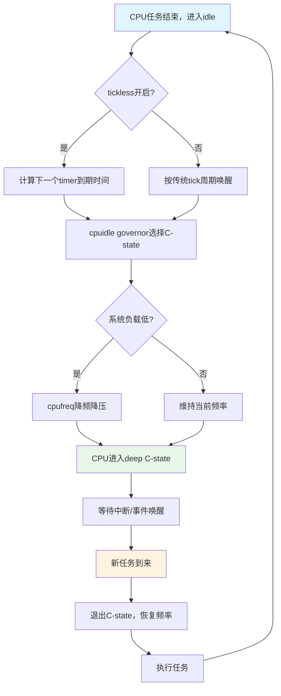

# 15.2.4 cpuidle与cpufreq的协同

> 所属章节：第15章 电源管理 > 15.2 CPU静态功耗管理
>
> 难度：[I] | 预计阅读时间：15分钟

## <span class="blue"> 本节导读

前面两节我们分别认识了 `cpuidle`（C-state，让CPU"睡觉"）和 `cpufreq`（P-state，让CPU"慢跑"）。但你可能会问：这两个子系统是什么关系？会不会打架？什么时候该用谁？本节就来回答这些问题。你会发现，`cpuidle` 和 `cpufreq` 不是竞争对手，而是**黄金搭档**——一个负责"无事可做的省"，一个负责"有事做的省"，再加上 `tickless` 的助攻，三者配合才能把CPU功耗压到极致。

---

## <span class="blue"> 知识点247：cpuidle与cpufreq的互补关系 [I]

### 两者覆盖不同的功耗场景

想象你是一名程序员，你的工作状态可以分成三种：

1. **在等需求** → 无事可做 → 去休息室睡觉（cpuidle）
2. **需求来了，但不急** → 慢慢做，不赶工（cpufreq降频）
3. **需求又急又多** → 全力冲刺 → 顾不上省电

`cpuidle` 和 `cpufreq` 正好对应了前两种状态的节能策略：

| 维度 | cpuidle（C-state） | cpufreq（P-state） |
|:---:|:---:|:---:|
| **触发条件** | CPU无事可做（idle） | CPU有事做但负载低 |
| **覆盖场景** | 系统待机、任务间隙 | 轻负载运行 |
| **节省类型** | 静态功耗（漏电） | 动态功耗（开关功耗） |
| **核心手段** | 关闭时钟/电源门控 | 降低频率和电压 |
| **延迟代价** | 退出C-state有延迟 | 调频调压有延迟 |
| **用户感知** | 几乎无感知 | 可能影响响应速度 |

`cpuidle` 解决的是"**静态功耗**"问题——当CPU停下来的时候，漏电流仍在偷偷消耗能量，越深层的C-state就能把漏电流压得越低。而 `cpufreq` 解决的是"**动态功耗**"问题——当CPU在运行时，功耗与频率和电压的平方成正比（`P ∝ f × V²`），降频降压能直接削减动态功耗。

两者覆盖的场景**互不重叠**，合在一起才能全方位覆盖CPU的功耗图谱。

### 功耗-性能-延迟三角

电源管理本质上是一个**三角博弈**：

```text
         低功耗
          /\
         /  \
        /    \
       /  ×   \      × = 你的平衡点
      /        \
     /__________\
  高性能 ←——→ 低延迟
```

这三者是**互斥**的。你想功耗低？要么让CPU多睡觉（牺牲延迟，退出deep idle需要时间），要么让CPU慢跑（牺牲性能）。反过来，要性能强、响应快，CPU就得高频运行、随时待命，功耗自然就高。

不同的应用场景需要在三角中找到不同的平衡点：

| 场景 | 推荐策略 | 功耗-性能-延迟权衡点 |
|:---:|:---:|:---|
| **服务器待机** | deep C-state + 最低频 | 极致低功耗，完全牺牲性能和延迟 |
| **移动终端待机** | deep C-state + 低频低电压 | 超低功耗，偶尔唤醒处理事件 |
| **音频播放** | shallow C-state + 中低频 | 平衡功耗与连续性，避免音频卡顿 |
| **交互式应用** | 快速退出idle + 按需调频 | 优先低延迟，功耗其次 |
| **游戏/计算** | 保持运行 + 高频 | 追求性能，功耗放最后考虑 |

> ⚠️ **陷阱**：不要误以为同时开启最深的C-state和最激进的降频就能获得最低功耗。deep C-state的退出延迟可能导致交互卡顿，而过低的频率可能让任务执行时间变长，反而增加总能耗（这是所谓的"race to idle"反模式——有时快跑早完工，比慢跑拖更久更省电）。

### tickless与cpuidle的协同

传统的Linux内核每隔固定时间（通常是1ms或4ms，即一个tick）就给每个CPU发一次定时中断，哪怕那个CPU没事可做。这种"闹钟式"的打断有个副作用：**CPU刚想进入deep sleep，就被tick吵醒了**。

`NO_HZ_IDLE`（tickless idle）机制的引入彻底改变了这个局面：当CPU进入idle状态时，内核不再定期发tick中断，而是根据下一个真正需要定时器的事件来设定唤醒时间。这意味着：

- **没有不必要的tick打断** → CPU可以在C-state里待得更久
- **更深层的C-state可以被有效利用** → C3/C6/C7不再被tick频繁唤醒
- **系统整体idle功耗大幅下降** —— 这是移动设备待机时间长的关键技术之一

三者协同的工作流程可以用下图来描述：



### 实际案例：谁贡献了最多的省电？

我们以一个典型的ARM移动平台为例，看看不同场景下两个子系统的贡献度：

| 场景 | cpuidle贡献 | cpufreq贡献 | 其他（Runtime PM等） | 总功耗级别 |
|:---:|:---:|:---:|:---:|:---:|
| **深度待机**（熄屏无后台） | ~85% | ~5% | ~10% | 极低（<50mW） |
| **轻度使用**（听音乐、刷网页） | ~40% | ~45% | ~15% | 低（200-500mW） |
| **中度负载**（视频播放） | ~25% | ~55% | ~20% | 中（500mW-1W） |
| **重度负载**（游戏、编译） | ~5% | ~15% | ~80%（GPU、DDR等） | 高（>2W） |

从上表可以看出一个清晰的规律：

- **待机场景**：`cpuidle` 是绝对主角。系统大部分时间在睡觉，越深越好。
- **轻负载场景**：`cpufreq` 挑大梁。任务断断续续，`cpuidle` 也有贡献，但降频降压带来的动态功耗节省更可观。
- **重负载场景**：两个都帮不上太多忙。CPU在全力跑，C-state进不去，频率也降不下来。这时候省电主要靠 **Runtime PM**（关闭不用的外设）和硬件本身的电源门控。

> 💡 **提示**：`cpuidle` 的governor（如 `menu` 或 `ladder`）是**全自动**的——内核根据idle时间和历史模式自动选择C-state，你一般不需要干预。但 `cpufreq` 的governor（`performance`/`powersave`/`ondemand`/`schedutil`）需要**手动选择或针对性调优**，选错了会直接影响功耗和用户体验。嵌入式产品中，推荐使用内核自适应的 `schedutil` governor，它能在功耗和性能间取得较好的平衡。

> 🔴 **危险**：在实时性要求高的场景中（如工业控制、机器人），deep C-state的退出延迟（几十到几百微秒）可能导致关键中断响应超时。这类系统通常需要关闭 `cpuidle` 或限制最大C-state级别，同时 `cpufreq` 也固定在高频运行。省功耗不是目标，确定性才是。

---

## <span class="blue"> 本节总结

| 要点 | 内容 |
|:---|:---|
| **核心关系** | `cpuidle` 和 `cpufreq` 是互补而非竞争，分别覆盖idle和运行时的功耗优化 |
| **静态 vs 动态** | `cpuidle` 省静态功耗（漏电），`cpufreq` 省动态功耗（开关功耗） |
| **tickless助攻** | `NO_HZ_IDLE` 移除tick中断打扰，让deep C-state真正发挥作用 |
| **三角权衡** | 功耗、性能、延迟三者互斥，需按场景选择平衡点 |
| **贡献分布** | 待机靠`cpuidle`，轻载靠`cpufreq`，重载靠Runtime PM关外设 |
| **调优注意** | `cpuidle`自动工作，`cpufreq`需选对governor；实时系统慎用deep C-state |

---

## <span class="blue"> 下一步

理解了两个子系统的协同关系后，下一节我们将进入**量化分析**——`15.3.1 DVFS功耗模型`会教你用数学公式和实际测量来计算不同频率/电压组合下的功耗与性能关系，让你能从"凭感觉调参"升级为"用数据说话"。

---

## <span class="blue"> 配套资源

- **内核文档**：`Documentation/admin-guide/pm/cpufreq.rst` 和 `Documentation/admin-guide/pm/cpuidle.rst`
- **源码入口**：`drivers/cpufreq/cpufreq.c`、`drivers/cpuidle/cpuidle.c`、`kernel/sched/cpufreq_schedutil.c`
- **调优工具**：`cpupower idle-info`、`cpupower frequency-info`、`turbostat`（Intel）
- **延伸阅读**：Intel® 64 and IA-32 Architectures Software Developer's Manual, Vol. 3, Chapter 14（Power and Thermal Management）
