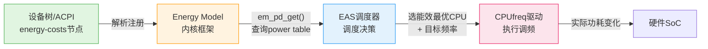

# 15.3.1 DVFS功耗模型

> 所属章节：第15章 电源管理 > 15.3 动态功耗管理
>
> 难度：[E] Expert [M] Master | 预计阅读时间：15分钟

## <span class="blue"> 本节导读

上一节我们聊了CPUfreq的调频策略， governor决定"跑多快"，但它并不真正了解"跑这么快要花多少电"。这就好比司机猛踩油门却看不到油耗表——速度快了，代价到底有多大？本节我们深入DVFS（动态电压频率调整）背后的功耗模型，理解为什么降频25%可能省下40%的功耗，以及Linux内核如何通过Energy Model（EM）把"功耗账"算清楚，让EAS调度器做出真正省电的决策。

---

## <span class="blue"> DVFS功耗的数学本质 [E]

DVFS之所以能省电，根子在半导体物理。CMOS电路的动态功耗由以下公式决定：

$$
P = C \times V^2 \times f
$$

其中：

- **C**（电容）：与芯片面积、工艺相关，可视为常数
- **V**（电压）：供电电压，直接影响晶体管翻转速度
- **f**（频率）：时钟频率，决定每秒翻转次数

关键洞察在于：**频率和电压通常线性关联**。想让芯片跑得更?，必须提高电压来驱动晶体管更快翻转。因此 $V \propto f$，代入上式得到：

$$
P \propto f^3
$$

这就是著名的**立方关系**——频率翻倍，功耗近似翻八倍！反过来看，降频带来的收益非常可观。

> 💡 **提示**：立方关系是近似值。实际中芯片有最低工作电压（电压下限），在低频段电压不再继续下降，因此 $P \propto f^3$ 并不严格成立，实际功耗会比立方估算略高。

来看一组具体数据（假设某ARM SoC）：

| 频率 (MHz) | 电压 (V) | 相对频率 | 立方估算功耗 | 实际功耗 (mW) | 实际/估算 |
|:---:|:---:|:---:|:---:|:---:|:---:|
| 200 | 0.80 | 1.0× | 1.0× | 128 | 1.00 |
| 400 | 0.95 | 2.0× | 8.0× | 540 | 1.05 |
| 800 | 1.15 | 4.0× | 64.0× | 2112 | 1.03 |
| 1200 | 1.35 | 6.0× | 216.0× | 5832 | 1.01 |
| 1600 | 1.45 | 8.0× | 512.0× | 13456 | 1.03 |

<br>

从上表可以直观感受：频率从1600MHz降到1200MHz（降25%），功耗从13456mW降到5832mW，节省了约 **57%**！即使降到800MHz，功耗只剩原来的约 **16%**。这就是为什么DVFS是移动端省电的核心武器。

> ⚠️ **陷阱**：功耗模型描述的是**动态功耗**。芯片还有静态功耗（漏电流），即使频率降到零也会存在。所以在idle状态下，光靠DVFS不够，还需要cpuidle来配合。

---

## <span class="blue"> Energy Model数据结构 [M]

Linux内核从4.x版本开始引入Energy Model框架，把硬件功耗数据标准化，供EAS调度器查询。核心数据结构如下：

| 结构体/函数 | 关键字段/参数 | 含义 |
|:---:|:---|:---|
| `struct em_perf_domain` | `cpus` (cpumask) | 该performance domain包含的CPU |
| | `nr_perf_states` | 支持的性能状态（频率点）数量 |
| | `table[]` | em_perf_state数组，即power table |
| `struct em_perf_state` | `frequency` (kHz) | 该状态的频率 |
| | `power` (mW) | 该状态的功耗 |
| | `cost` | 归一化的能效成本 |
| `em_pd_get(cpu)` | cpu编号 | 获取指定CPU所属perf domain的EM指针 |
| `em_cpu_energy()` | pd, max_util, ... | 计算某CPU在指定负载下的预估能耗 |

<br>

performance domain的概念很关键：**同一domain内的CPU共享频率和电压**。比如big.LITTLE架构中，所有big核属于一个domain，所有LITTLE核属于另一个domain。

代码层面，可以这样获取和使用Energy Model：

```c
#include <linux/energy_model.h>

/* 获取CPU0所属performance domain的Energy Model */
struct em_perf_domain *pd = em_pd_get(0);
if (!pd) {
    pr_err("CPU0 has no Energy Model registered!\n");
    return -EINVAL;
}

/* 遍历power table，打印每个频率点的功耗 */
for (int i = 0; i < pd->nr_perf_states; i++) {
    struct em_perf_state *ps = &pd->table[i];
    pr_info("Freq: %u kHz, Power: %lu mW, Cost: %lu\n",
            ps->frequency, ps->power, ps->cost);
}
```

> 🔴 **危险**：`em_pd_get()` 返回NULL意味着该平台**没有注册Energy Model**。这是EAS调度的前提条件——没有EM，调度器就成了"瞎子"，无法做能效决策。

---

## <span class="blue"> Energy Model的注册与数据流

Energy Model的数据从哪里来？答案是：**设备树（Device Tree）或固件（ACPI/SCMI）**。以下是一个典型的设备树energy-costs节点示例：

```dts
/* arch/arm64/boot/dts/xxx.dtsi */
cpus {
    cpu@0 {
        compatible = "arm,cortex-a55";
        device_type = "cpu";
        capacity-dmips-mhz = <1024>;
        /* 关联energy-costs */
        #energy-cells = <1>;
    };

    /* energy-costs节点定义power table */
    energy-costs {
        /* LITTLE cluster: CPU0-CPU3 */
        cost0: core-cost0 {
            compatible = "arm,energy-costs";
            reg = <0>;              /* performance domain编号 */
            /* 每个条目: frequency(kHz), power(mW) */
            arm,energy-costs = <
                1152000  256        /* 1.152 GHz -> 256 mW */
                 845000  128        /* 845 MHz  -> 128 mW */
                 533000   64        /* 533 MHz  -> 64 mW  */
            >;
        };

        /* BIG cluster: CPU4-CPU7 */
        cost1: core-cost1 {
            compatible = "arm,energy-costs";
            reg = <1>;
            arm,energy-costs = <
                2016000  2048       /* 2.016 GHz -> 2048 mW */
                1768000  1536       /* 1.768 GHz -> 1536 mW */
                1428000  1024       /* 1.428 GHz -> 1024 mW */
                1056000   512       /* 1.056 GHz -> 512 mW  */
            >;
        };
    };
};
```

内核启动时会解析这些节点，构建`em_perf_domain`和`em_perf_state`，注册到Energy Model框架中。

整个数据流可以用下图表示：



EAS调度器在做迁移决策时，会调用`em_cpu_energy()`估算"任务放在CPU A的能耗" vs "放在CPU B的能耗"，选择能效更优的方案。这就是Energy Model的核心价值——**让调度器"看得见"功耗**。

> 💡 **提示**：在已启用EAS的内核上，可以通过 `cat /sys/kernel/debug/energy_model` 查看已注册的所有Energy Model信息，包括每个performance domain的power table。这是调试EAS问题的好帮手。

> ⚠️ **陷阱**：不是所有平台都在设备树中定义了energy-costs。如果你的平台没有注册Energy Model，EAS会退化为普通CFS调度，失去能效优势。可通过检查`/sys/kernel/debug/energy_model`是否为空来确认。

---

## <span class="blue"> 本节总结

| 要点 | 内容 |
|:---|:---|
| DVFS功耗公式 | $P = C \times V^2 \times f$，近似 $P \propto f^3$（立方关系） |
| 降频收益 | 降频25%可省40%~57%功耗，但受电压下限限制 |
| performance domain | 共享频率/电压的一组CPU，EM按domain组织 |
| power table | 每个频率点对应一个`em_perf_state`（频率+功耗+成本） |
| `em_pd_get()` | 获取指定CPU的EM，返回NULL表示未注册 |
| EM数据来源 | 设备树energy-costs节点或固件（ACPI/SCMI） |
| EAS依赖EM | 无EM则EAS退化为CFS，失去能效调度能力 |
| 调试技巧 | `/sys/kernel/debug/energy_model` 查看已注册EM |

---

## <span class="blue"> 下一步

理解了Energy Model的数据结构和功耗模型，下一节 **15.3.2 EAS能效调度** 将深入调度器层面——看看EAS如何利用这些功耗数据，在性能与能效之间做出权衡，真正实现"该快的时候快，该省的时候省"的智能调度。

---

## <span class="blue"> 配套资源

- **内核源码**：`include/linux/energy_model.h` — Energy Model核心接口
- **内核源码**：`kernel/power/energy_model.c` — EM框架实现
- **内核文档**：`Documentation/power/energy-model.rst`
- **调试节点**：`/sys/kernel/debug/energy_model`
- **ARM参考**：Device Tree bindings `Documentation/devicetree/bindings/arm/energy-costs.txt`
