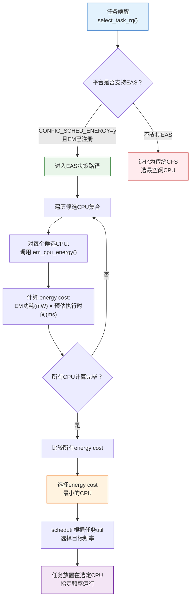

# 15.3.2 EAS能效调度

> 所属章节：第15章 电源管理 > 15.3 动态功耗管理
>
> 难度：[E] Expert [M] Master | 预计阅读时间：12分钟

## <span class="blue"> 本节导读

上一节我们搞懂了Energy Model——内核手里有了一张"功耗地图"，知道每个CPU在每个频率下要花多少电。但光有地图不够，还得有个"导航员"在调度任务时看这张地图。EAS（Energy Aware Scheduling，能效感知调度）就是这个导航员。它改变了Linux调度器数十年的核心逻辑：不再单纯选"最空闲"的CPU，而是选"最省电"的CPU。本节我们来理解EAS的调度决策机制，以及它如何与schedutil governor默契配合，实现真正的"功耗感知调度"。

---

## <span class="blue"> EAS的核心思想：从"找最闲"到"找最省" [E]

传统CFS调度器做任务迁移时，核心逻辑很简单——挑最空闲的CPU。负载轻的CPU能更快响应任务，这没错。但它完全忽略了**完成这个任务要花多少电**。

想象一下这个场景：你有一个轻量级后台任务要跑。传统调度器一看，CPU7（big核，2.0GHz）当前负载为零，果断把任务扔过去。任务瞬间完成——但代价是big核从deep idle被唤醒，消耗了上百毫瓦的功耗。如果放在CPU0（LITTLE核，1.0GHz）上跑，虽然多花几毫秒，但功耗可能只有big核的十分之一。

EAS要回答的正是这个问题：**在哪个CPU上执行这个任务，总能量消耗最小？**

| 对比项 | 传统CFS调度器 | EAS能效调度 |
|:---:|:---|:---|
| **核心策略** | 选最空闲的CPU（负载均衡） | 选能效最优的CPU（能耗最小） |
| **CPU选择依据** | CPU负载（load/util） | Energy Model计算的energy cost |
| **功耗感知** | 无 | 有，基于EM power table精确计算 |
| **适用平台** | 所有平台 | 需注册Energy Model的平台 |
| **调度时机** | 负载均衡周期性检查 | 任务唤醒时即时决策 |
| **典型收益** | 负载分布均匀 | CPU能耗降低15%~30% |

<br>

EAS并不是完全抛弃负载均衡，而是在唤醒路径（wake-up path）上插入了一个"能效决策"环节。对于交互式任务，这几毫秒的延迟差异用户根本感知不到，但积少成多的功耗节省非常可观。

> 💡 **提示**：EAS对移动端和嵌入式设备特别有效——这些设备有大量短暂唤醒的后台任务（同步邮件、推送检查、传感器采样），且电池容量有限，每毫瓦都珍贵。服务器场景则收益较小，因为服务器通常更关注吞吐量而非功耗。

---

## <span class="blue"> EAS调度决策流程 [M]

当任务被唤醒需要选择CPU时，EAS的决策流程如下：



<br>

EAS的核心计算是 `energy cost = power × time`。其中：

- **power** 来自Energy Model中该CPU在目标频率下的功耗值（`em_perf_state.power`）
- **time** 由调度器根据任务历史 utilization 和CPU capacity 估算得出

这个公式虽然简单，但背后有一个精妙的平衡——把任务移到更强的CPU可能缩短执行时间（time↓），但功耗会大幅增加（power↑）。EAS做的就是找到这个 trade-off 的最优点。

---

## <span class="blue"> schedutil与EAS的协同

EAS和schedutil是天生的搭档，它们共享同一个Energy Model数据库，但在调度链路中各司其职：

| 组件 | 决策职责 | 输入 | 输出 |
|:---:|:---|:---|:---|
| **EAS** | 选哪个CPU | Energy Model + 任务util | 目标CPU |
| **schedutil** | 选什么频率 | 任务util + CPU capacity | 目标频率 |

<br>

数据流是这样的：EAS先决定任务放在哪个CPU上，然后根据该CPU的utilization调用schedutil计算目标频率，最后从EM中读取该频率点的功耗来比较energy cost。两者共享`em_perf_domain`数据，没有重复采集的开销。

```c
/* EAS决策的简化逻辑 - 内核代码位于 kernel/sched/fair.c */
static int select_energy_cpu(struct task_struct *p, int prev_cpu)
{
    struct em_perf_domain *pd;
    int cpu, best_cpu = prev_cpu;
    unsigned long min_energy = ULONG_MAX;

    /* 遍历候选CPU */
    for_each_cpu_and(cpu, cpu_active_mask, p->cpus_ptr) {
        pd = em_pd_get(cpu);
        if (!pd)
            continue;  /* 无EM，跳过EAS */

        /* 计算此CPU执行任务的预估能耗 */
        unsigned long energy = em_cpu_energy(pd, ...);

        if (energy < min_energy) {
            min_energy = energy;
            best_cpu = cpu;
        }
    }
    return best_cpu;
}
```

> ⚠️ **陷阱**：EAS只在支持Energy Model的平台上生效。目前ARM/ARM64平台（尤其是big.LITTLE架构）普遍支持，但x86平台由于CPU设计差异（对称多核、频率共享域不同），很少注册Energy Model。在x86上即使编译了`CONFIG_SCHED_ENERGY=y`，EAS也可能因为找不到EM数据而退化为普通CFS调度。可通过`cat /sys/kernel/debug/energy_model`确认平台是否有EM注册。

---

## <span class="blue"> EAS启用条件与实际效果

想让EAS真正跑起来，需要同时满足以下条件：

| 条件 | 检查方法 | 常见问题 |
|:---|:---|:---|
| 内核配置 `CONFIG_SCHED_ENERGY=y` | `zcat /proc/config.gz \| grep SCHED_ENERGY` | 部分发行版内核未开启 |
| 平台注册了Energy Model | `cat /sys/kernel/debug/energy_model` 非空 | x86通常无EM；ARM需设备树正确配置 |
| 使用支持EAS的调度器 | CFS本身即支持，EAS是唤醒路径的增强 | 无需额外配置 |
| schedutil governor启用 | `cat /sys/devices/system/cpu/cpufreq/policy0/scaling_governor` | 需为schedutil才与EAS完美配合 |

<br>

根据ARM和Linaro在多款移动SoC上的实测数据，EAS通常能带来 **15%~30%的CPU能耗降低**，具体取决于任务类型和SoC架构。任务越碎片化（频繁唤醒、短时执行），收益越大。对于长时间连续运行的计算密集型任务，EAS的收益相对有限——因为任务一旦跑起来，调度决策的影响就小了。

> 🔴 **危险**：不要误以为EAS能解决所有功耗问题。EAS只优化**CPU调度层面**的能耗，对设备待机功耗、外设功耗、屏幕功耗等无能为力。它是一个"锦上添花"的优化，不是"雪中送炭"的救命方案。系统整体的功耗管理需要cpuidle、cpufreq、Runtime PM、EAS等机制协同作战。

---

## <span class="blue"> 本节总结

| 要点 | 内容 |
|:---|:---|
| EAS核心思想 | 从"选最空闲CPU"变为"选能效最优CPU" |
| energy cost计算 | `power(mW) × time(ms)`，基于Energy Model数据 |
| 调度时机 | 任务唤醒路径（wake-up path）即时决策 |
| schedutil协同 | EAS选CPU，schedutil选频率，共享EM数据 |
| 启用条件 | `CONFIG_SCHED_ENERGY=y` + 平台注册EM + schedutil governor |
| 平台支持 | ARM/big.LITTLE常见，x86因缺乏EM很少支持 |
| 典型收益 | CPU能耗降低15%~30%，碎片化任务场景收益更大 |
| 局限性 | 仅优化CPU调度层面，不能替代其他功耗管理机制 |

---

## <span class="blue"> 下一步

EAS让我们在调度层面精打细算，但有一个问题它管不了——芯片温度。当SoC温度过高时，即使EAS算出来某个CPU最省电， thermal框架也可能强制降频甚至关机。下一节 **15.4.1 Thermal框架架构**，我们进入电源管理的"安全防线"，理解内核如何监控温度、制定降温策略，在性能与散热之间走钢丝。

---

## <span class="blue"> 配套资源

- **内核源码**：`kernel/sched/fair.c` — EAS调度决策核心实现
- **内核源码**：`kernel/sched/energy.c` — energy cost计算
- **内核文档**：`Documentation/scheduler/sched-energy.rst`
- **调试节点**：`/sys/kernel/debug/energy_model` — 查看已注册EM
- **ARM参考**：Linaro EAS Wiki `https://wiki.linaro.org/WorkingGroups/PowerManagement/Resources/EAS`
