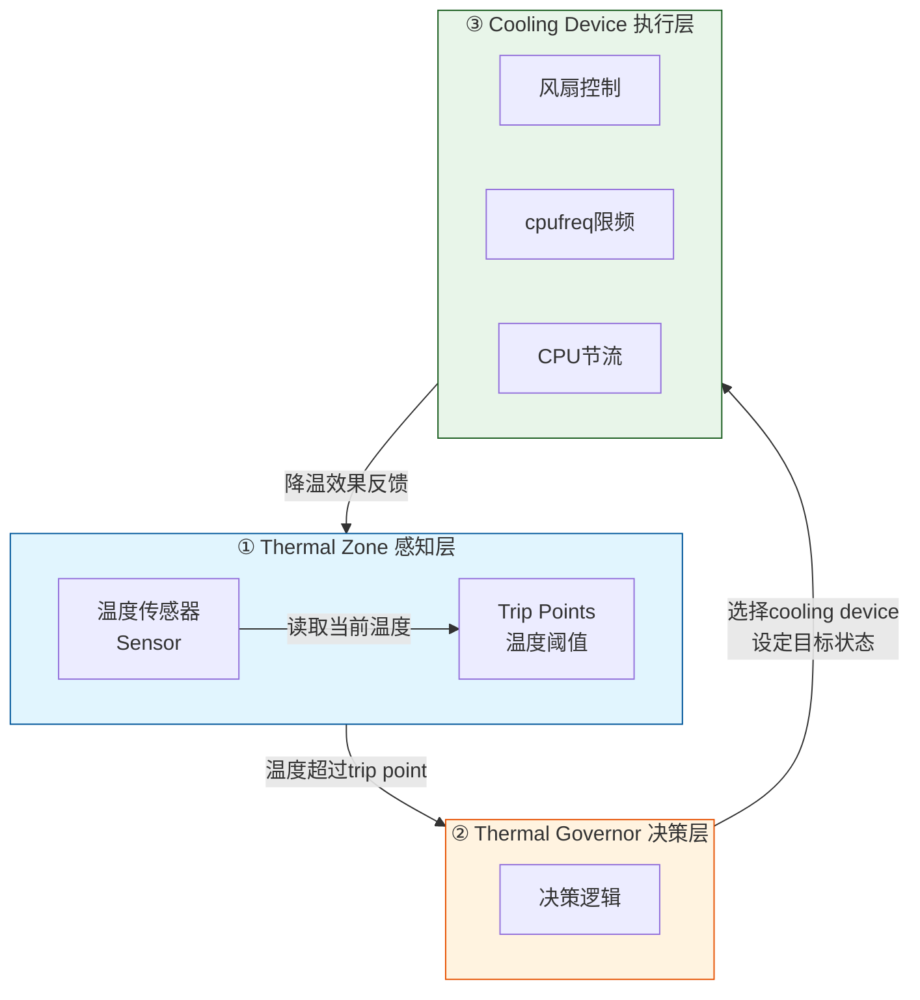
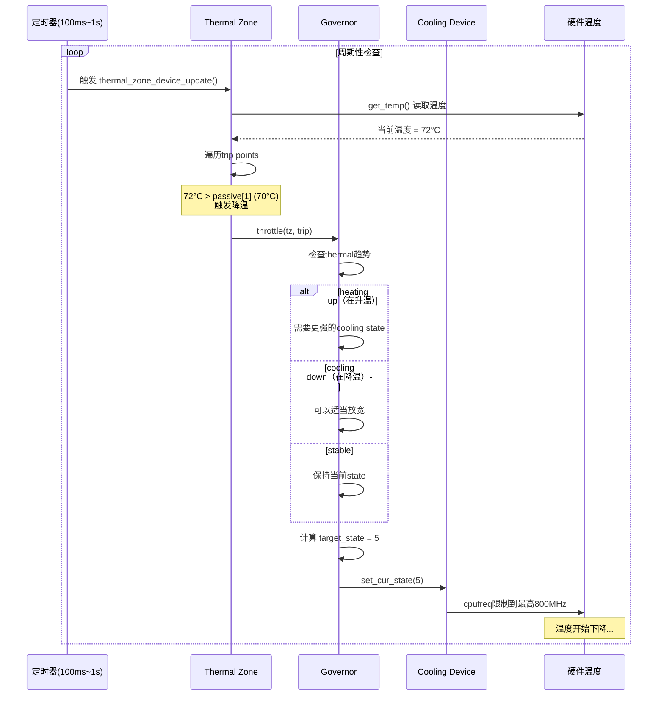

# 15.4.1 Thermal框架架构

> 所属章节：第15章 电源管理 > 15.4 热管理
>
> 难度：[E] Expert [M] Master | 预计阅读时间：12分钟

## <span class="blue"> 本节导读

前面三节我们一直在谈"怎么省电"——CPUidle让CPU打盹，cpufreq让CPU慢下来，DVFS精打细算电压频率。但省电有个前提：芯片不能烧坏了。嵌入式设备散热条件往往很差（密闭小盒子、没有风扇、靠金属壳被动散热），温度一旦失控，轻则降频卡顿，重则硬件永久损伤。本节我们进入Thermal热管理框架，理解内核如何像一名"温度管家"一样，时刻盯着传感器读数，在温度超标时果断出手降温。这是电源管理中最有"保护性"的一环。

---

## <span class="blue"> Thermal框架的三层架构 [M]

Linux Thermal框架的核心设计非常清晰——它是一个经典的"感知→决策→执行"三层模型，跟人体散热机制其实挺像的：皮肤感受温度（感知），大脑决定要不要脱衣服（决策），汗腺开始出汗（执行）。



<br>

**三层各司其职**：

| 层级 | 职责 | 核心组件 | 类比 |
|:---:|:---|:---|:---|
| **Thermal Zone** | 感知温度 | 温度传感器 + trip points（阈值点） | 体温计 |
| **Thermal Governor** | 决策如何降温 | step_wise/power_allocator等策略 | 大脑判断 |
| **Cooling Device** | 执行降温动作 | cpufreq/风扇/CPU throttle | 出汗/脱衣 |

<br>

这三层配合起来形成一个**闭环控制系统**：传感器持续采集温度，governor根据温度和趋势做决策，cooling device执行后温度下降（或继续上升），传感器再次读取……循环往复。理解这个闭环，你就理解了Thermal框架的精髓。

---

## <span class="blue"> Trip Point：温度警戒线的划分 [E]

Trip point（触发点）是Thermal框架中最重要的概念之一。你可以把它理解为温度的"警戒线"——内核在这条线上埋了触发器，温度一旦越过，就启动对应级别的响应。

Linux内核定义了三种标准的trip point类型：

| 类型 | 触发条件 | 执行动作 | 示例温度 | 严重程度 |
|:---:|:---|:---|:---:|:---:|
| **passive** | 温度超过被动阈值 | 被动降温（降频、节流等，不额外耗电） | 65°C / 75°C / 85°C | 🟡 中 |
| **active** | 温度超过主动阈值 | 主动降温（开启风扇等，需额外耗电） | 55°C / 70°C | 🟠 较高 |
| **critical** | 温度达到硬件极限 | 强制关机保护，防止硬件损坏 | 105°C / 115°C | 🔴 致命 |

<br>

一个典型的SoC可能会有多个trip point，形成**逐级响应**的策略：

```
温度上升路径:
    55°C ──→ active[0]    开风扇低速档
    65°C ──→ passive[0]   CPU轻微降频
    75°C ──→ passive[1]   GPU降频
    85°C ──→ passive[2]   CPU大幅降频
   105°C ──→ critical     紧急关机！
```

每个trip point在内核中用`struct thermal_trip`来描述，驱动注册zone时需要填充这个数组。温度超过哪个trip point，governor就读取对应的类型来决定该调用什么级别的降温手段。

> ⚠️ **陷阱**：`critical` trip point如果**没有设置**或者**设置过高**（超过了芯片的实际安全温度），内核将无法触发紧急关机保护。后果是硬件持续过热运行，最终可能导致SoC脱焊、PCB变形甚至起火——这在工业现场设备中是个要命的疏忽。务必参考芯片手册的Tj_max（最大结温）来设置critical点，并保留至少5°C的安全余量。

---

## <span class="blue"> Cooling Device：降温的执行者 [E]

Governor做了决策，最终干活的是cooling device。不同类型的cooling device有不同的响应特性和适用场景。

| 类型 | 降温手段 | 响应速度 | 功耗代价 | 适用场景 |
|:---:|:---|:---:|:---:|:---|
| **cpufreq** | 限制CPU最高频率 | 快（ms级） | 零额外功耗 | 所有场景，首选手段 |
| **cpuidle** | 限制最深idle状态 | 快 | 零额外功耗 | 配合cpufreq使用 |
| **风扇（PWM）** | 强制对流散热 | 中等（秒级见效） | 额外耗电+噪音 | 有风扇的设备 |
| **devfreq** | 限制GPU/DDR频率 | 快 | 零额外功耗 | 带GPU的SoC |
| **CPU throttle** | 插入idle周期强制idle | 快 | 性能损失大 | 最后的软件手段 |

<br>

每种cooling device在内核中注册时，会暴露自己支持的"状态数"（states）。比如一个风扇可能只有0/1两档（关/开），而cpufreq可能有10个频率档位对应10个cooling state。Governor选择一个state值，cooling device就把自己限制到对应的状态——这就是"节流"的本质。

---

## <span class="blue"> Thermal核心工作流程 [M]

理解了三层架构和关键概念，来看实际的代码执行流程。Thermal框架的"心跳"是`thermal_zone_device_update()`，它通常由定时器周期调用，或在温度中断触发时调用。

```c
/* Thermal更新核心流程 - thermal_zone_device_update() */
void thermal_zone_device_update(struct thermal_zone_device *tz,
                                enum thermal_notify_event event)
{
    int temp, ret;
    struct thermal_trip trip;

    /* Step 1: 读取当前温度 */
    ret = tz->ops->get_temp(tz, &temp);
    if (ret)
        return;
    tz->temperature = temp;

    /* Step 2: 遍历所有trip points，找到当前触发的最高级别 */
    for_each_thermal_trip(tz, trip) {
        enum thermal_trip_type type;

        tz->ops->get_trip_type(tz, trip, &type);

        if (temp >= trip.temperature) {
            /* 温度超过此trip point的阈值 */
            handle_thermal_trip(tz, trip);  // → 进入governor决策
        }
    }

    /* Step 3: 更新thermal趋势（heating/cooling/stable） */
    update_trend(tz, temp);
}
```

上面的代码只是温度读取和trip点检查，真正的决策在`handle_thermal_trip()`中，它会调用绑定的governor的`throttle()`回调：

```c
/* Governor决策 + Cooling Device执行 */
static void handle_thermal_trip(struct thermal_zone_device *tz,
                                 struct thermal_trip *trip)
{
    struct thermal_governor *gov = tz->governor;
    struct thermal_instance *instance;

    /* Governor: 根据温度、趋势、trip类型，计算需要的cooling state */
    gov->throttle(tz, trip);

    /* 将计算出的state下发给所有绑定的cooling device */
    list_for_each_entry(instance, &tz->thermal_instances, tz_node) {
        struct thermal_cooling_device *cdev = instance->cdev;
        unsigned long target_state = instance->target;

        /* Cooling Device: 执行state切换 */
        cdev->ops->set_cur_state(cdev, target_state);
    }
}
```

<br>

用一张完整的流程图来总结Thermal的工作链路：



<br>

**Thermal趋势（trend）** 是governor做出聪明决策的关键依据。内核跟踪温度变化的方向：

| 趋势 | 含义 | Governor的行为 |
|:---:|:---|:---|
| **HEATING_UP** | 温度在快速上升 | 果断加大cooling力度，提前干预 |
| **COOLING_DOWN** | 温度在下降 | 可以逐步放松限制，恢复性能 |
| **STABLE** | 温度基本不变 | 维持当前cooling state，避免振荡 |

这个设计避免了温度在阈值附近来回摆动导致的性能抖动——想象如果没有趋势判断，温度一到75°C就降频，刚降到74°C就恢复，然后又冲到75°C……系统性能会像过山车一样。趋势判断给了governor一个"缓冲带"，让决策更平滑。

> 💡 **提示**：你可以在用户空间直接查看SoC的当前温度——`/sys/class/thermal/thermal_zone*/temp` 文件暴露了这个接口。内容通常是毫摄氏度（比如`72000`表示72°C），用`cat`命令直接读取即可。配合`watch -n 1 cat /sys/class/thermal/thermal_zone0/temp`可以实时监控温度变化。想知道每个zone对应哪个传感器？查看该目录下的`type`文件就知道了。

---

## <span class="blue"> 本节总结

| 要点 | 内容 |
|:---|:---|
| **三层架构** | Thermal Zone（感知）→ Governor（决策）→ Cooling Device（执行），形成闭环控制 |
| **Trip Point** | 三级警戒线：passive被动降温、active主动降温（风扇）、critical紧急关机 |
| **Cooling Device** | cpufreq限频（零功耗代价，首选）、风扇（有功耗）、CPU throttle（最后手段） |
| **核心流程** | `thermal_zone_device_update()` 周期性读取温度 → 检查trip point → governor决策 → cooling device执行 |
| **趋势判断** | heating/cooling/stable三种趋势让governor决策更平滑，避免温度振荡 |
| **关键安全点** | critical trip point必须依据芯片Tj_max设置，预留安全余量，否则可能烧毁硬件 |

---

## <span class="blue"> 下一步

掌握了Thermal框架的三层架构和工作流程之后，你可能会有两个疑问：第一，governor内部到底是怎么算那个target_state的？不同的governor算法（step_wise、power_allocator、bang_bang）有什么区别？第二，这些thermal zone、trip point、cooling device是怎么跟具体硬件关联起来的——它们怎么出现在设备树里？下一节 **15.4.2 Thermal Governor与设备树配置**，我们就来深入这两个问题，看代码、看dts，把Thermal框架的"最后一公里"打通。

---

## <span class="blue"> 配套资源

- **内核源码**：`drivers/thermal/thermal_core.c` —— `thermal_zone_device_update()` 完整实现
- **Documentation**：`Documentation/driver-api/thermal/sysfs-api.rst` —— sysfs接口文档
- **用户空间接口**：`/sys/class/thermal/` 目录下所有文件说明
- **SoC参考**：各芯片手册中的Thermal Management章节（如Rockchip TRM第17章、Allwinner Datasheet Thermal部分）
