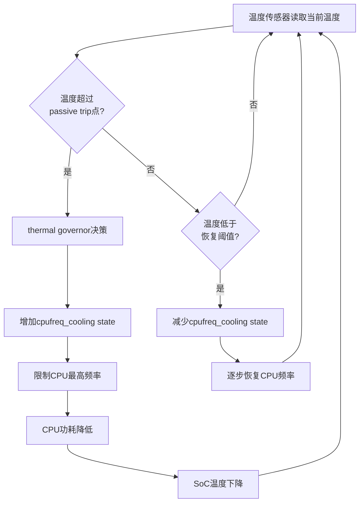

# 15.4.3 Thermal与cpufreq的协同

> 所属章节：第15章 电源管理 > 15.4 Thermal框架与温度管控
>
> 难度：[I] Intermediate | 预计阅读时间：15分钟

## <span class="blue"> 本节导读

前面我们了解了Thermal框架如何管理温度，也掌握了cpufreq如何调节CPU频率。但这两个子系统是如何联动的？当你设备里的SoC温度飙升，谁来负责"踩刹车"降频？温度降下来之后又怎么恢复？本节将揭开 **cpufreq_cooling** 的面纱，看看Thermal与cpufreq如何组成一个精密的闭环控制系统，以及无风扇设备在这套机制下有哪些特殊的设计考量。

读完本节，你将理解温度到频率的完整控制链路，掌握无风扇设备的thermal设计要点。

## <span class="blue"> cpufreq_cooling：Thermal框架的"调速手柄" [I]

在Linux内核中，`cpufreq_cooling` 驱动扮演了一个桥梁角色——它把 cpufreq 子系统包装成一个 **cooling device**，注册到Thermal框架中。这样，thermal governor 就能像调节风扇一样，通过统一的接口来调节CPU频率。

### 核心机制

```c
// drivers/thermal/cpufreq_cooling.c —— 简化示意
static struct thermal_cooling_device_ops cpufreq_cooling_ops = {
    .get_max_state  = cpufreq_get_max_state,  // 获取最大state数
    .get_cur_state  = cpufreq_get_cur_state,  // 获取当前state
    .set_cur_state  = cpufreq_set_cur_state,  // governor调用此接口调节频率
};
```

cpufreq_cooling 的核心概念是 **cooling state**。每个state对应一个CPU频率上限：

| Cooling State | 含义 | 频率限制 |
|:---:|:---|:---|
| 0 | 不限频 | 运行最高频率 |
| 1 | 轻度限频 | 限制到次高档 |
| ... | 逐级递减 | 逐级降低上限 |
| N（最大state） | 最大限频 | 运行最低频率 |

governor 通过调用 `set_cur_state()` 来增大或减小 cooling state，thermal框架内部会自动将这个 state 映射为具体的频率限制值。state 越大，允许的最高频率就越低。

> ⚠️ **陷阱**：cooling state 的映射关系取决于平台支持的频点数量。如果某个平台只支持3个频点，那么 cooling state 就只有0~2三个等级，控制粒度比较粗。在选型阶段要留意这一点。

## <span class="blue"> 闭环控制：温度与频率的"拉锯战" [I]

当 cpufreq_cooling 注册到 thermal 框架后，一个完整的温度-频率闭环控制系统就运转起来了。整个过程就像自动巡航——温度高了自动降速，温度低了自动恢复。

### 闭环控制流程图



### 流程详解

| 步骤 | 动作 | 结果 | 触发条件 |
|:---:|:---|:---|:---|
| 1 | 温度传感器周期性采样 | 获取当前SoC/CPU温度 | 定时器触发（默认轮询间隔） |
| 2 | thermal zone 比对trip点 | 判定是否越界 | 当前温度 ≥ passive trip |
| 3 | governor（如step_wise）决策 | 计算新的cooling state | 温度上升趋势 |
| 4 | governor调用set_cur_state() | cpufreq_cooling更新频率上限 | state值增加 |
| 5 | cpufreq驱动执行限频 | CPU运行频率降低 | 新的频率上限生效 |
| 6 | 功耗下降 → 散热平衡 | SoC温度开始回落 | 发热 < 散热能力 |
| 7 | 温度低于恢复阈值 | governor减小state | 温度下降趋势 |
| 8 | 频率逐步恢复 | 性能回升 | state值减小 |

整个过程中，governor 的策略非常关键。`step_wise` governor 每次只增减一个 state，稳扎稳打；`power_allocator` 则试图在功耗预算内做更精细的分配。对于大部分嵌入式设备，`step_wise` 简单可靠，是上佳之选。

> 💡 **提示**：先用 `stress-ng --cpu 0 --timeout 600s` 做满载测试，观察实际温度曲线。记下**稳定温度**和**温升斜率**，再据此设置trip点。纸上计算的温度模型和实际往往有20%~30%的偏差。

## <span class="blue"> 无风扇设备的设计要点 [I]

无风扇设备（fanless）没有主动散热手段，完全依赖散热片和自然对流。这意味着 thermal 设计必须更加保守，cpufreq_cooling 几乎是唯一的"救命稻草"。

### 无风扇设备 vs 有风扇设备

| 设计要点 | 说明 | 建议 |
|:---|:---|:---|
| passive trip点设置 | 无风扇设备需要更早启动降频 | 比有风扇设备低10~20°C设定 |
| trip点标定方法 | 必须实测，不能依赖数据手册 | 满载运行30分钟以上，记录稳定温度 |
| 环境温度裕量 | 考虑夏季高温环境 | 在实测温度基础上加15~25°C裕量 |
| governor选择 | 追求稳定性而非最优性能 | 推荐step_wise，避免power_allocator的振荡 |
| 降温斜率 | 自然对流散热慢 | 降频幅度可能需要更大，留更长的恢复时间 |
| 外壳散热 | 利用金属外壳辅助散热 | 将SoC热量传导到外壳，可提升5~15°C散热能力 |

### 一个典型的无风扇设备trip点配置示例

```dts
// 典型无风扇ARM SBC的thermal配置示例
thermal-zones {
    cpu-thermal {
        polling-delay-passive = <1000>;  /* 1秒轮询（passive模式） */
        polling-delay = <5000>;          /* 5秒轮询（idle模式） */

        trips {
            cpu_alert0: cpu_alert0 {
                temperature = <65000>;   /* 65°C：开始轻度降频 */
                hysteresis = <5000>;
                type = "passive";
            };
            cpu_alert1: cpu_alert1 {
                temperature = <75000>;   /* 75°C：中度降频 */
                hysteresis = <5000>;
                type = "passive";
            };
            cpu_crit: cpu_crit {
                temperature = <95000>;   /* 95°C：临界关机 */
                hysteresis = <2000>;
                type = "critical";
            };
        };

        cooling-maps {
            map0 {
                trip = <&cpu_alert0>;
                cooling-device = <&cpufreq_cdev 1 2>;  /* state 1~2 */
            };
            map1 {
                trip = <&cpu_alert1>;
                cooling-device = <&cpufreq_cdev 2 4>;  /* state 2~4 */
            };
        };
    };
};
```

这个例子中，65°C就开始轻降频，75°C进一步加码。关键是 **hysteresis（迟滞）** 的设置——温度回落5°C后才解除降频，避免了在trip点附近频繁振荡。

> ⚠️ **陷阱**：trip点设置不合理会导致两个极端——设得太低，设备还没热起来就降频，性能永远跑不满；设得太高，降频启动太晚，可能触发critical shutdown甚至造成硬件损坏。无风扇设备尤其不能心存侥幸。

> 🔴 **危险**：永远要保留一个 critical trip（通常85~105°C，取决于SoC规格），作为最后一道保险。这个trip触发的是紧急关机（shutdown），不是降频。如果只有passive trip而没有critical trip，等于拆掉了安全阀。

## <span class="blue"> 本节总结

| 内容 | 要点 |
|:---|:---|
| cpufreq_cooling | 将cpufreq子系统注册为thermal cooling device，通过cooling state映射频率上限 |
| cooling state | state 0=不限频，state N=最低频；governor通过set_cur_state()调节 |
| 闭环流程 | 传感器采样 → 越界检测 → governor决策 → 限频 → 降温 → 恢复，循环往复 |
| 无风扇设计 | 更早降频（trip点更低）、实测满载温度、留足环境温度裕量、推荐step_wise |
| 关键参数 | polling-delay、trip温度、hysteresis、critical trip缺一不可 |

## <span class="blue"> 下一步

掌握了thermal与cpufreq的协同之后，你已经对运行时的动态电源管理有了完整认识。接下来我们将进入 **15.5.1 suspend-to-RAM与suspend-to-disk**，学习系统级的睡眠状态——如何让整个设备"睡着"又"醒来"，这是嵌入式设备低功耗设计的终极手段之一。

## <span class="blue"> 配套资源

- **内核源码**：`drivers/thermal/cpufreq_cooling.c`、`drivers/cpufreq/cpufreq.c`
- **测试工具**：`stress-ng`（压力测试）、`sensors`（温度读取）、`/sys/class/thermal/thermal_zone*/temp`
- **参考文档**：`Documentation/devicetree/bindings/thermal/thermal.txt`
- **推荐阅读**：ARM SoC 数据手册中的 Thermal Design Guide 章节
