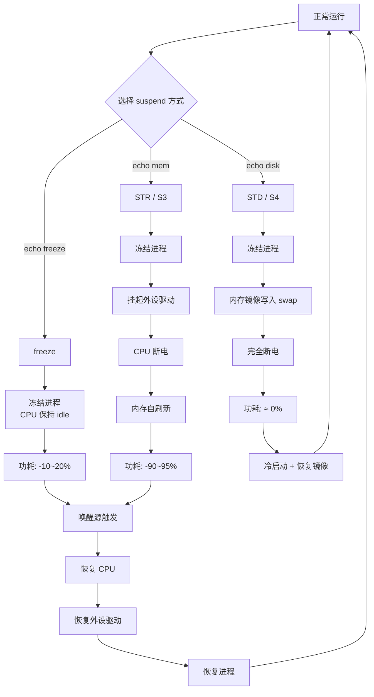

# 15.5.1 suspend-to-RAM与suspend-to-disk

> 所属章节：第15章 电源管理 > 15.5 系统级电源管理
>
> 难度：[I] Intermediate | 预计阅读时间：15分钟

## <span class="blue"> 本节导读

嵌入式设备经常需要"睡觉"——不是关机，而是进入一种低功耗状态，在需要时快速醒来。Linux内核提供了多种系统级挂起（suspend）机制，从最浅的freeze到最深的hibernate，每种方式在功耗、恢复速度和数据安全之间做着不同的取舍。本节将带你理解三种核心suspend方式的工作原理，掌握它们的操作方法，并学会配置各种唤醒源，让你的设备"该睡就睡，该醒就醒"。

---

## <span class="blue"> suspend-to-RAM（STR / S3）[I]

suspend-to-RAM，简称STR，对应ACPI状态S3，是嵌入式Linux设备最常用的一种待机方式。

### 工作原理

当你执行`echo mem > /sys/power/state`时，内核会依次执行以下操作：

1. **冻结用户空间进程** —— 向所有进程发送冻结信号，让它们停止运行
2. **挂起设备驱动** —— 按照设备树中的依赖顺序，逐个关闭外设
3. **CPU进入最深idle** —— 关闭CPU缓存，停止时钟
4. **内存进入自刷新模式** —— 这是最关键的一步，内存控制器持续给DRAM提供刷新信号，但CPU和外设完全断电

整个系统的状态完整地保存在内存中。当唤醒源触发时，CPU重新上电，从内存中恢复之前保存的状态，整个过程就像按了"暂停"键一样。

### 关键特性

| 特性 | 数值 / 说明 |
|------|-----------|
| 恢复时间 | ~100ms ~ 1s（取决于硬件初始化速度） |
| 相对功耗 | 正常运行的 5% ~ 10%（主要是内存自刷新耗电） |
| 数据安全 | 断电即丢失 —— 如果意外掉电，内存中的数据会消失 |
| 内核命令 | `echo mem > /sys/power/state` |

> 💡 **提示**：STR是嵌入式设备最常用的待机方式，因为它在功耗和恢复速度之间取得了最佳平衡。工业HMI、便携医疗设备、IoT网关等场景几乎都采用STR作为默认待机方案。

```bash
# 进入 suspend-to-RAM
echo mem > /sys/power/state

# 查看系统支持的 suspend 状态
cat /sys/power/state
# 典型输出：freeze mem disk        ← 表示支持 freeze、STR、STD 三种

# 查看当前唤醒源
cat /sys/power/wakeup_count
```

---

## <span class="blue"> suspend-to-disk（STD / S4 / Hibernate）[I]

suspend-to-disk，也叫hibernate，对应ACPI状态S4。如果说STR是"暂停"，那STD就是"存档"。

### 工作原理

STD把内存中的全部数据写入到swap分区或swap文件中，然后彻底断电：

1. **分配swap空间** —— 内核需要一个不小于内存大小的swap区域
2. **创建内存镜像** —— 将内存的每一页数据压缩并写入swap
3. **记录元数据** —— 在swap头部标记这是一个有效的hibernation镜像
4. **完全断电** —— 所有硬件，包括内存，全部断电

恢复时，引导加载器检测到swap中有有效镜像，加载内核后从swap中把数据还原回内存，恢复到挂起前的状态。

| 特性 | 数值 / 说明 |
|------|-----------|
| 恢复时间 | 数秒（取决于磁盘速度和内存大小） |
| 相对功耗 | ≈ 0%（完全断电） |
| 数据安全 | 高 —— 数据保存在非易失性存储中 |
| 内核命令 | `echo disk > /sys/power/state` |

> ⚠️ **陷阱**：STD需要swap空间**大于**物理内存大小！如果你的设备有1GB内存，swap分区至少要有1.1GB。如果swap不够，内核会拒绝进入hibernate并返回`No space left on device`错误。另外，swap文件和swap分区的性能差异很大，SSD上的swap分区是STD的理想选择。

```bash
# 检查swap大小（必须 > 物理内存）
free -h
#              total        used        free
# Swap:       2.0Gi       0.0Ki       2.0Gi    ← 内存1GB，swap 2GB，安全

# 指定使用swap分区（通过resume内核参数）
# 在bootargs中设置：resume=/dev/mmcblk0p3

# 进入 hibernate
echo disk > /sys/power/state
```

---

## <span class="blue"> freeze（S0ix / Idle Freeze）[M]

freeze是最浅的一种suspend方式，连"挂起"都算不上，更像是一次"深度打盹"。

CPU停留在idle状态，但所有进程被冻结。它不需要硬件支持特殊的电源状态，纯粹是软件层面的优化。恢复极快（亚毫秒级），但功耗节省也最有限——通常只比正常idle低10%~20%。

S0ix（Intel提出的术语）是freeze的一种硬件增强版本，通过CPU内部的电源门控进一步降低漏电功耗，但基本原理相同。

```bash
# 进入 freeze 状态
echo freeze > /sys/power/state
```

---

## <span class="blue"> 三种suspend方式对比 [I]

| 方式 | 功耗 | 恢复时间 | 数据安全 | 适用场景 |
|------|------|----------|----------|----------|
| **freeze** | 降低10%~20% | < 1ms | 低（内存中） | 短暂空闲、需要极快响应 |
| **STR (mem)** | 降低90%~95% | 100ms ~ 1s | 中（内存中） | 日常待机、电池供电设备 |
| **STD (disk)** | ≈ 0% | 3s ~ 10s | 高（磁盘保存） | 长期关机、升级前备份状态 |

选择策略很简单：**需要快醒用STR，不怕慢用STD，只是喘口气用freeze**。

---

## <span class="blue"> suspend/resume 流程图 [I]

下面的mermaid图展示了STR的完整suspend和resume流程：



STR和freeze走的是"热恢复"路径，直接从内存恢复；STD则需要经历一次完整的冷启动，然后从swap中还原内存状态。

---

## <span class="blue"> 唤醒源（Wake Sources）配置 [I]

设备睡着了，但得有人叫它起床。Linux内核通过唤醒源机制来配置哪些事件可以触发resume。

### 常见唤醒源

| 唤醒源 | 配置方法 | 适用设备 | 注意事项 |
|--------|----------|----------|----------|
| **Wake-on-LAN (WOL)** | `ethtool -s eth0 wol g` | 以太网设备 | 需要网卡硬件支持魔术包过滤 |
| **GPIO中断** | 设备树配置`wakeup-source`属性 | 按键、传感器 | 确保GPIO控制器支持中断唤醒 |
| **RTC Alarm** | `echo +60 > /sys/class/rtc/rtc0/wakealarm` | 所有带RTC的设备 | 时间到了自动唤醒 |
| **USB唤醒** | `echo enabled > /sys/bus/usb/devices/.../power/wakeup` | 键盘、鼠标 | 需要USB控制器支持远程唤醒 |

### 配置示例

```bash
# ===== 1. RTC 定时唤醒（最常用的嵌入式唤醒方式）=====
# 设置60秒后唤醒（从当前时间算起）
echo 0 > /sys/class/rtc/rtc0/wakealarm      # 先清除之前的alarm
echo +60 > /sys/class/rtc/rtc0/wakealarm    # 设置60秒后唤醒
echo mem > /sys/power/state                  # 进入STR，60秒后自动唤醒

# ===== 2. Wake-on-LAN 配置 =====
# 启用魔术包唤醒（g = magic packet）
ethtool -s eth0 wol g
# 确认网卡支持 WOL
ethtool eth0 | grep Wake-on
# 输出示例：Wake-on: g

# ===== 3. GPIO 按键唤醒（设备树配置示例）=====
# 在设备树中声明按键为唤醒源：
# button@0 {
#     compatible = "gpio-keys";
#     wakeup-source;              ← 关键属性
#     button-power {
#         gpios = <&gpio1 0 GPIO_ACTIVE_LOW>;
#         linux,code = <KEY_POWER>;
#     };
# };

# ===== 4. 查看和使能设备的唤醒能力 =====
# 列出所有可以参与唤醒的设备
cat /sys/kernel/debug/wakeup_sources

# 使能某个USB设备的唤醒能力
echo enabled > /sys/bus/usb/devices/1-1/power/wakeup
```

> 🔴 **危险**：如果一个设备的唤醒功能被使能，但**没有正确配置中断触发方式**，可能导致设备无法进入suspend（内核检测到还有"未处理的唤醒事件"），或者进入后立即被错误唤醒。调试时可以通过`dmesg | grep -i wakeup`查看唤醒相关的内核日志。

---

## <span class="blue"> 新知识点262 [I][M] PSCI：ARM电源状态协调接口

PSCI（Power State Coordination Interface）是ARM架构下标准化固件接口，定义了CPU和系统级的电源状态转换规范。它由Trusted Firmware-A（TF-A）或各厂商固件实现，统一了不同ARM SoC的电源管理接口，是理解ARM平台低功耗机制的底层基础。

### PSCI的核心功能

PSCI通过一组标准的功能编号，为操作系统提供统一的电源管理调用：

| 功能 | 编号 | 参数 | 用途 |
|------|------|------|------|
| **PSCI_VERSION** | 0x84000000 | 无 | 查询PSCI版本号 |
| **PSCI_CPU_SUSPEND** | 0xC4000001 | power_state, entry, ctx | CPU进入低功耗状态（C2+） |
| **PSCI_CPU_OFF** | 0x84000002 | 无 | 关闭调用者CPU |
| **PSCI_CPU_ON** | 0xC4000003 | mpidr, entry, ctx | 启动指定CPU |
| **PSCI_SYSTEM_RESET** | 0x84000009 | 无 | 系统复位 |
| **PSCI_SYSTEM_OFF** | 0x84000008 | 无 | 系统关机 |

`PSCI_CPU_SUSPEND`是最常用的功能——当cpuidle驱动决定让CPU进入深C-state（C2及以上）时，就会通过PSCI将CPU控制权交给固件，由固件负责保存上下文、切断时钟/电源，并在唤醒事件到来时恢复CPU执行。

### PSCI的调用方式

| 方式 | 指令 | 适用场景 | 安全级别 |
|------|------|----------|----------|
| **SMC** | `smc #0` | 物理机、裸金属 | EL3（Secure Monitor） |
| **HVC** | `hvc #0` | 虚拟化（KVM/Xen） | EL2（Hypervisor） |

操作系统通过SMC或HVC指令陷入更高异常级别，由固件处理电源请求。具体使用哪种方式由设备树的`psci`节点声明：

```dts
// arch/arm64/boot/dts/arm/vexpress-v2f-1xv7-ca53x2.dtsi
psci {
    compatible = "arm,psci-1.0";
    method = "smc";              // ← "smc" 或 "hvc"
    cpu_suspend = <0xc4000001>;
    cpu_off = <0x84000002>;
    cpu_on = <0xc4000003>;
    sys_poweroff = <0x84000008>;
    sys_reset = <0x84000009>;
};
```

### PSCI与cpuidle的关系

PSCI是cpuidle的底层实现支柱之一。CPU从C0（运行）进入C1（通常用`wfi`指令）不需要PSCI介入；但从C2开始，需要协调多个CPU或整个系统的电源状态，此时cpuidle驱动会调用`PSCI_CPU_SUSPEND`：

```
CPU进入idle
   │
   ▼
cpuidle_select() 选择最优C-state
   │
   ├── C1 ──► wfi（无需PSCI）
   │
   └── C2/C3 ──► psci_cpu_suspend() ──► smc #0 ──► 固件处理
                                              ──► 切断CPU时钟/电源
                                              ──► 等待唤醒中断
                                              ──► 恢复CPU上下文
```

退出深C-state时，固件负责恢复CPU上下文，跳转到内核指定的恢复地址，整个过程对操作系统透明。

> ⚠️ **陷阱**：如果固件没有实现某个PSCI功能（例如某些厂商固件不支持`PSCI_CPU_SUSPEND`的特定power_state），对应的C-state就会被标记为不可用。内核日志中可能出现`Failed to attach to CPU's PM domain`或`psci: failed to set CPU state`等错误，此时cpuidle会回退到更浅的C-state，导致功耗无法进一步降低。

> 💡 **提示**：如果你发现`/sys/devices/system/cpu/cpuidle/`目录下某些C-state被禁用（`disable`文件为1或该state不存在），首先检查固件日志和`dmesg`中PSCI相关的错误信息。`cat /sys/devices/system/cpu/cpuidle/current_driver`应显示`psci`，确认cpuidle正在使用PSCI后端。使用`dtc -I fs /proc/device-tree | grep -A5 psci`可以快速查看设备树中PSCI节点的配置。

---

## <span class="blue"> 本节总结

| 要点 | 内容 |
|------|------|
| **STR (mem)** | 内存自刷新，CPU/外设断电，恢复100ms~1s，功耗~10%，最常用 |
| **STD (disk)** | 内存写swap后完全断电，恢复数秒，功耗≈0%，数据最安全 |
| **freeze** | 浅度冻结，恢复<1ms，功耗节省有限，无需硬件支持 |
| **核心命令** | `echo {freeze|mem|disk} > /sys/power/state` |
| **STD陷阱** | swap空间必须大于物理内存 |
| **唤醒源** | RTC、WOL、GPIO、USB —— 按需配置，避免误唤醒 |

---

## <span class="blue"> 下一步

掌握了suspend的基本操作后，下一节（**15.5.2 唤醒源与Wakelock**）将深入探讨Android/Linux中的wakelock机制——为什么有时候你的设备"睡不着"？wakelock是如何阻止系统自动进入suspend的？以及如何诊断和解决"无法待机"的问题。

---

## <span class="blue"> 配套资源

- **内核文档**：`Documentation/power/states.rst`
- **内核文档**：`Documentation/power/devices.rst`（设备电源管理和唤醒）
- **ACPI规范**：ACPI Specification 6.4 - Chapter 16 System Power Management States
- **调试工具**：`cat /sys/kernel/debug/suspend_stats` —— 查看suspend成功/失败统计
- **调试命令**：`dmesg | grep -E "suspend|resume|wakeup"` —— 追踪suspend/resume过程中的问题
