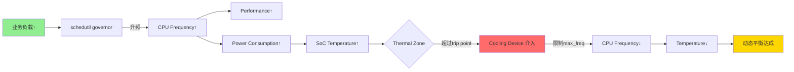
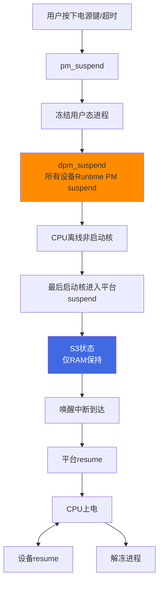

# 15.6.1 五子系统协同与闭环控制

> 所属章节：第15章 电源管理 > 15.6 电源管理子系统协同
>
> 难度：[E] Expert / [M] Master | 预计阅读时间：20分钟

## <span class="blue"> 本节导读

前面我们分别深入学习了 Runtime PM、cpuidle、cpufreq、Thermal 和 Suspend 五个电源管理子系统。每个子系统都有自己的职责和调优接口，但如果把它们孤立看待，就像盲人摸象——你只摸到一条腿，却不知道整头象长什么样。

本节把五个子系统放到同一个画面中，揭示它们之间的协同关系、数据流和闭环控制链路。掌握这个全局视角，是成为电源管理高手的分水岭。读完本节，你会理解为什么"只调一个参数往往没用"，以及如何建立系统级的功耗优化方法论。

---

## <span class="blue"> 五子系统全景概览 [I]

五个子系统覆盖了从设备级到系统级的全部电源管理维度，各有分工又彼此交织：

| 子系统 | 管理级别 | 优化手段 | 节省类型 | 核心调优接口 |
|--------|----------|----------|----------|-------------|
| **Runtime PM** | 设备级 | 不用时自动 suspend / resume | 静态功耗（漏电流） | `/sys/bus/*/power/control`，`autosuspend_delay_ms` |
| **cpuidle** | CPU 空闲态 | 进入更深 C-state（C1→C3→C6…） | 静态功耗 | `idle=halt/nomwait`，`cpuidle.off=1`，`latency_factor` |
| **cpufreq** | CPU 运行态 | 动态调频调压（DVFS） | 动态功耗（∝CV²f） | `scaling_governor`，`/sys/devices/system/cpu/cpufreq/` |
| **Thermal** | 系统温度 | 超温时强制降频 / 关核 | 保护硬件（间接降功耗） | `thermal_zone*/trip_point_*_temp`，`cooling_device*` |
| **Suspend** | 系统级 | 整体进入 S3（RAM 保持）或 S4（hibernate） | 静态功耗（极致） | `/sys/power/state`，`mem_sleep`，`wakeup_sources` |

这个表格是理解协同关系的基础。记住一个关键区分：Runtime PM 和 cpuidle 针对的是**空闲时的静态功耗**，cpufreq 针对的是**运行时的动态功耗**，Thermal 是**安全守护者**，Suspend 则是**最后一招**。

```
┌─────────────────────────────────────────────────────────────────┐
│                      电源管理五子系统全景                         │
│                                                                 │
│   ┌──────────────┐    ┌──────────────┐    ┌──────────────┐     │
│   │  Runtime PM  │    │   cpuidle    │    │   cpufreq    │     │
│   │  (设备级)    │    │  (CPU空闲)   │    │  (CPU运行)   │     │
│   │              │    │              │    │              │     │
│   │ 设备不用时   │    │ CPU无事时    │    │ CPU忙时      │     │
│   │ → suspend   │    │ → 进深C-state│    │ → DVFS调频   │     │
│   └──────┬───────┘    └──────┬───────┘    └──────┬───────┘     │
│          │                   │                    │              │
│          └───────────────────┼────────────────────┘              │
│                              ▼                                   │
│                    ┌──────────────────┐                         │
│                    │     Thermal      │                         │
│                    │   (温度守门员)   │                         │
│                    │                  │                         │
│                    │ 监控温度→超温时  │                         │
│                    │ 强制override频率  │                         │
│                    └────────┬─────────┘                         │
│                             │                                    │
│                             ▼                                    │
│                    ┌──────────────────┐                         │
│                    │     Suspend      │                         │
│                    │   (系统级大招)   │                         │
│                    │                  │                         │
│                    │ 整系统进S3/S4    │                         │
│                    │ 需所有设备配合   │                         │
│                    └──────────────────┘                         │
└─────────────────────────────────────────────────────────────────┘
```

---

## <span class="blue"> 子系统间相互影响：一张蜘蛛网 [E]

五个子系统不是五个独立运行的黑盒，它们之间的交互错综复杂。下面这张表格梳理了主要的影响链路：

| 影响源 | 被影响者 | 影响方式 | 结果 |
|--------|----------|----------|------|
| **Thermal** | cpufreq | 通过 cooling device 限制最大频率 | 温度升高时，频率被迫降低，性能下降 |
| **Thermal** | cpuidle | 限制可进入的最深 C-state | 超温时可能禁止进入深层 idle |
| **cpufreq** | Thermal | 高频运行产生更多热量 | 形成正反馈循环，需 Thermal 介入打破 |
| **cpufreq** | cpuidle | 频率影响退出 latency，间接影响 C-state 选择 | 高频时调度器倾向浅层 idle |
| **cpuidle** | Runtime PM | 深 C-state 下 tick 停止，可能延迟设备 autosuspend 判断 | 空闲对齐效应 |
| **Runtime PM** | Suspend | 设备必须进入 runtime-suspended 状态，系统 suspend 才能成功 | `dpm_suspend()` 会等待 |
| **Suspend** | 全部子系统 | 唤醒后所有状态重置 | governor、C-state 策略重新初始化 |
| **tickless** | cpuidle | NO_HZ 决定 CPU 停留 idle 的时长 | 时长足够才进入深 C-state |

理解这些交叉影响至关重要。比如，你以为把 cpufreq governor 换成 schedutil 就能提升响应，但如果 Thermal 的 trip point 设得太低，温度一上去频率就被 thermal 打下来，schedutil 的升频效果就被抵消了。

---

## <span class="blue"> 闭环控制链路：功耗-性能-温度的动态平衡 [M]

这五个子系统共同构成了一个**多输入多输出的闭环控制系统**。最有意思的是两条典型链路：

### 链路一：负载升高路径



这条链路揭示了一个核心规律：**性能和功耗是一对矛盾，Thermal 是调解员**。负载高了想升频，但升频导致发热，温度超过阈值后 thermal 强制降频。最终的平衡点取决于你的散热能力和 thermal policy。

### 链路二：负载降低路径


这条链路的精妙之处在于**级联效应**。负载降低不只是 cpufreq 降频就完了，它会像多米诺骨牌一样：频率降低 → idle 窗口变大 → cpuidle 进深 C-state → tick 停止 → 设备有机会 autosuspend。五个子系统一环扣一环，把功耗压到最低。

### 链路三：系统级大招



> ⚠️ **陷阱**：很多工程师在调优时只盯着一个子系统猛调，比如 cpufreq governor 换了十几次，却发现整体功耗降不下来。问题很可能出在 Runtime PM 没有使能——设备一直在耗电，CPU 再省也杯水车薪。
>
> 记住：**功耗优化是全局工程，不是单点调优。**

---

## <span class="blue"> 动态平衡中的 Override 机制 [E]

五个子系统同时运行时，会出现"多个指挥官"的问题。Linux 内核通过优先级机制来仲裁：

**Thermal 拥有最高优先级**。当温度超过 trip point 时，thermal cooling device 会直接写入 cpufreq 的 `cpuinfo_max_freq` 限制，这个限制**覆盖 governor 的决策**。即使 schedutil 想升频，thermal 也会说"不"。

```
频率上限仲裁层级（从高到低）：

┌─────────────────────────────────────┐
│  1. Thermal cooling limit           │  ← 最高优先级，硬限制
│     (由trip point温度触发)          │
├─────────────────────────────────────┤
│  2. cpufreq driver 硬件上限         │
│     (cpuinfo_max_freq)              │
├─────────────────────────────────────┤
│  3. cpufreq governor 策略决策       │
│     (schedutil/ondemand等)          │
├─────────────────────────────────────┤
│  4. 用户空间手动设置                │
│     (scaling_setspeed)              │
├─────────────────────────────────────┤
│  5. 能效偏好                        │
│     (energy_performance_preference) │
└─────────────────────────────────────┘
```

这个层级设计体现了一个工程原则：**安全（Thermal）优先于性能，性能优先于能效**。

```c
// 简化示意：thermal 如何 override cpufreq
// drivers/thermal/cpufreq_cooling.c

static int cpufreq_set_cur_state(struct thermal_cooling_device *cdev, 
                                  unsigned long state)
{
    // state 越大，限制越严格
    unsigned long max_freq = cpufreq_table[state];  // 查表得允许频率
    
    // 直接限制 cpufreq 的频率上限
    cpufreq_update_policy(cpu, max_freq);  // ← 覆盖 governor 的决策
}
```

cpuidle 和 tickless 的协同也很有意思。NO_HZ 模式下，tick 不再定期中断 CPU，这使得 idle 持续时间可以被精确计算。但 cpuidle governor（如 menu governor）在决策 C-state 深度时，需要预测下一次唤醒时间——这个预测依赖调度器的统计信息。如果预测偏短，就会选浅层 C-state，浪费省电机会；预测偏长，则可能错过重要事件。

> 💡 **提示**：`menu` governor 的预测逻辑在 `drivers/cpuidle/governors/menu.c` 中，核心函数是 `menu_select()`。它综合考虑了 `avg_idle_us`、`io_boost` 等因素。如果发现 cpuidle 总是进不了深 C-state，可以检查 `cpuidle_use_deepest_state` 参数或尝试 `ladder` governor 做对比测试。

---

## <span class="blue"> 系统级功耗优化方法论 [M]

掌握了五子系统的协同关系后，真正的挑战是：**在实际项目中如何下手调优？**

这里给出一个经过验证的方法论，分为四步：

### 第一步：量化现状（不要猜，要测）

```bash
# 1. 整体功耗基准
sudo powertop --html=power_report.html   # 生成交互式报告
sudo powertop --calibrate                # 校准测量

# 2. 查看各子系统实际状态
# cpufreq
cat /sys/devices/system/cpu/cpu*/cpufreq/scaling_cur_freq

# cpuidle
for cpu in /sys/devices/system/cpu/cpu[0-9]*; do
    echo "$cpu: $(cat $cpu/cpuidle/state*/name 2>/dev/null | tr '\n' ' ')"
done

# Runtime PM
find /sys/bus -name "control" -exec grep -H . {} + 2>/dev/null | head -20

# Thermal
cat /sys/class/thermal/thermal_zone*/temp
cat /sys/class/thermal/thermal_zone*/type
```

### 第二步：定位耗电大户

powertop 的报告会告诉你谁在耗电。通常的规律是：

| 排名 | 常见耗电大户 | 对应子系统 | 典型优化收益 |
|------|-------------|-----------|------------|
| 1 | WiFi/BT 模块 | Runtime PM | 100~500mW |
| 2 | GPU（闲置时未降频） | Runtime PM + cpufreq | 200~1000mW |
| 3 | CPU 跑在过高频率 | cpufreq governor | 10~30% CPU 功耗 |
| 4 | USB 外设未 autosuspend | Runtime PM | 50~200mW/设备 |
| 5 | 浅层 C-state 驻留比例低 | cpuidle + tickless | 10~20% 空闲功耗 |

### 第三步：针对性调优

找到大户后，按需调整对应子系统。比如发现 WiFi 在 idle 时还在吃电：

```bash
# 查看 WiFi 的 Runtime PM 状态
cat /sys/bus/pci/devices/xxxx:xx:xx.x/power/control   # 应为 "auto"
cat /sys/bus/pci/devices/xxxx:xx:xx.x/power/runtime_status

# 如果 control 是 "on"，改成 auto
sudo bash -c 'echo auto > /sys/bus/pci/devices/xxxx:xx:xx.x/power/control'

# 调整 autosuspend 延迟（毫秒）
sudo bash -c 'echo 2000 > /sys/bus/pci/devices/xxxx:xx:xx.x/power/autosuspend_delay_ms'
```

### 第四步：验证闭环

调完一个参数后，必须看整体效果：

```bash
# 持续监控频率、温度、功耗
watch -n 1 'echo "=== Freq ==="; \
    cat /sys/devices/system/cpu/cpu*/cpufreq/scaling_cur_freq | sort -u; \
    echo "=== Temp ==="; \
    cat /sys/class/thermal/thermal_zone*/temp; \
    echo "=== Runtime PM ==="; \
    grep -r "active\|suspended" /sys/bus/*/devices/*/power/runtime_status 2>/dev/null | head -10'
```

> 🔴 **危险**：在多核 SoC 上调优 cpufreq 时，务必同时监控 thermal zone 温度。曾有案例：工程师为提高性能把 governor 改成 performance，结果小核集群过热触发 thermal shutdown，反而不如 conservatively 配置稳定。

---

## <span class="blue"> 本节总结

| 维度 | 关键要点 |
|------|----------|
| **五子系统分工** | Runtime PM（设备级静态功耗）、cpuidle（CPU空闲静态功耗）、cpufreq（CPU运行动态功耗）、Thermal（安全守护）、Suspend（系统级大招） |
| **核心闭环** | 负载→频率→温度→thermal override→频率限制的负反馈循环，确保在安全温度内运行 |
| **级联效应** | 负载降低时，cpufreq→cpuidle→tickless→Runtime PM 形成省电级联 |
| **override 优先级** | Thermal > 硬件上限 > governor > 用户空间 > 能效偏好 |
| **调优方法论** | 量化→定位→针对性调优→验证闭环，切忌单点猛调不顾全局 |
| **常见陷阱** | 只调 cpufreq 忽略 Runtime PM；thermal limit 过低抵消 governor 效果；suspend 失败因设备未 ready |

理解五子系统的协同关系，标志着你的电源管理知识从"孤立调参"升级为"系统工程"。这个全局视角不仅能帮你定位复杂的功耗问题，更能指导你在设计阶段就做出正确的电源管理架构决策。

---

## <span class="blue"> 下一步

接下来请阅读 **15.7.1 综合实战功耗排查**，我们将通过一个真实的嵌入式设备功耗优化案例，综合运用本章所学的全部知识——从 powertop 分析到各子系统调优，再到闭环验证，走通一个完整的功耗优化实战流程。

---

## <span class="blue"> 配套资源

- **内核源码**：
  - `drivers/base/power/runtime.c` — Runtime PM 核心实现
  - `drivers/cpuidle/governors/menu.c` — menu governor 预测逻辑
  - `drivers/thermal/cpufreq_cooling.c` — thermal 与 cpufreq 耦合
  - `kernel/sched/cpufreq_schedutil.c` — schedutil governor
- **用户态工具**：`powertop`, `turbostat`, `cpupower`, `sensors`
- **推荐阅读**：Kernel PM Documentation — `Documentation/power/*.rst`
