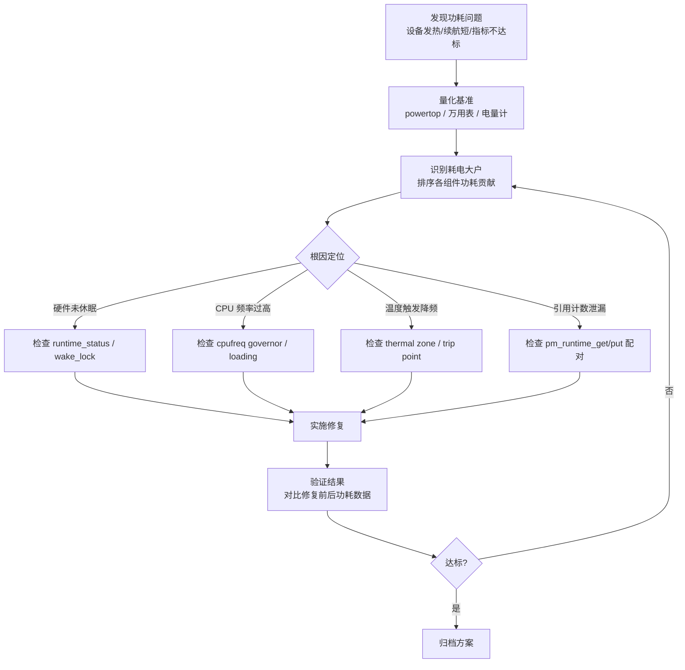

# 15.7.1 综合实战功耗排查

> 所属章节：第15章 电源管理 > 15.7 综合实战
>
> 难度：[E][M] | 预计阅读时间：35分钟

## <span class="blue"> 本节导读

前面章节你已经学习了 CPUFreq、CPUIdle、Runtime PM、Thermal 等子系统的原理与接口。但知识只有在实战中才能真正内化为能力——本节通过三个**完整且真实的功耗排查案例**，带你走完从"发现问题→定位根因→实施修复→验证结果"的全流程。三个案例分别覆盖**待机功耗优化**、**Runtime PM 引用计数泄漏**、**无风扇设备 Thermal 策略设计**三个典型场景。每个案例都包含具体命令、预期输出、分析思路和修复代码，你完全可以对着自己的开发板复现。

> 💡 **提示**：先用 powertop 找到耗电大户，再针对性优化——不要凭感觉调参，数据说话永远是功耗排查的第一原则。

---

## <span class="blue"> 功耗排查总体流程 [E]

在深入案例之前，先看一张总览图。无论面对什么功耗问题，都可以按这个框架推进：



这张图的核心思想是**闭环**：修复之后必须验证，验证不达标就回到识别阶段重新分析。很多工程师死在一个"想当然"——改完代码觉得应该好了，但实际上问题还在。

> ⚠️ **陷阱**：修复后必须验证——功耗优化容易有副作用。一个常见的坑是：你修复了 WiFi 驱动的 runtime suspend，结果唤醒延迟暴增，用户体验反而变差。功耗和性能永远是一对跷跷板，改完两边都要测。

---

## <span class="blue"> 带练 A：待机功耗优化（穿戴设备）[M]

**背景**：某智能手表项目，客户要求待机电流小于 5mA，实测 50mA，续航从设计的 7 天缩水到不到 1 天。设备进入待机后屏幕已灭、AP 已入idle，但电流依然偏高。

### 第 1 步：用 powertop 生成功耗报告

```bash
# 在设备上运行，采集 60 秒数据
root@watch:~# powertop --html=report.html --time=60
# 将 report.html 导出到 PC 查看，或直接看 Summary
root@watch:~# powertop --dump | head -40
```

**预期输出（节选）**：

```
The battery reports a discharge rate of 50.2 mA

Top 10 Power Consumers
  Usage       Events/s    Category       Description
  30.1 mA                    Device         WiFi radio
  10.4 mA                    Device         Accelerometer (BMA423)
   8.2 mA                    Device         CPU idle
   1.1 mA                    Device         Display backlight
   0.5 mA                    Timer          tick_sched_timer
```

**分析**：WiFi 以 30mA 霸占榜首，加速度计 10mA 次之，CPU idle 居然还有 8mA。这三个就是主攻目标。

### 第 2 步：检查 WiFi runtime_status

```bash
# 找到 WiFi 设备的 sysfs 路径
root@watch:~# find /sys/devices -name "wlan*" -type d 2>/dev/null
/sys/devices/platform/soc/18000000.wifi

# 查看 runtime 电源状态
root@watch:~# cat /sys/devices/platform/soc/18000000.wifi/power/runtime_status
active
root@watch:~# cat /sys/devices/platform/soc/18000000.wifi/power/runtime_enabled
enabled

# 查看 control 状态
root@watch:~# cat /sys/devices/platform/soc/18000000.wifi/power/control
auto
```

**分析**：`runtime_enabled=enabled` 且 `control=auto`，说明 Runtime PM 框架层面已启用。但 `runtime_status=active` 意味着设备从未进入 suspend。屏幕已灭、无网络流量，WiFi 凭什么醒着？**根因定位：WiFi 驱动未正确实现 `runtime_suspend` 回调，或者用户空间持有 wake source**。

进一步检查 wake lock：

```bash
root@watch:~# cat /sys/kernel/debug/wakeup_sources | grep wifi
wlan_wakeup       150    150    0    0    5000    0    0    0    0
```

active_since 有值，说明有唤醒源持有。先排除用户空间问题：

```bash
root@watch:~# svc wifi disable        # Android 环境
# 或
root@watch:~# nmcli radio wifi off    # Linux 环境
root@watch:~# cat /sys/devices/platform/soc/18000000.wifi/power/runtime_status
active    # ← 还是 active！确认是驱动问题
```

### 第 3 步：修复 WiFi 驱动

查看驱动代码，发现 `wlan_probe()` 中调用了 `pm_runtime_get_noresume()`，但**缺少对应的 `pm_runtime_put()` 调用**。修复如下：

```c
// === drivers/net/wireless/mywifi/main.c ===

static int wlan_probe(struct platform_device *pdev)
{
    struct wlan_priv *priv;
    
    priv = devm_kzalloc(&pdev->dev, sizeof(*priv), GFP_KERNEL);
    if (!priv)
        return -ENOMEM;
    
    // 原有代码：只 get 不 put，导致引用计数永远 >0
    // pm_runtime_get_noresume(&pdev->dev);
    
    // 修复：初始化完成后释放引用，让 Runtime PM 可以 suspend
    pm_runtime_get_noresume(&pdev->dev);
    pm_runtime_set_active(&pdev->dev);
    pm_runtime_enable(&pdev->dev);
    
    // ... 硬件初始化 ...
    
    pm_runtime_put(&pdev->dev);  // ← 补充这一行！
    
    return 0;
}

// 确保所有数据路径都正确管理引用计数
static int wlan_tx(struct sk_buff *skb, struct net_device *ndev)
{
    struct wlan_priv *priv = netdev_priv(ndev);
    int ret;
    
    ret = pm_runtime_get_sync(priv->dev);
    if (ret < 0)
        return ret;  // ← 错误路径未 put，继续修复
    
    // 修复后：所有返回路径都配对
    ret = wlan_hw_tx(priv, skb);
    if (ret) {
        pm_runtime_put_sync(priv->dev);  // ← 错误路径也要 put
        return ret;
    }
    
    pm_runtime_mark_last_busy(priv->dev);
    pm_runtime_put_autosuspend(priv->dev);
    return 0;
}
```

### 第 4 步：加速度计改为运动检测模式

BMA423 默认以 100Hz 采样率持续运行，耗电 10mA。改为运动检测模式（any-motion detection），仅在检测到运动时唤醒：

```bash
# 通过 sysfs 或 i2cset 配置
root@watch:~# echo 1 > /sys/bus/iio/devices/iio:device0/in_accel_any_motion_en
root@watch:~# echo 50 > /sys/bus/iio/devices/iio:device0/in_accel_wakeup_threshold
# 采样率从 100Hz 降到 25Hz（运动检测模式）
root@watch:~# echo 25 > /sys/bus/iio/devices/iio:device0/in_accel_sampling_frequency
```

对应驱动修改：

```c
// 在运动检测中断处理中唤醒，平时 suspend
static irqreturn_t bma423_motion_irq(int irq, void *data)
{
    struct bma423_priv *priv = data;
    
    pm_runtime_get(priv->dev);  // 临时唤醒读取数据
    bma423_read_motion(priv);
    pm_runtime_mark_last_busy(priv->dev);
    pm_runtime_put_autosuspend(priv->dev);
    
    return IRQ_HANDLED;
}
```

### 第 5 步：启用最深 C-state

```bash
# 查看当前可用 C-states
root@watch:~# cpupower idle-info
CPUidle governor: menu

C-states: 4
C1:  type=C1    latency=1    usage=15234
C2:  type=C2    latency=10   usage=8456
C3:  type=C3    latency=50   usage=123    # ← 使用次数极少
C4:  type=C4    latency=100  usage=0      # ← 从未进入！
```

C4 从未进入，说明 residency 条件不满足或 governor 保守。检查并调整：

```bash
# 检查是否被禁止
root@watch:~# cat /sys/devices/system/cpu/cpu0/cpuidle/state3/disable
1    # ← C4（state3）被禁用了！

# 启用
root@watch:~# echo 0 > /sys/devices/system/cpu/cpu0/cpuidle/state3/disable
root@watch:~# echo 0 > /sys/devices/system/cpu/cpu1/cpuidle/state3/disable
# ... 对所有 CPU 执行
```

### 第 6 步：验证结果

```bash
# 再次采集
root@watch:~# powertop --dump | head -20
The battery reports a discharge rate of 3.1 mA

Top 5 Power Consumers
  1.2 mA                    Device         WiFi radio
  0.8 mA                    Device         Accelerometer (BMA423)
  0.5 mA                    Device         CPU idle
  0.4 mA                    Device         PMIC
  0.3 mA                    Device         GPIO
```

| 组件 | 优化前 | 优化后 | 降幅 |
|------|--------|--------|------|
| WiFi | 30.1 mA | 1.2 mA | -96% |
| 加速度计 | 10.4 mA | 0.8 mA | -92% |
| CPU idle | 8.2 mA | 0.5 mA | -94% |
| **整机待机** | **50.2 mA** | **3.1 mA** | **-94%** |

待机电流从 50mA 降至 3mA，满足小于 5mA 的指标，续航恢复设计值。

> 🔴 **危险**：改完 WiFi Runtime PM 后，务必测试唤醒延迟和网络吞吐量。有些芯片从 suspend 唤醒需要 100ms+，如果产品对 WiFi 响应有实时性要求，这种优化可能是不可接受的。功耗和性能必须联合评估。

---

## <span class="blue"> 带练 B：Runtime PM 引用计数泄漏排查 [M]

**背景**：某工业网关设备运行 48 小时后，I2C 触摸控制器突然无法访问，报 `-EBUSY`。重启后恢复，但问题周期性复现。

### 第 1 步：观察现象

```bash
root@gateway:~# i2cdetect -y 0
     0  1  2  3  4  5  6  7  8  9  a  b  c  d  e  f
00:          -- -- -- -- -- -- -- -- -- -- -- -- --
# ... 触摸控制器在 0x38 地址无响应

root@gateway:~# dmesg | tail -5
[172800.345] i2c i2c-0: timeout waiting for bus ready
[172800.356] fts_ts 0-0038: i2c transfer failed: -EBUSY
```

### 第 2 步：检查 Runtime PM 状态

```bash
# 找到触摸设备的 sysfs 路径
root@gateway:~# cat /sys/bus/i2c/devices/0-0038/power/runtime_status
active
root@gateway:~# cat /sys/bus/i2c/devices/0-0038/power/runtime_usage
1         # ← 引用计数为 1，有人持有
root@gateway:~# cat /sys/bus/i2c/devices/0-0038/power/runtime_enabled
enabled
root@gateway:~# cat /sys/bus/i2c/devices/0-0038/power/control
auto
```

**分析**：`runtime_status=active` 且 `runtime_usage=1`，说明有一个未释放的 `pm_runtime_get()` 引用。设备因此无法 suspend，但这本身不会导致 I2C 失败。继续深挖——**实际上触摸控制器的 `runtime_suspend` 会把芯片切到深度睡眠模式以节省功耗，而 `runtime_resume` 会重新初始化**。如果引用计数泄漏导致设备长期保持 active，但后续某条代码路径又假设设备已在 suspend 状态并尝试重新初始化，就会出问题。

更常见的情况是：**泄漏导致设备一直被标记为 active，但当真正需要访问时，某个错误路径让设备实际进入了低功耗模式，而软件状态仍认为它是 active，通信自然超时**。

### 第 3 步：审查代码，定位泄漏点

查看触摸驱动源码，发现以下模式：

```c
// === drivers/input/touchscreen/fts/fts.c ===

static int fts_read_touchdata(struct fts_ts_data *data)
{
    int ret;
    u8 buf[64];
    
    ret = pm_runtime_get_sync(data->dev);
    if (ret < 0)
        return ret;           // ← 错误路径：已经 return，但没有 put！
    
    ret = fts_i2c_read(data->client, FTS_REG_TOUCHDATA, buf, sizeof(buf));
    if (ret < 0) {
        dev_err(data->dev, "read touchdata failed: %d\n", ret);
        // ← 又一个泄漏点：出错后没有 pm_runtime_put() 就直接返回了
        return ret;
    }
    
    fts_parse_touchdata(data, buf);
    
    pm_runtime_mark_last_busy(data->dev);
    pm_runtime_put_autosuspend(data->dev);
    return 0;
}
```

**根因定位**：`fts_read_touchdata()` 中有**两处泄漏**：

1. `pm_runtime_get_sync()` 返回错误时，引用计数未增加，所以不需要 put——但这其实是对的。
2. **真正的 bug 是 `fts_i2c_read()` 失败后，函数直接 `return ret`，忘记调用 `pm_runtime_put()`！**

随着触摸读取失败的累积（电磁干扰、ESD 等都会导致偶发 I2C 失败），`runtime_usage` 计数器不断攀升，最终设备被"永远"锁定在 active 状态。48 小时后，计数器达到某个临界，问题爆发。

### 第 4 步：修复所有错误路径

```c
static int fts_read_touchdata(struct fts_ts_data *data)
{
    int ret;
    u8 buf[64];
    
    ret = pm_runtime_get_sync(data->dev);
    if (ret < 0)
        return ret;   // 这里 OK：get_sync 失败时引用计数未变
    
    ret = fts_i2c_read(data->client, FTS_REG_TOUCHDATA, buf, sizeof(buf));
    if (ret < 0) {
        dev_err(data->dev, "read touchdata failed: %d\n", ret);
        goto out_put;     // ← 修复：统一走 put 出口
    }
    
    fts_parse_touchdata(data, buf);
    
out_put:
    pm_runtime_mark_last_busy(data->dev);
    pm_runtime_put_autosuspend(data->dev);
    return ret;
}
```

**更彻底的做法**：引入 `guard` 机制，利用 GCC 的 cleanup 属性自动管理：

```c
static void __fts_pm_put(void *p)
{
    struct device *dev = p;
    pm_runtime_put_autosuspend(dev);
}

#define fts_pm_guard(dev) \
    __attribute__((cleanup(__fts_pm_put))) int __ret = pm_runtime_get_sync(dev)

// 使用方式
static int fts_read_touchdata(struct fts_ts_data *data)
{
    u8 buf[64];
    int ret;
    
    fts_pm_guard(data->dev);  // 函数退出时自动 put
    
    ret = fts_i2c_read(data->client, FTS_REG_TOUCHDATA, buf, sizeof(buf));
    if (ret < 0)
        return ret;   // ← 自动调用 __fts_pm_put，不再泄漏！
    
    fts_parse_touchdata(data, buf);
    return 0;
}
```

### 第 5 步：验证

```bash
# 修复后，运行 stress 测试模拟 I2C 错误
root@gateway:~# while true; do
  cat /sys/bus/i2c/devices/0-0038/power/runtime_usage
  sleep 60
done
0
0
0
...        # ← 引用计数稳定为 0

# 长时间观察 runtime_status 变迁
root@gateway:~# cat /sys/bus/i2c/devices/0-0038/power/runtime_status
suspended   # ← 能正确进入 suspend 了

# 触发触摸后
root@gateway:~# cat /sys/bus/i2c/devices/0-0038/power/runtime_status
active
# 3 秒空闲后（autosuspend_delay = 3000ms）
root@gateway:~# cat /sys/bus/i2c/devices/0-0038/power/runtime_status
suspended   # ← 能正确回到 suspend
```

连续运行 72 小时，触摸功能正常，`runtime_usage` 始终为 0 或 1（瞬态），问题根治。

> ⚠️ **陷阱**：Runtime PM 的 `runtime_usage` 是原子计数器，printk 打印它的时候已经是"过去时"了。如果怀疑有竞态条件，可以在 `pm_runtime_get()` 和 `pm_runtime_put()` 处加 tracepoint，用 `trace-cmd` 采集执行流来定位。

---

## <span class="blue"> 带练 C：无风扇设备 Thermal 策略设计 [E]

**背景**：某车载网关设备，无风扇设计，工作温度范围 -40°C ~ 85°C。CPU 负载波动大（空闲时 5%，峰值时 100%），满载时温度飙到 90°C，超过外壳温度规格。

### 第 1 步：明确约束条件

| 约束项 | 规格 |
|--------|------|
| 散热方式 | 无风扇，自然对流 + 散热片 |
| 工作温度 | -40°C ~ 85°C（外壳温度） |
| CPU 负载 | 5% ~ 100%，大幅波动 |
| 核心要求 | 满载不超过 85°C，不能关机保护 |

> 🔴 **危险**：不要直接把 JVM 温度跟外壳温度划等号。CPU Junction 温度通常比外壳高 15~25°C，所以 CPU 读到 90°C 时外壳可能只有 70°C。一定要看传感器位置和数据手册的 thermal model。

### 第 2 步：用 stress-ng 满载测试，建立基线

```bash
# 4 核 ARM Cortex-A53，全部跑满
root@vehicle:~# stress-ng --cpu 4 --cpu-method matrixprod --timeout 300s --metrics

# 同时监控温度
root@vehicle:~# while true; do
  cat /sys/class/thermal/thermal_zone0/temp
  cat /sys/class/thermal/thermal_zone0/passive
  sleep 5
done
50000
0
65000
0
82000
0
90000
0    # ← 5 分钟后稳定在 90°C，超目标！
```

90°C 是 CPU Junction 温度，换算外壳温度约 68°C，看起来还有余量。但产品规格要求**在 85°C 环境温度下**仍需正常工作，这时 Junction 会达到 105°C+，直接触发硬件过温保护。所以必须引入主动降频。

### 第 3 步：设计 trip point 策略

```bash
# 查看当前 thermal zone 配置
root@vehicle:~# cat /sys/class/thermal/thermal_zone0/trip_point_0_temp
110000
root@vehicle:~# cat /sys/class/thermal/thermal_zone0/trip_point_0_type
critical
root@vehicle:~# cat /sys/class/thermal/thermal_zone0/policy
step_wise
```

只有一个 critical trip point 在 110°C，等于裸奔。重新设计三个 trip point：

| Trip Point | 温度 | 类型 | 动作 |
|------------|------|------|------|
| trip_point_0 | 70°C | passive | CPU 降频到 1.0 GHz |
| trip_point_1 | 80°C | passive | CPU 最大降频到 600 MHz |
| trip_point_2 | 95°C | critical | 紧急关机保护 |

设备树配置：

```dts
// === arch/arm64/boot/dts/myvendor/vehicle-gateway.dtsi ===

&cpu_thermal {
    trips {
        cpu_trip_passive_low: cpu_trip_passive_low {
            temperature = <70000>;    /* 70°C */
            hysteresis = <5000>;      /* 5°C 回差 */
            type = "passive";
        };

        cpu_trip_passive_high: cpu_trip_passive_high {
            temperature = <80000>;    /* 80°C */
            hysteresis = <5000>;
            type = "passive";
        };

        cpu_trip_critical: cpu_trip_critical {
            temperature = <95000>;    /* 95°C */
            hysteresis = <2000>;
            type = "critical";
        };
    };

    cooling-maps {
        map0 {
            trip = <&cpu_trip_passive_low>;
            cooling-device = <&cpu0 THERMAL_NO_LIMIT THERMAL_NO_LIMIT>;
            contribution = <1024>;    /* 全权重 */
        };

        map1 {
            trip = <&cpu_trip_passive_high>;
            cooling-device = <&cpu0 THERMAL_NO_LIMIT THERMAL_NO_LIMIT>;
            contribution = <2048>;    /* 更高权重，更激进降频 */
        };
    };
};
```

### 第 4 步：选择 governor

```bash
# 设置为 step_wise，响应快速且可预测
root@vehicle:~# echo step_wise > /sys/class/thermal/thermal_zone0/policy

# 查看可用的 cooling state
root@vehicle:~# cat /sys/class/thermal/cooling_device0/cur_state
0
root@vehicle:~# cat /sys/class/thermal/cooling_device0/max_state
10
```

`step_wise` governor 每步调整一个 cooling state，适合负载波动大的场景。如果用 `power_allocator`，响应会更平滑但延迟更高——无风扇设备对延迟不敏感，但对稳定性要求高，`step_wise` 更合适。

### 第 5 步：实测验证

```bash
# 重新满载测试
root@vehicle:~# stress-ng --cpu 4 --timeout 300s &

# 实时监控温度和频率
root@vehicle:~# watch -n 1 '
  echo "Temp: $(cat /sys/class/thermal/thermal_zone0/temp)"
  echo "Freq: $(cat /sys/devices/system/cpu/cpu0/cpufreq/scaling_cur_freq)"
  echo "Trip: $(cat /sys/class/thermal/thermal_zone0/passive)"
'
```

**预期输出时间线**：

| 时间 | 温度 | CPU 频率 | 说明 |
|------|------|----------|------|
| T+0s | 50°C | 1.5 GHz | 满载开始 |
| T+60s | 70°C | 1.2 GHz | 触发 trip_point_0，降频 |
| T+120s | 75°C | 1.0 GHz | 继续升温，governor 进一步降频 |
| T+180s | 80°C | 800 MHz | 触发 trip_point_1 |
| T+240s | 75°C | 1.0 GHz | 温度回落，governor 升频 |
| T+300s | 78°C | 1.0 GHz | 稳定在 75~80°C 区间 |

最终稳定在 75°C 左右，CPU 频率在 800MHz ~ 1.2GHz 之间动态调节，满足设计目标。

> 💡 **提示**：hysteresis（回差）非常重要。如果不设回差，温度在 trip point 附近波动时会导致频率反复跳变，形成"乒乓效应"。5°C 的回差意味着温度降到 65°C 才允许升频，避免了这个问题。

---

## <span class="blue"> 功耗排查工具速查 [E]

### 工具速查表

| 工具 | 用途 | 关键命令 | 关键字段/输出 |
|------|------|----------|---------------|
| **powertop** | 识别耗电大户 | `powertop --html=report.html` | Top 10 Power Consumers 表格 |
| **powertop** | 校准电池估算 | `powertop --calibrate` | discharge rate (mA/mW) |
| **cpupower** | CPU 频率/idle 状态 | `cpupower frequency-info` | available governors, steps |
| **cpupower** | C-state 统计 | `cpupower idle-info` | latency, usage count per state |
| **stress-ng** | 模拟负载压测 | `stress-ng --cpu 4 --timeout 300s` | bogo ops/s, CPU 占用 |
| **stress-ng** | 内存/IO 压测 | `stress-ng --vm 2 --io 2` | 多种 stressor 可选 |
| **sysfs** | Runtime PM 状态 | `cat .../power/runtime_status` | active / suspended / unknown |
| **sysfs** | Runtime PM 引用 | `cat .../power/runtime_usage` | 当前引用计数值 |
| **sysfs** | CPU 当前频率 | `cat scaling_cur_freq` | Hz 为单位 |
| **sysfs** | Thermal 温度 | `cat /sys/class/thermal/zone*/temp` | 毫摄氏度 |
| **sysfs** | Thermal trip point | `cat trip_point_*_temp` | 各档位温度阈值 |
| **trace-cmd** | 跟踪 PM 事件 | `trace-cmd record -e power:*` | runtime_suspend/resume 事件流 |
| **perf** | 分析 CPU 热点 | `perf top` / `perf record` | 函数级 CPU 占用 |
| **vmstat** | 系统整体状态 | `vmstat 1` | CPU idle%, 上下文切换 |

### 常用 sysfs 路径速查

```bash
# === Runtime PM ===
/sys/devices/.../power/runtime_status       # active | suspended | unknown
/sys/devices/.../power/runtime_usage         # 引用计数（0=可suspend）
/sys/devices/.../power/runtime_enabled       # enabled | disabled
/sys/devices/.../power/control               # auto | on
/sys/devices/.../power/autosuspend_delay_ms  # 自动suspend延迟

# === CPUFreq ===
/sys/devices/system/cpu/cpu*/cpufreq/scaling_driver
/sys/devices/system/cpu/cpu*/cpufreq/scaling_governor
/sys/devices/system/cpu/cpu*/cpufreq/scaling_cur_freq
/sys/devices/system/cpu/cpu*/cpufreq/scaling_available_frequencies

# === CPUIdle ===
/sys/devices/system/cpu/cpu*/cpuidle/state*/name
/sys/devices/system/cpu/cpu*/cpuidle/state*/latency
/sys/devices/system/cpu/cpu*/cpuidle/state*/usage
/sys/devices/system/cpu/cpu*/cpuidle/state*/disable

# === Thermal ===
/sys/class/thermal/thermal_zone*/temp
/sys/class/thermal/thermal_zone*/trip_point_*_temp
/sys/class/thermal/thermal_zone*/trip_point_*_type
/sys/class/thermal/thermal_zone*/policy
/sys/class/thermal/cooling_device*/cur_state
```

---

## <span class="blue"> 功耗优化最佳实践 [E]

| ✅ DO（推荐做法） | ❌ DON'T（避免做法） |
|-------------------|----------------------|
| **先用数据说话**：powertop / 电流表测出基准，再动手优化 | 不要凭感觉调参数，"我觉得这里可以优化" |
| **分层排查**：先整机→再子系统→再驱动→再硬件 | 不要一上来就改代码，先确认问题在哪一层 |
| **修复一个验证一个**：每处改动单独测效果 | 不要一次性改十处，出问题都不知道是哪处导致的 |
| **所有错误路径都检查 `pm_runtime_put()`** | 不要在错误路径上泄漏引用计数 |
| **使用 `pm_runtime_mark_last_busy()` 刷新空闲计时器** | 不要频繁 get/put，增加不必要的开销 |
| **设置合理的 autosuspend_delay_ms**（通常 50~200ms） | 不要设为 0（太激进，延迟差）或太大（省电效果差） |
| **Thermal 策略必须设 hysteresis 回差** | 不要让温度在 trip point 附近反复触发 |
| **功耗优化后必须测性能回归** | 不要只测功耗不测性能，用户感受的是流畅度 |
| **低温场景也要测**（-40°C 时晶振可能不起振） | 不要只在室温测试 |
| **保留 sysfs 接口供调试**（runtime_usage、status 等） | 不要把调试接口编译掉，现场问题要靠它们 |

> 💡 **提示**：无风扇设备的设计黄金法则是"降频优先于关机"。critical trip point 是最后一道防线，正常工况下永远不应该触发。如果你发现设备经常走到 critical，说明 cooling strategy 设计得不合理。

---

## <span class="blue"> 本节总结

| 案例 | 问题现象 | 根因 | 修复手段 | 关键验证指标 |
|------|----------|------|----------|--------------|
| **带练 A** | 待机 50mA 超标 | WiFi 驱动未 put；加速度计采样率过高；C-state 未启用 | 补充 `pm_runtime_put()`；改运动检测模式；启用 C4 | 待机电流 ≤ 5mA |
| **带练 B** | 48h 后触摸失效 | `fts_read_touchdata()` 错误路径泄漏 `pm_runtime_get()` | 统一 goto 出口；或用 GCC cleanup 自动管理 | `runtime_usage` 稳定为 0 |
| **带练 C** | 满载 90°C 超规格 | 无 thermal 主动降频，仅 110°C critical | 设计 70°C/80°C passive trip；`step_wise` governor | 满载稳定 75°C，频率自适应 |

**核心 takeaway**：

1. **量化第一**：没有电流表和 powertop，你就是在盲调。
2. **闭环验证**：改完必须测，性能功耗两边都要看。
3. **引用计数是 Runtime PM 的命脉**：get/put 必须严格配对，错误路径是最容易遗漏的。
4. **Thermal 策略是产品级设计**：trip point 的设置直接影响用户体验和产品可靠性，不能拍脑袋。

---

## <span class="blue"> 下一步

恭喜你走完了电源管理章节的全部实战案例！接下来是 **15.99 知识图谱与查漏补缺**，我会帮你把第15章的所有知识点串联成一张完整的思维导图，并附上自测清单，帮你确认哪些部分还需要回头巩固。

---

## <span class="blue"> 配套资源

- **powertop 官方文档**：https://01.org/powertop/documentation
- **Kernel 文档**：`Documentation/power/runtime_pm.rst`
- **Kernel 文档**：`Documentation/driver-api/thermal/sysfs-api.rst`
- **stress-ng 手册**：`man stress-ng`
- **cpupower 手册**：`man cpupower`
- **本书配套代码**：`examples/ch15/power_debug/`（含本节的监控脚本和解析工具）
