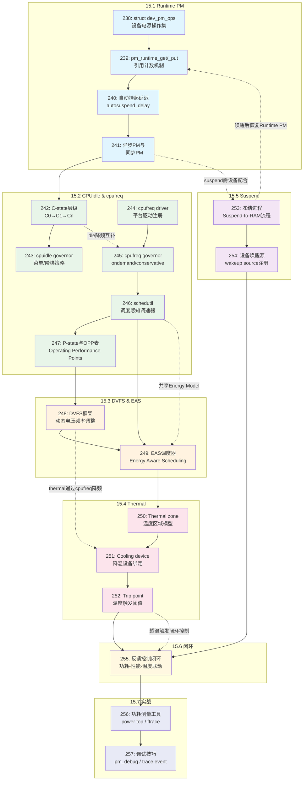

# 15.99 知识图谱与查漏补缺

> 所属章节：第15章 电源管理 > 15.99 知识图谱与查漏补缺
>
> 难度：[I] Intermediate | 预计阅读时间：30分钟

## <span class="blue"> 本节导读

恭喜你走到这里！第15章的全部内容已经学完。本节不是新知识，而是一张"地图"——帮你把前面散落的20个知识点（编号238-257）串成一张完整的电源管理知识图谱。读完本节，你会清楚地看到：Runtime PM、CPUidle、cpufreq、DVFS、Thermal、Suspend这六大主题如何互相配合，构成嵌入式系统中那张看不见的"省电网络"。同时，10道自测题帮你快速检验掌握程度，20条核心概念速查表则是一张可以夹在笔记本里的"作弊 sheet"。如果你时间紧张，只看速查表也能在5分钟内回忆起全章精华。

---

## <span class="blue"> 知识点关联全景图 [I]

下面的mermaid图展示了第15章20个知识点之间的层次关系与跨节依赖。每个方框内的数字是全局知识点编号（238-257）。



### 图的阅读指南

- **实线箭头**（`-->`）：表示知识点的递进顺序，建议按此顺序学习
- **虚线箭头**（`-.->`）：表示跨节的实际耦合关系，是系统级联调时的关键路径
- **颜色块**：浅蓝=Runtime PM、浅绿=CPUidle/cpufreq、浅橙=DVFS/EAS、浅粉=Thermal、浅紫=Suspend、浅黄=闭环、浅靛=实战

> 💡 **提示**：这张图不仅是学习地图，更是调试地图。当你的板子出现"suspend后设备无法唤醒"或"高温降频不生效"时，顺着虚线找到关联模块，能大幅缩小排查范围。

---

## <span class="blue"> 自测题 [I]

### 一、选择题（每题单选，共5题）

**第1题** [238] `struct dev_pm_ops` 中，哪个回调负责将设备从低功耗状态恢复到全速运行？

- A. `runtime_suspend()`
- B. `runtime_resume()`
- C. `runtime_idle()`
- D. `prepare()`

**答案：B**
> 解析：`runtime_resume()` 在引用计数从0变1时被调用，负责恢复设备；`runtime_suspend()` 是做相反的事；`runtime_idle()` 只是提示设备"可以 idle 了"，不强制；`prepare()` 是系统级 suspend 的回调，不是 Runtime PM 的。

**第2题** [242] 关于ARM处理器的C-state，下列说法正确的是？

- A. C0是深度睡眠状态，唤醒延迟最大
- B. C1比C0功耗更高
- C. 进入更深的C-state通常意味着更长的唤醒延迟
- D. 所有CPU架构的C-state编号规则完全一致

**答案：C**
> 解析：C0是运行状态（非睡眠），功耗最高；C1是最浅度的idle，比C0功耗低；更深的C-state（如C2/C3）确实会关闭更多硬件模块，导致唤醒延迟增加。不同架构（x86 vs ARM）的C-state定义并不完全一致。

**第3题** [246] schedutil governor 相比 ondemand 的核心优势是什么？

- A. schedutil使用更简单的阈值判断
- B. schedutil能直接感知调度器信息（PELT/UTIL_AVG）
- C. schedutil不支持频率上调
- D. schedutil不需要cpufreq驱动支持

**答案：B**
> 解析：schedutil 是 Linux 3.9+ 引入的"调度器感知"调速器，它直接读取调度器的 PELT（Per-Entity Load Tracking）信号，而不是像 ondemand 那样依赖采样间隔内的CPU负载百分比，因此响应更快、更精准。

**第4题** [252] Thermal trip point 的"passive"类型与"active"类型的区别是？

- A. passive只能关机，active可以降频
- B. passive通过软件策略（如降频）降温，active直接操作风扇等物理设备
- C. passive和active没有实际区别
- D. passive只在x86上存在

**答案：B**
> 解析：passive trip 触发的是软件层面的降温措施（最典型的是通过cpufreq限制最大频率）；active trip 则直接控制物理降温设备（风扇、制冷片等）。两种类型在所有支持Thermal子系统的架构上都存在。

**第5题** [253] `Suspend-to-RAM`（STR）过程中，`suspend_freeze_processes()` 的主要作用是？

- A. 关闭所有外设电源
- B. 冻结用户态进程，防止它们在suspend期间修改设备状态
- C. 保存CPU寄存器到内存
- D. 卸载所有内核模块

**答案：B**
> 解析：冻结进程是STR的关键步骤。如果不冻结，进程可能在设备已suspend后继续发起I/O请求，导致系统崩溃。注意：内核线程也会被标记为冻结，但部分关键线程（如PM核心线程）会被豁免。

---

### 二、简答题（共5题）

**第6题** [239] 请简述 `pm_runtime_get()` 与 `pm_runtime_get_sync()` 的区别，以及为什么异步版本在驱动中更常用。

**参考答案：**
- `pm_runtime_get()` 异步增加引用计数，不等待 `runtime_resume()` 完成立即返回，适合非阻塞场景
- `pm_runtime_get_sync()` 同步增加引用计数，会等待resume完成才返回，调用者可以确信设备已就绪
- 异步版更常用是因为：大多数I/O操作本身可以异步进行，驱动不需要阻塞等待设备上电，能显著提升吞吐；同步版仅在必须确认设备就绪时（如首次打开）使用

> ⚠️ **陷阱**：混淆`get`和`get_sync`是驱动开发中的常见bug。如果在atomic上下文（如irq handler）中误调`get_sync`，可能导致死锁。

**第7题** [243] 对比 cpuidle 的 "menu" governor 和 "ladder" governor，分别适合什么场景？

**参考答案：**
- **menu governor**：基于对下一次唤醒事件的预测（利用定时器信息）来选择C-state，适合有明确周期性负载的场景（如手机周期性心跳、传感器定采样），能更激进地进入深idle
- **ladder governor**：逐层下降策略，每次idle都从浅到深逐级尝试，更保守，适合负载不确定或唤醒源不可预测的场景（如通用服务器）
- 实际选择：嵌入式设备通常用menu；桌面/服务器多用ladder

**第8题** [248] DVFS 的核心数学关系是什么？为什么降频通常需要配合降压？

**参考答案：**
- 核心关系：`P ∝ CV²f`（功耗与电容×电压平方×频率成正比）
- 降频配合降压的原因：频率降低后，晶体管开关速度要求降低，可以承受更低的供电电压；而功耗与电压平方成正比，降压带来的功耗节省远大于单纯降频
- 实际约束：电压不能低于当前频率对应的最低稳定电压（由OPP表定义），否则触发undervolt panic

**第9题** [249] EAS（Energy Aware Scheduling）与传统CFS调度器在选择目标CPU时的关键差异是什么？

**参考答案：**
- CFS仅考虑时间公平性（vruntime），选择负载最轻的CPU
- EAS额外引入"能耗成本"维度：在`sched_energy_model`中定义了每个CPU的功耗-性能曲线
- EAS的任务分配目标函数是：`min(能耗增加 + 性能损失)`，即在满足latency要求的前提下，优先将任务调度到能效比更高的CPU（如小核）
- 关键前提：需要固件/驱动提供准确的Energy Model（CPU每个OPP的功耗数据），否则EAS退化为CFS

**第10题** [255] 描述"功耗-性能-温度"闭环控制的工作流程，并说明为什么三个子系统必须协同。

**参考答案：**
1. 正常工作阶段：EAS + schedutil 根据负载动态调整频率和任务分配，追求能效最优
2. 负载突增阶段：温度上升，thermal zone 检测到温度逼近 trip point
3. 降温干预阶段：thermal 子系统通过 cooling device 限制 cpufreq 的最大频率（passive cooling）
4. 频率受限后：DVFS范围被压缩，EAS重新在受限的频率空间内做任务分配
5. 温度回落后：thermal解除限制，系统回到步骤1

必须协同的原因：如果DVFS不响应thermal的请求，温度会持续上升至critical trip导致关机；如果EAS不感知thermal的限制，可能错误地把任务分配到大核（已被限频，效率极低）；如果suspend不冻结进程，唤醒后Runtime PM状态会混乱。三者共同维护"在安全温度范围内、最低功耗、满足性能需求"的稳态。

---

## <span class="blue"> 与前后章关联 [I]

第15章不是孤立的。它与前面章节的联系，以及作为第二部收官的位置，如下图所示：

```
+-------------------------------------------------------------+
|                    第二部：内核子系统篇                        |
|                                                             |
|   第7章  中断子系统 ──┐                                     |
|   第8章  进程调度  ───┼──→ EAS(8.6) ↔ 第15章 DVFS/EAS      |
|   第9章  内存管理  ───┤                                     |
|   第10章 时间管理  ───┼──→ tickless(10.4) ↔ cpuidle(15.2)  |
|   第11章 设备模型  ───┼──→ device/driver模型 ↔ Runtime PM   |
|   第12章 设备驱动  ───┤                                     |
|   第13章 同步机制  ───┤                                     |
|   第14章 调试与优化 ──┤                                     |
|   第15章 电源管理 ◄───┘ ← 本章：全局最优解（闭环控制）        |
|                         ↑                                   |
|                    第二部收官章                              |
+-------------------------------------------------------------+
```

### 向前的依赖

| 前序章节 | 关键关联点 | 在本章的应用 |
|---------|-----------|-------------|
| 第8章 进程调度 | EAS 与 CFS 的 task placement 差异 | 15.3 节 EAS 基于调度器负载信号做能耗感知分配 |
| 第10章 时间管理 | tickless idle、NO_HZ 模式 | 15.2 节 cpuidle 的 governor 决策依赖 tickless 提供的下次唤醒时间预测 |
| 第11章 设备模型 | struct device、driver probe 流程 | 15.1 节 Runtime PM 完全建立在设备模型之上，pm_runtime 接口操作的是 struct device |

### 第二部的完整版图

从第7章到第15章，九个子系统共同构成了一幅嵌入式Linux内核的知识全景：

| 章节 | 核心主题 | 一句话定位 |
|------|---------|-----------|
| 第7章 | 中断子系统 | 硬件事件的"神经中枢" |
| 第8章 | 进程调度 | CPU时间的"分配艺术" |
| 第9章 | 内存管理 | 物理资源的"虚拟魔术" |
| 第10章 | 时间管理 | 内核心跳的"节拍器" |
| 第11章 | 设备模型 | 驱动世界的"对象蓝图" |
| 第12章 | 设备驱动 | 硬件能力的"软件翻译" |
| 第13章 | 同步机制 | 并发世界的"交通规则" |
| 第14章 | 调试与优化 | 问题定位的"侦探工具箱" |
| **第15章** | **电源管理** | **前面八章的"全局最优解"** |

> 💡 **提示**：如果你是从第一部直接跳到本章的，建议先回看第8章（调度器）和第11章（设备模型），因为EAS和Runtime PM分别深度依赖这两章的基础概念。

---

## <span class="blue"> 核心概念速查表 [I]

下面的表格是全章20个知识点的一句话总结。建议打印出来贴在显示器旁边，忘了就瞟一眼。

### 15.1 Runtime PM（知识点238-241）

| 编号 | 概念 | 一句话解释 |
|------|------|-----------|
| 238 | `dev_pm_ops` | 设备电源操作集，定义了suspend/resume/idle三个阶段的回调函数 |
| 239 | `pm_runtime_get/put` | 引用计数驱动的电源管理：get+1上电，put-1断电，0才真关 |
| 240 | autosuspend_delay | 自动挂起延迟时间，防止设备在频繁I/O时反复开关电 |
| 241 | 异步PM vs 同步PM | 异步不等待完成立即返回（高性能），同步阻塞等待设备就绪（确定性） |

### 15.2 CPUidle & cpufreq（知识点242-247）

| 编号 | 概念 | 一句话解释 |
|------|------|-----------|
| 242 | C-state | CPU空闲状态层级：C0运行→C1浅睡→Cn深睡，越深越省电但唤醒越慢 |
| 243 | cpuidle governor | 选择进哪个C-state的策略：menu预测下次唤醒时间，ladder逐级尝试 |
| 244 | cpufreq driver | 平台相关驱动，通过OPP表暴露支持的频率/电压组合 |
| 245 | cpufreq governor | 决定当前跑多少频率：ondemand看负载百分比，conservative更保守 |
| 246 | schedutil | 调度器感知调速器，直接用PELT信号调速，响应最快 |
| 247 | P-state / OPP | Operating Performance Point = (频率, 电压)合法组合，降频必须查表 |

### 15.3 DVFS & EAS（知识点248-249）

| 编号 | 概念 | 一句话解释 |
|------|------|-----------|
| 248 | DVFS | 动态电压频率调整：P∝CV²f，降频+降压才能大幅省电 |
| 249 | EAS | 能耗感知调度：选CPU时不只看负载，还看哪个核跑这个任务最省电 |

### 15.4 Thermal（知识点250-252）

| 编号 | 概念 | 一句话解释 |
|------|------|-----------|
| 250 | Thermal zone | 温度区域，绑一个温度传感器+一套降温策略 |
| 251 | Cooling device | 降温设备：可以是风扇（主动），也可以是cpufreq限频（被动） |
| 252 | Trip point | 温度触发阈值：passive开始软件降温，critical强制关机 |

### 15.5 Suspend（知识点253-254）

| 编号 | 概念 | 一句话解释 |
|------|------|-----------|
| 253 | Suspend-to-RAM | 挂起到内存：冻结进程→关设备→CPU进深idle，唤醒快但仍有漏电 |
| 254 | Wakeup source | 唤醒源注册：让特定设备（如RTC、GPIO按键）能在suspend后唤醒系统 |

### 15.6-15.7 闭环与实战（知识点255-257）

| 编号 | 概念 | 一句话解释 |
|------|------|-----------|
| 255 | 反馈闭环 | 功耗-性能-温度三者联动：热了限频，限频后重调度，温度降了再放开 |
| 256 | 功耗测量 | powertop看进程级功耗，ftrace抓pm_runtime事件，内核看`/sys/power/` |
| 257 | 调试技巧 | `pm_debug`开详细日志，`trace event`抓resume耗时，`initcall_debug`看启动/挂起流程 |

> 🔴 **危险**：DVFS的OPP表必须与芯片手册严格一致。如果人为修改OPP表把电压设得太低，芯片可能不稳定（随机重启、位翻转）；设得太高则失去节电意义，甚至缩短芯片寿命。

---

## <span class="blue"> 本节总结

| 维度 | 内容 |
|------|------|
| **知识点数量** | 20个（编号238-257），覆盖Runtime PM、cpuidle、cpufreq、DVFS、EAS、Thermal、Suspend、闭环控制、实战调试 |
| **核心主线** | 引用计数（Runtime PM）→ CPU调速调压（cpufreq+DVFS）→ 任务调度优化（EAS）→ 温度约束（Thermal）→ 系统级休眠（Suspend）→ 闭环协同 |
| **跨节耦合** | 6条关键跨节依赖：suspend↔runtime PM、cpuidle↔cpufreq、schedutil→EAS、DVFS→thermal、thermal→闭环、suspend→runtime PM |
| **前序依赖** | 第8章（调度器）、第10章（tickless）、第11章（设备模型） |
| **自查工具** | 10道自测题（5选择+5简答），20条速查表 |

恭喜你完成了第15章——也是第二部全部九章——的学习！从第7章的中断到第15章的电源管理，你已经走完了嵌入式Linux内核子系统的完整旅程。如果你感到信息量爆炸，那很正常：电源管理本身就是嵌入式领域最复杂的交叉学科之一，它要求你同时理解硬件（芯片的电源域、温度传感器）、固件（OPP表、Energy Model）和内核软件（六大子系统协同）。当你真正在板子上调出一次完整的suspend/resume流程，或成功让一个高负载任务被EAS从小核迁移到大核时，那种成就感会告诉你：这一切都值得。

---

## <span class="blue"> 下一步

第二部到此结束。第三部将进入**驱动实战篇**，你将面对真实的硬件：

- 第16章：平台设备驱动（Platform Device Driver）
- 第17章：I2C子系统与传感器驱动
- 第18章：SPI子系统与显示驱动
- 第19章： regulators 与 clock 子系统（本章Runtime PM的实际硬件基础）
- 第20章：完整的电源管理驱动综合案例

特别是第19章和第20章，会把你本章学到的抽象概念落地到具体的regulator（LDO/DCDC）和clock gate操作中，那时你会真正理解：为什么Runtime PM只是"上层建筑"，regulator和clock才是"经济基础"。

---

## <span class="blue"> 配套资源

| 资源 | 路径/链接 | 说明 |
|------|----------|------|
| 本章mermaid图源文件 | `docs/ch15/ch15_knowledge_graph.mmd` | 可导入mermaid.live在线编辑 |
| 自测题答案PDF | `docs/ch15/ch15_self_test_answers.pdf` | 含详细解析与扩展阅读 |
| 速查表可打印版 | `docs/ch15/ch15_cheatsheet_a4.pdf` | A4单页，适合打印贴墙 |
| 内核文档 | `Documentation/power/`（内核源码树） | 官方权威参考 |
| 社区资源 | LWN.net PM专题 | 深度技术文章 |
| 推荐书籍 | 《Linux设备驱动程序》第14章 | 经典教材中的电源管理章节 |
