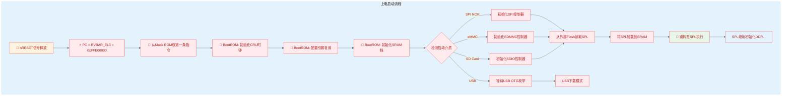

# 7.1.1 复位向量表与BootROM存储

> 所属：第7章 系统启动全链路 > 7.1 上电即执行：复位与BootROM
> 
> 难度：[I→E] | 预计阅读时间：35分钟

## 本节导读

当你看到RK3568开发板上电后串口打印的第一行 `U-Boot SPL 2021.10` 时，是否想过：CPU刚刚从RESET引脚释放到执行这行代码之间，究竟发生了什么？<br>本节从硬件复位信号释放那一刻开始，追踪PC寄存器的精确轨迹，解剖ARM64复位向量表的偏移布局，并深入解释为什么每颗SoC都必须在片内固化一段无法修改的BootROM代码, 以及为什么它偏偏要占据地址空间最高端那64KB。

---

## <span class="blue"> 复位向量表 — 上电后第一条指令在哪里？ [I] 

### 问题场景

你正在调试一块新设计的RK3568板子，上电后串口没有任何输出。示波器抓到有RESET信号释放，但之后总线地址没有任何活动。JTAG连接后发现PC = 0xFFE00000，这是一个你从未在代码中见过的地址。PC为什么指向这里？第一条指令从哪里来？

### 机制深入

#### 硬件复位后的PC赋值

ARM64架构规定，复位是一种**最高优先级异常**。当nRESET信号被释放后，硬件自动完成以下状态设定：

| 寄存器 | 复位值 | 含义 |
|--------|--------|------|
| `PC` | `RVBAR_EL3` | 复位向量基地址（由SoC硬件连线决定） |
| `PSTATE.EL` | `EL3` | 所有复位默认进入EL3（除非配了EL2-only） |
| `SCTLR_EL3.M` | `0` | MMU关闭 |
| `SCTLR_EL3.C/I` | `0` | D-Cache/I-Cache关闭 |
| `CPACR_EL1` | `0x0` | SIMD/FP访问关闭 |
| `DAIF` | `0xF` | 所有中断屏蔽 |

> 💡 **关键洞察**：复位后的第一条指令地址**不是来自软件可写的VBAR**，来自SoC硬连线的`RVBAR_EL3`（Reset Vector Base Address Register）。RK3568将`RVBAR_EL3`连到`0xFFE0_0000`，这正是片内BootROM的起始地址。

#### VBAR_ELx vs RVBAR_EL3 的分工

```
复位信号释放
    │
    ▼
PC = RVBAR_EL3 ──► 执行BootROM中的第一条指令（不可改）
                        │
                        ▼
              BootROM设置 VBAR_EL3 ← 运行时异常入口（可改）
                        │
                        ▼
              跳转到SPL/BL2后，再设 VBAR_EL2/VBAR_EL1
```

| 寄存器 | 可写性 | 用途 | 设定时机 |
|--------|--------|------|----------|
| `RVBAR_EL3` | 只读，硬件连线 | 决定复位后第一条指令 | 芯片设计tape-out时 |
| `VBAR_EL3` | 可写（EL3） | EL3异常入口基地址 | BootROM阶段 |
| `VBAR_EL2` | 可写（EL2） | EL2/Hypervisor异常入口 | 虚拟化启动时 |
| `VBAR_EL1` | 可写（EL1） | EL1/OS异常入口 | 内核启动时（`vbar_el1 = __entry_text_start`） |

#### ARM64异常向量表的偏移布局

一旦`VBAR_ELx`被设定，所有同步/异步异常都按**固定偏移**跳转到对应入口。ARM64定义了4组异常上下文，每组4种异常类型：

```mermaid
%%{init: {'theme': 'base', 'themeVariables': { 'primaryColor': '#e1f5fe', 'primaryTextColor': '#01579b', 'primaryBorderColor': '#0288d1', 'lineColor': '#0288d1', 'secondaryColor': '#fff3e0', 'tertiaryColor': '#e8f5e9'}}}%%
graph TD
    subgraph "VBAR_ELx + 偏移布局（共0x800字节）"
        direction LR
        A["+0x000<br/>Current SP_EL0, Synchronous"] --> B["+0x080<br/>Current SP_EL0, IRQ/vIRQ"]
        B --> C["+0x100<br/>Current SP_EL0, FIQ/vFIQ"]
        C --> D["+0x180<br/>Current SP_EL0, SError/vSError"]
        D --> E["+0x200<br/>Current SP_ELx, Synchronous"]
        E --> F["+0x280<br/>Current SP_ELx, IRQ/vIRQ"]
        F --> G["+0x300<br/>Current SP_ELx, FIQ/vFIQ"]
        G --> H["+0x380<br/>Current SP_ELx, SError/vSError"]
        H --> I["+0x400<br/>Lower EL AArch64, Synchronous"]
        I --> J["+0x480<br/>Lower EL AArch64, IRQ/vIRQ"]
        J --> K["+0x500<br/>Lower EL AArch64, FIQ/vFIQ"]
        K --> L["+0x580<br/>Lower EL AArch64, SError/vSError"]
        L --> M["+0x600<br/>Lower EL AArch32, Synchronous"]
        M --> N["+0x680<br/>Lower EL AArch32, IRQ/vIRQ"]
        N --> O["+0x700<br/>Lower EL AArch32, FIQ/vFIQ"]
        O --> P["+0x780<br/>Lower EL AArch32, SError/vSError"]
    end
```



**表1：ARM64异常向量标准偏移表**

| 偏移 | 异常来源 | 执行状态 | 栈指针 | 典型场景 |
|------|----------|----------|--------|----------|
| `0x000` | 同步异常 | 同EL | `SP_EL0` | EL3下使用SP_EL0时发生SVC |
| `0x200` | 同步异常 | 同EL | `SP_ELx` | EL3使用`SP_EL3`时发生数据中止 |
| `0x400` | 同步异常 | 低EL(AArch64) | 切换至SP_ELx | EL1内核缺页（MMU异常） |
| `0x600` | 同步异常 | 低EL(AArch32) | 切换至SP_ELx | 兼容32位用户态程序异常 |
| `0x280` | IRQ | 同EL | `SP_ELx` | EL3下的中断响应 |
| `0x480` | IRQ | 低EL(AArch64) | 切换至SP_ELx | 从EL1中断路由到EL3 |

> ⚠️ **常见陷阱**：复位向量**不是**`VBAR_EL3 + 0x000`。复位使用独立的`RVBAR_EL3`，与VBAR无关。BootROM通常会在启动早期将`VBAR_EL3`设为BootROM内部的异常处理入口，以便捕获早期异常。

### 关键代码路径

**ARM64复位向量代码（以ARM Trusted Firmware为例）**：

```asm
/* bl31/aarch64/bl31_entrypoint.S */
/* 复位入口点 — 上电后PC指向这里 */
entrypoint:
    /* 1. 立即设置临时栈（使用片内SRAM） */
    ldr x0, =BOOT_ROM_STACK_TOP
    mov sp, x0

    /* 2. 清零BSS段 */
    ldr x0, =__bss_start
    ldr x1, =__bss_end
    sub x1, x1, x0          /* x1 = BSS大小 */
    cbz x1, 1f
0:  str xzr, [x0], #8
    sub x1, x1, #8
    cbnz x1, 0b
1:
    /* 3. 设置异常向量表 */
    adr x0, runtime_exceptions   /* VBAR指向异常向量基址 */
    msr vbar_el3, x0
    isb

    /* 4. 初始化最小系统：定时器、UART、MMU（可选） */
    bl platform_setup

    /* 5. 加载下一阶段（BL2/SPL） */
    bl bl2_load

/* === 异常向量表 === */
    .align 11              /* 2KB对齐，ARM64要求 */
runtime_exceptions:
    /* Current EL with SP_EL0 */
    b sync_exception_sp0   /* +0x000 */
    .align 7               /* 每个入口128字节 */
    b irq_sp0              /* +0x080 */
    .align 7
    b fiq_sp0              /* +0x100 */
    .align 7
    b serror_sp0           /* +0x180 */
    .align 7

    /* Current EL with SP_ELx */
    b sync_exception_spx   /* +0x200 */
    .align 7
    b irq_spx              /* +0x280 */
    .align 7
    b fiq_spx              /* +0x300 */
    .align 7
    b serror_spx           /* +0x380 */
    .align 7

    /* Lower EL using AArch64 */
    b sync_exception_lower64  /* +0x400 */
    .align 7
    /* ... IRQ/FIQ/SError 省略 ... */

    /* Lower EL using AArch32 */
    b sync_exception_lower32  /* +0x600 */
    .align 7
    /* ... */
```

### Trade-off：复位向量放在哪里？

| 方案 | 地址位置 | 优点 | 缺点 | 采用芯片 |
|------|----------|------|------|----------|
| **高端地址**（如RK3568） | `0xFFE0_0000` | 低地址留给DRAM/Flash，内存布局连续 | 需64位地址线，小系统浪费 | Rockchip全系列、全志H6+ |
| **低端地址** | `0x0000_0000` | 兼容32位系统，地址简单 | 与DRAM冲突，需remap | 早期ARM9、STM32MP1 |
| **可配置（引脚strap） | 由GPIO决定 | 灵活，一颗芯片适配多种板型 | 增加PCB复杂度，引脚成本 | i.MX6/i.MX8、Zynq UltraScale+ |

---

## <span class="blue"> BootROM的存储位置 — 它到底存在哪里？ [I] 

### 问题场景

你在设计一块新板子的启动策略时，FAE告诉你"芯片上电直接从SPI NOR启动"。<BR> 但你查阅原理图发现，SPI NOR Flash是外部器件，出厂时还是空的。 空的Flash怎么可能"直接启动"？真相是：**永远先执行片内BootROM**，BootROM再去初始化外部Flash并加载代码。

### 机制深入

#### 片内存储的物理形态

BootROM代码必须存储在**芯片制造时已确定内容的非易失性存储器**中。业界有三种技术路线：

**表2：BootROM存储介质对比**

| 特性 | Mask ROM（光罩ROM） | OTP（一次性可编程） | eFuse（电熔丝） |
|------|---------------------|---------------------|-----------------|
| **写入时机** | 芯片制造（tape-out光罩） | 出厂后一次性 | 出厂后一次性 |
| **存储内容** | BootROM代码主体 | 启动参数/密钥/版本 | 安全启动密钥、启动配置位 |
| **容量** | 4KB~64KB | 128B~4KB | 几十bit~几KB |
| **可修改性** | **绝对不可改** | 烧写后不可擦除 | 烧写后物理熔断 |
| **成本** | 需定制光罩，NRE高 | 中等 | 与CMOS工艺兼容，成本低 |
| **可靠性** | 极高，20年+ | 高 | 极高，物理不可逆 |
| **典型用途** | 所有SoC的BootROM主体 | 启动模式 strap、芯片版本 | 安全启动公钥哈希、DRM密钥 |
| **示例芯片** | RK3568（32KB Mask ROM） | AM335x（8KB ROM + OTP） | i.MX8M（eFuse存储SRK） |

#### RK3568实例分析

RK3568的启动存储布局是业界典型设计：

```
地址空间（物理64位视图）
├─ 0xFFFF_FFFF ───┐
│                 │
├─ 0xFFE0_0000 ───┼──► Mask ROM (32KB) ← BootROM代码
│    [0xFFE0_7FFF] │    PC复位指向 0xFFE0_0000
├─────────────────┤
│  保留/寄存器区域  │
├─ 0xFF80_0000 ───┤
│                 │
├─ 0x0004_0000 ───┼──► SRAM (内部RAM，BootROM运行栈)
│    [0x0005_FFFF] │
├─ 0x0000_0000 ───┘

外部存储（BootROM初始化后访问）：
├─ SPI NOR Flash  （如W25Q128，16MB）
├─ eMMC           （8线SDIO）
├─ SD Card        （4线SDIO）
└─ NAND Flash     （并行或SPI）
```

#### 为什么不能从外部Flash直接启动？

🔴 **核心原因：鸡生蛋问题**。从外部Flash取指令需要：

1. **引脚多路复用配置**（pinmux）→ 需要配置GPIO控制器寄存器
2. **时钟树使能** → 需要配置CRU（Clock Reset Unit）
3. **总线访问** → 需要AXI/AHB总线矩阵初始化
4. **协议时序** → SPI/SDIO有特定的命令序列

以上每一步都需要**执行代码**，而这些代码不能存放在"尚未初始化的外部介质"中。片内BootROM的存在就是为了**打破这个死锁**。



---

## <span class="blue"> BootROM代码特征 — 极简主义的极致 [I] 

### 问题场景

你在阅读Rockchip TRM时发现BootROM只有32KB，却要支持从SPI NOR、eMMC、SD、NAND、USB等多种介质启动。<br>32KB连一个完整的SPI驱动都放不下，这是怎么做到的？更进一步：如果BootROM有bug（比如某批次eMMC初始化失败），芯片就报废了吗？

### 机制深入

#### BootROM的三阶段极简逻辑

BootROM是**嵌入式领域最极致的精简代码**，遵循"只做且必须做三件事"原则：

```c
/* BootROM 伪代码 — 通用结构（基于Rockchip/Allwinner/NXP共性抽象） */
void bootrom_main(void)
{
    /* ===== 阶段1：初始化最小硬件（~5KB代码） ===== */
    // 1.1 设置栈指针到片内SRAM顶部
    __asm__ volatile("mov sp, #%0" :: "i"(SRAM_TOP));

    // 1.2 使能最小时钟树：CPU/GPIO/SRAM
    cru_enable_clocks(CLK_CPU | CLK_SRAM | CLK_GPIO);

    // 1.3 配置调试串口（部分芯片省略以节省空间）
    // uart_early_init(UART2_BASE, 1500000);

    /* ===== 阶段2：检测启动介质（~10KB代码） ===== */
    boot_device_t dev;
    uint32_t boot_mode;

    // 2.1 读取strap引脚（或eFuse）
    boot_mode = read_strap_pins() | read_efuse_bootcfg();

    // 2.2 按优先级轮询各介质
    for (dev = BOOT_PRIO_LIST; dev != NULL; dev++) {
        if (dev->probe() == SUCCESS) {
            // 找到了有效的启动介质
            break;
        }
    }

    // 2.3 典型优先级：SD Card → eMMC → SPI NOR → NAND → USB

    /* ===== 阶段3：加载并跳转（~15KB代码） ===== */
    void *spl_load_addr = (void *)SPL_LOAD_ADDR;  // 通常是SRAM地址

    // 3.1 初始化对应的存储控制器
    dev->init_controller();

    // 3.2 从固定偏移读取SPL头部（验证magic/sum）
    struct spl_header hdr;
    dev->read(&hdr, BOOT_SECTOR_OFFSET, sizeof(hdr));

    if (hdr.magic != SPL_MAGIC_NUMBER) {
        // Magic不匹配 → 进入下载/恢复模式
        enter_usb_download_mode();
    }

    // 3.3 加载完整SPL到SRAM
    dev->read(spl_load_addr, BOOT_SECTOR_OFFSET, hdr.length);

    // 3.4 校验（CRC或SHA，安全启动时验证签名）
    if (verify_checksum(spl_load_addr, hdr.length, hdr.csum) != OK) {
        enter_recovery_mode();
    }

    // 3.5 关闭已初始化的设备，清理状态
    dev->cleanup();

    // 3.6 🚀 跳转至SPL — BootROM使命完成，永不返回
    void (*spl_entry)(void) = (void (*)(void))(spl_load_addr + hdr.entry_offset);
    spl_entry();   /* 不返回 */

    /* 理论上永远不会执行到这里 */
    while (1);
}
```

#### BootROM的精简技巧

| 技巧 | 说明 | 节省空间 |
|------|------|----------|
| **轮询代替中断** | 不用GIC，死等状态位 | ~2KB（免中断框架） |
| **硬编码时序** | 不计算波特率分频，用查表 | ~500B |
| **省略printf** | 仅保留最基础UART putc | ~3KB（免格式化库） |
| **汇编手写关键路径** | C编译器冗余大，热点用汇编 | ~20-30% |
| **共享存储控制器代码** | SD/eMMC共用底层发送/接收 | ~5KB |
| **仅支持块读取** | 不支持文件系统（SPL也不需） | ~10KB+ |

#### 安全启动扩展

当eFuse中烧写了安全启动标志后，阶段3的校验升级：

```
普通启动:        安全启动:
CRC校验 ──► OK   RSA/ECDSA验签 ──► OK
   │                              │
   ▼                              ▼
跳转SPL                      跳转SPL
   │                              │
   ▼                              ▼
暴露攻击面                   非法签名→Brick
```

🔴 **安全提醒**：安全启动一旦在eFuse中使能，**不可逆**。如果公钥烧写错误或私钥丢失，芯片将无法启动任何未签名固件，实质上成为"砖头"。量产前务必在OTP/efuse模拟模式下完整验证签名链。

### 实践案例：RK3568上电后PC = 0xFFE00000

**场景**：调试一块全新的RK3568开发板，上电后串口无输出，JTAG连接后观察：

```
(gdb) monitor reset halt
.target halted in ARM64 state due to debug-request
(gdb) info registers pc
pc             0xffe00000       0xffe00000
```

**分析过程**：

1. `PC = 0xFFE00000` 对应RK3568的`RVBAR_EL3`硬连线值，即32KB Mask ROM的起始地址
2. 查阅RK3568 TRM第3章：Mask ROM位于 `0xFFE0_0000 ~ 0xFFE0_7FFF`
3. 在该地址设置JTAG断点后单步，可以看到BootROM的执行流：

```
0xffe00000:  ldr  x0, =0x0005fffc    /* SRAM顶部作为临时栈 */
0xffe00004:  mov  sp, x0
0xffe00008:  bl   0xffe00120          /* cru_init_clocks() */
0xffe0000c:  bl   0xffe00280          /* sdmmc_init() 或其他 */
...
```

4. 串口无输出的原因排查：
   - ✅ PC指向BootROM → 复位正常
   - ⚠️ 检查BOOT引脚电平：如果全拉低，可能进入USB下载模式
   - ⚠️ 检查eMMC/SD是否焊好：BootROM轮询不到介质会循环检测
   - ⚠️ 检查SPL是否烧录：BootROM加载SPL失败时通常无任何输出

**修复**：将BOOT引脚配置为从SD卡启动，插入烧录好idbloader的SD卡，串口输出恢复。

💡 **调试技巧**：RK3568 BootROM在上电后约200ms内会尝试初始化UART2（如果eFuse配置了调试输出），可在`0xFF1A0000`（UART2基址）处观察寄存器变化。大部分芯片的BootROM不输出调试信息，此时需依赖JTAG或逻辑分析仪。

---

## 本节总结

| 要点 | 内容 |
|------|------|
| **复位后PC来源** | `RVBAR_EL3`硬连线，非VBAR。RK3568为`0xFFE00000` |
| **向量表偏移** | ARM64定义了0x800字节标准布局，按`SP/EL/异常类型`三维度索引 |
| **BootROM本质** | 片内Mask ROM，出厂固化，不可修改 |
| **BootROM三件事** | ①最小硬件初始化 ②启动介质检测 ③加载并跳转SPL |
| **为什么不能外部Flash启动** | 鸡生蛋问题：初始化Flash需要先执行代码 |
| **安全启动风险** | eFuse使能不可逆，签名链断裂=芯片报废 |

> 🔴 **关键安全提醒**：理解BootROM的执行流程是安全研究的基础。所有Secure Boot的信任链都起始于这段不可修改的代码, 它是整个系统的**信任根（Root of Trust）**。

---

## <span class="blue">  延伸阅读
- ARM Architecture Reference Manual for ARMv8-A, Section G3.1 "Exception vectors"
- Rockchip RK3568 TRM, Chapter 3 "System Boot"
- ARM Trusted Firmware docs: `docs/design/reset-design.md`
- NXP i.MX8M BootROM行为分析：`AN12853`
