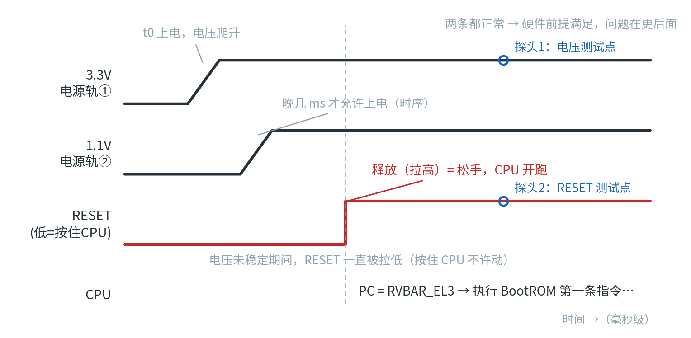
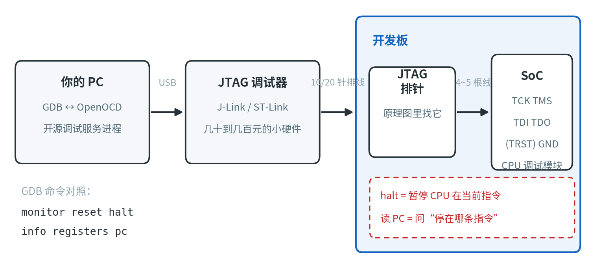
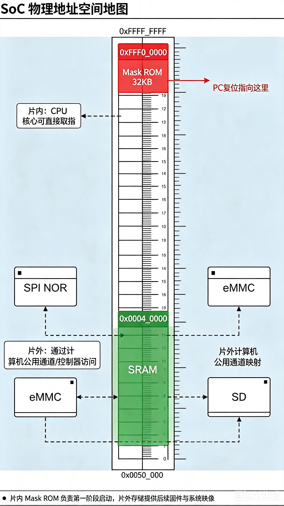
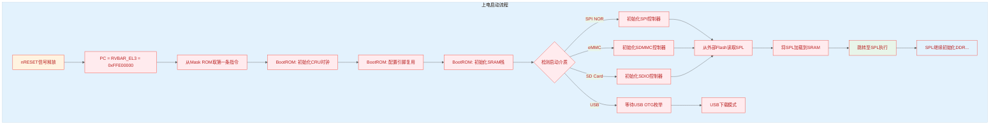

# 7.1.1 复位向量表与BootROM存储

> 所属：第7章 系统启动全链路 > 7.1 上电即执行：复位与BootROM
> 
> 难度：[I→E] | 预计阅读时间：35分钟

## <span class="blue"> 本节导读

本节是启动链的物理起点：RESET 信号释放到 SPL 开始执行之间的这段路径，全部发生在芯片内部，不依赖任何外部代码。串口打印出第一行 `U-Boot SPL` 之前，CPU 已经在片内 Mask ROM 里跑完了一段出厂固化的程序。理解这段程序从哪里开始执行、存储在什么介质上、按什么逻辑工作，是排查一切"上电无输出"问题的前提。<BR>
本节覆盖：复位后 PC 的来源、BootROM 的存储形态与极简结构、启动介质检测与下载模式、上电无输出的排查路径。

---

## <span class="blue"> 上电后串口没有输出，先看 PC 停在哪 [I]

一块新打样的 RK3568 板子，上电后串口没有任何输出。示波器确认 RESET 信号正常释放，电源时序也没问题。此时软件手段全部失效——没有任何代码在跑，printk、日志、调试串口都无从谈起。



还能用的工具是 JTAG：这是芯片级的调试接口，能在 CPU 处于 halted（暂停）状态下直接读写寄存器和内存，不依赖任何正在运行的软件。接上 JTAG，halt 住 CPU，读 PC：

```
(gdb) monitor reset halt
target halted in ARM64 state due to debug-request
(gdb) info registers pc
pc             0xffe00000       0xffe00000
```



`0xFFE0_0000` 不在 DDR 里，不在 SPI Flash 里，也不在任何链接脚本的地址范围内。这个地址从哪来？答案要从复位那一刻 CPU 的硬件行为说起。

### 复位后 CPU 处于什么状态

ARM64 用异常级别（Exception Level，EL0–EL3）把不同信任等级的代码隔离开：EL0 跑用户应用，EL1 跑操作系统内核，EL2 跑虚拟机监控器，EL3 跑安全固件，特权逐级升高。复位后 CPU 进入最高特权级 EL3，因为早期初始化需要不受限制地访问全部硬件资源，只有 EL3 能提供这个权限。

复位在 ARM64 中被定义为一种最高优先级异常。nRESET 信号释放后，硬件自动把处理器设定到一组确定的最小状态，保证第一条指令执行时机器行为可预期：

| 寄存器 | 复位值 | 含义 |
|--------|--------|------|
| `PC` | `RVBAR_EL3` | 复位向量基地址（由 SoC 硬件连线决定） |
| `PSTATE.EL` | `EL3` | 复位默认进入 EL3 |
| `SCTLR_EL3.M` | `0` | MMU 关闭，直接使用物理地址 |
| `SCTLR_EL3.C/I` | `0` | D-Cache / I-Cache 关闭 |
| `CPACR_EL1` | `0x0` | SIMD/FP 访问关闭 |
| `DAIF` | `0xF` | 全部中断屏蔽位（Debug/Async/IRQ/FIQ）置位，不响应任何中断 |

### 第一条指令的地址由硬件硬连线给出

CPU 正常运行时遇到异常（中断、缺页、未定义指令），怎么知道跳到哪段处理代码？ARM64 的答案是异常向量表：一张由 16 个入口组成的跳转表，基址保存在 `VBAR_ELx` 寄存器里，异常到来时硬件按固定偏移查表跳转。系统跑起来之后，每个 EL 都会设置自己的 VBAR。

但复位这一刻是特例中的特例——此时连向量表都还没建立，内存里没有任何软件设置的跳转目标。第一条指令的地址不能靠软件配置，只能由硬件直接给出。这个地址保存在 `RVBAR_EL3`（Reset Vector Base Address Register）中，它是只读的，取值在芯片设计定版（tape-out，设计冻结送交流片）时由硬件连线固定。RK3568 把 `RVBAR_EL3` 连到 `0xFFE0_0000`，这正是片内 BootROM 的起始地址。

> 💡 **复位向量不经过 VBAR**。JTAG 里看到的 `PC = 0xFFE0_0000` 就是 RK3568 的 `RVBAR_EL3` 硬连线值，与任何软件配置无关——这本身就是"复位路径正常"的第一个判据。

两者的分工在启动过程中先后交接：

```
复位信号释放
    │
    ▼
PC = RVBAR_EL3 ──► 执行BootROM中的第一条指令（硬件定死，不可改）
                        │
                        ▼
              BootROM设置 VBAR_EL3 ← 运行时异常入口（软件可改）
                        │
                        ▼
              跳转到SPL/BL2后，再设 VBAR_EL2/VBAR_EL1
```

| 寄存器 | 可写性 | 用途 | 设定时机 |
|--------|--------|------|----------|
| `RVBAR_EL3` | 只读，硬件连线 | 决定复位后第一条指令 | 芯片 tape-out 时 |
| `VBAR_EL3` | 可写（EL3） | EL3 异常入口基地址 | BootROM 阶段 |
| `VBAR_EL2` | 可写（EL2） | EL2/Hypervisor 异常入口 | 虚拟化启动时 |
| `VBAR_EL1` | 可写（EL1） | EL1/内核异常入口 | 内核启动时 |

### 向量表是 4×4 的矩阵，记住规律即可

VBAR 指向的向量表有 16 个入口，结构是严格的 4×4 矩阵：纵轴是异常来源的 4 种上下文（当前 EL 使用 SP_EL0、当前 EL 使用 SP_ELx、来自低 EL 的 AArch64、来自低 EL 的 AArch32），横轴是 4 种异常类型（同步异常、IRQ、FIQ、SError）。每个入口固定 `0x80` 字节，全表共 `0x800` 字节。入口空间只够放约 32 条指令，通常第一条就是 `b` 跳到真正的处理函数。

| 偏移 | 异常来源 | 栈指针 | 典型场景 |
|------|----------|--------|----------|
| `0x000` | 同 EL，同步异常 | `SP_EL0` | EL3 使用 SP_EL0 时发生 SVC |
| `0x200` | 同 EL，同步异常 | `SP_ELx` | EL3 使用 SP_EL3 时发生数据中止 |
| `0x400` | 低 EL（AArch64），同步异常 | 切至 SP_ELx | EL1 内核缺页 |
| `0x600` | 低 EL（AArch32），同步异常 | 切至 SP_ELx | 32 位兼容程序异常 |
| `0x280` | 同 EL，IRQ | `SP_ELx` | EL3 下的中断响应 |
| `0x480` | 低 EL（AArch64），IRQ | 切至 SP_ELx | 从 EL1 路由到 EL3 的中断 |

每种异常类型在一组上下文内占连续 4 个偏移（`0x000/0x080/0x100/0x180` 依次是同步/IRQ/FIQ/SError），组间相差 `0x200`。各入口处理函数的编写属于异常处理主题，第 10 章展开；本节只需建立一个认知：**复位向量在这张表之外**，它由 RVBAR 单独给出，不占用 `VBAR + 0x000`。

> ⚠️ 不要把复位向量当成 `VBAR_EL3 + 0x000`。两者是完全独立的机制：RVBAR 服务于"软件还不存在"的复位瞬间，VBAR 服务于"软件已经跑起来"之后的全部异常。BootROM 通常会在早期把 `VBAR_EL3` 指向 ROM 内部的异常处理入口，以便捕获启动早期的意外异常。

### 复位向量放在地址空间的哪一端

`RVBAR_EL3` 的具体取值是 SoC 厂商的设计决策，业界有三种做法：

| 方案 | 地址位置 | 优点 | 缺点 | 采用芯片 |
|------|----------|------|------|----------|
| **高端地址** | `0xFFE0_0000` 等 | 低地址留给 DRAM/Flash，内存布局连续 | 地址解码占用高端空间 | Rockchip 全系列、全志 H6+ |
| **低端地址** | `0x0000_0000` | 兼容 32 位系统，地址简单 | 与 DRAM 冲突，需 remap | 早期 ARM9、STM32MP1 |
| **strap 引脚可配置** | 由上电采样的引脚电平决定 | 一颗芯片适配多种板型 | 增加 PCB 复杂度和引脚成本 | i.MX6/i.MX8、Zynq UltraScale+ |

strap 引脚是芯片引出的几个专用配置脚，上电瞬间的电平高低被片内逻辑采样锁存，BootROM 读到的就是这个锁存值，据此决定启动介质、调试开关等硬件行为。后文排查"进错启动模式"时，查的就是这几个引脚的上下拉电阻。

---

## <span class="blue"> 这段代码存在哪：为什么必须是片内 Mask ROM [I]

FAE 说"这颗芯片上电直接从 SPI NOR 启动"。翻原理图会发现矛盾：SPI NOR 是外部器件，出厂时还是空片，空 Flash 上没有任何指令可取。"直接从 SPI NOR 启动"的真实含义是：**先执行片内 BootROM，由 BootROM 初始化 SPI NOR 并加载代码**。

### 为什么不能从外部 Flash 直接启动

> 🔴 核心原因是鸡生蛋问题。CPU 要从外部 Flash 取指令，前提是：

1. **引脚复用配置**：SPI/SDIO 引脚默认是 GPIO，需要先写 pinmux 寄存器
2. **时钟使能**：存储控制器的时钟默认关闭，需要配置 CRU（Clock & Reset Unit）
3. **总线初始化**：访问外设需要 AXI/AHB 总线矩阵完成地址映射
4. **协议时序**：SPI/SDIO 各有特定的命令序列和初始化握手

这四步每一步都要执行代码，而这些代码不可能存放在"尚未初始化的外部介质"里。片内 BootROM 存在的意义就是打破这个死锁：它出厂时已固化在芯片内部，上电即可取指，由它完成最小初始化后，外部介质才变得可读。

### 三种片内存储介质的取舍

BootROM 代码必须存放在芯片制造时内容就已确定、且永不丢失的存储器里。业界有三条技术路线：

| 特性 | Mask ROM（光罩ROM） | OTP（一次性可编程） | eFuse（电熔丝） |
|------|---------------------|---------------------|-----------------|
| **写入时机** | 芯片制造（光罩层固化） | 出厂后一次性 | 出厂后一次性 |
| **存储内容** | BootROM 代码主体 | 启动参数/密钥/版本 | 安全启动密钥、配置位 |
| **容量** | 4KB~64KB | 128B~4KB | 几十 bit~几 KB |
| **可修改性** | **绝对不可改** | 烧写后不可擦除 | 烧写后物理熔断 |
| **成本** | 需定制光罩，NRE 高 | 中等 | 与 CMOS 工艺兼容，成本低 |
| **典型用途** | 所有 SoC 的 BootROM 主体 | 启动模式、芯片版本 | 安全启动公钥哈希、DRM 密钥 |
| **示例芯片** | RK3568（32KB Mask ROM） | AM335x（8KB ROM + OTP） | i.MX8M（eFuse 存 SRK） |

三种介质经常组合使用：Mask ROM 存代码主体，OTP/eFuse 存让这段代码行为可变的配置位。代码不可改，行为可裁剪，这是成本和灵活性之间的标准折中。

### RK3568 的物理地址布局

RK3568 把 32KB Mask ROM 放在物理地址空间的高端，片内 SRAM 放在低端，是业界典型的布局方式：

```
地址空间（物理64位视图）
├─ 0xFFFF_FFFF ───┐
│                 │
├─ 0xFFE0_0000 ───┼──► Mask ROM (32KB) ← BootROM代码
│    [0xFFE0_7FFF] │    PC复位指向 0xFFE0_0000
├─────────────────┤
│  保留/寄存器区域  │
├─ 0xFF80_0000 ───┤
│                 │
├─ 0x0004_0000 ───┼──► SRAM (内部RAM，BootROM运行栈)
│    [0x0005_FFFF] │
├─ 0x0000_0000 ───┘

外部存储（BootROM初始化后访问）：
├─ SPI NOR Flash  （如W25Q128，16MB）
├─ eMMC           （8线SDIO）
├─ SD Card        （4线SDIO）
└─ NAND Flash     （并行或SPI）
```



> 💡 高端放 ROM、低端放 SRAM 不是巧合。ROM 地址由 RVBAR 硬连线指定，必须避开将来要映射 DRAM 的低地址区；SRAM 靠近地址零点是历史习惯，也方便与部分 32 位兼容场景对齐。

### BootROM 的上电执行全流程

把前两节串起来，从复位到跳转 SPL 的完整路径如下：


```mermaid
%%{init: {'theme': 'base', 'themeVariables': { 'primaryColor': '#ffebee', 'primaryTextColor': '#b71c1c', 'primaryBorderColor': '#f44336', 'lineColor': '#616161', 'secondaryColor': '#e8f5e9', 'tertiaryColor': '#e3f2fd'}}}%%
graph TD
    subgraph 上电启动流程
        A["nRESET信号释放"] --> B["PC = RVBAR_EL3 = 0xFFE00000"]
        B --> C["从Mask ROM取第一条指令"]
        C --> D["BootROM: 初始化CRU时钟"]
        D --> E["BootROM: 配置引脚复用"]
        E --> F["BootROM: 初始化SRAM栈"]
        F --> G{"检测启动介质"}
        G -->|SPI NOR| H["初始化SPI控制器"]
        G -->|eMMC| I["初始化SDMMC控制器"]
        G -->|SD Card| J["初始化SDIO控制器"]
        G -->|USB| K["等待USB OTG枚举"]
        H --> L["从外部Flash读取SPL"]
        I --> L
        J --> L
        K --> M["USB下载模式"]
        L --> N["将SPL加载到SRAM"]
        N --> O["跳转至SPL执行"]
        O --> P["SPL继续初始化DDR..."]
    end

    style A fill:#fff3e0
    style B fill:#ffebee
    style O fill:#e8f5e9
    style P fill:#e3f2fd
```

---

## <span class="blue"> BootROM 长什么样：32KB 只做三件事 [I]

RK3568 的 Mask ROM 只有 32KB，却要支持从 SPI NOR、eMMC、SD、NAND、USB 多种介质启动——32KB 连一个完整的 SPI 驱动框架都放不下。答案是把功能压缩到极限：只做且必须做三件事。

### 三阶段极简逻辑

BootROM 的结构在所有主流 SoC（Rockchip/Allwinner/NXP）上高度一致，抽象出来是三个阶段：

```c
/* BootROM 伪代码 — 基于 Rockchip/Allwinner/NXP 共性抽象 */
void bootrom_main(void)
{
    /* ===== 阶段1：最小硬件初始化（约5KB代码） ===== */
    set_stack_pointer(SRAM_TOP);           /* 栈设到片内SRAM顶部 */
    cru_enable_clocks(CLK_CPU | CLK_SRAM | CLK_GPIO);
    /* 部分芯片还会初始化调试UART，部分为省空间省略 */

    /* ===== 阶段2：检测启动介质（约10KB代码） ===== */
    boot_mode = read_strap_pins() | read_efuse_bootcfg();
    /* 按优先级轮询：典型顺序 SD → eMMC → SPI NOR → NAND → USB */
    for (dev = BOOT_PRIO_LIST; dev != NULL; dev++) {
        if (dev->probe() == SUCCESS)
            break;                         /* 找到有效介质 */
    }

    /* ===== 阶段3：加载并跳转（约15KB代码） ===== */
    dev->init_controller();
    dev->read(&hdr, BOOT_SECTOR_OFFSET, sizeof(hdr));
    if (hdr.magic != SPL_MAGIC_NUMBER)
        enter_usb_download_mode();         /* 介质无效 → 下载模式 */

    dev->read(SPL_LOAD_ADDR, BOOT_SECTOR_OFFSET, hdr.length);
    if (verify_checksum(SPL_LOAD_ADDR, hdr.length, hdr.csum) != OK)
        enter_recovery_mode();

    dev->cleanup();                        /* 清理状态，避免残留配置干扰下一阶段 */
    jump_to(SPL_LOAD_ADDR + hdr.entry_offset);  /* 跳转SPL，永不返回 */
}
```

跳转之后 BootROM 的使命就结束了。SPL 再往后，EL3 的常驻代码通常来自 ATF（ARM Trusted Firmware，bl31）——ARM 官方提供的 EL3 安全固件参考实现，负责 PSCI、安全世界切换等运行时服务；本书后文引用 ATF 代码时，都是拿它当行业通用写法的示例，各家厂商的实际实现均在此基础上裁剪。

### 32KB 是怎么省出来的

| 技巧 | 说明 | 大致节省 |
|------|------|----------|
| **轮询代替中断** | 不用 GIC，死等状态位 | 省去整个中断框架 |
| **硬编码时序参数** | 波特率分频等查表而非计算 | 省去数学库和配置逻辑 |
| **省略 printf** | 仅保留最基础的 UART putc | 省去格式化库 |
| **关键路径手写汇编** | 热点路径不经过编译器 | 体积显著小于 C 编译产物 |
| **共享控制器代码** | SD/eMMC 共用底层收发例程 | 省去重复驱动 |
| **仅支持块读取** | 不实现文件系统，按固定偏移读裸数据 | 省去 10KB 以上的 FS 代码 |

最后一行解释了 BootROM 加载协议为什么都是"固定偏移 + 头部魔数 + 长度 + 校验"的裸格式：不是设计偏好，是 32KB 的物理约束。各家具体的头部格式和偏移定义，7.1.3 节展开。

### 安全启动：信任链的起点与不可逆风险

eFuse 中烧写安全启动标志后，阶段 3 的校验从 CRC 升级为签名验证：

```
普通启动:        安全启动:
CRC校验 ──► OK   RSA/ECDSA验签 ──► OK
   │                              │
   ▼                              ▼
跳转SPL                      跳转SPL
   │                              │
   ▼                              ▼
固件可被替换               非法签名 → 拒绝启动
```

BootROM 不可修改，恰恰是整个系统可信的原因：所有 Secure Boot 的信任链都锚定在这段代码上，它是信任根（Root of Trust）。

> 🔴 安全启动在 eFuse 中使能后**不可逆**。公钥烧错或私钥丢失，芯片将拒绝一切未签名固件，物理上无法恢复，等同报废。量产前务必先在 OTP/eFuse 的模拟模式（不真正烧断熔丝）下完整验证签名链。

---

## <span class="blue"> 动手验证：上电无输出的排查路径 [I→E]

回到开头的故障板。JTAG 读到 `PC = 0xFFE0_0000` 后，排查按下面的顺序推进。

### 第一步：确认复位路径正常

PC 等于 RVBAR 硬连线值，说明复位释放后 CPU 正确地从 Mask ROM 取指。在 BootROM 地址范围内单步，能看到典型的初始化序列：

```
0xffe00000:  ldr  x0, =0x0005fffc    /* SRAM顶部作为临时栈 */
0xffe00004:  mov  sp, x0
0xffe00008:  bl   0xffe00120          /* cru_init_clocks() */
0xffe0000c:  bl   0xffe00280          /* sdmmc_init() 等介质初始化 */
...
```

如果 PC 停在一个莫名其妙的地址或反复复位，先查电源时序和复位电路，而不是软件。

### 第二步：沿介质检测链定位断点

复位正常但串口无输出，断点只可能出在 BootROM 的介质检测或加载阶段，候选原因按排查成本排序：

- **BOOT strap 引脚电平错误**：引脚全拉低时 RK3568 会跳过介质检测直接进 USB 下载模式，表现为完全无输出。测量 BOOT 相关引脚的上电电平，对照原理图的上下拉电阻。
- **启动介质焊接或接触问题**：eMMC 虚焊、SD 卡座接触不良时，BootROM 会循环轮询介质，同样无输出。JTAG 观察 PC 是否在 ROM 某段地址区间内循环。
- **介质里没有有效 SPL**：idbloader 没烧、烧错偏移、头部魔数损坏，BootROM 校验失败后进下载模式或恢复流程，依旧无输出。用读卡器直接检查介质上对应偏移的内容。

> 💡 部分芯片的 BootROM 在 eFuse 配置了调试输出时会初始化调试 UART（RK3568 默认是 UART2，基址 `0xFE660000` 附近的 UART 控制器，具体以 TRM 为准），上电早期就能在寄存器层面看到 UART 被配置的痕迹。但多数 BootROM 完全静默，此时 JTAG 和逻辑分析仪是仅有的观察手段。

### 第三步：修复并进入正确的启动路径

本例的修复：把 BOOT 引脚配置为 SD 卡启动，插入烧录好 idbloader 的 SD 卡，串口输出恢复。

当板子上没有任何可启动介质时，下载模式就是救砖通道：RK3568 在全部介质检测失败（或 strap 引脚强制）时进入 USB 下载模式，主机端用 rkdeveloptool 经 USB OTG 直接向 Flash 写入镜像。maskrom 模式由 BootROM 本身提供，只要芯片没坏就永远可用——这是 BootROM 不可修改特性的工程红利。

### 换成自己的芯片，资料从哪查

本节用 RK3568 举例，换到其他 SoC 时需要确认的三件事及其出处：

1. **支持哪些启动介质**：芯片 TRM 的 "System Boot"（或 Boot / BootROM）章节，会列出介质支持列表和检测优先级
2. **如何进入下载模式**：datasheet 的 boot mode 引脚表（strap 引脚定义）+ TRM 中下载模式的触发条件
3. **BootROM 加载 SPL 的协议**：TRM 同一章节会给出头部格式、加载偏移和目标地址，也可直接对照 U-Boot 源码中对应 SoC 的 `mkimage` 目标（如 Rockchip 的 `idbloader.img` 生成规则）

---

## <span class="blue"> 本节总结

| 要点 | 内容 |
|------|------|
| **复位后 PC 来源** | `RVBAR_EL3` 硬件硬连线，与 VBAR 无关；RK3568 为 `0xFFE0_0000` |
| **复位 vs 异常向量** | 复位是特例：向量表尚未建立，第一条指令地址由硬件直接给出 |
| **向量表结构** | 4 组异常来源 × 4 种异常类型，每入口 `0x80` 字节，共 `0x800` 字节 |
| **BootROM 本质** | 片内 Mask ROM，出厂固化，不可修改，是系统信任根 |
| **BootROM 三件事** | ① 最小硬件初始化 ② 启动介质检测 ③ 加载并跳转 SPL |
| **为什么不能外部 Flash 直接启动** | 鸡生蛋问题：初始化 Flash 的每一步都需要先执行代码 |
| **安全启动风险** | eFuse 使能不可逆，签名链断裂 = 芯片报废 |
| **无输出排查顺序** | JTAG 看 PC → 查 strap 引脚 → 查介质焊接 → 查 SPL 烧录 → 下载模式救砖 |

> 🔴 理解 BootROM 的执行流程是启动调试和安全研究的共同基础：调试时它是无输出问题的分界点，安全上它是整条信任链不可篡改的锚点。

---

## <span class="blue"> 延伸阅读

- ARM Architecture Reference Manual for ARMv8-A, "Exception levels" 与 "Exception vectors" 章节
- Rockchip RK3568 TRM, Chapter 3 "System Boot"
- ARM Trusted Firmware 设计文档：`docs/design/reset-design.md`
- NXP AN12853：i.MX8M BootROM 行为分析
