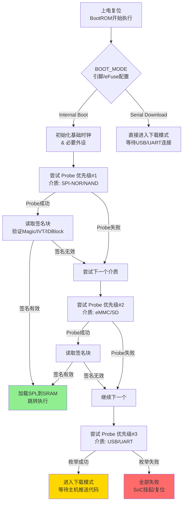
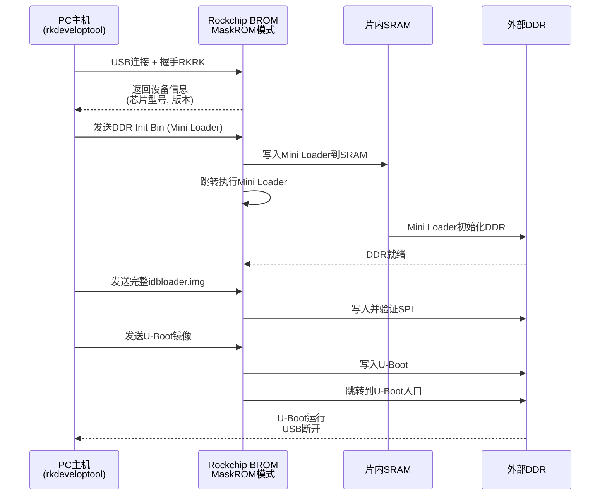

# 7.1.2 启动介质检测顺序

> 所属：第7章 启动流程与Bootloader > 7.1 BootROM原理
> 难度：[I→E] | 预计阅读时间：25分钟

## 本节导读

**为什么同一块板子插了SD卡却从eMMC启动？为什么BootROM总能"找到"可启动的设备？** 本节深入SoC BootROM的介质检测引擎，揭示从SPI-NOR到USB的遍历逻辑、签名验证机制与失败回退策略，并解析最后防线——下载模式的工作原理。

---

## 知识点1：BootROM启动介质检测顺序 [I] ~1200字

### 问题场景

某项目基于RK3568开发，工程师在调试时发现：**板子已插入烧录了idbloader的SD卡，但上电后仍从eMMC启动**。只有当eMMC被擦除后，SD卡才能被引导。这不是Bug——而是BootROM按固定优先级扫描介质的正常行为。理解这个顺序，是调试启动问题的第一课。

### 机制深入

BootROM（BROM）上电后的第一个任务，就是决定从哪里加载SPL。由于此时DRAM尚未初始化，BROM运行于片内SRAM（通常几十到几百KB），必须在极有限的代码空间内完成介质探测。

**核心约束**：探测顺序由**硅片硬编码**决定，用户无法通过软件修改（部分SoC可通过eFuse/引脚做有限配置）。

#### 各主流SoC的检测顺序对比

| SoC厂商 | 代表型号 | 检测顺序（高→低优先级） | 可配置性 | 典型场景说明 |
|---------|---------|------------------------|---------|------------|
| Rockchip | RK3399, RK3568 | SPI → eMMC → SD → USB | 部分型号支持SARADC引脚配置 | RK3568的SARADC_IN0引脚电平可切换NAND/eMMC/SD/USB顺序 |
| Rockchip | RK3288, RK3128 | NAND → eMMC → SPI → SD → USB | 不可配置 | 老型号NAND优先，面向平板/电视盒子市场 |
| NXP i.MX | i.MX6ULL/RT1170 | 由BOOT_MODE[1:0]引脚+eFuse决定 | BOOT_MODE引脚+eFuse BT_FUSE_SEL | 高度灵活：GPIO引脚可动态选择启动设备组 |
| Amlogic | S905X3, S922X | SPI-NOR → eMMC → NAND → SD → USB | POC引脚(NAND_CLE)可切换 | 部分板子通过短接eMMC时钟引脚强制跳过eMMC |
| MediaTek | MT7622 | SPI-NAND → eMMC → SDXC（或反之） | 硬件拨码开关控制 | 路由器场景常用，SW1开关选择两组顺序 |
| Allwinner | H6, H616 | SPI-NOR → NAND → SD → eMMC → USB | 不可配置 | 全志偏成本敏感，SD卡优先级高于eMMC |
| TI Sitara | AM335x(BeagleBone) | 由SYSBOOT引脚配置 | 16个SYSBOOT引脚组合 | 最灵活方案，16根引脚可编码数十种顺序 |

**为什么是这个顺序？** 设计逻辑遵循三个原则：

1. **速度优先**：SPI-NOR/NAND挂在SPI总线上，初始化简单（几ms内完成probe），无需复杂的协议握手；eMMC/SD需要CMD0→CMD1→CMD2→CMD3的完整枚举流程（ tens of ms 量级）
2. **可靠性优先**：片载/焊接存储（SPI-NOR、NAND、eMMC）比可插拔介质（SD卡、USB）更可靠，优先保证量产设备的启动确定性
3. **量产烧录友好性**：USB/UART放在最后作为"救援通道"，确保前面所有介质都为空时，产线仍能通过USB批量烧录



### 关键代码路径

以**Rockchip RK3399**为例，BROM的介质探测伪代码逻辑如下（基于逆向分析和文档推断）：

```c
/* arch/arm/mach-rockchip/rk3399_bootrom.h 风格伪代码 */
/* BROM 入口 —— 上电后PC指向此处 */
void brom_entry(void)
{
    u32 boot_dev;
    
    /* 1. 初始化内部PLL和SRAM控制器 */
    clk_init_sram();
    
    /* 2. 按固定优先级遍历启动介质 */
    for (boot_dev = 0; boot_dev < BOOT_DEV_MAX; boot_dev++) {
        int ret = probe_and_load(boot_priority_list[boot_dev]);
        if (ret == BOOT_OK)
            jump_to_spl(SRAM_BASE);   /* SPL已加载，跳转执行 */
    }
    
    /* 3. 全部介质失败 → 进入USB下载模式 */
    enter_usb_download_mode();
}

/* 启动优先级表 —— 硅片硬编码 */
static const enum boot_device boot_priority_list[] = {
    BOOT_DEV_SPI,       /* SPI-NOR/NAND: probe via 0x9f command */
    BOOT_DEV_EMMC,      /* eMMC: CMD0/1/2/3 enumeration */
    BOOT_DEV_SDMMC,     /* SD Card: SD协议枚举 */
    BOOT_DEV_USB_OTG,   /* USB Device模式 */
};
```

Rockchip的probe逻辑区分NOR和NAND：

```c
/* SPI设备probe —— 发送0x9f Read Identification */
int spi_probe(void)
{
    u8 id[3];
    spi_xfer(CMD_READ_ID, NULL, id, 3);
    
    /* 判断规则：首字节全1→NAND协议; 全0/全1→probe失败 */
    if (id[0] == 0xFF || id[0] == 0x00)
        return -ENODEV;
    
    /* 第二、三字节(type/capacity)全1或全0 → 无有效Flash */
    if ((id[1] == 0xFF && id[2] == 0xFF) || 
        (id[1] == 0x00 && id[2] == 0x00))
        return -ENODEV;
    
    /* id[0]=manufacturer ID. 0xFF→NAND协议, 其他→NOR协议 */
    if (id[0] == 0xFF)
        use_nand_protocol(CMD_READ_PAGE_0x13);
    else
        use_nor_protocol(CMD_READ_0x03);
    
    return 0;
}
```

### Trade-off表格：检测顺序的设计哲学

| 设计维度 | 高优先级放SPI-NOR | 高优先级放eMMC/SD | 推荐场景 |
|---------|-----------------|------------------|---------|
| 启动速度 | 快（SPI初始化<1ms） | 慢（需完整MMC枚举） | 对启动时间敏感的工业场景选SPI-NOR优先 |
| 容量灵活性 | 小（SPI-NOR通常<32MB） | 大（eMMC可达128GB+） | 需要大容量固件存储的选eMMC优先 |
| 量产可维护性 | 差（需专用烧录器） | 好（可OTA、可插拔） | 大批量消费电子产品选eMMC优先 |
| 调试便利性 | 中（逻辑分析仪可抓SPI） | 好（SD卡直接插电脑） | 开发阶段选SD优先的板子更方便 |
| 掉电可靠性 | 高（NOR无坏块管理） | 中（需考虑ext4分区损坏） | 高可靠性场景选SPI-NOR存放关键固件 |
| 成本 | 低（小容量NOR便宜） | 中（eMMC是BOM成本大户） | 成本敏感型选无eMMC+SPI-NOR方案 |

### 常见陷阱

⚠️ **陷阱1：SD卡插入不生效的"灵异现象"**  
Rockchip RK3399的BROM优先级是SPI→eMMC→SD。如果eMMC上存在**有效的idbloader**（哪怕是个旧版本），BROM永远不会扫描到SD卡。这常被误认为"SD卡没插好"。

💡 **技巧**：调试时先用`dd if=/dev/zero of=/dev/mmcblk2 bs=1M count=1`擦除eMMC前1MB，强制BROM走到SD卡探测。

⚠️ **陷阱2：Amlogic的eMMC"短路跳过"机制**  
部分Amlogic板子（如VIM1）在PCB上留有eMMC Test Point，短接可强制跳过eMMC探测。但这个操作只是让eMMC不响应CMD——如果eMMC有上拉电阻导致DAT0总线被拉高，BROM仍可能误认为eMMC存在而陷入超时等待。

🔴 **安全提醒**：eMMC Test Point短接只是调试手段，切勿在带电状态下操作——可能损坏eMMC的I/O驱动器。

---

## 知识点2：签名检测机制与失败回退 [I] ~1200字

### 问题场景

工程师用`dd`命令将idbloader.img写入SD卡`seek=64`，板子却无法启动。BROM报"ID Block not found"。问题在于：**写入位置不等于检测位置**，或者**签名格式不符合BROM预期**。每种SoC都有自己的"启动签名"定义，理解这些签名结构是制作可启动镜像的前提。

### 机制深入

BROM在probe到介质后，并不会直接加载数据——它首先要**验证签名块**，确认该介质上确实有合法的SPL代码，而非随机数据。

#### 各厂商签名格式对比

| SoC厂商 | 签名结构名称 | 关键Magic/标识 | 存储位置（介质偏移） | 校验方式 | 结构大小 |
|---------|------------|---------------|-------------------|---------|---------|
| Rockchip | IDBlock | 明文: `0x55 0xAA 0xF0 0x0F`<br>密文: `0x3B 0x8C 0xDC 0xFC` | SD/eMMC: sector 64 + 1024×n (n=0~4)<br>SPI: flash起始偏移 | RC4解密 + CRC | 512字节 |
| NXP i.MX | IVT (Image Vector Table) | `0xD1` (IVT header tag) | SD/eMMC: 固定偏移<br>(如0x400/0x1000取决于BOOT_CFG) | HAB签名验证 | 32字节 |
| Amlogic | FIP (Firmware Image Package) | TOC Entry UUID | SD/eMMC: sector 1 (512字节偏移)<br>SPI: sector 1 | SHA-256哈希 | 变长 |
| TI AM335x | MLO (Memory LOader) | `0x54414D38` ("TAM8" big-endian) | 分区表识别或raw偏移<br>由ROM的GP header解析 | CRC-CCITT | 头128字节 |
| Allwinner | eGON.BT0 / eGON.BT1 | "eGON.BT0" (ASCII) | SD/eMMC: sector 16 (8KB偏移)<br>SPI: 0偏移 | 检查和 (checksum) | 512字节对齐 |
| MediaTek | Preloader Header | `0x4D4D4D4D` ("MMMM") | EMMC: boot0分区<br>SPI-NAND: 第0块 | 奇偶校验 | 512字节 |

#### Rockchip IDBlock 结构详解

IDBlock是Rockchip BootROM最核心的数据结构，用RC4流密码做轻量级混淆（不是加密，key是公开常量）：

```c
/* tools/rkcommon.c —— U-Boot中Rockchip工具的IDBlock定义 */
/* RC4 key常量 —— Rockchip全系通用 */
static const u8 rc4_key[] = {
    0x7C, 0x4E, 0x03, 0x04, 0x55, 0x73, 0x10, 0x6B,
    0x33, 0x68, 0x77, 0x6C, 0x74, 0x52, 0x6F, 0x63,
    0x6B, 0x63, 0x68, 0x69, 0x70, 0x20, 0x54, 0x65,
    0x63, 0x68, 0x6E, 0x6F, 0x6C, 0x6F, 0x67, 0x79
};

/* IDBlock 512字节布局 */
struct rk_idblock {
    u32 magic;          /* offset 0:  RC4加密后的magic 0x55AAF00F */
    u32 disable_rc4;    /* offset 4:  是否对bootloader也用RC4 */
    u16 page_offset;    /* offset 8:  第一阶段SPL的扇区偏移 */
    u16 unknown1;       /* offset 10: 保留 */
    /* ... 中间数据 ... */
    u16 spl_size_2k;    /* offset 506: SPL大小（2KB块数） */
    u16 spl2_size_2k;   /* offset 508: 第二阶段大小（2KB块数） */
    u16 unknown2;       /* offset 510: 保留 */
};
```

BROM检测IDBlock的流程：
1. 从介质读取一个block（512字节）
2. 用RC4 key解密前16字节
3. 检查magic是否等于`0x55AAF00F`
4. 若匹配，继续解析后续字段获取SPL位置和大小
5. 若不匹配，跳到下一个候选偏移继续尝试

#### NXP i.MX IVT 结构详解

i.MX系列采用更标准化的IVT（Image Vector Table）结构，支持安全启动（HAB - High Assurance Boot）：

```c
/* i.MX IVT结构 —— 在include/asm/mach-imX/ 风格定义 */
struct ivt {
    u8  tag;            /* 0xD1 = IVT; 0xD7 = CSF (Command Sequence File) */
    u16 length;         /* IVT总长度（字节） */
    u8  version;        /* 0x40 = i.MX50/53; 0x41 = i.MX6/7; 0x43 = i.MX8 */
    u32 entry;          /* SPL入口地址 */
    u32 reserved1;
    u32 dcd_ptr;        /* Device Configuration Data指针（DDR初始化参数） */
    u32 boot_data_ptr;  /* Boot Data结构指针 */
    u32 self;           /* IVT自身的加载地址 */
    u32 csf_ptr;        /* CSF指针（安全启动签名） */
    u32 reserved2;
} __packed;
```

### 关键代码路径：Rockchip的IDBlock搜索逻辑

```c
/* BROM中SD/eMMC介质的IDBlock搜索 —— 基于RK3399分析 */
int sdmmc_search_idblock(struct bootdev *bdev)
{
    /* SD/eMMC搜索位置: sector 64, 1088, 2112, 3136, 4160 */
    /* 即 64 + 1024*n, n=0..4 */
    const u32 search_offsets[] = {64, 1088, 2112, 3136, 4160};
    u8 block[512];
    int i;
    
    for (i = 0; i < 5; i++) {
        /* 从介质读取512字节 */
        mmc_read_block(bdev, search_offsets[i], block);
        
        /* RC4解密 */
        rc4_crypt(block, 512, rc4_key, sizeof(rc4_key));
        
        /* 验证magic number */
        if (*(u32 *)block == RK_IDBLOCK_MAGIC) {  /* 0x55AAF00F */
            /* 进一步校验SPL大小是否合理 */
            u16 spl_size = *(u16 *)(block + 506);
            if (spl_size > 0 && spl_size < 256)  /* 最大512KB SPL */
                return search_offsets[i];  /* 找到有效IDBlock */
        }
    }
    return -ENOENT;  /* 5个位置都失败 */
}
```

### Trade-off表格：签名机制对比

| 签名方案 | 复杂度 | 安全性 | 启动开销 | 工具链支持 | 适用场景 |
|---------|-------|-------|---------|----------|---------|
| Rockchip RC4+Magic | 低 | 低（RC4 key公开） | 极低（<1ms） | 好（rkdeveloptool） | 消费级产品，快速启动 |
| NXP IVT+HAB | 高 | 高（RSA-2048/4096签名） | 中（10-50ms验签） | 好（NXP CST工具） | 汽车、工业安全启动 |
| Amlogic FIP+UUID | 中 | 中 | 低 | 一般（amlogic-boot-fip） | 电视盒子、OTT设备 |
| Allwinner ASCII Tag | 低 | 极低 | 极低 | 差（社区工具sunxi-tools） | 成本极致敏感型 |
| TI MLO+GP Header | 中 | 中（支持安全启动） | 低 | 好（TI SDK） | 工业控制、网关 |

### 常见陷阱

⚠️ **陷阱1：seek=64不等于offset=64×512**  
很多工程师混淆`dd seek=`的单位。`seek=64`表示64个**block**（默认512字节）= 32768字节。而Rockchip BROM搜索的是**sector 64**，即64×512=32768字节。这恰好一致，但如果用`bs=1k seek=32`，逻辑正确但可读性极差，容易出错。

⚠️ **陷阱2：RC4解密的"双向混淆"**  
Rockchip的IDBlock用RC4混淆，但RC4是对称的——加密和解密是同一个操作。这意味着你可以用同一套key在PC上"加密"生成IDB镜像。`rkdeveloptool`和U-Boot的`tools/rkcommon.c`都内嵌了相同的key。

⚠️ **陷阱3：i.MX IVT的`self`字段必须与加载地址匹配**  
IVT中的`self`字段必须是IVT被加载到RAM后的实际地址。如果这个地址填错，BROM的HAB验证会失败，且不会给出明确错误码——只会静默进入Serial Download模式。

---

## 知识点3：下载模式——最后防线 [I] ~800字

### 问题场景

板子eMMC被意外擦除、SPI-NOR是空的、也没有插SD卡——系统似乎"变砖"了。但所有SoC都预留了**最后一条活路**：当全部启动介质检测失败后，BootROM会进入**下载模式**（Download Mode），通过USB或UART接收主机推送的代码。

### 机制深入

下载模式是BootROM内置的"救援协议"。它在介质全部探测失败后自动进入，也可通过专用引脚强制触发。

| SoC厂商 | 下载模式名称 | 触发方式 | 通信接口 | 协议/工具 | 加载目标 |
|---------|------------|---------|---------|----------|---------|
| Rockchip | MaskROM Mode | 自动（全部介质失败）或按住RECOVERY键上电 | USB OTG | Rockusb协议<br>`rkdeveloptool` | DDR或SRAM |
| NXP i.MX | Serial Download | BOOT_MODE[1:0]=2'b01 | USB OTG 或 UART | SDP (Serial Download Protocol)<br>`imx_usb` / `uuu` | SRAM |
| Amlogic | USB Boot | 自动失败进入 或 HDMI DDC强制 | USB OTG | Amlogic自定义USB协议<br>`pyamlboot` | DDR |
| Allwinner | FEL Mode | 自动失败 或 专用FEL引脚拉低 | USB OTG | FEL协议<br>`sunxi-fel` | SRAM/DDR |
| MediaTek | Preloader Download | 自动失败 或 按键组合 | USB OTG | MTK BROM协议<br>`spflashtool` | SRAM |
| TI AM335x | UART/SPI Download | SYSBOOT配置 | UART0 或 SPI0 | XMODEM / TISDP | SRAM |

#### Rockchip MaskROM模式深度解析

MaskROM是Rockchip最具特色的下载模式，其工作流程：

1. **USB设备枚举**：BROM初始化USB OTG控制器，以Device模式枚举
2. **等待PC连接**：PC端运行`rkdeveloptool`或`upgrade_tool`
3. **协议握手**：工具发送`0x524B524B`（"RKRK"）握手包
4. **DDR初始化**：BROM本身不初始化DDR——它先接收一个**mini loader**到SRAM，由mini loader初始化DDR
5. **完整Loader烧录**：DDR就绪后，工具推送完整idbloader + U-Boot到DDR执行



### 关键代码路径：强制进入下载模式的方法

```bash
# ========== 强制进入MaskROM/下载模式的实用命令 ==========

# 【Rockchip】通过RECOVERY引脚强制进入
# 硬件操作：将RECOVERY引脚(通常是GPIO0_A6)拉低，然后上电
# 或使用rkdeveloptool在已启动系统中强制复位：
rkdeveloptool rd    # reset device → 若eMMC无有效loader则进MaskROM

# 【i.MX】通过BOOT_MODE引脚配置
# 将BOOT_MODE0=1, BOOT_MODE1=0 (即2'b01) 设置为Serial Download
# 例如i.MX6ULL: BOOT_MODE[1:0] = 01
# 可通过设备树中gpio-hog在上电时拉低特定引脚：

# 【Allwinner】FEL模式 —— 最简洁的强制进入方式
# 短接FEL引脚到GND上电，或从已启动Linux进入：
sunxi-fel spl sunxi-spl.bin   # 通过USB推送SPL

# 【通用】擦除启动介质前几个块强制进入下载模式
# 危险操作！确保有恢复手段后再执行：
dd if=/dev/zero of=/dev/mmcblk2 bs=512 count=64   # 擦除eMMC前32KB
flash_erase /dev/mtd0 0 4                         # 擦除SPI-NOR前4个block
```

### 常见陷阱

⚠️ **陷阱1：MaskROM ≠ Loader模式**  
Rockchip有两个容易混淆的模式：
- **MaskROM**：BROM层面的下载模式，BROM直接处理USB通信，此时eMMC/SD完全未被初始化
- **Loader模式**：SPL（idbloader）已经运行，SPL中的USB驱动处理通信  
两者进入方式和协议不同。MaskROM用`rkdeveloptool`，Loader模式通常用`upgrade_tool`或OTA接口。

⚠️ **陷阱2：USB线缆质量导致MaskROM不稳定**  
MaskROM使用USB2.0 Full-Speed（12Mbps），对信号完整性要求虽不高，但**劣质USB线**会导致大量CRC重传，表现为`rkdeveloptool`间歇性失败或进度卡顿。

💡 **技巧**：产线批量烧录时，使用带USB Hub独立供电的开发主机，避免因电压跌落导致枚举失败。

🔴 **安全提醒**：MaskROM/Serial Download模式下，任何人都可以通过USB连接并读写系统内存。在量产产品中，**务必通过eFuse关闭或加密下载模式**，否则攻击者可轻易提取固件或植入恶意代码。

---

## 实践案例：SD卡启动偶发失败的根因分析 [I] ~600字

### 现象描述

某基于RK3568的工业网关产品，在产线测试中发现约**3%的板子**插入SD卡后无法从SD卡启动，表现为从eMMC启动了旧版本系统。重新插拔SD卡后问题消失。产线反馈"SD卡槽接触不良"。

### 根因分析

深入分析后发现，问题并非卡槽接触不良，而是**BootROM检测时序与SD卡上电时序的竞争条件**。

#### 竞争条件时序图

```
时间轴 ──────────────────────────────────────────>

电源上电:    [PSU Ramp-Up]━━━━━━━━━━━━━━━━━━━━━>
eMMC就绪:              [eMMC Ready]━━━━━━━>
SD卡插入:       [SD Insert]━━━>
SD卡内部初始化:        [SD Internal Init]━━━━━━━━━━>
BROM探测eMMC:                 [BROM Probe eMMC]━━━> ✓ 成功
BROM探测SD:                                    [BROM Probe SD]━━━> ✗ 超时

结果: 由于SD卡内部初始化未完成，BROM探测SD时CMD0无响应，
      在375kHz ID-mode下超时后跳过SD，继续使用eMMC启动
```

#### 详细机制

RK3568的BROM在探测SD/eMMC时，ID-mode阶段使用**375kHz**的低速时钟发送CMD0（GO_IDLE_STATE）。如果SD卡内部控制器尚未完成上电自检（通常需要10-100ms），它会**不响应任何CMD命令**。BROM的超时阈值约为**100ms**，超时后即标记该介质"不存在"，跳到下一个。

问题板子的SD卡供电由一颗LDO提供，该LDO的**使能信号来自GPIO**，软件控制的使能时序比主电源上电延迟了约20ms。加上部分SD卡（尤其是工业级宽温卡）的自检时间较长，刚好越过BROM的容忍窗口。

### 解决方案

| 方案 | 改动点 | 验证结果 | Trade-off |
|-----|--------|---------|----------|
| A: 调整LDO上电时序 | 将SD卡供电改为常开（Always-On），或由PMIC的PWRON同步使能 | 100%解决 | 待机功耗增加约5mA |
| B: 擦除eMMC前1MB | 产线SOP中增加擦除eMMC步骤 | 100%解决 | 失去eMMC作为fallback的能力 |
| C: 使用Rockchip的SD启动优先配置 | 通过SARADC_IN0引脚配置NAND→SD→eMMC顺序 | 80%改善 | 需硬件改板，且只适用于RK3568 |
| D: 延长BROM超时 | 不可行——BROM是ROM，无法修改 | N/A | — |

**最终采用方案A**：将SD卡供电改为常开。工业场景中SD卡本身即为主要存储介质，5mA待机功耗增加在可接受范围内。

### 调试手法复盘

1. **用示波器抓上电时序**：测量SD卡VCC、CLK、CMD三条线，确认BROM发CMD0时SD卡VCC是否已稳定
2. **BROM日志输出**：部分SoC的BROM可通过UART输出调试信息（需特殊版本BROM或配置eFuse）
3. **rkdeveloptool读回验证**：用工具读回SD卡sector 64的数据，确认IDB是否写入正确位置

---

## 本节总结

BootROM的介质检测顺序是一个**优先级驱动的遍历过程**，核心要点：

1. **顺序硬编码不可改**（大部分SoC），理解你的SoC的具体顺序是调试前提
2. **签名检测是"准入门槛"**——IDBlock/IVT/FIP的magic、位置、格式任一错，BROM直接跳过
3. **下载模式是最后防线**——理解MaskROM/Serial Download的进入方式和协议，是救砖必备技能
4. **时序是关键**——SD/eMMC的初始化时序与BROM探测窗口的竞争条件，是偶发启动失败的重要根因

**速查口诀**："SPI快、eMMC稳、SD灵活、USB救砖。"

---

## 配套资源

### 表格清单

| 表格编号 | 名称 | 说明 |
|---------|------|------|
| 表1 | 各主流SoC检测顺序对比表 | 7大厂商BootROM优先级 |
| 表2 | 签名格式对比表 | 6种签名结构的magic/位置/校验方式 |
| 表3 | 下载模式对比表 | 6种下载模式的触发方式和工具 |
| 表4 | 检测顺序Trade-off | 速度/容量/可维护性/成本的权衡 |
| 表5 | 签名机制Trade-off | 复杂度/安全性/开销/工具链的对比 |
| 表6 | SD卡启动偶发失败解决方案 | 4种方案的优劣对比 |

### 图示清单（mermaid代码）


```mermaid
%% 图2: MaskROM下载模式时序图（见正文sequenceDiagram）
```

### 代码清单

| 代码编号 | 名称 | 关键路径 |
|---------|------|---------|
| 代码1 | Rockchip BROM介质探测伪代码 | `brom_entry()` / `boot_priority_list[]` |
| 代码2 | Rockchip SPI设备probe逻辑 | `spi_probe()` — 0x9f命令与NOR/NAND判断 |
| 代码3 | Rockchip IDBlock搜索逻辑 | `sdmmc_search_idblock()` — 5个候选偏移 |
| 代码4 | Rockchip IDBlock数据结构 | `struct rk_idblock` + RC4 key |
| 代码5 | i.MX IVT数据结构 | `struct ivt` — 32字节标准头 |
| 代码6 | 强制进入下载模式命令集 | rkdeveloptool / sunxi-fel / dd擦除 |

### 延伸阅读

- Rockchip RK3399 TRM, Chapter 6: BootROM（官方参考手册）
- NXP i.MX 6ULL Reference Manual, Chapter 8: System Boot（IVT与HAB详解）
- U-Boot源码：`tools/rkcommon.c`、`arch/arm/mach-rockchip/`
- `rkdeveloptool`开源实现：`rkdeveloptool` 命令行工具的USB协议实现
- NXP官方工具：Universal Update Utility (UUU) — `mfgtools`的继任者

---

*本节完。下一节：7.1.3 SPL的职责与DDR初始化*
