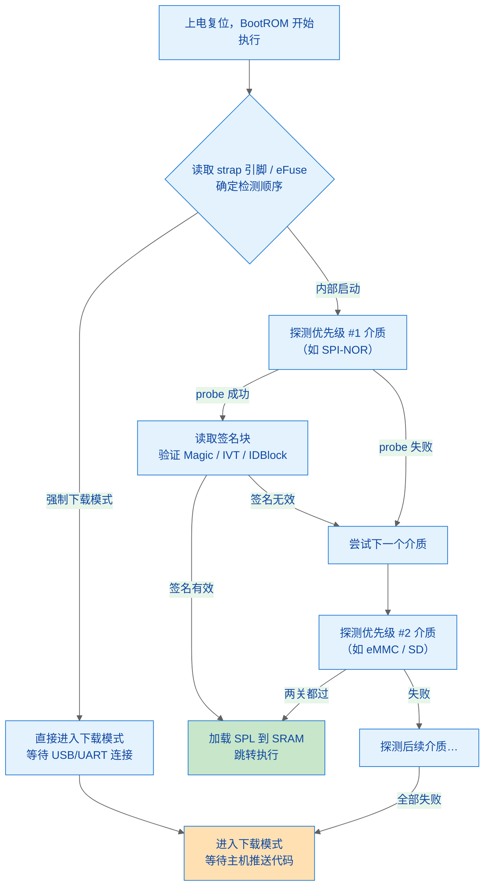
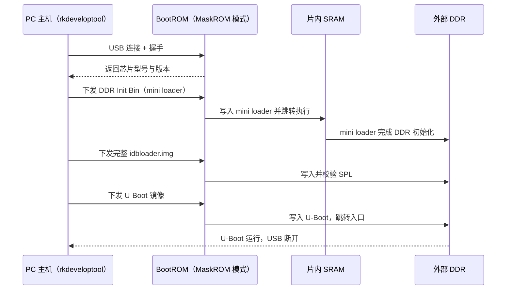

# 7.1.2 启动介质检测顺序

> 所属：第7章 系统启动全链路 > 7.1 上电即执行：复位与BootROM
> 
> 难度：[I→E] | 预计阅读时间：30分钟

## <span class="blue"> 本节导读

上一节末尾，JTAG 读到 `PC = 0xFFE0_0000`，确认复位路径正常、BootROM 正在执行。接下来 BootROM 要回答的问题是：SPL 在哪块介质上？同一张烧好 idbloader 的 SD 卡，插在这块板子上能启动、换一块板子就被无视；有时烧录明明成功，上电却毫无动静——这些困惑的答案都在 BootROM 的介质检测逻辑里。<BR>
本节覆盖：介质检测的轮询机制与优先级名单、检测顺序的三个决定层级（硅片硬编码 / strap 引脚 / eFuse）、签名验证这道准入门槛、全部检测失败后的下载模式（MaskROM / SDP / FEL）、偶发启动失败的时序根因与逐环排查法。

---

## <span class="blue"> 插了 SD 卡却从 eMMC 启动：BootROM 在按名单点名 [I]

一块 RK3568 板子，SD 卡里烧好了 idbloader，上电后系统却从 eMMC 启动——只有把 eMMC 擦掉，SD 卡才被引导。反复插拔、换卡、重烧镜像都不解决问题，因为这不是故障：BootROM 手里有一份固定的介质名单，上电后按名单顺序逐个点名，eMMC 排在 SD 前面且应答正常，SD 卡根本轮不到。

理解这份名单怎么排、由谁定，是调试一切"启动介质不符合预期"问题的前提。

### 介质检测为什么用轮询

驱动开发习惯了中断：外设就绪后主动通知 CPU。但 BootROM 阶段没有操作系统，没有 GIC 驱动，没有中断向量表——没有任何"被通知"的基础设施。检测介质只能靠最原始的方式：主动向控制器发命令，然后在限定时间内死等回复，超时没回复就当这块介质不存在，接着问下一家。这种"逐个点名、超时就跳过"的机制就是轮询探测，7.1.1 讲过它是 BootROM 在 32KB 空间约束下的必然选择，本节看它的直接后果：**探测是有时间窗口的，窗口内不应答的介质会被永久跳过**——后文产线上 3% 的偶发失败，根因就在这里。

BootROM 点名的依据是介质优先级名单：一份固化在硅片里的顺序表。整个检测流程抽象出来非常朴素：

```c
/* BootROM 介质检测主循环 — 各厂商共性抽象 */
for (i = 0; i < BOOT_DEV_MAX; i++) {
    dev = boot_priority_list[i];          /* 名单：硅片硬编码的顺序 */
    if (dev->probe() != SUCCESS)          /* 点名：介质存在吗？ */
        continue;                         /* 不应答 → 下一个 */
    if (dev->verify_signature() != OK)    /* 应答了，但签名合法吗？ */
        continue;                         /* 签名无效 → 下一个 */
    dev->load_spl();                      /* 两关都过 → 加载并跳转 */
    jump_to_spl();
}
enter_download_mode();                    /* 名单问完，无人应答 → 下载模式 */
```

每个介质要连过两关才算被选中：先 probe 证明"我在"，再验签名证明"我身上有合法的 SPL"。任一关失败都直接跳下一个，不重试。

### 各家 SoC 的检测顺序对比

这份名单没有行业标准，每家厂商按自己的目标市场排优先级：

| SoC厂商 | 代表型号 | 检测顺序（高→低优先级） | 可配置性 | 典型场景说明 |
|---------|---------|------------------------|---------|------------|
| Rockchip | RK3399, RK3568 | SPI → eMMC → SD → USB | 部分型号支持 SARADC 引脚配置 | RK3568 的 SARADC_IN0 引脚电平可切换 NAND/eMMC/SD/USB 顺序 |
| Rockchip | RK3288, RK3128 | NAND → eMMC → SPI → SD → USB | 不可配置 | 老型号 NAND 优先，面向平板/电视盒子市场 |
| NXP i.MX | i.MX6ULL / RT1170 | 由 BOOT_MODE[1:0] 引脚 + eFuse 决定 | BOOT_MODE 引脚 + eFuse BT_FUSE_SEL | 高度灵活：GPIO 引脚可动态选择启动设备组 |
| Amlogic | S905X3, S922X | SPI-NOR → eMMC → NAND → SD → USB | POC 引脚（NAND_CLE）可切换 | 部分板子通过短接 eMMC 时钟引脚强制跳过 eMMC |
| MediaTek | MT7622 | SPI-NAND → eMMC → SDXC（或反之） | 硬件拨码开关控制 | 路由器场景常用，SW1 开关选择两组顺序 |
| Allwinner | H6, H616 | SPI-NOR → NAND → SD → eMMC → USB | 不可配置 | 全志偏成本敏感，SD 卡优先级高于 eMMC |
| TI Sitara | AM335x（BeagleBone） | 由 SYSBOOT 引脚配置 | 16 个 SYSBOOT 引脚组合 | 最灵活方案，16 根引脚可编码数十种顺序 |


```mermaid
%%{init: {'theme': 'base', 'themeVariables': { 'primaryColor': '#e3f2fd', 'primaryTextColor': '#0d47a1', 'primaryBorderColor': '#1976d2', 'lineColor': '#616161', 'secondaryColor': '#e8f5e9', 'tertiaryColor': '#fff3e0'}}}%%
flowchart TD
    A["上电复位，BootROM 开始执行"] --> B{"读取 strap 引脚 / eFuse<br>确定检测顺序"}
    B -->|强制下载模式| D["直接进入下载模式<br>等待 USB/UART 连接"]
    B -->|内部启动| E["探测优先级 #1 介质<br>（如 SPI-NOR）"]
    E -->|probe 成功| F["读取签名块<br>验证 Magic / IVT / IDBlock"]
    E -->|probe 失败| H["尝试下一个介质"]
    F -->|签名有效| G["加载 SPL 到 SRAM<br>跳转执行"]
    F -->|签名无效| H
    H --> I["探测优先级 #2 介质<br>（如 eMMC / SD）"]
    I -->|两关都过| G
    I -->|失败| K["探测后续介质…"]
    K -->|全部失败| M["进入下载模式<br>等待主机推送代码"]
    D --> M
    style G fill:#c8e6c9
    style M fill:#ffe0b2
```

### 为什么是这个顺序

名单的排布遵循三条工程逻辑：

1. **初始化成本低的靠前**：SPI-NOR/NAND 挂在 SPI 总线上，一条读 ID 命令几毫秒内就能确认介质存在；eMMC/SD 要走 CMD0→CMD1→CMD2→CMD3 的完整枚举流程，耗时高出一个量级。先问便宜的，整体启动更快。
2. **焊接介质比可插拔介质靠前**：SPI-NOR、NAND、eMMC 焊在板上，状态确定；SD 卡、U 盘可插拔，状态不可控。量产设备优先保证启动确定性。
3. **USB/UART 永远垫底**：它们是"救援通道"，留在最后保证所有正常介质都为空时，产线仍能通过 USB 批量烧录。

三条逻辑解释了行业共性，但各家权重不同：全志把 SD 排在 eMMC 前面（开发板生态优先），Rockchip 新型号把 SPI 放最前（启动速度优先）。查自己芯片的确切顺序只有一个权威来源——TRM 的 System Boot 章节。

> ⚠️ **SD 卡"插了不生效"，先怀疑 eMMC 里有旧 loader。** RK3399/RK3568 的顺序是 SPI→eMMC→SD，只要 eMMC 上存在有效 idbloader（哪怕是旧版本），BootROM 永远不会走到 SD。调试时用 `dd if=/dev/zero of=/dev/mmcblk2 bs=1M count=1` 擦除 eMMC 前 1MB，即可强制轮到 SD 卡。

---

## <span class="blue"> 检测顺序由什么决定：硬编码、strap 引脚与 eFuse [I]

名单写死在硅片里，软件改不了——但"软件改不了"不等于"完全不可配"。厂商给硬件留了三个层级的配置口子，灵活性和不可逆性逐级升高。

### 三个层级的配置手段

| 层级 | 机制 | 生效时机 | 可逆性 | 代表 |
|------|------|----------|--------|------|
| **硅片硬编码** | 顺序固化在 Mask ROM 代码里 | 永远 | 不可改 | RK3288、全志 H6 |
| **strap 引脚** | 上电瞬间采样引脚电平，锁存后供 BootROM 读取 | 每次上电 | 改上下拉电阻即可，完全可逆 | i.MX BOOT_MODE、RK3568 SARADC_IN0、AM335x SYSBOOT |
| **eFuse/OTP** | 一次性烧写的配置位 | 每次上电 | **烧断后物理不可逆** | i.MX BT_FUSE_SEL、各家的安全启动使能位 |

strap 引脚的机制 7.1.1 已经讲过：上电瞬间电平被片内逻辑采样锁存，BootROM 读锁存值决定行为。本节只需记住它在检测顺序中的角色——**strap 引脚是名单的"硬件开关"**。i.MX 的 BOOT_MODE[1:0] 最直接：`2'b00` 表示顺序由 eFuse 决定，`2'b01` 强制进串行下载模式，`2'b10` 表示由更多 GPIO 组成的启动设备组决定。AM335x 把这种思路推到极致：16 根 SYSBOOT 引脚能编码出数十种介质排列。

eFuse 作为配置来源需要单独说一句。7.1.1 把 eFuse 列为一种片内存储介质，这里关注它作为"启动配置"的角色：i.MX 的 BT_FUSE_SEL 熔丝烧断后，BootROM 就不再理睬 BOOT_MODE 引脚，转而完全按 eFuse 里烧写的启动配置执行。这是量产设备锁定启动路径的标准做法——引脚可以被攻壳短接，熔丝烧断后没有任何电气手段能恢复。

> 🔴 **烧写 eFuse 启动配置前，先在引脚模式下完整验证启动链。** eFuse 烧错顺序或烧错安全启动位，芯片会按错误配置永久执行，轻则只能从下载模式救回，重则（配错安全启动密钥）整机报废。量产烧录流程里，eFuse 必须是最后一步。

> 💡 排查"进错启动模式"时，第一嫌疑人永远是 strap 引脚。对照原理图检查 BOOT 相关引脚的上下拉电阻，再实测上电瞬间的电平——焊接偏移、电阻贴错、上拉电源时序异常都会让采样值偏离设计值。

---

## <span class="blue"> 介质存在不等于能启动：签名验证这道准入门槛 [I]

用 `dd` 把 idbloader.img 写进 SD 卡，上电，不启动。介质明明在，probe 明明该成功——问题出在第二关：BootROM probe 到介质后不会直接加载数据，而是先在固定位置找**签名块**，确认介质上确实有合法的 SPL，而不是随机数据或烧错位置的镜像。

签名块解决的是一个信任问题：SD 卡第 64 扇区可能是 SPL 头，也可能是上个项目残留的分区表。BootROM 没有文件系统，只能靠"固定偏移 + 魔数"这种裸格式做判断。各家的签名定义互不兼容：

| SoC厂商 | 签名结构 | 关键标识 | 存储位置（介质偏移） | 校验方式 |
|---------|---------|---------|---------------------|---------|
| Rockchip | IDBlock | 明文 `0x55AA_F00F`，RC4 混淆后 `0x3B8C_DCFC` | SD/eMMC：sector 64 起，共 5 个候选位置；SPI：0 偏移 | RC4 解混淆 + CRC |
| NXP i.MX | IVT（Image Vector Table） | header tag `0xD1` | SD/eMMC 固定偏移（0x400/0x1000，由启动配置决定） | HAB 签名验证 |
| Amlogic | FIP 包 | TOC Entry UUID | SD/eMMC：sector 1 | SHA-256 |
| TI AM335x | MLO + GP Header | `0x54414D38`（"TAM8"） | FAT 分区或 raw 偏移 | CRC-CCITT |
| Allwinner | eGON.BT0 | ASCII 字符串 "eGON.BT0" | SD/eMMC：sector 16（8KB 偏移） | 累加和校验 |
| MediaTek | Preloader Header | `0x4D4D4D4D`（"MMMM"） | eMMC boot0 分区 / SPI-NAND 第 0 块 | 奇偶校验 |

以 Rockchip 为例看搜索过程：BootROM 在 SD/eMMC 上依次尝试 sector 64、1088、2112、3136、4160（即 64 + 1024×n，n 取 0~4）五个位置，每个位置读 512 字节、RC4 解混淆、比对魔数，命中为止，五个全落空则判定该介质无有效签名，转向下一个介质。这段逻辑也解释了烧录命令的由来：

```
dd if=idbloader.img of=/dev/sdX seek=64
```

`seek=64` 的单位是块（默认 512 字节），即写入偏移 32KB——恰好命中搜索列表的第一个位置 sector 64。

> ⚠️ **烧录"成功"不等于写到了 BootROM 会看的位置。** `dd` 的 `seek` 单位随 `bs` 变化，`bs=1k seek=32` 与 `bs=512 seek=64` 写的是同一位置，但混用 bs 参数是烧错偏移的头号原因。写完用读卡器直接读回对应偏移核对魔数，是成本最低的验证手段。

签名块内部的完整字段（IDBlock 的 RC4 密钥与布局、IVT 的 entry/dcd 指针等）决定了 SPL 被加载到哪个地址、从哪里跳转，属于加载协议范畴，7.1.3 节逐字段展开。本节只需要建立认知：**签名验证是介质检测的第二关，魔数、位置、格式任一不符，BootROM 静默跳向下一个介质，不会给任何报错。**

### 速查：eFuse 烧录与 Secure Boot 链验证

上面签名块表格里的"校验方式"一列值得多看一眼：CRC 和奇偶校验只能防数据损坏，防不了恶意替换——任何人都能给改过的镜像重算一个 CRC。把这道准入门槛升级成真正的 Secure Boot，靠的是 i.MX 的 HAB 验签那一行：验签所信任的公钥哈希，就烧在 eFuse 里。

- **一句话解释**：eFuse 是一次性可编程熔丝阵列，烧录后物理不可逆，用于存储公钥哈希和启动配置位，构成 Secure Boot 的信任根。
- **为什么重要**：Secure Boot 的安全性完全依赖 eFuse 的不可篡改性；烧错公钥哈希，芯片将拒绝一切未签名固件且无法恢复，等同报废——这就是 7.1.1 强调"量产流程里 eFuse 必须是最后一步"的原因。
- **快速参考**：
  > - eFuse 位宽：通常 256-bit（公钥哈希）+ 若干配置位
  > - 关键配置位：`SECURE_BOOT_EN`、`BT_FUSE_SEL`（烧断后启动配置改由 eFuse 决定，见前文的三个配置层级）
  > - 烧录命令（i.MX 系列，U-Boot 命令行）：`fuse prog 0 0 <hash_value>`
  > - 烧录前读回核对：`fuse sense 0 0`
- **全书螺旋关联**：eFuse/OTP 的介质特性见 7.1.1 的片内存储对比表；信任链与安全启动的体系化设计在第 19 章「安全架构设计」展开，第 29 章「安全全链路」给出端到端落地。

---

## <span class="blue"> 所有介质都失败之后：下载模式这条救砖通道 [I]

eMMC 被意外擦除、SPI-NOR 是空片、没插 SD 卡——板上没有任何可启动介质，系统看似变砖。但所有主流 SoC 都留了最后一条活路：名单点完无人应答时，BootROM 自动进入**下载模式**，把 USB 或 UART 变成代码入口，等主机把镜像直接推进来。它解决的问题很朴素：介质全空时，代码从哪来？答案是不依赖任何介质，由主机经线缆喂给芯片。

| SoC厂商 | 下载模式名称 | 触发方式 | 接口 | 协议 / 工具 | 加载目标 |
|---------|------------|---------|------|------------|---------|
| Rockchip | MaskROM 模式 | 全部介质失败自动进入，或按住 RECOVERY 键上电 | USB OTG | Rockusb 协议 / `rkdeveloptool` | DDR 或 SRAM |
| NXP i.MX | Serial Download | BOOT_MODE[1:0] = `2'b01` | USB OTG 或 UART | SDP 协议 / `uuu` | SRAM |
| Amlogic | USB Boot | 自动失败进入，或短接特定测试点 | USB OTG | 自定义协议 / `pyamlboot` | DDR |
| Allwinner | FEL 模式 | 自动失败进入，或 FEL 引脚拉低上电 | USB OTG | FEL 协议 / `sunxi-fel` | SRAM / DDR |
| MediaTek | Preloader Download | 自动失败进入，或按键组合 | USB OTG | MTK BROM 协议 / SP Flash Tool | SRAM |
| TI AM335x | UART/SPI Download | SYSBOOT 引脚配置 | UART0 或 SPI0 | XMODEM / TISDP | SRAM |

### MaskROM 和 Loader 模式别混淆

Rockchip 有两个名字相近、层级完全不同的下载模式，排错时认错会浪费大量时间：

- **MaskROM 模式**：BootROM 层面的下载模式。BootROM 亲自驱动 USB，此时 DDR 未初始化，eMMC/SD 完全没被碰过。只要芯片没物理损坏，这个模式永远可用——它是 7.1.1 说的"BootROM 不可修改"带来的工程红利。
- **Loader 模式**：SPL（idbloader）已经跑起来之后，由 SPL 里的 USB 驱动处理通信。前提是介质上有能跑的 SPL，严格说不算"救砖"，而是正常的烧录/升级通道。

区分方法很简单：MaskROM 模式下主机端 `lsusb` 看到的是 Rockchip 的裸芯片 VID:PID，且必须用 `rkdeveloptool` 通信；Loader 模式对应另一组标识，用 `upgrade_tool`。

MaskROM 的完整交互流程值得细看，因为它暴露了一个容易忽略的事实：**BootROM 自己不初始化 DDR**。32KB 装不下各家 DDR 颗粒的训练代码，于是流程拆成两段——先收一个 mini loader 到 SRAM 由它初始化 DDR，再往 DDR 里送完整镜像：


```mermaid
sequenceDiagram
    participant PC as PC 主机（rkdeveloptool）
    participant BROM as BootROM（MaskROM 模式）
    participant SRAM as 片内 SRAM
    participant DDR as 外部 DDR

    PC->>BROM: USB 连接 + 握手
    BROM-->>PC: 返回芯片型号与版本
    PC->>BROM: 下发 DDR Init Bin（mini loader）
    BROM->>SRAM: 写入 mini loader 并跳转执行
    SRAM->>DDR: mini loader 完成 DDR 初始化
    PC->>BROM: 下发完整 idbloader.img
    BROM->>DDR: 写入并校验 SPL
    PC->>BROM: 下发 U-Boot 镜像
    BROM->>DDR: 写入 U-Boot，跳转入口
    DDR-->>PC: U-Boot 运行，USB 断开
```

### 强制进入下载模式的常用手段

```
# Rockchip：按住 RECOVERY 键上电；或在已启动系统中复位
rkdeveloptool rd

# Allwinner：FEL 引脚拉低上电；FEL 模式下直接推送 SPL
sunxi-fel spl sunxi-spl.bin

# i.MX：BOOT_MODE[1:0] 配置为 01（Serial Download），上电即入

# 通用兜底：擦除启动介质前几个块，逼 BootROM 走完全部名单
dd if=/dev/zero of=/dev/mmcblk2 bs=512 count=64
flash_erase /dev/mtd0 0 4
```

> ⚠️ 擦除介质是倒逼下载模式的兜底手段，执行前确认救砖链路已打通：USB 线、工具、对应介质的镜像三者齐备。产线上曾有人擦掉 eMMC 后才发现板子的 USB OTG 没引出，彻底变砖。

> ⚠️ MaskROM 走 USB Full-Speed，劣质线材会导致大量 CRC 重传，表现为 `rkdeveloptool` 间歇性失败或进度卡住。批量烧录时换线是第一排查动作，主机最好用带独立供电的 USB Hub，避免电压跌落导致枚举失败。

> 🔴 **下载模式对调试是救砖通道，对攻击者也是。** MaskROM / SDP 模式下任何人插上 USB 就能读写内存、提取固件。量产产品应通过 eFuse 关闭或加密下载模式（i.MX 配 SDP_DISABLE，Rockchip 烧安全启动后 MaskROM 功能受限），并在结构设计上封死测试点。

---

## <span class="blue"> 排错实战：SD 卡偶发不启动，先判断卡在哪一环 [I→E]

### 现象：3% 的板子从 eMMC 起了旧系统

某 RK3568 工业网关产线反馈：约 3% 的板子插着 SD 卡却从 eMMC 启动了旧版本系统，重新插拔后恢复正常。产线初步结论是"SD 卡座接触不良"。

### 根因：探测窗口与 SD 卡上电自检的时序竞争

接触不良无法解释"重新插拔就好"。示波器抓上电时序后真相浮现——这是一场时序竞争：

```
时间轴 ──────────────────────────────────────────>

主电源上电:   [PSU Ramp-Up]━━━━━━━━━━━━━━━━━━━━━>
eMMC 就绪:             [eMMC Ready]━━━━━━━>
SD 卡供电:      [SD VCC（LDO延迟约20ms）]━━━━>
SD 卡内部自检:          [SD Internal Init]━━━━━━━━━>
BROM 探测 eMMC:                [probe eMMC]━━> ✓ 成功
BROM 探测 SD:                                [probe SD]━━> ✗ 超时

结果：SD 卡自检未完成，不响应 CMD0，BROM 超时后跳过 SD，
      继续用 eMMC 启动
```

RK3568 的 BootROM 在 ID-mode 阶段用 375kHz 低速时钟发 CMD0，超时阈值约 100ms。SD 卡内部控制器上电后要完成自检才应答命令，耗时 10~100ms——工业级宽温卡偏慢。问题板子的 SD 卡供电由 LDO 提供，LDO 使能信号又来自一颗延迟约 20ms 的 GPIO。两个延迟叠加，刚好越过 BootROM 的容忍窗口。重新插拔时板子已上电、LDO 已稳定，所以"一插就好"。

这正应了本节开头的机制：**轮询探测的本质是限时点名，窗口内不应答即永久跳过**。"接触不良"是持续故障，"时序竞争"是概率故障——3% 这个比例本身就是线索。

### 四种解决方案对比

| 方案 | 改动点 | 验证结果 | 代价 |
|-----|--------|---------|------|
| A：SD 供电改常开 | LDO 改为 Always-On，或由 PMIC 同步使能 | 完全解决 | 待机功耗增加约 5mA |
| B：擦除 eMMC 前 1MB | 产线 SOP 增加擦除步骤 | 完全解决 | 失去 eMMC 兜底启动能力 |
| C：SARADC 改启动顺序 | RK3568 配置为 SD 优先于 eMMC | 大部分改善 | 需改板，且 SD 自检慢的卡仍会超时 |
| D：延长 BootROM 超时 | 不可行——BootROM 是 ROM，改不了 | — | — |

最终采用方案 A：工业场景 SD 卡是主存储介质，5mA 待机功耗可以接受。方案 D 列在这里是为了强化一个认知：**BootROM 的行为参数不在软件的可及范围内，遇到问题只能绕着它设计硬件和流程。**

### 通用定位法：沿检测链逐环排查

这个案例的排查手法可以推广成一条固定路径。"启动介质不符合预期"时，按检测链从上游往下游逐环定位：

1. **名单对不对**：测 strap 引脚上电电平，对照原理图上下拉电阻——决定 BootROM 按什么顺序点名。引脚全拉低的板子会直接进下载模式，表现为完全无输出。
2. **介质在不在**：probe 阶段失败，JTAG 下可见 PC 在 ROM 某段地址区间循环；无 JTAG 时用示波器看总线上有没有 CMD 活动，能区分"没发命令"（控制器侧问题）和"发了没应答"（介质侧问题）。
3. **签名认不认**：读卡器读回介质对应偏移，核对魔数与烧录位置。这一环失败 BootROM 静默跳过，无任何报错。
4. **是否已进下载模式**：USB 枚举出芯片的下载模式 VID:PID，说明名单已点完——这不是坏消息，反而证明芯片活着，救砖通道可用。

四环各有独立的观测手段，互不依赖，任一环定位到问题即可停手。

---

## <span class="blue"> 本节总结

| 要点 | 内容 |
|------|------|
| **检测机制** | 限时轮询点名：probe 应答 + 签名验证两关，任一失败永久跳过 |
| **优先级名单** | 各家顺序不同，无行业标准；权威来源是 TRM 的 System Boot 章节 |
| **顺序的决定层级** | 硅片硬编码（不可改）→ strap 引脚（每次上电采样，可逆）→ eFuse（一次烧写，不可逆） |
| **签名验证** | 固定偏移 + 魔数；Rockchip 在 SD/eMMC 搜 sector 64 起 5 个候选位置，烧录偏移错=静默跳过 |
| **下载模式** | 全部介质失败后的救砖通道；MaskROM 属 BootROM 层（永远可用），Loader 模式属 SPL 层 |
| **量产安全** | 下载模式须用 eFuse 关闭或加密，eFuse 烧写必须是产线最后一步 |
| **偶发失败根因** | 探测窗口与介质上电自检的时序竞争；概率性故障先怀疑时序而非接触 |
| **排查路径** | strap 电平 → 总线 CMD 活动 → 介质偏移魔数 → 下载模式 VID:PID，逐环定位 |

> 💡 BootROM 是整条启动链里唯一改不了的环节。理解它的检测顺序和容忍窗口，不是为了改它，而是为了知道硬件设计和烧录流程该在哪里向它靠拢。

---

## <span class="blue"> 延伸阅读

- Rockchip RK3568 TRM，Chapter 3 "System Boot"：检测顺序、SARADC 配置与 MaskROM 协议
- NXP i.MX 6ULL Reference Manual，Chapter 8 "System Boot"：BOOT_MODE、eFuse 映射与 SDP 协议
- U-Boot 源码 `tools/rkcommon.c`：IDBlock 生成与 RC4 密钥的 PC 端实现
- `rkdeveloptool` 开源实现：Rockusb 协议细节
- NXP Universal Update Utility（uuu）：SDP 协议的官方工具链
