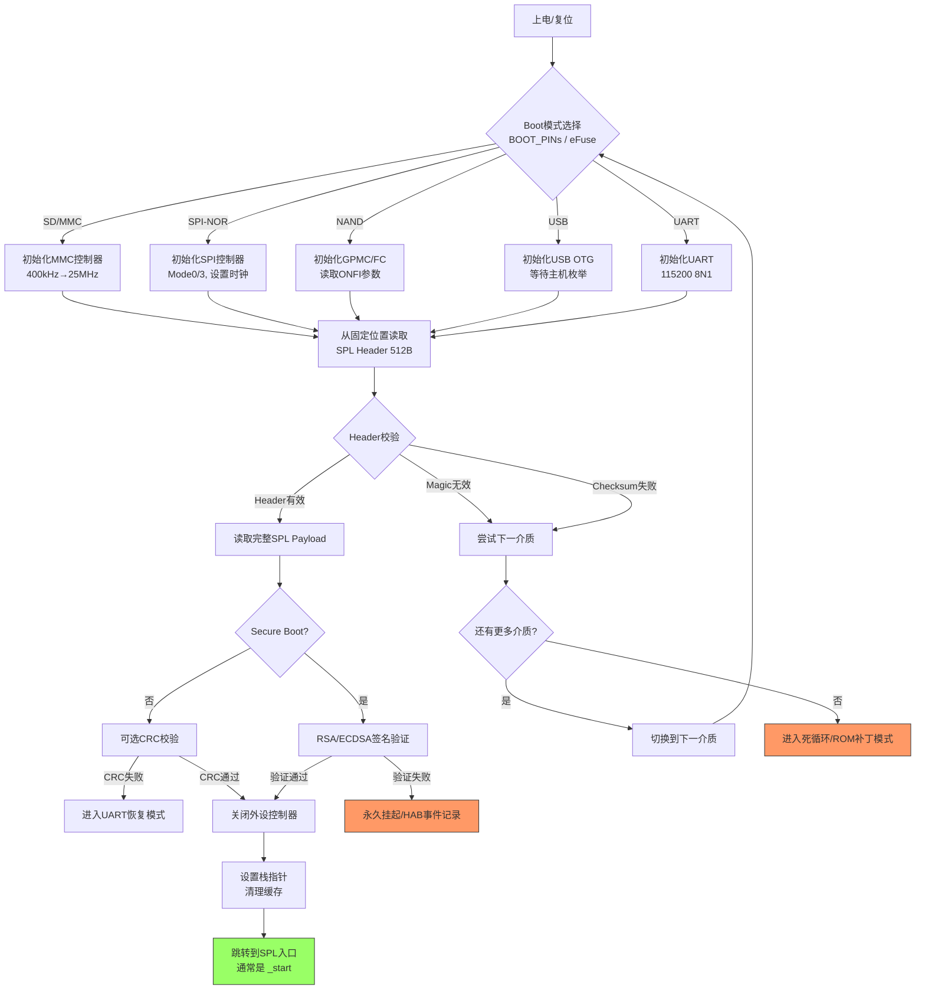

# 7.1.3 BootROM加载SPL的协议

> 所属：第7章 启动流程与Bootloader > 7.1 BootROM与第一阶段加载
> 难度：[I→E] | 预计阅读时间：25分钟

## 本节导读

为什么SPL必须放在SD卡第64扇区？为什么BootROM不直接从文件系统读取SPL？不同存储介质的加载协议差异如何影响硬件选型？本节深入BootROM加载SPL的底层协议，揭示介质控制器初始化、块读取、地址映射、校验验证的完整链条，帮你建立启动失败的系统化排查思路。

---

## 知识点1：介质特定的加载协议 [E] ~1200字

### 问题场景

你正在调试一块基于TI AM335x的定制板。板载eMMC损坏后，改从SD卡启动，但串口无任何输出。用示波器抓SPI_CLK发现：SD卡初始化阶段有波形，随后归于沉寂。BootROM到底在按什么规则读取SPL？为什么同样的SD卡在AM335x EVM上能启动，在你的板子上却失败？

理解BootROM加载协议，是启动问题排查的根基。

### 机制深入：BootROM的介质探测逻辑

BootROM的加载遵循**固定优先级**的介质探测链。以AM335x为例，顺序为：

```
SPI-NOR → NAND → MMC0(SD/eMMC) → USB0 → UART0
```

探测到有效SPL后即刻跳转，后续介质被忽略。探测逻辑通过以下步骤实现：

1. **控制器初始化**：配置对应介质的时钟、引脚复用（MUX）、总线宽度
2. **读取SPL Header**：从固定位置读取特定长度的头部数据
3. **校验有效性**：检查Magic Number、版本号、校验和
4. **加载完整SPL**：按Header指示的大小和地址加载剩余数据
5. **跳转执行**：关闭控制器，跳转到SPL的入口地址

### 各介质加载协议对比

| 介质类型 | 读取粒度 | SPL固定位置 | 控制器初始化要点 | 典型失败场景 |
|---------|---------|-----------|---------------|-----------|
| SD/MMC | 512B Block | 第64扇区（偏移0x8000） | 时钟0→400kHz→25MHz，CMD0/8/55/41/2/3/7 | 卡检测引脚极性反；CMD线无上拉 |
| eMMC | 512B Block | Boot Partition或User Area第64扇区 | 需切换BOOT_PARTITION_ENABLE | BOOT_ACK超时；PARTITION_CONFIG未烧写 |
| SPI-NOR | 按地址直接读取 | 偏移0x0或0x10000（厂商相关） | 设置SPI时钟模式（Mode 0/3），读取JEDEC ID | 时钟过快（>芯片fR）；CS极性错误 |
| NAND | Page (2K/4K) | 第0/1/2 Block（跳过坏块） | 读取ONFI参数，设置ECC模式 | 坏块表损坏；ECC模式不匹配 |
| USB | Bulk Transfer | 通过Device Descriptor识别 | 枚举为USB Mass Storage或RNDIS | USB PHY供电不足；时序不满足TUSB标准 |
| UART | XMODEM/1K | 无固定位置，接收即启动 | 波特率115200，8N1 | 波特率偏差>2.5%；握手信号未连接 |

### 关键代码路径：AM335x ROM对SD卡的读取逻辑

```c
/* arch/arm/mach-omap2/romcode.h - 基于AM335x TRM逆向逻辑 */

/* ROM 内部的 MMC 加载入口，位于 ROM 0x0002_xxxx 区域 */
static int rom_mmc_load_spl(void *rom_handle)
{
    struct mmc_card *card = rom_handle;
    u32 spl_dest = SYSRAM_SPL_START;    /* 通常为 0x402F0400 */
    int err;

    /*
     * Step 1: 发送 CMD17 (READ_SINGLE_BLOCK) 读取第64扇区
     * ROM 内部使用轮询（polling）方式，无DMA，因为MMU未初始化
     */
    err = rom_mmc_send_cmd17(card, 64 /* block */, spl_dest, 512);
    if (err)
        return ERR_SPL_HEADER;

    /*
     * Step 2: 解析 gp_header 结构体，确认 Magic 和长度
     * 有效 Header 以 0xEFBEADDE (little-endian: 0xDEADBEEF) 开头
     */
    struct gp_header *hdr = (struct gp_header *)spl_dest;
    if (hdr->magic != ROM_GPH_MAGIC)
        return ERR_INVALID_MAGIC;

    /*
     * Step 3: 根据 Header.Size 读取剩余 SPL 内容
     * ROM 使用连续的 CMD17/CMD18 读取，不涉及文件系统
     */
    u32 spl_size = hdr->size;           /* 通常为 0x1E000 ~ 122KB */
    u32 blocks_to_read = DIV_ROUND_UP(spl_size, 512);

    err = rom_mmc_send_cmd18(card, 65 /* start block */, 
                             spl_dest + 512, blocks_to_read);
    if (err)
        return ERR_SPL_PAYLOAD;

    /* Step 4: 关闭 MMC 控制器时钟，准备跳转 */
    rom_mmc_clock_disable(card);

    return SUCCESS;    /* 后续由 ROM 的公共代码完成跳转 */
}
```

### 为何BootROM不通过文件系统读取？

这是启动架构的核心设计约束：

1. **复杂性**：文件系统（FAT/ext4）解析需要大量代码，ROM空间通常只有32-128KB
2. **多样性**：不同用户使用的文件系统不同，ROM无法预判
3. **可靠性**：文件系统损坏概率远高于裸块读取，启动路径要求极简
4. **速度**：块读取直接、可预测，无目录遍历开销

💡 **技巧**：U-Boot的`tools/mxsboot`、`tools/mkimage`等工具生成的SPL镜像，本质就是按ROM期望的格式（Header + Payload + Padding）拼接的二进制。

### Trade-off表格：块读取 vs 文件系统引导

| 维度 | 块读取（BootROM方式） | 文件系统引导（如GRUB方式） |
|------|-------------------|------------------------|
| ROM代码量 | < 8KB/介质 | > 100KB（需完整FS驱动） |
| 部署灵活性 | SPL位置固定，需专用烧写工具 | 可随意拷贝到文件系统 |
| 升级便利性 | 需整盘重写或使用专用分区 | 直接覆盖文件即可 |
| 可靠性 | 高（无元数据依赖） | 中（受FS完整性约束） |
| 启动速度 | 快（直接顺序读取） | 慢（需遍历目录结构） |
| 安全性 | 易做完整性校验（连续数据） | 需额外保护FS元数据 |
| 适用场景 | 嵌入式SoC的BootROM | x86 UEFI/BIOS环境 |

---

## 知识点2：SPL位置与大小限制 [E] ~800字

### 问题场景

你在U-Boot配置中将`CONFIG_SPL_MAX_SIZE`设为0x20000（128KB），但烧录后板子无法启动，串口打印`### ERROR ### Please RESET the board ###`。查阅TRM发现ROM的SPL Size字段只有17位。这个限制从何而来？如何精确计算可用空间？

### 机制深入：ROM Header的Size字段解析

BootROM读取SPL前512字节作为Header，从中提取加载参数。以TI的GP Header格式为例：

```
Offset 0x00: Magic Number    (4B)  - 0xEFBEADDE
Offset 0x04: Start Address   (4B)  - SPL加载目的地（SYSRAM地址）
Offset 0x08: Size            (4B)  - SPL总大小，但有效位有限
Offset 0x0C: Reserved        (4B)
Offset 0x10: Header Checksum  (4B)
```

**⚠️ 常见陷阱**：TI AM335x的ROM代码中，Size字段的最高位用于标志XIP（eXecute In Place），实际可用大小位为27位（约128MB），但**SYSRAM物理上限**才是硬约束——AM335x仅有109KB可用SYSRAM（0x402F0400 - 0x4030FFFF减去ROM保留区）。

### 各平台SPL位置与大小速查表

| SoC平台 | SPL位置（SD/MMC） | SPL位置（SPI-NOR） | 最大SPL大小 | 加载目的地 | 限制原因 |
|--------|-----------------|------------------|-----------|-----------|---------|
| TI AM335x | 扇区64 (0x8000) | 偏移0x0 | 109KB | 0x402F0400 | OCM RAM 128KB，ROM占用前区 |
| TI AM62x | 扇区0 (0x0)* | 偏移0x0 | 256KB | 0x70000000 (DDR) | ROM初始化DDR后加载 |
| NXP i.MX6ULL | 扇区2 (0x400) | 偏移0x400 | ~68KB | 0x00907000 | IRAM 128KB，ROM占60KB |
| NXP i.MX8M Mini | 扇区64 (0x8000) | 偏移0x0 | 1.3MB | 0x7E0000 (TCM) | TCM 2.5MB，ROM占余量 |
| Rockchip RK3399 | 扇区64 (0x8000) | 偏移0x0 | 1MB | 0x00040000 (SRAM) | SRAM 1MB，BootROM占高位 |
| Allwinner H6 | 扇区16 (0x2000) | 偏移0x0 | 32KB | 0x20000 (SRAM A1) | SRAM A1仅32KB |
| Microchip SAMA5D27 | 扇区0 (0x0)** | 偏移0x0 | 64KB | 0x200000 (SRAM) | SRAM 128KB，安全区占半 |

> *AM62x支持tiboot3.bin放在扇区0或文件系统根目录  
> **SAMA5D27 SPL位置可通过熔丝配置为扇区0或0x2000

### 代码示例：i.MX6ULL的DCD与SPL大小关系

```c
/* arch/arm/mach-imx/spl.c - i.MX6ULL 的 DCD 处理 */

/* 
 * i.MX6ULL ROM 在加载 SPL 时，会先解析 IVT(Image Vector Table) 中的 DCD 指针。
 * DCD (Device Configuration Data) 用于在 SPL 主体执行前配置 DRAM 控制器。
 * DCD 大小计入 SPL 总大小，且 ROM 限制 DCD 最大 1768 字节。
 */
#define IMX6ULL_DCD_MAX_SIZE    1768
#define IMX6ULL_IRAM_SIZE       (128 * 1024)    /* 128KB IRAM */
#define IMX6ULL_ROM_RESERVED    (60 * 1024)     /* ROM 占用区 */
#define IMX6ULL_SPL_MAX_SIZE    (IMX6ULL_IRAM_SIZE - IMX6ULL_ROM_RESERVED - 0x1000)
                                /* ≈ 64KB 可用 */

/* 
 * U-Boot 构建时的检查：若 SPL 超过此阈值，编译直接失败
 * 这防止了运行时 ROM 截断导致的神秘崩溃
 */
#ifdef CONFIG_SPL_BUILD
    /* spl/u-boot-spl.bin 链接脚本中的断言 */
    ASSERT(__spl_size <= IMX6ULL_SPL_MAX_SIZE, 
           "SPL image exceeds IRAM capacity!")
#endif
```

### 为什么SPL必须这么小？

1. **SRAM/OCM成本**：片上SRAM每KB面积约0.1-0.3mm²（28nm工艺），SoC厂商严格控制
2. **ROM复杂度**：ROM内部不初始化DRAM（或仅做最小初始化），只能依赖已上电即存的SRAM
3. **安全设计**：小攻击面——SPL越小，被篡改的可能性越低
4. **启动速度**：从SPI-NOR读取128KB @ 50MHz约需20ms，可接受

💡 **技巧**：若SPL功能膨胀（如需支持USB升级、复杂显示），可采用**SPL-of-SPL**架构：第一阶段SPL（~32KB）仅初始化DDR，第二阶段TPL/SPL完整版加载到DRAM执行。U-Boot的`CONFIG_SPL_PAYLOAD`机制即为此设计。

---

## 知识点3：校验与安全启动 [E] ~1000字

### 问题场景

产品量产后，客户报告部分设备变砖。调查发现工厂烧录流程中，SPI-NOR编程器偶尔在SPL末尾写入几个错误字节。如何在启动阶段就捕获这类完整性错误？安全启动（Secure Boot）又如何防止恶意SPL注入？

### 机制深入：BootROM的三层校验模型

BootROM对SPL的校验分为三个层次：

```
Layer 1: 结构性校验 ── Magic Number + Header Checksum
Layer 2: 完整性校验 ── CRC32 / SHA-256 / SHA-512
Layer 3: 真实性校验 ── RSA/ECDSA 签名验证（Secure Boot模式）
```

#### Layer 1：结构性校验（所有BootROM均支持）

Header Checksum通常是简单累加和或XOR校验，用于捕获总线瞬态错误。以AM335x为例：

```c
/* Header Checksum 计算 - 基于 AM335x TRM */
static u32 rom_calc_header_checksum(const struct gp_header *hdr)
{
    const u32 *data = (const u32 *)hdr;
    u32 sum = 0;
    int i;

    /* 对 Header 前 7 个字（28字节）做累加，第8个字是Checksum字段本身，跳过 */
    for (i = 0; i < 7; i++)
        sum += data[i];

    return ~sum;    /* 取反后作为 Checksum */
}
```

🔴 **安全提醒**：Header Checksum**不是安全措施**，仅能检测意外数据损坏，无法防止恶意篡改。攻击者可轻易重新计算Checksum。

#### Layer 2：完整性校验（厂商实现不一）

部分SoC（如TI AM62x、NXP i.MX8M）在SPL末尾附加CRC32或哈希值：

| 校验算法 | 数据量 | 校验速度@100MHz | 碰撞概率 | ROM支持度 | 适用场景 |
|---------|-------|---------------|---------|----------|---------|
| Header累加和 | 28B | < 1μs | 高（1/2³²） | 普遍 | 基本完整性 |
| CRC32 | Full SPL | ~1ms/100KB | 中（1/2³²） | TI, NXP部分型号 | 传输错误检测 |
| SHA-256 | Full SPL | ~10ms/100KB | 极低（1/2²⁵⁶） | 新一代SoC | 安全启动前提 |
| SHA-512 | Full SPL | ~20ms/100KB | 可忽略 | 高性能SoC | 高安全场景 |

#### Layer 3：安全启动签名验证

Secure Boot模式下，BootROM使用内置的**Root of Trust Public Key**（烧录在eFuse/OTP中）验证SPL签名：

```
SPL镜像结构（Secure Boot）:
┌─────────────────────┐
│   GP Header (512B)  │
├─────────────────────┤
│   SPL Payload       │
│   (加密/明文)        │
├─────────────────────┤
│   Signature Block   │  ← RSA/ECDSA签名，覆盖Header+Payload哈希
├─────────────────────┤
│   Certificate Chain │  ← 证书链回朔到Root Key（可选）
└─────────────────────┘
```

验证流程（以NXP HABv4为例）：

```c
/* NXP HABv4 验证简化逻辑 - 基于 CSF (Command Sequence File) */
enum hab_status hab_rvt_authenticate_image(
    uint8_t cid,        /* 证书ID */
    ptrdiff_t ivt_offset,
    void **start,       /* 输出：认证通过后的入口地址 */
    size_t *bytes,      /* 输出：认证通过的数据大小 */
    hab_loader_callback_t loader)
{
    /* 
     * 1. 解析 CSF 命令序列，提取签名算法和密钥索引
     * 2. 计算 SPL 载荷的 SHA-256 摘要
     * 3. 用 SRK (Super Root Key) 公钥验证 RSA 签名
     * 4. 若启用 Encrypt，使用 Blob Key 解密 AES-encrypted payload
     */
    
    /* SRK 公钥哈希预先烧录在 eFuse 的 SRK_HASH[255:0] 区域 */
    if (!hab_srk_hash_match(csf->srk_idx, csf->srk_hash))
        return HAB_FAILURE;    /* 公钥不匹配，拒绝启动 */

    /* RSA 签名验证 */
    if (!hab_rsa_verify(digest, signature, srk_pubkey))
        return HAB_FAILURE;    /* 签名无效，拒绝启动 */

    return HAB_SUCCESS;        /* 认证通过，允许跳转 */
}
```

### 实践案例：AM335x Secure Boot工厂部署

某工业网关产品需防止固件被替换。团队采用TI AM335x的Secure Boot流程：

1. **开发阶段**：生成2048-bit RSA密钥对（`openssl genrsa -out ti_mpk.pem 2048`）
2. **签名阶段**：用`tiImageGen`工具对SPL签名，生成.x509证书附加在SPL尾部
3. **烧录阶段**：将公钥SHA-256哈希烧入eFuse的`MPK_HASH[255:0]`字段（一次性，不可逆）
4. **启动阶段**：BootROM用eFuse中的哈希验证证书中的公钥，再用公钥验证SPL签名

⚠️ **常见陷阱**：
- **熔丝烧错不可恢复**——AM335x eFuse只能写0不能写1，务必在量产前验证流程
- **密钥丢失=砖头**——若MPK私钥丢失，已烧录公钥哈希的设备无法再加载任何未签名SPL
- **Debug接口关闭**——启用Secure Boot后，JTAG通常被永久禁用，调试需靠UART日志

🔴 **安全提醒**：永远不要将私钥存放在CI/CD服务器的仓库中。建议使用HSM（硬件安全模块）或云KMS服务进行签名操作，私钥不出硬件。

---

## BootROM加载SPL完整流程图



---

## 本节总结

BootROM加载SPL的协议是嵌入式启动链条的**第一环**，理解其机制对启动问题排查至关重要：

1. **协议层面**：BootROM以裸块方式读取SPL，不涉及文件系统。SD从扇区64、SPI-NOR从偏移0，这些是硬编码的物理地址
2. **约束层面**：SPL大小受限于片上SRAM容量（32KB-256KB典型值），这是成本与架构的双重约束
3. **安全层面**：Secure Boot通过eFuse中的Root Public Key建立信任链，签名验证失败则拒绝启动，但需警惕密钥管理风险

排查启动问题的黄金法则：**先看硬件信号（时钟/数据线），再确认SPL位置/大小，最后检查校验配置**。

---

## 配套资源

### 表格清单

| 表格编号 | 名称 | 位置 |
|---------|------|------|
| 表1 | 各介质加载协议对比 | 知识点1 |
| 表2 | 块读取 vs 文件系统引导 | 知识点1 |
| 表3 | 各平台SPL位置与大小速查 | 知识点2 |
| 表4 | 完整性校验算法对比 | 知识点3 |

### 图示清单

| 图编号 | 名称 | mermaid类型 |
|-------|------|-----------|
| 图1 | BootROM加载SPL完整流程图 | flowchart TD |

### 代码清单

| 代码编号 | 描述 | 伪代码/基于 |
|---------|------|-----------|
| 代码1 | AM335x ROM对SD卡的读取逻辑 | 基于TRM逆向逻辑 |
| 代码2 | i.MX6ULL的DCD与SPL大小关系 | arch/arm/mach-imx/spl.c |
| 代码3 | AM335x Header Checksum计算 | 基于TRM算法 |
| 代码4 | NXP HABv4验证简化逻辑 | HABv4 API规范 |

### 延伸阅读

- TI AM335x TRM, Chapter 26: Initialization
- NXP i.MX 6ULL Reference Manual, Chapter 8: System Boot
- U-Boot Documentation: `doc/README.ti`, `doc/README.mxc`
- NXP Application Note: AN4581 (HABv4 Guide)
