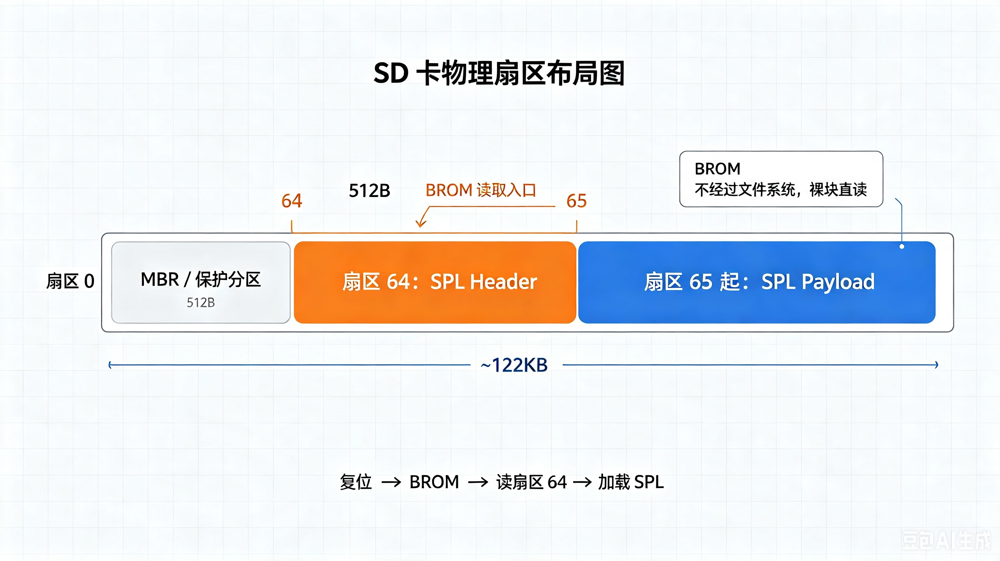
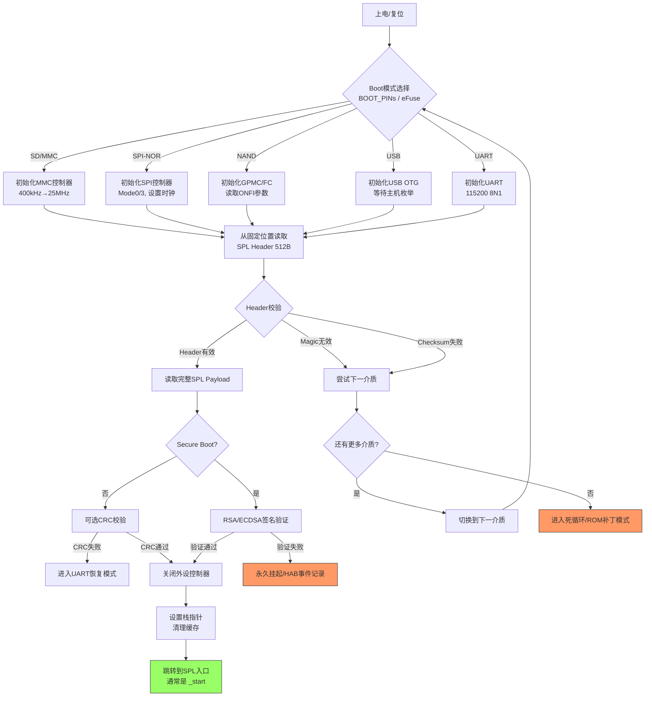

# 7.1.3 BootROM加载SPL的协议

> 所属章节：第7章 启动链深度解析 > 7.1 BootROM
> 
> 难度：[I→E] | 预计阅读时间：25分钟

## <span class="blue"> 本节导读

7.1.2 解决了"BootROM 按什么顺序探测介质、全部失败时怎么进下载模式"。介质找到之后还剩最后一环：BootROM 怎么把 SPL 从介质里读出来。答案是一条厂商固化好的裸块协议——从哪个偏移读、先读多少字节、头部校验什么、主体读多大、放到哪段 SRAM，全部写死在 BootROM 代码里。SPL 镜像必须严格按这套协议烧写，偏移差一个扇区、头部差一个字节，板子就是一块砖。<BR>
本节覆盖：BootROM 为什么绕开文件系统做裸块读取、镜像头格式（magic/长度/校验）与各家协议对照、烧写偏移的计算与 dd 的用法、SPL 大小限制的由来、校验失败后的恢复路径、烧录错误的现象与排查。

---

## <span class="blue"> 为什么不能把 SPL 当文件复制进 SD 卡 [I]

第一次做 SD 卡启动的工程师几乎都会踩同一个坑：把 `u-boot-spl.bin` 拖进 SD 卡的 FAT 分区，插卡上电，串口毫无反应；改用 `dd` 把同一文件写到卡的起始区域，板子立刻就亮了。文件内容一字未动，结果截然相反——差别在于 BootROM 根本看不见文件系统，自然找不到"文件"。

### 裸块读取：没有文件系统时怎么找到代码

BootROM 面对的问题是：上电这一刻没有操作系统、没有任何文件系统驱动，如何从存储介质上定位一段代码。它的做法是把介质当成一个大数组，从固定偏移直接读原始数据，这就是裸块读取（raw block read）——不解析分区表、不认识目录和文件名，只认"第几个块"。

为什么不顺手实现一个 FAT 解析？三个硬约束：

1. **放不下**：FAT 驱动需要解析引导扇区、跟踪 FAT 链、遍历目录项，Linux 内核里 vfat 模块编出来就是几十 KB，而 BootROM 总共只有 32~128KB，还要装下四五种介质控制器的驱动
2. **没法预判**：用户的卡可能格成 FAT、ext4，也可能根本没有分区，ROM 不可能为每种布局都准备一套解析逻辑
3. **不可靠**：文件系统元数据损坏的概率远高于固定偏移处的裸数据，而启动路径是全系统最不能出错的一环

### 扇区与 LBA：不依赖文件系统的统一编址

裸块读取需要一套与文件系统无关的编址方式，这就是扇区（sector）。SD 卡和 eMMC 把存储空间切成固定 512 字节的块，每块一个从 0 开始的编号，即 LBA（Logical Block Address，逻辑块地址）。不管卡上有没有分区、格成什么文件系统，"第 64 扇区"永远指向同一个物理位置。SPI NOR 按字节偏移直接编址，NAND 按页/块编址，思想完全相同：BootROM 的加载协议就建立在这套固定编号上。

各介质的协议参数由此展开：

| 介质类型 | 读取粒度 | SPL固定位置 | 控制器初始化要点 | 典型失败场景 |
|---------|---------|-----------|---------------|-----------|
| SD/MMC | 512B Block | 第64扇区（偏移0x8000） | 时钟0→400kHz→25MHz，CMD0/8/55/41/2/3/7 | 卡检测引脚极性反；CMD线无上拉 |
| eMMC | 512B Block | Boot Partition或User Area第64扇区 | 需切换BOOT_PARTITION_ENABLE | BOOT_ACK超时；PARTITION_CONFIG未烧写 |
| SPI-NOR | 按地址直接读取 | 偏移0x0或0x10000（厂商相关） | 设置SPI时钟模式（Mode 0/3），读取JEDEC ID | 时钟过快（>芯片fR）；CS极性错误 |
| NAND | Page (2K/4K) | 第0/1/2 Block（跳过坏块） | 读取ONFI参数，设置ECC模式 | 坏块表损坏；ECC模式不匹配 |
| USB | Bulk Transfer | 无固定位置，主机推送即启动 | 枚举为厂商私有类设备（Rockusb/SDP/FEL 各自定义） | USB PHY 供电不足；劣质线材导致枚举失败 |
| UART | XMODEM/1K | 无固定位置，接收即启动 | 波特率115200，8N1 | 波特率偏差>2.5%；握手信号未连接 |

裸块与文件系统两条路线的取舍：

| 维度 | 块读取（BootROM方式） | 文件系统引导（如GRUB方式） |
|------|-------------------|------------------------|
| 引导代码量 | < 8KB/介质 | > 100KB（需完整FS驱动） |
| 部署灵活性 | SPL位置固定，需专用烧写工具 | 可随意拷贝到文件系统 |
| 升级便利性 | 需整盘重写或使用专用分区 | 直接覆盖文件即可 |
| 可靠性 | 高（无元数据依赖） | 中（受FS完整性约束） |
| 启动速度 | 快（直接顺序读取） | 慢（需遍历目录结构） |
| 适用场景 | 嵌入式SoC的BootROM | x86 UEFI/BIOS环境 |

> 💡 少数新一代 BootROM 做了折中：TI AM62x 的 ROM 内置了一个极简 FAT 只读解析器，允许 `tiboot3.bin` 放在 FAT 分区根目录。这是例外而非常态——绝大多数 SoC 仍只认固定偏移，具体支持哪种方式以 TRM 的 System Boot 章节为准。

> 💡 U-Boot 的 `tools/mkimage`、`tools/mxsboot` 等工具生成的 SPL 镜像，本质就是按 ROM 期望的格式拼接的二进制：头部 + 主体 + 填充。镜像格式不是 U-Boot 发明的，是照着 BootROM 协议复制的。

---

## <span class="blue"> BootROM 怎么认出 SPL：镜像头里的三件事 [I→E]

固定偏移只解决"去哪读"。第 64 扇区里可能是上次烧录的残留、分区工具的临时数据，甚至纯噪声，BootROM 不能闭着眼跳转。判据是镜像头（image header）：SPL 镜像最前面一段固定格式的结构，BootROM 先读头部（通常 512 字节以内），检查通过才继续读主体。各家叫法不同——TI 叫 GP Header，NXP 叫 IVT（Image Vector Table），Rockchip 叫 IDBlock——但承载的信息都是三件。

### 第一件：magic number，一次比较区分有效镜像和随机数据

BootROM 需要一个成本最低的"这是不是 SPL"判据，magic number 就是答案：一个厂商约定的固定值，写在头部开头，BootROM 做一次整数比较即可得出结论。不匹配就放弃当前介质，转向探测链的下一个。

### 第二件：长度与目的地，告诉 BootROM 再读多少字节、放到哪里

头部本身只有几百字节，主体多大、要再发多少次读命令、加载到哪段 SRAM，由长度和目的地字段给出。以 TI AM335x 的 GP Header 为例——它是业界最简的头部，总共只有 8 字节：

```
Offset 0x00: Size        (4B)  - 镜像总大小（含头部自身）
Offset 0x04: Load Addr   (4B)  - 加载目的地（片内 RAM 地址）
```

GP Header 里连 magic 都没有：AM335x ROM 在 raw 模式下按 TRM 的判据，只要目标扇区前 4 字节不是全 0 或全 FF，就认为这里有镜像。代价是识别能力弱——残留数据可能被误判成镜像，这也是大多数厂商坚持加 magic 的原因。

> ⚠️ 头部里写再大的长度，也绕不开物理上限。AM335x 片内 RAM 共 128KB，ROM 自己占末尾 18KB、起始 1KB 保留，留给 SPL 的只有 109KB（`0x402F0400` 起）。超出这个容量的镜像必然加载失败。

### 第三件：校验和，头部与主体的完整性自检

校验和解决的是"数据在存储和搬运中被改动了怎么办"。最便宜的实现是累加和：把镜像所有 32 位字相加，BootROM 重算一遍比对。全志 eGON.BT0 头的校验实现（逻辑取自 barebox 的 `scripts/egon_mkimage.c`）：

```c
/* eGON.BT0 校验和计算 — 源自 barebox egon_mkimage.c */
#define STAMP_VALUE 0x5f0a6c39      /* 全志约定的校验初值 */

hdr->check_sum = 0;
hdr->length    = cpu_to_le32(img_size);
memcpy(hdr->magic, "eGON.BT0", 8);

/* 校验和 = STAMP_VALUE + 头部与主体全部 32 位字的累加 */
sum = STAMP_VALUE;
for (p32 = (u32 *)hdr, i = 0; i < hdr_size / 4; i++)
    sum += le32_to_cpu(p32[i]);
for (p32 = (u32 *)bin, i = 0; i < bin_size / 4; i++)
    sum += le32_to_cpu(p32[i]);
hdr->check_sum = cpu_to_le32(sum);
```

累加和只能防意外翻转，防不住重算——篡改者改完数据再算一遍校验和即可通过。它是完整性检查，不是安全措施，这一点在后面的三层校验模型里再展开。

### 各家头部格式对照

| SoC | 头部名称 | 识别标志 | 校验方式 | 备注 |
|-----|---------|---------|---------|------|
| TI AM335x | GP Header | 无 magic；首 4 字节非全 0/全 FF 即视为有效 | 无（依赖介质级校验） | 仅 8 字节 {Size, LoadAddr}；raw 模式探测扇区 0/256/512/768 |
| NXP i.MX6/8 | IVT | header tag `0xD1` | HAB 签名（Secure Boot 可选） | 附带 DCD，用于 SPL 执行前初始化 DRAM |
| Rockchip RK 系列 | IDBlock | RC4 混淆的 IDB magic | 解混淆后校验 | 搜索逻辑见 7.1.2 |
| Allwinner 全志 | eGON.BT0 | 明文 ASCII `"eGON.BT0"` | 全镜像累加和（STAMP_VALUE 起算） | SD 卡第 16 扇区，见 7.1.2 |
| TI AM62x | X.509 证书头 | 证书结构合法性 | 证书内哈希 + 可选签名 | ROM 支持 FAT：tiboot3.bin 可放 FAT 分区根目录 |

逐字段看两家的代表结构，会发现字段总是落在"认出镜像、说清读多少、放到哪里"这三件事上：i.MX 的 IVT 关键字段是 `entry`（入口地址）、`self`（IVT 自身地址）、`dcd`（指向 DRAM 初始化表，SPL 代码运行前先按它配好 DRAM 控制器）；Rockchip 的 IDBlock 经 RC4 混淆存储，内含 SPL 加载地址与长度（具体布局可查 U-Boot `tools/rkcommon.c` 的生成逻辑）。

---

## <span class="blue"> 烧写偏移：扇区 64 是怎么来的 [E]

知道了头部格式，剩下的问题是把它写到哪。以 Rockchip 的 SD 卡协议为例，BootROM 硬编码的目标是第 64 扇区，换算成字节偏移：

```
64 × 512 = 32768 = 0x8000
```

为什么不是第 0 扇区？第 0 扇区是 MBR 分区表的地盘，PC 上的分区工具要读写它。厂商把 SPL 偏移选在 MBR 之后、第一个分区之前的空隙里（常规分区从第 2048 扇区开始），SPL 与分区表互不冲突：



### dd 的 seek：按块数跳过输出位置

把镜像写到绝对扇区位置，靠 `dd` 的三个参数配合：

```
dd if=u-boot-spl.bin of=/dev/sdX bs=512 seek=64 conv=notrunc
```

- `bs=512`：块大小设为一个扇区，让后面的计数单位变成"扇区"而非字节
- `seek=64`：在**输出文件**上跳过 64 个块再开始写，即写到第 64 扇区（偏移 0x8000）。注意 seek 的单位是 `bs`，不是字节
- `conv=notrunc`：写完后不截断设备，保住卡上其余数据

### BootROM 一侧的对应动作

烧写端发的是 `dd`，BootROM 端发的是 SD 协议命令，两者在同一偏移会合。以 AM335x 为例看 ROM 一侧的动作——注意它的候选偏移与 Rockchip 完全不同，这正是"换平台先查 TRM"的原因。基于 TRM 第 26 章描述的加载流程抽象：

```c
/* AM335x ROM 的 MMC raw 模式加载流程 — 基于 TRM 描述的抽象 */

/* Step 1: 依次探测扇区 0/256/512/768，寻找有效镜像起始 */
for (sector = 0; sector <= 768; sector += 256) {
    cmd17_read(sector, sram_buf, 512);      /* CMD17 读单块，轮询无 DMA */
    if (first_word(sram_buf) != 0x00000000 &&
        first_word(sram_buf) != 0xFFFFFFFF)
        break;              /* TRM 判据：前 4 字节非全 0/全 FF 即视为有镜像 */
}
if (sector > 768)
    return ERR_NO_IMAGE;    /* 四个候选位置全落空 → 静默尝试下一个介质 */

/* Step 2: 解析镜像起始处的 GP Header（仅 8 字节：大小 + 目的地）*/
struct gp_header *gph = (struct gp_header *)sram_buf;
/* gph->size / gph->load_addr：再读多少字节、放到哪段片内 RAM */

/* Step 3: 按 size 用 CMD17/CMD18 连续读取主体到 load_addr */
cmd18_read_stream(sector, gph->load_addr, gph->size);

/* Step 4: 关闭 MMC 控制器时钟，跳转到 load_addr，永不返回 */
rom_mmc_clock_disable();
jump_to(gph->load_addr);
```

头部与主体在介质上相邻存放，ROM 可以一次连续读完全部内容。偏移是平台相关的：AM335x 探测扇区 0/256/512/768，Rockchip 从第 64 扇区起——上文的 `dd bs=512 seek=64` 是 Rockchip 的写法，烧其他平台前先查 TRM 的 System Boot 章节。

### 各平台位置与大小速查

扇区 64 不是宇宙常量，各家偏移和容量上限差异很大，烧写前以 TRM 为准：

| SoC平台 | SPL位置（SD/MMC） | SPL位置（SPI-NOR） | 最大SPL大小 | 加载目的地 | 限制原因 |
|--------|-----------------|------------------|-----------|-----------|---------|
| TI AM335x | raw：扇区 0/256/512/768 探测；FAT：MLO 文件 | 偏移0x0 | 109KB | 0x402F0400 | 片内 RAM 128KB，ROM 占末尾 18KB + 起始 1KB 保留 |
| TI AM62x | 扇区0 (0x0)* | 偏移0x0 | 256KB | 0x70000000 (DDR) | ROM初始化DDR后加载 |
| NXP i.MX6ULL | 扇区2 (0x400) | 偏移0x400 | ~68KB | 0x00907000 | IRAM 128KB，ROM占60KB |
| NXP i.MX8M Mini | 偏移0x8400（扇区66） | 偏移0x0 | 1.3MB | 0x7E0000 (TCM) | TCM 2.5MB，ROM占余量 |
| Rockchip RK3399 | 扇区64 (0x8000) | 随代际不同*** | 1MB | 0x00040000 (SRAM) | SRAM 1MB，BootROM占高位 |
| Allwinner H6 | 扇区16 (0x2000) | 偏移0x0 | 32KB | 0x20000 (SRAM A1) | SRAM A1仅32KB |
| Microchip SAMA5D27 | 扇区0 (0x0)** | 偏移0x0 | 64KB | 0x200000 (SRAM) | SRAM 128KB，安全区占半 |

> *AM62x支持tiboot3.bin放在扇区0或FAT分区根目录
> **SAMA5D27 SPL位置可通过熔丝配置为扇区0或0x2000
> ***Rockchip 从 RK3568 起，SPI-NOR 与 SD/eMMC 同为 0x8000；更早型号受 ROM 读取粒度限制，需用 rkspi 交织格式烧写，见 U-Boot 的 rksd/rkspi 文档

---

## <span class="blue"> SPL 为什么只能这么小 [E]

表里"最大 SPL 大小"一列普遍在几十 KB 到 1MB 出头，根因只有一个：BootROM 阶段 DDR 还没初始化，SPL 只能落在片内 SRAM 里，SRAM 多大，SPL 上限就是多大。具体是四层约束叠加：

1. **SRAM 成本**：片上 SRAM 每 KB 约占 0.1~0.3mm² 芯片面积（28nm 工艺），SoC 厂商按平方毫米算账，容量卡得很死
2. **ROM 不碰 DRAM**：多数 BootROM 不初始化 DRAM（或只做最小初始化），只能用上电即可用的 SRAM
3. **ROM 自身要占地**：SRAM 里还要扣掉 BootROM 的栈、堆和变量区，可用值 = SRAM 总量 − ROM 保留区
4. **头部附加数据占额度**：i.MX6ULL 的 DCD（Device Configuration Data，SPL 执行前配置 DRAM 控制器的初始化表）计入 SPL 总大小，且 ROM 限制 DCD 最大 1768 字节——128KB IRAM 减去 60KB ROM 保留区和 DCD 余量，实际可用约 64KB

U-Boot 构建系统把这些上限做成了编译期断言，`CONFIG_SPL_MAX_SIZE` 超限时直接编译失败，而不是等到运行时 ROM 截断造成神秘崩溃。

> 💡 SPL 功能装不下时的标准解法是两级加载：第一阶段 SPL（约 32KB）只做 DRAM 初始化，把功能完整的第二阶段加载到 DRAM 执行。U-Boot 的 `CONFIG_SPL_PAYLOAD` 机制和 Rockchip 的 TPL/SPL 拆分都是这个思路。

---

## <span class="blue"> 校验失败之后去哪：三层校验与恢复路径 [E]

头部校验不过，BootROM 不会跳转，也不会报错——大多数 BootROM 完全静默。它按设计好的三层模型处理，失败后走恢复路径。

### 三层校验模型

```
Layer 1: 结构性校验 ── Magic Number + Header Checksum
Layer 2: 完整性校验 ── CRC32 / SHA-256 / SHA-512
Layer 3: 真实性校验 ── RSA/ECDSA 签名验证（Secure Boot模式）
```

Layer 1 是所有 BootROM 的标配，前面已经看过。Layer 2 由厂商选配，在 SPL 末尾附加 CRC32 或哈希值，覆盖整个主体而不只是头部：

| 校验算法 | 数据量 | 校验速度@100MHz | 碰撞概率 | ROM支持度 | 适用场景 |
|---------|-------|---------------|---------|----------|---------|
| Header累加和 | 28B | < 1μs | 高（1/2³²） | 普遍 | 基本完整性 |
| CRC32 | Full SPL | ~1ms/100KB | 中（1/2³²） | TI, NXP部分型号 | 传输错误检测 |
| SHA-256 | Full SPL | ~10ms/100KB | 极低（1/2²⁵⁶） | 新一代SoC | 安全启动前提 |
| SHA-512 | Full SPL | ~20ms/100KB | 可忽略 | 高性能SoC | 高安全场景 |

Layer 3 只在 Secure Boot 模式下启用：BootROM 用烧录在 eFuse/OTP 里的根公钥验证 SPL 签名，镜像结构相应多出一截：

```
SPL镜像结构（Secure Boot）:
┌─────────────────────┐
│   GP Header (512B)  │
├─────────────────────┤
│   SPL Payload       │
│   (加密/明文)        │
├─────────────────────┤
│   Signature Block   │  ← RSA/ECDSA签名，覆盖Header+Payload哈希
├─────────────────────┤
│   Certificate Chain │  ← 证书链回朔到Root Key（可选）
└─────────────────────┘
```

eFuse 使能安全启动的不可逆风险已在 7.1.1 强调过，这里只补一条操作纪律：签名私钥不要进 CI/CD 仓库，用 HSM 或云 KMS 签名，私钥不出硬件。

### 失败后的恢复路径

任何一层校验失败，BootROM 的动作一致：放弃当前介质，沿 7.1.2 讲过的探测链尝试下一个；全部介质失败，进入下载模式等待主机救砖。整条链路：


```mermaid
flowchart TD
    A[上电/复位] --> B{Boot模式选择<br/>BOOT_PINs / eFuse}
    B -->|SD/MMC| C[初始化MMC控制器<br/>400kHz→25MHz]
    B -->|SPI-NOR| D[初始化SPI控制器<br/>Mode0/3, 设置时钟]
    B -->|NAND| E[初始化GPMC/FC<br/>读取ONFI参数]
    B -->|USB| F[初始化USB OTG<br/>等待主机枚举]
    B -->|UART| G[初始化UART<br/>115200 8N1]

    C --> H[从固定位置读取<br/>SPL Header 512B]
    D --> H
    E --> H
    F --> H
    G --> H

    H --> I{Header校验}
    I -->|Magic无效| J[尝试下一介质]
    I -->|Checksum失败| J
    I -->|Header有效| K[读取完整SPL Payload]

    K --> L{Secure Boot?}
    L -->|否| M[可选CRC校验]
    L -->|是| N[RSA/ECDSA签名验证]

    M -->|CRC失败| O[进入UART恢复模式]
    M -->|CRC通过| P[关闭外设控制器]
    N -->|验证失败| Q[永久挂起/HAB事件记录]
    N -->|验证通过| P

    J --> R{还有更多介质?}
    R -->|是| S[切换到下一介质]
    R -->|否| T[进入死循环/ROM补丁模式]
    S --> B

    P --> U[设置栈指针<br/>清理缓存]
    U --> V[跳转到SPL入口<br/>通常是 _start]

    style Q fill:#f96,stroke:#333
    style T fill:#f96,stroke:#333
    style V fill:#9f6,stroke:#333
```

> 🔴 Secure Boot 验证失败与普通校验失败的行为不同：普通失败会沿介质链继续找，签名验证失败在某些平台上（如 NXP HAB）直接挂起并记录安全事件，不再尝试其他介质。排错前先确认板子的 Secure Boot 状态，否则会把签名问题误判成介质问题。

---

## <span class="blue"> 烧错位置时板子是什么反应 [I→E]

回到工程现场。假设 strap 引脚和焊接都没问题（这两类问题 7.1.1 已排查过），剩下的启动失败大概率出在烧录环节。先建立一个分界判据：

**串口有任何输出，说明 BootROM 已经完成使命**，头部校验、加载、跳转全部成功，问题在 SPL 自身或更下游；**串口完全静默**，才轮到怀疑烧录位置和镜像格式——BootROM 校验失败后会静默地尝试下一个介质，最终落入同样静默的下载模式。

静默时的验证手段是绕开板子，直接用读卡器检查介质上的对应偏移：

```
dd if=/dev/sdX bs=512 skip=16 count=2 | hexdump -C   # 全志：eGON.BT0 在第 16 扇区
dd if=/dev/sdX bs=512 skip=64 count=2 | hexdump -C   # Rockchip：IDBlock 在第 64 扇区
```

全志的镜像开头应出现明文 ASCII `eGON.BT0`；Rockchip 的 IDBlock 经 RC4 混淆，hexdump 里看不到明文魔数，判断它要用 `rkdeveloptool` 读回，或对照 U-Boot `tools/rkcommon.c` 的解混淆逻辑；AM335x 没有 magic，前 4 字节非全 0/全 FF 即为"有效"——这也是它可能把残留数据误判成镜像的原因。看到全零、全 FF 或文件系统数据，烧录就有问题。常见烧法错误按出现频率排序：

- **seek 单位搞错**：`seek=64` 在 `bs=512` 下是第 64 扇区；漏写 `bs` 时 dd 默认 `bs=512` 尚可侥幸，但若写成 `bs=4k seek=64`，实际偏移变成 256KB，BootROM 在 0x8000 处读到的就是空气
- **烧给了分区而不是整盘**：`of=/dev/sdX1` 的第 64 扇区是分区内偏移，不等于整盘第 64 扇区
- **镜像没过 mkimage**：直接烧编译出的 `u-boot-spl.bin` 而没用平台工具加头部，magic 校验必然失败
- **大小超限**：SPL 超出 SRAM 容量，ROM 按头部长度读到一半发现放不下，静默放弃

排查启动问题的顺序由此固定下来：先确认 strap 引脚和介质焊接（7.1.1），再核对烧录偏移与头部格式（本节），最后才怀疑校验与签名配置。

---

## <span class="blue"> 本节总结

| 要点 | 内容 |
|------|------|
| **为什么裸块读取** | 文件系统驱动放不下（ROM 仅 32~128KB）、布局无法预判、元数据不可靠 |
| **扇区/LBA** | 与文件系统无关的统一编址，SD/eMMC 每扇区 512B，BootROM 协议建立在固定编号上 |
| **镜像头三件事** | magic（一次比较认镜像，AM335x 除外）、长度与目的地（再读多少、放到哪）、校验和（完整性自检） |
| **各家头部格式** | TI GP Header（仅 8 字节）/ NXP IVT / Rockchip IDBlock（RC4 混淆）/ 全志 eGON.BT0（明文 magic + 累加和） |
| **烧写偏移** | 各家不同：Rockchip 扇区 64 = 0x8000（位于 MBR 之后、首分区之前的空隙，`dd bs=512 seek=64 conv=notrunc`）；AM335x raw 模式探测扇区 0/256/512/768 |
| **SPL 大小上限** | 由片内 SRAM 容量决定（32KB~1MB+），超限时编译期拦截；装不下就拆两级加载 |
| **三层校验** | 结构校验（magic+checksum）→ 完整性（CRC/SHA）→ 真实性（RSA/ECDSA 签名） |
| **失败恢复** | 校验失败静默尝试下一介质，全部失败进下载模式；Secure Boot 验签失败可能直接挂起 |
| **排错分界** | 串口有输出 = BootROM 已成功；完全静默才查烧录偏移与头部格式 |

> 🔴 BootROM 协议是启动链上唯一不可协商的环节：SPL 往后每一级都可以改代码、换配置，唯有"哪个偏移、什么头部、放哪段 SRAM"由芯片厂商写死在 ROM 里。换平台时第一件事就是翻 TRM 的 System Boot 章节，把这三个参数抄下来。

---

## <span class="blue"> 下一步

SPL 被加载进 SRAM 的那一刻，接力棒交到了 7.2：为什么需要 SPL 这个中间人、它在几十 KB 的 SRAM 里怎么排布栈与堆、为什么不能调用 malloc——下一节从这个"内存不够"的约束讲起。

---

## <span class="blue"> 延伸阅读

- TI AM335x TRM, Chapter 26: Initialization
- NXP i.MX 6ULL Reference Manual, Chapter 8: System Boot
- U-Boot Documentation: `doc/README.ti`, `doc/README.mxc`
- NXP Application Note: AN4581 (HABv4 Guide)
