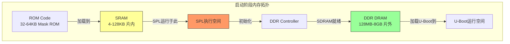
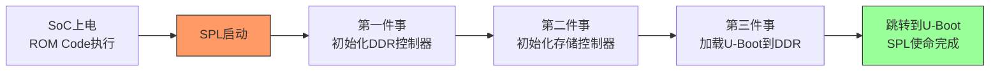

# 7.2.1 SPL的存在理由与内存约束

> 所属：第7章 嵌入式Bootloader深度解析 > 7.2 U-Boot SPL机制
> 难度：[I] | 预计阅读时间：25分钟

## 本节导读

当你将U-Boot编译出来发现`u-boot.bin`已经膨胀到800KB，而目标SoC的片内SRAM只有区区16KB时——完整U-Boot连"落脚"的地方都没有。本节从启动链中最尴尬的这段"夹缝"讲起，解析SPL（Secondary Program Loader）为什么必须存在，它在SRAM中的生存约束是什么，以及工程师如何在几KB的内存牢笼里完成DDR初始化这件"不可能的任务"。

---

## 知识点1：为什么需要SPL [I] ~800字

### 问题场景

你拿到一块新板子，AM335x芯片，按下电源键后的启动流程是这样的：ROM Code → ??? → U-Boot → Kernel。ROM Code是固化在芯片内部的（通常32-64KB），它负责从MMC/SPI-NOR/NAND等介质加载第一级代码。问题是：ROM Code加载的目标地址只能是片内SRAM（OCMC RAM，AM335x上是64KB），而完整U-Boot至少300-500KB，根本放不下。

这个尺寸鸿沟是所有现代SoC启动的**结构性矛盾**：

| 组件 | 典型尺寸 | 存储位置 | 运行时机 |
|------|---------|---------|---------|
| ROM Code | 32-64 KB | 芯片内部Mask ROM | 上电即执行 |
| SRAM (OCMC/TCM) | 4-128 KB | 芯片内部 | 始终可访问 |
| **SPL** | **4-50 KB** | **通常SRAM** | **ROM Code跳转后执行** |
| U-Boot 完整版 | 300-800 KB | DDR / Flash | SPL加载后执行 |
| Linux Kernel | 2-20 MB | DDR | U-Boot加载后执行 |

> 💡 **速查口诀**："SRAM放不下U-Boot，U-Boot搬不动自己——于是有了SPL这个'迷你搬运工'。"

### 机制深入：SPL的极简主义哲学

SPL的核心设计哲学是**"刚好够用，一点不多"**（just barely enough）。它不是U-Boot的"简化版"，而是一个**功能完备性被严格裁剪的独立程序**。关键裁剪手段包括：

1. **只编译一个board文件**：`board.c`中`board_init_f()`被替换为`board_init_r()`的极简版本
2. **不启用命令行**：没有`CMD_*`配置，没有`hush` shell，没有环境变量解析
3. **驱动只保留init功能**：MMC驱动只保留`mmc_init()`，不保留读写API的完整错误处理链
4. **关闭所有调试输出**：`DEBUG`宏不定义，`printf`被替换为条件编译的裸`puts()`

### 关键代码路径：U-Boot编译系统如何决定SPL尺寸

```c
/* arch/arm/mach-omap2/u-boot-spl.lds */
MEMORY {
    /* SPL的链接脚本严格控制内存布局 */
    sram (rwx) : ORIGIN = CONFIG_SPL_TEXT_BASE, LENGTH = CONFIG_SPL_MAX_SIZE
}

SECTIONS {
    .text : {
        *(.vectors)
        arch/arm/cpu/armv7/start.o (.text*)
        *(.text*)
    } > sram

    .rodata : { *(.rodata*) } > sram
    .data : { *(.data*) } > sram

    /* BSS清零由C运行时前的汇编代码完成，无需重定位 */
    __bss_start = .;
    .bss : { *(.bss*) } > sram
    __bss_end = .;
}
```

关键的Kconfig约束项：

```
# common/spl/Kconfig
config SPL_MAX_SIZE
    hex "Maximum size of SPL image"
    default 0x8000 if ARCH_OMAP2PLUS   # 32KB for AM335x
    default 0x10000 if ARCH_ROCKCHIP   # 64KB for RK3288
    default 0x2000 if ARCH_AT91        # 8KB for AT91SAM9X5
    help
      This is the maximum size the SPL binary can occupy.
      The linker script uses this to error out if the image grows beyond
      what the target's SRAM can hold.
```

⚠️ **常见陷阱**：`CONFIG_SPL_MAX_SIZE`必须与**实际的SRAM可用容量**区分。ROM Code通常会占用SRAM的头部区域存放自身数据和堆栈，真正留给SPL的往往比SRAM总容量小20-40%。例如AM335x的64KB SRAM中，ROM Code保留前8KB，SPL实际可用约56KB——但链接器仍以`CONFIG_SPL_MAX_SIZE=0x8000`（32KB）为限，这是一种防御性设计。

### Trade-off：SPL尺寸优化策略

| 优化手段 | 尺寸节省 | 副作用 | 适用场景 |
|---------|---------|-------|---------|
| 移除所有串口输出 | 3-8 KB | 调试困难，黑屏启动 | 量产成熟产品 |
| 关闭CRC32校验 | 1-2 KB | 启动完整性检查缺失 | 内部可控介质（eMMC） |
| 使用 Thumb-2指令集 | 15-20% | 部分旧SoC不支持 | Cortex-A9及以后 |
| 移除通用驱动框架 | 5-10 KB | 驱动不可移植 | 固定硬件平台 |
| 直接操作寄存器（绕过libfdt） | 4-6 KB | 失去设备树灵活性 | 硬件配置固定的产品 |

---

## 知识点2：SRAM vs DRAM —— SPL阶段的内存困境 [I] ~1000字

### 问题场景

假设你正在调试一款新平台，SoC有8KB SRAM，SPL编译出来6.5KB，看起来"刚刚好"。但你加入了一条`printf("DDR init started\n")`，SPL就撑爆SRAM导致启动挂死——为什么？因为在C运行时初始化之前，**SPL根本没有堆（heap）**，全局变量和栈全部分配在SRAM中，一个不留神就溢出。

### 机制深入：启动阶段的三重内存空间



🔴 **安全提醒**：上电后到DDR初始化完成之前，**整个系统只有SRAM可用**。这意味着：
- 没有虚拟内存，没有MMU（或MMU处于BYPASS模式）
- 没有`malloc()`，没有堆管理器
- 栈深度必须人工控制，递归调用是灾难性的
- 全局变量总量 + 代码段 + 只读数据段 < SRAM可用容量

### 关键对比：SRAM vs DRAM 在启动阶段的特性

| 特性 | SRAM（片内） | DRAM（片外DDR） |
|------|------------|----------------|
| **上电可用性** | ✅ 立即可用，无需初始化 | ❌ 需DDR控制器初始化后才能访问 |
| **容量** | 4-128 KB（典型值） | 128 MB - 8 GB |
| **访问延迟** | 1-3个CPU周期 | 10-30个CPU周期（取决于DDR类型） |
| **物理位置** | 芯片内部，与CPU同Die | 外部PCB，需PCB走线匹配 |
| **是否需要控制器** | 不需要 | 需要专用DDR控制器 + PHY |
| **是否需要Training** | 不需要 | 需要（DDR3/DDR4需ZQ校准、Write Leveling等） |
| **掉电保持** | 否 | 否（需自刷新模式保持） |
| **SPL阶段用途** | **唯一可用内存空间** | 初始化目标，初始化完成后加载U-Boot |

### 关键代码路径：SPL中的内存分配策略

SPL中的"内存管理"是**静态分配**的极端形式。以AM335x为例，SRAM的8KB布局如下：

```
/* AM335x 内部SRAM布局（SPL视角） */
0x402F0000 +-------------------+  <- SRAM起始地址 (CONFIG_SPL_TEXT_BASE)
           |  ROM Code保留区     |     4KB（ROM Code自用堆栈和数据）
           |  (不可触碰)         |
0x402F1000 +-------------------+
           |  SPL代码段 (.text)  |     3-4KB
           |  只读数据 (.rodata) |
0x402F2000 +-------------------+
           |  数据段 (.data)     |     512B - 1KB
           |  BSS段 (.bss)       |
0x402F2400 +-------------------+
           |  全局变量/静态缓冲   |     1-2KB
           |  (gd结构体等)       |
0x402F2800 +-------------------+
           |  栈（Stack）        |     1-2KB 向下增长
           |  ↓ 向下增长         |
0x402F3000 +-------------------+  <- SRAM末尾（假设8KB可用）
```

对应的链接脚本约束和栈初始化代码：

```asm
/* arch/arm/cpu/armv7/start.S —— SPL入口汇编 */
    /* 在跳转到C代码之前，必须设置好栈指针 */
    ldr sp, =(CONFIG_SPL_STACK)    /* 通常是SRAM末尾附近，如 0x402F3000 */
    
    /* 清零BSS段 —— 这是C运行时的最低要求 */
    ldr r0, =__bss_start
    ldr r1, =__bss_end
    mov r2, #0
1:  cmp r0, r1
    strcc r2, [r0], #4
    bcc 1b
    
    /* 设置全局数据指针 gd */
    bl  board_init_f_mem            /* 计算gd的内存位置 */
    mov r8, r0                      /* r8 = gd指针，始终保存在r8 */
    
    /* 调用board_init_f —— SPL的C语言入口 */
    bl  board_init_f
```

### 实践案例：8KB SRAM平台的"内存瘦身战"

**背景**：某工业控制平台采用TI AM437x的精简封装版本，因成本考量选用**仅8KB SRAM**的SKU。SPL需要在此约束下完成DDR3初始化并加载U-Boot。

**挑战分析**：
- 编译生成的`spl/u-boot-spl.bin`原始大小：**11.2 KB** —— 溢出3.2KB
- ROM Code保留头部：**1.5 KB**
- 实际可用：**6.5 KB**

**优化过程与效果**：

| 优化步骤 | 操作 | 尺寸变化 | 累计尺寸 |
|---------|------|---------|---------|
| 初始 | 未优化SPL | 11.2 KB | 11.2 KB |
| Step 1 | 关闭所有`CONFIG_SPL_SERIAL_SUPPORT` | -4.1 KB | 7.1 KB |
| Step 2 | 移除`lib/SHA1`哈希库，绕过校验 | -1.8 KB | 5.3 KB |
| Step 3 | 禁用`CONFIG_SPL_OF_CONTROL`（设备树解析） | -2.4 KB | 2.9 KB |
| Step 4 | 改用Thumb-2指令集编译 (`-mthumb`) | -0.6 KB | **2.3 KB** |

最终SPL仅**2.3 KB**，远低于6.5 KB的限制线。但这带来了一系列工程代价：

- **没有串口输出**：启动失败时只能借助JTAG调试，或点亮GPIO LED做"灯语调试"
- **没有设备树**：DDR时序参数以C结构体硬编码，失去设备树的硬件抽象能力
- **没有安全启动校验**：依赖eMMC的写保护做启动完整性保障

> 💡 **技巧**：这种极端优化场景下，建议在SPL入口处添加一个GPIO翻转的"心跳"信号（仅需2-3条汇编指令），用示波器或逻辑分析仪判断SPL是否成功执行到关键路径节点。这是比printf更轻量的调试手段。

⚠️ **常见陷阱**：禁用设备树后，DDR时序参数硬编码在`board/ti/am43xx/board.c`中。当硬件改版更换DDR芯片型号时，工程师忘记同步更新硬编码参数，导致 sporadic 的内存校验失败——这类问题在量产后期极其痛苦，因为DDR Training失败的表现是随机Kernel Panic，而非确定性崩溃。

---

## 知识点3：SPL的功能边界 —— "三件事，不多做" [I] ~700字

### 问题场景

经验不足的新手常常试图在SPL中加入"额外功能"——读个传感器校准数据、初始化一个看门狗、甚至点亮一块小屏幕显示Logo。结果SPL尺寸暴涨，SRAM溢出，启动失败。理解SPL的**严格功能边界**是避免这类问题的关键。

### 机制深入：SPL只做三件事



### SPL功能清单：做什么 vs 不做什么

| 类别 | ✅ 必须做 | ❌ 绝不做 | ⚠️ 谨慎做（取决于平台） |
|------|---------|----------|----------------------|
| **存储** | 初始化MMC/SD/NAND/SPI控制器；从介质读取U-Boot | 文件系统解析（ext4/fat除引导块外） | eMMC的RPMB分区访问 |
| **内存** | 初始化DDR控制器并做Training；设置正确的时序参数 | 内存压力测试；启用MMU/Cache | 初始化SRAM自身的ECC |
| **串口** | 最小化UART输出（可选，调试用） | 交互式命令行；波特率动态调整 | 串口DMA模式 |
| **时钟** | 初始化DDR所需的基础时钟树 | 全功能DVFS（动态调频调压） | CPU频率提升到满速 |
| **PMIC** | 提供DDR所需的电源轨（部分平台） | 完整的电源管理策略 | 看门狗初始化 |
| **安全** | 基础的签名验证（CONFIG_SPL_FIT_SIGNATURE） | 复杂的安全启动链；TPM交互 | 简单的CRC校验 |
| **其他** | 跳转到U-Boot；传递必要的参数（如boot_device） | USB/网络初始化；任何用户交互 | GPIO LED状态指示 |

### 关键代码路径：SPL主循环的执行骨架

```c
/* common/spl/spl.c —— SPL的核心执行流程 */
void board_init_r(gd_t *new_gd, ulong dest_addr)
{
    /* 全局gd指针切换 —— 这是SPL中极关键的步骤 */
    gd = new_gd;
    
    /* 第一件事：初始化存储介质 */
# if defined(CONFIG_SPL_MMC_SUPPORT)
    mmc_initialize(NULL);
    boot_device = spl_boot_device();
    /* 根据BOOT_MODE引脚或ROM Code传递的信息判断启动介质 */
# endif

    /* 第二件事：加载下一阶段镜像 */
    spl_load_image(&boot_device);
    /* 
     * 此函数内部：
     *   - 打开存储设备
     *   - 读取U-Boot镜像头部（通常为FIT格式或 legacy uImage）
     *   - 将U-Boot加载到DDR的指定地址
     *   - 可选：做签名验证或CRC校验
     */

    /* 第三件事：清理并跳转 */
# if defined(CONFIG_CPU_V7A)
    /* ARMv7: 禁用D-cache和MMU，确保U-Boot在干净状态下启动 */
    dcache_disable();
    __asm_invalidate_dcache_all();
# endif
    
    /* 跳转到U-Boot —— SPL的生命到此结束 */
    spl_board_prepare_for_boot();
    jump_to_image_no_args(&spl_image);
    
    /* 理论上说永远不会到达这里 */
    hang();
}
```

### SPL退出时的环境移交

SPL跳转到U-Boot时，**不会清理自身占用的SRAM**，但也不会主动释放——这是一种"有序放弃控制"的移交模型。U-Boot启动后，SPL所在的SRAM区域通常被标记为可用内存或被后续代码覆盖，具体行为由`board_init_f()`阶段的内存布局决定。

🔴 **安全提醒**：某些平台（如Rockchip RK3399）中，SPL运行期间会将部分代码从SRAM**重定位**到DDR的低位地址，以释放SRAM空间给后续的ATF（ARM Trusted Firmware）使用。如果重定位代码有Bug，会导致SPL在执行过程中自我覆灭——这类Bug的调试特征是：串口输出到某个固定时间点就"戛然而止"，没有panic信息，没有任何征兆。

---

## 本节总结

1. **SPL是结构性刚需**：SRAM容量（4-128KB）与U-Boot尺寸（300-800KB）之间的鸿沟不可逾越，SPL是连接ROM Code和完整U-Boot的唯一桥梁。

2. **SRAM是SPL阶段的"整个宇宙"**：上电后到DDR就绪前，系统只有SRAM可用。没有堆、没有虚拟内存、没有文件系统——只有静态分配的代码段、数据段和一个向低地址增长的栈。

3. **"三件事"原则**：SPL只做初始化DDR → 初始化存储 → 加载U-Boot这三件事。任何超出边界的"好心办坏事"都会导致尺寸膨胀和启动失败。

4. **尺寸优化是工程权衡**：每节省1KB都有代价——移除串口失去可见性，移除设备树失去灵活性，移除校验失去安全性。在资源极端受限的平台上，这些权衡需要**硬件、固件、安全三方工程师共同决策**。

---

## 配套资源

### 表格清单

| 表格编号 | 内容 | 用途 |
|---------|------|------|
| 表1 | 启动链各组件尺寸对比 | 快速理解SPL在启动链中的位置 |
| 表2 | SRAM vs DRAM特性对比 | 启动阶段内存选型参考 |
| 表3 | SPL尺寸优化策略Trade-off | 资源受限时的优化决策 |
| 表4 | 8KB平台优化过程实录 | 实践参考 |
| 表5 | SPL功能边界清单（做/不做/谨慎做） | 工程实施检查表 |

### 图示清单


### 代码清单

| 代码编号 | 路径/来源 | 说明 |
|---------|----------|------|
| 代码1 | `arch/arm/mach-omap2/u-boot-spl.lds` | SPL链接脚本，控制内存布局 |
| 代码2 | `common/spl/Kconfig` | `CONFIG_SPL_MAX_SIZE`配置约束 |
| 代码3 | `arch/arm/cpu/armv7/start.S` | 入口汇编：栈设置与BSS清零 |
| 代码4 | `common/spl/spl.c` | SPL主流程：`board_init_r()` |

### 延伸阅读

- 《U-Boot源代码目录结构速查》—— 定位SPL相关代码文件
- 第7.2.2节《SPL的编译系统与镜像生成》—— 深入理解SPL如何被编译和打包
- 第7.2.3节《SPL到U-Boot的移交协议》—— 解析跳转前的环境准备与参数传递
- AM335x TRM (Technical Reference Manual) Chapter 26 "Initialization" —— 官方启动流程时序图
