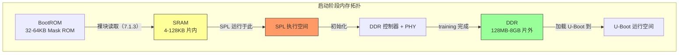
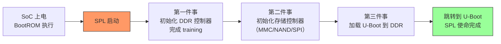

# 7.2.1 SPL的存在理由与内存约束

> 所属章节：第7章 启动链深度解析 > 7.2 SPL
> 
> 难度：[I] | 预计阅读时间：25分钟

## <span class="blue"> 本节导读

7.1.3 的结尾，BootROM 按裸块协议把 SPL 从介质上的固定偏移读进 SRAM、校验通过、跳转完成。这时回头看整个流程会发现一个不合常理的曲折：BootROM 既然能从介质读数据，为什么不一步到位直接加载 U-Boot，非要经过 SPL 这一级中转？答案不在软件设计偏好里，而在一组绕不开的物理数字里——编译出的 `u-boot.bin` 有几百 KB，而 BootROM 能落脚的片内 SRAM 只有几十 KB。<BR>
本节覆盖：SRAM 与 DDR 的本质差异、SPL 存在的结构性理由、SPL 的唯一使命（初始化 DDR）、内存约束如何决定 SPL 的裁剪与内存分配方式、SPL 阶段的排错分界。

---

## <span class="blue"> 为什么 BootROM 不直接加载 U-Boot [I]

第一次构建完整启动链时，很容易产生一个直觉性的方案：让 BootROM 直接把 U-Boot 从 eMMC 读进来执行，省掉 SPL 这一级。这个方案死在第一步——U-Boot 没有地方放。

启动链各环节的尺寸对比，就是这道约束的全部理由：

| 组件 | 典型尺寸 | 存储位置 | 运行时机 |
|------|---------|---------|---------|
| BootROM | 32~64 KB | 片内 Mask ROM | 上电即执行 |
| 片内 SRAM | 4~128 KB | 片内 | 上电即可用 |
| **SPL** | **4~50 KB** | **SRAM** | **BootROM 跳转后执行** |
| U-Boot proper | 300~800 KB | DDR | SPL 加载后执行 |
| Linux 内核 | 2~20 MB | DDR | U-Boot 加载后执行 |

U-Boot proper 比 SRAM 大一个数量级。7.1.3 已经给出过结论：SPL 的大小上限由片内 SRAM 容量决定，BootROM 阶段 DDR 还没初始化，加载目的地只能是 SRAM。同一约束放到 U-Boot 身上，结论就是它永远不可能成为 BootROM 的直接加载目标。

### SRAM 和 DDR 为什么差出三个数量级

这两种内存解决的是同一个问题的两端：SRAM 解决"上电第一刻就要有内存可用"，DDR 解决"系统跑起来之后要有大内存可用"。

SRAM（静态随机存储器）用触发器存数据，上电即稳定，不需要任何初始化，但每个比特要占六个晶体管，芯片面积代价极高——7.1.3 提过，28nm 工艺下每 KB 约 0.1~0.3 mm²，SoC 厂商按平方毫米算账，容量卡得很死。DDR（动态随机存储器）每个比特只要一个晶体管加一个电容，容量可以做到 GB 级，代价是电容会漏电，需要周期刷新，且上电后必须经过一整套控制器初始化和训练流程才能读写。

| 特性 | SRAM（片内） | DDR（片外） |
|------|------------|----------------|
| 上电可用性 | 立即可用，无需初始化 | 需控制器初始化后才能访问 |
| 容量 | 4~128 KB | 128 MB~8 GB |
| 访问延迟 | 1~3 个 CPU 周期 | 10~30 个 CPU 周期 |
| 物理位置 | 与 CPU 同 die | 外部 PCB，走线需等长匹配 |
| 是否需要控制器 | 不需要 | 需要专用 DDR 控制器 + PHY |
| 是否需要 training | 不需要 | 需要（详见下文） |
| 启动阶段角色 | 唯一可用内存 | 初始化目标，就绪后承载 U-Boot 与内核 |

启动链因此被迫拆成两级：BootROM 把能塞进 SRAM 的小程序（SPL）先跑起来，由它把 DDR 初始化好，之后世界才有大内存，U-Boot 和内核才有落脚的余地。**SPL 不是一个可选的优化，是 SRAM 与 DDR 的物理鸿沟逼出来的中间层。**


```mermaid
graph TB
    subgraph "启动阶段内存拓扑"
    A["BootROM<br/>32-64KB Mask ROM"] -->|"裸块读取（7.1.3）"| B["SRAM<br/>4-128KB 片内"]
    B -->|"SPL 运行于此"| C["SPL 执行空间"]
    C -->|"初始化"| D["DDR 控制器 + PHY"]
    D -->|"training 完成"| E["DDR<br/>128MB-8GB 片外"]
    E -->|"加载 U-Boot 到"| F["U-Boot 运行空间"]
    end

    style B fill:#ff9,stroke:#333
    style E fill:#9f9,stroke:#333
    style C fill:#f96,stroke:#333
```

---

## <span class="blue"> SPL 的唯一使命：把 DDR 点亮 [I]

SPL 存在要解决的问题只有一个：DDR 上电不是内存，是一堆需要配置的寄存器和需要校准的信号线，而 BootROM 没能力完成这件事。谁把 DDR 变成可用内存，谁就是启动链的第二级——这个程序就是 SPL。

### DDR 初始化难在哪：training

写驱动时操作一块 SRAM 或 NOR Flash，配置好控制器寄存器就能读写。DDR 不一样，它多出一道 SRAM 完全没有的工序：training（训练）。

DDR 的数据信号以 Gbps 级速率在 PCB 走线上跑，不同走线长度不同、信号到达颗粒的时间有先后，且随温度和电压漂移。training 就是 DDR 控制器上电后与颗粒之间的一轮"对表"：控制器主动发测试 pattern，扫出一组合适的采样延迟和驱动强度参数（DDR3 的 Write Leveling、Read Gate Training、ZQ 校准都属于这一类），扫不到合格参数，DDR 就是一块读出来全是随机数的废铁。7.2.2 排错实战的工业控制器案例会再次遇到它：training 参数写死、没考虑温度漂移，是 SPL 阶段随机崩溃的经典根因。

### 为什么 BootROM 不做这件事

7.1.2 的 MaskROM 下载流程已经暴露过这个事实：BootROM 经 USB 救砖时，要先收一个 mini loader 到 SRAM、由它初始化 DDR，之后才往 DDR 里送镜像。原因就是 7.1.1 讲过的 32KB 物理约束——DDR 初始化代码依赖具体颗粒型号和板级走线，各家各板参数都不同，训练算法加参数表轻松超过 BootROM 的全部预算，且 ROM 出厂固化，不可能预见市场上每一颗 DDR 颗粒。把 DDR 初始化踢给可烧录、可更新的 SPL，是唯一能兼顾"通用芯片"和"千差万别的板子"的分工。

### SPL 只做三件事

使命单一，功能边界就清晰：


```mermaid
graph LR
    A["SoC 上电<br/>BootROM 执行"] --> B["SPL 启动"]
    B --> C["第一件事<br/>初始化 DDR 控制器<br/>完成 training"]
    C --> D["第二件事<br/>初始化存储控制器<br/>（MMC/NAND/SPI）"]
    D --> E["第三件事<br/>加载 U-Boot 到 DDR"]
    E --> F["跳转到 U-Boot<br/>SPL 使命完成"]

    style B fill:#f96,stroke:#333
    style F fill:#9f9,stroke:#333
```

| 类别 | 必须做 | 绝不做 | 谨慎做（取决于平台） |
|------|--------|--------|----------------------|
| 内存 | 初始化 DDR 控制器并完成 training | 内存压力测试；启用 MMU/Cache | SRAM ECC 初始化 |
| 存储 | 初始化 MMC/SD/NAND/SPI 控制器；读 U-Boot | 文件系统解析（引导所需的极简 FAT 除外） | eMMC RPMB 分区访问 |
| 串口 | 最小化 UART 输出（可选，调试用） | 交互式命令行 | 串口 DMA |
| 时钟/电源 | DDR 所需的时钟树与电源轨 | DVFS 动态调频调压 | CPU 提频 |
| 安全 | 基础签名验证（`CONFIG_SPL_FIT_SIGNATURE`） | 复杂信任链；TPM 交互 | CRC 校验 |
| 收尾 | 跳转 U-Boot；传递 boot_device 等参数 | USB/网络初始化；任何用户交互 | GPIO LED 状态指示 |

实践中常见的事故是往 SPL 里塞"顺手"的功能——读个校准数据、初始化看门狗、点亮屏幕显示 Logo——每一个都在消耗以 KB 计的预算。SPL 的设计哲学可以压成一句话：**刚好够用，一点不多**。

### 主流程代码印证这个边界

`common/spl/spl.c` 中 SPL 的收尾函数，三件事清晰可辨：

```c
/* common/spl/spl.c —— SPL 的核心执行流程（简化） */
void board_init_r(gd_t *new_gd, ulong dest_addr)
{
    gd = new_gd;

    /* 第一件事的后续：初始化存储介质，确认启动来源 */
    mmc_initialize(NULL);
    boot_device = spl_boot_device();
    /* 依据 BootROM 传递的信息或 strap 锁存值判断启动介质 */

    /* 第二、三件事：读镜像头部，把 U-Boot 加载到 DDR 指定地址 */
    spl_load_image(&boot_device);

    /* 跳转前清理：关 D-Cache/MMU，给 U-Boot 一个干净的硬件状态 */
    dcache_disable();

    /* 跳转到 U-Boot —— SPL 的生命到此结束 */
    jump_to_image_no_args(&spl_image);
    hang();    /* 永远不会执行到这里 */
}
```

`spl_boot_device()` 的输入正是 7.1.2 讲的 strap 引脚锁存值或 BootROM 留下的介质标记——SPL 不重新探测世界，它接着 BootROM 的结论往下走。

---

## <span class="blue"> 几十 KB 的牢笼：内存约束决定 SPL 的一切设计 [I→E]

知道了 SPL 要做什么，再看它被允许拥有什么。上电后到 DDR 就绪之前，整个系统只有 SRAM 可用：没有 MMU，没有虚拟内存，没有堆管理器。SPL 的每一条设计决策——链接方式、内存分配、功能裁剪——都是在这个牢笼里做出的。

### SRAM 里的家底：一张静态布局图

SPL 的"内存管理"是静态分配的极端形式。以 AM335x 为例，链接脚本和汇编入口在编译期就把每块区域的用途定死了：

```
/* AM335x 片内 SRAM 布局（SPL 视角，边界为示意，以链接脚本为准） */
0x402F0000 +-------------------+  <- OCMC RAM 物理起始
           |  BootROM 保留区    |   起始 1KB：ROM 自用的数据，不可触碰
0x402F0400 +-------------------+  <- CONFIG_SPL_TEXT_BASE，SPL 加载于此
           |  SPL 代码段        |   .text + .rodata
           |  已初始化数据       |   .data
           |  gd 结构体等全局区   |
           |  栈（向下增长）      |
           |        ↓          |
0x4030B800 +-------------------+  <- 可用区末尾（约 109KB，见 7.1.3）
           |  BootROM 保留区    |   末尾约 18KB：ROM 的栈与变量
0x4030FFFF +-------------------+  <- OCMC RAM 物理末尾（共 128KB）
```

两点值得记住：其一，**可用容量要扣掉 BootROM 保留区**——7.1.3 列的"最大 SPL 大小"就是这么算出来的；其二，栈、全局变量、代码在编译期瓜分全部空间，任何一个方向失控都没有运行时保护，直接踩到邻居。

代码里加一条 `printf` 就可能撑爆预算，原因也在这里：`printf` 拖进来的格式化库占的是代码段，栈上多一层调用占的是栈空间，两头都在同一块几 KB 的地里抢。这也解释了为什么 SPL 里用不了 `malloc`——堆管理器本身需要一块已就绪的内存和一套维护元数据的代码，而此时唯一的内存就是这块要精打细算的 SRAM。SPL 用什么代替堆、`board_init_f`/`board_init_r` 为什么分两段，7.2.2 展开。

### 尺寸红线在编译期拦截

U-Boot 把各平台的 SRAM 上限做成了 Kconfig 配置项，链接器超限直接报错，而不是等烧录后被 BootROM 静默截断：

```
# common/spl/Kconfig（v2024.07 节录）
config SPL_MAX_SIZE
    hex "Maximum size of the SPL image, excluding BSS"
    default 0x1b000 if AM33XX && !TI_SECURE_DEVICE  # AM335x：108KB
    default 0x10000 if ARCH_MX6 && !MX6_OCRAM_256KB # i.MX6：64KB
    default 0x27000 if IMX8MM && SPL_TEXT_BASE = 0x7E1000
    default 0x7fa0 if SUNXI_SRAM_ADDRESS = 0x10000  # 全志多数平台：约 32KB
```

注意它卡的是 `.text`/`.rodata`/`.data` 的体积，`.bss` 不计入（7.2.2 的双区域模型会解释为什么 BSS 能豁免）。`CONFIG_SPL_MAX_SIZE` 是防御性红线，取值通常比实际可用 SRAM 再保守一截——红线存在的意义是让尺寸问题暴露在编译机上，而不是暴露在产线上。

### 每一 KB 都有价格：裁剪的代价表

尺寸真的压不下来时，裁剪手段按代价排序：

| 优化手段 | 尺寸节省 | 副作用 | 适用场景 |
|---------|---------|--------|---------|
| 移除串口输出 | 3~8 KB | 调试失明，黑屏启动 | 量产成熟产品 |
| 关闭 CRC32 校验 | 1~2 KB | 失去启动完整性检查 | 内部可控介质（eMMC） |
| 使用 Thumb-2 指令集 | 15%~20% | 部分旧 SoC 不支持 | Cortex-A9 及以后 |
| 移除通用驱动框架 | 5~10 KB | 驱动不可移植 | 固定硬件平台 |
| 寄存器直操作替代 libfdt | 4~6 KB | 失去设备树灵活性 | 硬件配置锁死的产品 |

某工业控制平台的实战记录：选用仅 8KB 可用 SRAM 的 AM437x 精简封装，初始 SPL 11.2 KB，超预算 3.2KB。裁剪路径是关串口（-4.1KB）→ 移除 SHA1 校验库（-1.8KB）→ 禁用设备树解析（-2.4KB）→ Thumb-2 编译（-0.6KB），最终 2.3KB 达标。代价同样明确：没有串口输出，启动失败只能上 JTAG；DDR 时序参数硬编码进 C 结构体，硬件改版换 DDR 颗粒时改漏一处，症状就是量产后期偶发的内存校验失败——training 失败的典型表现不是确定性崩溃，而是随机 Kernel Panic。

> 💡 无串口的 SPL 还有一个更轻的调试手段：入口处加两三条 GPIO 翻转指令，用示波器或逻辑分析仪看"心跳"，即可判断代码执行到了哪个节点。成本是几条汇编，比拖进一整套 printf 便宜三个数量级。

> ⚠️ 尺寸、可见性、安全性构成一个不可能三角：移除串口失去可见性，移除设备树失去灵活性，移除校验失去安全性。资源极端受限的平台上，这张裁剪表不该由固件工程师单独拍板，硬件和安全责任人要在场。

---

## <span class="blue"> 排错分界：串口第一行输出意味着什么 [I→E]

7.1.3 给出过启动排错的第一条分界：串口完全静默，问题在 BootROM 一侧（strap、介质、烧录偏移、头部格式）。本节把分界往后推一格：

**串口出现 `U-Boot SPL` 字样，说明 BootROM 使命已毕、SPL 的 C 代码已经跑起来**。此后挂死，嫌疑范围收缩到 SPL 内部，按发生频率排序：

- **DDR 初始化/training 失败**：打印停在 DDR 初始化附近，或干脆停在第一行输出之后。换已知良好的 DDR 参数、降频验证，是隔离 training 问题的标准手法。
- **SPL 尺寸或栈越界**：运行到某个固定调用深度后 PC 跳飞、无任何输出。核对 `CONFIG_SPL_MAX_SIZE` 与实际可用 SRAM，检查栈指针是否覆盖了代码段。
- **读不到 U-Boot 镜像**：SPL 打印正常但随后 hang 住。此时介质、偏移、镜像格式的嫌疑重新抬头——回到 7.1.3 的烧录核查清单，只是这次检查的是 U-Boot proper 的镜像位置。
- **重定位/跳转失败**：部分平台（如 RK3399）SPL 会在运行中把自身部分代码搬到 DDR 低位，为 ATF 腾 SRAM。重定位有 Bug 时症状极具迷惑性：串口输出在某个固定时间点戛然而止，无 panic、无征兆。

> 🔴 SPL 是整条启动链上调试手段最少的环节：比 BootROM 多一个串口（如果保留了的话），比 U-Boot 少全部命令行。JTAG、GPIO 心跳、降频对照实验，就是这个阶段的全部武器。裁剪 SPL 功能时省下的每一 KB，都在排错时连本带利讨回来。

---

## <span class="blue"> 本节总结

| 要点 | 内容 |
|------|------|
| **SPL 存在的理由** | SRAM（4~128KB）与 U-Boot（300~800KB）的尺寸鸿沟；BootROM 只能加载到 SRAM，U-Boot 永远放不进 |
| **SRAM vs DDR** | SRAM 上电即用但每比特六管、面积贵；DDR 容量大三到四个数量级但必须初始化 + training |
| **training** | DDR 控制器与颗粒上电后的参数校准（Write Leveling / Read Gate / ZQ），参数随板随温度漂移 |
| **BootROM 为何不做 DDR 初始化** | 32KB 装不下颗粒相关代码，且 ROM 固化无法适配板卡差异 |
| **SPL 三件事** | 初始化 DDR → 初始化存储控制器 → 加载并跳转 U-Boot，不多做一件 |
| **内存约束的产物** | 全静态分配、无 malloc、栈/代码/数据编译期瓜分 SRAM；`CONFIG_SPL_MAX_SIZE` 编译期拦截超限 |
| **裁剪代价** | 串口=可见性，设备树=灵活性，校验=安全性；极端裁剪需多方共同决策 |
| **排错分界** | 串口有 `U-Boot SPL` = 进入 SPL 领域；之后按 DDR 初始化 → 尺寸/栈越界 → 镜像读取 → 重定位 顺序排查 |

> 💡 SPL 的全部设计都是"几十 KB SRAM"这一个数字的推论。读 SPL 源码时遇到任何看似别扭的取舍——没有堆、函数指针数组、裁剪到骨头的驱动——先问一句：这个设计在 SRAM 只有 32KB 时还成立吗？答案几乎都是肯定的。

---

## <span class="blue"> 下一步

SRAM 的账算清了，接下来的问题是这块地具体怎么分：`.bss` 为什么被赶进 DDR、没有 malloc 时 gd 和 early malloc 怎么顶上、`board_init_f`/`board_init_r` 为什么拆成两段——7.2.2 把链接脚本和两段式初始化拆开看，排错实战里也有本节预告过的温度漂移案例。

---

## <span class="blue"> 延伸阅读

- U-Boot 文档：`doc/develop/spl.rst`（SPL 框架与配置项总览）
- U-Boot 源码：`common/spl/spl.c`、`common/spl/Kconfig`
- JEDEC DDR3 标准（JESD79-3）：Write Leveling 与 ZQ 校准的规范定义
- TI AM335x TRM，Chapter 26 "Initialization"：SPL 在 OMAP 平台的角色划分
