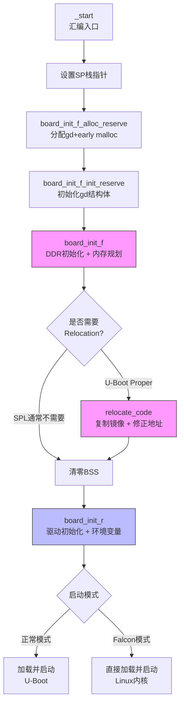

# 7.2.2 SPL的内存布局与board_init_f/r

> 所属：第7章 嵌入式Bootloader深度解析 > 7.2 U-Boot SPL启动流程
> 难度：[E] | 预计阅读时间：35分钟

## 本节导读

SPL（Secondary Program Loader）是U-Boot的精简分身——在数百KB的SRAM中完成DDR初始化、加载主U-Boot并移交控制权。本节深入SPL的内存布局设计、board_init_f的"预初始化"逻辑、relocation的地址修正机制，以及board_init_r如何完成最终的系统跃迁。理解这些机制，是诊断启动挂死、优化启动时延、实现Falcon快速启动的基础。

---

## 知识点1：SPL内存布局 [E] ~800字

### 问题场景

你正在调试一块新板卡：ROM代码已将SPL加载到片上SRAM，但串口毫无输出。通过JTAG发现PC指针正在访问`0x80000000`以上的地址——那是DDR空间，而此时DDR控制器尚未初始化。问题根源很可能是SPL链接脚本中`.bss`段的放置策略错误，或者栈指针`CONFIG_SPL_STACK`越界到了SRAM外部。

### 机制深入：链接脚本定义的双区域模型

SPL链接脚本（典型路径如`arch/arm/cpu/armv8/u-boot-spl.lds`）的核心设计是**双MEMORY区域模型**——将运行时必需段放入SRAM，将非必需段（主要是.bss）推迟到外部DRAM：

```ld
MEMORY { .sram : ORIGIN = CONFIG_SPL_TEXT_BASE,
         LENGTH = CONFIG_SPL_MAX_SIZE }
MEMORY { .sdram : ORIGIN = CONFIG_SPL_BSS_START_ADDR,
         LENGTH = CONFIG_SPL_BSS_MAX_SIZE }

SECTIONS
{
    .text : {
        *(.__image_copy_start)
        CPUDIR/start.o (.text*)
        *(.text*)
    } >.sram

    .rodata : {
        *(SORT_BY_ALIGNMENT(SORT_BY_NAME(.rodata*)))
    } >.sram

    .data : { *(.data*) } >.sram

    .bss_start (NOLOAD) : {
        KEEP(*(.__bss_start));
    } >.sdram

    .bss (NOLOAD) : { *(.bss*) } >.sdram
    .bss_end (NOLOAD) : {
        KEEP(*(.__bss_end));
    } >.sdram
}
```

关键设计决策解读：

| 段（Section） | 放置区域 | 链接时占用镜像大小 | 运行时需求 | 设计意图 |
|-------------|---------|------------------|-----------|---------|
| `.text` | SRAM | 是 | 必须可执行 | 代码在DDR就绪前就要运行 |
| `.rodata` | SRAM | 是 | 只读访问 | 常量字符串、设备树（如果内嵌） |
| `.data` | SRAM | 是 | 读写访问 | 已初始化的全局变量 |
| `.bss` | SDRAM (NOLOAD) | **否** | DDR就绪后读写 | 未初始化变量，链接时不占镜像体积 |
| stack | SRAM顶部 | 否 | 全程使用 | 函数调用、中断嵌套 |

`.bss`段使用`(NOLOAD)`属性的精妙之处在于：它告诉链接器"仅为这段预留地址空间，不要把全零内容塞进二进制镜像"。这直接缩减了SPL的烧录体积——对于一个总SRAM仅128KB的平台，节省几十KB的.bss空间可能是启动成败的分水岭。

### 关键代码路径：`__bss_start` / `__bss_end` 符号引用

BSS清零的代码路径（`arch/arm/lib/crt0.S` 节选）：

```armasm
ENTRY(_main)
    /* ... 栈和gd初始化 ... */

    /* 进入 board_init_f 前，BSS 尚未清零，不能使用未初始化全局变量 */
    bl  board_init_f

    /* board_init_f 返回后，DDR已就绪，现在清零 BSS */
    ldr x0, =__bss_start        /* 已重定位的符号地址 */
    ldr x1, =__bss_end
clear_loop:
    str xzr, [x0], #8
    cmp x0, x1
    b.lo clear_loop
```

### Trade-off 表格：SRAM-only vs 双区域模型

| 方案 | SRAM-only（全放SRAM） | 双区域模型（.bss放DRAM） | 适用场景 |
|------|----------------------|------------------------|---------|
| **镜像体积** | 包含.bss零数据，膨胀大 | .bss以NOLOAD方式不占用镜像 | 双区域模型更优 |
| **启动复杂度** | 无需DDR即可使用全局变量 | 必须等DDR就绪后才能用.bss变量 | SRAM-only更简单 |
| **内存容量需求** | 需要SRAM容纳全部数据 | SRAM仅需容纳.text/.data | 双区域模型节省SRAM |
| **调试友好度** | 高，全程在一个连续空间 | 低，需要理解两个物理区域映射 | 初学者推荐SRAM-only |

### 常见陷阱

⚠️ **陷阱1**：`CONFIG_SPL_BSS_START_ADDR`指向了DDR空间，但DDR初始化失败——所有对.bss的访问都会触发bus fault。调试方法：在`board_init_f`第一行加入LED blink或GPIO toggle确认代码已跑到C世界。

⚠️ **陷阱2**：栈指针`CONFIG_SPL_STACK`设置过高，覆盖了SRAM中已加载的SPL代码。典型症状：运行到某个深度调用后PC指针跳飞。检查：确保`CONFIG_SPL_STACK < (CONFIG_SPL_TEXT_BASE + CONFIG_SPL_MAX_SIZE)`。

---

## 知识点2：board_init_f —— relocation前的"前站"初始化 [E] ~900字

### 问题场景

为什么叫`board_init_f`而不是简单的`board_init`？这个命名背后的设计哲学是什么？为什么`board_init_f`不能使用BSS段中的未初始化全局变量？

### 机制深入：f = front（前段），一切为了Relocation铺路

`board_init_f`是U-Boot启动流程中的**第一阶段C环境初始化**。进入它时，C运行环境是"残缺的"：

- ✅ 有栈（SP已设置）
- ✅ 有`gd`指针（全局数据区已分配）
- ✅ 有early malloc堆（一小块预分配内存）
- ❌ **BSS尚未清零**（未初始化全局变量全是 garbage）
- ❌ **DDR尚未就绪**（平台相关，通常在`board_init_f`中完成）

在`crt0_64.S`中，进入`board_init_f`之前有三步关键的"环境搭建"操作：

```armasm
/* 步骤1：设置初始栈指针 */
ldr x0, =(CONFIG_SPL_STACK)     /* 或 CONFIG_SYS_INIT_SP_ADDR */
bic sp, x0, #0xf                /* 16字节ABI对齐 */

/* 步骤2：为gd结构体分配空间（从栈顶向下生长） */
mov x0, sp
bl  board_init_f_alloc_reserve  /* 返回gd的基地址 */
mov sp, x0                      /* 栈顶下调 */
mov x18, x0                     /* x18 = gd指针（ARM64）*/

/* 步骤3：初始化gd结构体，设置early malloc */
bl  board_init_f_init_reserve
```

`board_init_f_alloc_reserve`的内存分配逻辑（`common/init/board_init.c`）：

```c
ulong board_init_f_alloc_reserve(ulong top)
{
    /* 自顶向下：先留early malloc堆空间 */
    top -= CONFIG_SYS_MALLOC_F_LEN;           /* 通常 0x2000 ~ 0x4000 */
    /* 再留global_data结构体空间，16字节对齐 */
    top = rounddown(top - sizeof(gd_t), 16);
    return top;    /* 返回gd的基地址 */
}

void board_init_f_init_reserve(ulong base)
{
    gd_t *gd_ptr = (gd_t *)base;
    memset(gd_ptr, '\0', sizeof(gd_t));       /* 清零gd */
    base += roundup(sizeof(gd_t), 16);
    gd_ptr->malloc_base = base;               /* early malloc起始 */
    gd_ptr->malloc_limit = CONFIG_SYS_MALLOC_F_LEN;
}
```

这段代码的精妙之处在于：**gd和early malloc堆共享一块从栈顶"挖"出来的内存区域**，在relocation之前，这块临时内存是C代码唯一的动态分配来源。

### 关键代码路径：`init_sequence_f[]` 函数指针数组

`board_init_f`的核心是一个按序执行的函数指针数组（`common/board_f.c`）：

```c
static const init_fnc_t init_sequence_f[] = {
    setup_mon_len,           /* 计算U-Boot镜像总长度 */
    fdtdec_setup,            /* 解析设备树（如果有内嵌）*/
    initf_malloc,            /* 初始化early malloc */
    log_init,
    arch_cpu_init,           /* SoC级CPU初始化 */
    mach_cpu_init,           /* 机器级CPU初始化 */
    get_clocks,              /* 获取系统时钟 */
    dram_init,               /* 【关键】DDR控制器初始化 */
    setup_dest_addr,         /* 设置重定位目标地址 */
    reserve_pram,
    reserve_uboot,           /* 预留U-Boot运行空间 */
    reserve_malloc,          /* 预留malloc空间 */
    reserve_global_data,     /* 预留新的gd空间 */
    reserve_stacks,          /* 预留最终栈空间 */
    setup_reloc,             /* 计算relocation偏移 */
    NULL,
};
```

`dram_init`是其中的分水岭——在此之前，全局变量不可用（BSS未清零），内存分配受限于early malloc的数KB空间；在此之后，DDR容量已知，`setup_dest_addr`和后续的`reserve_*`系列函数才开始规划U-Boot最终运行的内存蓝图。

### 实践案例：调试i.MX8M板卡启动挂死

某i.MX8M EVK板卡在移植新DDR参数后，SPL启动后串口输出"DRAM:"后挂死。排查过程：

1. 用JTAG确认挂死在`dram_init()` → `ddr_init()`内的PHY training阶段
2. 对比原厂参数发现`ddrphy_cfg[]`数组中某时序参数被放在了.bss段（因定义为`static`但未初始化）
3. 而i.MX8M的SPL链接脚本中.bss指向了DDR空间——此时DDR尚未就绪，访问.bss就是访问未初始化的内存
4. **修复**：将`static`改为`const`使数据进入.rodata段，或显式初始化为非零值使其进入.data段

💡 **技巧**：在`board_init_f`阶段的代码中，**永远假设.bss不可用**。需要跨函数传递的状态，一律使用`gd`结构体的成员（如`gd->ram_size`、`gd->relocaddr`）。

---

## 知识点3：Relocation —— 从加载地址到链接地址的跃迁 [E] ~800字

### 问题场景

ROM代码把SPL加载到`0x402F0400`（如AM335x的SRAM地址），但链接脚本的`CONFIG_SPL_TEXT_BASE`也定义为`0x402F0400`——此时加载地址等于链接地址，为什么U-Boot主程序还需要relocation？如果主U-Boot被加载到DDR的`0x87800000`，而链接地址是`0x00000000`（PIE编译），这中间发生了什么？

### 机制深入：为什么需要Relocation

Relocation的根本原因有二：

1. **位置无关执行（PIE）的局限**：虽然U-Boot以`-fPIE -pie`编译，代码中的内部引用可以位置无关，但**绝对地址引用**（如全局指针变量的值、函数指针表、设备树blob地址）在链接时被写死为链接地址值
2. **加载地址的不确定性**：U-Boot proper可能被加载到DDR的不同位置（由SPL根据运行时内存布局决定），而链接时的`CONFIG_SYS_TEXT_BASE`只是一个预设默认值

Relocation的本质：**将代码从当前加载地址复制到"真正的"运行地址，然后修正所有绝对地址引用**。

### 关键代码路径：Relocation执行流程

`relocate_code`（`arch/arm/lib/relocate.S` 简化逻辑）：

```armasm
ENTRY(relocate_code)
    /* x0 = gd->relocaddr (目标地址) */
    /* x9 = gd->reloc_off (偏移量 = 目标地址 - 链接地址) */

    /* 步骤1：计算镜像长度 */
    ldr x1, =__image_copy_start     /* 链接时的起始地址 */
    ldr x2, =__image_copy_end
    sub x2, x2, x1                  /* x2 = 镜像长度 */

    /* 步骤2：复制代码到目标地址 */
copy_loop:
    ldr x3, [x1], #8
    str x3, [x0], #8
    subs x2, x2, #8
    b.hi copy_loop

    /* 步骤3：修正.rela.dyn重定位表 */
    ldr x1, =__rela_start
    ldr x2, =__rela_end
    add x1, x1, x9                  /* 重定位表地址 + offset */
    add x2, x2, x9
rela_loop:
    /* 遍历ELF RELA条目，修正符号地址 */
    ...
    b   rela_loop
ENDPROC(relocate_code)
```

对于ARM64平台，U-Boot使用ELF RELA重定位格式。链接器在编译时生成`.rela.dyn`段，记录所有需要修正的绝对地址位置。运行时`relocate_code`遍历该表，将每个地址加上`reloc_off`偏移量。

### 偏移量计算

```
reloc_off = runtime_address - link_address
          = gd->relocaddr - CONFIG_SYS_TEXT_BASE
```

例如：
- 链接时`_start`的地址：`0x00000000`（PIE链接基址）
- 实际加载到DDR的地址：`0x4F800000`
- 则 `reloc_off = 0x4F800000`

### SPL vs U-Boot Proper的Relocation差异

| 特性 | SPL | U-Boot Proper |
|------|-----|--------------|
| **是否执行relocation** | 通常不执行 | 必须执行 |
| **原因** | 通常直接运行在SRAM的加载地址 | 需要搬到DDR，地址不确定 |
| **重定位目标** | N/A | 由`board_init_f`计算出的`gd->relocaddr` |
| **重定位表** | 无 | `.rela.dyn`（ARM64）或 `.rel.dyn`（ARM32） |
| **gd指针迁移** | 可能（`CONFIG_SPL_STACK_R`） | 必须迁移到新分配的gd区域 |

🔴 **安全提醒**：如果启用了`CONFIG_POSITION_INDEPENDENT`但重定位表损坏（如镜像截断），U-Boot会在修正地址时写坏内存，症状通常是搬到新地址后第一条跳转指令就挂死。验证方法：用`readelf -r u-boot`检查重定位段是否完整。

---

## 知识点4：board_init_r —— 重定位后的"后段"世界 [E] ~900字

### 问题场景

`board_init_f`和`board_init_r`看起来都是"board init"，它们的分工边界在哪里？为什么`board_init_r`不能使用`gd`的旧指针？Falcon模式是如何在这个流程中切入的？

### 机制深入：r = rear（后段），完整C运行环境

Relocation完成后，`_main`（`crt0_64.S`）完成BSS清零，然后跳转到`board_init_r`：

```armasm
relocation_return:
    /* 步骤4：清零BSS */
    ldr x0, =__bss_start        /* 这些符号已被relocation修正 */
    ldr x1, =__bss_end
    /* ... 清零循环 ... */

    /* 步骤5：进入board_init_r */
    mov x0, x18                 /* x0 = gd_t *gd */
    ldr x1, [x18, #GD_RELOCADDR] /* x1 = gd->relocaddr */
    b   board_init_r            /* 直接跳转，不返回 */
```

`board_init_r`的函数签名说明了它的责任边界：

```c
void board_init_r(gd_t *new_gd, ulong dest_addr)
```

第一个参数是**重定位后的新gd指针**（已位于DDR中），第二个参数是重定位目标地址。进入`board_init_r`时，C运行环境已完整：

- ✅ BSS已清零（所有未初始化全局变量 = 0）
- ✅ 代码运行在正确的链接地址
- ✅ 栈已迁移到DDR（`gd->start_addr_sp`）
- ✅ gd已迁移到DDR的新位置
- ✅ malloc堆完全可用

### 关键代码路径：`init_sequence_r[]` 初始化数组

```c
void board_init_r(gd_t *new_gd, ulong dest_addr)
{
    gd = new_gd;                    /* 更新全局gd指针 */

    /* 执行完整的后段初始化序列 */
    for (init_fnc_t *init = init_sequence_r; *init; ++init)
        if ((*init)() != 0)
            hang();

    /* 最终进入主循环 */
    main_loop();
}
```

`init_sequence_r[]`的典型内容（`common/board_r.c`节选）：

```c
static const init_fnc_t init_sequence_r[] = {
    initr_trace,               /* 初始化trace缓冲区 */
    initr_reloc,               /* 标记relocation已完成 */
    initr_malloc,              /* 初始化完整malloc */
    initr_dm,                  /* 驱动模型（DM）初始化 */
    board_init,                /* 板级初始化（如I2C、PMIC）*/
    stdio_init,                /* 标准输入输出初始化 */
    initr_env,                 /* 环境变量加载（从Flash/EMMC）*/
    initr_net,                 /* 网络驱动初始化 */
    run_main_loop,             /* 进入U-Boot命令行 */
    NULL,
};
```

### SPL中的board_init_r特殊流程

在SPL中，`board_init_r`不走`main_loop()`，而是走**SPL特有的boot流程**：

```c
/* common/spl/spl.c */
void board_init_r(gd_t *dummy, ulong boot_device)
{
    /* ... 标准初始化 ... */
    spl_board_init();          /* 板级SPL初始化 */

    /* 从boot_device加载下一阶段镜像 */
    boot_from_devices(&spl_image);

    /* 跳转到加载的镜像 */
    spl_perform_jump(spl_image.load_addr);
}
```

### Falcon模式：跳过U-Boot，直蹦内核

Falcon mode是SPL阶段的最快启动路径。在`board_init_r`末尾，通过检测启动条件（如GPIO、按键、环境变量），SPL可以直接加载Linux内核并跳转：

```c
/* 伪代码，基于i.MX Falcon实现 */
int spl_start_uboot(void)        /* 返回0则跳过U-Boot */
{
    /* 检查用户是否按下了进入U-Boot的按键 */
    if (gpio_get(CONFIG_UBOOT_TRIGGER_GPIO) == 0)
        return 1;                /* 用户要进U-Boot命令行 */

    /* 检查环境变量是否强制进入U-Boot */
    if (env_get_yesno("force_uboot") == 1)
        return 1;

    return 0;                    /* 直接进入Falcon模式 */
}
```

💡 **技巧**：Falcon模式可以节省200-500ms的启动时间（跳过U-Boot完整初始化和命令行轮询），但代价是失去了U-Boot提供的命令行诊断能力和启动脚本灵活性。生产环境建议保留一个"回退开关"（GPIO或按键）以便紧急进入完整U-Boot。

---

## 本节总结

SPL的内存布局通过链接脚本的**双区域模型**实现了SRAM容量限制下的最优利用：`.text/.rodata/.data`放在SRAM保证DDR就绪前即可执行，`.bss`以NOLOAD方式推迟到DDR以缩减镜像体积。

`board_init_f`在"残缺C环境"中完成DDR初始化和重定位规划，通过`gd`结构体跨阶段传递关键参数。`board_init_r`在Relocation完成后接手，享有完整的C运行环境（BSS清零、malloc全功能、驱动模型就绪）。两者之间由`relocate_code`桥接——计算偏移、复制镜像、修正地址引用。

四个知识点的执行顺序可以用一句话概括：**先搭台（gd/栈），再唱戏（DDR初始化），再搬家（relocation），最后开张大吉（完整驱动初始化）**。

---

## 配套资源

### 表格清单

- **表1**：SPL内存各段放置区域与属性速查表（知识点1）
- **表2**：SPL vs U-Boot Proper的Relocation差异对比（知识点3）
- **表3**：SRAM-only vs 双区域模型方案对比（知识点1）

### 图示清单（mermaid代码）



### 代码清单

- **代码1**：`arch/arm/cpu/armv8/u-boot-spl.lds` 链接脚本（双区域模型）
- **代码2**：`common/init/board_init.c` — `board_init_f_alloc_reserve` / `board_init_f_init_reserve`
- **代码3**：`common/board_f.c` — `init_sequence_f[]` 初始化函数指针数组
- **代码4**：`arch/arm/lib/relocate.S` — `relocate_code` 重定位汇编
- **代码5**：`common/board_r.c` — `board_init_r` / `init_sequence_r[]`
