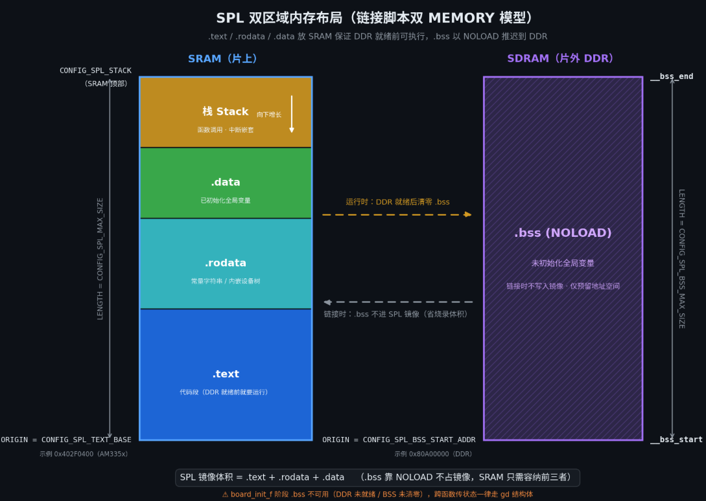
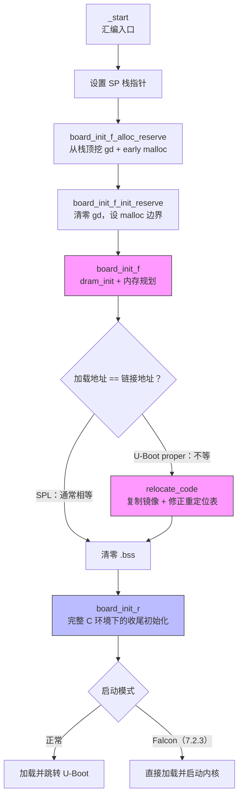

# 7.2.2 SPL的内存布局与board_init_f/r

> 所属章节：第7章 启动链深度解析 > 7.2 SPL
> 
> 难度：[E] | 预计阅读时间：35分钟

## <span class="blue"> 本节导读

7.2.1 留下一个悬而未决的问题：SPL 阶段没有 malloc，栈、代码、数据在编译期瓜分几十 KB 的 SRAM，那这块地到底是怎么分的？更进一步，U-Boot 源码里 `board_init_f` 和 `board_init_r` 两个名字诡异的函数——为什么初始化要拆成前后两段，而不是一个 `board_init` 一竿子插到底？这两个问题其实是同一个问题的两面：SPL 的内存布局决定了哪些代码能在什么时候运行，f/r 两阶段就是沿着这条内存就绪时间线切出来的。<BR>
本节覆盖：链接脚本的双区域模型（.bss 为什么搬进 DDR）、malloc 缺席时 early malloc 怎么顶上、`board_init_f` 在残缺 C 环境里做什么、relocation 与 `board_init_r` 的分工边界、SPL 阶段三类经典崩溃的定位。

---

## <span class="blue"> 几十 KB 怎么分：链接脚本的双区域模型 [E]

移植新板卡时的一类典型故障：BootROM 已把 SPL 加载进 SRAM，串口却毫无输出，JTAG 发现 PC 在访问 `0x8000_0000` 以上的地址——那是 DDR 空间，而 DDR 控制器此刻还没初始化。查到最后，根因常常落在链接脚本的段放置上。看懂 SPL 的内存布局，得先从编译产物里的"段"说起。

### 先补课：一个 C 程序在内存里占哪几格

编译器把 C 代码翻译成二进制时，按访问性质把内容分成四类段（section）。这个划分的意义在于：启动早期每一格的去向都可以单独决策，而不是整个程序只能整体搬放。

| 段 | 装什么 | 占镜像体积 | 运行时要求 |
|----|--------|-----------|-----------|
| `.text` | 机器码 | 是 | 必须可执行 |
| `.rodata` | 常量字符串、`const` 数据、内嵌设备树 | 是 | 只读即可 |
| `.data` | 已初始化（非零）的全局变量 | 是 | 可读写，初值要从镜像复制 |
| `.bss` | 未初始化或初始化为零的全局变量 | **否** | 可读写，运行前清零即可 |

`.bss` 的特殊性值得展开一句：`static int buf[8192];` 这种变量的初值全是零，镜像里没必要真的存 8KB 的零，链接器只需记录"运行时在某地址预留 8KB"即可——这就是 `(NOLOAD)` 属性的含义。

### 双区域模型：运行时必需的留 SRAM，能推迟的搬去 DDR

SPL 链接脚本（如 `arch/arm/cpu/armv8/u-boot-spl.lds`）把这套分段逻辑用到了极致——声明两块 MEMORY 区域，运行时必需的段放 SRAM，`.bss` 整体推迟到 DDR：

```ld
MEMORY { .sram : ORIGIN = CONFIG_SPL_TEXT_BASE,
         LENGTH = CONFIG_SPL_MAX_SIZE }
MEMORY { .sdram : ORIGIN = CONFIG_SPL_BSS_START_ADDR,
         LENGTH = CONFIG_SPL_BSS_MAX_SIZE }

SECTIONS
{
    .text : {
        *(.__image_copy_start)
        CPUDIR/start.o (.text*)
        *(.text*)
    } >.sram

    .rodata : { *(SORT_BY_ALIGNMENT(SORT_BY_NAME(.rodata*))) } >.sram
    .data : { *(.data*) } >.sram

    .bss_start (NOLOAD) : { KEEP(*(.__bss_start)); } >.sdram
    .bss (NOLOAD) : { *(.bss*) } >.sdram
    .bss_end (NOLOAD) : { KEEP(*(.__bss_end)); } >.sdram
}
```



这一手同时解决了两个问题：镜像体积上，`.bss` 不进二进制文件，烧录和加载都更快；SRAM 预算上，只有代码、常量、已初始化数据三样占用那几十 KB，全局缓冲区的额度被转移给了管够的 DDR。对总 SRAM 只有几十 KB 的平台，省下的 `.bss` 空间常常是装得下与装不下的分水岭。

代价也随之而来，而且是本节的第一道关卡：**`.bss` 变量在 DDR 初始化完成之前是禁地**。`board_init_f` 阶段碰了 `.bss` 里的变量，读写的就是尚未初始化的 DDR 物理地址——轻则拿到随机值，重则总线错误直接挂死。后文 i.MX8M 的案例就是踩在这里。

| 方案 | SRAM-only（全放 SRAM） | 双区域（.bss 放 DDR） |
|------|----------------------|----------------------|
| 镜像体积 | 含 .bss 零数据，膨胀 | .bss NOLOAD，不占镜像 |
| 编程约束 | 全局变量随时可用 | DDR 就绪前禁用 .bss 变量 |
| SRAM 需求 | 容纳全部段 | 只需容纳 .text/.rodata/.data |
| 适用场景 | SRAM 宽裕、求简单 | SRAM 紧张的主流平台 |

### 没有 malloc 的日子：early malloc 与 gd

7.2.1 说过 SPL 用不了 malloc——堆管理器需要一块已就绪的内存和一套元数据代码，而此时唯一的地盘是 SRAM 自己。但 C 代码总得有地方存全局状态（DDR 容量多大？镜像加载到哪？），也需要少量动态分配（设备树解析时的临时节点）。U-Boot 的替代方案是两样编译期和启动早期就定位好的东西：

- **gd（global_data）**：一个固定大小的结构体，地址在入口汇编里就定下来，作为跨函数、跨阶段传递状态的"官方通道"。`gd->ram_size`、`gd->relocaddr` 这类字段就是 DDR 初始化结果和内存规划的载体。
- **early malloc**：一块编译期定长（`CONFIG_SYS_MALLOC_F_LEN`，通常 8~16KB）的静态缓冲区，配上一个极简 bump allocator——只往高地址顺序分配、不释放。功能残缺，但在几十 KB 的世界里足够用。

两者的内存从哪来？从栈顶往下"挖"。进入 C 世界之前，`crt0` 汇编做三件事：

```armasm
/* arch/arm/lib/crt0_64.S —— 进入 board_init_f 前的环境搭建 */
    /* 1. 设置初始栈指针（SRAM 顶部） */
    ldr x0, =(CONFIG_SPL_STACK)
    bic sp, x0, #0xf                 /* 16 字节 ABI 对齐 */

    /* 2. 从栈顶向下预留 gd + early malloc 空间 */
    mov x0, sp
    bl  board_init_f_alloc_reserve   /* 返回 gd 基地址 */
    mov sp, x0                       /* 栈顶下调 */
    mov x18, x0                      /* x18 = gd 指针（ARM64 约定） */

    /* 3. 清零 gd，设置 early malloc 边界 */
    bl  board_init_f_init_reserve

    /* 4. 进入 C 世界 */
    bl  board_init_f
```

对应的分配逻辑（`common/init/board_init.c`）就是把栈顶一块地切成两份：

```c
ulong board_init_f_alloc_reserve(ulong top)
{
    top -= CONFIG_SYS_MALLOC_F_LEN;         /* 先留 early malloc 堆 */
    top = rounddown(top - sizeof(gd_t), 16); /* 再留 gd，16 字节对齐 */
    return top;                              /* 返回 gd 基地址 */
}
```

> 💡 `board_init_f` 阶段要跨函数传状态，一律走 `gd` 的成员，不要新造全局变量——新造的全局变量落在 `.bss`，而此时 `.bss` 还是 DDR 里的禁地。

---

## <span class="blue"> 为什么初始化要拆两段：board_init_f 与 board_init_r [E]

`f` 是 front（前段），`r` 是 rear（后段）。拆分的分界线就是 7.2.1 反复出现的那条时间线：**DDR 就绪之前 vs 之后**。两个函数运行在不同的世界里，能用的资源完全不同，分工自然不同。

### board_init_f：残缺环境里的突围

进入 `board_init_f` 时，C 环境是残缺的：有栈、有 gd、有 early malloc，但 `.bss` 不可用、DDR 不可用、malloc 功能不全。它的任务是在这副烂牌里打出唯一的出路——把 DDR 初始化掉，然后规划好新世界的内存蓝图。实现上是一个按序执行的函数指针数组（`common/board_f.c`）：

```c
static const init_fnc_t init_sequence_f[] = {
    setup_mon_len,        /* 计算镜像总长度 */
    fdtdec_setup,         /* 解析内嵌设备树 */
    initf_malloc,         /* 启用 early malloc */
    arch_cpu_init,        /* SoC 级初始化 */
    get_clocks,           /* 时钟配置 */
    dram_init,            /* 【分水岭】DDR 控制器初始化 + training */
    setup_dest_addr,      /* 设置重定位目标地址 */
    reserve_uboot,        /* 预留 U-Boot 运行空间 */
    reserve_malloc,       /* 预留完整 malloc 空间 */
    reserve_global_data,  /* 预留新 gd */
    reserve_stacks,       /* 预留最终栈 */
    setup_reloc,          /* 计算 relocation 偏移 */
    NULL,
};
```

`dram_init` 是整条序列的分水岭：之前，全局变量禁区、动态内存以 KB 计；之后，DDR 容量已知，后面一串 `reserve_*` 从 DDR 顶部往下依次划拨——U-Boot 放哪、malloc 堆多大、栈在哪、gd 搬去哪，全部写进 `gd` 的字段里。数组式设计的工程价值在于可裁剪：哪个环节不需要，从数组里删掉一行即可，时序关系一目了然。

### relocate_code：把代码搬到规划好的地址

`board_init_f` 规划完蓝图，接下来的问题是：代码当前运行在加载地址（比如 SRAM 的 `0x402F_0400`），而新家在 `gd->relocaddr` 指向的 DDR 高位。搬家的动作叫 relocation：把镜像整体复制到目标地址，再遍历链接器生成的重定位表（ARM64 的 `.rela.dyn`），把代码里写死的绝对地址引用逐个加上偏移量 `reloc_off = 运行时地址 - 链接地址`。复制加修正两件事做完，跳转到新地址，旧世界就可以抛弃了。

SPL 是这条规则的例外：它的加载地址由 BootROM 协议定死（7.1.3），通常就等于链接地址，所以**多数 SPL 不执行 relocation**，`board_init_f` 之后直接清 `.bss` 进 `board_init_r`。relocation 的全套戏码属于 U-Boot proper——7.3 节展开，本节只需知道 f/r 之间隔着这道搬迁工序，以及为什么 SPL 能省掉它。

### board_init_r：完整世界里的收尾

`board_init_r` 的函数签名本身就标明了交接内容：

```c
void board_init_r(gd_t *new_gd, ulong dest_addr)
```

`new_gd` 是迁到新家的 gd，`dest_addr` 是新世界地址。进入它时，`.bss` 已清零、代码运行在正确地址、栈和 gd 都已迁移、完整 malloc 就绪——C 环境第一次完整。U-Boot proper 在这里跑 `init_sequence_r[]` 初始化驱动模型、环境变量、网络，最后进 `main_loop()`；而 SPL 的 `board_init_r` 走的是 7.2.1 看过的短路径：初始化存储、加载 U-Boot、清理、跳转，`hang()` 兜底。

整条 f → relocate → r 的流水线：


```mermaid
flowchart TD
    A["_start<br/>汇编入口"] --> B["设置 SP 栈指针"]
    B --> C["board_init_f_alloc_reserve<br/>从栈顶挖 gd + early malloc"]
    C --> D["board_init_f_init_reserve<br/>清零 gd，设 malloc 边界"]
    D --> E["board_init_f<br/>dram_init + 内存规划"]
    E --> F{"加载地址 == 链接地址？"}
    F -->|"SPL：通常相等"| G["清零 .bss"]
    F -->|"U-Boot proper：不等"| H["relocate_code<br/>复制镜像 + 修正重定位表"]
    H --> G
    G --> I["board_init_r<br/>完整 C 环境下的收尾初始化"]
    I --> J{"启动模式"}
    J -->|"正常"| K["加载并跳转 U-Boot"]
    J -->|"Falcon（7.2.3）"| L["直接加载并启动内核"]

    style E fill:#f9f,stroke:#333
    style H fill:#f9f,stroke:#333
    style I fill:#bbf,stroke:#333
```

### 速查：看门狗在启动链各阶段的喂狗策略

`init_sequence_f[]` 里的 `dram_init` 包含 DDR training，部分平台上要跑几百毫秒；安全启动的验签同样是耗时操作。如果硬件看门狗从上电起就在跑，这段时间无人喂狗，系统会在 SPL 中途反复复位——复位后走到同一步再次超时，症状是"永远停在启动早期"。看门狗不是某一个阶段的事，是接力赛：每一棒都要在超时前喂狗、关闭或完成交接。

- **一句话解释**：启动链的每个阶段（BootROM → SPL → U-Boot → 内核 → init）都必须在自己的执行窗口内处理好看门狗，任一阶段超时未喂狗，系统就陷入无限重启。
- **为什么重要**：启动时间优化和安全启动验签都会拉长某些阶段的执行时间，看门狗超时阈值必须覆盖整条启动链，或在各阶段合理处理——"优化了启动"和"系统起不来"常常只有一线之隔。
- **快速参考**（典型超时 1~60 秒，可配置）：

  | 阶段 | 常见处理 | 关键配置 / 接口 |
  |------|---------|----------------|
  | BootROM | 自动关闭，或设极长超时；ROM 不可改，行为由芯片厂商定死 | 无软件配置入口 |
  | SPL | 在 `board_init_f` 早期初始化并定期喂狗，或直接关闭 | `CONFIG_HW_WATCHDOG` |
  | U-Boot | `wdt` 命令族（start / stop / reset）；启动内核前决定移交还是关闭 | `CONFIG_WATCHDOG` |
  | 内核 | watchdog core 接管，用户空间经 `/dev/watchdog` 喂狗 | `CONFIG_WATCHDOG_CORE` |

- 关键策略：SPL/U-Boot 阶段若后续启动时间不确定（要加载大尺寸镜像、要做验签），跳转下一阶段前关闭看门狗，由内核重新使能并管理——比赌超时阈值覆盖全程更稳。
- **全书螺旋关联**：看门狗与异常恢复机制的体系化设计见第 30 章「可靠性工程」。

---

## <span class="blue"> 排错实战：SPL 阶段的四类经典崩溃 [E]

f/r 两段式加上双区域布局，派生出四类症状雷同、根因迥异的崩溃。对照定位：

### 崩溃一：碰了 DDR 里的 .bss（i.MX8M 实战）

某 i.MX8M 板卡移植新 DDR 参数后，SPL 打印到 "DRAM:" 即挂死。JTAG 确认挂死在 `dram_init()` 的 PHY training 阶段，逐行排查发现：`ddrphy_cfg[]` 时序参数数组被声明为 `static` 且未初始化——按段的规则它进了 `.bss`，而该平台的 `.bss` 链到了 DDR 空间。代码在 DDR 就绪之前去读 DDR 里的参数，读到的是随机值，training 自然失败。修复是把数组加 `const` 让它进 `.rodata`，或显式初始化为非零值挤进 `.data`。

这个案例反过来给出一条编码纪律：**`board_init_f` 及其调用链上的所有数据，必须落在 `.text`/`.rodata`/`.data`/栈/`gd` 这五处之一**。审查 SPL 代码时，`static` 未初始化变量出现在 f 阶段调用链里就是红色信号。

### 崩溃二：栈指针越界或相踩

`CONFIG_SPL_STACK` 设置过高，栈向下增长时覆盖 SPL 自身代码——症状是运行到某个固定调用深度后 PC 跳飞。核对不等式：`CONFIG_SPL_STACK < (CONFIG_SPL_TEXT_BASE + CONFIG_SPL_MAX_SIZE)`，并给 deepest call chain 留出余量。SPL 没有栈保护页，越界没有任何报错，唯一的防御是编译期把账算对。

### 崩溃三：CONFIG_SPL_BSS_START_ADDR 指向了没就绪的 DDR

链接脚本配置无误但 DDR 初始化失败时，所有 `.bss` 访问全部落在死地址上。定位手法是在 `board_init_f` 第一行插一条 GPIO 翻转（7.2.1 的心跳手段），确认代码是否进了 C 世界；再逐行推进 GPIO 标记，找到失联的那一步。

### 崩溃四：training 参数写死，败给温度漂移（工业控制器实战）

某工业控制器量产半年后，现场陆续回报偶发死机：常温实验室怎么测都稳定，进高低温箱到 70°C 附近就随机 Kernel Panic，冬天户外的批次则是冷启动后几分钟内死机。根因要回到 7.2.1 讲的那条物理事实——DDR 信号的采样窗口随温度和电压漂移。这块板子的 SPL 把参考设计在某颗颗粒、25°C 下扫出的 training 参数表原样写死了：常温下参数落在合格窗口内，温度一跑偏，采样沿就滑出窗口，读写开始概率性出错。

修复不是换一组"更好的"静态参数——任何写死的参数都有自己的温度边界——而是把 training 从一次性动作变成持续过程：启用 DDR 控制器的周期性 retraining 与 ZQ 校准，或在 SPL 里按板载温度传感器读数切换参数档。这个案例还有一条排查纪律：**training 失败的典型表现不是确定性启动崩溃，而是运行期随机内存错误**——它能混过产线常温测试，只在温度边界上发作。SPL 阶段的问题描述里出现"偶发""随机""温箱里才复现"这类词，先把嫌疑放到 training 参数的温度覆盖上。

> ⚠️ 四类崩溃的共同点是"无声"：没有栈保护、没有 MMU 异常、多半没有串口细节，温度漂移类故障甚至连崩溃现场都不在启动阶段。GPIO 心跳 + JTAG 是 SPL 阶段的标配排查组合，别指望日志。

---

## <span class="blue"> 本节总结

| 要点 | 内容 |
|------|------|
| **段的去向** | `.text`/`.rodata`/`.data` 驻留 SRAM，`.bss` 以 NOLOAD 推迟到 DDR；省镜像体积也省 SRAM 预算 |
| **禁地规则** | DDR 就绪前访问 `.bss` = 访问未初始化内存；f 阶段数据只能落在代码/常量/数据/栈/gd 五处 |
| **malloc 的替身** | gd（固定结构体，跨阶段官方通道）+ early malloc（编译期定长 bump allocator，从栈顶挖出） |
| **f/r 拆分逻辑** | 分界线是 DDR 就绪时刻；f 在残缺环境里做 DDR 初始化与内存规划，r 在完整环境里收尾 |
| **dram_init** | `init_sequence_f[]` 的分水岭，其后 `reserve_*` 系列从 DDR 顶部向下划拨新世界蓝图 |
| **relocation** | 复制镜像 + 按 `.rela.dyn` 修正绝对地址；SPL 加载地址=链接地址，通常跳过 |
| **四类崩溃** | 碰 .bss 禁地、栈越界相踩、BSS 指向死 DDR、training 参数败给温度漂移；共性是无声甚至无现场，靠 GPIO 心跳 + JTAG 定位 |

> 💡 f/r 两阶段不是 U-Boot 的历史包袱，是"内存就绪时间线"在代码结构上的投影。看懂这一点，`board_init_f` 里每个函数的先后顺序都不再需要背诵——它们被同一条约束排好了队。

---

## <span class="blue"> 下一步

SPL 的能力边界到此摸清：它能初始化 DDR、能驱动存储、能把镜像搬进 DDR 并跳过去。这三件事对加载 U-Boot 成立，对加载 Linux 内核同样成立——那为什么不能跳过 U-Boot proper，让 SPL 直接启动内核？7.2.3 的 Falcon Mode 就是这个问题的工程答案。

---

## <span class="blue"> 延伸阅读

- U-Boot 源码：`arch/arm/cpu/armv8/u-boot-spl.lds`（双区域链接脚本）
- U-Boot 源码：`common/init/board_init.c`、`common/board_f.c`、`common/board_r.c`
- U-Boot 源码：`arch/arm/lib/crt0_64.S`、`arch/arm/lib/relocate.S`
- U-Boot 文档：`doc/develop/global_data.rst`（gd 结构体字段详解）
