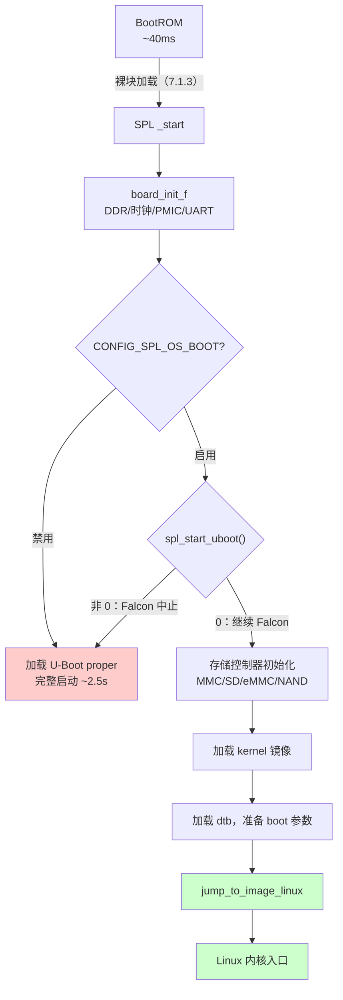
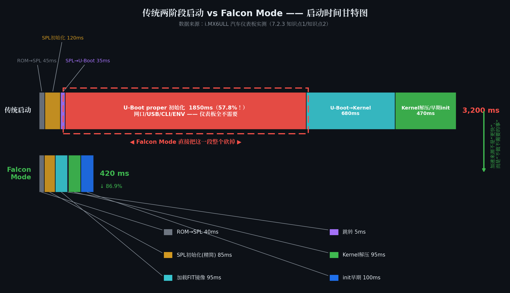

# 7.2.3 Falcon Mode：SPL直达内核的快速启动路径

> 所属：第7章 系统启动全链路 > 7.2 SPL：极简的二级加载器
> 
> 难度：[I→E] | 预计阅读时间：30分钟

## <span class="blue"> 本节导读

7.2.1 和 7.2.2 把 SPL 的能力边界摸清了：它能初始化 DDR、能驱动存储控制器、能把一个镜像从介质读进 DDR 并跳过去。读到这里自然会产生一个想法——这三件事对加载 U-Boot 成立，对加载 Linux 内核同样成立。既然 SPL 搬得动 U-Boot，为什么不能直接搬内核，把中间一整级砍掉？这个想法就是 Falcon Mode。它不是理论推演，是汽车仪表、工业 HMI 这类对启动时间有硬性指标的产品里的标准解法。<BR>
本节覆盖：Falcon Mode 省掉的到底是什么、SPL 直达内核的代码路径与配置、砍掉 U-Boot proper 失去的能力清单、量产必备的回退策略、什么场景值得用。

---

## <span class="blue"> 3.2 秒的启动时间花在了哪 [I]

某 Tier-1 供应商的 12.3 寸液晶仪表项目，SoC 为 i.MX6ULL，存储为 8GB eMMC，产品需求写死一条：从 PWRON 到 Qt 应用首帧显示小于 500ms。现状测量出来是 3.2 秒，分解到各阶段：

| 启动阶段 | 耗时 | 占比 |
|---------|------|------|
| BootROM → SPL | 45ms | 1.4% |
| SPL 初始化 DDR/PMIC | 120ms | 3.7% |
| SPL → U-Boot proper | 35ms | 1.1% |
| U-Boot proper 初始化（网口/SD/eMMC/ENV/CLI） | 1850ms | 57.8% |
| U-Boot → Kernel（加载 zImage + dtb） | 680ms | 21.3% |
| Kernel 解压/早期初始化 | 470ms | 14.7% |
| **总计** | **3200ms** | **100%** |

瓶颈一目了然：近 58% 的时间烧在 U-Boot proper 的初始化里。再看这些初始化干了什么——枚举用不到的以太网 PHY、扫描 I2C/SPI 总线、加载环境变量、初始化命令行和启动菜单。对一块仪表板来说，这些全是浪费：它不需要网络启动，不需要交互式命令行，不需要 bootdelay 等人按键。

把 SPL 的能力清单（7.2.1）和内核的启动需求摆在一起对照，结论就浮出来了：内核启动只需要 DDR 就绪、镜像在 DDR 里、dtb 就位——这三样 SPL 全都能给。**U-Boot proper 在这一类产品里不是必需品，是一段长达两秒的过场。** Falcon Mode 做的事就是把这段过场从架构上整个删掉：

```
传统两阶段:  BootROM → [SPL] → [U-Boot proper] → [Kernel] → init
                             └── 外设初始化、CLI、ENV、bootdelay

Falcon Mode: BootROM → [SPL + 精简硬件初始化] → [Kernel] → init
                              └── 直接加载 kernel + dtb 并跳转
```

> 💡 Falcon Mode 的加速不是来自"把代码写快"，而是来自"不做不需要的事"。这是阶段消除级的优化，不是调参级的优化。

---

## <span class="blue"> 直达内核的代码路径 [E]

### 决策点：spl_start_uboot 的返回值陷阱

Falcon Mode 由 `CONFIG_SPL_OS_BOOT` 使能，决策逻辑在 `common/spl/spl.c` 的启动流程末尾：

```c
/* common/spl/spl.c —— Falcon 决策点 */
#ifdef CONFIG_SPL_OS_BOOT
    if (spl_start_uboot()) {
        /* 返回非 0 → 放弃 Falcon，回退到正常 U-Boot 启动 */
        debug("Falcon mode aborted, falling back to U-Boot\n");
    } else {
        /* 返回 0 → 走 Falcon 路径，直接加载内核 */
        spl_load_image_os();
        jump_to_image_linux();    /* 永不返回 */
    }
#endif
```

> ⚠️ `spl_start_uboot()` 的命名与返回值是反直觉的：**返回非 0 表示"要启动 U-Boot"（放弃 Falcon），返回 0 才继续 Falcon 路径**。社区邮件列表里因读反这个逻辑而调错方向的案例不止一例，读代码和写回退逻辑时都盯紧返回值。

### 完整链路

```c
/* arch/arm/lib/crt0.S → _main */
    bl  board_init_f           /* DDR/时钟/PMIC/串口（7.2.2） */
    bl  board_init_r           /* SPL 主逻辑 */

/* common/spl/spl.c → board_init_r() */
    spl_board_init();                      /* 板级初始化 */
#ifdef CONFIG_SPL_OS_BOOT
    if (!spl_start_uboot()) {              /* Falcon 决策点 */
        spl_load_image_os();               /* 从 MMC/NAND 读 kernel + dtb */
        jump_to_image_linux();             /* arch/arm/lib/bootm.c，跳转内核 */
    }
#endif
    spl_load_image_uboot();                /* 回退路径：加载 U-Boot proper */
```

整条路径与 7.2.2 的 `board_init_r` 短路径完全同构，区别只在最后一跳的目标是内核而不是 U-Boot。SPL 要做的新增工作只有一类：把原来由 U-Boot proper 替内核做的准备揽过来——按内核的启动协议放好 dtb、设置好 `bootargs`、准备好跳转参数。



### 配置清单

```
# configs/myboard_falcon_defconfig（关键片段）
CONFIG_SPL=y
CONFIG_SPL_OS_BOOT=y            # 核心：允许 SPL 直接启动 OS
CONFIG_SPL_MMC_SUPPORT=y
CONFIG_SPL_FAT_SUPPORT=y        # 从 FAT 分区读 kernel/dtb
CONFIG_SPL_LOAD_FIT=y           # 推荐 FIT：kernel+dtb+initrd 打包一次加载

CONFIG_SYS_LOAD_ADDR=0x82000000          # kernel 加载地址
CONFIG_SYS_SPL_ARGS_ADDR=0x88000000      # dtb 加载地址
CONFIG_SPL_FAT_LOAD_KERNEL_NAME="zImage"
CONFIG_SPL_FAT_LOAD_ARGS_NAME="imx6ull-myboard.dtb"
```

> 🔴 `CONFIG_SPL_OS_BOOT` 与安全启动链存在交互风险：SPL 直接加载内核意味着内核镜像的验签也要前移到 SPL（`CONFIG_SPL_FIT_SIGNATURE`），否则 Falcon 路径会成为绕开签名验证的旁路。NXP HAB/AHAB 的 Close Device 模式下需在 CSF 中显式覆盖 Falcon 加载路径。

---

## <span class="blue"> 省掉什么、失去什么 [I→E]

### 省掉的时间从哪来

Falcon 路径中 SPL 承担的初始化项，与传统两阶段的对比：

| 初始化项 | 传统 SPL | Falcon SPL | 说明 |
|---------|---------|-----------|------|
| DDR/SDRAM | 必须 | 必须 | 加载内核的前提 |
| 时钟/PLL、PMIC | 必须 | 必须 | 供电与总线时钟 |
| 串口 | 必须 | 必须（可关） | 调试输出 |
| 存储控制器 | 必须 | 必须 | 镜像来源 |
| 以太网 | 不做 | 不做 | U-Boot proper 阶段省 80~150ms |
| USB 控制器 | 不做 | 不做 | 省 60~100ms |
| I2C/SPI 外设扫描 | 不做 | 不做 | 省 30~50ms |
| ENV 环境变量 | 不做 | 不做 | 省 20~40ms，配置改为编译期固化 |
| LCD/显示 | 不做 | 可选 | 需早期 Logo 时才初始化 |

### 实战：3.2s → 420ms

前述仪表项目的改造四步：启用 `CONFIG_SPL_OS_BOOT` 并裁掉 Ethernet/USB/ENV；eMMC 分区中 kernel 与 dtb 放到固定位置避免文件系统遍历；zImage + dtb + initrd 打包成单个 FIT（`.itb`）一次加载；内核侧用 `initcall_debug` 定位残余延迟。优化后的时间剖面：

| 阶段 | 耗时 | 关键动作 |
|------|------|---------|
| BootROM → SPL | 40ms | 不变（ROM 决定） |
| SPL 初始化（精简） | 85ms | DDR + 时钟 + eMMC + 串口 |
| SPL 加载 FIT 镜像 | 95ms | eMMC 读 ~12MB kernel + dtb |
| SPL → Kernel 跳转 | 5ms | `jump_to_image_linux` |
| Kernel 解压/启动 | 95ms | zImage 解压 + 早期初始化 |
| initramfs / init 早期 | 100ms | 精简 preinit |
| **总计** | **420ms** | **下降约 87%** |



该项目还把 FIT 镜像放进 eMMC 的 Boot Partition 而非 User Data Area，利用 `BOOT_ACK` 与 `RST_n` 特性把存储读取从 150ms 压到 95ms——Falcon Mode 与 eMMC 硬件特性协同的典型手法，eMMC 启动分区的机制 7.1.3 的介质表中已提过入口。

### 失去的能力清单

砍掉 U-Boot proper 不是免费的。以下能力在 Falcon 路径中完全或部分不可用：

| 能力 | 传统 U-Boot | Falcon Mode | 影响 |
|------|-----------|-------------|------|
| 交互式命令行 | 完整 | 不可用 | 现场排障严重受限 |
| 网络启动（TFTP/NFS） | 完整 | 不可用 | 开发流程需调整 |
| 环境变量读写 | 完整 | 不可用 | 配置编译期固化 |
| A/B 分区切换 | U-Boot 脚本实现 | 需 SPL 内实现 | 要写自定义逻辑 |
| 设备树动态修改 | `fdt` 命令 | 不可用 | dtb 预先生成 |
| 固件更新（dfu/fastboot） | 完整 | 受限 | 需专用 Recovery 模式 |
| bootdelay 按键中断 | 支持 | 无延迟 | 无法打断启动 |

> 🔴 量产产品绝对不要启用"纯"Falcon Mode 而不留回退路径。现场一旦出现内核 panic 或 dtb 兼容性问题，没有 U-Boot CLI 就意味着拆机上 JTAG——调试阶段的痛苦会远超启动加速的收益。

### 回退策略：量产设计的必答题

工程上的标准做法是 Falcon + 一条回退通道。本项目用的是 GPIO 检测：

```c
/* board/myvendor/myboard/myboard.c —— Falcon 回退检测 */
int spl_start_uboot(void)
{
    /* 工厂/维修模式：检测点拉低则回退完整 U-Boot */
    gpio_request(FALCON_DISABLE_GPIO, "falcon_disable");
    gpio_direction_input(FALCON_DISABLE_GPIO);

    if (!gpio_get_value(FALCON_DISABLE_GPIO)) {
        printf("Falcon: debug pin pulled low, starting full U-Boot\n");
        return 1;    /* 回退到 U-Boot proper */
    }
    return 0;        /* 生产路径：继续 Falcon */
}
```

常见回退方案的取舍：

| 策略 | 实现方式 | 适用场景 |
|------|---------|---------|
| GPIO 回退 | 检测特定引脚电平 | 有物理按键/测试点的设备 |
| eMMC Boot 分区双镜像 | Boot0/Boot1 分别放 SPL-only 与 SPL+U-Boot | 高可靠性要求 |
| Boot Counter | SPL 维护启动计数，连续失败自动回退 | 有持久化存储 |
| 组合键 Recovery | 上电按住组合键进完整 U-Boot | 消费电子 |
| 看门狗回退 | 内核喂狗失败则复位进 U-Boot | 有硬件 WDT |

### 值不值得用：决策逻辑

```
启动时间需求 < 1 秒？
   ├─ 否 → 传统两阶段即可
   └─ 是 → 需要网络启动 / 频繁现场调试？
          ├─ 是 → 留在传统路径，转而优化 U-Boot proper 自身
          └─ 否 → Falcon Mode + 至少一条回退通道
```

匹配画像很清晰：汽车仪表、工业 HMI、医疗面板这类 kiosk 设备——硬件固定、启动源固定、不需要交互、启动时间写进需求文档。反例同样清晰：开发阶段的产品、需要网络烧录的产线、启动配置频繁变更的平台。

| 维度 | 传统两阶段 | Falcon Mode | 决策建议 |
|------|-----------|-------------|---------|
| 冷启动时间 | 2~5 秒 | 200~600ms | 需求 <1s 选 Falcon |
| 灵活性 | 高（脚本/命令/网络） | 低（路径固化） | 频繁调试选传统 |
| 可维护性 | 高（CLI 排障） | 低（靠回退通道） | 量产必须配回退 |
| 安全启动 | 成熟 | 验签需前移到 SPL | 高安全场景需审计 |
| 升级路径 | OTA/TFTP/USB | 需专用 Recovery | 设计时预留 |

---

## <span class="blue"> 本节总结

| 要点 | 内容 |
|------|------|
| **Falcon Mode 本质** | SPL 直接加载 kernel + dtb 并跳转，从架构上消除 U-Boot proper 整个阶段 |
| **加速来源** | 不做不需要的事：跳过网口/USB/CLI/ENV 初始化，而非把代码写快 |
| **使能与决策点** | `CONFIG_SPL_OS_BOOT` + `spl_start_uboot()` 返回 0；返回值语义反直觉，非 0 才是回退 U-Boot |
| **SPL 新增职责** | 按内核启动协议准备 dtb 与 bootargs；验签需随之前移（FIT 签名） |
| **实战数据** | i.MX6ULL 仪表项目 3.2s → 420ms；FIT 进 eMMC Boot Partition 再省 55ms |
| **能力代价** | 失去 CLI、网络启动、ENV、bootdelay、动态 dtb 修改 |
| **量产铁律** | 必须留回退通道：GPIO / Boot Counter / 组合键 Recovery / 看门狗 |
| **适用画像** | kiosk 类固定硬件设备（仪表/HMI/面板）；开发期和网络烧录场景不适用 |

> 💡 7.2 三节合起来是一条完整的因果链：SRAM 装不下 U-Boot 才有了 SPL（7.2.1），SRAM 的分配方式决定了 f/r 两阶段（7.2.2），而 SPL 能力边界的尽头就是 Falcon Mode（本节）。下一节进入 U-Boot proper 自己的世界——从 `_start` 汇编入口到重定位，看 7.2.2 跳过的那场完整搬家。

---

## <span class="blue"> 延伸阅读

- U-Boot 文档：`doc/develop/falcon.rst`（Falcon Mode 官方说明）
- U-Boot 源码：`common/spl/spl.c`（`spl_start_uboot` 决策逻辑）、`arch/arm/lib/bootm.c`（`jump_to_image_linux`）
- NXP i.MX6ULL Reference Manual："eMMC Boot Operation" 章节（Boot Partition 机制）
- U-Boot 源码：`doc/usage/fit/index.rst`（FIT 镜像格式与签名）
