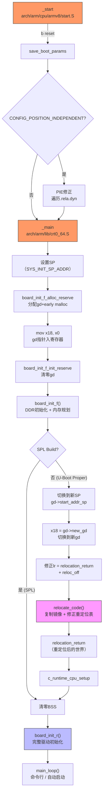

# 7.3.1 _start汇编入口与重定位

> 所属：第7章 嵌入式Bootloader深度解析 > 7.3 U-Boot主程序启动流程
> 难度：[E] | 预计阅读时间：40分钟

## 本节导读

BootROM将SPL加载到SRAM并移交控制权后，SPL完成了DDR初始化——但主U-Boot（U-Boot Proper）尚未运行。本节追踪从`_start`汇编入口到`board_init_r`C世界的完整链路：解析ARM64汇编入口如何搭建"残缺C环境"、为何`gd`是重定位前唯一可用的全局数据通道、以及`relocate_code`如何完成从加载地址到链接地址的跃迁。理解这些机制，是诊断U-Boot重定位挂死、优化启动时延、实现安全启动链式验证的关键。

---

## 知识点1：_start入口 — 从汇编到C的 bridges [E] ~1200字

### 问题场景

你正在调试一块RK3568板卡，SPL已成功初始化DDR并打印"U-Boot 2024.10"，但随后系统挂死，串口再无输出。JTAG显示PC指向DDR中的一个地址，但栈指针SP却还在SRAM区域。问题可能出在`_main`到`board_init_f`的过渡阶段——SP与gd指针的初始化时序错误。

### 机制深入：_start到_main的调用链

ARM64 U-Boot的入口点在`arch/arm/cpu/armv8/start.S`，但真正的"C环境搭建者"是`arch/arm/lib/crt0_64.S`中的`_main`。两者的分工如下：

| 阶段 | 源文件 | 关键符号 | 职责 |
|------|--------|---------|------|
| 平台级入口 | `arch/arm/cpu/armv8/start.S` | `_start` → `reset` | PIE修正（若需要）、保存启动参数、跳转到`_main` |
| C运行时搭建 | `arch/arm/lib/crt0_64.S` | `_main` | 设置SP、分配gd、调用`board_init_f`、驱动重定位 |
| 重定位执行 | `arch/arm/lib/relocate_64.S` | `relocate_code` | 复制镜像、修正`.rela.dyn`、刷新Cache |
| 后段初始化 | `common/board_r.c` | `board_init_r` | 完整C环境、驱动模型、进入主循环 |

`start.S`中的`_start`极其精简——大部分时间它只是做一个`b reset`。真正的复杂性在`reset`标签后：

```armasm
/* arch/arm/cpu/armv8/start.S */
.globl _start
_start:
#if defined(CONFIG_ENABLE_ARM_SOC_BOOT0_HOOK)
    #include <asm/arch/boot0.h>     /* SoC特定的启动钩子 */
#else
    b   reset
#endif
    .align 3
.globl _TEXT_BASE
_TEXT_BASE:
    .quad   CONFIG_SYS_TEXT_BASE    /* 链接时的基地址，运行时只读 */

reset:
    b   save_boot_params            /* 保存BootROM传递的参数 */
.globl save_boot_params_ret
save_boot_params_ret:
#if CONFIG_POSITION_INDEPENDENT && !defined(CONFIG_SPL_BUILD)
    /* PIE入口：修正.rela.dyn重定位项 */
    adr x0, _start                  /* x0 = _start运行时地址 */
    ldr x1, _TEXT_BASE              /* x1 = _start链接地址 */
    subs    x9, x0, x1              /* x9 = 运行时偏移 */
    beq pie_fixup_done              /* 无偏移则跳过 */
    /* 遍历.rela.dyn修正绝对地址引用... */
pie_fixup_done:
#endif
    bl  _main                       /* 进入C运行时搭建 */
```

💡 **关键洞察**：当U-Boot以`-fPIE -pie`编译时，`start.S`中的`adr x0, _start`取得的是**运行时实际地址**，而`ldr x1, _TEXT_BASE`取得的是**链接时预设地址**。两者的差值`x9`就是PIE偏移量。如果BootROM将U-Boot加载到了与链接地址不同的位置，这段代码会在进入`_main`之前就修正所有绝对地址引用——这是U-Boot能在"任意地址加载"的第一道保险。

### 关键代码路径：crt0_64.S的七步舞曲

`_main`是U-Boot启动流程中最精密的汇编代码之一，其执行序列（已在源码头部注释中完整文档化）可概括为七个步骤：

```armasm
/* arch/arm/lib/crt0_64.S — _main 核心逻辑（注释版） */
ENTRY(_main)
    /* ===== 步骤1：设置初始栈指针 ===== */
#if defined(CONFIG_SPL_BUILD) && defined(CONFIG_SPL_STACK)
    ldr x0, =(CONFIG_SPL_STACK)     /* SPL使用专用栈 */
#else
    ldr x0, =(SYS_INIT_SP_ADDR)     /* U-Boot Proper使用INIT栈 */
#endif
    bic sp, x0, #0xf                /* 16字节对齐，ABI合规 */

    /* ===== 步骤2：为gd分配空间（自顶向下） ===== */
    mov x0, sp
    bl  board_init_f_alloc_reserve  /* 返回gd基地址，栈顶下调 */
    mov sp, x0
    mov x18, x0                     /* x18 = gd（ARM64 ABI保留寄存器）*/

    /* ===== 步骤3：初始化gd结构体 ===== */
    bl  board_init_f_init_reserve   /* 清零gd，设置early malloc */

    /* ===== 步骤4：进入board_init_f（前段C初始化） ===== */
    mov x0, #0
    bl  board_init_f                /* 返回后，DDR已就绪，重定位参数已计算 */

#if !defined(CONFIG_SPL_BUILD)
    /* ===== 步骤5：切换到新栈和新gd（中间环境） ===== */
    ldr x0, [x18, #GD_START_ADDR_SP]
    bic sp, x0, #0xf                /* 切换到DDR中的新栈 */
    ldr x18, [x18, #GD_NEW_GD]      /* x18指向新分配的gd */

    /* ===== 步骤6：调用relocate_code ===== */
    ldr x0, [x18, #GD_RELOCADDR]    /* x0 = 重定位目标地址 */
    b   relocate_code               /* 不返回，直接跳到重定位后的relocation_return */

relocation_return:
    /* ===== 步骤7：清零BSS，进入board_init_r ===== */
    bl  c_runtime_cpu_setup
#endif
    /* 清零BSS段 */
    ldr x0, =__bss_start            /* 这些符号已被重定位修正 */
    ldr x1, =__bss_end
clear_loop:
    str xzr, [x0], #8
    cmp x0, x1
    b.lo    clear_loop

    /* 进入后段C世界 */
    mov x0, x18                     /* x0 = gd */
    ldr x1, [x18, #GD_RELOCADDR]   /* x1 = 重定位地址 */
    b   board_init_r                /* 不返回 */
ENDPROC(_main)
```

### Trade-off表格：x18保存gd vs 内存全局变量

| 方案 | 寄存器保存gd（ARM64 x18） | 内存全局变量（ARM32 r8） | 分析 |
|------|------------------------|------------------------|------|
| **访问速度** | 单周期，无访存延迟 | 需ldr/str，有内存延迟 | 寄存器方案更优 |
| **PIE兼容性** | 天然位置无关 | 需重定位修正 | 寄存器方案更优 |
| **跨调用持久性** | 被调用者保存寄存器，C函数必须保留 | 同左（r8在ARM APCS中保留） | 两者均需ABI配合 |
| **调试难度** | 需查看寄存器，GDB不方便 | 需查看内存地址 | 调试都不方便 |
| **架构通用性** | ARM64专用 | ARM32/RISC-V/MIPS通用模式 | 各有惯例 |

⚠️ **陷阱**：在`_main`中，`x18`被赋值为`gd`的地址后，**任何C函数调用都必须遵守ABI约定不修改x18**。如果某个`arch_cpu_init`的实现违反了ABI（例如在汇编中随意使用x18），`gd`指针会丢失，后续所有通过`gd->`的访问都会读写到随机地址。

🔴 **安全提醒**：ARM64 ABI规定x18是"平台保留寄存器"（Platform Register），在Apple平台中用于"平台判别"（Darwin用x18指向TLS）。U-Boot在ARM64中复用x18保存gd是一种**嵌入式领域的实用主义偏离**——在调用任何可能遵循严格ABI的外部库（如OP-TEE）之前，必须先保存/恢复x18。

---

## 知识点2：全局数据指针gd — 重定位前的唯一信使 [E] ~900字

### 问题场景

为什么`board_init_f`不能使用普通的BSS全局变量？为什么U-Boot要发明一个`gd_t`结构体，用寄存器指针来传递？当DDR尚未就绪、BSS尚未清零时，代码如何保存"DDR容量"、"重定位目标地址"这样的关键参数？

### 机制深入：gd_t的设计哲学

`gd_t`（global data）的完整定义在`include/asm-generic/global_data.h`中。它不是普通意义上的"全局变量"——它是一个**在栈顶预分配的结构体**，通过寄存器指针访问，因此在BSS清零之前、在重定位完成之前就已经可用。

```c
/* include/asm-generic/global_data.h — gd_t 关键字段 */
typedef struct global_data {
    struct bd_info      *bd;            /* 板级信息指针 */
    unsigned long       flags;          /* GD_FLG_* 状态标志 */
    unsigned int        baudrate;       /* 串口波特率 */
    unsigned long       cpu_clk;        /* CPU时钟频率 */
    unsigned long       relocaddr;      /* 重定位后的运行地址 */
    phys_size_t         ram_size;       /* DDR总容量 */
    unsigned long       mon_len;        /* U-Boot镜像长度 */
    unsigned long       irq_sp;         /* IRQ栈指针 */
    unsigned long       start_addr_sp;  /* 重定位后的新栈顶 */
    unsigned long       new_gd;         /* 重定位后的新gd地址 */
    unsigned long       reloc_off;      /* 重定位偏移量 */
    unsigned long       env_addr;       /* 环境变量结构地址 */
    /* ... 更多字段 ... */
} gd_t;
```

**gd_t的关键字段速查表**：

| 字段 | 类型 | 设定时机 | 用途 |
|------|------|---------|------|
| `bd` | `struct bd_info*` | `board_init_f`中 | 板级信息（DRAM布局、以太网MAC等），传给Linux内核 |
| `flags` | `unsigned long` | 多阶段更新 | `GD_FLG_RELOC`标记重定位完成，`GD_FLG_SKIP_RELOC`跳过重定位 |
| `relocaddr` | `unsigned long` | `setup_dest_addr`后 | U-Boot重定位后的目标物理地址 |
| `reloc_off` | `unsigned long` | `setup_reloc`后 | 偏移量 = 运行地址 - 链接地址，relocate_code的核心参数 |
| `ram_size` | `phys_size_t` | `dram_init`后 | DDR总容量，后续内存分配的基础 |
| `mon_len` | `unsigned long` | `setup_mon_len`后 | U-Boot镜像总长度（.text + .rodata + .data + .bss预留） |
| `start_addr_sp` | `unsigned long` | `reserve_stacks`后 | 重定位后的新栈顶地址，relocation后切换 |
| `new_gd` | `unsigned long` | `reserve_global_data`后 | 重定位后在DDR中预留的gd新位置 |
| `env_addr` | `unsigned long` | 环境变量加载后 | 环境变量结构的物理地址 |

### 关键代码路径：gd的分配与初始化

gd的内存分配采用**自顶向下（top-down）**策略——从栈顶向低地址方向"挖"出一块空间：

```c
/* common/init/board_init.c */
ulong board_init_f_alloc_reserve(ulong top)
{
    /* 自顶向下：先预留early malloc堆 */
    top -= CONFIG_SYS_MALLOC_F_LEN;       /* 典型值 0x2000 ~ 0x4000 */
    /* 再预留gd_t结构体，16字节对齐 */
    top = rounddown(top - sizeof(gd_t), 16);
    return top;                            /* 返回gd基地址 */
}

void board_init_f_init_reserve(ulong base)
{
    gd_t *gd_ptr = (gd_t *)base;
    memset(gd_ptr, '\0', sizeof(gd_t));   /* gd必须清零 */
    base += roundup(sizeof(gd_t), 16);
    gd_ptr->malloc_base = base;           /* early malloc紧跟gd之后 */
    gd_ptr->malloc_limit = top - base;    /* 剩余空间为malloc堆 */
}
```

内存布局如下：

```
高地址
┌─────────────────┐ ← 原始栈顶（如 SRAM 顶部 0x40_0000）
│   early malloc  │    CONFIG_SYS_MALLOC_F_LEN（如 0x4000）
│     堆区域      │
├─────────────────┤ ← board_init_f_alloc_reserve 返回的 top
│                 │
│     gd_t        │    sizeof(gd_t)（通常 ~200-400字节，16字节对齐）
│   （全局数据）   │
├─────────────────┤ ← 新栈顶（SP下调至此）
│    栈增长方向    │    向下增长
│      ...        │
低地址
```

💡 **技巧**：通过`bdinfo`U-Boot命令可以查看gd的所有关键字段值。调试重定位问题时，首先在串口初始化后立即执行`bdinfo`，确认`relocaddr`和`reloc_off`的值是否符合预期。

### 为什么不用BSS变量？

在`board_init_f`执行期间，以下条件限制了全局变量的使用：

- **BSS未清零**：未初始化全局变量（`int foo;`）的值是SRAM中的随机垃圾，不可信赖
- **DDR未就绪**：部分平台此时DDR控制器尚未初始化，.bss若在DRAM中则不可访问
- **PIE限制**：即使编译为位置无关，绝对地址引用（如字符串字面量地址、函数指针表）仍需重定位修正

`gd_t`的精妙之处在于：**它被分配在已知的可用内存中（SRAM栈区），通过寄存器指针访问，不依赖BSS，天然PIE友好**。它是`board_init_f`与后续阶段之间唯一的、可靠的"数据信使"。

⚠️ **陷阱**：在`board_init_f`阶段的C代码中，**绝对禁止**使用未初始化的全局变量（它们位于BSS）。如果需要跨函数传递状态，必须使用`gd`的成员。一个常见错误是在`board_early_init_f()`中使用`static`局部变量——它们实际上也是BSS变量！

---

## 知识点3：重定位（Relocation）机制 — 从加载地址到链接地址的跃迁 [E] ~1500字

### 问题场景

SPL将主U-Boot加载到DDR的`0x4F800000`，但链接脚本中`CONFIG_SYS_TEXT_BASE`定义为`0x00000000`（PIE链接）。此时代码可以执行（因为PIE编译的内部引用是PC相对的），但全局指针、字符串地址、函数指针表中的地址全是链接时的`0x00000000`基址——运行时访问这些地址会直接触发页故障或访问到错误数据。如何让U-Boot在自己的"真实地址"上正确运行？

### 机制深入：Relocation的三步法

Relocation的本质是**将U-Boot镜像从加载地址复制到链接地址（或经过偏移计算的运行地址），然后修正所有绝对地址引用**。U-Boot的重定位由三个步骤组成：

```
┌─────────────────────────────────────────────────────────────┐
│  步骤1：计算偏移   步骤2：复制镜像    步骤3：修正重定位表      │
│                                                             │
│  reloc_off =        .text/.data/.rodata   遍历.rela.dyn，   │
│  gd->relocaddr -    从源地址复制到          每个条目地址 +=  │
│  CONFIG_SYS_TEXT_BASE  gd->relocaddr        reloc_off       │
└─────────────────────────────────────────────────────────────┘
```

这三个步骤在`relocate_code`（`arch/arm/lib/relocate_64.S`）中一气呵成：

```armasm
/* arch/arm/lib/relocate_64.S — ARM64重定位核心 */
ENTRY(relocate_code)
    stp x29, x30, [sp, #-32]!       /* 建立栈帧 */
    mov x29, sp
    str x0, [sp, #16]               /* 保存目标地址 */

    /* === 步骤1：计算偏移量 === */
    ldr x1, _TEXT_BASE              /* x1 = 链接地址 */
    subs    x9, x0, x1              /* x9 = 目标地址 - 链接地址 = reloc_off */
    b.eq    relocate_done           /* 偏移为0，无需重定位 */

    /* === 步骤2：复制镜像（16字节批量拷贝） === */
    adrp    x1, __image_copy_start
    add x1, x1, :lo12:__image_copy_start  /* x1 = 源地址 */
    adrp    x2, __image_copy_end
    add x2, x2, :lo12:__image_copy_end    /* x2 = 源结束地址 */

copy_loop:
    ldp x10, x11, [x1], #16       /* 从源加载16字节 */
    stp x10, x11, [x0], #16       /* 存到目标 */
    cmp x1, x2
    b.lo    copy_loop

    /* === 步骤3：修正.rela.dyn重定位表 === */
    adrp    x2, __rel_dyn_start
    add x2, x2, :lo12:__rel_dyn_start
    adrp    x3, __rel_dyn_end
    add x3, x3, :lo12:__rel_dyn_end

fixloop:
    ldp x0, x1, [x2], #16         /* (x0, x1) = (位置, 修正类型) */
    ldr x4, [x2], #8              /* x4 = addend */
    and x1, x1, #0xffffffff
    cmp x1, #R_AARCH64_RELATIVE   /* 只处理R_AARCH64_RELATIVE类型 */
    bne fixnext
    add x0, x0, x9                /* 位置 += reloc_off */
    add x4, x4, x9                /* 修正值 += reloc_off */
    str x4, [x0]                  /* 写回修正后的地址 */
fixnext:
    cmp x2, x3
    b.lo    fixloop

relocate_done:
    /* 刷新Cache确保一致性 */
    ic  iallu                       /* I-Cache全部失效 */
    isb sy
    ldp x0, x1, [sp, #16]
    bl  __asm_flush_dcache_range    /* D-Cache刷新 */
    bl  __asm_flush_l3_dcache
    ldp x29, x30, [sp], #32
    ret                             /* 返回到重定位后的relocation_return */
ENDPROC(relocate_code)
```

### ELF RELA重定位表的工作原理

U-Boot编译时以`-fPIE -pie`生成位置无关可执行文件，但某些地址引用无法PC相对化——最典型的就是全局数据指针的初始化值（如字符串地址赋给指针变量）。链接器将这些需要运行时修正的位置记录在`.rela.dyn`段中。

每个RELA条目包含三个64位字段：

| 字段 | 大小 | 含义 |
|------|------|------|
| `r_offset` | 8 bytes | 需要修正的内存位置（链接时地址） |
| `r_info` | 8 bytes | 重定位类型（低32位）+ 符号表索引（高32位） |
| `r_addend` | 8 bytes | 加数——需要加到符号值上的偏移量 |

`R_AARCH64_RELATIVE`（类型值1027/0x403）是一种**基地址相对重定位**：运行时只需将`r_offset`指向的位置的值替换为`r_addend + reloc_off`。这恰好对应U-Boot的需求——所有绝对地址统一加上同一个偏移量。

### 重定位前后的世界对比

| 维度 | 重定位前（Relocation前） | 重定位后（Relocation后） |
|------|------------------------|------------------------|
| **代码位置** | 加载地址（如DDR的`0x4F800000`） | 链接地址/计算地址（如`0x4FE00000`） |
| **SP栈指针** | SRAM临时栈或DDR低端临时栈 | DDR中预留的最终栈（`gd->start_addr_sp`） |
| **gd位置** | 临时gd（SRAM栈区） | 新gd（DDR中`gd->new_gd`指向的区域） |
| **BSS可用性** | ❌ 未清零，不可用 | ✅ 已清零，全局变量可用 |
| **malloc** | early malloc（数KB，`gd->malloc_base`） | 完整malloc（MB级，DDR中预留） |
| **绝对地址引用** | 指向链接基址（如`0x00000000`） | 已修正为运行时地址 |
| **Cache状态** | 可能混合（I-Cache有旧映射） | 全部刷新，一致性保证 |
| **MMU** | 关闭（U-Boot通常不用MMU） | 关闭或按需开启（部分平台） |

### crt0_64.S中的"trick"：重定位后的返回

重定位最精妙的环节之一是**如何正确返回到重定位后的代码**。注意这段逻辑：

```armasm
    adr lr, relocation_return       /* lr = 返回地址（当前运行域的地址） */
#if CONFIG_POSITION_INDEPENDENT
    /* 对返回地址做PIE修正 */
    adrp    x0, _start
    add x0, x0, #:lo12:_start       /* x0 = _start运行时地址 */
    ldr x9, _TEXT_BASE              /* x9 = _start链接地址 */
    sub x9, x9, x0                  /* x9 = 链接地址 - 运行时地址 */
    add lr, lr, x9                  /* lr修正为链接域中的地址 */
#endif
    /* 再叠加reloc_off */
    ldr x9, [x18, #GD_RELOC_OFF]    /* x9 = gd->reloc_off */
    add lr, lr, x9                  /* lr = 重定位后的返回地址 */

    ldr x0, [x18, #GD_RELOCADDR]    /* x0 = 重定位目标地址 */
    b   relocate_code               /* 跳转，返回时将到重定位后的relocation_return */
```

这里使用了**双重修正**：
1. 首先修正PIE偏移（链接地址域 → 运行地址域）
2. 然后叠加`reloc_off`（当前运行域 → 重定位后的新运行域）

💡 **关键洞察**：`relocate_code`执行`ret`时，PC被设置为`lr`——一个已经修正为重定位后地址的值。因此`ret`不是"返回原处"，而是**直接跳转到重定位后的新镜像中的`relocation_return`标签**。这是U-Boot重定位设计的核心trick——不需要手动计算跳转偏移，利用`ret`指令天然完成"跃迁"。

### 实践案例：调试RK3568重定位后挂死

某RK3568板卡上电后SPL正常，但U-Boot proper在打印"Relocation to 0x4fe00000"后挂死。排查过程：

1. **确认重定位参数**：在`_main`的`b relocate_code`前加断点，检查`gd->relocaddr = 0x4FE00000`，`gd->reloc_off = 0x00600000`（因为链接基址是0x4F800000）。参数合理。

2. **检查重定位表完整性**：`readelf -r u-boot`发现`.rela.dyn`段为空——但镜像中明明有绝对地址引用！

3. **根因定位**：编译时遗漏了`-pie`链接选项，导致链接器没有生成`.rela.dyn`段。绝对地址引用（如`gd->bd`初始化时的指针赋值）没有被记录，重定位时这些地址保持原值，指向了错误的内存区域。

4. **修复**：确认`Makefile`中`LDFLAGS_FINAL`包含`-pie`，重新编译后`.rela.dyn`正常生成，启动成功。

🔴 **安全提醒**：如果`CONFIG_POSITION_INDEPENDENT=y`但`.rela.dyn`为空或损坏，`relocate_code`的`fixloop`会不做任何事直接返回——代码被复制到了新地址，但所有绝对地址引用仍指向旧地址。症状通常是搬到新地址后第一条涉及全局指针的C语句就挂死。务必在编译后用`readelf -S u-boot | grep rela`验证重定位段存在且非空。

⚠️ **陷阱**：`relocate_code`结束后返回的`relocation_return`标签位于**重定位后的镜像**中。如果此时Cache一致性没有正确维护（如忘记失效I-Cache），CPU可能仍在执行旧镜像中的指令，导致后续BSS清零操作实际作用于错误地址，造成静默数据损坏。

---

## 本节总结

`_start`到`board_init_r`的链路是U-Boot启动流程中最精密的一段。`start.S`中的`_start`通过PIE修正确保入口地址正确，`crt0_64.S`中的`_main`七步搭建C运行环境——SP设置、gd分配、`board_init_f`调用、中间环境切换、`relocate_code`重定位、BSS清零、最终跳转到`board_init_r`。

gd_t结构体是重定位前唯一可靠的全局数据通道——它驻留在已知内存中，通过寄存器指针访问，不依赖BSS，天然PIE友好。`board_init_f`将DDR参数、重定位规划等关键信息写入gd，`relocate_code`从中读取目标地址和偏移量完成跃迁。

重定位本身遵循"计算偏移→复制镜像→修正重定位表"三步法。`relocate_code`利用RELA格式高效修正所有绝对地址引用，并通过`ret`指令的精妙设计实现无缝"跃迁"到重定位后的代码世界。理解这一链路的每个细节，是诊断启动挂死、优化启动时延、实现安全启动的基础。

---

## 配套资源

### 表格清单

- **表1**：`_start`→`_main`→`relocate_code`→`board_init_r`各阶段职责速查（知识点1）
- **表2**：x18寄存器保存gd vs 内存全局变量方案对比（知识点1）
- **表3**：gd_t关键字段速查表——字段、类型、设定时机、用途（知识点2）
- **表4**：重定位前后世界对比——8个维度的状态变化（知识点3）
- **表5**：ELF RELA重定位表条目格式（知识点3）

### 图示清单（mermaid代码）



### 代码清单

- **代码1**：`arch/arm/cpu/armv8/start.S` — `_start`入口与PIE修正（知识点1）
- **代码2**：`arch/arm/lib/crt0_64.S` — `_main`七步舞曲完整逻辑（知识点1）
- **代码3**：`include/asm-generic/global_data.h` — gd_t结构体关键字段（知识点2）
- **代码4**：`common/init/board_init.c` — `board_init_f_alloc_reserve` / `board_init_f_init_reserve`（知识点2）
- **代码5**：`arch/arm/lib/relocate_64.S` — `relocate_code`三步法完整实现（知识点3）
- **代码6**：`crt0_64.S` — `lr`双重修正的trick（知识点3）

### GDB调试命令速查

```bash
# 在relocate_code入口断点，检查重定位参数
(gdb) break relocate_code
(gdb) continue
(gdb) print/x ((gd_t*)$x18)->relocaddr     # 重定位目标地址
(gdb) print/x ((gd_t*)$x18)->reloc_off     # 偏移量
(gdb) print/x ((gd_t*)$x18)->start_addr_sp # 新栈顶
(gdb) print/x ((gd_t*)$x18)->new_gd        # 新gd位置

# 重定位完成后加载符号
(gdb) add-symbol-file u-boot 0x4FE00000    # 用实际relocaddr替换

# 检查.rela.dyn重定位段完整性
$ readelf -r u-boot | head -20
$ readelf -S u-boot | grep rela
```
