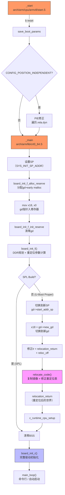
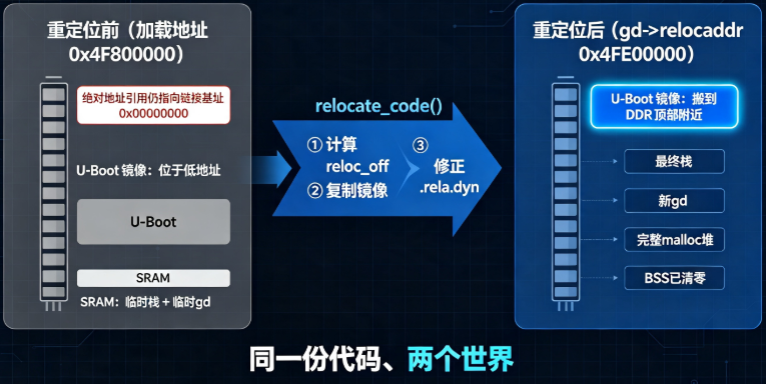

# 7.3.1 _start汇编入口与重定位

> 所属章节：第7章 启动链深度解析 > 7.3 U-Boot
> 
> 难度：[E] | 预计阅读时间：40分钟

## <span class="blue"> 本节导读

7.2 节的终点是 SPL 完成 DDR 初始化，把完整 U-Boot（U-Boot proper）加载进 DDR 并跳转过去。从这一刻起处理器运行的是一个功能完整的引导加载器——但它的第一条指令执行时，连全局变量都还不能用：BSS 段没有清零，栈是临时的，镜像所在的地址和链接脚本里写的地址也不是一回事。本节追踪从 `_start` 到 `board_init_r` 的完整路径，核心是回答一个问题：U-Boot 为什么要在运行时把自己搬一次家，搬家前后分别要做什么。<BR>
本节覆盖：链接地址与加载地址的错位、`_start` 到 `_main` 的最小 C 环境搭建、gd（global data）的设计动机与内存布局、BSS 清零的时机、`relocate_code` 的三步实现、重定位挂死的排查路径。

---

## <span class="blue"> 代码明明能跑，为什么还要搬一次家 [E]

SPL 把 U-Boot proper 加载到 DDR 的某个固定位置（加载地址，如 RK3568 平台上常见的 `0x00A0_0000` 附近），而链接脚本里 `_start` 被安排在 `CONFIG_SYS_TEXT_BASE` 指定的链接地址。两者经常不相等。调试时的典型困惑由此而来：GDB 按链接地址加载符号后，看到的 PC 和符号完全对不上；或者镜像明明已经在新地址运行，第一条涉及全局指针的 C 语句却直接挂死。

这里需要先分清两个地址：**加载地址**是镜像当前实际所在的物理地址，由 SPL 的加载动作决定；**链接地址**是链接器计算所有绝对地址时使用的基准，写死在镜像内部。代码之所以在加载地址上还能跑起来，是因为现代 U-Boot 默认按 PIE（位置无关可执行）方式编译，指令内部的跳转和取数大多是 PC 相对的，不依赖镜像的绝对位置。

但 PIE 救不了所有引用。以下三类地址在编译期就固化成了链接地址的数值，运行时不会自动跟着镜像走：

1. **全局指针的初始值**：`char *banner = "U-Boot";` 这类初始化，存进变量的是字符串在链接地址域中的位置
2. **函数指针表**：驱动操作函数表、命令表里的每一项
3. **链接脚本导出的符号值**：`__bss_start`、`__image_copy_start` 等，在 C 代码里被当作普通地址常量使用

所以 U-Boot 的选择是：与其让全部绝对引用带病运行，不如把镜像整体搬到链接地址（或经规划的新地址），再把所有固化地址统一加上偏移量修正过来——这就是重定位（relocation）。

第二个原因是内存布局。`board_init_f` 里的 `setup_dest_addr()` 会把重定位目标定在 `gd->ram_top` 向下对齐的位置，即 DDR 顶部。这不是随意选的：内核镜像解压、页表、initrd 都要占用 DDR 低端，U-Boot 把低端完整让出来，后面加载内核时就不需要绕开自己。让出的空间有多干净，取决于 U-Boot 搬得有多彻底。

各阶段的职责先给一个全景：

| 阶段 | 源文件 | 关键符号 | 职责 |
|------|--------|---------|------|
| 平台级入口 | `arch/arm/cpu/armv8/start.S` | `_start` → `reset` | 保存启动参数、PIE 入口修正、跳转 `_main` |
| C 运行时搭建 | `arch/arm/lib/crt0_64.S` | `_main` | 设置临时栈、分配并清零 gd、调用 `board_init_f`、驱动重定位 |
| 重定位执行 | `arch/arm/lib/relocate_64.S` | `relocate_code` | 复制镜像、修正 `.rela.dyn`、刷新 Cache |
| 后段初始化 | `common/board_r.c` | `board_init_r` | 完整 C 环境、驱动模型、进入主循环 |


```mermaid
flowchart TD
    A["_start<br/>arch/arm/cpu/armv8/start.S"] -->|"b reset"| B["save_boot_params"]
    B --> C{"CONFIG_POSITION_INDEPENDENT?"}
    C -->|"是"| D["PIE修正<br/>遍历.rela.dyn"]
    C -->|"否"| E["_main<br/>arch/arm/lib/crt0_64.S"]
    D --> E

    E --> F["设置SP（SYS_INIT_SP_ADDR）"]
    F --> G["board_init_f_alloc_reserve<br/>分配gd+early malloc"]
    G --> H["mov x18, x0<br/>gd指针入寄存器"]
    H --> I["board_init_f_init_reserve<br/>清零gd"]
    I --> J["board_init_f()<br/>DDR规划 + 重定位参数计算"]

    J --> K{"SPL Build?"}
    K -->|"是 (SPL)"| L["清零BSS"]
    K -->|"否 (U-Boot Proper)"| M["切换到新SP<br/>gd->start_addr_sp"]

    M --> N["x18 = gd->new_gd<br/>切换到新gd"]
    N --> O["修正lr = relocation_return<br/>+ reloc_off"]
    O --> P["relocate_code()<br/>复制镜像 + 修正重定位表"]
    P --> Q["relocation_return<br/>（重定位后的世界）"]
    Q --> R["c_runtime_cpu_setup"]
    R --> L

    L --> S["board_init_r()<br/>完整驱动初始化"]
    S --> T["main_loop()<br/>命令行 / 自动启动"]

    style A fill:#f96,stroke:#333
    style E fill:#f96,stroke:#333
    style P fill:#f9f,stroke:#333
    style S fill:#bbf,stroke:#333
```

`start.S` 中的 `_start` 本身极其精简，大部分时间只是一个 `b reset`：

```armasm
/* arch/arm/cpu/armv8/start.S */
.globl _start
_start:
#if defined(CONFIG_ENABLE_ARM_SOC_BOOT0_HOOK)
    #include <asm/arch/boot0.h>     /* SoC特定的启动钩子 */
#else
    b   reset
#endif
    .align 3
.globl _TEXT_BASE
_TEXT_BASE:
    .quad   CONFIG_SYS_TEXT_BASE    /* 链接时的基地址，运行时只读 */

reset:
    b   save_boot_params            /* 保存上一级传递的参数 */
.globl save_boot_params_ret
save_boot_params_ret:
#if CONFIG_POSITION_INDEPENDENT && !defined(CONFIG_SPL_BUILD)
    /* PIE入口：修正.rela.dyn重定位项 */
    adr x0, _start                  /* x0 = _start运行时地址 */
    ldr x1, _TEXT_BASE              /* x1 = _start链接地址 */
    subs    x9, x0, x1              /* x9 = 运行时偏移 */
    beq pie_fixup_done              /* 无偏移则跳过 */
    /* 遍历.rela.dyn修正绝对地址引用... */
pie_fixup_done:
#endif
    bl  _main                       /* 进入C运行时搭建 */
```

> 💡 `adr x0, _start` 取到的是 **运行时实际地址**，`ldr x1, _TEXT_BASE` 取到的是 **链接时预设地址**，两者的差值就是镜像被放偏了多少。如果加载地址恰好等于链接地址，差值为零直接跳过修正——这是 U-Boot 能容忍"加载位置不固定"的第一道保险。

---

## <span class="blue"> 搬家之前：用汇编搭出最小 C 世界 [E]

调用第一个 C 函数 `board_init_f` 之前，需要三样东西：一个可用的栈、一个可信的全局数据通道、以及一套明确的内存规划。此刻一样都不具备——BSS 在 DDR 新位置尚未清零，普通全局变量的值是随机垃圾，栈也得临时指定。`_main` 的全部工作就是在汇编里把这三样凑齐，其执行序列可概括为七步：

```armasm
/* arch/arm/lib/crt0_64.S — _main 核心逻辑（注释版） */
ENTRY(_main)
    /* ===== 步骤1：设置初始栈指针 ===== */
#if defined(CONFIG_SPL_BUILD) && defined(CONFIG_SPL_STACK)
    ldr x0, =(CONFIG_SPL_STACK)     /* SPL使用专用栈 */
#else
    ldr x0, =(SYS_INIT_SP_ADDR)     /* U-Boot Proper使用INIT栈 */
#endif
    bic sp, x0, #0xf                /* 16字节对齐，ABI合规 */

    /* ===== 步骤2：为gd分配空间（自顶向下） ===== */
    mov x0, sp
    bl  board_init_f_alloc_reserve  /* 返回gd基地址，栈顶下调 */
    mov sp, x0
    mov x18, x0                     /* x18 = gd（ARM64 ABI保留寄存器）*/

    /* ===== 步骤3：初始化gd结构体 ===== */
    bl  board_init_f_init_reserve   /* 清零gd，设置early malloc */

    /* ===== 步骤4：进入board_init_f（前段C初始化） ===== */
    mov x0, #0
    bl  board_init_f                /* 返回后，DDR已就绪，重定位参数已计算 */

#if !defined(CONFIG_SPL_BUILD)
    /* ===== 步骤5：切换到新栈和新gd（中间环境） ===== */
    ldr x0, [x18, #GD_START_ADDR_SP]
    bic sp, x0, #0xf                /* 切换到DDR中的新栈 */
    ldr x18, [x18, #GD_NEW_GD]      /* x18指向新分配的gd */

    /* ===== 步骤6：调用relocate_code ===== */
    ldr x0, [x18, #GD_RELOCADDR]    /* x0 = 重定位目标地址 */
    b   relocate_code               /* 不返回，直接跳到重定位后的relocation_return */

relocation_return:
    /* ===== 步骤7：清零BSS，进入board_init_r ===== */
    bl  c_runtime_cpu_setup
#endif
    /* 清零BSS段 */
    ldr x0, =__bss_start            /* 这些符号已被重定位修正 */
    ldr x1, =__bss_end
clear_loop:
    str xzr, [x0], #8
    cmp x0, x1
    b.lo    clear_loop

    /* 进入后段C世界 */
    mov x0, x18                     /* x0 = gd */
    ldr x1, [x18, #GD_RELOCADDR]   /* x1 = 重定位地址 */
    b   board_init_r                /* 不返回 */
ENDPROC(_main)
```

board_init_f/board_init_r 的两阶段划分 7.2 节在 SPL 语境下已经讲过，这里只需回扣一句：同一套 crt0 代码在 SPL 和 U-Boot proper 两种配置下编译，SPL 分支跳过重定位直接清 BSS，U-Boot proper 分支才走中间的搬家流程。

### gd：BSS 清零之前唯一可信的全局数据

`board_init_f` 执行期间要记录一批关键参数——DDR 容量、串口波特率、重定位目标地址——并在阶段结束后交给 `relocate_code` 和 `board_init_r` 使用。普通全局变量承担不了这个角色：未初始化的全局变量位于 BSS，此时是随机值；已初始化的全局变量位于 data 段，重定位后引用地址还没修正。U-Boot 的解法是绕开段机制：在栈顶向下挖出一块空间存放一个结构体，用寄存器保存它的指针，全程不依赖任何段——这就是 gd（global data）。

```c
/* include/asm-generic/global_data.h — gd_t 关键字段 */
typedef struct global_data {
    struct bd_info      *bd;            /* 板级信息指针 */
    unsigned long       flags;          /* GD_FLG_* 状态标志 */
    unsigned int        baudrate;       /* 串口波特率 */
    unsigned long       relocaddr;      /* 重定位后的运行地址 */
    phys_size_t         ram_size;       /* DDR总容量 */
    unsigned long       mon_len;        /* U-Boot镜像长度 */
    unsigned long       start_addr_sp;  /* 重定位后的新栈顶 */
    struct global_data  *new_gd;        /* 重定位后的新gd地址 */
    unsigned long       reloc_off;      /* 重定位偏移量 */
    unsigned long       env_addr;       /* 环境变量结构地址 */
    /* ... 更多字段 ... */
} gd_t;
```

| 字段 | 设定时机 | 用途 |
|------|---------|------|
| `bd` | `board_init_f` 中 | 板级信息（DRAM 布局、MAC 地址等），最终传给内核 |
| `flags` | 多阶段更新 | `GD_FLG_RELOC` 标记重定位完成，`GD_FLG_SKIP_RELOC` 跳过重定位 |
| `relocaddr` | `setup_dest_addr` 后 | 重定位目标物理地址，通常是 ram_top 向下规划的结果 |
| `reloc_off` | `setup_reloc` 后 | 偏移量 = 目标地址 − 链接地址，`relocate_code` 的核心参数 |
| `ram_size` | `dram_init` 后 | DDR 总容量，后续所有内存规划的基础 |
| `mon_len` | `setup_mon_len` 后 | U-Boot 镜像总长度（text + rodata + data + bss 预留） |
| `start_addr_sp` | `reserve_stacks` 后 | 重定位后的新栈顶，搬家后切换 |
| `new_gd` | `reserve_global_data` 后 | DDR 顶部为新 gd 预留的位置 |

gd 的分配采用自顶向下策略，和 early malloc 堆挤在同一块临时内存里：

```c
/* common/init/board_init.c */
ulong board_init_f_alloc_reserve(ulong top)
{
    /* 自顶向下：先预留early malloc堆 */
    top -= CONFIG_SYS_MALLOC_F_LEN;       /* 典型值 0x2000 ~ 0x4000 */
    /* 再预留gd_t结构体，16字节对齐 */
    top = rounddown(top - sizeof(gd_t), 16);
    return top;                            /* 返回gd基地址 */
}

void board_init_f_init_reserve(ulong base)
{
    gd_t *gd_ptr = (gd_t *)base;
    memset(gd_ptr, '\0', sizeof(gd_t));   /* gd必须清零 */
    base += roundup(sizeof(gd_t), 16);
    gd_ptr->malloc_base = base;           /* early malloc紧跟gd之后 */
}
```

```
高地址
┌─────────────────┐ ← 原始栈顶（SYS_INIT_SP_ADDR）
│   early malloc  │    CONFIG_SYS_MALLOC_F_LEN
│     堆区域      │
├─────────────────┤ ← board_init_f_alloc_reserve 返回的位置
│     gd_t        │    几百字节，16字节对齐
│   （全局数据）   │
├─────────────────┤ ← 新栈顶（SP下调至此）
│    栈增长方向    │    向下增长
│      ...        │
低地址
```

x18 寄存器传递 gd 指针与内存全局变量两种方案的取舍：

| 方案 | 寄存器保存 gd（ARM64 x18） | 内存全局变量（ARM32 r8） |
|------|------------------------|------------------------|
| **访问速度** | 单周期，无访存延迟 | 需 ldr/str，有内存延迟 |
| **PIE 兼容性** | 天然位置无关，不需重定位修正 | 变量本身的地址需修正 |
| **跨调用持久性** | 依赖 ABI 约定：被调用函数必须保留该寄存器 | 同样依赖 ABI（r8 在 APCS 中保留） |
| **调试便利性** | GDB 中查寄存器 | GDB 中查内存地址 |

> ⚠️ `board_init_f` 阶段的 C 代码里**禁止使用未初始化的全局变量**——包括 `static` 局部变量，它们同样位于 BSS。需要跨函数传递状态时一律走 `gd` 成员。同理，任何被此阶段调用的汇编代码都不能随意占用 x18，否则 `gd->` 访问会落到随机地址上。

> 💡 U-Boot 命令行的 `bdinfo` 可以直接查看 gd 的关键字段。排查重定位问题时，在串口初始化完成后立即执行 `bdinfo`，先确认 `relocaddr` 和 `reloc_off` 是否符合预期，再决定往哪查。

---

## <span class="blue"> relocate_code：复制、修正、刷新三步走 [E]

`board_init_f` 返回时，重定位的三个参数已就位：`gd->relocaddr`（搬到哪）、`gd->reloc_off`（偏多少）、`gd->mon_len`（搬多大）。`relocate_code` 把搬家动作压缩成三步：

```
┌─────────────────────────────────────────────────────────────┐
│  步骤1：计算偏移   步骤2：复制镜像    步骤3：修正重定位表      │
│                                                             │
│  reloc_off =        .text/.data/.rodata   遍历.rela.dyn，   │
│  gd->relocaddr -    从源地址复制到          每个条目地址 +=  │
│  CONFIG_SYS_TEXT_BASE  gd->relocaddr        reloc_off       │
└─────────────────────────────────────────────────────────────┘
```

```armasm
/* arch/arm/lib/relocate_64.S — ARM64重定位核心 */
ENTRY(relocate_code)
    stp x29, x30, [sp, #-32]!       /* 建立栈帧 */
    mov x29, sp
    str x0, [sp, #16]               /* 保存目标地址 */

    /* === 步骤1：计算偏移量 === */
    ldr x1, _TEXT_BASE              /* x1 = 链接地址 */
    subs    x9, x0, x1              /* x9 = 目标地址 - 链接地址 = reloc_off */
    b.eq    relocate_done           /* 偏移为0，无需重定位 */

    /* === 步骤2：复制镜像（16字节批量拷贝） === */
    adrp    x1, __image_copy_start
    add x1, x1, :lo12:__image_copy_start  /* x1 = 源地址 */
    adrp    x2, __image_copy_end
    add x2, x2, :lo12:__image_copy_end    /* x2 = 源结束地址 */

copy_loop:
    ldp x10, x11, [x1], #16       /* 从源加载16字节 */
    stp x10, x11, [x0], #16       /* 存到目标 */
    cmp x1, x2
    b.lo    copy_loop

    /* === 步骤3：修正.rela.dyn重定位表 === */
    adrp    x2, __rel_dyn_start
    add x2, x2, :lo12:__rel_dyn_start
    adrp    x3, __rel_dyn_end
    add x3, x3, :lo12:__rel_dyn_end

fixloop:
    ldp x0, x1, [x2], #16         /* (x0, x1) = (位置, 修正类型) */
    ldr x4, [x2], #8              /* x4 = addend */
    and x1, x1, #0xffffffff
    cmp x1, #R_AARCH64_RELATIVE   /* 只处理R_AARCH64_RELATIVE类型 */
    bne fixnext
    add x0, x0, x9                /* 位置 += reloc_off */
    add x4, x4, x9                /* 修正值 += reloc_off */
    str x4, [x0]                  /* 写回修正后的地址 */
fixnext:
    cmp x2, x3
    b.lo    fixloop

relocate_done:
    /* 刷新Cache确保一致性 */
    ic  iallu                       /* I-Cache全部失效 */
    isb sy
    ldp x0, x1, [sp, #16]
    bl  __asm_flush_dcache_range    /* D-Cache刷新 */
    bl  __asm_flush_l3_dcache
    ldp x29, x30, [sp], #32
    ret                             /* 返回到重定位后的relocation_return */
ENDPROC(relocate_code)
```

### `.rela.dyn` 表：哪些地址需要修正，链接器早就记好了

PIE 编译解决不了的那部分绝对地址引用，链接器并没有丢弃，而是逐一记录在 `.rela.dyn` 段里，等运行时统一结算。每个 RELA 条目三个 64 位字段：

| 字段 | 含义 |
|------|------|
| `r_offset` | 需要修正的内存位置（链接地址域） |
| `r_info` | 低 32 位是重定位类型，高 32 位是符号表索引 |
| `r_addend` | 加数，需叠加到符号值上的偏移 |

`fixloop` 只认 `R_AARCH64_RELATIVE` 一种类型：把 `r_offset` 指向位置的值改写为 `r_addend + reloc_off`。这恰好覆盖了 U-Boot 的全部需求——所有绝对地址统一加上同一个偏移量，无需逐符号解析。

### 返回地址的双重修正：用 `ret` 完成"跃迁"

`relocate_code` 复制完镜像后，自己还在旧镜像里执行，如何干净地切到新镜像？答案藏在调用前对返回地址的预处理里：

```armasm
    adr lr, relocation_return       /* lr = 返回地址（当前运行域的地址） */
#if CONFIG_POSITION_INDEPENDENT
    /* 对返回地址做PIE修正 */
    adrp    x0, _start
    add x0, x0, #:lo12:_start       /* x0 = _start运行时地址 */
    ldr x9, _TEXT_BASE              /* x9 = _start链接地址 */
    sub x9, x9, x0                  /* x9 = 链接地址 - 运行时地址 */
    add lr, lr, x9                  /* lr修正为链接域中的地址 */
#endif
    /* 再叠加reloc_off */
    ldr x9, [x18, #GD_RELOC_OFF]    /* x9 = gd->reloc_off */
    add lr, lr, x9                  /* lr = 重定位后的返回地址 */

    ldr x0, [x18, #GD_RELOCADDR]    /* x0 = 重定位目标地址 */
    b   relocate_code               /* 跳转，返回时将到重定位后的relocation_return */
```

lr 先修正 PIE 偏移（运行域 → 链接域），再叠加 `reloc_off`（链接域 → 重定位后的新运行域）。`relocate_code` 末尾执行 `ret` 时，PC 被装进的是新镜像中 `relocation_return` 的地址——`ret` 不再是"返回原处"，而是直接落入搬家后的世界。旧镜像从这一刻起不再有任何指令被执行，成为等待被覆盖的普通内存。

### 重定位前后的世界对比



| 维度 | 重定位前 | 重定位后 |
|------|---------|---------|
| **代码位置** | 加载地址（SPL 放入的位置） | DDR 顶部规划地址（`gd->relocaddr`） |
| **SP 栈指针** | 临时栈（`SYS_INIT_SP_ADDR`） | DDR 中预留的最终栈（`gd->start_addr_sp`） |
| **gd 位置** | 临时 gd（临时栈区挖出的空间） | 新 gd（DDR 顶部 `gd->new_gd` 区域） |
| **BSS 可用性** | 未清零，不可用 | 已清零，全局变量可用 |
| **malloc** | early malloc（数 KB，`gd->malloc_base`） | 完整 malloc（MB 级，DDR 中预留） |
| **绝对地址引用** | 指向链接地址域，值不正确 | 已统一加上 `reloc_off` 修正 |
| **Cache 状态** | I-Cache 可能持有旧镜像指令 | 全部失效/刷新，一致性保证 |

---

## <span class="blue"> 搬完之后：清 BSS，进 board_init_r [E]

回到新镜像的 `relocation_return` 之后还剩最后一件小事：清零 BSS。C 语言约定未初始化的全局变量值为零，但链接器只为 BSS 段记录了起止边界（`__bss_start` / `__bss_end`），不会在镜像里存放实际的零——清零工作必须由启动代码在新地址上完成。这一步放在重定位之后的原因很直接：在旧地址清零是白做功，镜像一搬就被覆盖。

```armasm
    ldr x0, =__bss_start            /* 符号已被重定位修正，指向新镜像 */
    ldr x1, =__bss_end
clear_loop:
    str xzr, [x0], #8
    cmp x0, x1
    b.lo    clear_loop

    mov x0, x18                     /* x0 = gd */
    ldr x1, [x18, #GD_RELOCADDR]
    b   board_init_r                /* 不返回 */
```

BSS 清零完成，C 语言的全部前提条件第一次同时成立：栈在最终位置、全局变量可信、绝对地址引用已修正、完整 malloc 可用。`board_init_r` 接手后就是纯 C 世界的事——环境变量、驱动模型、命令行，分别由 7.3.2 和 7.3.3 展开。

---

## <span class="blue"> 重定位挂死的排查路径 [E]

某 RK3568 板卡上电后 SPL 正常，U-Boot proper 打印出重定位信息后挂死。按下面的顺序定位。

### 先确认参数，再确认重定位表

在 `_main` 的 `b relocate_code` 前下断点，检查 gd 中的三个参数：`relocaddr`、`reloc_off`、`start_addr_sp`。参数合理的情况下，下一步检查 `.rela.dyn` 段是否存在且非空：

```
readelf -S u-boot | grep rela
readelf -r u-boot | head -20
```

本例的根因就在这里：`readelf -r` 显示 `.rela.dyn` 为空，但镜像里明明有大量绝对地址引用。编译时遗漏了 `-pie` 链接选项，链接器没有生成重定位表，`fixloop` 无事可做直接返回——镜像被复制到了新地址，所有绝对引用却仍指向旧地址，第一条涉及全局指针的 C 语句随即挂死。修复是确认 `Makefile` 的链接标志包含 `-pie`，重新编译后 `.rela.dyn` 正常生成。

> 🔴 `.rela.dyn` 为空或损坏时的症状极具迷惑性：重定位"看起来成功了"（镜像确实搬了家），挂死点却出现在搬家之后的任意位置，和重定位相隔好几个函数。编译后用 `readelf -S u-boot | grep rela` 验证重定位段存在且非空，应当成为移植新平台的固定检查项。

> ⚠️ `relocation_return` 位于重定位后的新镜像中。如果 Cache 一致性维护缺失（比如 I-Cache 未失效），CPU 可能继续执行旧镜像中的指令，后续 BSS 清零实际作用于错误地址，造成无报错的静默数据损坏。`relocate_code` 末尾的 `ic iallu` 和 D-Cache 刷新不是可省略的仪式感。

### 用 GDB 在搬家前后观察 gd

```
(gdb) break relocate_code
(gdb) continue
(gdb) print/x ((gd_t*)$x18)->relocaddr     # 重定位目标地址
(gdb) print/x ((gd_t*)$x18)->reloc_off     # 偏移量
(gdb) print/x ((gd_t*)$x18)->start_addr_sp # 新栈顶
(gdb) print/x ((gd_t*)$x18)->new_gd        # 新gd位置

# 重定位完成后按实际relocaddr重新加载符号
(gdb) add-symbol-file u-boot 0x0DEB0000    # 用实际relocaddr替换
```

无 JTAG 条件下的低成本验证是 `bdinfo`：串口初始化完成后打印的 `relocaddr`、`reloc off` 与预期不符，说明问题出在 `board_init_f` 的内存规划阶段，而不是 `relocate_code` 本身。

---

## <span class="blue"> 本节总结

| 要点 | 内容 |
|------|------|
| **链接地址 vs 加载地址** | 加载地址由 SPL 的加载动作决定，链接地址固化在镜像内部；两者错位是重定位存在的直接原因 |
| **为什么搬到 DDR 顶部** | 修正全部绝对地址引用 + 把 DDR 低端完整留给内核镜像、页表和 initrd |
| **_start → _main** | `_start` 只做参数保存和 PIE 入口修正，C 环境搭建全部在 `crt0_64.S` 的 `_main` |
| **gd 的设计动机** | BSS 未清零、段引用未修正时，用栈顶挖出的结构体 + x18 寄存器传指针，绕开段机制 |
| **board_init_f 的禁区** | 禁用未初始化全局变量和 `static` 局部变量，跨函数状态一律走 gd 成员 |
| **relocate_code 三步** | 计算 `reloc_off` → 16 字节批量复制镜像 → 遍历 `.rela.dyn` 统一加偏移 |
| **跃迁 trick** | lr 经 PIE 偏移 + `reloc_off` 双重修正，`ret` 直接落入新镜像的 `relocation_return` |
| **BSS 清零时机** | 必须在重定位之后、新地址上执行，旧地址清零是白做功 |
| **排查要点** | 先查 gd 参数（`bdinfo`/GDB），再查 `.rela.dyn` 是否生成（`readelf -S`）；空重定位表的症状是搬家后随机挂死 |

> 💡 这一节的每个概念都会在第 7.5 节内核 `_start` 处再次出现：内核同样面对链接地址与加载地址错位、BSS 清零、页表建立前的临时环境。U-Boot 的重定位是理解内核早期初始化最经济的热身。

---

## <span class="blue"> 下一步

搬家完成、BSS 清零，C 环境第一次完整。`board_init_r` 接手后要初始化的第一个大件就是驱动——串口、eMMC、网口这些设备在 U-Boot 里靠什么框架管起来？7.3.2 看 U-Boot 自己的设备模型 DM 框架。

---

## <span class="blue"> 延伸阅读

- U-Boot 源码 `arch/arm/lib/crt0_64.S` 头部注释：`_main` 各步骤的官方文档
- U-Boot 源码 `arch/arm/lib/relocate_64.S` 与 `arch/arm/cpu/armv8/start.S`
- U-Boot 官方文档 `doc/develop/spl.rst`：SPL 与 U-Boot proper 的衔接关系
- ELF for the ARM 64-bit Architecture (AArch64)，`R_AARCH64_RELATIVE` 重定位类型定义
