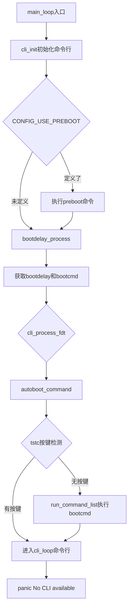

# 7.3.3 bootcmd执行流程与autoboot

> 所属：第7章 引导加载程序深度解析 > 7.3 U-Boot命令体系与环境变量
> 难度：[I→E] | 预计阅读时间：35分钟

## 本节导读

U-Boot完成硬件初始化后，如何决定是否自动启动内核？`bootcmd`中的多行脚本如何被逐条解析执行？autoboot的倒计时逻辑与安全机制又是如何在源码层面实现的？本节从`main_loop()`出发，完整追踪从U-Boot就绪到内核加载的决策链路，深入解析命令解析器、环境变量覆盖优先级以及生产环境中常见的autoboot安全隐患。

---

## 知识点1：main_loop() — U-Boot的终极入口 [I] ~800字

### 问题场景

当`board_init_r()`完成所有驱动初始化、环境变量加载和命令表注册后，控制权交给`main_loop()`。这是U-Boot中唯一一个不会返回的函数（除非autoboot被中断后进入CLI）。理解`main_loop()`的执行骨架，是掌握U-Boot启动决策链的第一步。

### 机制深入

`main_loop()`位于`common/main.c`，其核心逻辑可归纳为五个阶段：



**关键代码路径**：

```c
/* common/main.c */
void main_loop(void)
{
    const char *s;

    bootstage_mark_name(BOOTSTAGE_ID_MAIN_LOOP, "main_loop");
    cli_init();

    if (IS_ENABLED(CONFIG_USE_PREBOOT))
        run_preboot_environment_command();

    s = bootdelay_process();          /* ① 获取 bootcmd 字符串 */
    if (cli_process_fdt(&s))
        cli_secure_boot_cmd(s);

    autoboot_command(s);              /* ② 决策：自动启动 or 进入CLI */

    cli_loop();                       /* ③ 交互式命令循环 */
    panic("No CLI available");
}
```

**阶段解读**：

1. **cli_init()**：初始化命令行解析器。如果使能了`CONFIG_HUSH_PARSER`，则初始化hush shell的词法分析器和变量上下文；否则使用legacy的simple parser。
2. **run_preboot_environment_command()**：在autoboot倒计时之前执行`preboot`环境变量中的命令。常用于在倒计时之前初始化LCD、播放logo或检测按键组合。**注意**：`preboot`的执行不经过`abortboot()`检测，即使用户想进入CLI也必须等待`preboot`完成。
3. **bootdelay_process()**：从环境变量或Device Tree读取`bootdelay`，并根据启动失败历史选择`bootcmd`/`altbootcmd`/`failbootcmd`。
4. **autoboot_command()**：核心的autoboot决策函数。检测用户按键，决定是否执行`bootcmd`。
5. **cli_loop()**：如果autoboot被中断或`bootcmd`执行完毕但内核未成功启动，进入交互式命令行循环。

### 常见陷阱

⚠️ **`preboot`中的命令无法被Ctrl-C中断**：`run_preboot_environment_command()`在`CONFIG_AUTOBOOT_KEYED`使能时会临时关闭Ctrl-C检测（`disable_ctrlc(1)`），直到`preboot`执行完毕。如果`preboot`中有耗时操作（如网络bootp探测），用户将在整个期间失去控制权。

⚠️ **`main_loop()`理论上不会返回**：如果`cli_loop()`由于某种原因返回（如CONFIG_CMDLINE未使能），会触发`panic()`。在精简的SPL配置中需格外留意。

---

## 知识点2：bootcmd解析 — 从字符串到执行流 [E] ~1200字

### 问题场景

`bootcmd`通常不是单一命令，而是一串由分号分隔的多行脚本，例如：

```
run findfdt; run mmcargs; if test ${boot_fit} = yes; then run fitload;
else run mmcload; fi; run bootcmd_${boot_targets}
```

如此复杂的脚本是如何被逐行、逐条解析的？变量替换`${...}`在何时发生？

### 机制深入

`autoboot_command()`最终调用`run_command_list()`来执行`bootcmd`。整个调用链如下：

```
autoboot_command()
  └── run_command_list(cmd, -1, flag)
        ├── #ifdef CONFIG_SYS_HUSH_PARSER
        │     └── parse_string_outer(buff, FLAG_PARSE_SEMICOLON)
        │           └── run_list()
        │                 └── run_list_real()   /* hush shell解析 */
        └── #else
              └── cli_simple_run_command_list()
                    └── cli_simple_run_command()  /* simple parser */
                          └── cmd_process()
                                └── cmd_call()
```

**代码示例：run_command_list的分派逻辑**

```c
/* common/cli.c */
int run_command_list(const char *cmd, int len, int flag)
{
    int need_buff = 1;
    char *buff = (char *)cmd;
    int rcode = 0;

    if (len == -1) {
        len = strlen(cmd);
#ifdef CONFIG_SYS_HUSH_PARSER
        need_buff = 0;  /* hush不会修改输入字符串 */
#else
        /* simple parser会将'\n'替换为'\0'，需要可写buffer */
        need_buff = strchr(cmd, '\n') != NULL;
#endif
    }
    if (need_buff) {
        buff = malloc(len + 1);
        memcpy(buff, cmd, len);
        buff[len] = '\0';
    }
#ifdef CONFIG_SYS_HUSH_PARSER
    rcode = parse_string_outer(buff, FLAG_PARSE_SEMICOLON);
#else
    rcode = cli_simple_run_command_list(buff, flag);
#endif
    if (need_buff)
        free(buff);
    return rcode;
}
```

**两种解析器的对比**：

| 特性 | Simple Parser (legacy) | Hush Parser (推荐) |
|------|----------------------|-------------------|
| 代码体积 | ~3KB | ~15KB |
| 分隔符 | `;` 和 `\n` | 完整shell语法 |
| 条件语句 | 不支持 `if/then/else` | 支持完整控制流 |
| 变量替换 | `${var}` 直接替换 | 支持 `""` 引用和转义 |
| 管道/重定向 | 不支持 | 支持 `\|`、`>`、`>>` |
| 默认配置 | 老旧平台 | v2015.10+ 默认使能 |

对于现代U-Boot（v2015.10+），`CONFIG_SYS_HUSH_PARSER`默认使能，bootcmd实际由hush shell解析。hush的处理流程：`parse_string_outer()` → 词法分析 → 语法树构建 → `run_list_real()`逐节点执行。这解释了为什么现代bootcmd可以书写复杂的条件逻辑。

**bootcmd常用命令速查表**：

| 命令 | 典型用途 | 示例 |
|------|---------|------|
| `run <script>` | 执行其他环境变量脚本 | `run mmcargs` |
| `loady`/`loads` | 串口加载镜像 | `loady ${loadaddr}` |
| `tftpboot` | 网络加载镜像 | `tftpboot ${loadaddr} uImage` |
| `ext4load`/`fatload` | 从FS加载文件 | `ext4load mmc 0:2 ${addr} /boot/uImage` |
| `bootm` | 启动legacy uImage | `bootm ${loadaddr} - ${fdt_addr}` |
| `bootz` | 启动zImage | `bootz ${loadaddr} ${rd_addr} ${fdt_addr}` |
| `booti` | 启动Image (ARM64) | `booti ${kernel_addr} ${rd_addr} ${fdt_addr}` |
| `test` | 条件判断基础 | `if test ${slot} = a; then ...; fi` |
| `setenv` | 动态修改变量 | `setenv bootargs console=ttyS0,115200` |
| `bootstd` | 标准启动流程 (v2023+) | `bootstd boot` |

### 关键代码路径：cli_simple_run_command_list的分割逻辑

对于未使能hush的精简配置，`cli_simple_run_command_list()`使用换行符`\n`分割命令：

```c
/* common/cli_simple.c */
int cli_simple_run_command_list(char *cmd, int flag)
{
    char *line, *next;
    int rcode = 0;

    next = cmd;
    line = cmd;
    while (*next) {
        if (*next == '\n') {
            *next = '\0';           /* 就地替换为字符串结束符 */
            if (*line) {
                debug("** exec: \"%s\"\n", line);
                if (cli_simple_run_command(line, 0) < 0) {
                    rcode = 1;
                    break;          /* 出错即终止后续命令 */
                }
            }
            line = next + 1;
        }
        ++next;
    }
    if (rcode == 0 && *line)
        rcode = (cli_simple_run_command(line, 0) < 0);

    return rcode;
}
```

### Trade-off表格

| 设计选择 | 优势 | 劣势 | 适用场景 |
|---------|------|------|---------|
| Hush Parser | 完整shell语法、可读性强 | 代码体积大(~15KB) | 复杂启动逻辑、现代平台 |
| Simple Parser | 体积小、确定性高 | 仅支持顺序执行 | 资源受限的SPL、安全场景 |
| `\n`分隔多行 | bootcmd可读性好 | 需要额外buffer | 长脚本、团队协作 |
| `;`单行紧凑 | 节省env空间 | 难以阅读调试 | 空间极度受限 |

### 常见陷阱

⚠️ **变量替换的语法差异**：hush parser中，`${var}`与`$var`等价；但在simple parser中某些边缘场景下`$var`可能解析失败。**建议**：始终使用`${var}`的完整括号形式，避免歧义。

⚠️ **命令列表的短路行为差异**：hush parser中，`cmd1; cmd2`的语义是无论`cmd1`是否失败都执行`cmd2`。但用`run a b c`执行多个变量时，**任一失败即终止**。这一微妙差异常导致调试困惑。

💡 **调试技巧**：在开发阶段设置`bootcmd`前加入`echo "bootcmd: ..."`和`setenv stdout serial,vga`可将bootcmd的执行过程输出到串口和显示器，便于定位问题。

---

## 知识点3：autoboot机制 — 倒计时与按键检测 [I] ~1000字

### 问题场景

U-Boot启动时打印的`Hit any key to stop autoboot: 3`从何而来？如果用户按下按键，底层发生了什么？`bootdelay=0`时为何有时仍能打断？生产环境中如何加固autoboot防止恶意中断？

### 机制深入

autoboot的核心决策集中在`common/autoboot.c`中，涉及三个关键函数：

#### 1. bootdelay_process() — 启动参数的收集

```c
/* common/autoboot.c */
const char *bootdelay_process(void)
{
    char *s;
    int bootdelay;

    bootcount_inc();                          /* 启动计数+1 */
    s = env_get("bootdelay");
    bootdelay = s ? (int)simple_strtol(s, NULL, 10) : CONFIG_BOOTDELAY;

    /* Device Tree可覆盖环境变量（签名DT的安全性考量） */
    if (IS_ENABLED(CONFIG_OF_CONTROL))
        bootdelay = ofnode_conf_read_int("bootdelay", bootdelay);

    if (IS_ENABLED(CONFIG_AUTOBOOT_MENU_SHOW))
        bootdelay = menu_show(bootdelay);     /* 显示启动菜单 */

    bootretry_init_cmd_timeout();

    /* POST失败 → failbootcmd; 启动计数错误 → altbootcmd */
#ifdef CONFIG_POST
    if (gd->flags & GD_FLG_POSTFAIL)
        s = env_get("failbootcmd");
    else
#endif
    if (bootcount_error())
        s = env_get("altbootcmd");
    else
        s = env_get("bootcmd");

    stored_bootdelay = bootdelay;
    return s;
}
```

**环境变量覆盖优先级**：Device Tree `/config`节点 > 环境变量`bootdelay` > `CONFIG_BOOTDELAY`编译默认值。其中DT的覆盖常用于安全场景——签名DT可确保`bootdelay=-1`时无法通过env修改来恢复交互式启动。

#### 2. autoboot_command() — 决策中枢

```c
/* common/autoboot.c */
void autoboot_command(const char *s)
{
    debug("### main_loop: bootcmd=\"%s\"\n", s ? s : "<UNDEFINED>");

    if (s && (stored_bootdelay == -2 ||
              (stored_bootdelay != -1 && !abortboot(stored_bootdelay))))
    {
        bool lock;
        int prev;

        lock = autoboot_keyed() && !IS_ENABLED(CONFIG_AUTOBOOT_KEYED_CTRLC);
        if (lock)
            prev = disable_ctrlc(1);    /* 执行bootcmd期间关闭Ctrl-C */

        run_command_list(s, -1, 0);

        if (lock)
            disable_ctrlc(prev);         /* 恢复Ctrl-C检测 */
    }

    /* 检测是否按下了菜单键 */
    if (IS_ENABLED(CONFIG_AUTOBOOT_USE_MENUKEY) && menukey == AUTOBOOT_MENUKEY)
    {
        s = env_get("menucmd");
        if (s)
            run_command_list(s, -1, 0);
    }
}
```

**bootdelay语义**：

| bootdelay值 | 行为 |
|------------|------|
| `-2` | **立即启动**，不打印提示、不检测按键 |
| `-1` | **仅按空格停止**，显示提示但倒计时无限（仅keyed模式下有意义） |
| `0` | 打印提示后立即启动，几乎无法打断（取决于终端响应速度） |
| `N > 0` | 倒计时N秒，`Hit any key to stop autoboot` |

#### 3. abortboot() — 按键检测的双模实现

```
abortboot()
  ├── autoboot_keyed() == true
  │     └── abortboot_key_sequence()      /* 安全模式：需输入特定字符串 */
  │           ├── passwd_abort_crypt()    /* crypt加密密码验证 */
  │           ├── passwd_abort_sha256()   /* SHA256哈希验证 */
  │           └── passwd_abort_key()      /* 明文密钥比对 */
  └── autoboot_keyed() == false
        └── abortboot_single_key()        /* 传统模式：任意键打断 */
```

**传统模式**（`abortboot_single_key`）的倒计时循环：

```c
static int abortboot_single_key(int bootdelay)
{
    int abort = 0;
    unsigned long ts;

    print_boot_delay(bootdelay);

    /* 检查启动前是否已有按键缓存 */
    if (tstc()) {           /* tstc() = test character, 非阻塞检测 */
        getchar();          /* 消费该字符 */
        abort = 1;
    }

    while ((bootdelay > 0) && (!abort)) {
        --bootdelay;
        ts = get_timer(0);
        do {
            if (tstc()) {           /* 每秒内轮询100次 */
                abort = 1;
                bootdelay = 0;
                menukey = getchar(); /* 记录按键 */
                break;
            }
            udelay(10000);          /* 10ms轮询间隔 */
        } while (!abort && get_timer(ts) < 1000);

        print_boot_delay(bootdelay);
    }
    putc('\n');
    return abort;
}
```

**关键实现细节**：

- `tstc()`（test character）是非阻塞的串口输入检测，底层调用驱动层的`tstc()`实现。
- 轮询间隔10ms意味着最大检测延迟为10ms（对human按键完全可接受）。
- `get_timer(ts) < 1000`以毫秒为单位的软件定时，不依赖中断。

### 实践案例：加固生产设备的autoboot安全

**场景**：某工业网关产品部署于户外机柜，需防止攻击者通过串口进入U-Boot命令行修改启动参数。

**加固方案**：

```
# Kconfig
CONFIG_AUTOBOOT_KEYED=y
CONFIG_AUTOBOOT_STOP_STR="mys3cr3t"
CONFIG_AUTOBOOT_PROMPT="Booting in %d seconds...\n"
CONFIG_AUTOBOOT_ENCRYPTION=y
CONFIG_AUTOBOOT_STOP_STR_CRYPT="$5$rounds=5000$saltsalt$encryptedhash"
```

**效果**：
- 用户必须输入正确密码才能进入CLI，任意按键不再中断autoboot。
- 密码使用SHA256-crypt哈希存储，抵抗暴力破解。
- 倒计时提示中不暴露安全功能的存在。

🔴 **安全警告**：`CONFIG_AUTOBOOT_STOP_STR`以明文编译到U-Boot镜像中，可通过`strings u-boot.bin | grep "stop"`提取。**强烈建议**使用`CONFIG_AUTOBOOT_STOP_STR_CRYPT`配合加密哈希，或至少使用`CONFIG_AUTOBOOT_STOP_STR_SHA256`。

### 常见陷阱

⚠️ **`bootdelay=0`不是绝对安全**：在某些慢速终端（如USB-CDC-ACM转串口）上，字符传输延迟可能超过autoboot检测的时间窗口，导致用户"明明按了键却没打断"。如果这是安全需求场景，应该使用`CONFIG_AUTOBOOT_KEYED`而非依赖`bootdelay=0`。

⚠️ **`bootstopkeycrypt`环境变量的安全风险**：U-Boot默认允许从环境变量`bootstopkeycrypt`读取停止字符串（`passwd_abort_crypt()`中的`env_get("bootstopkeycrypt")`）。如果攻击者可通过`fw_setenv`修改env，就能将停止字符串设为已知值。**建议**：打上禁用env覆盖的patch，固定使用编译期`AUTOBOOT_STOP_STR_CRYPT`。

💡 **调试autoboot的秘诀**：定义`#define DEBUG_BOOTKEYS 1`后重新编译，`abortboot`的检测细节会通过`debug_bootkeys()`宏输出到串口。比盲目猜测按键是否被检测更可靠。

---

## 本节总结

`main_loop()` → `bootdelay_process()` → `autoboot_command()` → `run_command_list()`构成了U-Boot启动决策的完整链路。

- **`bootdelay_process()`** 负责从多层配置源（env → DT → 编译默认值）收集启动参数，并根据启动失败历史选择不同的启动命令（`bootcmd` / `altbootcmd` / `failbootcmd`）。
- **`autoboot_command()`** 是决策中枢：若`bootdelay=-2`则直接启动；若`bootdelay>=0`则调用`abortboot()`检测用户输入；否则跳过启动进入CLI。
- **`abortboot()`** 支持两种模式：传统"任意键打断"模式适用于开发调试；`CONFIG_AUTOBOOT_KEYED`模式通过密码/哈希验证加固生产环境。
- **命令解析**推荐使用hush parser（现代默认），支持完整的条件控制和错误处理。Simple parser仅适用于极度资源受限的场景。

理解这一流程链，不仅有助于调试"U-Boot不自动启动""按键无法打断"等常见问题，更能在安全设计中做出合理的trade-off决策。

---

## 配套资源

### 表格清单

| 表格编号 | 名称 | 说明 |
|---------|------|------|
| 表1 | Simple Parser vs Hush Parser 对比 | 两种命令解析器的特性对比 |
| 表2 | bootcmd常用命令速查 | 自动启动脚本中的高频命令 |
| 表3 | bootdelay值语义表 | 不同bootdelay值的精确行为 |
| 表4 | Trade-off：解析器与设计选择 | 技术选型的结构化对比 |
| 表5 | autoboot关键配置项 | 安全加固的Kconfig配置参考 |

### 图示清单（mermaid代码）

- **图1**：`main_loop`执行流程图（知识点1，flowchart TD类型）
- **图2**：`abortboot`双模实现调用关系（知识点3，ASCII调用树）

### 代码清单

| 代码编号 | 文件路径 | 说明 |
|---------|---------|------|
| 代码1 | `common/main.c:main_loop()` | U-Boot主循环入口 |
| 代码2 | `common/cli.c:run_command_list()` | 命令列表分派与解析器选择 |
| 代码3 | `common/cli_simple.c:cli_simple_run_command_list()` | Simple parser的分割逻辑 |
| 代码4 | `common/autoboot.c:bootdelay_process()` | 启动参数收集与环境选择 |
| 代码5 | `common/autoboot.c:autoboot_command()` | autoboot决策中枢 |
| 代码6 | `common/autoboot.c:abortboot_single_key()` | 传统按键检测倒计时循环 |

### 参考配置项

```
# 开发调试配置
CONFIG_BOOTDELAY=3
CONFIG_SYS_HUSH_PARSER=y
# CONFIG_AUTOBOOT_KEYED is not set

# 生产安全配置
CONFIG_BOOTDELAY=-1
CONFIG_AUTOBOOT_KEYED=y
CONFIG_AUTOBOOT_STOP_STR_CRYPT="..."
CONFIG_AUTOBOOT_PROMPT="Booting system...\n"
```
