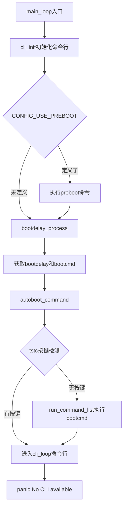

# 7.3.3 bootcmd执行流程与autoboot

> 所属：第7章 系统启动全链路 > 7.3 U-Boot：完整的引导加载器
> 
> 难度：[I→E] | 预计阅读时间：35分钟

## <span class="blue"> 本节导读

7.3.2 结束时，`board_init_r` 已经把驱动和环境变量准备妥当，控制权交给 `main_loop()`。接下来串口上出现那行熟悉的 `Hit any key to stop autoboot: 3`——倒计时归零、没人按键，内核就开始加载。这几秒钟里 U-Boot 到底做了什么决策：`bootcmd` 这串分号分隔的脚本是被谁、按什么规则逐条展开的？环境变量在里面扮演什么角色？倒计时能不能被打断、由什么决定？本节沿"倒计时之后发生了什么"这条主线，走完从 `main_loop()` 到 `booti` 启动内核的完整决策链。<BR>
本节覆盖：`main_loop()` 的执行骨架、`bootcmd` 字符串的解析与变量替换、bootdelay 的取值语义与多层配置来源、环境变量在启动决策中的参与方式、autoboot 按键检测的双模实现、生产环境的常见定制点与安全加固。

---

## <span class="blue"> 倒计时归零之后：`main_loop()` 的五步决策 [I]

`main_loop()` 是 U-Boot 里唯一设计上不返回的函数，位于 `common/main.c`。它的骨架只有五件事：


```mermaid
flowchart TD
    A[main_loop入口] --> B[cli_init初始化命令行]
    B --> C{CONFIG_USE_PREBOOT}
    C -->|定义了| D[执行preboot命令]
    C -->|未定义| E[bootdelay_process]
    D --> E
    E --> F[获取bootdelay和bootcmd]
    F --> G[autoboot_command]
    G --> H{tstc按键检测}
    H -->|无按键| I[run_command_list执行bootcmd]
    H -->|有按键| J[进入cli_loop命令行]
    I --> J
    J --> K[panic No CLI available]
```

```c
/* common/main.c */
void main_loop(void)
{
    const char *s;

    bootstage_mark_name(BOOTSTAGE_ID_MAIN_LOOP, "main_loop");
    cli_init();

    if (IS_ENABLED(CONFIG_USE_PREBOOT))
        run_preboot_environment_command();

    s = bootdelay_process();          /* ① 收集启动参数，选定bootcmd字符串 */
    if (cli_process_fdt(&s))
        cli_secure_boot_cmd(s);

    autoboot_command(s);              /* ② 决策：自动启动 or 进入命令行 */

    cli_loop();                       /* ③ 交互式命令循环 */
    panic("No CLI available");
}
```

五步的职责：

1. **cli_init()**：初始化命令行解析器。使能 `CONFIG_SYS_HUSH_PARSER` 时初始化 hush shell 的词法分析器和变量上下文，否则用 legacy simple parser。
2. **preboot**：倒计时之前先执行 `preboot` 环境变量里的命令，常用于初始化 LCD 显示 logo、检测特殊按键组合。它在 autoboot 检测之前执行，用户想打断也得等它跑完。
3. **bootdelay_process()**：收集 `bootdelay` 和启动命令字符串——这是环境变量第一次参与启动决策，细节见下一节。
4. **autoboot_command()**：决策中枢。检测按键，决定执行 `bootcmd` 还是落入命令行。
5. **cli_loop()**：autoboot 被中断，或 `bootcmd` 执行完但内核没起来（比如镜像校验失败返回），进入交互式命令行。

> ⚠️ `preboot` 里的命令在使能 `CONFIG_AUTOBOOT_KEYED` 时会临时关闭 Ctrl-C 检测（`disable_ctrlc(1)`），直到执行完毕才恢复。`preboot` 里放了耗时操作（如网络探测）时，用户在这段时间内完全失去打断能力，开发阶段排查"按键没反应"先检查这里。

> ⚠️ `main_loop()` 设计上不返回。`cli_loop()` 因配置原因（如命令行未使能）意外返回时会触发 `panic()`——在极度精简的配置里遇到莫名的 panic，检查 `CONFIG_CMDLINE` 是否被裁掉了。

---

## <span class="blue"> bootcmd 这串脚本是被谁展开的 [E]

`bootcmd` 通常不是一条命令，而是一串分号分隔的脚本：

```
run findfdt; run mmcargs; if test ${boot_fit} = yes; then run fitload;
else run mmcload; fi; run bootcmd_${boot_targets}
```

这串文本躺在环境变量里只是字符，把它变成执行流的调用链是：

```
autoboot_command()
  └── run_command_list(cmd, -1, flag)
        ├── #ifdef CONFIG_SYS_HUSH_PARSER
        │     └── parse_string_outer(buff, FLAG_PARSE_SEMICOLON)
        │           └── run_list_real()        /* hush shell解析执行 */
        └── #else
              └── cli_simple_run_command_list()
                    └── cli_simple_run_command()
                          └── cmd_process()    /* simple parser */
```

分派逻辑本身很短，但有一个值得注意的实现差异：

```c
/* common/cli.c */
int run_command_list(const char *cmd, int len, int flag)
{
    int need_buff = 1;
    char *buff = (char *)cmd;
    int rcode = 0;

    if (len == -1) {
        len = strlen(cmd);
#ifdef CONFIG_SYS_HUSH_PARSER
        need_buff = 0;  /* hush不会修改输入字符串 */
#else
        /* simple parser会将'\n'替换为'\0'，需要可写buffer */
        need_buff = strchr(cmd, '\n') != NULL;
#endif
    }
    if (need_buff) {
        buff = malloc(len + 1);
        memcpy(buff, cmd, len);
        buff[len] = '\0';
    }
#ifdef CONFIG_SYS_HUSH_PARSER
    rcode = parse_string_outer(buff, FLAG_PARSE_SEMICOLON);
#else
    rcode = cli_simple_run_command_list(buff, flag);
#endif
    if (need_buff)
        free(buff);
    return rcode;
}
```

### 两种解析器决定 bootcmd 能写什么

| 特性 | Simple Parser（legacy） | Hush Parser（推荐） |
|------|----------------------|-------------------|
| 代码体积 | 约 3KB | 约 15KB |
| 分隔符 | `;` 和 `\n` | 完整 shell 语法 |
| 条件语句 | 不支持 `if/then/else` | 支持完整控制流 |
| 变量替换 | `${var}` 直接替换 | 支持引号包裹和转义 |
| 管道/重定向 | 不支持 | 支持 |
| 默认配置 | 老旧平台 | v2015.10 起默认使能 |

现代 U-Boot 默认走 hush，bootcmd 里才能写条件分支。simple parser 只在极度受限的场景使用——它对命令列表的处理是把 `\n` 就地替换成 `\0` 后逐条执行，遇错即终止。

### 变量替换发生在什么时候

`${var}` 的展开不是预处理一遍全文，而是在每条命令执行前、按 hush 的词法规则就地展开的。这解释了一个常见现象：bootcmd 前半段用 `setenv` 改的变量，后半条命令读到的是新值。也意味着 `${boot_targets}` 这类嵌套展开（先展开变量名本身，再取对应变量的值）依赖 hush 的两轮处理。

bootcmd 里的高频命令：

| 命令 | 典型用途 | 示例 |
|------|---------|------|
| `run <script>` | 执行另一个环境变量脚本 | `run mmcargs` |
| `tftpboot` | 网络加载镜像 | `tftpboot ${loadaddr} Image` |
| `ext4load`/`fatload` | 从文件系统加载 | `ext4load mmc 0:2 ${addr} /boot/Image` |
| `bootm` | 启动 legacy uImage | `bootm ${loadaddr} - ${fdt_addr}` |
| `bootz` | 启动 zImage | `bootz ${loadaddr} ${rd_addr} ${fdt_addr}` |
| `booti` | 启动 ARM64 Image | `booti ${kernel_addr} ${rd_addr} ${fdt_addr}` |
| `test` | 条件判断 | `if test ${slot} = a; then ...; fi` |
| `setenv` | 动态修改变量 | `setenv bootargs console=ttyS2,1500000` |
| `bootstd` | 标准启动流程（v2023+） | `bootstd boot` |

> ⚠️ 变量引用始终写 `${var}` 的完整括号形式。hush 里 `$var` 多数情况等价，但 simple parser 的某些边缘场景下会解析失败，移植老脚本到新平台时这是隐性炸弹。

> ⚠️ `cmd1; cmd2` 在 hush 里是无论 `cmd1` 成败都执行 `cmd2`；但 `run a b c` 一次执行多个变量时，任一失败即终止后续。两种写法的短路语义不同，调试 bootcmd 时容易在这里产生误判。

> 💡 开发阶段定位 bootcmd 问题，先 `setenv bootcmd 'echo step1; xxx; echo step2; yyy'` 分段打桩，比一口气猜整条脚本哪里断掉要快得多。串口日志里每条命令的执行结果也会带 `## Error:` 前缀，顺着第一个错误查。

---

## <span class="blue"> 环境变量怎么参与启动决策 [I]

`bootdelay_process()` 是环境变量进入启动决策的入口。它做的事可以归纳为一行优先级链加一条分支选择：

```c
/* common/autoboot.c */
const char *bootdelay_process(void)
{
    char *s;
    int bootdelay;

    bootcount_inc();                          /* 启动计数+1 */
    s = env_get("bootdelay");
    bootdelay = s ? (int)simple_strtol(s, NULL, 10) : CONFIG_BOOTDELAY;

    /* Device Tree可覆盖环境变量（签名DT的安全性考量） */
    if (IS_ENABLED(CONFIG_OF_CONTROL))
        bootdelay = ofnode_conf_read_int("bootdelay", bootdelay);

    if (IS_ENABLED(CONFIG_AUTOBOOT_MENU_SHOW))
        bootdelay = menu_show(bootdelay);     /* 显示启动菜单 */

    bootretry_init_cmd_timeout();

    /* POST失败 → failbootcmd; 启动计数异常 → altbootcmd */
#ifdef CONFIG_POST
    if (gd->flags & GD_FLG_POSTFAIL)
        s = env_get("failbootcmd");
    else
#endif
    if (bootcount_error())
        s = env_get("altbootcmd");
    else
        s = env_get("bootcmd");

    stored_bootdelay = bootdelay;
    return s;
}
```

### bootdelay 的三层来源与取值语义

`bootdelay` 的生效值按 **设备树 `/config` 节点 > 环境变量 > `CONFIG_BOOTDELAY` 编译默认值** 的优先级决定。设备树能盖过环境变量这一点专为安全场景设计：签名设备树里写死 `bootdelay`，攻击者改了 env 也恢复不了交互式启动。

| bootdelay 值 | 行为 |
|------------|------|
| `-2` | 立即启动，不打印提示、不检测按键 |
| `-1` | 不自动启动，直接等用户输入（仅 keyed 模式下有特殊语义） |
| `0` | 打印提示后立即启动，几乎无法打断 |
| `N > 0` | 倒计时 N 秒，期间任意键（或密钥序列）可打断 |

### bootcmd 不是唯一的启动命令

返回的启动命令字符串有三个候选：正常路径用 `bootcmd`；使能 bootcount 且启动次数超限（上次启动失败没来得及清零）时用 `altbootcmd`；使能 POST 且上电自检失败时用 `failbootcmd`。这套机制是给无人值守设备准备的兜底——主系统起不来时自动切到恢复系统或降级镜像，不需要人到现场按键。

`bootargs` 也在这里值得提一句：它不在 `bootdelay_process()` 里处理，而是作为环境变量被 bootcmd 脚本（如 `run mmcargs`）拼接，最终由 `booti`/`bootm` 写入设备树的 `chosen` 节点传给内核。U-Boot 改设备树的完整机制是 7.4 节的内容，本节只需记住：**`bootargs` 的拼接发生在 bootcmd 展开阶段，是环境变量对内核启动参数的唯一注入点**。

---

## <span class="blue"> autoboot：倒计时的实现与按键检测 [E]

`autoboot_command()` 拿到的就是上一步选定的命令字符串，它的决策逻辑集中在一个条件判断上：

```c
/* common/autoboot.c */
void autoboot_command(const char *s)
{
    debug("### main_loop: bootcmd=\"%s\"\n", s ? s : "<UNDEFINED>");

    if (s && (stored_bootdelay == -2 ||
              (stored_bootdelay != -1 && !abortboot(stored_bootdelay))))
    {
        bool lock;
        int prev;

        lock = autoboot_keyed() && !IS_ENABLED(CONFIG_AUTOBOOT_KEYED_CTRLC);
        if (lock)
            prev = disable_ctrlc(1);    /* 执行bootcmd期间关闭Ctrl-C */

        run_command_list(s, -1, 0);

        if (lock)
            disable_ctrlc(prev);         /* 恢复Ctrl-C检测 */
    }

    /* 检测是否按下了菜单键 */
    if (IS_ENABLED(CONFIG_AUTOBOOT_USE_MENUKEY) && menukey == AUTOBOOT_MENUKEY)
    {
        s = env_get("menucmd");
        if (s)
            run_command_list(s, -1, 0);
    }
}
```

三个分支一目了然：`bootdelay == -2` 无条件立即执行；`-1` 跳过执行落入命令行；其余值调用 `abortboot()` 倒计时，没人打断才执行。

### 按键检测的双模实现

`abortboot()` 底下有两条路径，由 `autoboot_keyed()` 选择：

```
abortboot()
  ├── autoboot_keyed() == true          /* 安全模式 */
  │     └── abortboot_key_sequence()
  │           ├── passwd_abort_crypt()  /* crypt加密密码验证 */
  │           ├── passwd_abort_sha256() /* SHA256哈希验证 */
  │           └── passwd_abort_key()    /* 明文密钥比对 */
  └── autoboot_keyed() == false         /* 传统模式 */
        └── abortboot_single_key()      /* 任意键打断 */
```

传统模式的倒计时循环值得看一眼实现，因为它解释了"为什么 `bootdelay=0` 有时还能被打断"：

```c
static int abortboot_single_key(int bootdelay)
{
    int abort = 0;
    unsigned long ts;

    print_boot_delay(bootdelay);

    /* 倒计时开始前先检查串口缓冲区里是否已有按键 */
    if (tstc()) {           /* tstc() = test character, 非阻塞检测 */
        getchar();
        abort = 1;
    }

    while ((bootdelay > 0) && (!abort)) {
        --bootdelay;
        ts = get_timer(0);
        do {
            if (tstc()) {           /* 每秒内轮询约100次 */
                abort = 1;
                bootdelay = 0;
                menukey = getchar();
                break;
            }
            udelay(10000);          /* 10ms轮询间隔 */
        } while (!abort && get_timer(ts) < 1000);

        print_boot_delay(bootdelay);
    }
    putc('\n');
    return abort;
}
```

两个实现细节：`tstc()` 是非阻塞的串口检测，进入循环前先查一次缓冲区——所以 `bootdelay=0` 时，如果终端提前把字符送进了 FIFO，仍会被这次检查捕获；轮询间隔 10ms，意味着按键检测的最大延迟是 10ms，对人手完全够用，但整个计时是纯软件轮询，不依赖中断。

> ⚠️ `bootdelay=0` 不构成安全边界。慢速终端（USB 转串口）上字符到达有延迟，会出现"明明按了键却没打断"；反过来，提前敲击的按键又可能在 `bootdelay=0` 下意外打断启动。安全需求场景必须用 `CONFIG_AUTOBOOT_KEYED`，而不是依赖缩短倒计时。

---

## <span class="blue"> 常见定制点与生产加固 [E]

理解了决策链，定制就是往链路的固定位置放东西：

| 定制点 | 位置 | 典型用途 |
|-------|------|---------|
| `preboot` | 倒计时之前 | 显示 logo、检测按键组合、预初始化显示 |
| `bootdelay` | `bootdelay_process()` | 控制倒计时长度或关闭自动启动 |
| `bootcmd` / `altbootcmd` | 启动命令选择 | 主启动脚本 / 启动失败兜底脚本 |
| `menucmd` + `AUTOBOOT_MENUKEY` | autoboot 之后 | 特定按键进入维护菜单 |
| `bootretry` | bootcmd 失败返回后 | 失败后重试或降级 |
| bootstd（v2023+） | 替代手写 bootcmd | 标准化的启动设备扫描流程 |

生产环境防止串口进入命令行的加固配置：

```
# Kconfig
CONFIG_AUTOBOOT_KEYED=y
CONFIG_AUTOBOOT_STOP_STR="mys3cr3t"
CONFIG_AUTOBOOT_PROMPT="Booting in %d seconds...\n"
CONFIG_AUTOBOOT_ENCRYPTION=y
CONFIG_AUTOBOOT_STOP_STR_CRYPT="$5$rounds=5000$saltsalt$encryptedhash"
```

加固后的行为：任意按键不再打断 autoboot，必须输入正确密钥序列；密钥以 SHA256-crypt 哈希形式编译进镜像；倒计时提示语不暴露任何安全机制的存在。

> 🔴 `CONFIG_AUTOBOOT_STOP_STR` 明文编译进镜像，`strings u-boot.bin` 即可提取。生产固件必须用 `CONFIG_AUTOBOOT_STOP_STR_CRYPT` 或至少 `CONFIG_AUTOBOOT_STOP_STR_SHA256`。另一个隐蔽缺口是 `passwd_abort_crypt()` 会读环境变量 `bootstopkeycrypt`——攻击者通过 `fw_setenv` 就能替换停止密钥，需要打补丁禁用这个 env 覆盖、固定使用编译期哈希。

> 💡 调试按键检测是否生效，编译时定义 `DEBUG_BOOTKEYS`，`abortboot` 的检测细节会通过 `debug_bootkeys()` 输出到串口，比反复猜测按键是否被捕获可靠。

开发调试与生产加固两组参考配置：

```
# 开发调试
CONFIG_BOOTDELAY=3
CONFIG_SYS_HUSH_PARSER=y
# CONFIG_AUTOBOOT_KEYED is not set

# 生产安全
CONFIG_BOOTDELAY=-1
CONFIG_AUTOBOOT_KEYED=y
CONFIG_AUTOBOOT_STOP_STR_CRYPT="..."
CONFIG_AUTOBOOT_PROMPT="Booting system...\n"
```

---

## <span class="blue"> 本节总结

| 要点 | 内容 |
|------|------|
| **决策链路** | `main_loop()` → `bootdelay_process()` → `autoboot_command()` → `run_command_list()` → `cli_loop()` |
| **bootcmd 解析** | 默认 hush parser，支持条件分支与嵌套变量展开；`${var}` 在每条命令执行前就地展开 |
| **bootdelay 来源** | 设备树 `/config` 节点 > 环境变量 > 编译默认值；签名 DT 可锁死交互入口 |
| **bootdelay 语义** | `-2` 立即启动、`-1` 不自动启动、`0` 几乎不可打断、`N` 倒计时 N 秒 |
| **启动命令三候选** | `bootcmd`（正常）/ `altbootcmd`（启动计数超限）/ `failbootcmd`（POST 失败），无人值守兜底 |
| **bootargs 注入点** | 在 bootcmd 展开阶段拼接，由 `booti`/`bootm` 写入设备树 `chosen` 节点（详见 7.4） |
| **按键检测** | 纯软件 10ms 轮询 `tstc()`；`bootdelay=0` 不是安全边界，缓冲区已有字符仍会被捕获 |
| **生产加固** | `CONFIG_AUTOBOOT_KEYED` + `STOP_STR_CRYPT`；禁用 `bootstopkeycrypt` env 覆盖；preboot 期间用户无法打断 |

> 💡 到这里，7.3 节走完了一条完整路径：`_start` 搭环境（7.3.1）→ DM 就绪驱动（7.3.2）→ autoboot 决策并加载内核（7.3.3）。下一节进入 7.4，看 U-Boot 把控制权交给内核前的最后一件事——修改并传递设备树。

---

## <span class="blue"> 延伸阅读

- U-Boot 源码 `common/main.c`、`common/autoboot.c`、`common/cli.c`：本节全部代码路径
- U-Boot 官方文档 `doc/usage/environment.rst`：环境变量机制
- U-Boot 官方文档 `doc/develop/bootstd/`：标准启动流程（v2023+ 的 bootcmd 替代方案）
- hush shell 源码 `common/cli_hush.c`：解析器实现细节
