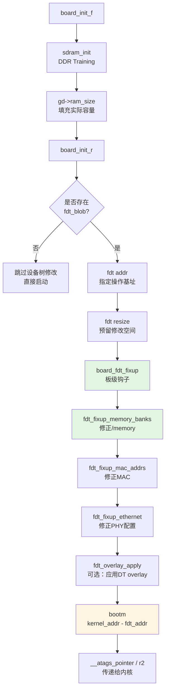

# 7.4.1 U-Boot如何修改设备树

> 所属：第7章 启动引导与Bootloader > 7.4 设备树传递与修改
> 难度：[I→E] | 预计阅读时间：35分钟

## 本节导读

设备树（Device Tree）本质上是硬件描述的"静态蓝图"，但嵌入式系统中有大量信息只有在启动运行时才能确定——DDR实际容量、MAC地址、修订版差异等。本节从工程实践出发，深入U-Boot的`fdt`命令族与`libfdt`库，揭示Bootloader如何动态修补设备树，确保内核拿到的是精确匹配当前硬件的"活配置"。

---

## 知识点1：为什么U-Boot要修改设备树 [I] ~600字

### 问题场景

假设你维护一块ARM64工业网关板卡，硬件存在R1.0/R1.1两个版本：R1.0使用128MB DDR3，R1.1升级为256MB；R1.1还额外增加了一个USB Hub。你的软件团队希望**只编译一个U-Boot镜像**来适配两个版本。怎么办？

另一个更常见的场景：MAC地址需要从EEPROM或OTP寄存器中读取，每台设备的地址都不同，不可能在编译DTS时硬编码。

### 三类修改动机

| 动机类别 | 典型场景 | 信息来源 |
|---------|---------|---------|
| **运行时检测** | 内存大小、CPU频率、温度传感器校准值 | DDR Training结果、PMIC寄存器、ADC采样 |
| **产品差异化** | 不同版本PCB的器件差异、可选配件检测 | GPIO电平、EEPROM版本字、电阻跨接检测 |
| **个性化配置** | MAC地址、序列号、启动参数 | OTP/eMMC/i2C EEPROM中的制造数据 |

U-Boot作为硬件世界的"最后守门人"，有责任在把控制权交给Linux之前，将设备树修正为反映**真实硬件状态**的活文档。

### 内核视角的依赖链

```
U-Boot加载.dtb → 检测硬件实际参数 → 修改设备树节点 → 通过r2寄存器传递给内核
```

⚠️ **关键约束**：U-Boot修改后的设备树必须**严格符合DT Spec v0.2+**语法，否则内核解析时会静默跳过或触发`pr_err()`级别的错误。常见的失败模式是属性字节序（big-endian）与长度不匹配。

---

## 知识点2：fdt命令机制 [E] ~1200字

### libfdt在U-Boot中的架构位置

U-Boot不直接裸写FDT二进制，而是封装了PowerPC社区维护的`libfdt`库（位于`scripts/dtc/libfdt/`）。`libfdt`提供对Flattened Device Tree的只读/读写操作，U-Boot在其之上封装了`cmd/fdt.c`中的交互式命令。

```
┌─────────────────────────────────────┐
│         U-Boot Shell (CLI)          │
│    fdt set /memory reg <0x0 0x80>   │
├─────────────────────────────────────┤
│         cmd/fdt.c (命令解析)         │
├─────────────────────────────────────┤
│    libfdt/fdt_rw.c / fdt_sw.c       │
│   fdt_setprop() / fdt_add_subnode() │
├─────────────────────────────────────┤
│      arch/arm/lib/bootm-fdt.c       │
│    启动时通过boot_prep_linux传递    │
└─────────────────────────────────────┘
```

💡 **设计洞察**：`libfdt`采用"无内部malloc"设计，所有修改操作需要调用者预先确保设备树blob中有足够的**预留空间**（free space）。这也是`fdt set`有时会失败报`FDT_ERR_NOSPACE`的根本原因。

### fdt命令速查表

| 命令 | 语法示例 | 作用 | 常见返回值/陷阱 |
|-----|---------|------|---------------|
| `fdt addr` | `fdt addr 0x83000000` | 将指定内存地址的blob设为当前操作对象 | 地址未对齐会触发`Bad data address` |
| `fdt move` | `fdt move 0x83000000 0x88000000 0x10000` | 将设备树复制到新位置（含校验和重算） | 目标区域若有代码执行会引发崩溃 |
| `fdt resize` | `fdt resize 8192` | 扩展/收缩设备树末尾的预留空间 | 💡 修改节点前必须确保有足够空间 |
| `fdt print` | `fdt print /memory` | 以人类可读格式打印节点/属性 | 支持通配，如`fdt print /soc/*` |
| `fdt list` | `fdt list /chosen` | 列出节点名及其直接属性（紧凑格式） | 与`print`区别：不展开子节点 |
| `fdt set` | `fdt set /chosen bootargs "console=ttyS0"` | 创建或修改属性值 | ⚠️ 类型推断规则见下方详述 |
| `fdt mknode` | `fdt mknode /soc my-device` | 在指定路径创建新节点 | 父节点必须已存在 |
| `fdt rm` | `fdt rm /soc/ethernet@1c30000 local-mac-address` | 删除属性或整个节点 | 删除节点会级联删除所有子节点 |
| `fdt header` | `fdt header` | 打印设备树头部魔数、版本、大小 | 快速判断.dtb是否损坏 |
| `fdt boardsetup` | `fdt boardsetup` | 调用board-specific的setup钩子 | 非所有平台都实现，通常做批量修改 |

#### fdt set 的类型推断规则

`fdt set`是日常调试最频繁的命令，但其类型推断常被误解：

```
无引号数字串 → 32位大端整数 (u32)
用<>包裹      → 32位整数数组，如 <0x0 0x80000000>
用[]包裹      → 字节数组，如 [00 11 22 33 44 55]
引号字符串    → 以\0结尾的字符串
空值          → 创建0长度属性（boolean存在性标志）
```

### 代码示例1：fdt命令实战序列

```bash
# 步骤1：将内核镜像和设备树加载到内存
=> tftp 0x82000000 zImage
=> tftp 0x83000000 board.dtb

# 步骤2：指定当前操作的设备树地址
=> fdt addr 0x83000000

# 步骤3：预留足够空间（原始dtb可能只有几十字节空余）
=> fdt resize 65536

# 步骤4：查看原始内存配置
=> fdt print /memory
memory {
    reg = <0x80000000 0x8000000>;
    device_type = "memory";
};

# 步骤5：修改为实际检测到的256MB (0x10000000)
=> fdt set /memory reg <0x80000000 0x10000000>

# 步骤6：确认修改生效
=> fdt print /memory reg
memory {
    reg = <0x80000000 0x10000000>;
};

# 步骤7：启动内核（bootm会自动传递fdt地址）
=> bootm 0x82000000 - 0x83000000
```

⚠️ **常见陷阱**：`fdt resize`命令常被遗忘。如果原始.dtb编译时预留空间不足，`fdt set`增加属性长度时会静默失败或报`-FDT_ERR_NOSPACE`。建议在板级初始化代码中统一做一次`fdt_resize()`。

### 关键代码路径：U-Boot内部的fdt操作API

板级代码中通常不直接调用shell命令，而是使用`include/fdt_support.h`中声明的C API：

```c
/* include/fdt_support.h */
int fdt_find_and_setprop(void *fdt, const char *node, const char *prop,
                         const void *val, int len, int create);
void fdt_fixup_memory(void *blob, u64 start, u64 size);
int fdt_fixup_mac_addrs(void *blob, char *names[], char *addrs[], int count);
int fdt_overlay_apply(void *fdt, void *fdto);
```

以`fdt_fixup_memory()`为例，其内部调用链值得深入：

```
fdt_fixup_memory(blob, start, size)
  └── fdt_add_mem_rsv()          // 先将区域加入保留内存表
  └── fdt_find_or_add_subnode()  // 定位或创建/memory节点
  └── fdt_setprop_u64() / fdt_appendprop()  // 写入#address-cells/#size-cells格式的reg
```

🔴 **安全提醒**：`fdt_fixup_memory()`要求传入的`start`和`size`必须与设备树中`#address-cells`和`#size-cells`定义的宽度一致。64位平台上通常是2 cells（64位地址 + 64位大小），但某些旧SoC可能是1 cell。混用会导致内核启动时`early_init_dt_scan_memory()`解析出错误的内存范围，后果是**内核panic或内存越界**。

---

## 知识点3：常见修改内容 [I] ~800字

### 六大高频修改点

| 目标节点 | 属性名 | 修改目的 | 代码示例 |
|---------|--------|---------|---------|
| `/chosen` | `bootargs` | 传递内核命令行参数 | `fdt set /chosen bootargs "root=/dev/mmcblk0p2 console=ttyS0,115200"` |
| `/memory` | `reg` | 修正实际可用内存范围 | `fdt set /memory reg <0x40000000 0x80000000>` |
| `/soc/ethernet@XXX` | `local-mac-address` | 写入从EEPROM读取的MAC | `fdt set /soc/ethernet@1c30000 local-mac-address [00 11 22 33 44 55]` |
| `/aliases` | `serial0`/`ethernet0` | 重定向默认设备 | `fdt set /aliases serial0 "/soc/serial@1c28000"` |
| `/soc/i2c@XXX/eeprom@YY` | `status` | 禁用未焊接的器件 | `fdt set /soc/i2c@1c2b000/eeprom@50 status "disabled"` |
| `/` (root) | `model` | 标记硬件版本 | `fdt set / model "MyBoard Rev 1.1"` |

### 实践案例：内存自动检测后的设备树修正

**背景**：某瑞芯微RK3568工业板卡，DDR3L容量有1GB/2GB/4GB三种BOM版本。U-Boot通过`drivers/ram/rockchip/sdram_rk3568.c`中的DDR Training流程自动检测实际容量。

**问题**：编译时生成的`rk3568-evb.dtb`中`/memory`节点默认配置为2GB，但1GB和4GB版本的板子启动后内核会看到错误的内存映射——要么浪费了可用地址空间，要么访问到不存在的物理地址触发SError。

**解决方案**：在U-Boot板级初始化的最后阶段，调用`board_fdt_fixup()`钩子完成内存节点修正。

### 代码示例2：板级内存修正的完整实现

```c
/* board/myvendor/rk3568-board/board.c */
#include <fdt_support.h>
#include <asm/arch/sdram.h>

int board_fdt_fixup(struct bd_info *bis)
{
    void *blob = (void *)gd->fdt_blob;
    struct rk3568_sdram_params *params;
    u64 mem_start, mem_size;
    int ret;

    /* 
     * 步骤1：从DDR控制器驱动获取训练结果
     * gd->arch.mem_size 在sdram_init()中被填充
     */
    mem_start = CONFIG_SYS_SDRAM_BASE;  /* RK3568固定为0x40000000 */
    mem_size = gd->ram_size;            /* 运行时检测：0x40000000/0x80000000/0x100000000 */

    printf("DDR auto-detect: %llu MiB @ 0x%llx\n", mem_size >> 20, mem_start);

    /* 
     * 步骤2：使用U-Boot封装的标准API修改/memory节点
     * 该API会自动处理#address-cells和#size-cells的宽度适配
     */
    ret = fdt_fixup_memory_banks(blob, &mem_start, &mem_size, 1);
    if (ret < 0) {
        printf("WARNING: fdt_fixup_memory_banks failed: %d\n", ret);
        /* 降级方案：继续启动，但内核可能看到错误的内存 */
    }

    /* 
     * 步骤3：同时修正保留内存区域
     * DDR训练代码本身使用的区域不应被内核分配
     */
    fdt_add_mem_rsv(blob, (u64)CONFIG_RKBOOT_BL31_BASE, CONFIG_RKBOOT_BL31_SIZE);

    /* 
     * 步骤4：如果内存超过4GB，确保启用LPAE相关的设备树标记
     * RK3568是32位SoC但支持LPDDR4 8GB，需要特殊处理
     */
    if (mem_size > 0x100000000ULL) {
        fdt_find_and_setprop(blob, "/", "mma_config", "enable", 7, 1);
    }

    return 0;
}
```

**启动日志对比**：

```
# 修正前（错误）
[    0.000000] Machine model: RK3568 EVB
[    0.000000] Memory: 2048MB @ 0x40000000

# 修正后（正确，4GB版本）
[    0.000000] Machine model: RK3568 EVB
[    0.000000] Memory: 4096MB @ 0x40000000
[    0.000000] Reserved memory: created CMA memory pool at 0x78000000, size 256 MiB
```

### 流程图：U-Boot修改设备树的完整时序



💡 **技巧提示**：在调试阶段，可以在U-Boot命令行手动模拟`board_fdt_fixup()`的操作流程。建议开启`CONFIG_CMD_FDT=y`和`CONFIG_OF_LIBFDT=y`两个配置选项。

### DT Overlay：更优雅的模块化修改

对于复杂场景（如前述R1.0/R1.1版本差异），直接在U-Boot代码中硬编码`fdt set`系列命令会导致维护噩梦。Linux内核社区在4.10+引入了**Device Tree Overlay**机制，U-Boot从v2018.03开始支持通过`fdt overlay apply`命令动态叠加.dts片段。

```bash
# 加载基础设备树 + 版本特定的overlay
=> tftp 0x83000000 base.dtb
=> tftp 0x84000000 rev11.dtbo        # R1.1版本的overlay
=> fdt addr 0x83000000
=> fdt resize 0x10000
=> fdt apply 0x84000000               # 叠加修改
```

Overlay的优势在于**关注点分离**：基础DTS描述不变的核心硬件，overlay只包含增量差异（如新增USB Hub节点、修改内存大小），便于版本管理和回归测试。

---

## 本节总结

U-Boot修改设备树是嵌入式启动链路中承上启下的关键环节。本节覆盖了修改的三大动机（运行时检测、产品差异化、个性化配置），深入解析了`libfdt`库与`fdt`命令族的内部机制，并通过RK3568内存自动检测的完整案例展示了工程实践。

**核心要点速记**：

1. **永远先`fdt resize`**：修改前确保预留空间足够，避免`FDT_ERR_NOSPACE`
2. **字节序即生命线**：`fdt set`的`<>`语法产生大端u32数组，`[]`产生原始字节流，搞混会导致内核解析错误
3. **板级钩子优先**：量产代码中修改应放在`board_fdt_fixup()`而非手动命令行
4. **Overlay管理复杂度**：多版本硬件优先使用`.dtbo`叠加而非代码硬编码

---

## 配套资源

### 表格清单

| 表号 | 内容 | 位置 |
|-----|------|------|
| 表1 | 三类修改动机对比 | 知识点1 |
| 表2 | fdt命令速查表（含10条命令） | 知识点2 |
| 表3 | 六大高频修改点 | 知识点3 |

### 图示清单

| 图号 | 类型 | 描述 |
|-----|------|------|
| 图1 | mermaid流程图 | U-Boot修改设备树完整时序（从DDR Training到内核传递） |

### 代码清单

| 编号 | 内容 | 用途 |
|-----|------|------|
| 代码1 | fdt命令行操作序列（8步完整流程） | 调试与验证 |
| 代码2 | board_fdt_fixup()板级实现（RK3568内存修正） | 量产代码参考 |

### 延伸阅读

- U-Boot官方文档：`doc/usage/fdt.rst`
- `libfdt`源码分析：`scripts/dtc/libfdt/fdt_rw.c`（读写操作）、`fdt_sw.c`（序列化写入）
- DT Spec v0.4：`https://devicetree-specification.readthedocs.io/`
- 内核端解析路径：`arch/arm64/kernel/setup.c → early_init_dt_scan()`
