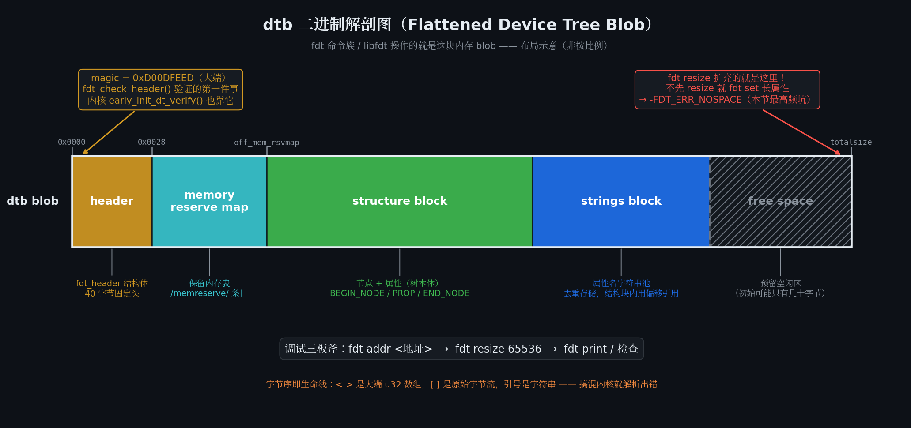
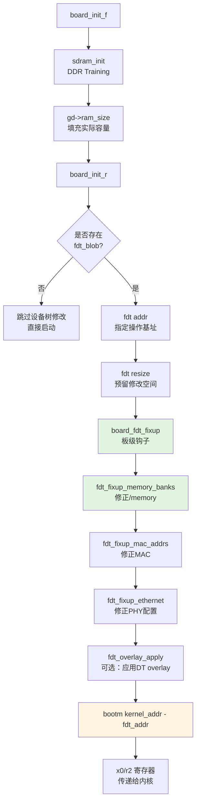

# 7.4.1 U-Boot如何修改设备树

> 所属：第7章 系统启动全链路 > 7.4 设备树交接：从U-Boot到内核
> 
> 难度：[I→E] | 预计阅读时间：35分钟

## <span class="blue"> 本节导读

7.3 节结束时，U-Boot 已经完成重定位、DM 框架初始化和外设驱动就绪，`bootcmd` 即将执行。跳转内核之前还有最后一道工序：把设备树修整到与眼前这块板子完全一致的状态。设备树明明是 .dts 编译出来的静态文件，为什么 memory 大小、bootargs、MAC 地址却要 U-Boot 在启动现场临时填写？答案藏在 dtb 的二进制布局里——它的组织方式天生就给"运行时修改"留了位置。<BR>
本节覆盖：U-Boot 修改设备树的三类动机、dtb 四段二进制结构与可修改性、libfdt 与 fdt 命令族、板级钩子实际修改的节点清单、修改失败的典型报错与验证手段。

---

## <span class="blue"> 编译好的 dtb，为什么 memory 大小是错的 [I]

一块 RK3568 工业网关，同一套硬件设计出了三种 BOM：1GB、2GB、4GB 三种 DDR 配置共板。软件只想维护一份固件，dtb 自然也只有一份——`rk3568-evb.dtb` 里 `/memory` 节点按 2GB 写死。这份 dtb 烧到 4GB 的板子上，内核只认 2GB，剩下一半内存白白浪费；烧到 1GB 的板子上更糟，内核按 2GB 的地址范围去访问不存在的物理内存，直接触发 SError。

类似的值还有一串：bootargs 里的 `console=` 取决于调试串口接在哪个 UART 上，`root=` 取决于根文件系统烧在哪个分区；MAC 地址每台设备不同，存在板载 EEPROM 里，编译 .dts 时根本不存在。这些值的共同特征是——**只有启动这一刻的硬件自己知道答案**。

归纳起来，U-Boot 修改设备树的动机只有三类：

| 动机类别 | 典型场景 | 信息来源 |
|---------|---------|---------|
| **运行时检测** | 内存大小、CPU 频率、温度校准值 | DDR Training 结果、PMIC 寄存器、ADC 采样 |
| **产品差异化** | 不同版本 PCB 的器件差异、可选配件 | GPIO 电平、EEPROM 版本字、电阻跨接检测 |
| **个性化配置** | MAC 地址、序列号、启动参数 | OTP、eMMC、I2C EEPROM 中的制造数据 |

第 I 部学过的设备树语法与编译流程，产出的是"设计图纸"；而图纸落笔时有些参数注定空着，由 U-Boot 这个硬件世界的最后守门人在交班前补齐。这解释了"为什么改"，接下来的问题是"怎么改"——dtb 是一串二进制，U-Boot 总不能拿文本编辑器去改它。

---

## <span class="blue"> dtb 二进制解剖：四段布局决定哪段能被改 [I→E]

改 dtb 之前，先看清楚它的内部结构。dtc 把 .dts 编译成的 dtb（也称 FDT，Flattened Device Tree）不是杂乱的字节堆，而是严格分四段摆放：



每一段解决一个独立的问题：

| 段 | 内容 | 解决的问题 |
|----|------|-----------|
| **header** | 魔数 `0xD00DFEED`、版本、各段偏移与长度 | 解析器凭它一次定位其余三段，不用猜格式 |
| **memory reserve map** | 保留物理内存区域的列表 | 告诉内核"这些地址别碰"，在解析任何节点之前先生效 |
| **structure block** | 节点层级与属性值的编码本体 | 树的形状全在这里：`/memory` 套着 `reg` 属性，属性值是大端字节流 |
| **strings block** | 所有属性名去重后的字符串池 | 属性名只存一份，structure block 里用偏移引用，压缩体积 |

修改操作落在这张布局图上，代价立刻变得具体：`fdt set /memory reg <0x40000000 0x100000000>` 是把 structure block 里一段 8 字节的旧值换成 16 字节的新值——值变长了，后面的内容得整体后移；`fdt set /chosen bootargs "..."` 若 `bootargs` 这个名字之前不存在，strings block 末尾还要追加一个新字符串。dtb 是紧凑二进制，段与段之间没有富余空间，任何"变长"都意味着搬家。

这就是 libfdt 的设计约束的由来：它不做内部 malloc，所有修改直接发生在调用者提供的内存缓冲区上，空间不够就返回 `FDT_ERR_NOSPACE`。对应的工程纪律只有一条：

> 💡 **改 dtb 之前先扩容**。原始 dtb 编译出来时尾部几乎没有富余，`fdt resize 65536` 把缓冲区撑大之后再做 `fdt set`，可以避开修改链中途报 NOSPACE 的尴尬。板级代码里统一在 `board_fdt_fixup()` 开头调一次 `fdt_resize()`，是量产项目的标准动作。

> ⚠️ structure block 里的整数一律是**大端**编码。ARM 是小端机器，用 `memcpy` 直接搬 u32 而不经过 `cpu_to_fdt32()` 转换，写进去的值在内核眼里就是字节序翻转的另一个数——内存大小写错是最常见的后果。

---

## <span class="blue"> libfdt 与 fdt 命令族：U-Boot 手里的手术刀 [E]

U-Boot 不裸写 FDT 二进制，而是站在 libfdt 之上。libfdt 解决的问题很直接：把"按路径找节点、读写属性、增删节点"封装成 C API，调用者不需要理解 structure block 的字节编码。它最初由 PowerPC 社区维护，源码就放在 U-Boot 的 `scripts/dtc/libfdt/` 下。分层关系如下：

```
┌─────────────────────────────────────┐
│         U-Boot Shell (CLI)          │
│    fdt set /memory reg <0x0 0x80>   │
├─────────────────────────────────────┤
│         cmd/fdt.c（命令解析）        │
├─────────────────────────────────────┤
│    libfdt/fdt_rw.c / fdt_sw.c       │
│   fdt_setprop() / fdt_add_subnode() │
├─────────────────────────────────────┤
│      arch/arm/lib/bootm-fdt.c       │
│    启动时随 bootm 传递给内核         │
└─────────────────────────────────────┘
```

命令行这层是调试期最常用的入口，速查如下：

| 命令 | 语法示例 | 作用 | 注意点 |
|-----|---------|------|--------|
| `fdt addr` | `fdt addr 0x83000000` | 设定当前操作的 dtb 地址 | 地址未对齐会报 `Bad data address` |
| `fdt move` | `fdt move 0x83000000 0x88000000 0x10000` | 把 dtb 复制到新位置 | 目标区域有代码在跑会崩溃 |
| `fdt resize` | `fdt resize 65536` | 扩展尾部预留空间 | 修改节点前的标准前置动作 |
| `fdt print` | `fdt print /memory` | 可读格式打印节点/属性 | 支持通配，如 `fdt print /soc/*` |
| `fdt list` | `fdt list /chosen` | 紧凑格式列出节点与直接属性 | 不展开子节点 |
| `fdt set` | `fdt set /chosen bootargs "console=ttyS0"` | 创建或修改属性值 | 类型推断规则见下 |
| `fdt mknode` | `fdt mknode /soc my-device` | 在指定路径创建新节点 | 父节点必须已存在 |
| `fdt rm` | `fdt rm /soc/ethernet@1c30000 local-mac-address` | 删除属性或整个节点 | 删节点会级联删子节点 |
| `fdt header` | `fdt header` | 打印魔数、版本、总大小 | 快速判断 dtb 是否损坏 |

`fdt set` 是调试期最高频的命令，它的类型推断规则直接决定写进 structure block 的字节形态，记错类型等于写错数据：

```
无引号数字串 → 32位大端整数 (u32)
用<>包裹      → 32位大端整数数组，如 <0x0 0x80000000>
用[]包裹      → 原始字节数组，如 [00 11 22 33 44 55]
引号字符串    → 以\0结尾的字符串
空值          → 0长度属性（boolean存在性标志）
```

一次完整的现场修改流程（承接开头的 4GB 内存案例）：

```
# 加载内核镜像和设备树到内存
tftp 0x82000000 zImage
tftp 0x83000000 board.dtb

# 指定当前操作的设备树地址，先扩容
fdt addr 0x83000000
fdt resize 65536

# 修改前：编译时写死的128MB
fdt print /memory
memory {
    reg = <0x80000000 0x8000000>;
    device_type = "memory";
};

# 改为实际检测到的256MB
fdt set /memory reg <0x80000000 0x10000000>

# 确认修改生效
fdt print /memory reg
memory {
    reg = <0x80000000 0x10000000>;
};

# bootm 会自动把 dtb 地址传递给内核
bootm 0x82000000 - 0x83000000
```

命令行适合调试，量产代码里走的是 C API。板级修改集中在 `include/fdt_support.h` 声明的一组封装函数上：

```c
/* include/fdt_support.h */
int fdt_find_and_setprop(void *fdt, const char *node, const char *prop,
                         const void *val, int len, int create);
void fdt_fixup_memory(void *blob, u64 start, u64 size);
int fdt_fixup_memory_banks(void *blob, u64 start[], u64 size[], int banks);
int fdt_overlay_apply(void *fdt, void *fdto);
```

> 🔴 `fdt_fixup_memory*()` 系列要求传入的地址和长度与设备树根节点的 `#address-cells`、`#size-cells` 宽度匹配。64 位平台通常是 2 cells，某些旧 SoC 是 1 cell，混用会让内核的 `early_init_dt_scan_memory()` 解析出错误的内存范围——轻则内存减半，重则 early panic。

---

## <span class="blue"> 启动前 U-Boot 自动改了哪几个节点 [E]

把各厂商的板级代码翻一遍，修改点高度收敛，高频目标是这六处：

| 目标节点 | 属性名 | 修改目的 | 代码示例 |
|---------|--------|---------|---------|
| `/chosen` | `bootargs` | 传递内核命令行 | `fdt set /chosen bootargs "root=/dev/mmcblk0p2 console=ttyS0,115200"` |
| `/memory` | `reg` | 修正实际内存范围 | `fdt set /memory reg <0x40000000 0x80000000>` |
| `/soc/ethernet@XXX` | `local-mac-address` | 写入 EEPROM 读出的 MAC | `fdt set /soc/ethernet@1c30000 local-mac-address [00 11 22 33 44 55]` |
| `/aliases` | `serial0`/`ethernet0` | 重定向默认设备 | `fdt set /aliases serial0 "/soc/serial@1c28000"` |
| `/soc/i2c@XXX/eeprom@YY` | `status` | 禁用未焊接的器件 | `fdt set /soc/i2c@1c2b000/eeprom@50 status "disabled"` |
| `/`（根节点） | `model` | 标记硬件版本 | `fdt set / model "MyBoard Rev 1.1"` |

回到开头的三 BOM 板卡，看量产代码里这道工序长什么样。DDR Training 在 `sdram_init()` 里完成，实际容量写进 `gd->ram_size`；U-Boot 在跳转内核前的板级钩子 `board_fdt_fixup()` 里把这个值写进 dtb：

```c
/* board/myvendor/rk3568-board/board.c */
#include <fdt_support.h>

int board_fdt_fixup(struct bd_info *bis)
{
    void *blob = (void *)gd->fdt_blob;
    u64 mem_start, mem_size;
    int ret;

    /* gd->ram_size 在 sdram_init() 的 DDR Training 中填充 */
    mem_start = CONFIG_SYS_SDRAM_BASE;  /* RK3568 固定 0x40000000 */
    mem_size  = gd->ram_size;           /* 0x40000000 / 0x80000000 / 0x100000000 */

    printf("DDR auto-detect: %llu MiB @ 0x%llx\n", mem_size >> 20, mem_start);

    /* 标准API，自动适配 #address-cells / #size-cells 宽度 */
    ret = fdt_fixup_memory_banks(blob, &mem_start, &mem_size, 1);
    if (ret < 0)
        printf("WARNING: fdt_fixup_memory_banks failed: %d\n", ret);

    /* DDR Training 代码自身占用的区域，内核不得分配 */
    fdt_add_mem_rsv(blob, (u64)CONFIG_RKBOOT_BL31_BASE, CONFIG_RKBOOT_BL31_SIZE);

    return 0;
}
```

修正前后，同一块 4GB 板子的内核日志对比：

```
# 修正前（按dtb写死的2GB识别）
[    0.000000] Machine model: RK3568 EVB
[    0.000000] Memory: 2048MB @ 0x40000000

# 修正后（4GB版本）
[    0.000000] Machine model: RK3568 EVB
[    0.000000] Memory: 4096MB @ 0x40000000
[    0.000000] Reserved memory: created CMA memory pool at 0x78000000, size 256 MiB
```

把这道工序放回 7.3 节讲过的 U-Boot 初始化链条里，完整时序如下：


```mermaid
flowchart TD
    A[board_init_f] --> B[sdram_init<br/>DDR Training]
    B --> C[gd->ram_size<br/>填充实际容量]
    C --> D[board_init_r]
    D --> E{是否存在<br/>fdt_blob?}
    E -->|否| F[跳过设备树修改<br/>直接启动]
    E -->|是| G[fdt addr<br/>指定操作基址]
    G --> H[fdt resize<br/>预留修改空间]
    H --> I[board_fdt_fixup<br/>板级钩子]
    I --> I1[fdt_fixup_memory_banks<br/>修正/memory]
    I1 --> I2[fdt_fixup_mac_addrs<br/>修正MAC]
    I2 --> I3[fdt_fixup_ethernet<br/>修正PHY配置]
    I3 --> J[fdt_overlay_apply<br/>可选：应用DT overlay]
    J --> K["bootm kernel_addr - fdt_addr"]
    K --> L[x0/r2 寄存器<br/>传递给内核]
    style I fill:#e1f5e1
    style I1 fill:#e1f5e1
    style K fill:#fff4e1
```

板级差异复杂到一定程度（比如 R1.0/R1.1 两个 PCB 版本共板），在 C 代码里堆 `fdt set` 会变成维护负担。Device Tree Overlay 解决的是这个复杂度管理问题：基础 dtb 描述不变的核心硬件，版本差异单独编译成 `.dtbo`，U-Boot 现场叠加：

```
tftp 0x83000000 base.dtb
tftp 0x84000000 rev11.dtbo        # R1.1 版本的增量差异
fdt addr 0x83000000
fdt resize 0x10000
fdt apply 0x84000000              # 叠加修改
```

基础与差异分离之后，硬件版本迭代只新增一个 `.dtbo` 文件，不动主固件，回归测试的范围也随之收敛。

> 💡 调试期想手动模拟 `board_fdt_fixup()` 的修改流程，确认 U-Boot 配置里开了 `CONFIG_CMD_FDT=y` 和 `CONFIG_OF_LIBFDT=y`，否则命令行里没有 `fdt` 命令。

---

## <span class="blue"> 怎么确认修改真的生效了 [I→E]

修改完成不等于生效，收尾验证按成本从低到高分三层：

1. **U-Boot 侧回读**：`fdt print` 对照修改前后的节点内容。这层只能证明 dtb 缓冲区里的值对了，证明不了内核拿到的是同一份。
2. **内核侧对照**：系统起来后读 `/proc/device-tree/`，这是内核解析 dtb 后导出的视图，与 U-Boot 侧 `fdt print` 的输出逐字段比对。两侧不一致，问题出在传递环节而非修改环节（7.4.3 展开）。
3. **行为验证**：`dmesg | grep Memory` 看内核识别的内存总量，`ip link` 看 MAC 地址，`cat /proc/cmdline` 看 bootargs——值最终要落到内核行为上才算闭环。

修改环节的失败模式也收敛为三种，对照排查即可：

| 失败现象 | 根因 | 处理 |
|---------|------|------|
| `fdt set` 报 `FDT_ERR_NOSPACE` | 尾部预留空间不足 | 先 `fdt resize`，再修改 |
| 内核识别的值字节序错乱 | 手写字节绕过 libfdt，未做大端转换 | 一律走 libfdt API 或 `fdt set` 的 `<>` 语法 |
| 修改了但内核没看到变化 | 改的是 A 地址的 dtb，`bootm` 传的是 B 地址 | 核对 `fdt addr` 与 `bootm` 第三个参数一致 |

---

## <span class="blue"> 本节总结

| 要点 | 内容 |
|------|------|
| **为什么改** | memory 容量、bootargs、MAC 等值只有运行时才能确定，编译 .dts 时不存在 |
| **dtb 四段布局** | header 定位、reserve map 保护内存、structure block 存树本体、strings block 存属性名 |
| **修改的硬约束** | 紧凑二进制无富余空间，变长即搬家；libfdt 不 malloc，改前必须 `fdt resize` |
| **字节序** | structure block 一律大端，绕过 libfdt 手写字节必然踩坑 |
| **fdt 类型推断** | `<>` 大端 u32 数组、`[]` 原始字节、引号字符串、空值 boolean |
| **板级修改入口** | `board_fdt_fixup()` 钩子 + `fdt_fixup_memory_banks()` 等标准 API |
| **Overlay** | 基础 dtb + 增量 `.dtbo` 分离，管理多版本硬件差异 |
| **验证闭环** | U-Boot 回读 → `/proc/device-tree` 对照 → dmesg 行为确认 |

> 🔴 dtb 修改是 U-Boot 交班前的最后一道工序，改完的内容就是内核眼中"硬件真相的唯一来源"。这道工序出错不会有任何中间人帮忙兜底——内核只会照着错的 dtb 认真地错下去。

---

## <span class="blue"> 延伸阅读

- U-Boot 官方文档：`doc/usage/fdt.rst`
- libfdt 源码：`scripts/dtc/libfdt/fdt_rw.c`（读写操作）、`fdt_sw.c`（序列化写入）
- Devicetree Specification：`https://devicetree-specification.readthedocs.io/`
- 内核端解析路径预告：`drivers/of/fdt.c → unflatten_device_tree()`（7.4.2 展开）
