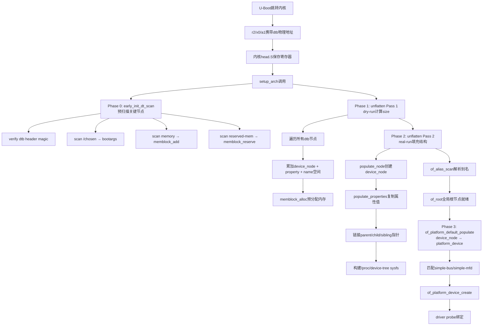
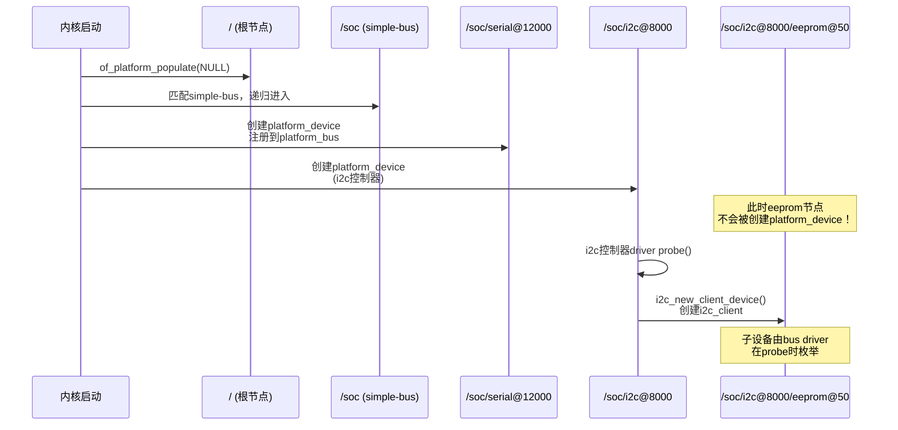

# 7.4.2 内核如何解析设备树：unflatten过程

> 所属：第7章 设备树深度实践 > 7.4 内核设备树子系统
> 难度：[E] | 预计阅读时间：35分钟

## 本节导读

U-Boot把dtb扔进内存、跳转到内核入口之后，dtb是如何变成内核里那棵可以被`of_*` API遍历的device_node树的？为什么有些板子启动后`/proc/device-tree`能看到节点但设备就是不注册？本节深入`__unflatten_device_tree()`的两阶段算法、`early_init_dt_scan()`的前置扫描，以及unflatten后device_node到platform_device的绑定全流程，给出一个dtb解析失败的真实排障案例。

---

## 知识点1：dtb在内存中的位置与早期验证 [E] ~800字

### 问题场景

你手上有块新板子，U-Boot已经能正常加载内核和dtb，但内核启动时打印`Invalid device tree blob header`后直接panic。你怀疑dtb损坏了，但用U-Boot的`fdt print`命令查看却一切正常。问题出在哪里？

答案往往藏在**dtb地址的传递路径**上。U-Boot和内核之间关于dtb的交接，本质上是围绕一个**物理地址指针**的约定。

### 机制深入

#### 多架构dtb传递方式

不同架构的Linux内核入口协议对dtb地址的传递有明确约定：

| 架构 | 传递寄存器/机制 | 内核入口获取方式 | 备注 |
|------|---------------|----------------|------|
| ARM32 | `r2` = dtb物理地址 | `head.S`中读取r2，`__vet_atags()`区分ATAGS/FDT | 若`r2`最低2位非0，视为ATAGS（旧机制） |
| ARM64 | `x0` = dtb物理地址 | `head.S` → `preserve_boot_args()`保存x0到`__fdt_pointer` | v5.4+引入`ARM64_LINUX_KERNEL_AS_BL33`支持TF-A直接跳转 |
| RISC-V | `a1` = dtb物理地址 | `setup.c`中`dtb_early_va` | OpenSBI将dtb地址放入a1 |
| x86 | `setup_data`链表 | `drivers/of/fdt.c`中遍历`boot_params->hdr.setup_data`节点，寻找`SETUP_DTB`类型 | 通过`struct setup_data`扩展传递，非寄存器直接传递 |
| PowerPC | `r3`/`r4`（依boot protocol版本） | `prom_init.c`中解析 | 历史包袱最重，需区分v1/v2 boot protocol |

🔴 **安全提醒**：U-Boot在跳转前**必须**确保dtb所在的物理内存区域已被`memblock_reserve`，否则内核解压过程可能覆盖dtb。ARM64在`setup_machine_fdt()`中有如下保护逻辑：

```c
/* arch/arm64/kernel/setup.c */
static void __init setup_machine_fdt(phys_addr_t dt_phys)
{
    void *dt_virt = fixmap_remap_fdt(dt_phys);
    int size = fdt_totalsize(dt_virt);

    if (dt_virt)
        memblock_reserve(dt_phys, size);  /* 🔴 关键：预留dtb内存 */

    if (!dt_virt || !early_init_dt_scan(dt_virt, dt_phys)) {
        pr_err("\nError: missing or invalid device tree!\n");
        while (true)
            cpu_relax();
    }
}
```

#### 早期验证：`early_init_dt_verify()`

内核拿到dtb地址后，第一件事不是解析，而是**验证**。`early_init_dt_verify()`执行以下检查：

1. **魔数检查**：`fdt_check_header()`验证头部魔数是否为`0xD00DFEED`（大端）
2. **版本检查**：确保dtb版本≥17（内核不支持太老的版本）
3. **CRC32校验**：计算整个dtb的CRC32并保存到`of_fdt_crc32`
4. **初始化全局指针**：设置`initial_boot_params = dt_virt`（虚拟地址）、`initial_boot_params_pa = dt_phys`

⚠️ **常见陷阱**：ARM64使用fixmap映射dtb早期视图，`__pa(dt_virt)`在fixmap区域会返回错误物理地址。因此ARM64的`early_init_dt_scan()`必须直接传入`dt_phys`，不能依赖`__pa()`转换。内核v6.6+统一了所有架构的`early_init_dt_scan()`签名，新增`dt_phys`参数正是为了修复这个问题。

```c
/* drivers/of/fdt.c - kernel 6.6+ */
bool __init early_init_dt_verify(void *dt_virt, phys_addr_t dt_phys)
{
    if (!dt_virt)
        return false;
    if (fdt_check_header(dt_virt))   /* ⚠️ 魔数不匹配直接返回false */
        return false;

    initial_boot_params = dt_virt;
    initial_boot_params_pa = dt_phys;  /* 💡 直接保存，避免__pa转换 */
    of_fdt_crc32 = crc32_be(~0, initial_boot_params,
                            fdt_totalsize(initial_boot_params));
    early_init_dt_scan_root();         /* 获取#address-cells/#size-cells */
    return true;
}
```

### Trade-off表格：直接寄存器传递 vs setup_data传递

| 维度 | 寄存器直接传递（ARM/RISC-V） | setup_data链表（x86） |
|------|---------------------------|---------------------|
| 实现复杂度 | 简单，入口汇编直接读取 | 复杂，需遍历链表寻找SETUP_DTB节点 |
| 扩展性 | 差，寄存器数量有限 | 好，可传递多段setup_data |
| 与UEFI兼容性 | ARM64需区分UEFI/Direct boot路径 | x86 UEFI通过EFI configuration tables传递dtb，再转为setup_data |
| 调试难度 | 低，print寄存器即可 | 高，需解析链表结构 |
| kexec支持 | 直接传递新dtb地址 | 需重新构建setup_data链表 |

---

## 知识点2：unflatten过程——从dtb到device_node树 [E] ~1200字

### 问题场景

你已经确认dtb被正确传递到内核，启动日志也没有错误，但`of_find_node_by_path("/soc/serial@12000")`返回NULL，而`fdt_path_offset()`却能找到这个节点。为什么unflatten后的device_node树和原始dtb不一致？

理解`__unflatten_device_tree()`的两阶段算法是回答这个问题的关键。

### 机制深入

#### 整体调用链

```
start_kernel()
  └── setup_arch()                       /* arch/arm64/kernel/setup.c */
        ├── early_init_dt_scan()          /* Phase 0: 预扫描 */
        │     ├── early_init_dt_verify()  /* 验证dtb头部 */
        │     ├── early_init_dt_scan_chosen()   /* 解析/chosen/bootargs */
        │     ├── early_init_dt_scan_memory()   /* 注册memblock内存 */
        │     └── early_init_dt_check_for_initrd() /* 解析initrd位置 */
        │
        └── unflatten_device_tree()       /* Phase 1-2: 正式展开 */
              ├── fdt_scan_reserved_mem_reg_nodes()  /* reserved-memory处理 */
              └── __unflatten_device_tree()          /* 核心两阶段算法 */
                    └── of_alias_scan()              /* /aliases节点解析 */
```

#### 为什么需要两阶段扫描？

unflatten的核心矛盾是：我们需要在内核内存管理子系统完全初始化**之前**就建好device_node树，因此不能使用`kmalloc()`等常规分配器，只能依赖`memblock_alloc()`。而memblock分配需要提前知道**总内存需求**——这就是第一阶段的使命。

#### 第一阶段（dry-run）：计算所需内存

```c
/* drivers/of/fdt.c - __unflatten_device_tree() */
void *__unflatten_device_tree(const void *blob,
               struct device_node *dad,
               struct device_node **mynodes,
               void *(*dt_alloc)(u64 size, u64 align),
               bool detached)
{
    void *mem;
    int size;

    /* ========== First pass: scan for size ========== */
    size = unflatten_dt_nodes(blob, NULL, dad, NULL);
    if (size <= 0)
        return NULL;

    size = ALIGN(size, 4);
    pr_debug("  size is %d, allocating...\n", size);

    /* Allocate memory for the expanded device tree */
    mem = dt_alloc(size + 4, __alignof__(struct device_node));
    if (!mem)
        return NULL;
    memset(mem, 0, size);

    *(__be32 *)(mem + size) = cpu_to_be32(0xdeadbeef);  /* 💡 越界检测标记 */

    /* ========== Second pass: do actual unflattening ========== */
    ret = unflatten_dt_nodes(blob, mem, dad, mynodes);

    /* 验证越界检测标记 */
    if (be32_to_cpup(mem + size) != 0xdeadbeef)
        pr_warning("End of tree marker overwritten\n");  /* ⚠️ 内存越界！ */

    return mem;
}
```

第一阶段调用`unflatten_dt_nodes(..., NULL, ...)`时，第四个参数`mynodes`为NULL，这触发了**dry-run模式**：遍历dtb所有节点，累加`sizeof(struct device_node)` + 属性存储空间 + 名称字符串空间，但不实际填充任何数据。

#### 第二阶段（real-run）：填充device_node树

第二阶段在同一个`unflatten_dt_nodes()`中完成真正的节点构建。核心逻辑在`populate_node()`和`populate_properties()`中：

```c
/* drivers/of/fdt.c - populate_node() 核心逻辑 */
static void *populate_node(const void *blob, int offset,
                           void **mem, struct device_node *dad,
                           struct device_node **pnp, bool dryrun)
{
    struct device_node *np;
    const char *pathp;
    int sz = sizeof(*np);          /* 💡 每个节点至少一个device_node结构体 */

    if (!dryrun) {
        np = *mem;                 /* 从预分配内存池中取空间 */
        memset(np, 0, sz);
        /* 初始化device_node基本字段 */
        np->full_name = pathp;
        of_node_set_flag(np, OF_DYNAMIC);  /* 标记为动态分配 */
        refcount_set(&np->kref, 1);
    }

    /* 分配properties存储空间 */
    sz = populate_properties(blob, offset, mem, np, pathp, dryrun);

    /* 递归处理子节点 */
    /* ... */

    if (!dryrun) {
        /* 链接到全局链表和父节点 */
        np->parent = dad;
        np->sibling = dad->child;
        dad->child = np;
        *pnp = np;
    }
    return mem;
}
```

#### `populate_properties()`：属性的内存布局

dtb中的每个属性（property）在unflatten后变成`struct property`链表节点：

```c
/* include/linux/of.h */
struct property {
    char *name;           /* 属性名，指向strings block副本 */
    int length;           /* 属性值字节长度 */
    void *value;          /* 属性值，从dtb structure block复制 */
    struct property *next;/* 链表指针 */
};
```

💡 **关键技巧**：`__be32 *(__be32 *)(mem + size) = cpu_to_be32(0xdeadbeef)`这行代码是经典的**边界越界检测**手法。如果第二阶段实际写入超出预计算size，这个marker会被覆盖，内核就能检测到内存损坏。

### unflatten流程图



### unflatten阶段速查表

| 阶段 | 函数 | 内存分配器 | 主要任务 | 失败后果 |
|------|------|----------|---------|---------|
| Phase 0 | `early_init_dt_scan()` | `memblock` | 验证dtb、解析bootargs、注册内存 | 内核无法识别内存，early panic |
| Phase 1 | `unflatten_dt_nodes(dryrun)` | 无（仅计算） | 计算总需内存size | 无直接后果 |
| Phase 2 | `unflatten_dt_nodes(real)` | `memblock_alloc` | 创建device_node树、复制属性 | device_node树不完整，设备缺失 |
| Phase 2.5 | `of_alias_scan()` | `memblock` | 建立phandle→node映射 | `of_alias_get_id()`返回-EINVAL |
| Phase 3 | `of_platform_default_populate()` | `kmalloc`（此时slab已就绪） | 将device_node转为platform_device | 设备节点存在但无对应设备 |

⚠️ **常见陷阱**：Phase 0和Phase 2使用`memblock_alloc()`分配内存，这些内存位于`init_mm`的初始化映射区域。如果dtb中`reserved-memory`节点与dtb自身所在的内存区域重叠，会导致`memblock_reserve`和`memblock_alloc`冲突。排查方法：启用`CONFIG_DEBUG_MEMBLOCK`查看`memblock.reserved`日志。

---

## 知识点3：device_node与platform_device的绑定 [E] ~1000字

### 问题场景

unflatten完成后，你在`/sys/firmware/devicetree/base/soc/serial@12000`能看到完整的设备节点和属性，但`ls /sys/bus/platform/devices/`下没有对应的`serial@12000`平台设备。驱动`probe()`永远不被调用。问题出在哪里？

这是unflatten（创建内核内部数据结构）和设备注册（将数据结构连接到设备模型）之间的**第二阶段断层**问题。

### 机制深入

#### 绑定入口：`of_platform_default_populate()`

unflatten只是建了一棵device_node树，这些节点还没有和**Linux设备模型**（`struct device`、`struct bus_type`）发生关系。这个连接工作由`of_platform_default_populate()`完成：

```c
/* drivers/of/platform.c */
static int __init of_platform_default_populate_init(void)
{
    if (!of_have_populated_dt())   /* ⚠️ 检查是否已经populate过 */
        return -ENODEV;

    of_platform_default_populate(NULL, NULL, NULL);
    return 0;
}
arch_initcall_sync(of_platform_default_populate_init);
```

注意`arch_initcall_sync`这个initcall级别——它在架构初始化之后、设备驱动初始化之前执行，确保平台设备先于驱动注册。

#### 匹配表与递归创建

`of_platform_default_populate()`使用默认匹配表`of_default_bus_match_table`决定哪些节点需要递归创建设备：

```c
/* drivers/of/platform.c */
const struct of_device_id of_default_bus_match_table[] = {
    { .compatible = "simple-bus", },       /* 💡 大多数SoC内部总线 */
    { .compatible = "simple-mfd", },       /* 💡 多功能设备 */
    { .compatible = "isa", },
    { .compatible = "arm,amba-bus", },
    { .compatible = "arm,primecell", },
    {} /* Empty terminated list */
};
```

核心逻辑在`of_platform_bus_create()`中：

```c
/* drivers/of/platform.c - of_platform_bus_create() */
static int of_platform_bus_create(struct device_node *bus,
                                  const struct of_device_id *matches,
                                  const struct of_dev_auxdata *lookup,
                                  struct device *parent, bool strict)
{
    struct device_node *child;
    struct platform_device *dev;
    int rc;

    /* 检查节点是否有compatible属性（strict模式下必须） */
    if (strict && (!of_get_property(bus, "compatible", NULL)))
        return 0;   /* ⚠️ 无compatible的strict节点被跳过！ */

    /* 跳过已标记populated的节点，防止重复创建 */
    if (of_node_check_flag(bus, OF_POPULATED_BUS))
        return 0;

    /* 创建platform_device */
    dev = of_platform_device_create_pdata(bus, bus_id, platform_data, parent);
    if (!dev || !of_match_node(matches, bus))
        return 0;

    /* 💡 关键：如果当前节点匹配bus match表，递归处理子节点 */
    for_each_child_of_node(bus, child) {
        rc = of_platform_bus_create(child, matches, lookup, &dev->dev, strict);
        if (rc)
            break;
    }
    of_node_set_flag(bus, OF_POPULATED_BUS);
    return rc;
}
```

#### 从device_node到platform_device的转换

`of_platform_device_create_pdata()`完成实际的转换工作：

1. **资源转换**：将dtb节点中的`reg`属性转换为`struct resource`数组（IORESOURCE_MEM）
2. **中断转换**：将`interrupts`属性通过irqdomain转换为Linux irq号
3. **DMA mask设置**：根据`dma-ranges`或`#size-cells`设置DMA寻址能力
4. **设备注册**：调用`device_add()`将platform_device注册到`platform_bus_type`

```c
/* drivers/of/platform.c - 资源转换示意 */
static int of_platform_device_create_pdata(/* ... */)
{
    struct platform_device *pdev;
    int ret;

    pdev = of_device_alloc(np, bus_id, parent);  /* 分配platform_device */
    if (!pdev)
        return -ENOMEM;

    /* 💡 将device_node的reg属性转为resource */
    ret = of_address_to_resource(np, 0, &res);
    if (ret == 0)
        pdev->resource = &res;
        pdev->num_resources = 1;

    /* 通过irqdomain解析interrupts属性 */
    ret = of_irq_to_resource(np, 0, &irq_res);

    pdev->dev.of_node = of_node_get(np);  /* 💡 关键链接！ */
    pdev->dev.fwnode = &np->fwnode;

    return platform_device_add(pdev);  /* 注册到platform_bus_type */
}
```

### 为什么I2C/SPI子设备不在这里创建？

注意`of_platform_default_populate()`只处理**直接挂在根节点下**或**匹配simple-bus等总线类型**的节点。I2C从设备、SPI从设备等**不在此阶段创建**——它们由各自的bus driver在`probe()`阶段调用`of_register_child_devices()`或`i2c_new_client_device()`来创建。这是平台设备模型和子系统总线模型的**职责分离**设计。



---

## 实践案例：某板子dtb解析失败导致UART未注册的排查

### 故障现象

某ARM64工业控制板，使用`arch_initcall`级别的debug UART打印。启动日志显示：

```
[    0.000000] OF: fdt: Invalid device tree blob header
[    0.000000] Error: missing or invalid device tree!
```

然后系统hang死。

### 排查过程

**Step 1：确认dtb在U-Boot阶段的完整性**

在U-Boot命令行执行：
```bash
=> fdt addr 0x83000000
=> fdt header          # 查看头部信息
=> fdt print /chosen   # 验证内容可读
=> crc32 0x83000000 ${filesize}  # 计算CRC32并记录
```

U-Boot侧验证通过，头部正常，说明dtb在加载时未损坏。

**Step 2：确认dtb地址传递**

```bash
=> print fdtaddr
fdtaddr=0x83000000
=> booti 0x80080000 - 0x83000000
```

检查ARM64入口代码：`arch/arm64/kernel/head.S`中是否正确保存了x0：

```asm
/* arch/arm64/kernel/head.S */
SYM_CODE_START(primary_entry)
    /*
     * Preserve boot arguments across function calls
     * x0 = physical address of DT blob
     */
    mov x21, x0           /* 💡 x21保存dtb地址，后续代码使用 */
    mov x22, x1
    mov x23, x2
```

**Step 3：跟踪内核早期映射**

发现问题根源：`setup_machine_fdt()`调用`fixmap_remap_fdt(dt_phys)`时，返回了NULL。进一步检查`dt_phys`——发现`early_init_dt_verify()`中`fdt_check_header()`**实际检查的是虚拟地址**，但此时MMU尚未完全初始化，early fixmap映射只覆盖了dtb的前4KB，而dtb总大小是64KB！

```
[    0.000000] Early memory: 0x80000000-0xA0000000
[    0.000000] fdt blob at 0x83000000, size=0x10000 (64KB)
[    0.000000] fixmap: failed to map entire FDT, header check may fail
```

**根因**：该板子的U-Boot在kexec热重启场景下，新dtb被放置在了一个**旧的fixmap未覆盖**的物理地址。`fixmap_remap_fdt()`内部调用`__fix_to_virt(FIX_FDT)`，而这个fixmap slot只能映射1个page。

**修复方案**：在`arch/arm64/kernel/setup.c`中，增大`FIX_FDT_END - FIX_FDT_START`的映射窗口，或改用`early_ioremap()`做临时映射：

```diff
/* arch/arm64/include/asm/fixmap.h */
 enum fixed_addresses {
     FIX_EARLYCON_MEM_BASE,
-    FIX_FDT,
+    FIX_FDT_START,
+    FIX_FDT_END = FIX_FDT_START + FIX_FDT_SIZE - 1,
     /* ... */
 };
```

### 教训总结

| 检查项 | 命令/方法 | 目的 |
|--------|----------|------|
| dtb物理地址 | U-Boot: `print fdtaddr` | 确认地址非空且在RAM范围内 |
| dtb完整性 | U-Boot: `fdt header` + `crc32` | 排除加载损坏 |
| 内核获取的地址 | ` earlyprintk` + `dump_x0()` | 确认寄存器值正确传递 |
| fixmap映射范围 | 检查`FIX_FDT_SIZE`定义 | 确保映射窗口≥dtb大小 |
| memblock预留 | `CONFIG_DEBUG_MEMBLOCK` | 确认dtb区域已被reserve |

---

## 本节总结

1. **dtb传递是契约**：U-Boot和内核之间通过寄存器（ARM32:r2/ARM64:x0）或setup_data（x86）传递dtb物理地址。这个地址在`early_init_dt_verify()`中验证魔数后存入`initial_boot_params`全局变量。

2. **unflatten是两阶段算法**：第一阶段dry-run计算总内存需求，第二阶段real-run填充device_node树。中间使用`memblock_alloc()`一次性分配，`0xdeadbeef`做越界检测。

3. **device_node ≠ platform_device**：unflatten创建的是裸数据结构，必须通过`of_platform_default_populate()`显式转换为platform_device并注册到`platform_bus_type`。只有匹配`simple-bus`等总线类型的节点才会递归创建子设备。

4. **排查dtb问题的黄金路径**：U-Boot验证→寄存器传递确认→`early_init_dt_verify()`魔数检查→unflatten节点计数→`of_platform_populate`匹配检查。

---

## 配套资源

### 表格清单

- 表1：多架构dtb传递方式对比表
- 表2：`direct register` vs `setup_data` Trade-off对比
- 表3：unflatten阶段速查表
- 表4：dtb排查检查清单

### 图示清单（mermaid代码）

- 图1：`unflatten_device_tree`完整流程图（从U-Boot到driver probe的5阶段流程）
- 图2：platform_device创建时序图（根节点→soc→serial/i2c的职责分离）

### 代码清单

1. ARM64 `setup_machine_fdt()`的memblock_reserve保护逻辑
2. `early_init_dt_verify()`的魔数验证与物理地址保存
3. `__unflatten_device_tree()`的两阶段核心框架
4. `of_platform_bus_create()`的递归创建与OF_POPULATED_BUS标记
5. `of_platform_device_create_pdata()`的device_node到platform_device转换

### 推荐阅读

- `Documentation/devicetree/booting-without-of.txt`（内核文档）
- `drivers/of/fdt.c` — unflatten核心实现
- `drivers/of/platform.c` — platform_device创建逻辑
- `arch/arm64/kernel/setup.c` — ARM64 dtb入口处理
