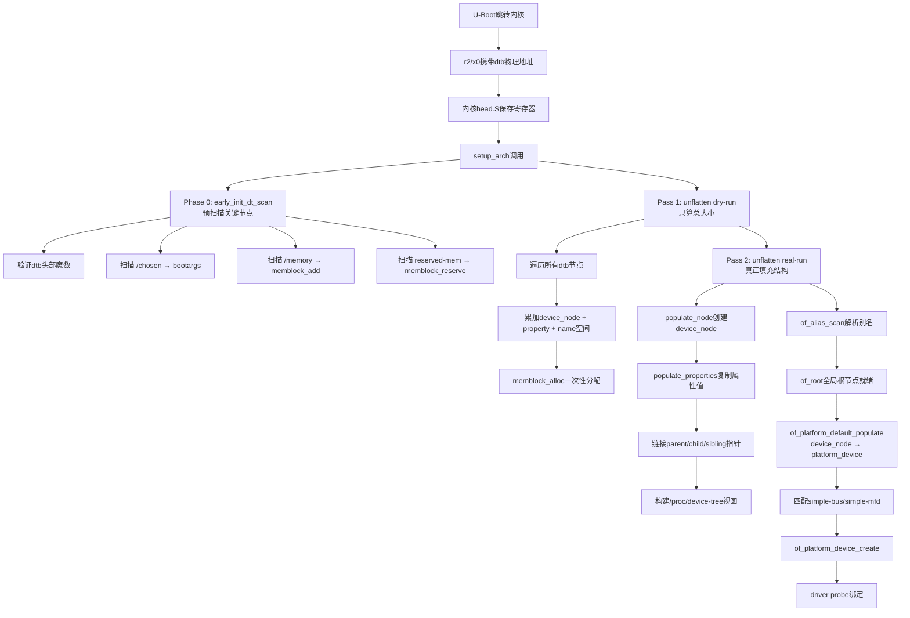
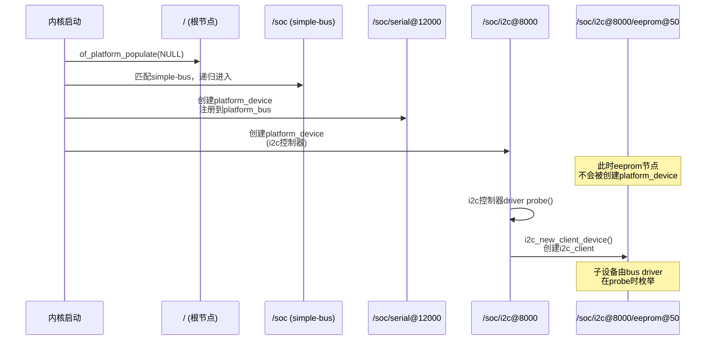

# 7.4.2 内核如何解析设备树：unflatten过程

> 所属：第7章 系统启动全链路 > 7.4 设备树交接：从U-Boot到内核
> 
> 难度：[E] | 预计阅读时间：35分钟

## <span class="blue"> 本节导读

7.4.1 的结尾，U-Boot 把修好的 dtb 地址塞进寄存器、跳进了内核入口。从这一刻起，消费这串二进制的换成了内核。dtb 是紧凑二进制：节点和属性挤在 structure block 里按偏移编码，属性名是 strings block 里的去重字符串，属性值是无类型的字节流。而驱动代码里随处可见 `of_property_read_u32(np, "clock-frequency", &freq)` 这种按名字查询的调用——从一串二进制到一棵可以按名字查的树，中间这一步转换就是 unflatten。<BR>
本节覆盖：内核拿到 dtb 后的验证与内存保留、unflatten 两趟扫描算法、device_node 与 property 的内存形态、of_platform_populate 把节点变成设备、dtb 解析失败的排查路径。

---

## <span class="blue"> 一串二进制，怎么变成可以按名字查的树 [E]

写驱动时设备树的存在感很低：probe 里调 `of_property_read_u32()` 读个时钟频率，调 `of_irq_get()` 取个中断号，节点好像天生就是可以按名字查的对象。但只要把 dtb 拖到十六进制编辑器里看一眼，落差立刻出现——里面没有任何"对象"，只有一段段带标签的字节：`FDT_BEGIN_NODE`、名字偏移、`FDT_PROP`、长度、大端值，依次排开。

中间的转换要回答三个问题：这段二进制合法吗（别上来就信）；要给它分配多少内存、建成什么数据结构（节点树长什么样）；建好的树怎么挂到 Linux 设备模型上变成驱动能 probe 的设备。内核的答案对应三步：**先验证，再展开（unflatten），最后填充设备（populate）**。本节沿这条线走完，终点是解释一个常见困惑——为什么 `/proc/device-tree` 里明明有节点，对应的设备却死活不注册。

---

## <span class="blue"> 内核拿到地址后的第一件事不是解析，是验证 [E]

dtb 地址怎么到内核手里的（ARM32 走 r2、ARM64 走 x0），是 U-Boot 与内核之间的交接约定，7.4.3 节完整展开；本节从内核已经拿到这个物理地址开始。拿到地址后第一件事不是读内容，而是验证——U-Boot 传来的可能是一个正确 dtb，也可能是一个算错的地址、被解压覆盖的残骸，内核不能闭着眼信。

ARM64 的入口处理在 `setup_machine_fdt()`：

```c
/* arch/arm64/kernel/setup.c */
static void __init setup_machine_fdt(phys_addr_t dt_phys)
{
    void *dt_virt = fixmap_remap_fdt(dt_phys);
    int size = fdt_totalsize(dt_virt);

    if (dt_virt)
        memblock_reserve(dt_phys, size);  /* 预留dtb自身占用，防内核覆盖 */

    if (!dt_virt || !early_init_dt_scan(dt_virt, dt_phys)) {
        pr_err("\nError: missing or invalid device tree!\n");
        while (true)
            cpu_relax();
    }
}
```

两个动作值得单独看。`memblock_reserve` 解决的是"dtb 自身的生存问题"：dtb 躺在 DDR 里，内核后续建立内存管理、解压、分配页表，任何一步都可能把这块内存挪作他用，先把它登记为保留，dtb 才能活到解析完成。`early_init_dt_scan` 里的第一关是 `early_init_dt_verify()`：

```c
/* drivers/of/fdt.c - kernel 6.6+ */
bool __init early_init_dt_verify(void *dt_virt, phys_addr_t dt_phys)
{
    if (!dt_virt)
        return false;
    if (fdt_check_header(dt_virt))   /* 魔数 0xD00DFEED 校验，不过直接判死 */
        return false;

    initial_boot_params = dt_virt;
    initial_boot_params_pa = dt_phys;
    of_fdt_crc32 = crc32_be(~0, initial_boot_params,
                            fdt_totalsize(initial_boot_params));
    early_init_dt_scan_root();       /* 先取根节点的 #address-cells/#size-cells */
    return true;
}
```

验证通过只做四件事：魔数比对、算 CRC32 存档、把 dtb 地址存进全局变量 `initial_boot_params`、读根节点的 cells 宽度（后续所有 `reg` 属性解析都依赖这两个值）。注意这里还没有建任何树——验证阶段内核只想要几个关键全局量。

> ⚠️ ARM64 早期用 fixmap 映射 dtb，这段虚拟地址落在 fixmap 区域，`__pa(dt_virt)` 换算不出正确的物理地址。所以 `early_init_dt_scan()` 必须显式传入 `dt_phys`——v6.6 统一各架构函数签名、新增这个参数，修的就是这个坑。移植老版本内核时遇到 dtb 魔数校验偶发失败，先查这条。

验证之后，`early_init_dt_scan()` 顺手把几件等不到 unflatten 的事提前办了，合称 Phase 0 预扫描：

```
early_init_dt_scan()
  ├── early_init_dt_verify()       验证魔数、存全局指针
  ├── early_init_dt_scan_chosen()  解析 /chosen/bootargs → boot_command_line
  ├── early_init_dt_scan_memory()  解析 /memory/reg → memblock_add()
  └── early_init_dt_check_for_initrd()  记录 initrd 的起止地址
```

bootargs 和内存范围之所以必须提前，是因为它们本身就是 unflatten 的前提：没有 memblock 里登记的可用内存，下一步连建树的空间都分不出来。

---

## <span class="blue"> unflatten 为什么要扫两趟 [E]

正式展开由 `__unflatten_device_tree()` 完成。它面对的核心矛盾是：device_node 树必须在内核内存管理子系统完全就绪**之前**建好，此时 `kmalloc()` 不可用，只能用早期的 memblock 分配器；而 memblock 分配是一次性的——申请时就要报出总大小，事后不能追加。总大小又取决于 dtb 里有多少节点、多少属性，不算一遍不知道。于是算法拆成两趟：

```c
/* drivers/of/fdt.c - __unflatten_device_tree() */
void *__unflatten_device_tree(const void *blob,
               struct device_node *dad,
               struct device_node **mynodes,
               void *(*dt_alloc)(u64 size, u64 align),
               bool detached)
{
    void *mem;
    int size;

    /* 第一趟：dry-run，只算总大小不填数据 */
    size = unflatten_dt_nodes(blob, NULL, dad, NULL);
    if (size <= 0)
        return NULL;
    size = ALIGN(size, 4);

    /* 按第一趟的结果一次性分配 */
    mem = dt_alloc(size + 4, __alignof__(struct device_node));
    if (!mem)
        return NULL;
    memset(mem, 0, size);

    *(__be32 *)(mem + size) = cpu_to_be32(0xdeadbeef);  /* 越界检测标记 */

    /* 第二趟：real-run，真正填充节点树 */
    ret = unflatten_dt_nodes(blob, mem, dad, mynodes);

    if (be32_to_cpup(mem + size) != 0xdeadbeef)
        pr_warning("End of tree marker overwritten\n");  /* 标记被踩=内存越界 */

    return mem;
}
```

两趟调用的是同一个 `unflatten_dt_nodes()`，靠参数区分模式：第一趟传入的目标内存是 NULL，函数进入 dry-run，遍历 dtb 所有节点和属性，只累加 `sizeof(struct device_node)`、属性存储和名字字符串的空间，不写任何数据；第二趟传入刚分配的内存池，把每个节点真正建出来。

缓冲区末尾那个 `0xdeadbeef` 是经典的金丝雀手法：如果第二趟实际写入超出第一趟算出的 size，标记会被踩掉，内核立刻知道发生了内存损坏——两趟算法共用一套遍历逻辑，一旦逻辑有 bug 导致两次统计不一致，代价是静默的堆破坏，这个标记就是最后一道报警。

第二趟里每个节点的落成在 `populate_node()` / `populate_properties()`：从内存池里切一块 `struct device_node`，填名字、挂到父节点的 child 链表，再把节点的每个属性复制成一个 `struct property` 挂上。unflatten 之后，dtb 在内核里的形态就是这两个结构：

```c
/* include/linux/of.h */
struct property {
    char *name;            /* 属性名，从strings block复制出来的副本 */
    int length;            /* 属性值字节长度 */
    void *value;           /* 属性值，从structure block复制 */
    struct property *next; /* 同一节点的属性串成链表 */
};
```

`of_property_read_u32(np, "clock-frequency", &val)` 的真相就此清晰：沿 `np->properties` 链表逐个比对 `name`，命中后从 `value` 里按大端读 4 字节。所谓"按名字查询"，底下是一次朴素的链表遍历。

整个展开过程的阶段全景：


```mermaid
flowchart TD
    A[U-Boot跳转内核] --> B[r2/x0携带dtb物理地址]
    B --> C[内核head.S保存寄存器]
    C --> D[setup_arch调用]

    D --> E[Phase 0: early_init_dt_scan<br/>预扫描关键节点]
    E --> E1[验证dtb头部魔数]
    E --> E2[扫描 /chosen → bootargs]
    E --> E3[扫描 /memory → memblock_add]
    E --> E4[扫描 reserved-mem → memblock_reserve]

    D --> F[Pass 1: unflatten dry-run<br/>只算总大小]
    F --> F1[遍历所有dtb节点]
    F1 --> F2[累加device_node + property + name空间]
    F2 --> F3[memblock_alloc一次性分配]

    F --> G[Pass 2: unflatten real-run<br/>真正填充结构]
    G --> G1[populate_node创建device_node]
    G1 --> G2[populate_properties复制属性值]
    G2 --> G3[链接parent/child/sibling指针]
    G3 --> G4[构建/proc/device-tree视图]

    G --> H[of_alias_scan解析别名]
    H --> I[of_root全局根节点就绪]

    I --> J[of_platform_default_populate<br/>device_node → platform_device]
    J --> J1[匹配simple-bus/simple-mfd]
    J1 --> J2[of_platform_device_create]
    J2 --> J3[driver probe绑定]
```

各阶段的职责与失败后果对照：

| 阶段 | 函数 | 分配器 | 任务 | 失败后果 |
|------|------|--------|------|---------|
| Phase 0 | `early_init_dt_scan()` | memblock | 验证 dtb、解析 bootargs、登记内存 | 内核不识内存，early panic |
| Pass 1 | `unflatten_dt_nodes(dryrun)` | 无（仅计算） | 统计总内存需求 | 无直接后果 |
| Pass 2 | `unflatten_dt_nodes(real)` | memblock | 建 device_node 树、复制属性 | 树不完整，设备缺失 |
| 别名扫描 | `of_alias_scan()` | memblock | 建立 phandle→node 映射 | `of_alias_get_id()` 返回 -EINVAL |
| 设备填充 | `of_platform_default_populate()` | kmalloc（slab 已就绪） | 节点转 platform_device | 节点在，设备不在 |

> ⚠️ Phase 0 和 Pass 2 都用 memblock 分配，dtb 中 `reserved-memory` 节点若与 dtb 自身占用的区域重叠，`memblock_reserve` 与 `memblock_alloc` 会互相打架。排查这类问题开 `CONFIG_DEBUG_MEMBLOCK`，看 `memblock.reserved` 的登记日志。

---

## <span class="blue"> 树建好了，设备还没出生：of_platform_populate [E]

unflatten 结束，`/proc/device-tree` 里能看到完整的节点和属性——但此时 `/sys/bus/platform/devices/` 下一个对应设备都没有，驱动的 `probe()` 也不会被调。device_node 树只是一堆内核内部数据结构，和 Linux 设备模型（`struct device`、`struct bus_type`）还没有任何关系。把这棵树接到设备模型上的工作，由 `of_platform_default_populate()` 完成：

```c
/* drivers/of/platform.c */
static int __init of_platform_default_populate_init(void)
{
    if (!of_have_populated_dt())
        return -ENODEV;

    of_platform_default_populate(NULL, NULL, NULL);
    return 0;
}
arch_initcall_sync(of_platform_default_populate_init);
```

`arch_initcall_sync` 这个 initcall 级别卡的位置很讲究：架构初始化之后、设备驱动初始化之前——平台设备必须先于驱动就位，驱动注册进来才有东西可匹配（initcall 分级是 7.5 节的主题，这里只需记住这个时序约束）。

populate 不是把整棵树无脑转成设备，它有一张默认总线匹配表，决定哪些节点的子节点值得递归创建：

```c
/* drivers/of/platform.c */
const struct of_device_id of_default_bus_match_table[] = {
    { .compatible = "simple-bus", },   /* 大多数SoC内部总线 */
    { .compatible = "simple-mfd", },   /* 多功能设备 */
    { .compatible = "isa", },
    { .compatible = "arm,amba-bus", },
    { .compatible = "arm,primecell", },
    {} /* Empty terminated list */
};
```

递归创建的核心逻辑在 `of_platform_bus_create()`：

```c
/* drivers/of/platform.c - of_platform_bus_create() */
static int of_platform_bus_create(struct device_node *bus,
                                  const struct of_device_id *matches,
                                  const struct of_dev_auxdata *lookup,
                                  struct device *parent, bool strict)
{
    struct device_node *child;
    struct platform_device *dev;
    int rc;

    /* strict模式下，没有compatible属性的节点直接跳过 */
    if (strict && (!of_get_property(bus, "compatible", NULL)))
        return 0;

    /* 已populate过的节点不重复创建 */
    if (of_node_check_flag(bus, OF_POPULATED_BUS))
        return 0;

    dev = of_platform_device_create_pdata(bus, bus_id, platform_data, parent);
    if (!dev || !of_match_node(matches, bus))
        return 0;

    /* 当前节点匹配总线表 → 递归处理子节点 */
    for_each_child_of_node(bus, child) {
        rc = of_platform_bus_create(child, matches, lookup, &dev->dev, strict);
        if (rc)
            break;
    }
    of_node_set_flag(bus, OF_POPULATED_BUS);
    return rc;
}
```

落到单个节点上，`of_platform_device_create_pdata()` 做四件转换：`reg` 属性转成 `struct resource`（IORESOURCE_MEM）、`interrupts` 经 irqdomain 转成 Linux 中断号、按 `dma-ranges` 设置 DMA 寻址掩码、最后 `platform_device_add()` 注册进 `platform_bus_type`。注册完成的瞬间，设备模型开始按 `compatible` 匹配已注册的驱动，命中就进 `probe()`——设备树到驱动这条链至此合龙。

一个容易误判的设计：I2C、SPI 总线下挂的从设备节点（如 `/soc/i2c@8000/eeprom@50`）**不在 populate 阶段创建设备**。platform 总线只负责平台设备，从设备由各总线驱动在自己的 `probe()` 里枚举——i2c 控制器驱动起来后调 `i2c_new_client_device()` 逐个创建 `i2c_client`。职责分离的结果：


```mermaid
sequenceDiagram
    participant Kernel as 内核启动
    participant Root as / (根节点)
    participant Soc as /soc (simple-bus)
    participant Serial as /soc/serial@12000
    participant I2C as /soc/i2c@8000
    participant Eeprom as /soc/i2c@8000/eeprom@50

    Kernel->>Root: of_platform_populate(NULL)
    Kernel->>Soc: 匹配simple-bus，递归进入
    Kernel->>Serial: 创建platform_device<br/>注册到platform_bus
    Kernel->>I2C: 创建platform_device<br/>(i2c控制器)
    Note over Eeprom: 此时eeprom节点<br/>不会被创建platform_device

    I2C->>I2C: i2c控制器driver probe()
    I2C->>Eeprom: i2c_new_client_device()<br/>创建i2c_client
    Note over Eeprom: 子设备由bus driver<br/>在probe时枚举
```

回到本节开头的困惑：`/proc/device-tree` 有节点但设备不注册，按这条链倒推，候选原因就收敛成三个——节点 `status` 不是 `okay`、节点缺 `compatible` 属性（strict 模式直接跳过）、或者它是 I2C/SPI 从设备在等控制器驱动枚举。第一个在 7.4.1 的修改清单里出现过，第三个常被误认为 populate 失败。

---

## <span class="blue"> dtb 解析失败时，按传递链倒着查 [E]

把整条链走完之后，看一个真实的故障收敛过程。某 ARM64 工业板，启动日志只有两行就 hang 死：

```
[    0.000000] OF: fdt: Invalid device tree blob header
[    0.000000] Error: missing or invalid device tree!
```

排查沿传递链从上游往下游逐环确认：

```
# Step 1：U-Boot侧验证dtb本身完好
fdt addr 0x83000000
fdt header
fdt print /chosen
crc32 0x83000000 ${filesize}
```

头部正常、内容可读——dtb 在加载时没坏。

```
# Step 2：确认传递的地址
print fdtaddr
fdtaddr=0x83000000
booti 0x80080000 - 0x83000000
```

地址一致，ARM64 入口 `head.S` 里 `mov x21, x0` 也正确保存了 dtb 指针。

问题最终定位在 Step 3：内核侧 `fixmap_remap_fdt()` 映射失败。这块板子走的是 kexec 热重启路径，新 dtb 被放在旧 fixmap 窗口覆盖不到的物理地址，而早期 fixmap 只给了 dtb 一个 slot——dtb 有 64KB，窗口只能映射 4KB，魔数校验读到的是未映射区域，误判 header 非法。修复是把 fixmap 的 FDT 映射窗口从单页扩成一段：

```diff
/* arch/arm64/include/asm/fixmap.h */
 enum fixed_addresses {
     FIX_EARLYCON_MEM_BASE,
-    FIX_FDT,
+    FIX_FDT_START,
+    FIX_FDT_END = FIX_FDT_START + FIX_FDT_SIZE - 1,
     /* ... */
 };
```

这个案例的手法可以推广成固定的排查顺序，dtb 相关问题按五环逐一定位：

| 检查环 | 手段 | 排除什么 |
|--------|------|---------|
| dtb 完整性 | U-Boot：`fdt header` + `crc32` | 加载环节损坏 |
| 地址传递 | U-Boot：`print fdtaddr`，内核早期 dump 寄存器 | U-Boot 传错地址 |
| 早期映射 | 检查 fixmap FDT 窗口 ≥ dtb 大小 | 映射覆盖不全导致的误判 |
| 内存保留 | `CONFIG_DEBUG_MEMBLOCK` 日志 | dtb 区域被内核挪用 |
| 节点计数 | `/proc/device-tree` 与 U-Boot 侧 `fdt print` 对照 | unflatten 不完整 |

---

## <span class="blue"> 本节总结

| 要点 | 内容 |
|------|------|
| **先验证再解析** | `early_init_dt_verify()` 查魔数、存 `initial_boot_params`；`memblock_reserve` 保 dtb 自身安全 |
| **Phase 0 预扫描** | bootargs、内存范围、initrd 等不到 unflatten，必须提前进 memblock |
| **两趟扫描的根因** | memblock 一次性分配要求先知道总大小；Pass 1 只统计，Pass 2 才建树 |
| **金丝雀标记** | 缓冲区末尾 `0xdeadbeef`，两趟统计不一致时暴露内存越界 |
| **查询的真相** | `of_property_read_u32()` = 沿 property 链表比对 name，按大端读值 |
| **populate 的边界** | 只处理根节点与 simple-bus 类总线；I2C/SPI 从设备等控制器驱动枚举 |
| **节点在、设备不在** | 先查 `status`、`compatible`，再想总线枚举时序 |
| **排查路径** | dtb 完整性 → 地址传递 → fixmap 映射 → memblock 保留 → 节点计数，逐环定位 |

> 🔴 unflatten 是设备树整条链路上"只许成功"的一环：它失败时内核甚至走不到能打印像样日志的阶段。记住它的两趟结构和 memblock 依赖，就记住了 dtb 排障时最该优先怀疑的两个方向。

---

## <span class="blue"> 延伸阅读

- 内核文档：`Documentation/devicetree/booting-without-of.txt`
- unflatten 核心实现：`drivers/of/fdt.c`
- platform_device 创建逻辑：`drivers/of/platform.c`
- ARM64 dtb 入口处理：`arch/arm64/kernel/setup.c`
