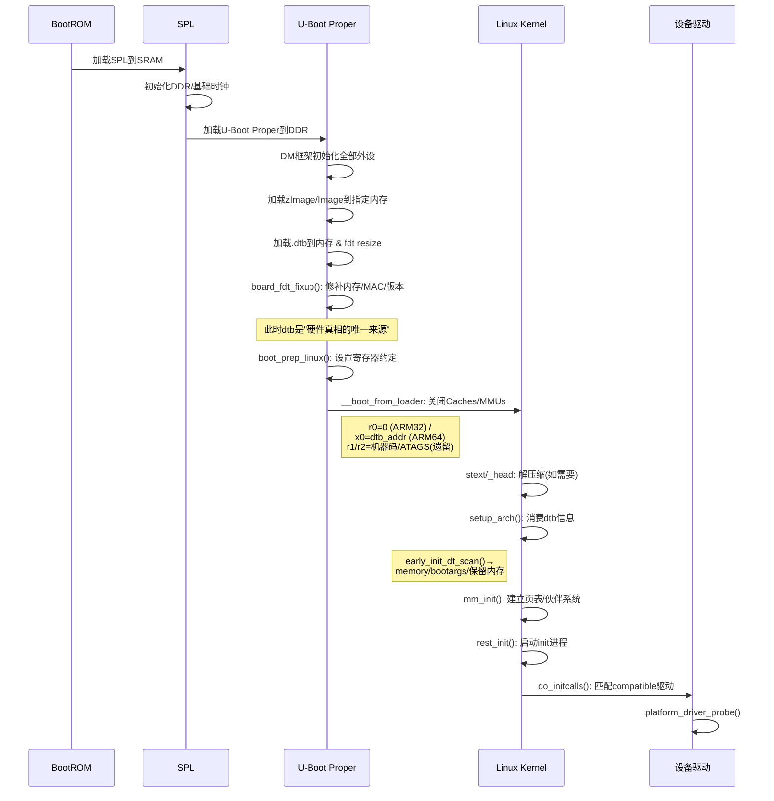

# 7.4.3 U-Boot与内核的双边协作机制

> 所属：第7章 启动引导与Bootloader > 7.4 设备树传递与修改
> 难度：[I→E] | 预计阅读时间：30分钟

## 本节导读

U-Boot完成了硬件初始化和设备树修补之后，如何将"交接棒"稳妥地递给内核？本节从双边协作视角出发，剖析U-Boot与Linux内核之间的信息传递协议——从遗留的ATAGS到现代DTB机制，揭示`bootm`命令背后寄存器约定的秘密，以及内核`setup_arch()`如何消费这些信息完成早期初始化。

---

## 知识点1：协作总览——两阶段的职责契约 [I] ~700字

### 问题场景

你在一块NXP i.MX6ULL板子上完成了U-Boot移植，DDR、UART、MMC都初始化正常，但启动内核时屏幕黑屏、串口无输出。在U-Boot命令行手动执行`bootm`后只看到一行`Starting kernel ...`，此后系统"死掉"。是内核镜像损坏？设备树不匹配？还是寄存器传参错误？

这个问题每天都出现在各大芯片厂商的FAE邮箱里。要定位它，必须先理解**U-Boot与内核之间的职责边界**——谁该做什么、做到什么程度、通过什么方式交班。

### 职责划分矩阵

```
┌─────────────────────────────────────────────────────────────────┐
│                        启动两阶段契约                             │
├──────────────────────────┬──────────────────────────────────────┤
│      U-Boot阶段           │           Linux内核阶段               │
├──────────────────────────┼──────────────────────────────────────┤
│ • CPU/Caches初始化        │ • 解析U-Boot传入的设备树/参数         │
│ • DDR控制器Training       │ • early_printk / serial初始化         │
│ • 基础时钟/PLL配置        │ • 内存管理子系统初始化                 │
│ • 串口初始化（用于输出）   │ • 设备驱动probe匹配                   │
│ • 存储介质驱动初始化       │ • 根文件系统挂载                      │
│ • 加载内核镜像到内存       │                                       │
│ • 加载dtb到内存           │                                       │
│ • 修补dtb（内存/MAC等）   │                                       │
│ • 设置寄存器约定（r0-r2）  │                                       │
│ • 关闭I-Cache/D-Cache/MMUs │ • 重新使能MMU/Caches                │
│ • 跳转到内核入口点         │                                       │
└──────────────────────────┴──────────────────────────────────────┘
```

### 协作全景图



### 关键交接点：寄存器约定

ARM架构的U-Boot→内核跳转遵循严格的寄存器约定，这是双边协作的"物理层协议"：

| 架构 | 寄存器 | 含义 | 设置代码位置 |
|------|--------|------|------------|
| **ARM32** | `r0` | 固定为 0 | `arch/arm/lib/bootm.c: boot_jump_linux()` |
| ARM32 | `r1` | machine type (legacy) | 同上，`gd->bd->bi_arch_number` |
| ARM32 | `r2` | ATAGS或DTB物理地址 | 同上，`gd->bd->bi_boot_params` |
| **ARM64** | `x0` | DTB物理地址 | `arch/arm/lib/bootm.c: boot_jump_linux()` |
| ARM64 | `x1-x3` | 保留，必须为0 | 同上 |
| RISC-V | `a0` | hart ID | `arch/riscv/lib/bootm.c` |
| RISC-V | `a1` | DTB物理地址 | 同上 |

⚠️ **常见陷阱**：ARM32平台上，`r2`寄存器既可能指向ATAGS列表也可能指向DTB。内核通过DTB头部的魔数`0xd00dfeed`（大端）来自动判别。如果U-Boot传递了DTB地址但内核编译时未启用`CONFIG_OF_FLATTREE`，内核会把DTB内容当成ATAGS解析，导致早期panic。

💡 **调试技巧**：在U-Boot的`boot_jump_linux()`函数中加入`printf`打印寄存器值，是排查"Starting kernel ...后黑屏"的第一步。例如：

```c
/* arch/arm/lib/bootm.c (调试补丁) */
void boot_jump_linux(ulong kernel, ulong arg0, ulong arg1, ulong arg2)
{
    /* 加入以下调试输出 */
    printf("DEBUG: jumping to kernel=0x%lx, r0=%lu, r1=0x%lx, r2=0x%lx\n",
           kernel, arg0, arg1, arg2);
    /* ... 原有代码 ... */
}
```

---

## 知识点2：信息传递协议——从ATAGS到DTB的演进 [E] ~1500字

### 问题场景

你维护一个2015年启动的ARM32项目，内核从3.10升级到5.10后，发现`mem=256M`的bootargs限制不再生效，内核总是识别出全部512MB内存。进一步调查发现，U-Boot仍然使用`setup_memory_tags()`设置ATAGS，但新内核似乎"忽略"了这些标签。这引出了一个根本性问题：**ATAGS和DTB究竟是什么关系？为什么社区要废弃ATAGS？**

### ATAGS机制（ARM32遗留）

ATAGS（ARM Tags）是早期ARM Linux定义的一种**链表式参数传递结构**，由U-Boot在内存中构建一个tag链表，通过`r2`寄存器传递首地址给内核。

```c
/* arch/arm/include/asm/setup.h - ATAG核心结构定义 */
struct tag {
    struct tag_header hdr;     /* size + tag ID */
    union {
        struct tag_core       core;        /* ATAG_CORE */
        struct tag_mem32      mem;         /* ATAG_MEM: 内存区域描述 */
        struct tag_videotext  videotext;
        struct tag_ramdisk    ramdisk;
        struct tag_initrd     initrd;      /* ATAG_INITRD2: initrd位置 */
        struct tag_serialnr   serialnr;
        struct tag_revision   revision;
        struct tag_videolfb   videolfb;
        struct tag_cmdline    cmdline;     /* ATAG_CMDLINE: 内核参数 */
        struct tag_acorn      acorn;
        struct tag_memclk     memclk;
    } u;
};

#define ATAG_CORE      0x54410001
#define ATAG_MEM       0x54410002
#define ATAG_CMDLINE   0x54410009
#define ATAG_INITRD2   0x54420005
```

U-Boot在`arch/arm/lib/bootm.c`中构建ATAGS链表：

```c
/* arch/arm/lib/bootm.c - ATAGS构建核心路径 */
static void setup_start_tag(struct bd_info *bd)
{
    params = (struct tag *)bd->bi_boot_params;  /* 通常是DRAM基址+0x100 */
    params->hdr.tag = ATAG_CORE;
    params->hdr.size = tag_size(tag_core);
    params->u.core.flags = 0;
    params->u.core.pagesize = 0;
    params->u.core.rootdev = 0;
    params = tag_next(params);  /* 链表前进 */
}

static void setup_memory_tags(struct bd_info *bd)
{
    int i;
    for (i = 0; i < CONFIG_NR_DRAM_BANKS; i++) {
        if (bd->bi_dram[i].size) {
            params->hdr.tag = ATAG_MEM;
            params->hdr.size = tag_size(tag_mem32);
            params->u.mem.start = bd->bi_dram[i].start;
            params->u.mem.size = bd->bi_dram[i].size;
            params = tag_next(params);
        }
    }
}

static void setup_commandline_tag(struct bd_info *bd, char *cmdline)
{
    params->hdr.tag = ATAG_CMDLINE;
    params->hdr.size = (sizeof(struct tag_header) + strlen(cmdline) + 1 + 4) >> 2;
    strcpy(params->u.cmdline.cmdline, cmdline);
    params = tag_next(params);
}
```

ATAGS的核心局限在于：**它是一个封闭的枚举协议**。每增加一种硬件描述需求（如内存NUMA拓扑、保留内存区域、CPU集群信息），都需要修改U-Boot和内核两边的tag定义，无法扩展。

### DTB机制（现代标准）

DTB（Flattened Device Tree Blob）通过自描述的节点/属性层级结构解决了ATAGS的扩展性问题。U-Boot只需将DTB的内存地址通过寄存器传给内核，内核的`libfdt`库统一解析。

### ATAGS vs DTB 深度对比

| 对比维度 | ATAGS (Legacy) | DTB (Modern) | 工程影响 |
|---------|----------------|-------------|---------|
| **数据结构** | 扁平链表，固定tag ID枚举 | 层级化节点/属性树 | DTB可描述任意复杂硬件拓扑 |
| **扩展性** | 差，新增tag需改U-Boot+内核 | 优，新增节点/属性无需改解析器 | DTB向后兼容，ATAGS不兼容 |
| **内存描述** | 最多16个`ATAG_MEM`连续区域 | `/memory`节点支持`#address-cells/#size-cells`任意宽度 | 支持>4GB内存、NUMA、稀疏映射 |
| **bootargs传递** | `ATAG_CMDLINE`字符串拷贝 | `/chosen/bootargs`属性 | DTB支持合并策略（见下方） |
| **保留内存** | 不支持，需bootargs的`mem=`绕过 | `/memreserve/`或`reserved-memory`节点 | DTB精确控制，ATAGS只能粗暴裁剪 |
| **Overlay支持** | 无 | `fdt_overlay_apply()`动态叠加 | 模块化硬件配置管理 |
| **U-Boot代码量** | `setup_memory_tags()`等专用函数 | 通用`boot_prep_linux()` + `libfdt` | DTB反而减少U-Boot代码 |
| **内核解析入口** | `parse_tags()` → `parse_tag_mem32()`等 | `early_init_dt_scan()` → `of_fdt_raw_init()` | 内核5.x+已废弃ATAGS解析 |

🔴 **安全提醒**：Linux内核从**v5.0**开始正式标记ATAGS为废弃（`CONFIG_ATAGS_DEPRECATED`），ARM32 defconfig在v5.8后默认关闭ATAGS支持。如果你的项目仍在维护遗留ARM32平台，务必确认内核配置中启用了`CONFIG_ATAGS=y`或迁移到DTB启动。

### 内核端：setup_arch()如何消费DTB信息

DTB传递只是"物理运输"，真正的消费发生在内核的架构相关初始化路径。ARM64的核心入口是`setup_arch()`：

```
start_kernel()
  └── setup_arch(&command_line)           // arch/arm64/kernel/setup.c
       └── setup_machine_fdt(__fdt_pointer)  // 如果通过DTB启动
            └── early_init_dt_scan()
                 ├── early_init_dt_scan_chosen()  → /chosen/bootargs
                 ├── early_init_dt_scan_root()    → #size-cells, #address-cells
                 ├── early_init_dt_scan_memory()  → /memory/reg[]
                 └── early_init_dt_scan_nodes()   → 保留内存、initrd
```

```c
/* arch/arm64/kernel/setup.c - setup_arch核心流程 */
void __init setup_arch(char **cmdline_p)
{
    /* 1. 初始化进程页表 */
    paging_init();

    /* 2. 从DTB解析内存布局 → memblock分配器 */
    arm64_memblock_init();

    /* 3. 从DTB解析CPU拓扑 → cpu_possible_mask */
    setup_smp();

    /* 4. 从DTB解析保留内存 → CMA、 framebuffer区域 */
    early_init_fdt_scan_reserved_mem();

    /* 5. 合并bootargs: dtb中的 + CONFIG_CMDLINE + bootloader传入的 */
    *cmdline_p = boot_command_line;

    /* 6. 初始化设备树映射，为后续驱动probe做准备 */
    unflatten_device_tree();
}
```

### bootargs合并策略（关键细节）

一个常被忽略的细节是：`/chosen/bootargs`中的参数**不会简单覆盖**U-Boot通过其他方式传入的参数，而是遵循复杂的合并优先级：

```
最终 boot_command_line = 
    (dtb /chosen/bootargs)  ← 优先级最低
    [+ " " + CONFIG_DEFAULT_CMDLINE]  ← 内核编译时硬编码（如果CONFIG_CMDLINE_OVERRIDE=n）
    [+ " " + bootloader传入的]       ← U-Boot通过寄存器/其他机制传入
```

💡 **实践技巧**：如果需要在U-Boot命令行**临时覆盖**dtb中的bootargs，不要修改dtb，而是直接修改U-Boot环境变量`bootargs`。U-Boot的`bootm`命令会优先使用`bootargs`环境变量的值，通过`fdt_setprop()`写入`/chosen/bootargs`覆盖原有内容。

```bash
# U-Boot命令行临时覆盖（调试场景）
=> setenv bootargs "console=ttyS0,115200 mem=128M root=/dev/nfs nfsroot=192.168.1.1:/rootfs"
=> saveenv   # 若需永久生效
=> boot
```

---

## 知识点3：常见协作问题排查 [I] ~1000字

### 问题场景

产线反馈：同一批次100块板子中有3块启动后网卡不工作，eth0没有出现在`ifconfig -a`中。U-Boot阶段网络正常（`ping`通服务器），说明硬件没问题。问题出在U-Boot→内核的设备树传递链路中——但究竟是dtb损坏、地址传递错误，还是内核驱动匹配失败？

### 排查方法论：五层检查法

```
Layer 5: 内核驱动层  → dmesg | grep eth  → 是否probe成功？compatible匹配？
Layer 4: 内核解析层  → /proc/device-tree/  → 节点/属性是否存在？
Layer 3: 寄存器传递层 → printk x0/r2值   → U-Boot传的地址对吗？
Layer 2: U-Boot修改层 → fdt print /soc/eth  → U-Boot修改后的dtb正确吗？
Layer 1: U-Boot加载层 → fdt header         → 原始.dtb文件是否损坏？
```

### 常见问题排查表

| 现象 | 根因定位 | 诊断命令/方法 | 解决方案 |
|------|---------|-------------|---------|
| `Starting kernel ...`后死机 | DTB地址传递错误 | U-Boot: `bdinfo`查看`bi_boot_params`；内核debug: 在`stext`加LED点灯 | 检查`fdt addr`设置是否与`bootm`参数一致 |
| `/proc/cmdline`为空或不完整 | bootargs未传递 | U-Boot: `fdt print /chosen`；内核: `cat /proc/cmdline` | 确认`bootargs`环境变量存在且非空；检查`fdt set /chosen bootargs` |
| 内存识别错误（dmesg中size不对） | DTB `/memory`节点错误 | U-Boot: `fdt print /memory`；内核: `dmesg \| grep Memory` | 在`board_fdt_fixup()`中修正`fdt_fixup_memory_banks()` |
| 某些设备在U-Boot正常但内核看不到 | DTB节点status="disabled" | `fdt print /soc/xxx@addr status` | U-Boot中`fdt set /soc/xxx status "okay"` |
| dtb版本不匹配的warnings | DTC版本差异导致内部格式不兼容 | `fdtdump board.dtb \| head -5`查看版本；`fdt header` | 统一SDK中的DTC工具版本；或在U-Boot中重新`fdt resize`刷新 |
| Overlay加载后设备缺失 | Overlay目标节点路径错误或签名不匹配 | `fdt print /__fixups__`查看fixup表；检查`.dtbo`的`__symbols__` | 确认overlay的`fragment@N/target`路径正确；检查`fdt_overlay_apply()`返回值 |
| 内核panic: `Failed to get reserved memory` | 保留内存DT描述与实际冲突 | `dmesg \| grep -i "reserved memory"` | 检查`/memreserve/`与`/reserved-memory/`节点是否重叠 |

### 实践案例：MAC地址传递链的端到端排查

**背景**：某车载ECU项目，MAC地址存储在板载AT24C32 EEPROM的0x10偏移处。U-Boot成功读取并设置网络MAC（`ethaddr`环境变量可见），但内核启动后`eth0`的MAC变为随机地址`02:00:00:00:00:01`。

**排查过程**：

```bash
# Step 1: U-Boot侧验证——MAC是否正确写入DTB
=> fdt addr 0x83000000
=> fdt print /soc/ethernet@1c30000 local-mac-address
local-mac-address = [00 11 22 33 44 55]   # ← U-Boot写入正确

# Step 2: 内核启动后验证——DTB节点是否被正确接收
# 进入Linux shell后
cat /proc/device-tree/soc/ethernet@1c30000/local-mac-address | xxd
# 输出: 00000000: 0011 2233 4455                       .."3DU
# ← 内核正确接收

# Step 3: 内核dmesg检查驱动probe过程
dmesg | grep -i ethernet
# [    2.345678] sun4i-emac 1c30000.ethernet: Invalid MAC address, using random
# ↑ 问题发现！驱动读的是节点里的mac-address属性，不是local-mac-address！
```

**根因**：该SoC的EMAC驱动（`drivers/net/ethernet/allwinner/sun4i-emac.c`）使用`of_get_mac_address()`查找顺序为：
1. `mac-address` 属性
2. `local-mac-address` 属性
3. EEPROM中的`nvmem-cells`关联
4. 随机生成

U-Boot写入的是`local-mac-address`，但该驱动优先查找`mac-address`。由于DTS中没有`mac-address`属性，驱动回退到随机生成。

**修复方案**：

```c
/* board_fdt_fixup() 修改：同时写入两个属性确保兼容性 */
int board_fdt_fixup(struct bd_info *bis)
{
    void *blob = (void *)gd->fdt_blob;
    u8 mac[6];
    
    /* 从EEPROM读取MAC */
    at24c32_read_mac(mac);
    
    /* 同时写入两个属性名，兼容不同驱动实现 */
    fdt_find_and_setprop(blob, "/soc/ethernet@1c30000",
                         "mac-address", mac, 6, 1);
    fdt_find_and_setprop(blob, "/soc/ethernet@1c30000",
                         "local-mac-address", mac, 6, 1);
    return 0;
}
```

### DTB Overlay加载失败的排查流程

设备树Overlay（DTBO）在复杂项目中日益常见，加载失败时有特定的排查路径：

```bash
# 1. 验证基础DTB和DTBO格式正确性
dtc -I dtb -O dts base.dtb > /dev/null && echo "base.dtb OK"
dtc -I dtb -O dts overlay.dtbo > /dev/null && echo "overlay.dtbo OK"

# 2. 检查overlay的符号表是否完整（U-Boot依赖此进行fixup）
fdtdump overlay.dtbo | grep "__symbols__" -A 20
# 必须包含被overlay引用的label符号定义

# 3. U-Boot中逐步应用，观察返回值
=> fdt addr 0x83000000
=> fdt resize 0x20000
=> fdt apply 0x84000000
# 成功无输出；失败会报: "Failed to apply overlay: FDT_ERR_NOTFOUND" 等

# 4. 检查overlay的__fixups__表中的路径是否存在于base.dtb
=> fdt print /__fixups__
=> fdt print /soc/ethernet@1c30000  # 确认目标节点存在
```

⚠️ **常见陷阱**：`fdt apply`命令对overlay的`.dtbo`文件有**格式要求**——必须包含`__symbols__`节点，这是由DTC的`@`标签语法在编译时自动生成的。如果手工编写overlay DTS时忘记给被引用节点加标签（如`&ethernet`中的`ethernet:`标签），编译出的`.dtbo`缺少符号表，`fdt apply`会报`FDT_ERR_NOTFOUND`。

💡 **排查技巧**：在内核command line中加入`dyndbg="module dwc3 +p"`（或对应驱动模块名）可以动态开启驱动的详细probe日志，帮助判断问题是"DTB没传到"还是"驱动没匹配"。

---

## 本节总结

U-Boot与内核的双边协作是嵌入式启动链路中最精密的"外科手术"——U-Boot负责将硬件世界初始化到"可交班"状态，通过严格的寄存器约定将DTB这份"硬件真相文档"递交给内核；内核则通过`setup_arch()` → `early_init_dt_scan()`的消费链，将静态设备描述转化为动态的内存管理器和设备驱动匹配系统。

**核心要点速记**：

1. **寄存器约定是契约**：ARM32用`r2`传DTB/ATAGS地址，ARM64用`x0`传DTB地址，搞错架构的传参方式是"Starting kernel ...后死机"的头号原因
2. **ATAGS已死，DTB当立**：新项目严禁使用ATAGS，遗留项目升级到内核5.x+必须完成DTB迁移
3. **bootargs有合并优先级**：dtb中的`bootargs` + `CONFIG_CMDLINE` + U-Boot传入的，三层合并，理解优先级才能解释"为什么参数没生效"
4. **排查用五层法**：从U-Boot加载层 → 修改层 → 寄存器传递层 → 内核解析层 → 驱动层，逐层隔离问题

---

## 配套资源

### 表格清单

| 表号 | 内容 | 位置 |
|-----|------|------|
| 表1 | U-Boot与Linux内核职责划分矩阵 | 知识点1 |
| 表2 | 寄存器约定对照表（ARM32/ARM64/RISC-V） | 知识点1 |
| 表3 | ATAGS vs DTB深度对比（8维度） | 知识点2 |
| 表4 | 常见协作问题排查表（7个典型场景） | 知识点3 |

### 图示清单

| 图号 | 类型 | 描述 |
|-----|------|------|
| 图1 | mermaid时序图 | U-Boot到内核完整启动协作全景（BootROM→SPL→U-Boot→Kernel→Driver） |

### 代码清单

| 编号 | 内容 | 用途 |
|-----|------|------|
| 代码1 | ATAGS核心数据结构（tag_header + tag联合体） | 理解遗留机制的内部实现 |
| 代码2 | U-Boot ATAGS构建路径（setup_memory_tags/setup_commandline_tag） | 遗留平台维护参考 |
| 代码3 | boot_jump_linux()调试补丁（printf寄存器值） | 黑屏问题现场排查 |
| 代码4 | board_fdt_fixup() MAC双属性写入方案 | 解决驱动兼容性案例 |

### 延伸阅读

- 内核DTB消费路径：`arch/arm64/kernel/setup.c → setup_arch()` / `arch/arm/kernel/setup.c`
- 早期扫描实现：`drivers/of/fdt.c → early_init_dt_scan()`
- ATAGS定义：`arch/arm/include/uapi/asm/setup.h`
- U-Boot跳转代码：`arch/arm/lib/bootm.c: boot_jump_linux()` / `arch/arm64/lib/bootm.c`
- DT Spec中/chosen节点规范：`https://devicetree-specification.readthedocs.io/en/stable/chapter3-devicenodes.html#chosen`
