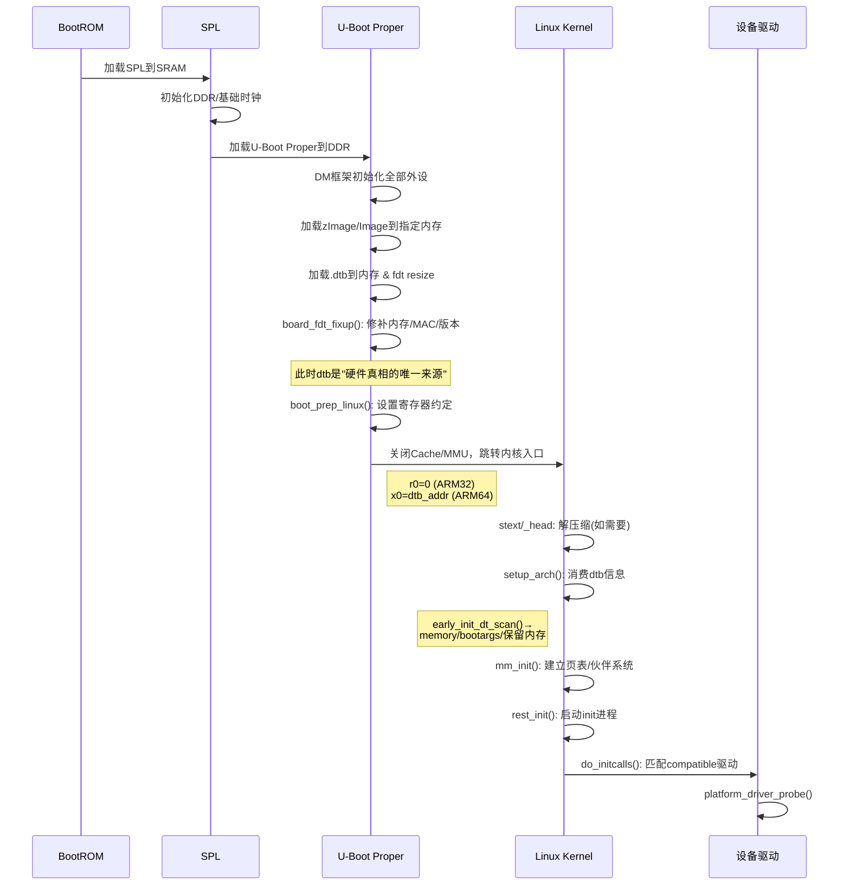

# 7.4.3 U-Boot与内核的双边协作机制

> 所属章节：第7章 启动链深度解析 > 7.4 设备树交接
> 
> 难度：[I→E] | 预计阅读时间：30分钟

## <span class="blue"> 本节导读

7.4.1 看了交接的发起端——U-Boot 怎么修 dtb；7.4.2 看了接收端——内核怎么把 dtb 展开成树。本节把两端拼到一起，回答衔接处的问题：U-Boot 和内核是两个独立维护的开源项目，各自发版、各自演进，交接 dtb 这个动作靠什么保证两边对得上？答案是一份书面的启动约定（boot protocol）：dtb 地址放哪个寄存器、对齐到几字节、跳转时 CPU 处于什么状态、bootargs 由谁写由谁读，全部白纸黑字。约定双边遵守，启动链顺畅交接；任一方违约，故障就出现在"Starting kernel ..."那行打印之后。<BR>
本节覆盖：U-Boot 与内核的职责划分、寄存器传参与对齐约定、ATAGS 到 DTB 的约定演进、chosen 节点的语义与 bootargs 合并优先级、违约故障的分层排查法。

---

## <span class="blue"> Starting kernel 之后黑屏，锅在哪一边 [I]

一块 i.MX6ULL 板子，U-Boot 移植完成，DDR、UART、MMC 全部正常，`bootm` 敲下去只看到一行 `Starting kernel ...`，然后世界安静了。内核镜像损坏？设备树不匹配？寄存器传参错误？——这类问题常年占据芯片厂商 FAE 邮箱的前列，而定位它的前提是先看清两边的职责边界：U-Boot 该把硬件初始化到什么程度，内核又从什么状态接手。

```
┌─────────────────────────────────────────────────────────────────┐
│                        启动两阶段契约                             │
├──────────────────────────┬──────────────────────────────────────┤
│      U-Boot阶段           │           Linux内核阶段               │
├──────────────────────────┼──────────────────────────────────────┤
│ • CPU/Caches初始化        │ • 解析U-Boot传入的设备树/参数         │
│ • DDR控制器Training       │ • early_printk / serial初始化         │
│ • 基础时钟/PLL配置        │ • 内存管理子系统初始化                 │
│ • 串口初始化（用于输出）   │ • 设备驱动probe匹配                   │
│ • 存储介质驱动初始化       │ • 根文件系统挂载                      │
│ • 加载内核镜像到内存       │                                       │
│ • 加载dtb到内存           │                                       │
│ • 修补dtb（内存/MAC等）   │                                       │
│ • 设置寄存器约定          │                                       │
│ • 关闭Cache/MMU           │ • 重新使能MMU/Cache                  │
│ • 跳转到内核入口点         │                                       │
└──────────────────────────┴──────────────────────────────────────┘
```

划界的逻辑一句话可以说清：**U-Boot 负责让硬件进入"可被描述"的状态，内核负责按描述重新接管**。DDR 必须 Training 完成（否则内核无处可去），串口初始化到能打印即可（驱动内核自己会再配一遍），外设点亮与否不重要（dtb 描述清楚就行）。本章前几节分别看过这条链的各个环节，拼起来的全景如下：


```mermaid
sequenceDiagram
    participant BR as BootROM
    participant SPL as SPL
    participant UB as U-Boot Proper
    participant KL as Linux Kernel
    participant DR as 设备驱动

    BR->>SPL: 加载SPL到SRAM
    SPL->>SPL: 初始化DDR/基础时钟
    SPL->>UB: 加载U-Boot Proper到DDR
    UB->>UB: DM框架初始化全部外设
    UB->>UB: 加载zImage/Image到指定内存
    UB->>UB: 加载.dtb到内存 & fdt resize
    UB->>UB: board_fdt_fixup(): 修补内存/MAC/版本
    Note over UB: 此时dtb是"硬件真相的唯一来源"
    UB->>UB: boot_prep_linux(): 设置寄存器约定
    UB->>KL: 关闭Cache/MMU，跳转内核入口
    Note right of UB: r0=0 (ARM32)<br>x0=dtb_addr (ARM64)
    KL->>KL: stext/_head: 解压缩(如需要)
    KL->>KL: setup_arch(): 消费dtb信息
    Note left of KL: early_init_dt_scan()→<br>memory/bootargs/保留内存
    KL->>KL: mm_init(): 建立页表/伙伴系统
    KL->>KL: rest_init(): 启动init进程
    KL->>DR: do_initcalls(): 匹配compatible驱动
    DR->>DR: platform_driver_probe()
```

---

## <span class="blue"> 交接的物理层：寄存器、对齐与 CPU 状态 [I→E]

两个独立项目之间传一个内存地址，没有任何运行时握手——跳过去就不回来了。约定只能提前写死，ARM 各架构的寄存器分工：

| 架构 | 寄存器 | 含义 | 设置代码位置 |
|------|--------|------|------------|
| **ARM32** | `r0` | 固定为 0 | `arch/arm/lib/bootm.c: boot_jump_linux()` |
| ARM32 | `r1` | machine type（遗留） | 同上，`gd->bd->bi_arch_number` |
| ARM32 | `r2` | ATAGS 或 DTB 物理地址 | 同上，`gd->bd->bi_boot_params` |
| **ARM64** | `x0` | DTB 物理地址 | `arch/arm/lib/bootm.c: boot_jump_linux()` |
| ARM64 | `x1–x3` | 保留，必须为 0 | 同上 |
| RISC-V | `a0` | hart ID | `arch/riscv/lib/bootm.c` |
| RISC-V | `a1` | DTB 物理地址 | 同上 |

寄存器只是约定的一半。ARM64 的 boot protocol 对交接瞬间的整机状态还有一组硬性条款，U-Boot 的 `boot_jump_linux()` 逐条落实：

- **dtb 地址 8 字节对齐**，且整个 dtb 不得超过 2MB——内核入口直接按对齐地址读头部，错位即魔数校验失败
- **MMU 关闭、D-Cache 清理并关闭**——内核入口运行在物理地址世界，脏的 D-Cache 会让它读到过期数据
- **x1–x3 清零**——给将来的协议扩展留位，旧内核遇到非零值行为未定义
- **异常级别**：进入内核时处于 EL2（推荐）或非安全 EL1，中断全部屏蔽

违约的故障形态和条款一一对应：dtb 地址没对齐或传错，`early_init_dt_verify()` 魔数校验失败，ARM64 上 `setup_machine_fdt()` 打印 `Error: invalid device tree blob ...` 后原地空转挂死（7.4.2 的案例就是这个形态）；顺带一提，另一条 `Invalid device tree blob header` 报错来自 unflatten 阶段（fdt.c），出现的时机更晚、含义不同，别混为一谈。D-Cache 没清干净，内核早期读到的 dtb 是缓存里的旧值，表现为偶发的、换 dtb 也治不好的解析错乱——这类故障最难查，因为它看起来"有时候能启动"。

ARM32 还有一个历史包袱：r2 既可能指向 DTB，也可能指向旧的 ATAGS 链表，内核靠 DTB 头部魔数 `0xD00DFEED`（大端）自动判别。判别成立的前提是内核编译时开了 `CONFIG_OF_FLATTREE`——没开的内核会把 DTB 内容当 ATAGS 解析，早期 panic。

> 💡 "Starting kernel ... 后黑屏"的第一排查动作，是在 U-Boot 的 `boot_jump_linux()` 里加一行打印，确认跳转前的真实值：

```c
/* arch/arm/lib/bootm.c（U-Boot 侧调试补丁，函数头照抄真实签名） */
static void boot_jump_linux(struct bootm_headers *images, int flag)
{
    printf("DEBUG: kernel_entry=0x%lx, dtb=%p\n",
           (ulong)images->ep, images->ft_addr);
    /* ... 原有代码：ARM32 设 r0=0/r1=machid/r2=ft_addr，ARM64 设 x0=ft_addr ... */
}
```

---

## <span class="blue"> 约定的演进：ATAGS 为什么被 DTB 取代 [E]

寄存器约定里那个"r2 传 DTB 或 ATAGS"的二义性，来自一段演进史。ATAGS 是早期 ARM Linux 的参数传递协议：U-Boot 在内存里构建一条 tag 链表，内存大小一个 tag、命令行一个 tag、initrd 位置一个 tag，r2 指向链头。

```c
/* arch/arm/include/asm/setup.h - ATAG核心结构 */
struct tag {
    struct tag_header hdr;     /* size + tag ID */
    union {
        struct tag_core       core;        /* ATAG_CORE */
        struct tag_mem32      mem;         /* ATAG_MEM: 内存区域 */
        struct tag_ramdisk    ramdisk;
        struct tag_initrd     initrd;      /* ATAG_INITRD2: initrd位置 */
        struct tag_cmdline    cmdline;     /* ATAG_CMDLINE: 内核参数 */
        /* ... */
    } u;
};

#define ATAG_CORE      0x54410001
#define ATAG_MEM       0x54410002
#define ATAG_CMDLINE   0x54410009
```

ATAGS 的死穴是**封闭的枚举协议**：tag ID 是一张固定清单，每多描述一种硬件信息（NUMA 拓扑、保留内存、CPU 集群），就得 U-Boot 和内核两边同步改代码、同步发版。两个独立项目共享一份枚举表，演进成本随硬件复杂度线性爆炸。DTB 用自描述的节点/属性层级取代枚举：新增信息只是多加一个节点，解析器不用改。对照之下取舍一目了然：

| 维度 | ATAGS（遗留） | DTB（现代标准） |
|------|--------------|----------------|
| **数据结构** | 扁平链表，固定 tag ID | 层级化节点/属性树 |
| **扩展性** | 新增 tag 需双边改代码 | 新增节点无需改解析器 |
| **内存描述** | 最多 16 个 `ATAG_MEM` 区域 | `#address-cells/#size-cells` 任意宽度 |
| **bootargs** | `ATAG_CMDLINE` 字符串 | `/chosen/bootargs` 属性 |
| **保留内存** | 不支持，靠 `mem=` 硬裁 | `/memreserve/` 与 `reserved-memory` 节点精确控制 |
| **内核解析** | `parse_tags()` 逐个分支 | `early_init_dt_scan()` 统一入口 |

> 🔴 ATAGS 早已停止演进：2011 年起内核社区就规定新 ARM 平台必须走设备树，ATAGS 只为老平台保留，直到今天内核里仍能看到 `CONFIG_ATAGS` 开关。遗留 ARM32 项目换内核时若 U-Boot 还在发 ATAGS，先确认这个开关是开的，或者干脆把启动方式迁到 DTB——后者是一劳永逸的方向。

---

## <span class="blue"> chosen 节点：双方心照不宣的信箱 [E]

dtb 里大多数节点描述硬件，`/chosen` 是唯一的例外——它描述的不是任何器件，而是**本次启动的运行时参数**，是 U-Boot 写给内核的一封短信。写入方和消费方各自认这个信箱的语义，构成了约定的另一半：

| 属性 | 写入方 | 消费方 | 语义 |
|------|--------|--------|------|
| `bootargs` | U-Boot（bootm 前写入） | `early_init_dt_scan_chosen()` | 内核命令行 |
| `linux,initrd-start/end` | U-Boot（加载 initrd 后） | `early_init_dt_check_for_initrd()` | initrd 在内存中的起止 |
| `stdout-path` | dts 预置或 U-Boot 修正 | 内核 console 子系统 | earlycon 默认输出设备 |
| `kaslr-seed` | U-Boot（可选） | 内核 KASLR | 地址随机化的熵源 |

bootargs 的写入路径值得细看，因为它解释了一个高频困惑："U-Boot 里 setenv bootargs 和 dtb 里的 bootargs，到底谁说了算"。答案是 U-Boot 在 `bootm` 执行时把环境变量 `bootargs` 的值**主动写入** dtb 的 `/chosen/bootargs`，覆盖 dts 里预置的内容——dtb 到达内核时只有一个版本，冲突在 U-Boot 侧就已经消解：

```
# 调试场景：临时覆盖dtb中预置的bootargs，不用改dtb
setenv bootargs "console=ttyS0,115200 mem=128M root=/dev/nfs nfsroot=192.168.1.1:/rootfs"
boot
```

内核侧还有第三层参与合并，最终命令行是三者的叠加：

```
最终 boot_command_line =
    (dtb /chosen/bootargs)                    ← U-Boot写入，基础层
    [+ " " + CONFIG_CMDLINE]                  ← 内核编译时硬编码
    [+ bootloader经其他机制传入]               ← 个别平台的附加通道
```

`CONFIG_CMDLINE` 这层的存在意味着：即使 dtb 里的 bootargs 完全正确，内核编进了一个强制参数（如另一个 `console=`），最终生效的就是合并结果。排查"参数没生效"时，`cat /proc/cmdline` 看到的是合成后的成品，要和 dtb 里的原始值分开核对。

---

## <span class="blue"> 任一方违约时，按五层倒查 [I→E]

协作链路上的故障，现场往往只有一句"起不来"。把链路按数据流向切成五层，每层有独立的观测手段，逐层倒查即可定位违约方。注意这套五层和 7.4.2 末尾的五环排查不是一回事：7.4.2 的五环聚焦"dtb 在内核侧为什么解析不出来"，是 Layer 3/4 内部的细查；这里的五层覆盖从 `.dtb` 文件到驱动 probe 的端到端链路，先用它把故障收到某一层，再进对应小节细看。

```
Layer 5: 内核驱动层  → dmesg | grep eth     → probe成功了吗？compatible匹配吗？
Layer 4: 内核解析层  → /proc/device-tree/   → 节点/属性到内核了吗？
Layer 3: 寄存器传递层 → boot_jump_linux打印  → 传的地址对吗？
Layer 2: U-Boot修改层 → fdt print           → 修补后的dtb对吗？
Layer 1: U-Boot加载层 → fdt header          → 原始.dtb文件完好吗？
```

典型故障按层归档：

| 现象 | 所在层 | 诊断方法 | 处理 |
|------|--------|---------|------|
| `Starting kernel ...` 后死机 | Layer 3 | `bdinfo` 看 `bi_boot_params`；`boot_jump_linux` 加打印 | 核对 `fdt addr` 与 `bootm` 参数一致 |
| dtb 魔数校验失败挂死 | Layer 3 | 检查 dtb 加载地址对齐与 cache 状态 | 地址 8 字节对齐；确认 cache 清理 |
| `/proc/cmdline` 为空或不完整 | Layer 2/4 | U-Boot：`fdt print /chosen`；内核：`cat /proc/cmdline` | 确认 bootargs 环境变量；排查 CONFIG_CMDLINE 干扰 |
| 内存识别错误 | Layer 2 | U-Boot：`fdt print /memory`；内核：`dmesg \| grep Memory` | 修 `board_fdt_fixup()` 的 `fdt_fixup_memory_banks()` |
| 设备在 U-Boot 正常、内核看不到 | Layer 2/5 | `fdt print /soc/xxx status`；dmesg 看 probe | `status` 改 `okay`；查驱动 compatible 匹配 |
| Overlay 叠加后设备缺失 | Layer 2 | `fdt apply` 返回值；查 `.dtbo` 的 `__symbols__` | 补 overlay 源文件的 label 标签重编 |

最后用一个端到端案例收束这五层。某车载 ECU，MAC 地址存在板载 EEPROM，U-Boot 读出并写入 dtb（Layer 2 验证 `fdt print` 可见 `local-mac-address = [00 11 22 33 44 55]`），内核侧 `/proc/device-tree` 回读也一致（Layer 4 通过）——但 `eth0` 的 MAC 还是随机地址。

问题暴露在 Layer 5 的 dmesg：

```
[    2.345678] sun4i-emac 1c30000.ethernet: Invalid MAC address, using random
```

驱动的 `of_get_mac_address()` 查找顺序是 `mac-address` → `local-mac-address` → nvmem → 随机生成。U-Boot 只写了 `local-mac-address`，dts 里又没有 `mac-address`，查找链一路落空回退到随机值。这不算 U-Boot 违约，也不算内核违约，而是**约定之外的经验盲区**：属性名的消费顺序由驱动实现决定，不在 boot protocol 文本里。工程上的稳妥修法是双边都写：

```c
/* board_fdt_fixup()：两个属性名同时写入，兼容不同驱动 */
fdt_find_and_setprop(blob, "/soc/ethernet@1c30000",
                     "mac-address", mac, 6, 1);
fdt_find_and_setprop(blob, "/soc/ethernet@1c30000",
                     "local-mac-address", mac, 6, 1);
```

> 💡 分不清故障在"DTB 没传到"还是"驱动没匹配"时，内核命令行加 `dyndbg="module <驱动模块名> +p"` 动态打开驱动的 probe 日志，一次启动就能把问题切到某一侧。

---

## <span class="blue"> 本节总结

| 要点 | 内容 |
|------|------|
| **职责划界** | U-Boot 把硬件初始到"可被描述"的状态，内核按 dtb 描述重新接管 |
| **寄存器约定** | ARM32 走 r2（DTB/ATAGS 二义，靠魔数判别），ARM64 走 x0、x1–x3 清零 |
| **交接瞬间的 CPU 状态** | dtb 8 字节对齐且 ≤2MB，MMU/D-Cache 关闭，中断屏蔽 |
| **ATAGS 之死** | 封闭枚举协议，扩展需双边同步改代码；v5.0 起废弃，新项目只用 DTB |
| **chosen 语义** | 非硬件节点，是 U-Boot 写给内核的运行时参数信箱 |
| **bootargs 三层合并** | dtb 预置被 U-Boot 环境变量覆盖，再与 CONFIG_CMDLINE 合成最终命令行 |
| **五层排查法** | 加载 → 修改 → 传递 → 解析 → 驱动，每层独立观测，倒查定位违约方 |
| **约定之外** | 属性消费顺序由驱动实现决定，双写 `mac-address`/`local-mac-address` 是稳妥解 |

> 🔴 U-Boot 与内核的协作没有运行时握手，全部可靠性押在一份静态约定上。这份约定的价值恰恰在于它的脆弱——每一条款（对齐、cache 状态、寄存器、chosen 语义）被打破时的故障形态都是确定的，反过来背熟了故障形态表，就拥有了整条启动链最快的定位能力。

---

## <span class="blue"> 下一步

交接完成，内核拿到了 dtb 和命令行，控制权正式进入内核世界。7.5 节从 `head.S` 的第一条指令开始：MMU 怎么开、`start_kernel()` 里几十个子系统初始化的顺序为什么是严格的依赖链、initcall 的八个级别怎么排辈分，最后到 PID 1 的诞生——"Starting kernel"之后的世界，逐一点亮。

---

## <span class="blue"> 延伸阅读

- 内核 DTB 消费路径：`arch/arm64/kernel/setup.c → setup_arch()` / `arch/arm/kernel/setup.c`
- 早期扫描实现：`drivers/of/fdt.c → early_init_dt_scan()`
- ATAGS 定义：`arch/arm/include/uapi/asm/setup.h`
- U-Boot 跳转代码：`arch/arm/lib/bootm.c: boot_jump_linux()` / `arch/arm64/lib/bootm.c`
- ARM64 boot protocol：`Documentation/arch/arm64/booting.rst`
- DT Spec 中 /chosen 节点规范：`https://devicetree-specification.readthedocs.io/en/stable/chapter3-devicenodes.html#chosen`
