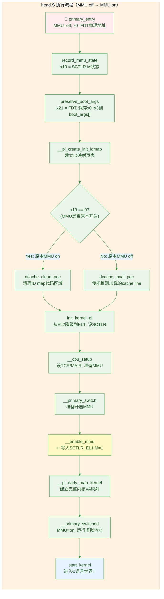

# 7.5.1 head.S：内核的汇编入口与MMU开启

> 所属：第7章 系统启动全链路 > 7.5 内核解压缩与汇编入口
> 难度：[E] | 预计阅读时间：40分钟

## 本节导读

当U-Boot通过`booti`命令将压缩内核加载到内存并跳转到`IMAGE_START`地址时，CPU仍然运行在物理地址空间（MMU off）。从这一刻到`start_kernel()`被调用之间，内核必须完成一次惊险的"空中换引擎"——在**关闭MMU的裸奔状态**下建立页表、开启MMU、瞬间切换到虚拟地址空间继续执行。本节深入`arch/arm64/kernel/head.S`，追踪`primary_entry`到`__primary_switched`的完整代码路径，揭示早期ID映射页表的设计哲学，并解剖SCTLR_EL1寄存器开启MMU的那个关键瞬间。

---

## 知识点1：head.S入口 — 从primary_entry到__primary_switched [E] ~1200字

### 问题场景

你正在移植Linux 6.6到一款新的ARM64 SoC，U-Boot已经能正确加载内核镜像并跳转，但串口在`Starting kernel ...`之后就再无输出。JTAG跟踪发现PC指向了一个非法地址，而且是在`__primary_switch`附近。你怀疑MMU开启瞬间出了问题——但head.S的执行流程像一团迷雾：标签跳转交织、汇编宏嵌套、C函数穿插其中。你需要精确理解每一条指令的执行时序。

### 机制深入

#### head.S的整体定位与入口约定

`arch/arm64/kernel/head.S`是**内核真正执行的第一行代码**（链接脚本中`.head.text`段位于`TEXT_OFFSET`之后的最前端）。Bootloader跳转过来时必须满足严格的约定：

```
进入条件：
  - MMU = off, D-cache = off, I-cache = on或off
  - x0 = FDT blob的物理地址（U-Boot传递）
  - CPU运行在EL1或EL2（由ATF/UEFI决定）
```

⚠️ **常见陷阱**：如果Bootloader跳转时MMU是开启的（某些UEFI场景），内核需要特殊处理。`record_mmu_state`函数正是为此存在——它读取`SCTLR_ELx.M`位并将状态存入x19，供后续路径判断。

#### 关键寄存器约定（贯穿启动全程）

head.S在注释中明确声明了三个callee-saved寄存器的全生命周期用途：

| 寄存器 | 作用域 | 用途 | 说明 |
|--------|--------|------|------|
| `x19` | `primary_entry()` ~ `start_kernel()` | 记录进入时MMU是否开启 | `0`=MMU off, 非`0`=MMU on |
| `x20` | `primary_entry()` ~ `__primary_switch()` | CPU启动模式 | `BOOT_CPU_MODE_EL1`或`EL2` |
| `x21` | `primary_entry()` ~ `start_kernel()` | FDT指针 | 从Bootloader x0参数保存 |

💡 **技巧**：阅读head.S时，以这三个寄存器为锚点追踪数据流，可以快速理清代码脉络。x19尤其关键——它决定了cache invalidation路径和`init_kernel_el`的参数。

#### primary_entry → __primary_switched 完整执行流



**执行流的四个关键阶段**：

**阶段一：状态记录与参数保存（`record_mmu_state` + `preserve_boot_args`）**

```asm
/* arch/arm64/kernel/head.S */
SYM_CODE_START(primary_entry)
    bl  record_mmu_state        /* x19 = MMU开启状态 */
    bl  preserve_boot_args      /* x21 = FDT指针, 保存boot_args */
```

`record_mmu_state`的核心逻辑：读取`SCTLR_EL1`（或从EL2启动时读`SCTLR_EL2`），用`TST`指令测试C位（cache enable），若cache未开启则将x19清零。这个设计保证后续路径能区分"冷启动（MMU off）"和"EFI启动（MMU on）"两种场景。

**阶段二：早期ID映射页表创建（`__pi_create_init_idmap`）**

这是启动链路中最关键的准备步骤。页表创建完成后，才能安全开启MMU。详见知识点2。

**阶段三：异常级别切换与CPU初始化（`init_kernel_el` + `__cpu_setup`）**

如果内核从EL2进入（如KVM host场景），`init_kernel_el`需要配置HCR_EL2、初始化EL2状态，然后通过`ERET`降级到EL1。若已在EL1，则直接设置`SCTLR_EL1_MMU_OFF`的初始值。随后`__cpu_setup`（在`arch/arm64/mm/proc.S`中）配置`TCR_EL1`、`MAIR_EL1`等核心MMU寄存器。

**阶段四：MMU开启与虚拟世界切换（`__primary_switch` → `__enable_mmu` → `__primary_switched`）**

```asm
SYM_FUNC_START_LOCAL(__primary_switch)
    adrp    x1, reserved_pg_dir         /* TTBR1 = 空页表 */
    adrp    x2, __pi_init_idmap_pg_dir  /* TTBR0 = ID映射页表 */
    bl      __enable_mmu                /* ✨ MMU开启！ */
    /* 从这里开始，PC使用的是虚拟地址 */
    
    adrp    x1, early_init_stack
    mov     sp, x1
    mov     x0, x20                     /* boot status */
    mov     x1, x21                     /* FDT指针 */
    bl      __pi_early_map_kernel       /* 建立完整内核虚拟映射 */
    
    ldr     x8, =__primary_switched     /* 虚拟地址跳转目标 */
    adrp    x0, KERNEL_START            /* __pa(KERNEL_START) */
    br      x8                          /* 进入虚拟地址世界 */
SYM_FUNC_END(__primary_switch)
```

### 关键代码路径

`__enable_mmu`是MMU开启的原子操作点，其代码虽短但每一行都是精华：

```asm
/* arch/arm64/kernel/head.S */
SYM_FUNC_START(__enable_mmu)
    /* 1. 检查CPU是否支持配置的granule size (4KB/16KB/64KB) */
    mrs     x3, ID_AA64MMFR0_EL1
    ubfx    x3, x3, #ID_AA64MMFR0_EL1_TGRAN_SHIFT, 4
    cmp     x3, #ID_AA64MMFR0_EL1_TGRAN_SUPPORTED_MIN
    b.lt    __no_granule_support
    cmp     x3, #ID_AA64MMFR0_EL1_TGRAN_SUPPORTED_MAX
    b.gt    __no_granule_support
    
    /* 2. 加载TTBR0 = ID map页表基址（物理地址） */
    phys_to_ttbr x2, x2
    msr     ttbr0_el1, x2
    
    /* 3. 加载TTBR1 = 内核swapper页表（此时是reserved_pg_dir） */
    load_ttbr1 x1, x1, x3
    
    /* 4. ✨ 写入SCTLR_EL1，开启MMU（宏展开为msr sctlr_el1, x0; isb） */
    set_sctlr_el1   x0
    
    ret                                 /* 返回到__primary_switch + 4 */
SYM_FUNC_END(__enable_mmu)
```

🔴 **安全提醒**：`set_sctlr_el1`宏内部执行了`isb`（指令同步屏障），这是**绝对必要**的。ARM架构不保证`MSR SCTLR`之后下一条指令一定在MMU开启后取指——没有`ISB`可能导致不可预测的预取异常。

### Trade-off：__primary_switch的两段式映射策略

| 阶段 | 页表覆盖范围 | 目的 | 代码位置 |
|------|-------------|------|----------|
| **第一段：ID map** | `_text` ~ `_end + MAX_FDT_SIZE`（1:1映射） | 开启MMU瞬间PC能继续执行 | `__pi_create_init_idmap` |
| **第二段：完整内核映射** | `PAGE_OFFSET + KIMAGE_VADDR` ~ `_end`（线性映射） | 建立内核虚拟地址空间 | `__pi_early_map_kernel` |

**为什么需要两段式？** 在`__enable_mmu`执行时，PC指向的仍然是`.idmap.text`段中的物理地址。如果此时直接加载`swapper_pg_dir`（内核虚拟映射），PC瞬间失效。只有先通过ID map保持PC有效，再在有MMU保护的环境下建立完整映射，才是安全的。

⚠️ **常见陷阱**：在旧版本内核（<6.9）中，`create_init_idmap`是汇编宏实现；6.9+改为C实现（`__pi_create_init_idmap`），但入口约定不变。调试不同版本时注意区分。

---

## 知识点2：早期页表设置 — ID Map（恒等映射）的设计哲学 [E] ~1100字

### 问题场景

你在review一块新SoC的启动代码时发现一个诡异的问题：MMU开启后第一条指令就触发`Translation Fault (level 0)`。页表明明已经"正确"填充了，为什么还会出错？仔细检查后发现：页表映射的是**虚拟地址=内核链接地址**（如`0xFFFF_0000_8000_0000`），但开启MMU时PC的物理地址是`0x8008_0000`。MMU开启瞬间，PC没有变，但硬件把它当虚拟地址去查页表——查不到，就挂了。这就是ID map存在的根本原因。

### 机制深入

#### 为什么必须做ID Map？

ID Map（恒等映射，Identity Mapping）的本质是：**虚拟地址 = 物理地址**。为什么开启MMU前必须建立这种映射？

```
开启MMU前的状态：
  PC = 0x8008_0000  （物理地址，因为MMU off）

假设没有ID Map，直接使用内核虚拟映射：
  页表项：VA 0xFFFF_0000_8008_0000 → PA 0x8008_0000
  
  MMU开启瞬间：
    硬件将PC值 0x8008_0000 解释为虚拟地址
    查页表：0x8008_0000 没有映射 → Translation Fault!

有ID Map时的状态：
  页表项：VA 0x8008_0000 → PA 0x8008_0000  （VA=PA）
  
  MMU开启瞬间：
    硬件将PC值 0x8008_0000 解释为虚拟地址
    查页表：命中！→ 物理地址 0x8008_0000
    PC继续正常执行 ✓
```

💡 **关键洞察**：ID map不是内核的长期内存布局策略，而是一个**过渡性脚手架**——仅在MMU开启前后的一瞬间使用，使命完成后就被swapper_pg_dir替换。但这个"脚手架"决定了启动的生死。

#### ID Map的覆盖范围与页表结构

ID Map需要覆盖多大的范围？答案是：**刚好覆盖从`_text`到`_end + MAX_FDT_SIZE`**。具体来说：

| 映射区域 | 起始地址 | 结束地址 | 权限 | 说明 |
|----------|----------|----------|------|------|
| 内核代码段 | `_text`（PA） | `_etext` | R-X | `.text`段，包含head.S |
| 内核只读数据 | `_etext` | `_edata` | RO | `.rodata`, `.inittext` |
| 内核数据段 | `_edata` | `_end` | RW | `.data`, `.bss` |
| FDT blob | x21（PA） | x21 + MAX_FDT_SIZE | RW | 设备树，Bootloader传入 |
| 页表自身 | `__pi_init_idmap_pg_dir` | `__pi_init_idmap_pg_end` | RW | 自映射，修改页表需要 |

#### __pi_create_init_idmap的实现要点

Linux 6.9+将ID map创建改为C实现（位于`arch/arm64/kernel/pi/map_kernel.c`中的`__pi_create_init_idmap`），通过`-mstrict-align`编译选项确保在MMU off时不会产生非对齐访问。其伪代码逻辑如下：

```c
/* arch/arm64/kernel/pi/map_kernel.c 简化逻辑 */
asmlinkage u64 __init __pi_create_init_idmap(pgd_t *pgdir, u64 kaslr_offset)
{
    u64 text_prot = PAGE_KERNEL_ROX;    /* 可读可执行 */
    u64 data_prot = PAGE_KERNEL_RW;     /* 可读可写 */
    
    /* 1. 映射内核代码段: _text ~ _etext, R-X */
    create_mapping(pgdir, (u64)_text, (u64)_text, 
                   _etext - _text, text_prot);
    
    /* 2. 映射内核数据段: _etext ~ _end, RW */
    create_mapping(pgdir, (u64)_etext, (u64)_etext,
                   _end - _etext, data_prot);
    
    /* 3. 映射FDT区域（如果FDT与内核镜像不重叠） */
    if (fdt_pa < _text || fdt_pa > _end)
        create_mapping(pgdir, fdt_pa, fdt_pa, MAX_FDT_SIZE, data_prot);
    
    /* 4. 返回已使用的页表区域末尾 */
    return pgdir + used_pages * PAGE_SIZE;
}
```

⚠️ **常见陷阱**：`.idmap.text`段必须被包含在ID map中——`__enable_mmu`本身就在`.idmap.text`段中执行。如果链接脚本调整导致`.idmap.text`落在`_text`~`_end`之外，MMU开启瞬间会直接崩溃。

#### 页表存放位置与BSS初始化时序问题

ID map页表存放在哪里？答案在链接脚本中：

```ld
/* arch/arm64/kernel/vmlinux.lds.S */
. = ALIGN(PAGE_SIZE);
__pi_init_idmap_pg_dir = .;
. += INIT_IDMAP_DIR_SIZE;
__pi_init_idmap_pg_end = .;
```

这段区域位于`.init.data`段中，**不属于BSS**，因此不需要清零就能使用。这一点至关重要——`__pi_create_init_idmap`在BSS初始化之前执行，如果依赖BSS清零的变量（如`arm64_use_ng_mappings`），可能导致错误的PTE属性设置。2025年的一个补丁（`ro_after_init`标注）正是修复此类问题。

---

## 知识点3：SCTLR_EL1寄存器 — MMU/Cache/对齐检查的总控开关 [E] ~900字

### 问题场景

你的内核在开启MMU后偶发性地死在`Alignment Fault`，堆栈回溯显示异常发生在内核初始化的一条`ldr`指令上。你怀疑是对齐检查配置问题。SCTLR_EL1寄存器控制着MMU、cache和对齐检查的总开关，理解它的每一位是调试启动故障的基础技能。

### 机制深入

#### SCTLR_EL1关键位域速查

SCTLR_EL1（System Control Register for EL1）是ARM64中控制处理器核心系统行为的64位寄存器。启动阶段的关键位如下：

| 位域 | 名称 | 复位值 | 功能 | 启动阶段设置 |
|------|------|--------|------|-------------|
| `[0]` | **M** | 0 | **MMU使能**：0=关，1=开 | `__enable_mmu`时设为1 |
| `[1]` | **A** | 0 | **对齐检查使能**：0=关，1=开 | Linux通常设为1 |
| `[2]` | **C** | 0 | **D-cache使能**：0=Non-cacheable，1=由页表控制 | 通常设为1（与M同时） |
| `[3]` | **SA** | 0 | **SP对齐检查**：0=关，1=EL1的SP必须16字节对齐 | Linux设为1 |
| `[4]` | **SA0** | 0 | **EL0 SP对齐检查** | Linux设为1 |
| `[12]` | **I** | 0 | **I-cache使能**：0=关，1=开 | 通常较早开启 |
| `[19]` | **WXN** | 0 | **Write=eXecute Never**：可写区域自动不可执行 | 安全加固时设为1 |
| `[25]` | **EE** | 0 | **大端模式**：0=小端，1=大端 | 通常为0 |
| `[26]` | **E0E** | 0 | **EL0数据端序** | 通常为0 |

```asm
/* 典型值示例 */
INIT_SCTLR_EL1_MMU_OFF = 0x00C50838   /* MMU off时的安全默认值 */
INIT_SCTLR_EL1_MMU_ON  = 0x34D5D91D   /* MMU on时的标准配置 */
```

#### M位（bit[0]）— MMU总开关

M位是SCTLR_EL1中最关键的位。从`0`变`1`的瞬间，整个地址翻译机制被激活：

```asm
/* __enable_mmu中的关键操作（宏展开后） */
    msr     sctlr_el1, x0       /* x0的bit[0]=1 */
    isb                         /* 指令同步屏障 — 必须！ */
```

🔴 **安全提醒**：设置SCTLR_EL1.M**之前**必须确保：
1. 页表基址已正确加载到TTBR0_EL1/TTBR1_EL1
2. `TCR_EL1`已配置（翻译控制寄存器）
3. `MAIR_EL1`已配置（内存属性间接寄存器）
4. 执行了`DSB ISH`确保页表写入完成
5. 执行了`ISB`确保寄存器写入同步

任何一项遗漏都可能在MMU开启瞬间触发不可恢复的`Translation Fault`。

#### C位（bit[2]）与I位（bit[12]）— Cache双开关

| 组合 | C | I | 含义 | 使用场景 |
|------|---|---|------|----------|
| 0 | 0 | 0 | MMU off, 无cache | 最早期启动（BootROM/SPL） |
| 1 | 0 | 1 | I-cache on, D-cache off | 谨慎阶段（D-cache需MMU配合coherency） |
| 2 | 1 | 1 | I-cache on, D-cache on | 正常MMU开启后的配置 |
| 3 | 1 | 0 | I-cache off, D-cache on | 几乎不用 |

💡 **技巧**：D-cache比I-cache更"危险"——在没有MMU的情况下，D-cache无法正确处理`cache alias`和`coherency`问题。因此Linux内核在MMU off阶段保持D-cache off，直到MMU开启后才通过M位和C位同时启用。

#### A位（bit[1]）与SA位（bit[3]）— 对齐检查

ARM64架构要求SP保持16字节对齐。当SA=1时，如果`MOV SP, Xn`的结果不是16字节对齐，会触发`SP Alignment Fault`。Linux内核默认开启此检查以捕获栈破坏。

A位控制普通数据访问的对齐检查。对于ARM64，`ldr`/`str`的自然对齐访问不会触发异常，但A=1时未对齐访问将触发`Alignment Fault`。

### 实践案例：RK3568启动卡在MMU开启瞬间

**场景**：将Linux 6.6移植到RK3568时，串口输出`Starting kernel ...`后死机。JTAG断点跟踪到`__enable_mmu`的`ret`指令后PC指向无效地址。

**排查过程**：

```gdb
# 在__enable_mmu设置断点
(gdb) break *__enable_mmu
(gdb) continue

# 检查TTBR0_EL1（应该是ID map页表的物理地址）
(gdb) monitor mrc 0 0 1 0 0   /* 读取TTBR0_EL1 */
TTBR0_EL1 = 0x0000000000A03000

# 检查页表内容（物理地址）
(gdb) x/4gx 0x0000000000A03000
0xA03000:   0x0000000000A03407  0x0000000000000000

# 检查SCTLR_EL1值（__cpu_setup返回的x0）
(gdb) info registers x0
x0: 0x34D5D91D

# 单步执行set_sctlr_el1
(gdb) stepi
(gdb) info registers sctlr_el1
sctlr_el1: 0x34D5D91D  /* M=1, C=1, I=1, A=1, SA=1 */
```

**根因分析**：发现FDT blob的物理地址`0x0830_0000`不在ID map的覆盖范围内。ID map只映射了`_text`(0x8008_0000)到`_end`(0x80A5_0000)，而UEFI将FDT放在了83MB处。`preserve_boot_args`保存了FDT指针，但后续`__primary_switched`访问FDT时（通过`str_l x21, __fdt_pointer`），FDT区域的映射已经失效。

**修复方案**：调整ID map的覆盖范围，或修改UEFI的FDT加载位置。最终通过`CONFIG_EFI`路径下的`efi_fdt`处理代码规避了此问题。

```
排查清单：
☑ TTBR0指向正确的ID map页表物理地址
☑ 页表内容非全零（至少第一个PGD entry有效）
☑ ID map覆盖范围包含当前PC值
☑ SCTLR写入后有ISB同步
☑ 如果MMU原本开启，已执行dcache_clean_poc
☑ 如果MMU原本关闭，已执行dcache_inval_poc
```

---

## 本节总结

| 要点 | 内容 |
|------|------|
| **head.S入口** | `primary_entry` → `__primary_switched`，全程汇编，约200行 |
| **核心寄存器** | x19(MMU状态), x20(启动模式), x21(FDT指针) |
| **ID Map作用** | VA=PA的1:1映射，保证MMU开启瞬间PC不失效 |
| **MMU开启点** | `__enable_mmu`中`msr sctlr_el1, x0; isb`，原子操作 |
| **两段式映射** | 先用ID map开启MMU → 再建完整内核映射 → 跳转到`__primary_switched` |
| **SCTLR_M** | bit[0]，MMU总开关，开启前必须完成页表/TCR/MAIR/DSB配置 |
| **SCTLR_C/I** | bit[2]/bit[12]，D-cache/I-cache开关，通常与M同时开启 |
| **调试入口** | JTAG断点`__enable_mmu`，检查TTBR0/页表内容/SCTLR值 |

---

## 配套资源

### 表格清单
1. **表1**：head.S启动路径关键寄存器约定表（见知识点1）
2. **表2**：SCTLR_EL1关键位域速查表（见知识点3）
3. **ID Map覆盖区域表**（见知识点2）
4. **Cache开关组合表**（见知识点3）
5. **__primary_switch两段式映射Trade-off表**（见知识点1）
6. **MMU开启前排查清单**（见实践案例）

### 图示清单
- **图1**：head.S完整执行流程mermaid图（知识点1，primary_entry到start_kernel）

### 代码清单
- **代码1**：`__enable_mmu`完整汇编实现（知识点1）
- **代码2**：`__primary_switch`的MMU开启与跳转逻辑（知识点1）
- **代码3**：`__pi_create_init_idmap`C语言伪代码（知识点2）
- **代码4**：RK3568启动调试GDB命令序列（实践案例）

### 延伸阅读
- Linux内核源码：`arch/arm64/kernel/head.S`（完整入口逻辑）
- Linux内核源码：`arch/arm64/kernel/pi/map_kernel.c`（ID map C实现，6.9+）
- Linux内核源码：`arch/arm64/mm/proc.S`（`__cpu_setup`，TCR/MAIR配置）
- ARM Architecture Reference Manual：Section D13.2.113 "SCTLR_EL1"
- ARM Architecture Reference Manual：Section D8.2 "Translation table descriptor format"
- 链接脚本：`arch/arm64/kernel/vmlinux.lds.S`（`INIT_IDMAP_DIR_SIZE`定义）
