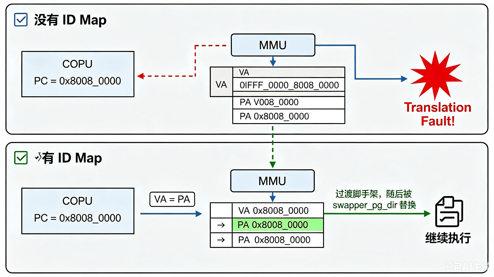
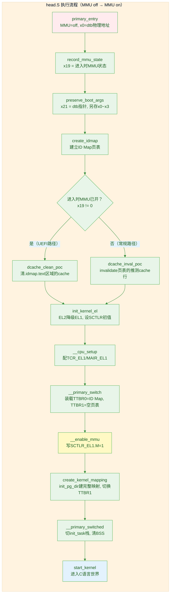

# 7.5.1 head.S：内核的汇编入口与MMU开启

> 所属章节：第7章 启动链深度解析 > 7.5 内核启动
> 
> 难度：[E] | 预计阅读时间：40分钟

## <span class="blue"> 本节导读

7.4 节结束时，U-Boot 把 dtb 的物理地址放进 x0、把 bootargs 写进 chosen 节点，然后一条跳转指令把 CPU 交给了内核镜像的入口地址。从这一跳到 `start_kernel()` 之间没有一行 C 代码——全部是汇编，而且要完成整条启动链上最危险的一个动作：在代码不停执行的同时打开 MMU，让同一个 PC 值的含义从物理地址切换成虚拟地址。这一步出任何差错，表现都是统一的：`Starting kernel ...` 之后黑屏。<BR>
本节覆盖：内核入口的硬件约定与三个全程专用的寄存器、MMU 与页表要解决什么问题、恒等映射（ID Map）为什么是开 MMU 的前提、head.S 从 `primary_entry` 到 `start_kernel` 的逐段路径、MMU 开启瞬间挂死的 JTAG 排查法。

---

## <span class="blue"> Starting kernel 之后黑屏：第一条指令从哪来 [E]

移植一块新的 ARM64 SoC，U-Boot 已确认 dtb 加载无误，`booti` 执行后串口打印 `Starting kernel ...`，然后彻底静默。接上 JTAG halt 住 CPU，PC 停在一个无效地址，回溯发现死在 `__primary_switch` 附近——MMU 开启的那个瞬间。

要搞清这一瞬间发生了什么，先得知道 U-Boot 跳转过来时 CPU 处于什么状态。这个状态不是随机的，内核文档 `Documentation/arm64/booting.rst` 把入口约定定死了：

```
进入内核入口时必须满足：
  - MMU = off，D-Cache = off（I-Cache 开不开均可）
  - x0 = dtb 的物理地址（U-Boot 放入）
  - CPU 运行在 EL1 或 EL2（由 ATF/UEFI 决定）
```

x0 里这份 dtb 就是 7.4 节 U-Boot 与内核双边协作的交付物，地址由 U-Boot 在跳转前最后一刻写入。内核真正执行的第一行代码在 `arch/arm64/kernel/head.S` 的 `primary_entry`——链接脚本把 `.head.text` 段放在内核镜像最前端，保证镜像入口就是它。

### 没读过汇编也能跟：只需要寄存器约定这一个背景知识

head.S 通篇没有编译器帮忙管理寄存器，作者只能手动约定。ARM64 的调用约定里，x19~x28 是"被调函数负责保存"的寄存器：调任何函数回来，它们的值都不会变。head.S 借此挑了三个寄存器全程专用，当作贯穿启动全程的数据锚点：

| 寄存器 | 作用域 | 用途 | 取值 |
|--------|--------|------|------|
| `x19` | `primary_entry` ~ `start_kernel` | 进入时 MMU 是否已开启 | `0` = MMU off，非 `0` = MMU on |
| `x20` | `primary_entry` ~ `__primary_switch` | CPU 启动模式 | `BOOT_CPU_MODE_EL1` 或 `EL2` |
| `x21` | `primary_entry` ~ `start_kernel` | dtb 指针 | 从入口参数 x0 保存而来 |

读 head.S 时以这三个寄存器为线索追踪数据流，代码脉络就清晰了。x21 尤其直观：汇编里的函数调用会随意覆盖 x0~x3，所以进门第一件事就是把 x0 里的 dtb 地址转移到 x21，之后任何阶段要用 dtb 都从这里取。

> ⚠️ 多数场景 U-Boot 跳转时 MMU 是关的，但 UEFI 启动路径跳进来时 MMU 可能已开。head.S 的 `record_mmu_state` 就是为此存在：读 `SCTLR_ELx` 的 M/C 位，把状态存进 x19，后续 cache 维护路径据此分流——MMU 原本开着就清 cache，原本关着就做 invalidate，两条路不能搞反。

---

## <span class="blue"> 开 MMU 为什么是最危险的一步 [E]

### MMU 解决什么问题

内核和每个用户程序都希望以为自己独占内存、从固定的虚拟地址开始摆放代码和数据，而硬件上只有一份物理内存。MMU（Memory Management Unit，内存管理单元）就是夹在中间的翻译官：CPU 发出的每个地址都先经它查表翻译，程序看到的虚拟地址这才落到真实的物理地址上。这本"翻译字典"叫页表（page table），是内存里一片多级索引结构，每一项记录"某段虚拟地址对应哪段物理地址、可读可写可执行"。

ARM64 用两个页表基址寄存器分工：`TTBR0_EL1` 指向低地址空间（用户态）的页表，`TTBR1_EL1` 指向高地址空间（内核态）的页表。开 MMU 前，必须把页表建好、把基址写进这两个寄存器。

### 危险在哪：PC 的值没变，含义变了

开 MMU 的本质是写 `SCTLR_EL1` 的 M 位。这条写指令执行完，正在运行的代码立刻踩进一个语义断层：

```
开启MMU前：
  PC = 0x8008_0000（物理地址，MMU off 时地址不经过翻译）

假设直接使用内核虚拟映射（VA 0xFFFF... → PA 0x8008_0000）：
  MMU开启瞬间，硬件把 PC 值 0x8008_0000 当虚拟地址去查页表
  页表里只有 0xFFFF_0000_8008_0000 的项 → 查无此项
  → Translation Fault，当场死亡

有恒等映射时：
  页表里多一项：VA 0x8008_0000 → PA 0x8008_0000（VA = PA）
  MMU开启瞬间，PC 值 0x8008_0000 查表命中 → 物理地址还是 0x8008_0000
  → 取指不受影响，执行流无缝续上
```

恒等映射（Identity Mapping，简称 ID Map）就是"虚拟地址 = 物理地址"的映射。它不是内核的长期内存布局，只是一个临时映射：仅在 MMU 开启前后的一瞬间承接 PC，等真正的内核页表就位后就被替换。但这个临时映射决定启动的生死——缺了它，开 MMU 这条指令就是执行流的终点。



### ID Map 要覆盖多大范围

够用就好。v6.6 里这件事由 head.S 里的汇编函数 `create_idmap` 完成，它建三条映射：

| 映射对象 | 覆盖范围 | 权限 | 说明 |
|----------|----------|------|------|
| 内核镜像 + 保留窗口 | `_text` ~ `_end + MAX_FDT_SIZE + SWAPPER_BLOCK_SIZE` | R-X | 1:1 恒等映射，紧跟 `_end` 的窗口留给 FDT 和页表 |
| 页表自身 | `init_pg_dir` ~ `init_pg_end` | RW | 开 MMU 后还要改页表，得能写 |
| FDT | 重映射到 `_end` 后的窗口内 | RW | 注意不是 1:1——dtb 自己的物理地址不进页表 |

真实代码的核心就是三个映射调用（`map_memory` / `remap_region` 是 head.S 里的汇编宏）：

```asm
/* arch/arm64/kernel/head.S - create_idmap（v6.6，节录） */
SYM_FUNC_START_LOCAL(create_idmap)
	/* 1. 恒等映射：_text 到 _end + FDT窗口 + 页表窗口，VA = PA */
	adrp	x0, init_idmap_pg_dir
	adrp	x3, _text
	adrp	x6, _end + MAX_FDT_SIZE + SWAPPER_BLOCK_SIZE
	map_memory x0, x1, x3, x6, ...

	/* 2. 页表自身在恒等映射里重标为可写 */
	adrp	x2, init_pg_dir
	adrp	x3, init_pg_end
	bl	remap_region

	/* 3. FDT 重映射到紧跟内核镜像的窗口（bfi 拼接出窗口内地址） */
	bfi	x22, x21, #0, #SWAPPER_BLOCK_SHIFT	// remapped FDT address
	bl	remap_region

	/* 4. MMU 关着填的页表不在 cache 里，invalidate 掉推测读入的行 */
	cbnz	x19, 0f				// MMU 原本开着则跳过
	bl	dcache_inval_poc
0:	ret	x28
SYM_FUNC_END(create_idmap)
```

FDT 这条值得停一下：dtb 不需要在自己的物理地址上拥有映射——它被重映射到紧跟内核镜像的窗口里，KASLR 早期初始化按窗口地址读它，再往后 `early_fdt_map` 会经 fixmap 正式映射。这个设计把"dtb 必须放在哪"的约束卸掉了，U-Boot 把它放在任何合法内存都行。

> 💡 Linux 6.9 起这套逻辑被重构为 C 实现（`arch/arm64/kernel/pi/map_kernel.c` 的 `__pi_create_init_idmap`），函数名和文件都变了，但三条映射的职责划分没变。读新版本内核时按"镜像 1:1、页表可写、FDT 进窗口"这三条去对，就不会迷路。

页表本身存放在链接脚本预留的 `.init.data` 区域（`init_idmap_pg_dir` 到 `init_idmap_pg_end`）。选这里有个讲究：这段内存不属于 BSS，不需要清零就可用——ID Map 的创建发生在 BSS 清零之前，不能依赖任何"BSS 已清零"的假设。

> ⚠️ `__enable_mmu` 本身的代码放在专门的 `.idmap.text` 段里，这个段必须落在 ID Map 覆盖范围内。如果改链接脚本时把它挪出了 `_text`~`_end`，MMU 一开，执行流正在取指的代码自己就先查不到映射了。

### ID Map 退场后谁接手：swapper_pg_dir

ID Map 只负责过渡。MMU 借 ID Map 打开之后，head.S 紧接着在 `init_pg_dir` 中建立完整的内核虚拟映射（内核镜像的高端虚拟地址 + 物理内存线性映射），并把 `TTBR1_EL1` 从空页表切过去。`init_pg_dir` 同样只是过渡品：`paging_init()` 阶段内核用 `cpu_replace_ttbr1()` 把 TTBR1 再切到 0 号进程的主页表 `swapper_pg_dir`，随后释放 `init_pg_dir` 占的内存。完整的三段接力：

| 阶段 | 页表 | 覆盖范围 | 目的 |
|------|------|----------|------|
| 第一段 | `init_idmap_pg_dir`（TTBR0） | 内核镜像 1:1 + FDT 窗口，VA=PA | 开 MMU 瞬间 PC 不失效 |
| 第二段 | `init_pg_dir`（TTBR1） | 内核高端虚拟地址 + 线性映射 | 撑过启动早期的完整映射 |
| 第三段 | `swapper_pg_dir`（TTBR1） | `paging_init()` 时接管同上映射 | 内核长期运行的地址空间 |

---

## <span class="blue"> head.S 逐段走读：四步从汇编世界走进 C 世界 [E]

把入口约定和 ID Map 拼起来，`primary_entry` 到 `start_kernel` 的完整路径如下：


```mermaid
%%{init: {'theme': 'base', 'themeVariables': { 'primaryColor': '#e8f5e9', 'primaryTextColor': '#1b5e20', 'primaryBorderColor': '#4caf50', 'lineColor': '#388e3c', 'secondaryColor': '#e3f2fd', 'tertiaryColor': '#fff3e0'}}}%%
graph TD
    subgraph "head.S 执行流程（MMU off → MMU on）"
        direction TB
        A["primary_entry<br/>MMU=off, x0=dtb物理地址"] --> B["record_mmu_state<br/>x19 = 进入时MMU状态"]
        B --> C["preserve_boot_args<br/>x21 = dtb指针, 另存x0~x3"]
        C --> D["create_idmap<br/>建立ID Map页表"]
        D --> E{"进入时MMU已开？<br/>x19 != 0"}
        E -->|"是（UEFI路径）"| F["dcache_clean_poc<br/>清.idmap.text区域的cache"]
        E -->|"否（常规路径）"| G["dcache_inval_poc<br/>invalidate页表的推测cache行"]
        F --> H["init_kernel_el<br/>EL2降级EL1, 设SCTLR初值"]
        G --> H
        H --> I["__cpu_setup<br/>配TCR_EL1/MAIR_EL1"]
        I --> J["__primary_switch<br/>装载TTBR0=ID Map, TTBR1=空页表"]
        J --> K["__enable_mmu<br/>写SCTLR_EL1.M=1"]
        K --> L["create_kernel_mapping<br/>init_pg_dir建完整映射, 切换TTBR1"]
        L --> M["__primary_switched<br/>切init_task栈, 清BSS"]
        M --> N["start_kernel<br/>进入C语言世界"]
    end

    style A fill:#ffebee
    style K fill:#fff9c4
    style M fill:#e8f5e9
    style N fill:#e3f2fd
```

逐段看每一步在干什么。

### 第一步：记下来时状态，收好 U-Boot 的交付物

```asm
SYM_CODE_START(primary_entry)
    bl  record_mmu_state        /* x19 = 进入时MMU是否开启 */
    bl  preserve_boot_args      /* x21 = dtb指针，x0~x3存入boot_args[] */
```

进门先做两件保命的事。`record_mmu_state` 读 `SCTLR` 判 MMU/cache 状态存入 x19，区分"冷启动"和"UEFI 带着 MMU 跳进来"两种场景。`preserve_boot_args` 把 x0~x3 原样存到 `boot_args[]` 数组，并把 dtb 地址固定在 x21——后面的调用会覆盖 x0~x3，不先收好就永远丢了。

### 第二步：建 ID Map 页表

`create_idmap` 按上一节的范围表建映射。这一步做完，开 MMU 的"着陆垫"就铺好了。cache 维护按 x19 分流，两条路恰好相反：MMU 原本开着（UEFI 路径），`.idmap.text` 区域可能留着脏数据，要 clean 回内存；MMU 原本关着（常规路径），填页表走的是非缓存访问，cache 里可能有推测读入的旧行，要把页表区域 invalidate 掉。

### 第三步：异常级别归位，配好 MMU 的"翻译规则"

7.1.1 讲过 ARM64 的异常级别：EL3 跑安全固件，EL1 跑内核。U-Boot 常把 CPU 留在 EL2 跳进来，`init_kernel_el` 负责配置 EL2 状态后用 `ERET` 指令降级回 EL1；已在 EL1 则直接设 `SCTLR_EL1` 的初值。

接着 `__cpu_setup`（在 `arch/arm64/mm/proc.S`）配置两个 MMU 的"翻译规则"寄存器：`TCR_EL1` 定义页表长什么样——几级页表、页多大（4KB/16KB/64KB）、虚拟地址多少位；`MAIR_EL1` 定义内存属性索引——哪类内存可缓存、哪类是设备内存。这两项不就位，页表写得再对，硬件也不知道怎么查。

### 第四步：开 MMU，换轨到虚拟地址世界

`__primary_switch` 是全套动作的高潮，拆成三拍看。第一拍，装弹——把两张页表的基址准备好：

```asm
SYM_FUNC_START_LOCAL(__primary_switch)
    adrp    x1, reserved_pg_dir         /* TTBR1先指向一张空页表 */
    adrp    x2, init_idmap_pg_dir       /* TTBR0指向ID Map页表 */
    bl      __enable_mmu                /* 开MMU */
```

`adrp` 是取符号所在页的基地址，这里把 ID Map 页表装进 x2、一张空页表装进 x1。TTBR1 此时给空页表是有意的：高地址空间还没建映射，给空表保证任何误访问立即报错，而不是静默读错数据。

第二拍，击发——`__enable_mmu` 内部：

```asm
SYM_FUNC_START(__enable_mmu)
    /* 1. 确认CPU支持当前配置的页大小（读ID_AA64MMFR0_EL1） */
    ...
    /* 2. TTBR0_EL1 ← ID Map页表基址（物理地址） */
    phys_to_ttbr x2, x2
    msr     ttbr0_el1, x2
    /* 3. TTBR1_EL1 ← 空页表 */
    load_ttbr1 x1, x1, x3
    /* 4. 写SCTLR_EL1，M位置1，MMU开启 */
    set_sctlr_el1   x0
    ret                             /* 返回时已在MMU on的世界 */
SYM_FUNC_END(__enable_mmu)
```

`set_sctlr_el1` 宏展开是 `msr sctlr_el1, x0` 加一条 `isb`（指令同步屏障）。这条 `isb` 绝对省不得：ARM 架构不保证写完 `SCTLR` 后下一条指令一定按新状态取指，没有屏障，流水线里预取的旧指令可能按旧状态执行，行为不可预测。

> 🔴 写 `SCTLR_EL1.M` 之前必须逐项确认：TTBR0/TTBR1 已装载有效页表、`TCR_EL1` 与 `MAIR_EL1` 已配置、页表写入已用 `DSB` 屏障刷出、`ISB` 已同步。任何一项遗漏，MMU 开启瞬间就是不可恢复的 Translation Fault——开头那块黑屏板子的死法。

第三拍，换轨——从 `__enable_mmu` 返回后，PC 的数值没变，但已经是经 ID Map 翻译的虚拟地址了。剩下的事是把这个世界换成永久的：

```asm
    bl      clear_page_tables           /* 清掉init_pg_dir里的临时残留 */
    bl      create_kernel_mapping       /* 建完整的内核映射 */

    adrp    x1, init_pg_dir
    load_ttbr1 x1, x1, x2               /* TTBR1从空页表切到完整映射 */

    ldr     x8, =__primary_switched     /* 目标的虚拟地址 */
    adrp    x0, KERNEL_START
    br      x8                          /* 跳进高端虚拟地址，不再回来 */
```

`create_kernel_mapping` 在 `init_pg_dir` 里建好内核的完整虚拟映射，`load_ttbr1` 随即把 TTBR1 从那张空页表切过来。最后 `br x8` 一跳，PC 第一次落在高端虚拟地址上——物理地址世界彻底退场。`__primary_switched` 接手后用 `init_cpu_task` 宏切到 `init_task` 的栈、保存 dtb 指针、清 BSS，然后 `bl start_kernel`，汇编的使命结束。

### SCTLR_EL1：启动阶段要认识的几个位

`SCTLR_EL1` 是 EL1 的系统控制总开关，启动阶段涉及的关键位：

| 位 | 名称 | 功能 | Linux 的设置 |
|----|------|------|-------------|
| `[0]` | M | MMU 使能 | `__enable_mmu` 置 1 |
| `[1]` | A | 数据访问对齐检查 | 置 1，抓未对齐访问 |
| `[2]` | C | D-Cache 使能 | 与 M 同时置 1 |
| `[3]` | SA | SP 16 字节对齐检查 | 置 1，抓栈破坏 |
| `[12]` | I | I-Cache 使能 | 较早开启 |
| `[19]` | WXN | 可写区域自动不可执行 | 安全加固置 1 |

> 💡 D-Cache 比 I-Cache 更容易出事。没有 MMU 时 D-Cache 无法正确处理别名和一致性问题，所以 MMU off 阶段 Linux 保持 D-Cache 关闭，直到 M 位和 C 位同时打开。启动日志里若怀疑 cache 一致性，先确认这两个位是不是同时置的。

---

## <span class="blue"> 卡在 MMU 开启瞬间：一块 RK3568 的排查记录 [I→E]

回到开头的故障。JTAG 在 `__enable_mmu` 设断点，单步走到写 `SCTLR_EL1` 前后，逐项核对：

```
(gdb) break *__enable_mmu
(gdb) continue

/* 看TTBR0，应是ID Map页表的物理地址 */
(gdb) monitor mrc 0 0 1 0 0
TTBR0_EL1 = 0x0000000000A03000

/* 看页表内容，至少第一项应非零 */
(gdb) x/4gx 0x0000000000A03000
0xA03000:   0x0000000000A03407  0x0000000000000000

/* 看即将写入的SCTLR值（x0） */
(gdb) info registers x0
x0: 0x34D5D91D

/* 单步执行写入，确认M/C/I位生效 */
(gdb) stepi
(gdb) info registers sctlr_el1
sctlr_el1: 0x34D5D91D
```

TTBR0、页表、SCTLR 全部正常，但 `ret` 之后 PC 依然飞了。把 ID Map 的映射项逐条 dump 出来对照地址，根因浮现：这块板子的启动流程绕过了 `booti`，手工把内核镜像加载到了 `0x8028_0000`——不满足 ARM64 启动协议要求的 2MB 对齐（`booting.rst` 的硬性条款，head.S 顶部也直接写着 `#error PAGE_OFFSET must be at least 2MB aligned`）。`create_idmap` 按对齐后的符号地址建映射，镜像实际摆放偏了一段，导致正在执行的代码有一部分落在映射窗口外——MMU 一开，取指即 Translation Fault。

修复很简单：把内核镜像的加载地址改到 2MB 对齐处（走 `booti` 时 U-Boot 会自己处理对齐，手工搬镜像再裸跳时才容易踩到）。这也是协议类故障的典型画像：寄存器、页表、cache 逐项看都对，唯独"前提假设成立"这件事本身被违反了。

这套排查动作可以固化成一份清单，遇到"MMU 开启瞬间死机"逐项打勾：

- 内核镜像加载地址满足 2MB 对齐（协议前提，最容易被当作默认成立而漏查）
- TTBR0 指向正确的 ID Map 页表物理地址
- 页表首项非全零（至少第一个表项有效）
- ID Map 覆盖范围包含当前 PC，`.idmap.text` 全段在内
- SCTLR 写入后紧跟 ISB
- 进入时 MMU 已开 → 走了 `dcache_clean_poc`；已关 → 走了 `dcache_inval_poc`，两者没接反

> 💡 这份清单的检查顺序就是从简到繁的成本顺序：寄存器一眼能看，页表要 dump 内存，cache 路径要对照代码。前四项能解决绝大多数"开 MMU 即死"的问题。

---

## <span class="blue"> 本节总结

| 要点 | 内容 |
|------|------|
| **入口约定** | MMU off、D-Cache off、x0 = dtb 物理地址、EL1 或 EL2；dtb 即 7.4 节的交付物 |
| **三个锚点寄存器** | x19（MMU 来时状态）、x20（启动模式）、x21（dtb 指针），callee-saved 全程专用 |
| **MMU 与页表** | 虚拟地址到物理地址的翻译机制；TTBR0 管低地址空间，TTBR1 管内核高地址空间 |
| **ID Map 恒等映射** | VA=PA 的临时映射，保证开 MMU 瞬间 PC 查表命中；内核镜像 1:1 覆盖，FDT 重映射到 `_end` 后窗口 |
| **三段式页表接力** | `init_idmap_pg_dir`（开 MMU）→ `init_pg_dir`（启动早期完整映射）→ `swapper_pg_dir`（paging_init 接管） |
| **MMU 开启点** | `__enable_mmu` 内 `msr sctlr_el1, x0; isb`；ISB 不可省 |
| **开启前置条件** | TTBR 已装载、TCR/MAIR 已配、DSB/ISB 已执行，缺一不可 |
| **排查路径** | JTAG 断点 `__enable_mmu`，按"寄存器 → 页表 → 覆盖范围 → cache 路径"逐项核对 |

> 🔴 head.S 是整条启动链上唯一一段"代码在跑、地址空间在换"的路径。调试它的核心认知只有一条：开 MMU 前后 PC 的数值没变、含义变了，一切诡异死法都从这个语义断层里长出来。

---

## <span class="blue"> 下一步

`bl start_kernel` 执行后，汇编世界退场，C 世界开场。7.5.2 走进 `start_kernel()` 内部：近百个初始化调用怎么读（七阶段分组法）、顺序为什么换不得（三条依赖链）、以及拿到任意一行启动日志怎么对应回源码位置。

---

## <span class="blue"> 延伸阅读

- Linux 内核源码：`arch/arm64/kernel/head.S`（完整入口逻辑）
- Linux 内核源码：`arch/arm64/kernel/pi/map_kernel.c`（ID Map 的 C 实现，6.9+）
- Linux 内核源码：`arch/arm64/mm/proc.S`（`__cpu_setup`，TCR/MAIR 配置）
- Linux 内核文档：`Documentation/arm64/booting.rst`（入口约定）
- ARM Architecture Reference Manual："SCTLR_EL1" 与 "Translation table descriptor format" 章节
- 链接脚本：`arch/arm64/kernel/vmlinux.lds.S`（`.idmap.text` 与 `INIT_IDMAP_DIR_SIZE`）
